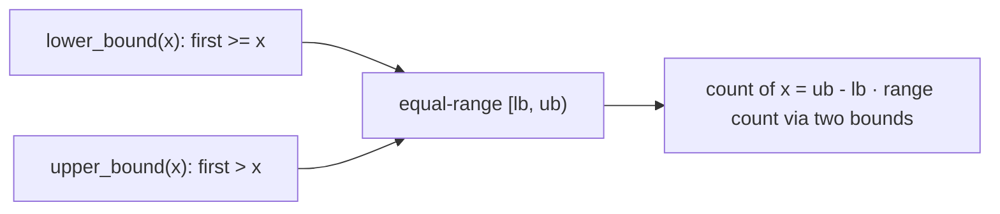

# Pattern: Upper Bound

## Why It Exists

[Upper bound's mechanics](/cortex/data-structures-and-algorithms/sorting-and-searching/searching/upper-bound) — the same half-open template as lower bound with `≤` instead of `<` — land you on the first index *strictly greater* than the target. This lesson is about **recognizing** when that's what a problem needs.

The triggers: "**first index `>` x**", "**just past the last** occurrence", "**how many** elements are in range `[a, b]`", "the **ceiling** (smallest element strictly greater)", or the **breaking index** of a `true → false` monotone condition. The headline use is **counting**: paired with [lower bound](/cortex/data-structures-and-algorithms/sorting-and-searching/searching/pattern-lower-bound/pattern), `upper_bound − lower_bound` is the count of a value, and bounds of two endpoints count a range — all `O(log n)`.

## See It Work

In `[1, 3, 3, 5, 7]`, find the first index `> 3` using upper bound. Run it.

```python run viz=array
import ast

def upper_bound(arr, target):
    lo, hi = 0, len(arr)
    while lo < hi:
        mid = lo + (hi - lo) // 2
        if arr[mid] <= target:           # <= : step past elements EQUAL to target
            lo = mid + 1
        else:
            hi = mid
    return lo                            # first index with arr[index] > target

arr = ast.literal_eval(input())
target = int(input())
print(upper_bound(arr, target))
```

```java run viz=array
import java.util.*;

public class Main {
    static int upperBound(int[] arr, int target) {
        int lo = 0, hi = arr.length;
        while (lo < hi) {
            int mid = lo + (hi - lo) / 2;
            if (arr[mid] <= target) lo = mid + 1;  // <= : step past equals
            else hi = mid;
        }
        return lo;
    }

    public static void main(String[] args) {
        Scanner sc = new Scanner(System.in);
        int[] arr = parseIntArray(sc.nextLine());
        int target = Integer.parseInt(sc.nextLine().trim());
        System.out.println(upperBound(arr, target));
    }

    static int[] parseIntArray(String line) {
        String inner = line.replaceAll("[\\[\\]\\s]", "");
        if (inner.isEmpty()) return new int[0];
        String[] parts = inner.split(",");
        int[] out = new int[parts.length];
        for (int i = 0; i < parts.length; i++) out[i] = Integer.parseInt(parts[i]);
        return out;
    }
}
```

```testcases
{
  "args": [
    { "id": "arr", "label": "arr", "type": "int[]", "placeholder": "[1, 3, 3, 5, 7]" },
    { "id": "target", "label": "target", "type": "int", "placeholder": "3" }
  ],
  "cases": [
    { "args": { "arr": "[1, 3, 3, 5, 7]", "target": "3" }, "expected": "3" },
    { "args": { "arr": "[1, 3, 3, 5, 7]", "target": "5" }, "expected": "4" },
    { "args": { "arr": "[1, 3, 3, 5, 7]", "target": "0" }, "expected": "0" },
    { "args": { "arr": "[1, 3, 3, 5, 7]", "target": "7" }, "expected": "5" }
  ]
}
```

## How It Works

The recognition checklist for upper bound:

1. Data (or a derived value) is **sorted / monotone**.
2. You want the position **just past** the last match — "first `> x`", the ceiling, or the `true → false` breaking point.
3. Often the real goal is a **count** or a **range**, not the position itself.

The template is lower bound with one operator changed (`≤`), so equal elements are skipped to the right and you land just past them.



<p align="center"><strong>upper bound returns the boundary just past the last match; with lower bound it brackets the equal-range, whose width is the count.</strong></p>

The pair `[lower_bound(x), upper_bound(x))` is exactly the block of elements equal to `x`, so its width is the count; `lower_bound(b) − lower_bound(a)` counts `[a, b)`. The **ceiling** of `x` (smallest element strictly greater) sits at `upper_bound(x)` (when that index is in range). All `O(log n)`, `O(1)` space — the same template, just read differently.

### Key Takeaway

Recognize upper bound by "first `> x` / ceiling / count / range / breaking point of `true→false`." It's lower bound with `≤`. Its real power is paired counting: `upper_bound − lower_bound` is a value's count, and two bounds count any range — all `O(log n)`.

## Trace It

Counting elements in the range `[3, 5]` of `[1, 3, 3, 5, 7]` using the bounds:

| call | result | meaning |
|---|---|---|
| `lower_bound(a, 3)` | `1` | first index `≥ 3` |
| `upper_bound(a, 5)` | `4` | first index `> 5` |
| difference | `4 − 1 = 3` | count in `[3, 5]` (the values `3, 3, 5`) |

Before you read on: counting the *single* value `3` uses `upper_bound(3) − lower_bound(3)`, but counting the *range* `[3, 5]` uses `upper_bound(5) − lower_bound(3)` — note it mixes an upper bound of one endpoint with a lower bound of the other. Why that particular combination?

Because you want everything `≥ 3` **and** `≤ 5`. `lower_bound(3)` is the first index `≥ 3` — the left edge of "in range." `upper_bound(5)` is the first index `> 5` — i.e. just past the right edge of "≤ 5." So `[lower_bound(3), upper_bound(5))` is exactly the half-open span of elements in `[3, 5]`, and its width is the count. Using `lower_bound(5)` instead would *exclude* the 5s (it stops at the first 5), and `upper_bound(3)` would exclude the 3s' right neighbors incorrectly. The rule: **lower bound for the inclusive *left* edge, upper bound for the inclusive *right* edge** — each bound is chosen so the half-open interval `[lb(left), ub(right))` captures precisely the closed range `[left, right]`. Getting this pairing right is the whole art of range-counting with binary search.

## Your Turn

Implement `count_in_range(arr, a, b)` — count of elements in the closed range `[a, b]` — using upper bound and lower bound.

```python run viz=array
import ast

def lower_bound(arr, t):
    # Your code goes here — first index where arr[i] >= t
    return 0

def upper_bound(arr, t):
    # Your code goes here — first index where arr[i] > t
    return len(arr)

def count_in_range(arr, a, b):
    # Your code goes here — upper_bound(b) - lower_bound(a)
    return 0

arr = ast.literal_eval(input())
a = int(input())
b = int(input())
print(count_in_range(arr, a, b))
```

```java run viz=array
import java.util.*;

public class Main {
    static int lowerBound(int[] arr, int t) {
        // Your code goes here — first index where arr[i] >= t
        return 0;
    }

    static int upperBound(int[] arr, int t) {
        // Your code goes here — first index where arr[i] > t
        return arr.length;
    }

    static int countInRange(int[] arr, int a, int b) {
        // Your code goes here — upperBound(b) - lowerBound(a)
        return 0;
    }

    public static void main(String[] args) {
        Scanner sc = new Scanner(System.in);
        int[] arr = parseIntArray(sc.nextLine());
        int a = Integer.parseInt(sc.nextLine().trim());
        int b = Integer.parseInt(sc.nextLine().trim());
        System.out.println(countInRange(arr, a, b));
    }

    static int[] parseIntArray(String line) {
        String inner = line.replaceAll("[\\[\\]\\s]", "");
        if (inner.isEmpty()) return new int[0];
        String[] parts = inner.split(",");
        int[] out = new int[parts.length];
        for (int i = 0; i < parts.length; i++) out[i] = Integer.parseInt(parts[i]);
        return out;
    }
}
```

```testcases
{
  "args": [
    { "id": "arr", "label": "arr", "type": "int[]", "placeholder": "[1, 3, 3, 5, 7, 7, 7]" },
    { "id": "a", "label": "a", "type": "int", "placeholder": "3" },
    { "id": "b", "label": "b", "type": "int", "placeholder": "5" }
  ],
  "cases": [
    { "args": { "arr": "[1, 3, 3, 5, 7, 7, 7]", "a": "3", "b": "5" }, "expected": "3" },
    { "args": { "arr": "[1, 3, 3, 5, 7, 7, 7]", "a": "7", "b": "7" }, "expected": "3" },
    { "args": { "arr": "[1, 3, 3, 5, 7, 7, 7]", "a": "1", "b": "7" }, "expected": "7" },
    { "args": { "arr": "[1, 3, 3, 5, 7]", "a": "3", "b": "3" }, "expected": "2" }
  ]
}
```

<details>
<summary>Editorial</summary>

Lower bound (`<`) skips past elements smaller than `t` and lands on the first `≥ t`; upper bound (`≤`) additionally skips equals and lands on the first `> t`. `count_in_range(arr, a, b)` is the width of the half-open span `[lb(a), ub(b))`. `O(log n)` per query, `O(1)` space.

```python solution time=O(log n) space=O(1)
import ast

def lower_bound(arr, t):
    lo, hi = 0, len(arr)
    while lo < hi:
        mid = lo + (hi - lo) // 2
        if arr[mid] < t: lo = mid + 1
        else: hi = mid
    return lo

def upper_bound(arr, t):
    lo, hi = 0, len(arr)
    while lo < hi:
        mid = lo + (hi - lo) // 2
        if arr[mid] <= t: lo = mid + 1
        else: hi = mid
    return lo

def count_in_range(arr, a, b):           # number of elements in [a, b]
    return upper_bound(arr, b) - lower_bound(arr, a)

arr = ast.literal_eval(input())
a = int(input())
b = int(input())
print(count_in_range(arr, a, b))
```

```java solution
import java.util.*;

public class Main {
    static int lowerBound(int[] a, int t) {
        int lo = 0, hi = a.length;
        while (lo < hi) { int m = lo + (hi - lo) / 2; if (a[m] < t) lo = m + 1; else hi = m; }
        return lo;
    }
    static int upperBound(int[] a, int t) {
        int lo = 0, hi = a.length;
        while (lo < hi) { int m = lo + (hi - lo) / 2; if (a[m] <= t) lo = m + 1; else hi = m; }
        return lo;
    }

    static int countInRange(int[] arr, int a, int b) {
        return upperBound(arr, b) - lowerBound(arr, a);
    }

    public static void main(String[] args) {
        Scanner sc = new Scanner(System.in);
        int[] arr = parseIntArray(sc.nextLine());
        int a = Integer.parseInt(sc.nextLine().trim());
        int b = Integer.parseInt(sc.nextLine().trim());
        System.out.println(countInRange(arr, a, b));
    }

    static int[] parseIntArray(String line) {
        String inner = line.replaceAll("[\\[\\]\\s]", "");
        if (inner.isEmpty()) return new int[0];
        String[] parts = inner.split(",");
        int[] out = new int[parts.length];
        for (int i = 0; i < parts.length; i++) out[i] = Integer.parseInt(parts[i]);
        return out;
    }
}
```

</details>

Drill the family in **Practice** — [Limit Count](/cortex/data-structures-and-algorithms/sorting-and-searching/searching/pattern-upper-bound/problems/limit-count), [Positive Index](/cortex/data-structures-and-algorithms/sorting-and-searching/searching/pattern-upper-bound/problems/positive-index), [Ceiling Index](/cortex/data-structures-and-algorithms/sorting-and-searching/searching/pattern-upper-bound/problems/ceiling-index), and [Breaking Index](/cortex/data-structures-and-algorithms/sorting-and-searching/searching/pattern-upper-bound/problems/breaking-index).

## Reflect & Connect

Upper bound completes the boundary-search toolkit:

- **The family** — first `> x`, the ceiling (`upper_bound(x)`), count of a value (`upper − lower`), count in a range (`upper_bound(b) − lower_bound(a)`), and the breaking point of a `true → false` condition.
- **Pairing is the power** — almost no one needs upper bound *alone*; it earns its keep with [lower bound](/cortex/data-structures-and-algorithms/sorting-and-searching/searching/pattern-lower-bound/pattern) to bracket and count. Memorize the left=lower, right=upper rule for closed ranges.
- **`< ` vs `≤` is the one decision** — lower bound (`<`) lands on the first match, upper bound (`≤`) lands just past the last. Picking the wrong one is the classic off-by-one in counts; tie the choice to "do I want the first equal element, or one past the last?"

**Prerequisites:** [Upper Bound](/cortex/data-structures-and-algorithms/sorting-and-searching/searching/upper-bound).

## Recall

> **Mnemonic:** *"First > x / ceiling / count / range / true→false break" → upper bound (lower bound with `≤`). `upper − lower` = count. Range `[a,b]`: `upper(b) − lower(a)`.*

| | |
|---|---|
| Recognize | "first `> x` / ceiling / count / range / breaking index" |
| Predicate | `arr[mid] <= target` → go right (skip equals) |
| Returns | first index `> target` (just past the last match) |
| Counting | value: `upper(x) − lower(x)`; range `[a,b]`: `upper(b) − lower(a)` |
| Cost | `O(log n)`, `O(1)` space |

<details>
<summary><strong>Q:</strong> What signals an upper-bound problem?</summary>

**A:** "First `> x`," the ceiling, a count of a value or range, or the `true → false` breaking point.

</details>
<details>
<summary><strong>Q:</strong> How do you count elements in the closed range `[a, b]`?</summary>

**A:** `upper_bound(b) − lower_bound(a)` — lower bound for the inclusive left edge, upper bound for the inclusive right edge.

</details>
<details>
<summary><strong>Q:</strong> What's the only code difference from lower bound?</summary>

**A:** `arr[mid] <= target` (instead of `<`), so equal elements are skipped to the right.

</details>
<details>
<summary><strong>Q:</strong> Why is upper bound rarely used alone?</summary>

**A:** Its power is in the *pair* with lower bound — bracketing a value and counting ranges.

</details>

## Sources & Verify

- **Sedgewick & Wayne**, *Algorithms*, 4th ed., §3.1 — rank / range queries in ordered symbol tables.
- **C++ STL / Python `bisect`** — `upper_bound` / `bisect_right` and `equal_range` define these contracts.
- The recognition triggers and range-count pairing are standard; both runnable blocks are verified by running (`upper_bound([1,3,3,5,7],3)=3`; `count_in_range([1,3,3,5,7,7,7],3,5)=3`).
