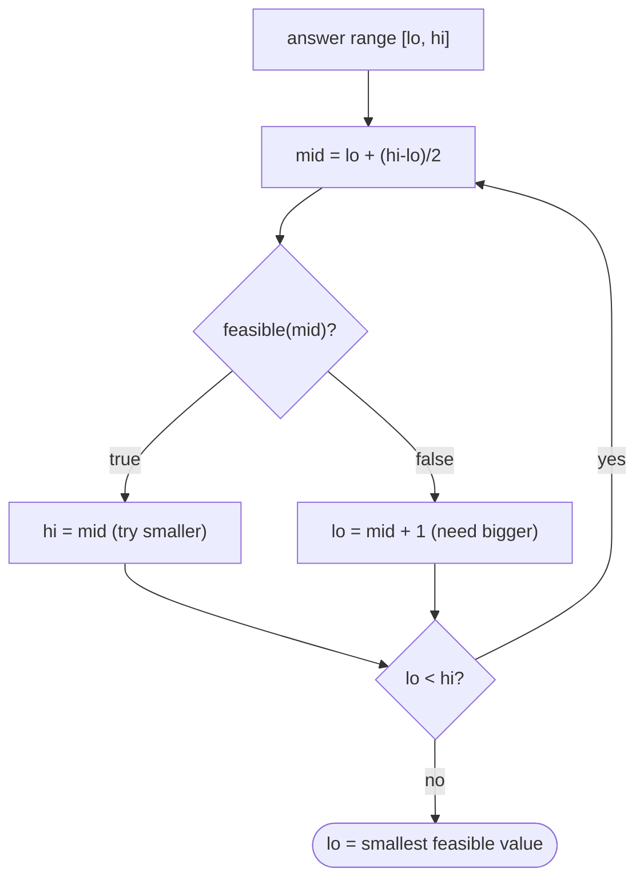

# Pattern: Minimum Predicate Search

## Why It Exists

Binary search is usually taught on a sorted array, but its real requirement isn't an array — it's **monotonicity**. A huge class of optimization problems has a monotone *feasibility predicate*: "is a truck of capacity `X` enough to ship everything in `D` days?" is **false** for small `X` and **true** once `X` is big enough — `false … false, true … true`. The answer is the *smallest* `X` that's feasible.

There's no array to search — so you binary-search the **answer range** itself. Pick a `mid` capacity, ask `feasible(mid)?`, and discard half the range based on the yes/no. This is "binary search on the answer," and it turns problems that look like they need search or DP into a tidy `O(log(range))` loop. Recognizing the hidden monotone predicate is the senior-level skill.

## See It Work

Koko eats bananas: piles `[3, 6, 7, 11]`, and she must finish within `h = 8` hours. At speed `k` per hour, a pile of `p` takes `⌈p/k⌉` hours. Find the **minimum** speed `k`. Run it.

```python run viz=array
import ast, math

def min_eating_speed(piles, h):
    def feasible(k):                          # can she finish within h hours at speed k?
        return sum(math.ceil(p / k) for p in piles) <= h
    lo, hi = 1, max(piles)                    # answer range: speed in [1, max pile]
    while lo < hi:
        mid = lo + (hi - lo) // 2
        if feasible(mid):
            hi = mid                          # feasible → maybe a smaller speed works
        else:
            lo = mid + 1                      # too slow → need faster
    return lo                                  # smallest feasible speed

piles = ast.literal_eval(input())
h = int(input())
print(min_eating_speed(piles, h))
```

```java run viz=array
import java.util.*;

public class Main {
    static boolean feasible(int[] piles, int k, int h) {
        long hours = 0;
        for (int p : piles) hours += (p + k - 1) / k;   // ceil(p/k)
        return hours <= h;
    }
    static int minEatingSpeed(int[] piles, int h) {
        int lo = 1, hi = 0;
        for (int p : piles) hi = Math.max(hi, p);
        while (lo < hi) {
            int mid = lo + (hi - lo) / 2;
            if (feasible(piles, mid, h)) hi = mid;
            else lo = mid + 1;
        }
        return lo;
    }
    public static void main(String[] args) {
        Scanner sc = new Scanner(System.in);
        int[] piles = parseIntArray(sc.nextLine());
        int h = Integer.parseInt(sc.nextLine().trim());
        System.out.println(minEatingSpeed(piles, h));
    }
    static int[] parseIntArray(String line) {
        String inner = line.replaceAll("[\\[\\]\\s]", "");
        if (inner.isEmpty()) return new int[0];
        String[] parts = inner.split(",");
        int[] out = new int[parts.length];
        for (int i = 0; i < parts.length; i++) out[i] = Integer.parseInt(parts[i]);
        return out;
    }
}
```

```testcases
{
  "args": [
    { "id": "piles", "label": "piles", "type": "int[]", "placeholder": "[3, 6, 7, 11]" },
    { "id": "h", "label": "h", "type": "int", "placeholder": "8" }
  ],
  "cases": [
    { "args": { "piles": "[3, 6, 7, 11]", "h": "8" }, "expected": "4" },
    { "args": { "piles": "[30, 11, 23, 4, 20]", "h": "5" }, "expected": "30" },
    { "args": { "piles": "[30, 11, 23, 4, 20]", "h": "6" }, "expected": "23" }
  ]
}
```

## How It Works

Three ingredients turn an optimization into a binary search:

1. **The answer range** `[lo, hi]` — bounds on the value you're optimizing (here, speed `1` to `max(piles)`).
2. **A monotone predicate** `feasible(x)` — `false` below the threshold, `true` at and above it. (Higher speed → fewer hours → once feasible, stays feasible.)
3. **A lower-bound search** over the range: this is exactly [lower bound](/cortex/data-structures-and-algorithms/sorting-and-searching/searching/lower-bound) with `feasible(mid)` playing the role of `arr[mid] ≥ target` — find the *first* `x` where the predicate flips to `true`.



<p align="center"><strong>the predicate is false then true over the answer range; binary-search the flip point, evaluating <code>feasible(mid)</code> instead of reading an array.</strong></p>

Cost is **`O(log(range) × cost(feasible))`** — the range halves each step, and each step pays one feasibility check. The non-negotiable precondition is **monotonicity**: `feasible` must be `false…false, true…true` over the range. If it oscillates, binary search is invalid (you'd discard a half that contains the answer). Proving your predicate is monotone is the real work; the search itself is the lower-bound template.

### Key Takeaway

When feasibility is monotone (`F…FT…T`) over a numeric answer range, binary-search the range for the smallest feasible value — `feasible(mid)` replaces the array comparison. It's lower bound on the answer: `O(log(range) × cost(feasible))`. The skill is spotting the monotone predicate.

## Trace It

Koko on `[3, 6, 7, 11]`, `h = 8`, answer range `[1, 11]`:

| `lo` | `hi` | `mid` | hours at `mid` | `≤ 8`? | action |
|---|---|---|---|---|---|
| 1 | 11 | 6 | `1+1+2+2 = 6` | feasible | `hi = 6` |
| 1 | 6 | 3 | `1+2+3+4 = 10` | no | `lo = 4` |
| 4 | 6 | 5 | `1+2+2+3 = 8` | feasible | `hi = 5` |
| 4 | 5 | 4 | `1+2+2+3 = 8` | feasible | `hi = 4` |
| 4 | 4 | — | — | — | return **4** |

Before you read on: the search only works because `feasible(k)` is monotone in `k` — once a speed is fast enough, every faster speed is too. Why does that monotonicity matter so much, and what would binary search do if the predicate were *not* monotone?

Monotonicity is what makes "discard half" valid. When `feasible(mid)` is true, the threshold is `≤ mid`, so the entire upper half can't contain a *smaller* feasible answer — you safely drop it. When false, the threshold is `> mid`, so the lower half is hopeless. That reasoning *requires* the `F…FT…T` shape: there's exactly one flip point, and which side of `mid` it's on is determined by `feasible(mid)`. If the predicate oscillated (say `feasible` were true, false, true as `x` grows), then `feasible(mid) = false` would *not* prove the answer is to the right — it might be a true region you just skipped — and binary search would discard a half containing the answer, returning garbage. So the entire pattern hinges on first *establishing* monotonicity; without it you must scan linearly or use a different method. "Is my predicate monotone over the answer range?" is the question that decides whether this pattern even applies.

## Your Turn

The reusable minimum-feasible search:

```python run viz=array
import ast, math

def min_eating_speed(piles, h):
    # Your code goes here — binary-search the speed in [1, max(piles)].
    # Define feasible(k): return True if sum of ceil(p/k) for all p is <= h.
    return -1

piles = ast.literal_eval(input())
h = int(input())
print(min_eating_speed(piles, h))
```

```java run viz=array
import java.util.*;

public class Main {
    static int minEatingSpeed(int[] piles, int h) {
        // Your code goes here — binary-search the speed in [1, max(piles)].
        // Define a feasible helper: return true if sum of ceil(p/k) for all p is <= h.
        return -1;
    }
    public static void main(String[] args) {
        Scanner sc = new Scanner(System.in);
        int[] piles = parseIntArray(sc.nextLine());
        int h = Integer.parseInt(sc.nextLine().trim());
        System.out.println(minEatingSpeed(piles, h));
    }
    static int[] parseIntArray(String line) {
        String inner = line.replaceAll("[\\[\\]\\s]", "");
        if (inner.isEmpty()) return new int[0];
        String[] parts = inner.split(",");
        int[] out = new int[parts.length];
        for (int i = 0; i < parts.length; i++) out[i] = Integer.parseInt(parts[i]);
        return out;
    }
}
```

```testcases
{
  "args": [
    { "id": "piles", "label": "piles", "type": "int[]", "placeholder": "[30, 11, 23, 4, 20]" },
    { "id": "h", "label": "h", "type": "int", "placeholder": "6" }
  ],
  "cases": [
    { "args": { "piles": "[30, 11, 23, 4, 20]", "h": "6" }, "expected": "23" },
    { "args": { "piles": "[312884470]", "h": "312884469" }, "expected": "2" }
  ]
}
```

<details>
<summary>Editorial</summary>

```python solution time=O(n log(max(piles))) space=O(1)
import ast, math

def min_eating_speed(piles, h):
    def feasible(k):
        return sum(math.ceil(p / k) for p in piles) <= h
    lo, hi = 1, max(piles)
    while lo < hi:
        mid = lo + (hi - lo) // 2
        if feasible(mid):
            hi = mid
        else:
            lo = mid + 1
    return lo

piles = ast.literal_eval(input())
h = int(input())
print(min_eating_speed(piles, h))
```

```java solution
import java.util.*;

public class Main {
    static boolean feasible(int[] piles, int k, int h) {
        long hours = 0;
        for (int p : piles) hours += (p + k - 1) / k;
        return hours <= h;
    }
    static int minEatingSpeed(int[] piles, int h) {
        int lo = 1, hi = 0;
        for (int p : piles) hi = Math.max(hi, p);
        while (lo < hi) {
            int mid = lo + (hi - lo) / 2;
            if (feasible(piles, mid, h)) hi = mid;
            else lo = mid + 1;
        }
        return lo;
    }
    public static void main(String[] args) {
        Scanner sc = new Scanner(System.in);
        int[] piles = parseIntArray(sc.nextLine());
        int h = Integer.parseInt(sc.nextLine().trim());
        System.out.println(minEatingSpeed(piles, h));
    }
    static int[] parseIntArray(String line) {
        String inner = line.replaceAll("[\\[\\]\\s]", "");
        if (inner.isEmpty()) return new int[0];
        String[] parts = inner.split(",");
        int[] out = new int[parts.length];
        for (int i = 0; i < parts.length; i++) out[i] = Integer.parseInt(parts[i]);
        return out;
    }
}
```

</details>

Drill the family in **Practice** — [Punctual Arrival Speed](/cortex/data-structures-and-algorithms/sorting-and-searching/searching/pattern-minimum-predicate-search/problems/punctual-arrival-speed), [Penalty with Balls](/cortex/data-structures-and-algorithms/sorting-and-searching/searching/pattern-minimum-predicate-search/problems/penalty-with-balls), [Minimum Shipping Capacity](/cortex/data-structures-and-algorithms/sorting-and-searching/searching/pattern-minimum-predicate-search/problems/minimum-shipping-capacity), and [Trip Completion Frenzy](/cortex/data-structures-and-algorithms/sorting-and-searching/searching/pattern-minimum-predicate-search/problems/trip-completion-frenzy).

## Reflect & Connect

"Binary search on the answer" is one of the most powerful pattern recognitions in interviews and practice:

- **The family** — minimum eating speed, **minimum ship capacity to deliver in D days**, minimum largest-sum when splitting an array into `k` parts, smallest divisor given a threshold. All: *minimize* `X` subject to a monotone `feasible(X)`.
- **It's lower bound in disguise** — the answer range is the "array," `feasible` is the comparison; finding the first `true` is the lower-bound template. The [maximum-predicate](/cortex/data-structures-and-algorithms/sorting-and-searching-searching-pattern-maximum-predicate-search) mirror finds the *largest* `x` with `true…true, false…false`.
- **The recognition trigger** — "minimize/maximize `X` such that some condition holds," especially when `X` ranges over integers and a brute-force check `feasible(X)` is easy but trying every `X` is too slow. The leap is realizing feasibility is monotone, so you binary-search instead of scanning.

**Prerequisites:** [Lower Bound](/cortex/data-structures-and-algorithms/sorting-and-searching/searching/lower-bound).
**What's next:** the mirror — the *largest* value that still satisfies a predicate — [Maximum Predicate Search](/cortex/data-structures-and-algorithms/sorting-and-searching-searching-pattern-maximum-predicate-search).

## Recall

> **Mnemonic:** *Binary-search the ANSWER range, not the data. `feasible(mid)` (monotone F…FT…T) replaces `arr[mid]`. Find the first true = smallest feasible. `O(log range × cost(feasible))`.*

| | |
|---|---|
| Setup | answer range `[lo, hi]` + monotone `feasible(x)` (`F…FT…T`) |
| Search | lower-bound on the range: `feasible(mid)` → `hi=mid`, else `lo=mid+1` |
| Answer | `lo` = smallest feasible value |
| Cost | `O(log(range) × cost(feasible))` |
| Precondition | feasibility MUST be monotone, or the search is invalid |

<details>
<summary><strong>Q:</strong> What does "binary search on the answer" search over?</summary>

**A:** The numeric range of possible answers, evaluating a monotone `feasible(mid)` instead of comparing an array element.

</details>
<details>
<summary><strong>Q:</strong> What must hold for the pattern to apply?</summary>

**A:** `feasible` must be monotone over the range (`false…false, true…true`) — otherwise "discard half" is invalid.

</details>
<details>
<summary><strong>Q:</strong> How does it relate to lower bound?</summary>

**A:** It *is* lower bound: the answer range is the array and `feasible` is the comparison; you find the first `true`.

</details>
<details>
<summary><strong>Q:</strong> What's the recognition trigger?</summary>

**A:** "Minimize `X` such that a condition holds," where checking one `X` is easy but trying all is too slow and feasibility is monotone.

</details>

## Sources & Verify

- **Sedgewick / competitive-programming canon** — "binary search on the answer" / parametric search is the standard name for this technique.
- **CLRS**, *Introduction to Algorithms*, 4th ed. — binary search; monotone decision functions.
- The Koko-bananas style minimum-feasible search is a standard problem; both runnable blocks are verified by running (`[3,6,7,11], 8 ⇒ 4`; `[30,11,23,4,20], 5 ⇒ 30`, `6 ⇒ 23`).
