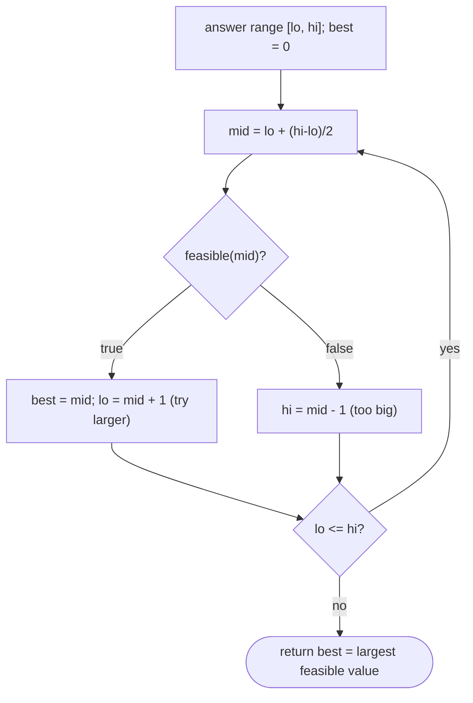

# Pattern: Maximum Predicate Search

## Why It Exists

[Minimum predicate search](/cortex/data-structures-and-algorithms/sorting-and-searching-searching-pattern-minimum-predicate-search) found the *smallest* value satisfying a predicate that goes `false … false, true … true`. Many problems are the mirror image: feasibility is `true … true, false … false` (monotone *decreasing*), and you want the **largest** value that still works.

The tell-tale phrasing is **"maximize the minimum"** (or "minimize the maximum"): place `c` cows in stalls to *maximize* the *minimum* gap between them; cut ribbons to *maximize* the length when you need `k` pieces. As the candidate value grows, the task gets harder until it becomes impossible — so `feasible` flips from true to false exactly once. Binary-search the answer range for that last `true`. Same "binary search on the answer," opposite monotonicity.

## See It Work

Aggressive cows: place `c = 3` cows in stalls at positions `[1, 2, 4, 8, 9]` to **maximize the minimum** distance between any two. Run it.

```python run viz=array
import ast

def max_min_distance(stalls, c):
    stalls = sorted(stalls)
    def feasible(d):                        # can we place all c cows with min gap >= d?
        count, last = 1, stalls[0]          # place the first cow at the first stall
        for s in stalls[1:]:
            if s - last >= d:               # far enough → place the next cow here
                count += 1; last = s
                if count == c:
                    return True
        return count >= c
    lo, hi, best = 0, stalls[-1] - stalls[0], 0
    while lo <= hi:
        mid = lo + (hi - lo) // 2
        if feasible(mid):
            best = mid; lo = mid + 1        # feasible → try a LARGER distance
        else:
            hi = mid - 1                    # too large → must shrink
    return best

stalls = ast.literal_eval(input())
c = int(input())
print(max_min_distance(stalls, c))
```

```java run viz=array
import java.util.*;

public class Main {
    static boolean feasible(int[] stalls, int c, int d) {
        int count = 1, last = stalls[0];
        for (int i = 1; i < stalls.length; i++)
            if (stalls[i] - last >= d) { count++; last = stalls[i]; if (count == c) return true; }
        return count >= c;
    }

    static int maxMinDistance(int[] stalls, int c) {
        Arrays.sort(stalls);
        int lo = 0, hi = stalls[stalls.length - 1] - stalls[0], best = 0;
        while (lo <= hi) {
            int mid = lo + (hi - lo) / 2;
            if (feasible(stalls, c, mid)) { best = mid; lo = mid + 1; }
            else hi = mid - 1;
        }
        return best;
    }

    public static void main(String[] args) {
        Scanner sc = new Scanner(System.in);
        int[] stalls = parseIntArray(sc.nextLine());
        int c = Integer.parseInt(sc.nextLine().trim());
        System.out.println(maxMinDistance(stalls, c));
    }

    static int[] parseIntArray(String line) {
        String inner = line.replaceAll("[\\[\\]\\s]", "");
        if (inner.isEmpty()) return new int[0];
        String[] parts = inner.split(",");
        int[] out = new int[parts.length];
        for (int i = 0; i < parts.length; i++) out[i] = Integer.parseInt(parts[i]);
        return out;
    }
}
```

```testcases
{
  "args": [
    { "id": "stalls", "label": "stalls", "type": "int[]", "placeholder": "[1, 2, 4, 8, 9]" },
    { "id": "c", "label": "c", "type": "int", "placeholder": "3" }
  ],
  "cases": [
    { "args": { "stalls": "[1, 2, 4, 8, 9]", "c": "3" }, "expected": "3" },
    { "args": { "stalls": "[1, 5, 9]", "c": "3" }, "expected": "4" },
    { "args": { "stalls": "[5, 1, 9]", "c": "2" }, "expected": "8" },
    { "args": { "stalls": "[1, 2, 3]", "c": "2" }, "expected": "2" }
  ]
}
```

## How It Works

Same three ingredients as the minimum version, with the monotonicity flipped:

1. **Answer range** `[lo, hi]` — here, possible minimum-distances from `0` to `max − min`.
2. **A monotone-decreasing predicate** `feasible(x)` — `true` for small `x`, `false` once `x` is too ambitious. (A larger required gap is harder to satisfy; once impossible, it stays impossible.)
3. **Search for the *last* `true`** — when `feasible(mid)`, record it and search *right* for something even larger (`lo = mid + 1`); otherwise search left (`hi = mid - 1`). Track the best feasible value seen.



<p align="center"><strong>the predicate is true then false over the range; binary-search the flip point, keeping the largest value that still satisfies it.</strong></p>

Cost is the same **`O(log(range) × cost(feasible))`**. The only differences from minimum-predicate search are the **direction you move on `true`** (right, to seek larger, vs left to seek smaller) and that you **track the best feasible** value (since the loop lands just past it). Minimum-predicate is lower bound on the answer; maximum-predicate is upper bound — find the *last* `true` instead of the *first*.

### Key Takeaway

When feasibility is `true…true, false…false`, binary-search the answer range for the *largest* feasible value: on `feasible(mid)` go right and record `best`, else go left. Same cost as the minimum version; it's the "maximize the minimum / minimize the maximum" family.

## Trace It

Aggressive cows on `[1, 2, 4, 8, 9]`, `c = 3`, distance range `[0, 8]`:

| `lo` | `hi` | `mid` | place cows with gap ≥ `mid` | feasible? | action |
|---|---|---|---|---|---|
| 0 | 8 | 4 | `1`, then `8` (gap 7), then none | only 2 cows | no → `hi = 3` |
| 0 | 3 | 1 | `1, 2, 4` (3 cows) | yes | `best = 1`, `lo = 2` |
| 2 | 3 | 2 | `1, 4, 8` (3 cows) | yes | `best = 2`, `lo = 3` |
| 3 | 3 | 3 | `1, 4, 8` (3 cows) | yes | `best = 3`, `lo = 4` |
| 4 | 3 | — | — | — | return **3** |

Before you read on: minimum-predicate search returned `lo` directly, but this version keeps a separate `best` variable. Why does the maximum version need to *record* the answer rather than just return a boundary pointer?

Because of *where the loop lands relative to the answer*. The minimum version finds the *first* true and converges `lo`/`hi` onto it, so `lo` *is* the answer. The maximum version seeks the *last* true: every time `feasible(mid)` holds, it moves `lo = mid + 1` to look for something bigger — which means after the loop, `lo`/`hi` have stepped *past* the last feasible value into the false region. The pointer no longer sits on the answer. Stashing `best = mid` at each successful check captures the largest feasible value before the search overshoots it. (You *can* write it pointer-only with a careful `hi = mid` half-open form, but the explicit `best` is clearer and less error-prone for the "last true" case — and it makes the maximize-vs-minimize asymmetry visible.)

## Your Turn

Implement `max_min_distance(stalls, c)` — the reusable maximum-feasible search.

```python run viz=array
import ast

def max_min_distance(stalls, c):
    stalls = sorted(stalls)
    def feasible(d):
        # Your code goes here — can we place c cows with minimum gap >= d?
        return False
    lo, hi, best = 0, stalls[-1] - stalls[0], 0
    while lo <= hi:
        mid = lo + (hi - lo) // 2
        # Your code goes here — update best and move lo/hi
        hi = mid - 1
    return best

stalls = ast.literal_eval(input())
c = int(input())
print(max_min_distance(stalls, c))
```

```java run viz=array
import java.util.*;

public class Main {
    static boolean feasible(int[] stalls, int c, int d) {
        // Your code goes here — can we place c cows with minimum gap >= d?
        return false;
    }

    static int maxMinDistance(int[] stalls, int c) {
        Arrays.sort(stalls);
        int lo = 0, hi = stalls[stalls.length - 1] - stalls[0], best = 0;
        while (lo <= hi) {
            int mid = lo + (hi - lo) / 2;
            // Your code goes here — update best and move lo/hi
            hi = mid - 1;
        }
        return best;
    }

    public static void main(String[] args) {
        Scanner sc = new Scanner(System.in);
        int[] stalls = parseIntArray(sc.nextLine());
        int c = Integer.parseInt(sc.nextLine().trim());
        System.out.println(maxMinDistance(stalls, c));
    }

    static int[] parseIntArray(String line) {
        String inner = line.replaceAll("[\\[\\]\\s]", "");
        if (inner.isEmpty()) return new int[0];
        String[] parts = inner.split(",");
        int[] out = new int[parts.length];
        for (int i = 0; i < parts.length; i++) out[i] = Integer.parseInt(parts[i]);
        return out;
    }
}
```

```testcases
{
  "args": [
    { "id": "stalls", "label": "stalls", "type": "int[]", "placeholder": "[1, 2, 8, 4, 9]" },
    { "id": "c", "label": "c", "type": "int", "placeholder": "3" }
  ],
  "cases": [
    { "args": { "stalls": "[1, 2, 8, 4, 9]", "c": "3" }, "expected": "3" },
    { "args": { "stalls": "[5, 1, 9]", "c": "2" }, "expected": "8" },
    { "args": { "stalls": "[1, 2, 3, 4, 5]", "c": "2" }, "expected": "4" },
    { "args": { "stalls": "[1, 100]", "c": "2" }, "expected": "99" }
  ]
}
```

<details>
<summary>Editorial</summary>

Feasibility is monotone-decreasing in `d`: placing cows with gap `≥ d` gets harder as `d` grows. Binary-search `[0, max−min]` for the last `d` where placement succeeds; record `best` because the loop overshoots. `O(n log(max−min))` total.

```python solution time=O(n log(max-min)) space=O(1)
import ast

def max_min_distance(stalls, c):
    stalls = sorted(stalls)
    def feasible(d):
        count, last = 1, stalls[0]
        for s in stalls[1:]:
            if s - last >= d:
                count += 1; last = s
                if count == c:
                    return True
        return count >= c
    lo, hi, best = 0, stalls[-1] - stalls[0], 0
    while lo <= hi:
        mid = lo + (hi - lo) // 2
        if feasible(mid):
            best = mid; lo = mid + 1
        else:
            hi = mid - 1
    return best

stalls = ast.literal_eval(input())
c = int(input())
print(max_min_distance(stalls, c))
```

```java solution
import java.util.*;

public class Main {
    static boolean feasible(int[] stalls, int c, int d) {
        int count = 1, last = stalls[0];
        for (int i = 1; i < stalls.length; i++)
            if (stalls[i] - last >= d) { count++; last = stalls[i]; if (count == c) return true; }
        return count >= c;
    }

    static int maxMinDistance(int[] stalls, int c) {
        Arrays.sort(stalls);
        int lo = 0, hi = stalls[stalls.length - 1] - stalls[0], best = 0;
        while (lo <= hi) {
            int mid = lo + (hi - lo) / 2;
            if (feasible(stalls, c, mid)) { best = mid; lo = mid + 1; }
            else hi = mid - 1;
        }
        return best;
    }

    public static void main(String[] args) {
        Scanner sc = new Scanner(System.in);
        int[] stalls = parseIntArray(sc.nextLine());
        int c = Integer.parseInt(sc.nextLine().trim());
        System.out.println(maxMinDistance(stalls, c));
    }

    static int[] parseIntArray(String line) {
        String inner = line.replaceAll("[\\[\\]\\s]", "");
        if (inner.isEmpty()) return new int[0];
        String[] parts = inner.split(",");
        int[] out = new int[parts.length];
        for (int i = 0; i < parts.length; i++) out[i] = Integer.parseInt(parts[i]);
        return out;
    }
}
```

</details>

Drill the family in **Practice** — [Calculate Square Root](/cortex/data-structures-and-algorithms/sorting-and-searching/searching/pattern-maximum-predicate-search/problems/calculate-square-root), [Build Staircase](/cortex/data-structures-and-algorithms/sorting-and-searching/searching/pattern-maximum-predicate-search/problems/build-staircase), [K Ribbons](/cortex/data-structures-and-algorithms/sorting-and-searching/searching/pattern-maximum-predicate-search/problems/k-ribbons), and [Equalise Water](/cortex/data-structures-and-algorithms/sorting-and-searching/searching/pattern-maximum-predicate-search/problems/equalise-water).

## Reflect & Connect

Maximum-predicate completes the binary-search-on-the-answer pair:

- **The family** — maximize the minimum (aggressive cows, max-min gap), integer square root (largest `x` with `x² ≤ n`), max ribbon length for `k` pieces, max value under a budget. All: *maximize* `X` subject to a monotone-decreasing `feasible(X)`.
- **Min vs max predicate** — minimum finds the *first true* in `F…FT…T` (lower-bound flavor, return `lo`); maximum finds the *last true* in `T…TF…F` (upper-bound flavor, track `best`). Identify the monotonicity direction first — get it backwards and you search for the wrong boundary.
- **The phrasing is the trigger** — "**maximize the minimum**" or "**minimize the maximum**" almost always means binary-search-on-the-answer with a feasibility check. Square root, capacity, and allocation problems hide the same monotone predicate. Together with the minimum version, this is one of the most leverage-per-line patterns there is.

**Prerequisites:** [Upper Bound](/cortex/data-structures-and-algorithms/sorting-and-searching/searching/upper-bound).

## Recall

> **Mnemonic:** *Largest feasible value: monotone `T…TF…F`. On `feasible(mid)` record `best` and go right; else go left. Track `best` (loop overshoots). "Maximize the minimum" = this pattern.*

| | |
|---|---|
| Setup | answer range + monotone-decreasing `feasible(x)` (`T…TF…F`) |
| On `feasible(mid)` | `best = mid; lo = mid + 1` (seek larger) |
| Else | `hi = mid - 1` |
| Answer | `best` (the loop lands past the last true) |
| vs minimum-predicate | last-true / upper-bound vs first-true / lower-bound |

<details>
<summary><strong>Q:</strong> When does maximum-predicate search apply?</summary>

**A:** When feasibility is monotone-decreasing (`true…true, false…false`) and you want the largest value that still satisfies it.

</details>
<details>
<summary><strong>Q:</strong> Why track a separate `best` variable?</summary>

**A:** The search moves right on every `true`, so it overshoots the last feasible value; `best` records it before the pointers pass it.

</details>
<details>
<summary><strong>Q:</strong> How does it differ from minimum-predicate search?</summary>

**A:** Opposite monotonicity — find the *last* true (upper-bound flavor) rather than the *first* true (lower-bound flavor).

</details>
<details>
<summary><strong>Q:</strong> What phrasing signals this pattern?</summary>

**A:** "Maximize the minimum" / "minimize the maximum," and allocation/capacity/√ problems with an easy feasibility check.

</details>

## Sources & Verify

- **Competitive-programming canon** — "aggressive cows" is the textbook maximize-the-minimum binary-search-on-the-answer problem.
- **CLRS / Sedgewick** — binary search and monotone decision functions (parametric search).
- The aggressive-cows max-min search and the `best`-tracking convention are standard; both runnable blocks are verified by running (`[1,2,4,8,9], c=3 ⇒ 3`; `[1,5,9], c=3 ⇒ 4`; `[5,1,9], c=2 ⇒ 8`).
