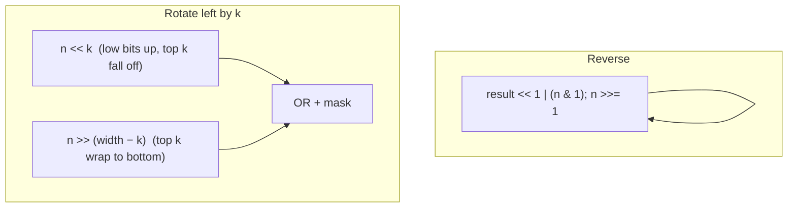

# Pattern: Bit Restructuring

## Why It Exists

Sometimes you must *rearrange* a number's bits rather than read or set one: **reverse** the whole bit string (bit 1 ↔ bit `w`, bit 2 ↔ bit `w−1`, …) or **rotate** it — a circular shift where bits that fall off one end reappear at the other.

A plain shift won't do it, because shifting *loses* the bits that drop off the end. Restructuring is the "rearrange without losing" branch: **reverse** threads each falling-off bit into a growing result, and **rotate** wraps the displaced bits back around. Two small recipes — an LSB-extract loop for reversal, and an OR of two complementary shifts for rotation — cover almost every bit-rearrangement task.

## See It Work

Reverse an 8-bit number and rotate one left. `0b00001011` reversed is `0b11010000`; rotating `0b10000001` left by 1 wraps the top bit down to give `0b00000011`. Run it.

```python run viz=array
WIDTH = 8

def reverse_bits(n, width=WIDTH):
    result = 0
    for _ in range(width):
        result = (result << 1) | (n & 1)   # make room, then append n's LSB
        n >>= 1
    return result

def rotate_left(n, k, width=WIDTH):
    k %= width                             # avoid overshift (k could exceed width)
    mask = (1 << width) - 1
    return ((n << k) | (n >> (width - k))) & mask

print(bin(reverse_bits(0b00001011)))       # 0b11010000
print(bin(rotate_left(0b10000001, 1)))     # 0b11  (top bit wrapped to the bottom)
```

## How It Works

**Reverse** — extract the lowest bit of `n` and append it to `result`, `width` times. Each step shifts `result` left to make room, ORs in `n`'s current LSB, then shifts `n` right. After `width` steps, `result` holds `n`'s bits in reverse order.

**Rotate left by `k`** — `(n << k)` moves the low bits up but pushes the top `k` bits off the end; `(n >> (width − k))` brings exactly those top bits down to the bottom. OR them together and mask to `width` bits, and the displaced bits have wrapped around.



<p align="center"><strong>reverse threads each LSB onto the result; rotate-left ORs the up-shifted low bits with the down-shifted top bits so nothing is lost.</strong></p>

Reversal is `O(width)` (a fixed 32 or 64, so effectively `O(1)`); rotation is `O(1)`. One detail matters: **`k %= width`** before rotating. Without it, shifting by `≥ width` is undefined behavior in C/Java and just wrong in Python — the reduction keeps the shift in range.

### Key Takeaway

Restructuring rearranges bits without losing them: reverse by threading each LSB onto a result (`O(width)`), rotate by OR-ing two complementary shifts (`O(1)`). Always reduce `k %= width` before a rotate to avoid overshift.

## Trace It

Reversing `0b1011` over 4 bits (`width = 4`), `result` starting at `0`:

| step | n's LSB | `result` after `(result<<1)\|LSB` | n after `>>1` |
|---|---|---|---|
| 1 | `1` | `0b1` | `0b101` |
| 2 | `1` | `0b11` | `0b10` |
| 3 | `0` | `0b110` | `0b1` |
| 4 | `1` | `0b1101` | `0b0` |

`0b1011` → `0b1101`.

Before you read on: the rotate uses `(n << k) | (n >> (width − k))`. If you *forgot* the `& mask` at the end (or used a width smaller than the integer's true width), what would leak into the result?

The left shift `n << k` produces bits *above* position `width` — for an 8-bit logical value living in a 32-bit `int`, those high bits are real and non-zero, and without masking they'd survive into the result, so the "8-bit rotation" would carry garbage in bits 9+. The `& mask` (with `mask = (1 << width) - 1`) chops the result back to the intended width, discarding the overflow that the shift created. This is the bit-manipulation version of "respect your declared width": the machine word is wider than your logical value, so you must mask after any operation that can push bits past the boundary you care about.

## Your Turn

The reusable reverse and rotate:

```python run viz=array
def reverse_bits(n, width=8):
    result = 0
    for _ in range(width):
        result = (result << 1) | (n & 1)
        n >>= 1
    return result

def rotate_left(n, k, width=8):
    k %= width
    mask = (1 << width) - 1
    return ((n << k) | (n >> (width - k))) & mask

print(reverse_bits(0b00000001))        # 128
print(rotate_left(0b00001111, 2))      # 60  (0b00111100)
```

```java run viz=array
public class Main {
  static final int WIDTH = 8;

  static int reverseBits(int n) {
    int result = 0;
    for (int i = 0; i < WIDTH; i++) { result = (result << 1) | (n & 1); n >>= 1; }
    return result;
  }

  static int rotateLeft(int n, int k) {
    k %= WIDTH;
    int mask = (1 << WIDTH) - 1;
    return ((n << k) | (n >>> (WIDTH - k))) & mask;   // >>> : unsigned, no sign-extension
  }

  public static void main(String[] args) {
    System.out.println(reverseBits(0b00000001));   // 128
    System.out.println(rotateLeft(0b00001111, 2)); // 60
  }
}
```

Drill the family in **Practice** — [Reverse Bits](/cortex/data-structures-and-algorithms/bit-tricks/pattern-restructuring/problems/reverse-bits) and [Circular Shift Bits](/cortex/data-structures-and-algorithms/bit-tricks/pattern-restructuring/problems/circular-shift-bits).

## Reflect & Connect

Restructuring is "lossless bit movement," and it recurs in low-level code:

- **The family** — reverse all bits, rotate left/right by `k`, swap byte order (endianness conversion), and extract/insert a multi-bit field. Each moves bits without dropping them.
- **OR-of-complementary-shifts is the rotate idiom** — it appears verbatim in cryptographic round functions (many ciphers rotate state each round) and hash mixing. Recognize it and rotations stop looking like magic.
- **Mind the width** — `k %= width` before rotating, mask after shifting, and use Java's `>>>` (unsigned) rather than `>>` (sign-extending) when the top bit might be set. A faster, loop-free reversal exists via divide-and-conquer with magic masks (`0x55555555`, `0x33333333`, …) — `O(log width)` — but the LSB loop is the readable default.

**Prerequisites:** [Kth-Bit Operations](/cortex/data-structures-and-algorithms/bit-tricks/pattern-kth-bit/pattern).
**What's next:** the single most useful bitwise identity — [XOR](/cortex/data-structures-and-algorithms/bit-tricks/pattern-xor/pattern).

## Recall

> **Mnemonic:** *Reverse: loop `result = result<<1 \| n&1; n>>=1`. Rotate left k: `(n<<k) \| (n>>(w−k))`, mask to w. Always `k %= w` first.*

| | |
|---|---|
| Reverse | LSB-extract loop, `width` times — `O(width)` |
| Rotate left by `k` | `((n << k) \| (n >> (w − k))) & mask` — `O(1)` |
| Avoid overshift | `k %= width` before rotating |
| Respect width | mask after shifting; Java `>>>` not `>>` |

<details>
<summary><strong>Q:</strong> Why can't a plain shift rotate a number?</summary>

**A:** A shift drops the bits that fall off the end; rotation must wrap them around, which the OR of two complementary shifts does.

</details>
<details>
<summary><strong>Q:</strong> What does each half of `(n << k) | (n >> (w−k))` contribute?</summary>

**A:** The left shift moves the low bits up; the right shift brings the displaced top bits down to the bottom.

</details>
<details>
<summary><strong>Q:</strong> Why `k %= width` before rotating?</summary>

**A:** Shifting by `≥ width` is undefined in C/Java (and meaningless), so reduce the rotation amount first.

</details>
<details>
<summary><strong>Q:</strong> Why mask after the shifts?</summary>

**A:** The left shift can push bits past the logical width; masking discards that overflow so the result stays width-bounded.

</details>

## Sources & Verify

- **Warren**, *Hacker's Delight*, 2nd ed., ch. 2 & 7 — bit reversal (including the divide-and-conquer version) and rotations.
- **Sedgewick & Wayne**, *Algorithms*, 4th ed. — bitwise operators and shifts.
- Bit reversal (LSB loop) and rotation (OR-of-shifts) are standard; both runnable blocks are verified by running (`0b00001011 ⇒ 0b11010000`; rotate of `0b10000001` ⇒ `0b11`; utilities ⇒ `128`, `60`).
