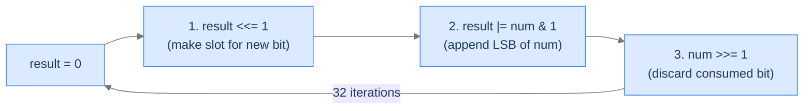

# Reverse Bits

## The Problem

Given a 32-bit unsigned integer `num`, return the integer formed by reversing its 32 bits — bit 1 becomes bit 32, bit 2 becomes bit 31, and so on.

```
Input:  num = 28
Output: 939524096
        Binary  00000000 00000000 00000000 00011100
        Reversed 00111000 00000000 00000000 00000000

Input:  num = 1
Output: 2147483648            (highest bit becomes set)

Input:  num = 3415
Output: 3937402880
```

<details>
<summary><h2>The Recurrence — LSB Extract, Append</h2></summary>


Build the reversed integer one bit at a time. For 32 iterations:
1. Shift `result` left by 1 — make room for one more bit at the bottom.
2. Take the LSB of `num` (`num & 1`) and OR it into `result`'s new bottom slot.
3. Shift `num` right by 1 — discard the bit we just consumed.

After 32 rounds, `num`'s original bit 1 has migrated all the way up to bit 32 in `result`, bit 2 to bit 31, etc. — exactly the reverse layout.



<p align="center"><strong>One iteration extracts <code>num</code>'s LSB and appends it as <code>result</code>'s new LSB. After 32 iterations, the original bit order is reversed end-to-end.</strong></p>

> *Pause. Why 32 iterations exactly? Predict the consequence of stopping early.*

Because the integer has 32 bits — every position must be processed for the reversal to land bits at the correct *symmetric* positions. Stopping at, say, 16 iterations would only reverse the lower half and leave the upper half zero. The loop count is bound to the bit-width, not to `num`'s actual content.

</details>
<details>
<summary><h2>Solution &amp; Analysis</h2></summary>

### The Solution

```python run viz=array
class Solution:
    def reverse_bits(self, num: int) -> int:

        # Initialize the variable to store the reversed bits
        result: int = 0

        for _ in range(32):

            # Left shift the result by 1 to make room for the next bit
            result = result << 1

            # Get the least significant bit of num using bitwise AND with
            # 1
            bit: int = num & 1

            # Add the bit to the result
            result = result + bit

            # Right shift num by 1 to discard the least significant bit
            num = num >> 1

        # Return the reversed bits
        return result


# Examples from the problem statement
print(Solution().reverse_bits(28))      # 939524096
print(Solution().reverse_bits(3415))    # 3937402880
print(Solution().reverse_bits(1))       # 2147483648

# Edge cases
print(Solution().reverse_bits(0))       # 0
print(Solution().reverse_bits(2))       # 1073741824
print(Solution().reverse_bits(4))       # 536870912
print(Solution().reverse_bits(2147483648))  # 1
```

```java run viz=array
public class Main {
    static class Solution {
        public int reverseBits(int num) {

            // Initialize the variable to store the reversed bits
            int result = 0;

            for (int i = 0; i < 32; i++) {

                // Left shift the result by 1 to make room for the next bit
                result = result << 1;

                // Get the least significant bit of num using bitwise AND
                // with 1
                int bit = num & 1;

                // Add the bit to the result
                result = result + bit;

                // Right shift num by 1 to discard the least significant bit
                num = num >> 1;
            }

            // Return the reversed bits
            return result;
        }
    }

    public static void main(String[] args) {
        // Examples from the problem statement
        // Note: Java int is signed; we print as unsigned long for clarity
        System.out.println(Integer.toUnsignedLong(new Solution().reverseBits(28)));     // 939524096
        System.out.println(Integer.toUnsignedLong(new Solution().reverseBits(3415)));   // 3937402880
        System.out.println(Integer.toUnsignedLong(new Solution().reverseBits(1)));      // 2147483648

        // Edge cases
        System.out.println(Integer.toUnsignedLong(new Solution().reverseBits(0)));              // 0
        System.out.println(Integer.toUnsignedLong(new Solution().reverseBits(2)));              // 1073741824
        System.out.println(Integer.toUnsignedLong(new Solution().reverseBits(4)));              // 536870912
        System.out.println(Integer.toUnsignedLong(new Solution().reverseBits(-2147483648)));     // 1
    }
}
```


<details>
<summary><strong>Trace — num = 28 (0b11100)</strong></summary>

```
Initial: result = 0, num = 0b11100

Iter  num         num & 1   result <<= 1  result |= bit  num >>= 1
0     ...11100    0         0             0              ...01110
1     ...01110    0         0             0              ...00111
2     ...00111    1         0             1              ...00011
3     ...00011    1         10            11             ...00001
4     ...00001    1         110           111            ...00000
5–31: num is 0, so we keep shifting result left, appending 0s.

After iteration 31:
  result has 28's lowest 5 bits (11100, processed in reverse order)
  pushed to the top of a 32-bit space.
  result = 0b00111000 00000000 00000000 00000000 = 939524096 ✓
```

</details>

### Complexity

| Aspect | Cost |
|---|---|
| Time | `O(32) = O(1)` — fixed bit-width loop |
| Space | `O(1)` |

</details>
<details>
<summary><h2>Faster Alternative — Divide and Conquer</h2></summary>


For hot loops, the divide-and-conquer approach uses 5 swap stages with magic masks:
1. Swap adjacent bits with masks `0x55555555` and `0xAAAAAAAA`.
2. Swap adjacent pairs with `0x33333333` and `0xCCCCCCCC`.
3. Swap adjacent nibbles with `0x0F0F0F0F` and `0xF0F0F0F0`.
4. Swap adjacent bytes (or use byte-swap intrinsic).
5. Swap halves.

5 ops total, no loop, ~6× faster on most CPUs. Beyond this lesson but worth knowing.

</details>
