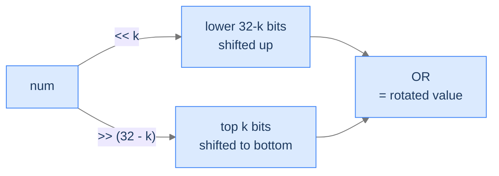

# Circular Shift Bits

A rotation is a shift that *wraps*: bits that fall off one end reappear at the other. The restructuring trick is to combine two ordinary shifts of complementary distance.

## Problem Statement

Given a 32-bit unsigned integer `num`, an integer `k`, and a flag `rotateLeft`, rotate `num`'s bits left by `k` (if `rotateLeft = true`) or right by `k` (otherwise). Bits falling off one end wrap around to the other end — they don't disappear.

## Examples

**Example 1**
```
Input:  num = 28, k = 2, rotateLeft = true
Output: 112
Explanation: 00000000 00000000 00000000 00011100  rotated left by 2 is
             00000000 00000000 00000000 01110000  = 112.
```

**Example 2**
```
Input:  num = 1, k = 1, rotateLeft = false
Output: 2147483648
Explanation: A right rotation by 1 wraps bit 1 around to bit 32.
```

## Constraints

- `0 ≤ num ≤ 2^32 - 1` — treated as unsigned, so the rotated result spans `0 .. 4294967295`.
- `1 ≤ k ≤ 31` — a rotation distance within the word (shifting by `0` or `32` is a special case the formula's `32 - k` term doesn't handle).

```python run viz=array
class Solution:

    # Assuming a 32-bit integer
    size_int: int = 32

    # Mask to ensure the result is a 32-bit integer
    mask_int: int = 0xFFFFFFFF

    def circular_shift_bits(
        self, num: int, k: int, rotate_left: bool
    ) -> int:
        # Your code goes here
        return 0


num = int(input())
k = int(input())
rotate_left = input().strip() == "true"
print(Solution().circular_shift_bits(num, k, rotate_left))
```

```java run viz=array
import java.util.*;

public class Main {
    static class Solution {

        // Number of bits in an integer
        private int sizeInt = Integer.SIZE;

        public int circularShiftBits(int num, int k, boolean rotateLeft) {
            // Your code goes here
            return 0;
        }
    }

    public static void main(String[] args) {
        Scanner sc = new Scanner(System.in);
        // num can be up to 2^32 - 1 (> Integer.MAX_VALUE): read as long, cast.
        int num = (int) Long.parseLong(sc.nextLine().trim());
        int k = Integer.parseInt(sc.nextLine().trim());
        boolean rotateLeft = Boolean.parseBoolean(sc.nextLine().trim());
        // Print the unsigned interpretation (0 .. 2^32-1) to match Python.
        System.out.println(Integer.toUnsignedLong(new Solution().circularShiftBits(num, k, rotateLeft)));
    }
}
```

```testcases
{
  "args": [
    { "id": "num", "label": "num", "type": "int", "placeholder": "28" },
    { "id": "k", "label": "k", "type": "int", "placeholder": "2" },
    { "id": "rotateLeft", "label": "rotateLeft", "type": "string", "placeholder": "true" }
  ],
  "cases": [
    { "args": { "num": "28", "k": "2", "rotateLeft": "true" }, "expected": "112" },
    { "args": { "num": "1234567890", "k": "8", "rotateLeft": "true" }, "expected": "2516767305" },
    { "args": { "num": "1", "k": "1", "rotateLeft": "false" }, "expected": "2147483648" },
    { "args": { "num": "28", "k": "2", "rotateLeft": "false" }, "expected": "7" },
    { "args": { "num": "0", "k": "4", "rotateLeft": "true" }, "expected": "0" }
  ]
}
```

<details>
<summary><h2>The Recurrence — Two Shifts ORed Together</h2></summary>


Standard left/right shift loses bits that fall off the edge. To wrap them, take *both* shifts and combine:

- **Left rotate by k**: `(num << k) | (num >> (32 - k))`
  - `num << k` shifts left, losing the top `k` bits.
  - `num >> (32 - k)` shifts the top `k` bits down to the bottom.
  - OR combines: top bits land at the bottom, everything shifts left by `k`.

- **Right rotate by k**: `(num >> k) | (num << (32 - k))` — symmetric.



<p align="center"><strong>Left rotation: combine the leftshift (which drops top bits) with a rightshift of <em>complementary</em> distance (which extracts those same top bits and lands them at the bottom). OR the two together for a lossless rotate.</strong></p>

> *Pause. Why do we need the <code>0xFFFFFFFF</code> mask (Python) or the unsigned right shift <code>&gt;&gt;&gt;</code> (Java)? Predict what goes wrong without them.*

Python's integers are arbitrary-precision and *signed*, so `num >> k` propagates sign bits indefinitely and `num << k` can grow beyond 32 bits — both corrupt the OR. Masking with `0xFFFFFFFF` (`mask_int`) clamps the result back to 32 bits, recovering the rotation semantics. Java has a fixed-width `int`, but its `>>` is *arithmetic* (sign-extending); the unsigned form `>>>` zero-fills the high bits, which is what rotation needs.

</details>
<details>
<summary><h2>Solution &amp; Analysis</h2></summary>

### The Solution

Each direction is two shifts ORed together. The two languages model 32-bit width differently: Python masks the OR with `0xFFFFFFFF` to clamp back to 32 bits; Java uses the unsigned shift `>>>` so the high bits zero-fill. The driver then prints `Integer.toUnsignedLong(result)` so Java's signed `int` renders as the same unsigned value Python produces.

```python solution time=O(1) space=O(1)
class Solution:

    # Assuming a 32-bit integer
    size_int: int = 32

    # Mask to ensure the result is a 32-bit integer
    mask_int: int = 0xFFFFFFFF

    def circular_shift_bits(
        self, num: int, k: int, rotate_left: bool
    ) -> int:
        if rotate_left:
            return (
                num << k | num >> (self.size_int - k)
            ) & self.mask_int

        # Perform circular right shift, and apply the mask after OR
        # operation
        return (num >> k | num << (self.size_int - k)) & self.mask_int


num = int(input())
k = int(input())
rotate_left = input().strip() == "true"
print(Solution().circular_shift_bits(num, k, rotate_left))
```

```java solution
import java.util.*;

public class Main {
    static class Solution {

        // Number of bits in an integer
        private int sizeInt = Integer.SIZE;

        public int circularShiftBits(int num, int k, boolean rotateLeft) {
            if (rotateLeft) {

                // Perform circular left shift
                return (num << k) | (num >>> (sizeInt - k));
            }

            // Perform circular right shift
            return (num >>> k) | (num << (sizeInt - k));
        }
    }

    public static void main(String[] args) {
        Scanner sc = new Scanner(System.in);
        int num = (int) Long.parseLong(sc.nextLine().trim());
        int k = Integer.parseInt(sc.nextLine().trim());
        boolean rotateLeft = Boolean.parseBoolean(sc.nextLine().trim());
        System.out.println(Integer.toUnsignedLong(new Solution().circularShiftBits(num, k, rotateLeft)));
    }
}
```

### Complexity

| Aspect | Cost |
|---|---|
| Time | `O(1)` — two shifts and an OR |
| Space | `O(1)` |

</details>
