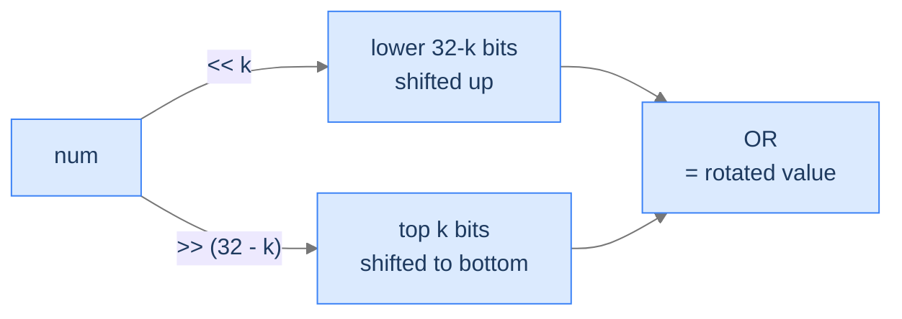

# Circular Shift Bits

## The Problem

Given a 32-bit unsigned integer `num`, an integer `k`, and a flag `rotateLeft`, rotate `num`'s bits left by `k` (if `rotateLeft = true`) or right by `k` (otherwise). Bits falling off one end wrap around to the other end — they don't disappear.

```
Input:  num = 28, k = 2, rotateLeft = true
Output: 112
        Binary 00000000 00000000 00000000 00011100
        After  00000000 00000000 00000000 01110000

Input:  num = 1, k = 1, rotateLeft = false
Output: 2147483648            Bit 1 wraps around to bit 32
```

<details>
<summary><h2>The Recurrence — Two Shifts ORed Together</h2></summary>


Standard left/right shift loses bits that fall off the edge. To wrap them, take *both* shifts and combine:

- **Left rotate by k**: `(num << k) | (num >> (32 - k))`
  - `num << k` shifts left, losing the top `k` bits.
  - `num >> (32 - k)` shifts the top `k` bits down to the bottom.
  - OR combines: top bits land at the bottom, everything shifts left by `k`.

- **Right rotate by k**: `(num >> k) | (num << (32 - k))` — symmetric.



<p align="center"><strong>Left rotation: combine the leftshift (which drops top bits) with a rightshift of <em>complementary</em> distance (which extracts those same top bits and lands them at the bottom). OR the two together for a lossless rotate.</strong></p>

> *Pause. Why do we need the <code>0xFFFFFFFF</code> mask (Python) or the unsigned right shift <code>&gt;&gt;&gt;</code> (Java)? Predict what goes wrong without them.*

Python's integers are arbitrary-precision and *signed*, so `num >> k` propagates sign bits indefinitely and `num << k` can grow beyond 32 bits — both corrupt the OR. Masking with `0xFFFFFFFF` (`mask_int`) clamps the result back to 32 bits, recovering the rotation semantics. Java has a fixed-width `int`, but its `>>` is *arithmetic* (sign-extending); the unsigned form `>>>` zero-fills the high bits, which is what rotation needs.

</details>
<details>
<summary><h2>Solution &amp; Analysis</h2></summary>

### The Solution

```python run viz=array
class Solution:

    # Assuming a 32-bit integer
    size_int: int = 32

    # Mask to ensure the result is a 32-bit integer
    mask_int: int = 0xFFFFFFFF

    def circular_shift_bits(
        self, num: int, k: int, rotate_left: bool
    ) -> int:
        if rotate_left:
            return (
                num << k | num >> (self.size_int - k)
            ) & self.mask_int

        # Perform circular right shift, and apply the mask after OR
        # operation
        return (num >> k | num << (self.size_int - k)) & self.mask_int


# Examples from the problem statement
print(Solution().circular_shift_bits(28, 2, True))             # 112
print(Solution().circular_shift_bits(1234567890, 8, True))     # 2516767305
print(Solution().circular_shift_bits(1, 1, False))             # 2147483648

# Edge cases
print(Solution().circular_shift_bits(0, 4, True))              # 0
print(Solution().circular_shift_bits(1, 1, True))              # 2
print(Solution().circular_shift_bits(2, 1, False))             # 1
print(Solution().circular_shift_bits(28, 2, False))            # 7
```

```java run viz=array
public class Main {
    static class Solution {

        // Number of bits in an integer
        private int sizeInt = Integer.SIZE;

        public int circularShiftBits(int num, int k, boolean rotateLeft) {
            if (rotateLeft) {

                // Perform circular left shift
                return (num << k) | (num >>> (sizeInt - k));
            }

            // Perform circular right shift
            return (num >>> k) | (num << (sizeInt - k));
        }
    }

    public static void main(String[] args) {
        // Examples from the problem statement
        System.out.println(Integer.toUnsignedLong(new Solution().circularShiftBits(28, 2, true)));             // 112
        System.out.println(Integer.toUnsignedLong(new Solution().circularShiftBits(1234567890, 8, true)));     // 2516767305
        System.out.println(Integer.toUnsignedLong(new Solution().circularShiftBits(1, 1, false)));             // 2147483648

        // Edge cases
        System.out.println(Integer.toUnsignedLong(new Solution().circularShiftBits(0, 4, true)));              // 0
        System.out.println(Integer.toUnsignedLong(new Solution().circularShiftBits(1, 1, true)));              // 2
        System.out.println(Integer.toUnsignedLong(new Solution().circularShiftBits(2, 1, false)));             // 1
        System.out.println(Integer.toUnsignedLong(new Solution().circularShiftBits(28, 2, false)));            // 7
    }
}
```

### Complexity

| Aspect | Cost |
|---|---|
| Time | `O(1)` — two shifts and an OR |
| Space | `O(1)` |

</details>
