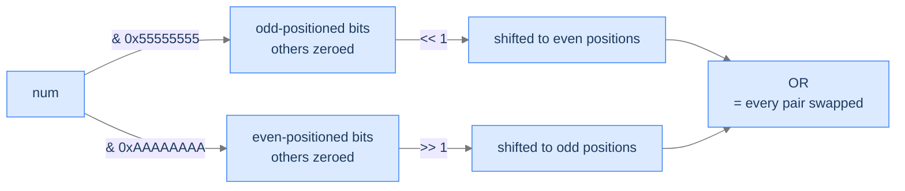

# Pairwise Bits Swap

## The Problem

Given a 32-bit integer `num`, swap every pair of adjacent bits — bit 1 ↔ bit 2, bit 3 ↔ bit 4, …, bit 31 ↔ bit 32. Return the new value.

```
Input:  num = 1   →  2     (binary 01 → 10)
Input:  num = 31568  →  47008
Input:  num = 5419430  →  10580569
```

<details>
<summary><h2>The Recurrence — Mask Out, Shift, OR</h2></summary>


Two magic constants do the heavy lifting:

```
0x55555555 = 0101 0101 0101 0101 0101 0101 0101 0101   (every odd-positioned bit set)
0xAAAAAAAA = 1010 1010 1010 1010 1010 1010 1010 1010   (every even-positioned bit set)
```

The recipe:
1. **Extract odd-positioned bits**: `num & 0x55555555`. Shift left by 1 to put each at its even-position partner.
2. **Extract even-positioned bits**: `num & 0xAAAAAAAA`. Shift right by 1 to put each at its odd-position partner.
3. **OR**: combine the two shifted halves. The result has every adjacent pair swapped.

```
result = ((num & 0x55555555) << 1) | ((num & 0xAAAAAAAA) >> 1)
```



<p align="center"><strong>Two parallel "shift and reposition" operations, then OR. No loop — every pair swaps in one shot, regardless of bit-width.</strong></p>

> *Pause. Why don't the two shifted halves overlap when ORed?*

Because each half has 1s only in *complementary* positions: after shifts, the first half occupies even positions and the second occupies odd positions. ORing two non-overlapping bit patterns simply combines them.

</details>
<details>
<summary><h2>Solution &amp; Analysis</h2></summary>

### The Solution

```python run viz=array
import sys

class Solution:
    def pairwise_bits_swap(self, num: int) -> int:

        # Mask for odd bits (1010...)
        odd_mask = 0xAAAAAAAA

        # Mask for even bits (0101...)
        even_mask = 0x55555555

        # Perform sign extension
        if num < 0:
            sign_extension = 0xFFFFFFFF
            num = num & sign_extension

        # Extract odd and even bits
        odd_bits = num & odd_mask
        even_bits = num & even_mask

        # Right-shift odd bits and left-shift even bits
        swapped = (odd_bits >> 1) | (even_bits << 1)

        # Perform sign extension again
        if num < 0:
            swapped = swapped | sign_extension

        return swapped


# Examples from the problem statement
print(Solution().pairwise_bits_swap(31568))      # 47008
print(Solution().pairwise_bits_swap(5419430))    # 10580569
print(Solution().pairwise_bits_swap(1))          # 2

# Edge cases
print(Solution().pairwise_bits_swap(0))          # 0
print(Solution().pairwise_bits_swap(2))          # 1
print(Solution().pairwise_bits_swap(3))          # 3
print(Solution().pairwise_bits_swap(4))          # 8
print(Solution().pairwise_bits_swap(10))         # 5
```

```java run viz=array
public class Main {
    static class Solution {
        public int pairwiseBitsSwap(int num) {

            // Mask for even-positioned bits
            // (10101010101010101010101010101010 in binary) This mask selects
            // the bits at positions 0, 2, 4, 6, ...
            int evenMask = 0xAAAAAAAA;

            // Mask for odd-positioned bits (01010101010101010101010101010101
            // in binary) This mask selects the bits at positions 1, 3, 5, 7,
            // ...
            int oddMask = 0x55555555;

            // Extract the even-positioned bits and shift them to the right
            // by 1 position
            int evenBits = (num & evenMask) >> 1;

            // Extract the odd-positioned bits and shift them to the left by
            // 1 position
            int oddBits = (num & oddMask) << 1;

            // Combine the shifted even and odd bits using bitwise OR
            return (evenBits | oddBits);
        }
    }

    public static void main(String[] args) {
        // Examples from the problem statement
        System.out.println(new Solution().pairwiseBitsSwap(31568));      // 47008
        System.out.println(new Solution().pairwiseBitsSwap(5419430));    // 10580569
        System.out.println(new Solution().pairwiseBitsSwap(1));          // 2

        // Edge cases
        System.out.println(new Solution().pairwiseBitsSwap(0));          // 0
        System.out.println(new Solution().pairwiseBitsSwap(2));          // 1
        System.out.println(new Solution().pairwiseBitsSwap(3));          // 3
        System.out.println(new Solution().pairwiseBitsSwap(4));          // 8
        System.out.println(new Solution().pairwiseBitsSwap(10));         // 5
    }
}
```

### Complexity

| Aspect | Cost |
|---|---|
| Time | `O(1)` — four bitwise ops |
| Space | `O(1)` |

</details>
