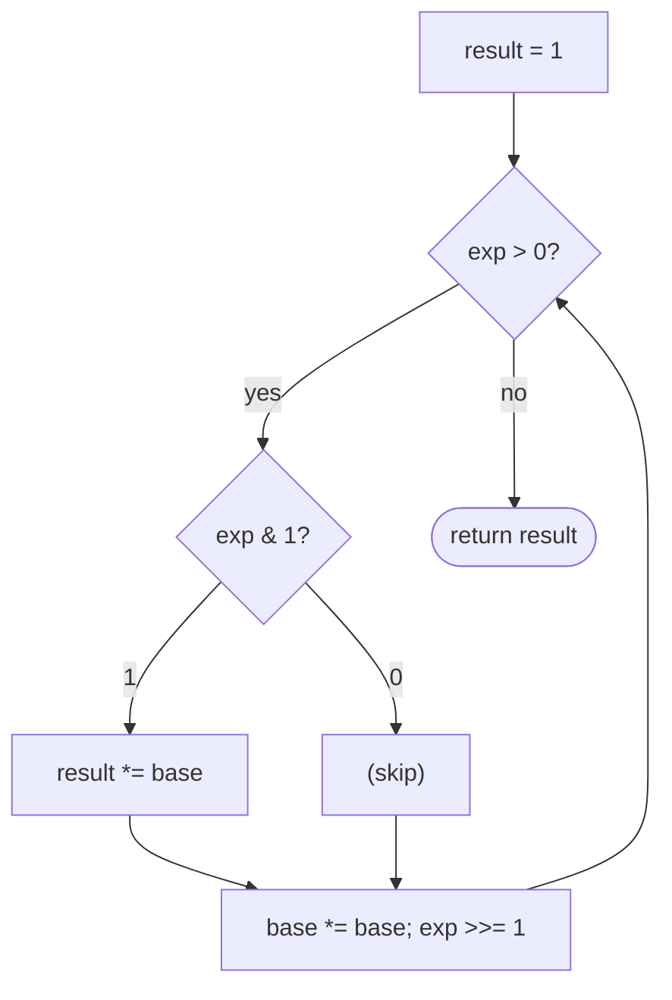

# Pattern: Bit-Manipulation Applications

## Why It Exists

The earlier patterns gave you primitives; this lesson shows them composing into the classic idioms you'll actually reach for. Most are one-liners — numeric parity is `n & 1`, the power-of-two test is `n > 0 and (n & (n-1)) == 0`, bit-parity is Kernighan's loop mod 2.

The headline application is **fast exponentiation**. Computing `base^exp` by multiplying `exp` times is `O(exp)` — hopeless when `exp` is a billion. But `exp`'s *binary representation* gives an `O(log exp)` algorithm: any exponent is a sum of powers of two, so `base^exp` is the product of `base^(2^i)` over the set bits `i` of `exp`. Square the base repeatedly to get those `base^(2^i)` terms, and multiply one into the result whenever the corresponding bit is set. The bits of the exponent *are* the algorithm.

## See It Work

Compute `2^10 = 1024` by reading the bits of the exponent — squaring the base and multiplying in on set bits. Run it.

```python run viz=array
def fast_pow(base, exp):
    result = 1
    while exp > 0:
        if exp & 1:            # current low bit set → this power contributes
            result *= base
        base *= base           # square the base for the next bit position
        exp >>= 1              # move to the next bit of the exponent
    return result

print(fast_pow(2, 10))         # 1024
print(fast_pow(3, 5))          # 243
```

## How It Works

Walk the exponent bit by bit, lowest first, maintaining two values:

- `base` is squared every step, so after `i` steps it equals the original `base^(2^i)`.
- `result` accumulates: whenever the current bit of `exp` is `1`, multiply the current `base` into it.

Because `exp = Σ 2^i` over its set bits, multiplying in `base^(2^i)` exactly at those bits builds `base^exp`. The loop runs once per bit of `exp` — `O(log exp)` multiplications instead of `O(exp)`.



<p align="center"><strong>read the exponent's bits low-to-high; square the base each step; multiply it into the result only when the current bit is set.</strong></p>

The other applications are direct primitive uses: **parity** `n & 1` (the lowest bit *is* odd/even), **power-of-two** `n & (n-1) == 0` (one set bit — the [set-bit-finder](/cortex/data-structures-and-algorithms/bit-tricks-pattern-set-bit-finder-pattern) identity), **bit-parity** (popcount mod 2, via Kernighan's loop). Each is `O(1)` except bit-parity (`O(set bits)`); fast exponentiation is `O(log exp)`.

### Key Takeaway

Fast exponentiation computes `base^exp` in `O(log exp)` by squaring the base and multiplying it into the result on the set bits of `exp` — the exponent's binary form *is* the schedule. Parity (`n&1`), power-of-two (`n&(n-1)==0`), and bit-parity (Kernighan) are the one-line companions.

## Trace It

`fast_pow(3, 5)` — `exp = 5 = 0b101`:

| step | `exp` (binary) | bit | action | `base` | `result` |
|---|---|---|---|---|---|
| start | `101` | — | — | `3` | `1` |
| 1 | `101` | `1` | multiply | `3→9` | `1·3 = 3` |
| 2 | `10` | `0` | skip | `9→81` | `3` |
| 3 | `1` | `1` | multiply | `81→…` | `3·81 = 243` |

`3^5 = 243`. ✓

Before you read on: the multiplications happened at steps 1 and 3 (the set bits of `5 = 101`), contributing `3^1` and `3^4`. Why does multiplying in `base` exactly at the set bits — and squaring it every step regardless — produce `base^exp`?

Because `exp` in binary is a sum of distinct powers of two: `5 = 4 + 1 = 2^2 + 2^0`. So `base^5 = base^(2^2) · base^(2^0) = base^4 · base^1`. The repeated squaring makes `base` pass through `base^1, base^2, base^4, …` — exactly the `base^(2^i)` terms — and the set bits of `exp` tell you *which* of those terms to include. Squaring happens every step so the term is *ready* whenever its bit turns out to be set; the bit just decides whether to use it. That's how `O(log exp)` squarings replace `O(exp)` multiplications — and the identical idea, taken mod `m`, is **modular exponentiation**, the workhorse of RSA and Diffie–Hellman.

## Your Turn

Fast exponentiation plus the one-line companions:

```python run viz=array
def fast_pow(base, exp):
    result = 1
    while exp > 0:
        if exp & 1:
            result *= base
        base *= base
        exp >>= 1
    return result

def is_power_of_two(n): return n > 0 and (n & (n - 1)) == 0
def is_odd(n):          return (n & 1) == 1

print(fast_pow(2, 16), is_power_of_two(64), is_odd(7))   # 65536 True True
```

```java run viz=array
public class Main {
  static long fastPow(long base, long exp) {
    long result = 1;
    while (exp > 0) {
      if ((exp & 1) == 1) result *= base;
      base *= base;
      exp >>= 1;
    }
    return result;
  }
  static boolean isPowerOfTwo(int n) { return n > 0 && (n & (n - 1)) == 0; }
  static boolean isOdd(int n)        { return (n & 1) == 1; }

  public static void main(String[] args) {
    System.out.println(fastPow(2, 16) + " " + isPowerOfTwo(64) + " " + isOdd(7));   // 65536 true true
  }
}
```

Drill the family in **Practice** — [Parity Checker](/cortex/data-structures-and-algorithms/bit-tricks-pattern-applications-problems-parity-checker), [Power of 2](/cortex/data-structures-and-algorithms/bit-tricks-pattern-applications-problems-power-of-2), [Set-Bit Parity](/cortex/data-structures-and-algorithms/bit-tricks-pattern-applications-problems-parity-checker-ii-set-bit-parity), and [Fast Exponentiation](/cortex/data-structures-and-algorithms/bit-tricks-pattern-applications-problems-power-function-fast-exponentiation).

## Reflect & Connect

These applications are where the whole toolkit pays off — each composes primitives from the earlier patterns:

- **The family** — numeric parity (`n & 1`), power-of-two (`n & (n-1)`), bit-parity / popcount-mod-2 (Kernighan), and fast (binary) exponentiation, whose **modular** variant `pow(base, exp, m)` underpins RSA, Diffie–Hellman, and Miller–Rabin primality.
- **Composition is the point** — fast exponentiation reads exponent bits ([kth-bit](/cortex/data-structures-and-algorithms/bit-tricks-pattern-kth-bit-pattern)), power-of-two uses `n & (n-1)` ([set-bit-finder](/cortex/data-structures-and-algorithms/bit-tricks-pattern-set-bit-finder-pattern)), and the same square-and-combine schedule generalizes to *matrix* exponentiation (linear recurrences like Fibonacci in `O(log n)`).
- **The deeper takeaway** — low-level bit code isn't impenetrable; it's a small algebraic system with a handful of named patterns. Once you can name the primitives, you can decode any bit-manipulation routine on sight.

This closes the bit-manipulation toolkit: six patterns — kth-bit, set-bit-finder, restructuring, XOR, bitmasking, and these applications — each built from the same few operators.

**Prerequisites:** [XOR](/cortex/data-structures-and-algorithms/bit-tricks-pattern-xor-pattern).
**What's next:** revisit the section overview and its problem sets in [Bit Manipulation](/cortex/data-structures-and-algorithms/bit-tricks-bit-manipulation).

## Recall

> **Mnemonic:** *Fast pow: square the base, multiply on set bits of exp → `O(log exp)`. Parity `n&1` · power-of-2 `n&(n-1)==0` · bit-parity = Kernighan mod 2.*

| | |
|---|---|
| Fast exponentiation | square base each step, multiply into result on set bits of `exp` — `O(log exp)` |
| Parity (odd?) | `n & 1` |
| Power of two | `n > 0 and (n & (n-1)) == 0` |
| Bit-parity | popcount mod 2 (Kernighan loop) |
| Modular variant | same schedule mod `m` → RSA / Diffie–Hellman |

<details>
<summary><strong>Q:</strong> Why is fast exponentiation `O(log exp)`?</summary>

**A:** It runs once per *bit* of `exp` (squaring the base, conditionally multiplying), not once per unit of `exp`.

</details>
<details>
<summary><strong>Q:</strong> Why multiply the base in only at the set bits of `exp`?</summary>

**A:** `exp` is a sum of powers of two; `base^exp` is the product of `base^(2^i)` over `exp`'s set bits.

</details>
<details>
<summary><strong>Q:</strong> What are the one-line parity and power-of-two tests?</summary>

**A:** `n & 1` (odd?), and `n > 0 and (n & (n-1)) == 0` (single set bit).

</details>
<details>
<summary><strong>Q:</strong> What real-world use rests on this?</summary>

**A:** Modular exponentiation (`base^exp mod m`) — the core operation of RSA, Diffie–Hellman, and Miller–Rabin.

</details>

## Sources & Verify

- **CLRS**, *Introduction to Algorithms*, 4th ed., §31 — modular exponentiation (repeated squaring).
- **Warren**, *Hacker's Delight*, 2nd ed. — parity, power-of-two, population count.
- Binary exponentiation and the bit-test one-liners are standard; both runnable blocks are verified by running (`2^10 = 1024`, `3^5 = 243`, `2^16 = 65536`; parity / power-of-two checks).
