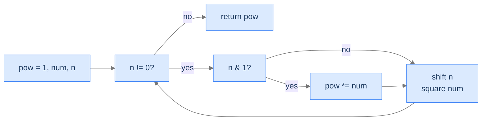

# Power Function — Fast Exponentiation

## The Problem

Given an integer `num` and a non-negative integer `n`, compute `num^n`. Required: O(log n) time.

```
Input:  num = 4, n = 2   →  16
Input:  num = 10, n = 3  →  1000
Input:  num = 2, n = 8   →  256
```

<details>
<summary><h2>The Recurrence — Bits of the Exponent</h2></summary>


Naive multiplication uses `n - 1` operations. We can do it in `log₂(n)` by exploiting binary representation:

`num^n = num^(b₀ + 2·b₁ + 4·b₂ + …)` where `b_i` are the bits of `n`. By the rule `x^(a + b) = x^a · x^b`, this becomes:

```
num^n = num^(b₀)  ×  num^(2·b₁)  ×  num^(4·b₂)  ×  ...
      = num^(2^0 if b₀=1 else 1) × num^(2^1 if b₁=1 else 1) × ...
```

So: keep a running `num`, doubling its exponent each iteration (`num = num * num`). For each *set* bit of `n`, multiply the accumulator `pow` by the current `num`. Iteration cost = `O(log n)`.

```
pow = 1
while n != 0:
    if n & 1:                # bit set in current position?
        pow *= num
    n = n >> 1               # move to the next bit
    num = num * num          # square num for the next bit position
return pow
```



<p align="center"><strong>Each iteration squares <code>num</code> (advancing one binary place) and conditionally multiplies it into <code>pow</code> if that bit of <code>n</code> was set. Total iterations = bit-width of <code>n</code> = O(log n).</strong></p>

> *Pause. For <code>num = 2, n = 8</code> (binary <code>1000</code>), how many multiplications happen? Predict before tracing.*

`8` in binary is `1000`. Three bits are zero (no result-multiplication), one bit (the topmost) is one (one result-multiplication). Plus 4 squarings of `num`. Total ~ 5 multiplications, vs 7 with naive looping. The saving grows: `n = 1000` saves ~990 multiplications.

</details>
<details>
<summary><h2>The Solution</h2></summary>


```python run viz=array
class Solution:
    def power_function(self, num: int, n: int) -> int:

        # Initialize result as 1
        pow: int = 1

        # Loop until n becomes 0
        while n != 0:

            # If n is odd, multiply the result by num
            if n & 1:
                pow *= num

            # Divide n by 2
            n = n >> 1

            # Multiply num by itself
            num = num * num

        # Return the result
        return pow


# Examples from the problem statement
print(Solution().power_function(4, 2))     # 16
print(Solution().power_function(10, 3))    # 1000
print(Solution().power_function(2, 8))     # 256

# Edge cases
print(Solution().power_function(5, 0))     # 1
print(Solution().power_function(1, 100))   # 1
print(Solution().power_function(2, 1))     # 2
print(Solution().power_function(3, 4))     # 81
print(Solution().power_function(0, 5))     # 0
```

```java run viz=array
public class Main {
    static class Solution {
        public long powerFunction(int num, int n) {

            // Initialize result as 1
            long pow = 1L;

            // Loop until n becomes 0
            while (n != 0) {

                // If n is odd, multiply the result by num
                if ((n & 1) == 1) {
                    pow *= num;
                }

                // Divide n by 2
                n = n >> 1;

                // Multiply num by itself
                num = num * num;
            }

            // Return the result
            return pow;
        }
    }

    public static void main(String[] args) {
        // Examples from the problem statement
        System.out.println(new Solution().powerFunction(4, 2));     // 16
        System.out.println(new Solution().powerFunction(10, 3));    // 1000
        System.out.println(new Solution().powerFunction(2, 8));     // 256

        // Edge cases
        System.out.println(new Solution().powerFunction(5, 0));     // 1
        System.out.println(new Solution().powerFunction(1, 100));   // 1
        System.out.println(new Solution().powerFunction(2, 1));     // 2
        System.out.println(new Solution().powerFunction(3, 4));     // 81
        System.out.println(new Solution().powerFunction(0, 5));     // 0
    }
}
```

</details>
<details>
<summary><strong>Trace — power_function(2, 8)</strong></summary>

```
Initial: pow = 1, num = 2, n = 8 (binary 1000)

Iter 1: n & 1 = 0 → skip multiply. n = 4. num = 4.
Iter 2: n & 1 = 0 → skip. n = 2. num = 16.
Iter 3: n & 1 = 0 → skip. n = 1. num = 256.
Iter 4: n & 1 = 1 → pow = 256. n = 0. num = 65536.

Loop ends. Return pow = 256 ✓.

Total: 4 squarings, 1 multiply into pow. Naive would have been 7 multiplies.
```

</details>
<details>
<summary><h2>Complexity</h2></summary>


| Aspect | Cost |
|---|---|
| Time | `O(log n)` — one iteration per bit of `n` |
| Space | `O(1)` |

Fast exponentiation is the workhorse behind RSA, modular exponentiation in cryptography, and many polynomial-time algorithms that need integer powers.

</details>
