## Why It Exists

A kernel makes one decision thousands of times a second on every core: *which runnable thread runs next?* It has to be **fair** (no task starves), **fast** (the pick is on the hottest path in the OS), and **deterministic** (a scheduler can't gamble on "expected" performance). Naive answers fail: a plain round-robin ignores priority and how much CPU each task already got; scanning every runnable task for the least-used one is `O(n)` per tick and collapses on a 256-core box with thousands of threads.

Linux's **Completely Fair Scheduler** (CFS, the default from 2.6.23 until EEVDF replaced it in 6.6) answered with a [red-black tree](/cortex/data-structures-and-algorithms/trees/red-black-tree/introduction-to-red-black-trees). Every runnable task is a node keyed by its **`vruntime`** — the weighted cumulative time it has run. Because the tree is ordered by `vruntime`, the **leftmost node is the task that has run the least**, and that's the one CFS runs next. Pick the leftmost, run it for a slice, bump its `vruntime`, re-insert — every scheduling tick is two `O(log n)` tree ops (and the leftmost pick is made `O(1)` with one cached pointer). This is the most-deployed red-black tree on Earth, and a clean lesson in *why* a real system picks one balanced tree over another.

## See It Work

The fairness loop in miniature: the run queue is ordered by `vruntime`; each tick picks the leftmost (least-run) task, runs it a slice, and advances its `vruntime`. Watch the CPU time spread out evenly.

```python run viz=array
import ast

n_ticks = ast.literal_eval(input())   # number of scheduling ticks

rq = {"A": 0, "B": 0, "C": 0}             # vruntime per runnable task (all fresh)
cpu = {"A": 0, "B": 0, "C": 0}
slice_ms = 10
for _ in range(n_ticks):
    nxt = min(rq, key=lambda t: (rq[t], t))   # leftmost RB-tree node = smallest vruntime
    cpu[nxt] += slice_ms                       # run it for one time slice
    rq[nxt] += slice_ms                        # advance its vruntime, then reinsert
print("CPU time:", " ".join(f"{k}={cpu[k]}" for k in sorted(cpu)))
print("vruntime:", " ".join(f"{k}={rq[k]}" for k in sorted(rq)))
```

```java run viz=array
import java.util.*;
public class Main {
    static String leftmost(TreeMap<String, Integer> rq) {   // smallest vruntime; key order breaks ties by name
        String best = null;
        for (var e : rq.entrySet()) if (best == null || e.getValue() < rq.get(best)) best = e.getKey();
        return best;
    }
    public static void main(String[] x) {
        Scanner sc = new Scanner(System.in);
        int nTicks = Integer.parseInt(sc.nextLine().trim());   // number of scheduling ticks
        TreeMap<String, Integer> rq = new TreeMap<>(Map.of("A", 0, "B", 0, "C", 0));   // vruntime per task
        TreeMap<String, Integer> cpu = new TreeMap<>(Map.of("A", 0, "B", 0, "C", 0));
        int slice = 10;
        for (int i = 0; i < nTicks; i++) {                       // nTicks scheduling ticks
            String nxt = leftmost(rq);                           // leftmost = least-run task
            cpu.put(nxt, cpu.get(nxt) + slice);                  // run a slice
            rq.put(nxt, rq.get(nxt) + slice);                    // advance vruntime, reinsert
        }
        List<String> cpuParts = new ArrayList<>();
        for (String k : new TreeSet<>(cpu.keySet())) cpuParts.add(k + "=" + cpu.get(k));
        List<String> rqParts = new ArrayList<>();
        for (String k : new TreeSet<>(rq.keySet())) rqParts.add(k + "=" + rq.get(k));
        System.out.println("CPU time: " + String.join(" ", cpuParts));
        System.out.println("vruntime: " + String.join(" ", rqParts));
    }
}
```

```testcases
{
  "args": [
    { "id": "n_ticks", "label": "n_ticks", "type": "string", "placeholder": "9" }
  ],
  "cases": [
    { "args": { "n_ticks": "9" }, "expected": "CPU time: A=30 B=30 C=30\nvruntime: A=30 B=30 C=30" },
    { "args": { "n_ticks": "3" }, "expected": "CPU time: A=10 B=10 C=10\nvruntime: A=10 B=10 C=10" },
    { "args": { "n_ticks": "6" }, "expected": "CPU time: A=20 B=20 C=20\nvruntime: A=20 B=20 C=20" }
  ]
}
```

Both hand each task an **equal 30 ms** of CPU and leave every `vruntime` at **30**. That's the fairness invariant falling straight out of the data structure: keying on `vruntime` and always running the leftmost means the task that's furthest behind goes next, so no one pulls ahead. Nine ticks over three tasks -> three slices each.

## How It Works

The run queue is a red-black tree ordered by `vruntime`; the leftmost node is whoever runs next:

```mermaid
graph TD
    B["vruntime 20 · task B"] --> A["vruntime 10 · task A"]
    B --> C["vruntime 30 · task C"]
    A --> D["vruntime 5 · task D &#8592; leftmost = run next"]
    cache["rb_leftmost (cached)"] -. O(1) pick .-> D
    classDef pick fill:#bbf7d0,stroke:#16a34a
    class D pick
```



<p align="center"><strong>The tasks are BST-ordered by <code>vruntime</code> (in-order: 5, 10, 20, 30). The leftmost node — smallest <code>vruntime</code>, task D — is the least-run task, so it runs next. A cached pointer makes finding it O(1).</strong></p>

Three engineering choices turn the textbook RB-tree into `kernel/sched/fair.c`:

- **`vruntime` ordering makes fairness automatic.** `vruntime` is the cumulative time a task has run, weighted by priority. Sorting tasks by it means "least-run" is just "leftmost," and picking leftmost every time guarantees the most-starved task runs next. A task blocked on I/O accrues no `vruntime` while it sleeps — which is the source of both its responsiveness *and* a hazard ([Trace It](#trace-it)).
- **RB-tree, specifically — because writes dominate.** Every context switch is an *erase + insert* pair, so update cost rules. A red-black tree rebalances with a **constant** number of rotations (≤3) per update, versus an AVL tree's up-to-`log n`; AVL's slightly shallower height doesn't pay for the extra rotation churn on a write-heavy structure. Probabilistic structures (treap, skip list) are out entirely — a kernel needs a *deterministic* worst case, not an expected one. And the color bit is packed into the low bit of the parent pointer (always zero by alignment), so a node costs **zero** extra bytes.
- **Cached leftmost -> O(1) pick; per-CPU trees -> no contention.** Walking to the leftmost node is `O(log n)`; CFS instead keeps a cached `rb_leftmost` pointer updated on every insert/erase, so `pick_next_task_fair` is a single pointer dereference. And there isn't one global tree — there's **one tree per CPU** (`cfs_rq`), so cores don't fight over a lock; a periodic load balancer migrates tasks between trees to keep cores evenly fed.

> **Key takeaway.** CFS keeps runnable tasks in a red-black tree keyed by `vruntime` (weighted runtime); the **leftmost node is the least-run task**, so picking it next makes fairness fall out of the ordering. It's a red-black tree — not AVL — because scheduling is write-heavy and RB rebalances in a *constant* number of rotations with a *deterministic* worst case and *zero* per-node overhead (color bit in the pointer). A cached leftmost pointer makes the pick `O(1)`, and per-CPU trees plus a load balancer scale it from a Raspberry Pi to a 256-core server.

## Trace It

`vruntime` ordering is elegant until a task sleeps. A task blocked on I/O accrues no `vruntime`, so when it wakes its key can be far below everyone else's.

**Predict before you run:** tasks A, B, C have each run to `vruntime` 100. Task D slept the whole time, so its `vruntime` is still 0. D wakes up. If CFS schedules purely by leftmost with **no** adjustment, what happens over the next 12 ticks — does D run once and yield, or does it monopolize the CPU?

```python run viz=array
busy = {"A": 100, "B": 100, "C": 100}     # three tasks already ran to vruntime 100
slept = ("D", 0)                           # D slept on I/O the whole time -> vruntime still 0
slice_ms = 10

def schedule(start):
    rq = dict(start); runs = []
    for _ in range(12):
        nxt = min(rq, key=lambda t: (rq[t], t))   # leftmost = smallest vruntime
        runs.append(nxt); rq[nxt] += slice_ms
    return runs

name, vr = slept
rq1 = dict(busy); rq1[name] = vr                      # UNCLAMPED: waker keeps its tiny vruntime
print("unclamped:", schedule(rq1))

rq2 = dict(busy); rq2[name] = max(vr, min(busy.values()))   # CLAMPED: lift waker to the min_vruntime floor
print("clamped:  ", schedule(rq2))
```

<details>
<summary><strong>Reveal</strong></summary>

Unclamped, D **monopolizes** the CPU: `['D', 'D', 'D', 'D', 'D', 'D', 'D', 'D', 'D', 'D', 'A', 'B']` — ten slices in a row before anyone else runs. Because D's `vruntime` is 0 and everyone else's is 100, D stays leftmost until it has "caught up" 100 ms of runtime, freezing A, B, and C for a tenth of a second. On a desktop that's a visible stall; on a server it's a latency spike. CFS prevents this by clamping a waking task's `vruntime` up to a floor near the tree's `min_vruntime`: with `rq2[name] = max(0, 100)`, D enters at 100 and the result is a fair round-robin `['A', 'B', 'C', 'D', 'A', 'B', 'C', 'D', ...]`. The floor is the unglamorous detail that makes the elegant idea survive contact with real workloads — it lets a sleeper get a prompt slice (it *is* leftmost among equals) without letting it steal an unbounded burst. (The real kernel also uses *signed* `vruntime` differences so the 64-bit counter compares correctly even across its ~292-year wraparound.)

</details>

## Your Turn

Fairness so far meant *equal* CPU. But `nice`/priority means some tasks deserve *more*. CFS encodes priority as **weight**, and a task's `vruntime` advances *inversely* to its weight — a heavier (higher-priority) task's clock ticks slower, so it stays leftmost longer and runs more.

**Implement the weighted scheduler:** given `n_ticks`, run the loop picking the smallest `vruntime` each tick, advancing `vruntime` inversely to weight. Print the final CPU time for each task (sorted by name).

```python run viz=array
import ast

n_ticks = ast.literal_eval(input())   # number of scheduling ticks

WEIGHT = {"hi": 2, "lo": 1}                # "hi" carries 2x the scheduling weight (lower nice)
vr = {"hi": 0, "lo": 0}
cpu = {"hi": 0, "lo": 0}
slice_ms = 10
# Your code goes here
print("CPU time:", " ".join(f"{k}={cpu[k]}" for k in sorted(cpu)))
```

```java run viz=array
import java.util.*;
public class Main {
    public static void main(String[] x) {
        Scanner sc = new Scanner(System.in);
        int nTicks = Integer.parseInt(sc.nextLine().trim());   // number of scheduling ticks
        Map<String, Integer> WEIGHT = Map.of("hi", 2, "lo", 1);   // "hi" has 2x scheduling weight
        TreeMap<String, Integer> vr = new TreeMap<>(Map.of("hi", 0, "lo", 0));
        TreeMap<String, Integer> cpu = new TreeMap<>(Map.of("hi", 0, "lo", 0));
        int slice = 10;
        // Your code goes here
        List<String> parts = new ArrayList<>();
        for (String k : new TreeSet<>(cpu.keySet())) parts.add(k + "=" + cpu.get(k));
        System.out.println("CPU time: " + String.join(" ", parts));
    }
}
```

```testcases
{
  "args": [
    { "id": "n_ticks", "label": "n_ticks", "type": "string", "placeholder": "9" }
  ],
  "cases": [
    { "args": { "n_ticks": "9" }, "expected": "CPU time: hi=60 lo=30" },
    { "args": { "n_ticks": "3" }, "expected": "CPU time: hi=20 lo=10" },
    { "args": { "n_ticks": "6" }, "expected": "CPU time: hi=40 lo=20" },
    { "args": { "n_ticks": "12" }, "expected": "CPU time: hi=80 lo=40" }
  ]
}
```

<details>
<summary><strong>Editorial</strong></summary>

Each tick, pick the task with the smallest `vruntime` (ties broken by name); run a real time slice; advance its `vruntime` inversely to its weight (`slice // WEIGHT[nxt]`). A heavier task's virtual clock ticks half as fast, so it stays leftmost longer and accumulates proportionally more real CPU time.

```python solution time=O(n_ticks * n_tasks) space=O(n_tasks)
import ast

n_ticks = ast.literal_eval(input())

WEIGHT = {"hi": 2, "lo": 1}                # "hi" carries 2x the scheduling weight (lower nice)
vr = {"hi": 0, "lo": 0}
cpu = {"hi": 0, "lo": 0}
slice_ms = 10
for _ in range(n_ticks):
    nxt = min(vr, key=lambda t: (vr[t], t))    # leftmost = smallest vruntime
    cpu[nxt] += slice_ms                        # run a real time slice
    vr[nxt] += slice_ms // WEIGHT[nxt]          # vruntime advances INVERSELY to weight
print("CPU time:", " ".join(f"{k}={cpu[k]}" for k in sorted(cpu)))
```

```java solution
import java.util.*;
public class Main {
    public static void main(String[] x) {
        Scanner sc = new Scanner(System.in);
        int nTicks = Integer.parseInt(sc.nextLine().trim());
        Map<String, Integer> WEIGHT = Map.of("hi", 2, "lo", 1);
        TreeMap<String, Integer> vr = new TreeMap<>(Map.of("hi", 0, "lo", 0));
        TreeMap<String, Integer> cpu = new TreeMap<>(Map.of("hi", 0, "lo", 0));
        int slice = 10;
        for (int i = 0; i < nTicks; i++) {
            String nxt = null;
            for (var e : vr.entrySet()) if (nxt == null || e.getValue() < vr.get(nxt)) nxt = e.getKey();
            cpu.put(nxt, cpu.get(nxt) + slice);                   // run a real slice
            vr.put(nxt, vr.get(nxt) + slice / WEIGHT.get(nxt));   // vruntime advances inversely to weight
        }
        List<String> parts = new ArrayList<>();
        for (String k : new TreeSet<>(cpu.keySet())) parts.add(k + "=" + cpu.get(k));
        System.out.println("CPU time: " + String.join(" ", parts));
    }
}
```

</details>

## Reflect & Connect

- **The data structure picks the policy.** Keying the tree on `vruntime` and always running the leftmost node *is* the fairness policy — no separate "fairness algorithm" exists. Choose the key well and the behavior follows.
- **"Which balanced tree" is a real decision.** RB beats AVL here only because the workload is write-heavy and needs a deterministic worst case — constant rotations and zero memory overhead win over slightly shallower height. The same tradeoff table points the other way for read-heavy stores (where AVL or a B-tree shines).
- **The cached leftmost is the high-leverage trick.** One pointer turns an `O(log n)` pick into `O(1)` on the OS's hottest path. Small structural augmentations with outsized impact are everywhere in systems code.
- **Edge cases make it real.** The sleeper floor (`min_vruntime` clamp) and signed-difference comparisons for the 64-bit wrap are what separate a textbook RB-tree from a shipping scheduler — the same gap you saw between a textbook B-tree and [Postgres `nbtree`](/cortex/data-structures-and-algorithms/dsa-in-real-systems/postgres-b-tree-and-the-write-path).
- **It evolved.** Linux 6.6 replaced CFS with **EEVDF** (Earliest Eligible Virtual Deadline First) for better latency guarantees — but EEVDF still keeps tasks in an augmented red-black tree. The structure outlived the policy.

## Recall

<details>
<summary><strong>Q:</strong> What does CFS key its red-black tree on, and which node does it run next?</summary>

**A:** On `vruntime` (virtual runtime — weighted cumulative CPU time). It runs the **leftmost** node, which is the task with the smallest `vruntime` — i.e. the one that has run the least. That makes fairness fall out of the tree ordering.

</details>
<details>
<summary><strong>Q:</strong> Why a red-black tree rather than an AVL tree for the scheduler?</summary>

**A:** Scheduling is write-heavy (every context switch is an erase + insert), and RB rebalances in a *constant* number of rotations (≤3) versus AVL's up-to-`log n`. RB also gives a deterministic worst case and packs its color bit into the parent pointer for zero per-node overhead. AVL's slightly shallower height doesn't pay for the extra rotation churn.

</details>
<details>
<summary><strong>Q:</strong> What is <code>rb_root_cached</code> / the cached leftmost, and why does it matter?</summary>

**A:** An RB-tree augmented with a cached pointer to the leftmost node, maintained on every insert/erase. It turns "pick the next task" from an `O(log n)` walk into an `O(1)` pointer dereference — critical on the scheduler's hot path.

</details>
<details>
<summary><strong>Q:</strong> A task sleeps a long time, then wakes with a tiny <code>vruntime</code>. What goes wrong, and how does CFS fix it?</summary>

**A:** With no adjustment it would be leftmost for a long time and monopolize the CPU until it "caught up," starving other tasks. CFS clamps a waking task's `vruntime` up to a floor near the run queue's `min_vruntime`, so it gets a prompt slice without an unbounded burst.

</details>
<details>
<summary><strong>Q:</strong> How does CFS implement priority (<code>nice</code>) using the same leftmost rule?</summary>

**A:** Priority is a weight; a task's `vruntime` advances *inversely* to its weight. A higher-priority (heavier) task's `vruntime` grows slower, so it stays leftmost longer and is picked more often — giving it proportionally more CPU (2x weight -> ~2x CPU) without any separate code path.

</details>

## Sources & Verify

- **Linux source**: `lib/rbtree.c` (the generic, type-erased RB-tree via `container_of`), `include/linux/rbtree_augmented.h` (`rb_root_cached`), and `kernel/sched/fair.c` (`pick_next_task_fair`, `enqueue_task_fair`, `min_vruntime`). The [kernel scheduler docs](https://docs.kernel.org/scheduler/sched-design-CFS.html) describe CFS's `vruntime` model.
- **Jonathan Corbet**, "The EEVDF scheduler" and "CFS" articles on LWN.net — the design history and the 6.6 transition to EEVDF.
- **CLRS**, *Introduction to Algorithms*, ch. 13 (Red-Black Trees) — the invariants and the constant-rotation rebalancing the kernel implements.
- The fairness loop (equal 30 ms each), the unclamped sleeper monopolizing 10 slices vs the clamped round-robin, and the 2:1 weighted split (`hi` 60 / `lo` 30) all come from the runnable blocks above (deterministic single-CPU models of the `vruntime` schedule) — re-run to verify.
