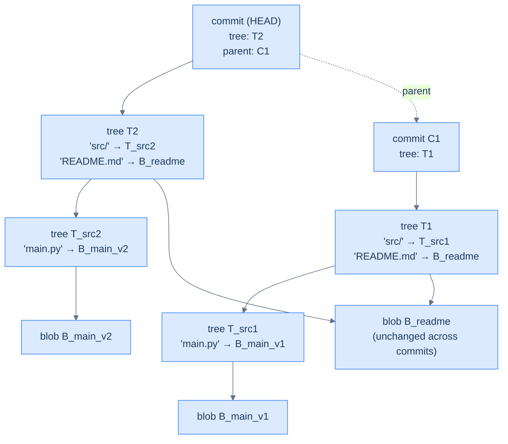

## Why It Exists

Git can branch, merge, rewrite history, and *never lose your work* — and it does it with no database, just files in `.git/objects/`. The magic is one structural decision: a Git repository is a **Merkle DAG of immutable, content-addressed objects**. "Content-addressed" means an object's name is literally the hash of its contents. That single rule buys three properties at once:

- **Identity = content → automatic dedup.** Two files with the same bytes hash to the same id, so Git stores them once. Commit the same logo in 50 directories; there's one blob.
- **Tamper-evidence.** Change any byte and the hash changes; since a tree references its files by hash and a commit references its tree and *parent* by hash, altering anything deep in history cascades to every id above it. You can't quietly rewrite the past ([Your Turn](#your-turn)).
- **Free versioning via structural sharing.** A new commit re-uses every unchanged object from the old one — it's the [persistent data structure](/cortex/data-structures-and-algorithms/probabilistic-and-advanced/persistent-data-structures) idea (path copying) applied to a whole filesystem ([Trace It](#trace-it)).

This is the same [Merkle tree](/cortex/data-structures-and-algorithms/concurrency-and-systems/distributed-data-structures-teaser) idea from the distributed-systems teaser — hash the children into the parent — generalized from a tree to a DAG (a merge commit has two parents). Once you see it, `log`, `diff`, `merge`, and `blame` stop being magic and become graph algorithms.

## See It Work

Git has four object types; the workhorses are **blob** (a file's bytes), **tree** (a directory listing), and **commit** (a snapshot pointing at a tree + parent commits). Every object's id is the SHA-1 of `"<type> <length>\0<content>"`. Here's that exact rule — and the dedup it gives:

```python run viz=array
import hashlib
def git_hash(obj_type, content):                       # Git's exact object id
    header = f"{obj_type} {len(content)}\0".encode()    # e.g. b"blob 6\x00"
    return hashlib.sha1(header + content.encode()).hexdigest()

a = git_hash("blob", "hello\n")
b = git_hash("blob", "hello\n")                         # identical content
c = git_hash("blob", "world\n")
print("blob id of 'hello\\n':", a)
print("identical content -> same id? ", a == b)        # dedup: stored once
print("different content -> diff id? ", a != c)
```

```java run viz=array
import java.security.MessageDigest;
public class Main {
    static String gitHash(String type, String content) throws Exception {
        byte[] body = content.getBytes("UTF-8");
        byte[] header = (type + " " + body.length + "\0").getBytes("UTF-8");   // "blob 6\0"
        byte[] all = new byte[header.length + body.length];
        System.arraycopy(header, 0, all, 0, header.length);
        System.arraycopy(body, 0, all, header.length, body.length);
        byte[] dig = MessageDigest.getInstance("SHA-1").digest(all);
        StringBuilder sb = new StringBuilder();
        for (byte b : dig) sb.append(String.format("%02x", b & 0xff));
        return sb.toString();
    }
    public static void main(String[] x) throws Exception {
        String a = gitHash("blob", "hello\n"), b = gitHash("blob", "hello\n"), c = gitHash("blob", "world\n");
        System.out.println("blob id of 'hello\\n': " + a);
        System.out.println("identical content -> same id?  " + a.equals(b));
        System.out.println("different content -> diff id?  " + !a.equals(c));
    }
}
```

Both print `blob id of 'hello\n': ce013625030ba8dba906f756967f9e9ca394464a`, then `true`, `true`. That id isn't a toy — it's **exactly** what real Git computes; run `printf 'hello\n' | git hash-object --stdin` and you'll get `ce013625030ba8dba906f756967f9e9ca394464a` byte-for-byte. Identical content yields an identical id (so Git dedups), and any change yields a different id (so nothing can be altered unnoticed).

## How It Works

A commit points at a tree, a tree points at blobs and sub-trees, and a commit points at its parent — all by hash. Two consecutive commits, where only `main.py` changed:



<p align="center"><strong>Two consecutive Git commits. The README hasn't changed, so both trees point to the same blob. Persistence and structural sharing in one diagram.</strong></p>

The load-bearing ideas:

- **The four object types are DAG nodes.** A **blob** is raw file bytes (no name). A **tree** is a directory listing — entries of `(mode, name, hash)` pointing at blobs or sub-trees, recursively, exactly like nested folders. A **commit** holds its root tree's hash, its parent commit hash(es) (zero for the first commit, two for a merge), plus author and message. A **tag** is an annotated label on a commit. Everything references everything else *by hash*.
- **Content addressing = dedup + integrity in one rule.** Because an id is the hash of content, equality of ids means equality of content. That gives free deduplication and makes `git diff A B` fast: when two trees (or sub-trees) have the same hash, they're identical, so Git short-circuits and never descends — only changed paths are walked. `git fsck` verifies the whole repo by re-hashing every object and checking it matches its name.
- **Structural sharing makes versions cheap.** Editing one file in a 100,000-file repo creates *one* new blob, a handful of new trees along the path to the root, and one new commit — the other ~99,999 blobs and all untouched sub-trees are **shared** with the previous commit. That's path copying from [persistent data structures](/cortex/data-structures-and-algorithms/probabilistic-and-advanced/persistent-data-structures); Git is the most-deployed example on Earth. (At scale, `git gc` packs loose objects into pack files with delta-compression, 5–10× smaller — but the logical model is unchanged.)

> **Key takeaway.** Git is a Merkle DAG of immutable, content-addressed objects: an object's id is the hash of its content, so identity equals content. That one rule delivers automatic **dedup** (same bytes → same id), **tamper-evidence** (any change cascades up through tree and commit hashes), and **free versioning** via **structural sharing** (a new commit re-uses every unchanged object). Blobs, trees, and commits are the nodes; `log`/`diff`/`merge`/`blame` are graph traversals over them. It's the [Merkle tree](/cortex/data-structures-and-algorithms/concurrency-and-systems/distributed-data-structures-teaser) generalized to a DAG and applied to a filesystem.

## Trace It

Structural sharing is the claim that a new commit barely allocates anything. Let's watch which object ids actually change when you edit one of two files.

**Predict before you run:** a commit has a tree with two files, `README.md` and `main.py`. You edit only `main.py` and commit again. Of the four object ids — README's blob, main.py's blob, the tree, the commit — which change, and which stay the same?

```python run viz=array
import hashlib
def gid(t, c):                                          # short git object id
    return hashlib.sha1(f"{t} {len(c)}\0".encode() + c.encode()).hexdigest()[:8]

# Commit 1: README + main.py
readme    = gid("blob", "# My Project\n")
main_v1   = gid("blob", "print(1)\n")
tree_v1   = gid("tree", f"{readme} README.md | {main_v1} main.py")
commit_v1 = gid("commit", f"tree {tree_v1} | edit")

# Commit 2: edit main.py; README untouched -> Git re-hashes its unchanged content
readme2   = gid("blob", "# My Project\n")               # same bytes -> same id
main_v2   = gid("blob", "print(2)\n")
tree_v2   = gid("tree", f"{readme2} README.md | {main_v2} main.py")
commit_v2 = gid("commit", f"tree {tree_v2} | parent {commit_v1} | edit")

print("main.py blob changed?", main_v1 != main_v2)
print("tree changed?        ", tree_v1 != tree_v2)
print("commit changed?      ", commit_v1 != commit_v2)
print("README blob reused?  ", readme == readme2)
```

<details>
<summary><strong>Reveal</strong></summary>

`main.py blob changed? True`, `tree changed? True`, `commit changed? True`, `README blob reused? True`. Editing `main.py` makes a new blob; because the tree lists that blob *by hash*, the tree's content changed, so the tree gets a new id; and because the commit names the tree by hash, the commit gets a new id too — the change ripples *up* the path to the root. But `README.md`'s bytes never changed, so re-hashing them yields the **same id** — Git doesn't store a second copy, it points the new tree at the existing blob. That's the whole persistence story: a commit only allocates new objects along the changed path (here: blob → tree → commit), and shares everything else. In a 100k-file repo, one edit is ~3–4 new objects, not 100k. The cost of a version is proportional to what changed, not to the size of the project — which is exactly why `git commit` is instant and `.git` doesn't explode.

</details>

## Your Turn

Now the flip side of structural sharing: because every object is named by a hash that includes its *parent's* hash, history is a Merkle chain — and that makes it tamper-evident.

**Predict:** you have a 3-commit chain (`init` → `add feature` → `fix bug`), each commit's content embedding its parent's id. An attacker edits the message of commit #1 (the oldest). How many of the three commit ids change — just the first, or more?

```python run viz=array
import hashlib
def gid(t, c):
    return hashlib.sha1(f"{t} {len(c)}\0".encode() + c.encode()).hexdigest()[:8]

def chain(msgs):                       # each commit embeds its parent's id
    ids = []; parent = ""
    for m in msgs:
        cid = gid("commit", f"parent {parent} | {m}")
        ids.append(cid); parent = cid
    return ids

honest   = chain(["init", "add feature", "fix bug"])
tampered = chain(["init (tampered)", "add feature", "fix bug"])   # change commit #1 only
print("honest chain: ", honest)
print("tampered chain:", tampered)
print("ids changed:", sum(a != b for a, b in zip(honest, tampered)), "of", len(honest))
```

```java run viz=array
import java.security.MessageDigest;
import java.util.*;
public class Main {
    static String gid(String t, String c) throws Exception {
        byte[] body = c.getBytes("UTF-8");
        byte[] header = (t + " " + body.length + "\0").getBytes("UTF-8");
        byte[] all = new byte[header.length + body.length];
        System.arraycopy(header, 0, all, 0, header.length);
        System.arraycopy(body, 0, all, header.length, body.length);
        byte[] dig = MessageDigest.getInstance("SHA-1").digest(all);
        StringBuilder sb = new StringBuilder();
        for (byte b : dig) sb.append(String.format("%02x", b & 0xff));
        return sb.substring(0, 8);
    }
    static List<String> chain(String[] msgs) throws Exception {
        List<String> ids = new ArrayList<>(); String parent = "";
        for (String m : msgs) { ids.add(gid("commit", "parent " + parent + " | " + m)); parent = ids.get(ids.size() - 1); }
        return ids;
    }
    public static void main(String[] x) throws Exception {
        List<String> honest = chain(new String[]{"init", "add feature", "fix bug"});
        List<String> tampered = chain(new String[]{"init (tampered)", "add feature", "fix bug"});
        System.out.println("honest chain:  " + honest);
        System.out.println("tampered chain: " + tampered);
        int changed = 0; for (int i = 0; i < honest.size(); i++) if (!honest.get(i).equals(tampered.get(i))) changed++;
        System.out.println("ids changed: " + changed + " of " + honest.size());
    }
}
```

Both report `ids changed: 3 of 3` — **all** of them. Editing the oldest commit changes its id; commit #2 embedded that id, so commit #2's content changed and its id changed too; that cascades to commit #3. There's no way to alter an ancestor without every descendant's hash shifting, which is precisely why a `git push --force` that rewrites old history produces entirely new commit ids (and why anyone who had the old ids can tell). This is the Merkle property doing security work: integrity of the whole chain reduces to checking a single top hash.

## Reflect & Connect

- **Content addressing is the master rule.** Identity = hash of content gives dedup, integrity, and a stable name, all at once. Reach for it whenever "same content should mean same thing" (build caches, CDNs, blockchains, container layers all do).
- **Structural sharing makes immutability affordable.** A new version copies only the changed path and shares the rest — the [persistent data structure](/cortex/data-structures-and-algorithms/probabilistic-and-advanced/persistent-data-structures) idea at filesystem scale. Immutable history costs proportional to the change, not the repo.
- **The Merkle property = tamper-evidence.** Because each id folds in its children's (and parent's) hashes, one top hash certifies the entire structure — the same idea you met in the [distributed-systems teaser](/cortex/data-structures-and-algorithms/concurrency-and-systems/distributed-data-structures-teaser) for replica repair, here securing history.
- **Every command is a graph algorithm.** `git log` is a DAG walk from HEAD; `git diff` is tree comparison with hash short-circuiting; `git merge` finds a lowest common ancestor and three-way-merges; `git blame` walks the parent chain. Learn the structure and the porcelain becomes obvious.
- **Same lesson as the other systems.** As with [Postgres `nbtree`](/cortex/data-structures-and-algorithms/dsa-in-real-systems/postgres-b-tree-and-the-write-path), the [CFS scheduler](/cortex/data-structures-and-algorithms/dsa-in-real-systems/linux-red-black-tree-in-the-cfs-scheduler), and [Redis encodings](/cortex/data-structures-and-algorithms/dsa-in-real-systems/redis-internal-encodings), a clean data structure plus a few sharp engineering choices is the whole product.

## Recall

<details>
<summary><strong>Q:</strong> What does "content-addressed" mean in Git, and what does it buy?</summary>

**A:** An object's id is the SHA-1 of its content (over `"<type> <length>\0<content>"`). So identity equals content: two identical files share one object (dedup), and any change alters the id (tamper-evidence). One rule, both properties.

</details>
<details>
<summary><strong>Q:</strong> What are Git's three core object types and how do they reference each other?</summary>

**A:** Blob (raw file bytes), tree (a directory listing of `(mode, name, hash)` entries pointing at blobs/sub-trees), and commit (root tree hash + parent commit hash(es) + metadata). All references are by hash, forming a Merkle DAG.

</details>
<details>
<summary><strong>Q:</strong> In object terms, what does editing one file in a 100k-file repo cost?</summary>

**A:** One new blob (the edited file) + a few new trees along the path to the root + one new commit. The other ~99,999 blobs and untouched sub-trees are shared with the previous commit — path copying / structural sharing.

</details>
<details>
<summary><strong>Q:</strong> Why is <code>git diff A B</code> fast on a huge tree?</summary>

**A:** Equal tree hashes mean identical content, so Git short-circuits unchanged sub-trees and never descends into them. Only paths whose hashes differ are walked.

</details>
<details>
<summary><strong>Q:</strong> Why can't you quietly rewrite an old commit?</summary>

**A:** Each commit's hash folds in its parent's hash. Changing an ancestor changes its id, which changes its child's content and id, cascading to every descendant. The whole chain's integrity reduces to one top hash — the Merkle property.

</details>

## Sources & Verify

- **Pro Git** (Chacon & Straub), Chapter 10 "Git Internals" — the object model, content addressing, and pack files; the canonical reference.
- **Git source**: `object.c`, `tree.c`/`commit.c`/`blob.c` (per-type handlers), `diff-tree.c` (tree diff with hash short-circuit), `pack-objects.c` (delta packing), `fsck.c` (DAG integrity check). The plumbing commands `git hash-object`, `git cat-file -p`, and `git fsck` expose the structure directly.
- **Merkle** (1987), hash trees — the integrity primitive underneath; see the [distributed-systems teaser](/cortex/data-structures-and-algorithms/concurrency-and-systems/distributed-data-structures-teaser).
- The `hello\n` blob id (`ce013625030ba8dba906f756967f9e9ca394464a`, which matches `git hash-object`), the structural-sharing trace (README blob reused while blob/tree/commit change), and the tamper cascade (`3 of 3` ids change) all come from the runnable blocks above, which use Git's exact object-hash formula — re-run to verify, or check the blob id against your own `git`.
