# Quick Reference

> Synced from the rest of this book on 2026-05-13. This page is a compressed view of the patterns covered in modules 1–11 — assumes you've read (or will read) the deeper chapters and just need glance-able recall.

A dense revision sheet. Not a tutorial. Every pattern card lists: a one-line invariant, the language clues that should trigger it in a problem, when *not* to reach for it, asymptotic cost, a minimum Python skeleton, and a link into the full chapter for worked examples and edge cases.

***

## Table of contents

1. [Pattern decision tree](#pattern-decision-tree)
2. [How to use this page](#how-to-use-this-page)
3. [Foundations](#1-foundations)
4. [Arrays and strings](#2-arrays-and-strings)
5. [Linked lists](#3-linked-lists)
6. [Stacks and queues](#4-stacks-and-queues)
7. [Hash tables](#5-hash-tables)
8. [Trees](#6-trees)
9. [Graphs](#7-graphs)
10. [Recursion and backtracking](#8-recursion-and-backtracking)
11. [Dynamic programming](#9-dynamic-programming)
12. [Sorting and searching](#10-sorting-and-searching)
13. [Strings (algorithms)](#11-strings)
14. [Bit tricks](#12-bit-tricks)
15. [Problem-solving heuristics](#13-problem-solving-heuristics)
16. [Advanced and production-only](#14-advanced-and-production-only)

***

## How to use this page

- **Click a section heading to collapse it.** Each top-level section is a `<details>` block so you can fold the topics you've already drilled.
- **Pattern card layout** is uniform: blockquote = one-line invariant, table = triggers/avoid/complexity, code block = Python skeleton, `[Full chapter →]` link drills into the worked examples and edge cases.
- **Order is curriculum order.** Foundations first; advanced last. The pattern decision tree below is the entry point if you don't know which section to jump to.

***

## Pattern decision tree

A starting point when you don't yet see the shape of the problem.

```mermaid
---
config:
  theme: base
  themeVariables:
    primaryColor: "#dbeafe"
    primaryBorderColor: "#3b82f6"
    primaryTextColor: "#1e3a5f"
    lineColor: "#64748b"
    secondaryColor: "#ede9fe"
    tertiaryColor: "#fef9c3"
---
flowchart TD
  START(["Read the problem"]) --> SHAPE{"What kind of<br/>structure?"}

  SHAPE -->|array / string| ARR{"Sorted?"}
  ARR -->|yes| ARR_YES{"Lookup target?"}
  ARR_YES -->|exact| BS[Binary search]
  ARR_YES -->|first/last| BOUND[Lower/upper bound]
  ARR_YES -->|pair sum| TP[Two pointers reduction]
  ARR -->|no| ARR_NO{"Contiguous<br/>window?"}
  ARR_NO -->|fixed K| FSW[Fixed sliding window]
  ARR_NO -->|variable| VSW[Variable sliding window]
  ARR_NO -->|sum = K| PS[Prefix sum + hash]
  ARR_NO -->|next/prev greater| MS[Monotonic stack]
  ARR_NO -->|intervals| IM[Interval merging / sweep]
  ARR_NO -->|kth element| QS[Quickselect or heap]

  SHAPE -->|linked list| LL{"Need pointer trick?"}
  LL -->|middle / cycle| FS[Fast & slow pointers]
  LL -->|reverse| REV[Three-pointer reversal]
  LL -->|merge sorted| MRG[Selector merge]

  SHAPE -->|tree| TREE{"What kind of pass?"}
  TREE -->|root → leaves carry state| PRE[Preorder stateful/stateless]
  TREE -->|leaves → root combine| POST[Postorder stateful/stateless]
  TREE -->|level by level| LVL[BFS level order]
  TREE -->|two nodes' ancestor| LCA[LCA recursion]

  SHAPE -->|graph| G{"Edge weights?"}
  G -->|none / 1| BFS[BFS shortest path]
  G -->|positive| DIJK[Dijkstra]
  G -->|negative| BF[Bellman-Ford]
  G -->|all pairs| FW[Floyd-Warshall]
  G -->|DAG order| TOPO[Topological sort]
  G -->|spanning subgraph| MST[Kruskal / Prim]
  G -->|connectivity over time| DSU[Union-Find]

  SHAPE -->|recursion / brute-force| REC{"Solution shape?"}
  REC -->|all candidates| BT[Backtracking]
  REC -->|optimal w/ overlap| DP[Dynamic programming]
  REC -->|n ≤ 20 subsets| BM[Bitmask DP]

  SHAPE -->|bits / counts| BIT[Bit tricks]
  SHAPE -->|repeated text| STR[KMP / Z / Rabin-Karp]

  classDef leaf fill:#fef9c3,stroke:#ca8a04,color:#713f12
  class BS,BOUND,TP,FSW,VSW,PS,MS,IM,QS,FS,REV,MRG,PRE,POST,LVL,LCA,BFS,DIJK,BF,FW,TOPO,MST,DSU,BT,DP,BM,BIT,STR leaf
```



<p align="center"><strong>A decision tree for picking a technique from the shape of the problem — follow the branches from the root question down to a highlighted leaf.</strong></p>

If a problem fits two leaves, try the cheaper one first; if both have the same cost, prefer the one with simpler invariants to argue.

***

<details>
<summary><h2 id="1-foundations">1. Foundations</h2></summary>

### Big-O ladder

| Class | Example | At n = 10⁶ |
|---|---|---|
| O(1) | array index, hash lookup | ~1 op |
| O(log n) | binary search, heap op | ~20 ops |
| O(√n) | sieve to √n, factor enumeration | ~1 000 ops |
| O(n) | one pass, BFS/DFS | ~10⁶ ops |
| O(n log n) | merge sort, heap sort, Dijkstra | ~2×10⁷ ops |
| O(n²) | nested loop, naive sort | 10¹² — too slow |
| O(2ⁿ) | subsets | only n ≤ ~20–25 |
| O(n!) | permutations | only n ≤ ~10 |

**Rules of thumb:**
- Modern CPU executes ~10⁸–10⁹ simple ops/sec. Above that, you're over budget.
- Big-O hides constants. O(n) merge of two arrays beats O(n) hash union by a real factor of ~3× because of cache locality.
- Amortised ≠ worst-case. Hash insert is O(1) amortised but O(n) on a single bad insert (rehash).

### Master theorem

For `T(n) = a·T(n/b) + f(n)` with `a ≥ 1, b > 1`:

| Case | Condition | Result |
|---|---|---|
| 1 | f(n) = O(n^(log_b a − ε)) | T(n) = Θ(n^(log_b a)) |
| 2 | f(n) = Θ(n^(log_b a)) | T(n) = Θ(n^(log_b a) · log n) |
| 3 | f(n) = Ω(n^(log_b a + ε)) AND a·f(n/b) ≤ c·f(n), c < 1 | T(n) = Θ(f(n)) |

**Doesn't apply when** f(n) sits *between* polynomial ranks (e.g. n · log n vs n^(1+ε)) — use Akra-Bazzi or the recursion tree directly.

Quick reference for common recurrences:

| Recurrence | T(n) |
|---|---|
| T(n) = T(n/2) + O(1) | O(log n) — binary search |
| T(n) = 2T(n/2) + O(n) | O(n log n) — merge sort, sort-and-merge |
| T(n) = T(n−1) + O(1) | O(n) — linear recursion |
| T(n) = 2T(n−1) + O(1) | O(2ⁿ) — naive Fibonacci, subsets |
| T(n) = T(n−1) + O(n) | O(n²) — insertion sort |

### Amortised analysis

| Method | One-liner |
|---|---|
| **Aggregate** | Bound the total cost of *n* operations; divide by *n*. |
| **Accounting** | Charge each operation more than its actual cost; "saved credit" pays for occasional expensive ones. |
| **Potential** | Define Φ(D) energy function; amortised cost = actual + ΔΦ. Reduces to algebra. |

Canonical wins: dynamic array push (resize once per 2× growth), splay tree access, union-find with path compression.

### Memory hierarchy

- **Cache line ≈ 64 bytes.** Contiguous reads prefetch the next line for free. Random pointer chasing pays full DRAM latency every dereference.
- **Latency ladder:** L1 ≈ 4 cycles, L2 ≈ 12, L3 ≈ 40, DRAM ≈ 150. A "cache miss" is ~50× the cost of a hit.
- **Row-major beats column-major** when iterating 2D arrays in C/Python/Java. The other order works in Fortran/MATLAB.

### Proof techniques

| Technique | When |
|---|---|
| **Induction** | Recursive correctness — prove base case + inductive step. |
| **Loop invariant** | Iterative correctness — state what's true at loop top; show init, maintenance, termination. |
| **Exchange argument** | Greedy correctness — show any optimal solution can be transformed into the greedy one without loss. |
| **Contradiction** | "X is impossible" claims. Common for lower bounds. |
| **Cut-and-paste** | DP correctness — show optimal substructure by swapping a subsolution for a better one. |

**Drill in:** [Foundations index →](/cortex/data-structures-and-algorithms/foundations/index)

</details>
<details>
<summary><h2 id="2-arrays-and-strings">2. Arrays and strings</h2></summary>

### Array operations

| Op | Static array | Dynamic array (Python list) |
|---|---|---|
| Access | O(1) | O(1) |
| Append | — | O(1) amortised |
| Insert at i | O(n) | O(n) |
| Delete at i | O(n) | O(n) |
| Linear search | O(n) | O(n) |
| Binary search (sorted) | O(log n) | O(log n) |

### Two pointers (direct)
> Both ends matter at the same time. Pointers start at opposite ends and march toward the middle in one pass.

| Time | Space | Triggers | Avoid when |
|---|---|---|---|
| O(n) | O(1) | palindrome check, reverse in-place, compare equidistant pairs | both pointers move in the same direction (use sliding window) |

#### The Generic Algorithm

**Step 1.** Initialise `left = 0`, `right = n − 1` (or whatever starting positions the problem requires, as long as `left < right`).

**Step 2.** Loop while `left < right`:
- **Step 2.1** — do some work on `arr[left]` and `arr[right]`
- **Step 2.2** — move `left` forward by some number of steps (if the problem requires it)
- **Step 2.3** — move `right` backward by some number of steps (if the problem requires it)

**Step 3.** Return the result.

#### Generic Implementation

**See:** [Palindrome checker](/cortex/data-structures-and-algorithms/linear-structures-arrays-pattern-two-pointers#palindrome-checker) · [Reverse words](/cortex/data-structures-and-algorithms/linear-structures-arrays-pattern-two-pointers#reverse-words) · [Vowel exchange](/cortex/data-structures-and-algorithms/linear-structures-arrays-pattern-two-pointers#vowel-exchange) · [Full chapter →](/cortex/data-structures-and-algorithms/linear-structures/arrays/pattern-two-pointers/pattern)

### Two pointers (reduction)
> Sort first, then converge. Pointer movement is dictated by comparing the running pair to a target.

| Time | Space | Triggers | Avoid when |
|---|---|---|---|
| O(n log n) | O(1) | two-sum on unsorted array, container with most water, target sum on unsorted | order of original input matters and you can't re-sort |

#### The Generic Algorithm

**Step 1.** Sort the array (or work on an index-pair view if the original indices matter).

**Step 2.** Initialise `left = 0`, `right = n − 1` so that `arr[left]` is the running minimum and `arr[right]` is the running maximum.

**Step 3.** Loop while `left < right`:
- **Step 3.1** — compute `sum = arr[left] + arr[right]` (or any other reduction over the pair).
- **Step 3.2** — if it matches the target, record the result.
- **Step 3.3** — if it's too small, move `left` forward; if it's too large, move `right` backward.

**Step 4.** Return the result.

#### Generic Implementation

**See:** [Two sum](/cortex/data-structures-and-algorithms/linear-structures-arrays-pattern-two-pointers-reduction#two-sum) · [Largest container](/cortex/data-structures-and-algorithms/linear-structures-arrays-pattern-two-pointers-reduction#largest-container) · [Target-limited two sum](/cortex/data-structures-and-algorithms/linear-structures-arrays-pattern-two-pointers-reduction#target-limited-two-sum) · [Full chapter →](/cortex/data-structures-and-algorithms/linear-structures/arrays/pattern-two-pointers-reduction/pattern)

### Two pointers (subproblem)
> Decompose into independent sub-instances; each one is a vanilla two-pointer scan. Outer loop fixes one variable; inner loop two-pointers the rest.

| Time | Space | Triggers | Avoid when |
|---|---|---|---|
| O(n²) typically | O(1) | three-sum, four-sum, k-sum | k > 4 — switch to hashing or meet-in-the-middle |

#### The Generic Algorithm

**Step 1.** Sort the array.

**Step 2.** Iterate `i` over the outer-loop range:
- **Step 2.1** — skip `i` whose value matches the previous to avoid duplicate outer choices.
- **Step 2.2** — reduce the remaining subarray `arr[i+1..n−1]` to a standard two-pointer reduction against an *adjusted* target.

**Step 3.** Aggregate every sub-result into the final result and return.

#### Generic Implementation

**See:** [Three sum](/cortex/data-structures-and-algorithms/linear-structures-arrays-pattern-two-pointers-subproblem#three-sum) · [Four sum](/cortex/data-structures-and-algorithms/linear-structures-arrays-pattern-two-pointers-subproblem#four-sum) · [K rotations](/cortex/data-structures-and-algorithms/linear-structures-arrays-pattern-two-pointers-subproblem#k-rotations-right) · [Full chapter →](/cortex/data-structures-and-algorithms/linear-structures/arrays/pattern-two-pointers-subproblem/pattern)

### Simultaneous traversal
> Walk two (or k) sorted sequences in lockstep; advance the pointer whose element loses the comparison.

| Time | Space | Triggers | Avoid when |
|---|---|---|---|
| O(n + m) | O(1) (in-place) | merge sorted arrays, intersect/union sorted, sequence subsequence check | inputs are unsorted and can't be sorted (use hash) |

#### The Generic Algorithm

**Step 1.** Initialise one pointer per sequence — `i = 0` for `a`, `j = 0` for `b`.

**Step 2.** Loop while both pointers are in bounds:
- **Step 2.1** — compare `a[i]` and `b[j]`.
- **Step 2.2** — advance whichever side "loses" the comparison (or both on a tie, depending on the problem).
- **Step 2.3** — record or emit the chosen element if the problem requires it.

**Step 3.** Drain the remaining suffix of whichever side still has elements (if the problem requires it).

**Step 4.** Return the result.

#### Generic Implementation

**See:** [Merge sorted arrays](/cortex/data-structures-and-algorithms/linear-structures-arrays-pattern-simultaneous-traversal#merge-sorted-arrays) · [Unique intersections](/cortex/data-structures-and-algorithms/linear-structures-arrays-pattern-simultaneous-traversal#unique-intersections) · [Subsequence checker](/cortex/data-structures-and-algorithms/linear-structures-arrays-pattern-simultaneous-traversal#subsequence-checker) · [Full chapter →](/cortex/data-structures-and-algorithms/linear-structures/arrays/pattern-simultaneous-traversal/pattern)

### Fixed sliding window
> Window of constant size K slides one step at a time. Maintain aggregate by *add one, remove one* in O(1) per step.

| Time | Space | Triggers | Avoid when |
|---|---|---|---|
| O(n) | O(1) or O(K) | "maximum/sum/average of every K consecutive", "size-K subarray with property" | window size depends on data — use variable window |

#### The Generic Algorithm

**Step 1.** Build the aggregate for the first K-sized window (`arr[0..k−1]`) and record it as the running best.

**Step 2.** Slide the window from `end = k` to `end = n − 1`:
- **Step 2.1** — add `contribution(arr[end])` to the aggregate.
- **Step 2.2** — subtract `contribution(arr[end − k])` from the aggregate.
- **Step 2.3** — update the running best with the current aggregate.

**Step 3.** Return the best.

#### Generic Implementation

**See:** [Subarray size equals K](/cortex/data-structures-and-algorithms/linear-structures-arrays-pattern-fixed-sliding-window#subarray-size-equals-k) · [Maximum ones](/cortex/data-structures-and-algorithms/linear-structures-arrays-pattern-fixed-sliding-window#maximum-ones) · [Even odd count](/cortex/data-structures-and-algorithms/linear-structures-arrays-pattern-fixed-sliding-window#even-odd-count) · [Full chapter →](/cortex/data-structures-and-algorithms/linear-structures/arrays/pattern-fixed-sliding-window/pattern)

### Variable sliding window
> Window expands when valid, contracts when invalid. Both pointers move forward only — each element enters and leaves once.

| Time | Space | Triggers | Avoid when |
|---|---|---|---|
| O(n) | O(K) | "longest/shortest substring with property", "at most K distinct", "no repeats" | predicate isn't monotone in window contents (shrinking may not restore validity) |

#### The Generic Algorithm

**Step 1.** Initialise `start = 0` and an empty window state.

**Step 2.** Loop `end` from `0` to `n − 1`:
- **Step 2.1** — **expand**: add `arr[end]` to the window state.
- **Step 2.2** — **contract**: while the window state violates the predicate, evict `arr[start]` and advance `start`.
- **Step 2.3** — **record**: update the running best with the current valid window.

**Step 3.** Return the best.

#### Generic Implementation

**See:** [Consecutive ones with K flips](/cortex/data-structures-and-algorithms/linear-structures-arrays-pattern-variable-sliding-window#consecutive-ones-with-k-flips) · [Product conundrum](/cortex/data-structures-and-algorithms/linear-structures-arrays-pattern-variable-sliding-window#product-conundrum) · [Maximum subarray sum](/cortex/data-structures-and-algorithms/linear-structures-arrays-pattern-variable-sliding-window#maximum-subarray-sum) · [Full chapter →](/cortex/data-structures-and-algorithms/linear-structures/arrays/pattern-variable-sliding-window/pattern)

### Interval merging
> Sort by start. Walk once; merge into the last interval if it overlaps, else append a new one.

| Time | Space | Triggers | Avoid when |
|---|---|---|---|
| O(n log n) | O(n) output | "merge overlapping ranges", "insert into schedule" | intervals are dynamic (use interval tree) |

#### The Generic Algorithm

**Step 1.** Sort the intervals by their start coordinate.

**Step 2.** Initialise the output list with the first interval.

**Step 3.** Sweep through the remaining intervals:
- **Step 3.1** — if the current interval's start is ≤ the last merged interval's end, extend the last merged interval's end to `max(last.end, current.end)`.
- **Step 3.2** — otherwise append the current interval as a new entry.

**Step 4.** Return the merged list.

#### Generic Implementation

**See:** [Verify schedule](/cortex/data-structures-and-algorithms/linear-structures-arrays-pattern-interval-merging#verify-schedule) · [Overlap reduction](/cortex/data-structures-and-algorithms/linear-structures-arrays-pattern-interval-merging#overlap-reduction) · [Insert interval](/cortex/data-structures-and-algorithms/linear-structures-arrays-pattern-interval-merging#insert-interval) · [Full chapter →](/cortex/data-structures-and-algorithms/linear-structures/arrays/pattern-interval-merging/pattern)

### Maximum overlap (sweep line)
> Convert intervals to start/end events, sort, sweep; running counter peaks at maximum concurrent overlap.

| Time | Space | Triggers | Avoid when |
|---|---|---|---|
| O(n log n) | O(n) | "minimum meeting rooms", "peak concurrent users", "max active sessions" | you need the merged intervals themselves — use interval merging |

#### The Generic Algorithm

**Step 1.** Emit two events per interval — a start-event with delta `+1` and an end-event with delta `−1`.

**Step 2.** Sort all events by coordinate; on ties, end-events (`−1`) sort **before** start-events (`+1`) so touching intervals don't count as overlapping.

**Step 3.** Sweep the events left-to-right:
- **Step 3.1** — apply each delta to a running counter `active`.
- **Step 3.2** — update `peak ← max(peak, active)` after every step.

**Step 4.** Return `peak`.

#### Generic Implementation

**See:** [Minimum meeting rooms](/cortex/data-structures-and-algorithms/linear-structures-arrays-pattern-maximum-overlap#minimum-meeting-rooms) · [Busiest interval](/cortex/data-structures-and-algorithms/linear-structures-arrays-pattern-maximum-overlap#busiest-interval) · [Peak resource requirement](/cortex/data-structures-and-algorithms/linear-structures-arrays-pattern-maximum-overlap#peak-resource-requirement) · [Full chapter →](/cortex/data-structures-and-algorithms/linear-structures/arrays/pattern-maximum-overlap/pattern)

**Drill in:** [Arrays index →](/cortex/data-structures-and-algorithms/linear-structures/arrays/index)

</details>
<details>
<summary><h2 id="3-linked-lists">3. Linked lists</h2></summary>

### List operations

| Op | Singly | Doubly |
|---|---|---|
| Access at i | O(n) | O(n) |
| Insert at known node | O(1) | O(1) |
| Delete at known node | O(n) (need prev) | O(1) |
| Reverse | O(n) | O(n) — just swap prev/next per node |
| Find middle | O(n) — fast/slow | O(n) |

### Reversal (singly)
> Three pointers: `prev`, `curr`, `next`. Flip `curr.next` to `prev`, slide all three forward.

| Time | Space | Triggers | Avoid when |
|---|---|---|---|
| O(n) | O(1) | "reverse list", "reverse first K", "reverse between i and j" | language gives reverse for free and constants matter more |

#### The Generic Algorithm

**Step 1.** Initialise `previous = NULL` and `current = head`.

**Step 2.** Loop while `current ≠ NULL`:
- **Step 2.1** — save `nextNode = current.next` (so we don't lose the rest of the list).
- **Step 2.2** — flip the link: `current.next ← previous`.
- **Step 2.3** — slide both pointers forward: `previous ← current`, `current ← nextNode`.

**Step 3.** Return `previous` — it now points at the new head.

#### Generic Implementation

**See:** [Reverse a list](/cortex/data-structures-and-algorithms/linear-structures-singly-linked-list-pattern-reversal#reverse-a-list) · [Reverse first K nodes](/cortex/data-structures-and-algorithms/linear-structures-singly-linked-list-pattern-reversal#reverse-first-k-nodes) · [Reverse the given segment](/cortex/data-structures-and-algorithms/linear-structures-singly-linked-list-pattern-reversal#reverse-the-given-segment) · [Full chapter →](/cortex/data-structures-and-algorithms/linear-structures/singly-linked-list/pattern-reversal/pattern)

### Reversal subproblem
> Compose reversals over groups: locate the segment, store the boundary nodes, reverse just the segment, reattach.

| Time | Space | Triggers | Avoid when |
|---|---|---|---|
| O(n) | O(1) | "reverse in K-groups", "pairwise swap", "reverse alternate" | single reversal suffices |

#### The Generic Algorithm

**Step 1.** Anchor a `dummy` node before the head; let `groupPrev = dummy`. This avoids special-casing the very first segment.

**Step 2.** Loop, peeling off one segment at a time:
- **Step 2.1** — walk K nodes from `groupPrev` to find the `kth` node of the next segment. If there aren't enough, exit.
- **Step 2.2** — save the boundary `groupNext = kth.next`.
- **Step 2.3** — reverse the K nodes between `groupPrev.next` and `kth` using the standard three-pointer reversal.
- **Step 2.4** — re-stitch the reversed segment to the rest of the list: `groupPrev → kth` (new head), `oldHead → groupNext`.
- **Step 2.5** — advance `groupPrev` to the new tail of the segment.

**Step 3.** Return `dummy.next`.

#### Generic Implementation

**See:** [Reverse K-segments](/cortex/data-structures-and-algorithms/linear-structures-singly-linked-list-pattern-reversal-subproblem#reverse-k-segments) · [Pairwise swap](/cortex/data-structures-and-algorithms/linear-structures-singly-linked-list-pattern-reversal-subproblem#pairwise-swap) · [Reverse alternate segments](/cortex/data-structures-and-algorithms/linear-structures-singly-linked-list-pattern-reversal-subproblem#reverse-alternate-segments) · [Full chapter →](/cortex/data-structures-and-algorithms/linear-structures/singly-linked-list/pattern-reversal-subproblem/pattern)

### Sliding window traversal
> Two pointers K steps apart march together. When `end` falls off, `start` is exactly K from the tail.

| Time | Space | Triggers | Avoid when |
|---|---|---|---|
| O(n) | O(1) | "Nth from end", "swap Nth from both ends", "delete Nth from end" | no constant offset between targets |

#### The Generic Algorithm

**Step 1.** Anchor a `dummy` node before the head; place `slow` and `fast` at `dummy`.

**Step 2.** **Phase 1 — open the gap.** Advance `fast` by exactly `k` steps so the two pointers are `k` nodes apart.

**Step 3.** **Phase 2 — slide together.** While `fast.next ≠ NULL`:
- **Step 3.1** — advance `slow` and `fast` by one step each.

**Step 4.** When `fast.next` is `NULL`, `slow` is parked exactly K positions before the end. Return `slow` (or operate on `slow.next`, depending on the problem).

#### Generic Implementation

**See:** [Trim Nth node](/cortex/data-structures-and-algorithms/linear-structures-singly-linked-list-pattern-sliding-window-traversal#trim-nth-node) · [Swap Nth nodes](/cortex/data-structures-and-algorithms/linear-structures-singly-linked-list-pattern-sliding-window-traversal#swap-nth-nodes) · [K maximum sum](/cortex/data-structures-and-algorithms/linear-structures-singly-linked-list-pattern-sliding-window-traversal#k-maximum-sum) · [Full chapter →](/cortex/data-structures-and-algorithms/linear-structures/singly-linked-list/pattern-sliding-window-traversal/pattern)

### Fast and slow pointers (Floyd)
> Move fast 2× speed, slow 1×. When fast hits end → slow is at middle. When pointers meet in a cycle → restart slow from head, march both 1× → meeting point is cycle start.

| Time | Space | Triggers | Avoid when |
|---|---|---|---|
| O(n) | O(1) | "middle node", "cycle detection", "cycle entry point", "palindrome check on list" | random access available (array) — direct indexing is simpler |

#### The Generic Algorithm

**Step 1.** Place `slow` and `fast` at the head. `slow` advances 1 node per step; `fast` advances `(n + 1)` nodes per step (typically 2).

**Step 2.** Loop while `fast ≠ NULL` and `fast.next ≠ NULL`:
- **Step 2.1** — `slow ← slow.next`, `fast ← fast.next.next`.
- **Step 2.2** — if `slow = fast`, a **cycle** exists.

**Step 3.** **Cycle entry recovery (Floyd's lemma).** When the pointers meet inside a cycle, reset `slow` to the head and march both pointers one step at a time — they meet again at the cycle entry.

**Step 4.** If `fast` (or `fast.next`) falls off the end, the list has no cycle and `slow` is parked at the `(n / (step+1))`-th node — the "1-out-of-(n+1)" position (the middle when `step = 1`).

#### Generic Implementation

**See:** [Middle node search](/cortex/data-structures-and-algorithms/linear-structures-singly-linked-list-pattern-fast-and-slow-pointers#middle-node-search) · [Split list in half](/cortex/data-structures-and-algorithms/linear-structures-singly-linked-list-pattern-fast-and-slow-pointers#split-list-in-half) · [Palindrome checker](/cortex/data-structures-and-algorithms/linear-structures-singly-linked-list-pattern-fast-and-slow-pointers#palindrome-checker) · [Full chapter →](/cortex/data-structures-and-algorithms/linear-structures/singly-linked-list/pattern-fast-and-slow-pointers/pattern)

### Split
> Route each node into one of K output lists via a classifier. Use dummy heads to avoid edge cases.

| Time | Space | Triggers | Avoid when |
|---|---|---|---|
| O(n) | O(K) dummies | "partition by value", "odd/even split", "k-way distribution" | classifier needs random access (use array) |

#### The Generic Algorithm

**Step 1.** Allocate K dummy head nodes — one per output bucket — and K matching `tails` pointers each pointing at its dummy.

**Step 2.** Walk the original list with a pointer `node`:
- **Step 2.1** — compute the bucket index via the classifier function `classify(node)`.
- **Step 2.2** — append `node` to that bucket's tail: `tails[bucket].next ← node`, then `tails[bucket] ← node`.
- **Step 2.3** — advance `node` to its next pointer.

**Step 3.** Terminate every bucket's tail with `NULL`.

**Step 4.** Return the K output heads — each is `dummies[i].next`.

#### Generic Implementation

**See:** [Even odd split](/cortex/data-structures-and-algorithms/linear-structures-singly-linked-list-pattern-split#even-odd-split) · [Split by modulo](/cortex/data-structures-and-algorithms/linear-structures-singly-linked-list-pattern-split#split-by-modulo) · [K-way list split](/cortex/data-structures-and-algorithms/linear-structures-singly-linked-list-pattern-split#k-way-list-split) · [Full chapter →](/cortex/data-structures-and-algorithms/linear-structures/singly-linked-list/pattern-split/pattern)

### Merge
> Walk two (or k) sorted lists; selector picks the smaller head; splice it in. Dummy head simplifies the empty-output edge case.

| Time | Space | Triggers | Avoid when |
|---|---|---|---|
| O(n + m) | O(1) | "merge sorted lists", "add two numbers", "k-way merge" (heap) | unsorted (sort first or use hash) |

#### The Generic Algorithm

**Step 1.** Allocate a `dummy` head and a `tail` pointer at the dummy.

**Step 2.** Loop while *both* input lists are non-empty:
- **Step 2.1** — call the selector `pickA(a, b)` to decide which side wins this step.
- **Step 2.2** — splice the winning node onto `tail.next` and advance both that input and `tail`.

**Step 3.** Attach whichever input still has a non-empty suffix to `tail.next`.

**Step 4.** Return `dummy.next`.

#### Generic Implementation

**See:** [Merge sorted lists](/cortex/data-structures-and-algorithms/linear-structures-singly-linked-list-pattern-merge#merge-sorted-lists) · [Alternate node fusion](/cortex/data-structures-and-algorithms/linear-structures-singly-linked-list-pattern-merge#alternate-node-fusion) · [List addition](/cortex/data-structures-and-algorithms/linear-structures-singly-linked-list-pattern-merge#list-addition) · [Full chapter →](/cortex/data-structures-and-algorithms/linear-structures/singly-linked-list/pattern-merge/pattern)

### Reorder
> Split → reverse one half → merge halves alternately. Reorder = split + reverse + merge composed in order.

| Time | Space | Triggers | Avoid when |
|---|---|---|---|
| O(n) | O(1) | "reorder list (L0→Ln→L1→Ln−1…)", "interleave halves" | one step alone (split or merge) is enough |

#### The Generic Algorithm

**Step 1.** **Split** the list into K parts using a classifier function (often K = 2: front-half / back-half).

**Step 2.** Optionally transform any of the parts in place (e.g. reverse the second half).

**Step 3.** **Merge** the parts back together using a selector function (often "alternate-pick").

**Step 4.** Return the head of the merged list.

#### Generic Implementation

**See:** [Shuffle list](/cortex/data-structures-and-algorithms/linear-structures-singly-linked-list-pattern-reorder#shuffle-list) · [Parity order](/cortex/data-structures-and-algorithms/linear-structures-singly-linked-list-pattern-reorder#parity-order) · [Value partition](/cortex/data-structures-and-algorithms/linear-structures-singly-linked-list-pattern-reorder#value-partition) · [Full chapter →](/cortex/data-structures-and-algorithms/linear-structures/singly-linked-list/pattern-reorder/pattern)

### Doubly linked list reversal
> No three-pointer dance — just swap `prev`/`next` on every node and walk via the (now swapped) `prev` pointer.

| Time | Space | Triggers | Avoid when |
|---|---|---|---|
| O(n) | O(1) | "reverse DLL", "reverse segment of DLL" | singly linked (use three-pointer reversal) |

#### The Generic Algorithm

**Step 1.** Initialise `current = head` and `newHead = NULL`.

**Step 2.** Loop while `current ≠ NULL`:
- **Step 2.1** — swap `current.prev` and `current.next` on the current node.
- **Step 2.2** — update `newHead ← current` (the last node visited is the new head).
- **Step 2.3** — advance via the (now-swapped) `prev` pointer: `current ← current.prev`.

**Step 3.** Return `newHead`.

#### Generic Implementation

**See:** Reverse DLL · Reverse segment of DLL · [Full chapter →](/cortex/data-structures-and-algorithms/linear-structures/doubly-linked-list/pattern-reversal/pattern)

### Doubly linked list two pointers
> DLL enables both-direction walk without reversal — left from head, right from tail, converging on the middle.

| Time | Space | Triggers | Avoid when |
|---|---|---|---|
| O(n) | O(1) | "palindrome DLL", "two-sum DLL", "symmetric ops on DLL" | singly linked — convert to array first |

#### The Generic Algorithm

**Step 1.** Place `left` at the `head` and `right` at the `tail` (DLL gives us O(1) access to both ends).

**Step 2.** Loop while `left ≠ right` and `left.prev ≠ right`:
- **Step 2.1** — compare or combine `left.val` and `right.val`.
- **Step 2.2** — based on the result, advance `left ← left.next`, or `right ← right.prev`, or both (on a match).

**Step 3.** Return the result.

#### Generic Implementation

**See:** [Palindrome number](/cortex/data-structures-and-algorithms/linear-structures-doubly-linked-list-pattern-two-pointers#palindrome-number) · [Two sum](/cortex/data-structures-and-algorithms/linear-structures-doubly-linked-list-pattern-two-pointers#two-sum) · [Duplicate-aware two sum](/cortex/data-structures-and-algorithms/linear-structures-doubly-linked-list-pattern-two-pointers#duplicate-aware-two-sum) · [Full chapter →](/cortex/data-structures-and-algorithms/linear-structures/doubly-linked-list/pattern-two-pointers/pattern)

**Also on DLL:** [Reversal subproblem](/cortex/data-structures-and-algorithms/linear-structures/doubly-linked-list/pattern-reversal-subproblem/pattern) (reverse only a segment of a DLL — re-attach via prev pointers) · [Reorder](/cortex/data-structures-and-algorithms/linear-structures/doubly-linked-list/pattern-reorder/pattern) (split + reverse + merge, mirror of the SLL reorder pattern).

**Drill in:** [Singly linked list index →](/cortex/data-structures-and-algorithms/linear-structures/singly-linked-list/index) · [Doubly linked list index →](/cortex/data-structures-and-algorithms/linear-structures/doubly-linked-list/index)

</details>
<details>
<summary><h2 id="4-stacks-and-queues">4. Stacks and queues</h2></summary>

### Stack and queue operations

| Op | Stack (LIFO) | Queue (FIFO) | Deque |
|---|---|---|---|
| Push back | O(1) | O(1) | O(1) |
| Pop / pop back | O(1) | — | O(1) |
| Pop front | — | O(1) | O(1) |
| Peek front/back | O(1) | O(1) | O(1) |
| Random access | — | — | — |

Stack uses: undo, recursion simulation, bracket matching, monotonic ops, postfix evaluation. Queue uses: BFS, scheduling, level-order, producer/consumer.

### Stack reversal
> Push all, pop all → output is reversed. Free side effect of LIFO.

| Time | Space | Triggers | Avoid when |
|---|---|---|---|
| O(n) | O(n) | "reverse string/array", "reverse word order in sentence" | two-pointer in-place reversal possible (O(1) space) |

#### The Generic Algorithm

**Step 1.** Push every input element onto a stack in their natural order.

**Step 2.** Pop elements one by one until the stack is empty; append each popped value to the output.

**Step 3.** Return the output — it is the input in reverse order, by LIFO semantics.

#### Generic Implementation

**See:** [Stack inversion](/cortex/data-structures-and-algorithms/linear-structures-stack-pattern-reversal#stack-inversion) · [Reverse the string](/cortex/data-structures-and-algorithms/linear-structures-stack-pattern-reversal#reverse-the-string) · [Reverse word order](/cortex/data-structures-and-algorithms/linear-structures-stack-pattern-reversal#reverse-word-order) · [Full chapter →](/cortex/data-structures-and-algorithms/linear-structures/stack/pattern-reversal/pattern)

### Monotonic stack — previous closest occurrence
> Maintain decreasing/increasing stack. Top of stack at index *i* is the answer for *i*. Pop dominated elements before pushing.

| Time | Space | Triggers | Avoid when |
|---|---|---|---|
| O(n) | O(n) | "previous greater/smaller element", "stock span", "preceding warmer day" | no monotonic relationship to exploit |

#### The Generic Algorithm

**Step 1.** Initialise an empty stack of indices and a result array of length `n` filled with the sentinel value.

**Step 2.** Walk `i` from `0` to `n − 1`:
- **Step 2.1** — pop every stack top whose value is *dominated* by `arr[i]` under the predicate.
- **Step 2.2** — the remaining stack top (if any) is the answer for `i`; record it.
- **Step 2.3** — push `i` onto the stack.

**Step 3.** Return the result.

#### Generic Implementation

**See:** [Preceding superior element](/cortex/data-structures-and-algorithms/linear-structures-stack-pattern-previous-closest-occurrence#preceding-superior-element) · [Preceding inferior element](/cortex/data-structures-and-algorithms/linear-structures-stack-pattern-previous-closest-occurrence#preceding-inferior-element) · [Preceding superior element II](/cortex/data-structures-and-algorithms/linear-structures-stack-pattern-previous-closest-occurrence#preceding-superior-element-ii) · [Full chapter →](/cortex/data-structures-and-algorithms/linear-structures/stack/pattern-previous-closest-occurrence/pattern)

### Monotonic stack — next closest occurrence
> Walk left-to-right; resolve old indices retroactively when a dominating element arrives. Whatever stays on the stack at the end has no answer.

| Time | Space | Triggers | Avoid when |
|---|---|---|---|
| O(n) | O(n) | "next greater/smaller element", "trapping rain water", "largest rectangle in histogram", "daily temperatures" | flat data without monotonic resolution |

#### The Generic Algorithm

**Step 1.** Initialise an empty stack and a result array of length `n` filled with the sentinel value.

**Step 2.** Walk `i` from `0` to `n − 1`:
- **Step 2.1** — while the stack is non-empty and `arr[i]` *resolves* the answer for the index at the stack top, pop and assign `result[top] ← i` (or any derived value).
- **Step 2.2** — push `i` onto the stack.

**Step 3.** Whatever remains on the stack after the loop has no resolving element — leave their answers as the sentinel.

#### Generic Implementation

**See:** [Succeeding superior element](/cortex/data-structures-and-algorithms/linear-structures-stack-pattern-next-closest-occurrence#succeeding-superior-element) · [Retained rainwater](/cortex/data-structures-and-algorithms/linear-structures-stack-pattern-next-closest-occurrence#retained-rainwater) · [Largest rectangle area](/cortex/data-structures-and-algorithms/linear-structures-stack-pattern-next-closest-occurrence#largest-rectangle-area) · [Full chapter →](/cortex/data-structures-and-algorithms/linear-structures/stack/pattern-next-closest-occurrence/pattern)

### Sequence validation (bracket matching)
> Push openers; on a closer, top must be its matching opener. Empty stack at end ⇔ balanced.

| Time | Space | Triggers | Avoid when |
|---|---|---|---|
| O(n) | O(n) | "valid parentheses", "balanced HTML/XML", "matching delimiters" | non-nestable sequences (regex / FSM is better) |

#### The Generic Algorithm

**Step 1.** Build the closer-to-opener map (e.g. `')' → '('`, `']' → '['`, …).

**Step 2.** Walk each token:
- **Step 2.1** — if the token is an opener, push it onto the stack.
- **Step 2.2** — if it's a closer, the stack must be non-empty AND the popped top must equal the matching opener — otherwise return FALSE.

**Step 3.** After all tokens, the sequence is valid iff the stack is empty.

#### Generic Implementation

**See:** [Parentheses checker](/cortex/data-structures-and-algorithms/linear-structures-stack-pattern-sequence-validation#parentheses-checker) · [Redundant parentheses](/cortex/data-structures-and-algorithms/linear-structures-stack-pattern-sequence-validation#redundant-parentheses) · [Balanced span](/cortex/data-structures-and-algorithms/linear-structures-stack-pattern-sequence-validation#balanced-span) · [Full chapter →](/cortex/data-structures-and-algorithms/linear-structures/stack/pattern-sequence-validation/pattern)

### Linear evaluation (expression / path)
> Stack holds partial results. On a closer (or operator), pop chunk, transform, push the new partial result back.

| Time | Space | Triggers | Avoid when |
|---|---|---|---|
| O(n) | O(n) | "evaluate postfix", "simplify path", "decode string", "basic calculator" | flat structure with no transformations |

#### The Generic Algorithm

**Step 1.** Initialise an empty stack of partial results.

**Step 2.** Walk each token:
- **Step 2.1** — if the token triggers a *combine* (an operator or a closer), pop the relevant operands/chunk from the stack, transform them, and push the new partial result back.
- **Step 2.2** — otherwise push the token's value onto the stack.

**Step 3.** After all tokens, the stack holds the final result; return its top.

#### Generic Implementation

**See:** [Canonicalise path](/cortex/data-structures-and-algorithms/linear-structures-stack-pattern-linear-evaluation#canonicalise-path) · [String expansion](/cortex/data-structures-and-algorithms/linear-structures-stack-pattern-linear-evaluation#string-expansion) · [Formula parsing](/cortex/data-structures-and-algorithms/linear-structures-stack-pattern-linear-evaluation#formula-parsing) · [Full chapter →](/cortex/data-structures-and-algorithms/linear-structures/stack/pattern-linear-evaluation/pattern)

### Monotonic deque (sliding-window max/min)
> Deque holds candidates that *could* still become the window max. Pop dominated from the back on insert; pop front when it leaves the window.

| Time | Space | Triggers | Avoid when |
|---|---|---|---|
| O(n) | O(K) | "sliding window maximum/minimum", "first negative in every K-window" | size-K aggregate that's not max/min (use heap) |

#### The Generic Algorithm

**Step 1.** Initialise an empty deque (holds indices of candidates for the window's max).

**Step 2.** Walk `i` from `0` to `n − 1`:
- **Step 2.1** — pop from the back of the deque while `arr[deque.back()]` is dominated by `arr[i]` (those candidates can never win again).
- **Step 2.2** — push `i` onto the back of the deque.
- **Step 2.3** — if the front index has fallen out of the window (`deque.front() ≤ i − k`), pop it off the front.
- **Step 2.4** — once `i ≥ k − 1`, the front of the deque is the current window's maximum; record `arr[deque.front()]`.

**Step 3.** Return the result.

#### Generic Implementation

**See:** Sliding window maximum · First negative number in every window of size K

**Drill in:** [Stack index →](/cortex/data-structures-and-algorithms/linear-structures/stack/index) · [Queue index →](/cortex/data-structures-and-algorithms/linear-structures/queue/index)

</details>
<details>
<summary><h2 id="5-hash-tables">5. Hash tables</h2></summary>

### Hash table operations

| Op | Avg | Worst |
|---|---|---|
| Insert | O(1) | O(n) |
| Delete | O(1) | O(n) |
| Lookup | O(1) | O(n) |
| Iteration | O(n) | O(n) |

**Collision strategies:**

| Strategy | One-liner | When |
|---|---|---|
| **Separate chaining** | Each bucket holds a linked list of colliders. | Default; simple; survives heavy load. |
| **Linear probing** | On collision, walk forward one slot at a time. | Cache-friendly; suffers from primary clustering. |
| **Quadratic probing** | Walk forward by i² steps. | Reduces primary clustering. |
| **Double hashing** | Walk forward by `hash₂(k)` steps. | Best probe distribution; needs two good hash functions. |

### Counting (frequency map)
> One pass builds the frequency map; subsequent lookups answer "how many of X" in O(1).

| Time | Space | Triggers | Avoid when |
|---|---|---|---|
| O(n) | O(distinct) | "anagram", "first unique char", "most frequent", "duplicate detection" | small fixed alphabet — a 256-int array beats a hash |

#### The Generic Algorithm

**Step 1.** Initialise an empty frequency map.

**Step 2.** Walk the input once:
- **Step 2.1** — for each item, increment its bucket in the map (creating the bucket on first sight).

**Step 3.** Use the map to answer the question (first item with count 1, most frequent, anagram check, etc.).

#### Generic Implementation

**See:** [First non repeating character](/cortex/data-structures-and-algorithms/linear-structures-hash-table-pattern-counting#first-non-repeating-character) · [Anagram checker](/cortex/data-structures-and-algorithms/linear-structures-hash-table-pattern-counting#anagram-checker) · [Build palindrome](/cortex/data-structures-and-algorithms/linear-structures-hash-table-pattern-counting#build-palindrome) · [Full chapter →](/cortex/data-structures-and-algorithms/linear-structures/hash-table/pattern-counting/pattern)

### Key generation (canonical form)
> Transform input to a canonical key; equal canonical keys = equivalent inputs. Bucket by canonical key.

| Time | Space | Triggers | Avoid when |
|---|---|---|---|
| O(n · k) | O(n) | "group anagrams", "isomorphic strings", "patterns of words" | equivalence is non-trivial to canonicalise (use UF) |

#### The Generic Algorithm

**Step 1.** Design a canonical key function `canonicalKey(item)` such that equivalent inputs produce the same key.

**Step 2.** Walk the inputs:
- **Step 2.1** — compute the canonical key for each item.
- **Step 2.2** — append the item to the bucket of that key in a hash map.

**Step 3.** The map's values are the equivalence classes (groups). Return them.

#### Generic Implementation

**See:** [Row specific words](/cortex/data-structures-and-algorithms/linear-structures-hash-table-pattern-pattern-generation#row-specific-words) · [Homomorphic strings](/cortex/data-structures-and-algorithms/linear-structures-hash-table-pattern-pattern-generation#homomorphic-strings) · [Cluster displaced strings](/cortex/data-structures-and-algorithms/linear-structures-hash-table-pattern-pattern-generation#cluster-displaced-strings) · [Full chapter →](/cortex/data-structures-and-algorithms/linear-structures/hash-table/pattern-pattern-generation/pattern)

### Fixed-window with hash (frequency over window)
> Slide a fixed-K window; maintain a frequency map by `add(end) / remove(start)`. Compare maps against target.

| Time | Space | Triggers | Avoid when |
|---|---|---|---|
| O(n) | O(K) | "find anagrams", "permutation in string", "contains duplicate within K" | aggregate is not a frequency map (use plain sliding window) |

#### The Generic Algorithm

**Step 1.** Build the target frequency map `need` from the reference structure (e.g. the pattern string).

**Step 2.** Initialise an empty `have` map and walk `i` across the input:
- **Step 2.1** — add `s[i]` to `have`.
- **Step 2.2** — once `i ≥ k`, remove `s[i − k]` from `have` (the element leaving the window).
- **Step 2.3** — once the window is full (`i ≥ k − 1`), if `have = need`, record a match at index `i − k + 1`.

**Step 3.** Return the list of match indices.

#### Generic Implementation

**See:** [Duplicate detection](/cortex/data-structures-and-algorithms/linear-structures-hash-table-pattern-fixed-sized-sliding-window#duplicate-detection) · [Contains variation](/cortex/data-structures-and-algorithms/linear-structures-hash-table-pattern-fixed-sized-sliding-window#contains-variation) · [Anagram finder](/cortex/data-structures-and-algorithms/linear-structures-hash-table-pattern-fixed-sized-sliding-window#anagram-finder) · [Full chapter →](/cortex/data-structures-and-algorithms/linear-structures/hash-table/pattern-fixed-sized-sliding-window/pattern)

### Variable-window with hash
> Window's predicate uses a frequency map (e.g. "at most K distinct"). Shrink while invalid; record best while valid.

| Time | Space | Triggers | Avoid when |
|---|---|---|---|
| O(n) | O(K) | "longest substring with K distinct chars", "longest substring without repeats", "min window substring" | predicate isn't expressible as a hash check |

#### The Generic Algorithm

**Step 1.** Initialise `start = 0`, an empty frequency map `freq`, and a running best.

**Step 2.** Walk `end` from `0` to `n − 1`:
- **Step 2.1** — **expand**: add `arr[end]` to `freq`.
- **Step 2.2** — **contract**: while `freq` violates the predicate, remove `arr[start]` from `freq` and advance `start`.
- **Step 2.3** — **record**: update the running best with the current valid window.

**Step 3.** Return the best.

#### Generic Implementation

**See:** [Unique character span](/cortex/data-structures-and-algorithms/linear-structures-hash-table-pattern-variable-sized-sliding-window#unique-character-span) · [K characters span](/cortex/data-structures-and-algorithms/linear-structures-hash-table-pattern-variable-sized-sliding-window#k-characters-span) · [Subarray sum equals k](/cortex/data-structures-and-algorithms/linear-structures-hash-table-pattern-variable-sized-sliding-window#subarray-sum-equals-k) · [Full chapter →](/cortex/data-structures-and-algorithms/linear-structures/hash-table/pattern-variable-sized-sliding-window/pattern)

### Prefix sum + hash
> `sum(i..j) = prefix[j] − prefix[i−1]`. Look up `prefix − target` in a map of previously-seen prefix sums.

| Time | Space | Triggers | Avoid when |
|---|---|---|---|
| O(n) | O(n) | "subarray sum equals K", "subarray divisible by K", "longest zero-sum subarray", "contiguous binary balanced subarray" | non-invertible aggregate (max, min) — use sliding window |

#### The Generic Algorithm

**Step 1.** Seed the prefix map with the empty-prefix sentinel (`0 ↦ −1` or `0 ↦ count 1`) so subarrays starting at index 0 are handled correctly.

**Step 2.** Walk `i` from `0` to `n − 1`, maintaining a running `prefix` aggregate:
- **Step 2.1** — update `prefix ← prefix + arr[i]`.
- **Step 2.2** — if `(prefix − k)` is in the map, update the answer using the stored value (count, first-index, etc.).
- **Step 2.3** — record `prefix` in the map.

**Step 3.** Return the answer.

#### Generic Implementation

**See:** [Subarray sum equals K](/cortex/data-structures-and-algorithms/linear-structures-hash-table-pattern-prefix-sum#subarray-sum-equals-k) · [Balanced binary subarray](/cortex/data-structures-and-algorithms/linear-structures-hash-table-pattern-prefix-sum#balanced-binary-subarray) · [Zero sum subarrays](/cortex/data-structures-and-algorithms/linear-structures-hash-table-pattern-prefix-sum#zero-sum-subarrays) · [Full chapter →](/cortex/data-structures-and-algorithms/linear-structures/hash-table/pattern-prefix-sum/pattern)

**Drill in:** [Hash table index →](/cortex/data-structures-and-algorithms/linear-structures/hash-table/index)

</details>
<details>
<summary><h2 id="6-trees">6. Trees</h2></summary>

### Binary tree traversals at a glance

| Order | Visit order | Recursive | Iterative |
|---|---|---|---|
| Preorder | root → L → R | natural | stack of nodes |
| Inorder | L → root → R | natural | stack with state |
| Postorder | L → R → root | natural | two stacks or reversed-preorder |
| Level-order (BFS) | top → bottom, left → right | not natural | queue |

For BST: inorder = sorted ascending; reverse-inorder = sorted descending.

### Preorder traversal — stateless
> Each call receives an immutable accumulator from its parent and passes a fresh extended copy to children. No backtracking needed.

| Time | Space | Triggers | Avoid when |
|---|---|---|---|
| O(n) | O(h) stack | "path sum to leaf", "depth assignment", "encode path-as-number" | children need a *shared* mutable view of accumulated state (use stateful) |

#### The Generic Algorithm

**Step 1.** Pass an *immutable* accumulator down through the recursion. Each call computes its own updated accumulator from the parent's accumulator and the current node.

**Step 2.** At each node:
- **Step 2.1** — compute `newAcc ← combine(accumulator, node.value)`.
- **Step 2.2** — recurse into the left and right children, each receiving its own copy of `newAcc`.

**Step 3.** Aggregate the two sub-answers and return.

#### Generic Implementation

**See:** [Sum of path](/cortex/data-structures-and-algorithms/trees-binary-tree-pattern-preorder-traversal-stateless#problem-1--sum-of-path) · [Depth assignment](/cortex/data-structures-and-algorithms/trees-binary-tree-pattern-preorder-traversal-stateless#problem-2--depth-assignment) · [Concatenated path](/cortex/data-structures-and-algorithms/trees-binary-tree-pattern-preorder-traversal-stateless#problem-3--concatenated-path) · [Full chapter →](/cortex/data-structures-and-algorithms/trees/binary-tree/pattern-preorder-traversal-stateless/pattern)

### Preorder traversal — stateful
> One shared mutable accumulator. Push on entry, pop on return — backtracking discipline.

| Time | Space | Triggers | Avoid when |
|---|---|---|---|
| O(n) | O(h) | "all root-to-leaf paths", "duplicate values on path", "tree views" | accumulator is small/scalar (use stateless and pass by value) |

#### The Generic Algorithm

**Step 1.** Maintain a *shared mutable* state outside the recursion (often a path list, a counter, or a hash set).

**Step 2.** At each node:
- **Step 2.1** — push the current node onto the state (entry).
- **Step 2.2** — process the node using the full state.
- **Step 2.3** — recurse into the left and right children.
- **Step 2.4** — pop from the state (exit / backtrack).

**Step 3.** When the recursion finishes, the state is restored to its initial form.

#### Generic Implementation

**See:** [Duplicates in path](/cortex/data-structures-and-algorithms/trees-binary-tree-pattern-preorder-traversal-stateful#problem-1--duplicates-in-path) · [Left view](/cortex/data-structures-and-algorithms/trees-binary-tree-pattern-preorder-traversal-stateful#problem-3--left-view) · [Right view](/cortex/data-structures-and-algorithms/trees-binary-tree-pattern-preorder-traversal-stateful#problem-4--right-view) · [Full chapter →](/cortex/data-structures-and-algorithms/trees/binary-tree/pattern-preorder-traversal-stateful/pattern)

### Postorder traversal — stateless
> Children answer first via return; parent combines into its own answer. No external state.

| Time | Space | Triggers | Avoid when |
|---|---|---|---|
| O(n) | O(h) | "height of tree", "balanced check", "subtree sum/aggregate", "validate BST" | parent needs to inspect specific descendant nodes (use stateful with global) |

#### The Generic Algorithm

**Step 1.** Recurse into the left and right children first. Each child returns its own answer.

**Step 2.** Combine the two sub-answers and the current node's value into a single return value.

**Step 3.** Return.

#### Generic Implementation

**See:** [Sum of leaves](/cortex/data-structures-and-algorithms/trees-binary-tree-pattern-postorder-traversal-stateless#problem-1--sum-of-leaves) · [Height of a binary tree](/cortex/data-structures-and-algorithms/trees-binary-tree-pattern-postorder-traversal-stateless#problem-2--height-of-a-binary-tree) · [Maximum root-to-leaf path sum](/cortex/data-structures-and-algorithms/trees-binary-tree-pattern-postorder-traversal-stateless#problem-3--maximum-root-to-leaf-path-sum) · [Full chapter →](/cortex/data-structures-and-algorithms/trees/binary-tree/pattern-postorder-traversal-stateless/pattern)

### Postorder traversal — stateful
> Return one value to parent, side-channel a different value into a global. Common in "diameter at any node" patterns where the answer isn't on the recursion's return path.

| Time | Space | Triggers | Avoid when |
|---|---|---|---|
| O(n) | O(h) + global | "diameter", "longest univalue path", "max path sum any-to-any", "count subtrees with property" | a clean single return suffices |

#### The Generic Algorithm

**Step 1.** Recurse into the left and right children; each child returns a *partial* value (e.g. the deepest single chain through it).

**Step 2.** Use both partials plus the current node's value to update a *global state* (e.g. the diameter passing through this node).

**Step 3.** Return only what the parent of this call needs to keep working — typically a single chain length, not the global answer.

#### Generic Implementation

**See:** [Diameter of tree](/cortex/data-structures-and-algorithms/trees-binary-tree-pattern-postorder-traversal-stateful#problem-1--diameter-of-tree) · [Longest monotonic path](/cortex/data-structures-and-algorithms/trees-binary-tree-pattern-postorder-traversal-stateful#problem-5--longest-monotonic-path) · [Path sum count](/cortex/data-structures-and-algorithms/trees-binary-tree-pattern-postorder-traversal-stateful#problem-7--path-sum-count) · [Full chapter →](/cortex/data-structures-and-algorithms/trees/binary-tree/pattern-postorder-traversal-stateful/pattern)

### Root-to-leaf path — stateless
> Accumulator descends preorder; verdict is computed at leaves; parents combine subtree verdicts postorder.

| Time | Space | Triggers | Avoid when |
|---|---|---|---|
| O(n) | O(h) | "has path with sum K?", "any leaf reachable with property", "binary-number paths" | need the actual paths (use stateful) |

#### The Generic Algorithm

**Step 1.** Carry an immutable accumulator from the root downward.

**Step 2.** At every node:
- **Step 2.1** — extend the accumulator with the current node: `newAcc ← combine(accumulator, node.value)`.
- **Step 2.2** — at a leaf, compute the verdict from `newAcc` and return it.
- **Step 2.3** — at an internal node, recurse into both children and aggregate their verdicts (`OR`, `AND`, `+`, etc.).

**Step 3.** Return the aggregated verdict from the root.

#### Generic Implementation

**See:** [Root to leaf path (sum check)](/cortex/data-structures-and-algorithms/trees-binary-tree-pattern-root-to-leaf-path-stateless#problem-1--root-to-leaf-path-sum-check) · [Binary summation of tree](/cortex/data-structures-and-algorithms/trees-binary-tree-pattern-root-to-leaf-path-stateless#problem-2--binary-summation-of-tree) · [Even path](/cortex/data-structures-and-algorithms/trees-binary-tree-pattern-root-to-leaf-path-stateless#problem-3--even-path) · [Full chapter →](/cortex/data-structures-and-algorithms/trees/binary-tree/pattern-root-to-leaf-path-stateless/pattern)

### Root-to-leaf path — stateful
> Maintain the path as a mutable list; at leaves (or matches), record a *copy*. Pop on the way back up.

| Time | Space | Triggers | Avoid when |
|---|---|---|---|
| O(n · h) | O(h) path + O(k·h) output | "all paths summing to target", "list every root-to-leaf path", "every node-to-leaf with property" | a single bool/sum is enough (use stateless) |

#### The Generic Algorithm

**Step 1.** Maintain a shared mutable path list (or counter, hash set, etc.).

**Step 2.** At each node:
- **Step 2.1** — push the current node onto the path.
- **Step 2.2** — at a leaf, evaluate the predicate over the full path; if it matches, record a *copy* of the path in the results.
- **Step 2.3** — recurse into the left and right children.
- **Step 2.4** — pop the current node off the path (backtrack).

**Step 3.** Return the accumulated results.

#### Generic Implementation

**See:** [Root-to-leaf paths summing to target](/cortex/data-structures-and-algorithms/trees-binary-tree-pattern-root-to-leaf-path-stateful#problem-1--root-to-leaf-paths-summing-to-target) · [Equal evens-and-odds paths](/cortex/data-structures-and-algorithms/trees-binary-tree-pattern-root-to-leaf-path-stateful#problem-2--equal-evens-and-odds-paths) · [Duplicate paths](/cortex/data-structures-and-algorithms/trees-binary-tree-pattern-root-to-leaf-path-stateful#problem-3--duplicate-paths) · [Full chapter →](/cortex/data-structures-and-algorithms/trees/binary-tree/pattern-root-to-leaf-path-stateful/pattern)

### Level-order traversal
> BFS with a queue. The trick: snapshot `len(queue)` at the start of each iteration — that's "all nodes on this level".

| Time | Space | Triggers | Avoid when |
|---|---|---|---|
| O(n) | O(w) max width | "level sums", "zigzag traversal", "right side view", "deepest leaves" | per-level logic isn't needed (DFS is simpler) |

#### The Generic Algorithm

**Step 1.** Initialise a FIFO queue containing the root and an empty result list.

**Step 2.** Loop while the queue is non-empty:
- **Step 2.1** — snapshot `levelSize ← size(queue)`. This is the count of nodes on the current level.
- **Step 2.2** — dequeue exactly `levelSize` nodes; for each, process it and enqueue its non-`NULL` children.
- **Step 2.3** — append the current level's data to the result.

**Step 3.** Return the result.

#### Generic Implementation

**See:** [Level sum](/cortex/data-structures-and-algorithms/trees-binary-tree-pattern-level-order-traversal#problem-1--level-sum) · [Zigzag traversal](/cortex/data-structures-and-algorithms/trees-binary-tree-pattern-level-order-traversal#problem-4--zigzag-traversal) · [Complete binary tree check](/cortex/data-structures-and-algorithms/trees-binary-tree-pattern-level-order-traversal#problem-3--complete-binary-tree-check) · [Full chapter →](/cortex/data-structures-and-algorithms/trees/binary-tree/pattern-level-order-traversal/pattern)

### Level-order traversal — columns
> BFS each node with its column index (`left → col − 1`, `right → col + 1`). Group by column for vertical/top/bottom views.

| Time | Space | Triggers | Avoid when |
|---|---|---|---|
| O(n log n) for column sort | O(n) | "vertical order traversal", "top view", "bottom view" | depth-only logic — use level-order |

#### The Generic Algorithm

**Step 1.** BFS the tree carrying a *column coordinate* alongside each node — root at `col = 0`, left child at `col − 1`, right child at `col + 1`.

**Step 2.** Group node values by column in a hash map (each entry stores `(row, value)` so column ordering can break ties stably).

**Step 3.** Emit the columns in sorted order; within each column, sort by row (then by value if the problem requires it).

#### Generic Implementation

**See:** [Top view](/cortex/data-structures-and-algorithms/trees-binary-tree-pattern-level-order-traversal-columns#problem-1--top-view) · [Bottom view](/cortex/data-structures-and-algorithms/trees-binary-tree-pattern-level-order-traversal-columns#problem-2--bottom-view) · [Vertical traversal](/cortex/data-structures-and-algorithms/trees-binary-tree-pattern-level-order-traversal-columns#problem-3--vertical-traversal) · [Full chapter →](/cortex/data-structures-and-algorithms/trees/binary-tree/pattern-level-order-traversal-columns/pattern)

### Lowest common ancestor (binary tree)
> Recurse left and right. If both sides return non-null → current node is LCA. Otherwise propagate the non-null side up.

| Time | Space | Triggers | Avoid when |
|---|---|---|---|
| O(n) | O(h) | "LCA of two nodes", "distance between nodes" (via LCA), "deepest common ancestor" | BST — use BST-LCA (O(h) without scanning whole tree) |

#### The Generic Algorithm

**Step 1.** Base case — if `node` is `NULL` or matches either target, return it directly.

**Step 2.** Recurse into the left and right children to get sub-results `L` and `R`.

**Step 3.** Combine:
- **Step 3.1** — if both `L` and `R` are non-`NULL`, the current node is the LCA — return it.
- **Step 3.2** — otherwise return whichever sub-result is non-`NULL` (or `NULL` if both are empty).

#### Generic Implementation

**See:** [Lowest Common Ancestor](/cortex/data-structures-and-algorithms/trees-binary-tree-pattern-lowest-common-ancestor#problem-1--lowest-common-ancestor) · [LCA of the deepest leaves](/cortex/data-structures-and-algorithms/trees-binary-tree-pattern-lowest-common-ancestor#problem-4--lca-of-the-deepest-leaves) · [Distance between two nodes](/cortex/data-structures-and-algorithms/trees-binary-tree-pattern-lowest-common-ancestor#problem-5--distance-between-two-nodes) · [Full chapter →](/cortex/data-structures-and-algorithms/trees/binary-tree/pattern-lowest-common-ancestor/pattern)

### Simultaneous traversal (two trees)
> Walk both trees together. Base case: both null = ok; one null = mismatch.

| Time | Space | Triggers | Avoid when |
|---|---|---|---|
| O(min(n, m)) | O(h) | "same tree?", "symmetric tree?", "subtree of?", "merge two trees" | trees have wildly different shapes (likely independent traversals) |

#### The Generic Algorithm

**Step 1.** Walk both trees together with paired pointers `(a, b)`.

**Step 2.** Base cases:
- **Step 2.1** — both `NULL` → return the *match* outcome.
- **Step 2.2** — exactly one `NULL` → return the *mismatch* outcome.

**Step 3.** Compare `a.value` and `b.value` per the problem's rule.

**Step 4.** Recurse into the paired children (`(a.left, b.left)` and `(a.right, b.right)`, or mirrored for symmetry checks) and combine the results.

#### Generic Implementation

**See:** [Identical trees](/cortex/data-structures-and-algorithms/trees-binary-tree-pattern-simultaneous-traversal#problem-1--identical-trees) · [Symmetry detection](/cortex/data-structures-and-algorithms/trees-binary-tree-pattern-simultaneous-traversal#problem-2--symmetry-detection) · [Subtree detection](/cortex/data-structures-and-algorithms/trees-binary-tree-pattern-simultaneous-traversal#problem-3--subtree-detection) · [Full chapter →](/cortex/data-structures-and-algorithms/trees/binary-tree/pattern-simultaneous-traversal/pattern)

***

### Binary search tree

| Op | Average (balanced) | Worst (skewed) |
|---|---|---|
| Search | O(log n) | O(n) |
| Insert | O(log n) | O(n) |
| Delete | O(log n) | O(n) |
| In-order traversal | O(n) | O(n) |

### BST — sorted (in-order) traversal
> Left → node → right yields ascending order. Track previous value to compute differences or validate.

| Time | Space | Triggers | Avoid when |
|---|---|---|---|
| O(n) | O(h) | "kth smallest", "BST validation", "minimum absolute difference", "convert BST to sorted DLL" | order-independent operations |

#### The Generic Algorithm

**Step 1.** Walk the BST in in-order — `left → node → right` — which yields nodes in ascending order.

**Step 2.** Maintain a running state (`previousValue`, a counter, a running sum, etc.) across consecutive in-order visits.

**Step 3.** At each visited node, update the running state and check the problem's predicate (e.g. minimum gap, kth element, BST validity).

**Step 4.** Stop early if the answer is found; otherwise continue.

#### Generic Implementation

**See:** [Lowest absolute variance](/cortex/data-structures-and-algorithms/trees-binary-search-tree-pattern-sorted-traversal#lowest-absolute-variance) · [BST validator](/cortex/data-structures-and-algorithms/trees-binary-search-tree-pattern-sorted-traversal#bst-validator) · [BST to sorted array](/cortex/data-structures-and-algorithms/trees-binary-search-tree-pattern-sorted-traversal#bst-to-sorted-array) · [Full chapter →](/cortex/data-structures-and-algorithms/trees/binary-search-tree/pattern-sorted-traversal/pattern)

### BST — reversed sorted traversal
> Right → node → left yields descending order. Same idea, mirrored.

| Time | Space | Triggers | Avoid when |
|---|---|---|---|
| O(n) | O(h) | "kth largest", "sum of nodes > X", "convert BST to greater tree" | ascending order suffices |

#### The Generic Algorithm

**Step 1.** Walk the BST in *reverse* in-order — `right → node → left` — which yields nodes in descending order.

**Step 2.** Maintain a running aggregate across consecutive visits (running sum, rank counter, max-so-far, …).

**Step 3.** At each visited node, update the aggregate and apply the per-problem transformation (e.g. overwrite `node.value` with the running sum, or stop at the Kth visit).

#### Generic Implementation

**See:** [Rank nodes](/cortex/data-structures-and-algorithms/trees-binary-search-tree-pattern-reversed-sorted-traversal#rank-nodes) · [Kth largest element](/cortex/data-structures-and-algorithms/trees-binary-search-tree-pattern-reversed-sorted-traversal#kth-largest-element) · [Enriched sum tree](/cortex/data-structures-and-algorithms/trees-binary-search-tree-pattern-reversed-sorted-traversal#enriched-sum-tree) · [Full chapter →](/cortex/data-structures-and-algorithms/trees/binary-search-tree/pattern-reversed-sorted-traversal/pattern)

### BST — range postorder
> Postorder, but prune any subtree entirely outside `[lo, hi]`. Useful for trim, range aggregates, and range deletion.

| Time | Space | Triggers | Avoid when |
|---|---|---|---|
| O(m + log n) where m = nodes in range | O(h) | "trim BST to range", "sum nodes in range", "delete nodes in range" | full traversal needed |

#### The Generic Algorithm

**Step 1.** If `node` is `NULL`, return the identity element (`NULL`, `0`, etc.).

**Step 2.** Prune by the BST property:
- **Step 2.1** — if `node.value < lo`, the entire left subtree is also `< lo`; recurse only into the right child.
- **Step 2.2** — if `node.value > hi`, the entire right subtree is also `> hi`; recurse only into the left child.

**Step 3.** Otherwise (`lo ≤ node.value ≤ hi`), recurse into both children and combine the sub-answers with the current node's contribution.

#### Generic Implementation

**See:** [Range summation](/cortex/data-structures-and-algorithms/trees-binary-search-tree-pattern-range-postorder#range-summation) · [Range diameter](/cortex/data-structures-and-algorithms/trees-binary-search-tree-pattern-range-postorder#range-diameter) · [Range exclusive trim](/cortex/data-structures-and-algorithms/trees-binary-search-tree-pattern-range-postorder#range-exclusive-trim) · [Full chapter →](/cortex/data-structures-and-algorithms/trees/binary-search-tree/pattern-range-postorder/pattern)

### BST — two pointer (forward + reverse iterator)
> One iterator yields ascending, another yields descending. Advance pointers like the array two-pointer pattern.

| Time | Space | Triggers | Avoid when |
|---|---|---|---|
| O(n) | O(h) | "two sum in BST", "pair with sum X in BST" | array conversion is acceptable (often simpler) |

#### The Generic Algorithm

**Step 1.** Build two iterators over the BST — `forward` yields values in ascending order; `reverse` yields them in descending order.

**Step 2.** Initialise `left = forward.next()` (smallest) and `right = reverse.next()` (largest).

**Step 3.** Loop while `left ≠ right` (in value or in node identity):
- **Step 3.1** — compute `pair = combine(left, right)`.
- **Step 3.2** — if it matches the target, return / record the hit.
- **Step 3.3** — if too small, `left ← forward.next()`. If too large, `right ← reverse.next()`.

**Step 4.** Return the result.

#### Generic Implementation

**See:** [Two sum on BST](/cortex/data-structures-and-algorithms/trees-binary-search-tree-pattern-two-pointer#two-sum-on-bst) · [Median in BST](/cortex/data-structures-and-algorithms/trees-binary-search-tree-pattern-two-pointer#median-in-bst) · [BST pair sum](/cortex/data-structures-and-algorithms/trees-binary-search-tree-pattern-two-pointer#bst-pair-sum) · [Full chapter →](/cortex/data-structures-and-algorithms/trees/binary-search-tree/pattern-two-pointer/pattern)

***

### Heap

| Op | Complexity |
|---|---|
| Push (add) | O(log n) |
| Pop (delete-min/max) | O(log n) |
| Peek | O(1) |
| Build from array (`heapify`) | O(n) |
| Decrease-key (with index map) | O(log n) |

A heap is a complete binary tree backed by a flat array. Parent of `i` is `(i−1)//2`; children are `2i+1` and `2i+2`. **Python `heapq` is a min-heap; negate values for max-heap.**

### Heap — top K elements
> Min-heap of size K → top K *largest*. Max-heap of size K → top K *smallest*. Replace heap-min/max whenever a better candidate appears.

| Time | Space | Triggers | Avoid when |
|---|---|---|---|
| O(n log K) | O(K) | "K largest", "K closest", "K most frequent" | K close to n — just sort |

#### The Generic Algorithm

**Step 1.** Decide the heap polarity:
- For **K largest** — use a *min-heap* of size K. Heap-min is the smallest of the top-K so far.
- For **K smallest** — use a *max-heap* of size K (in languages without one, push negated keys).

**Step 2.** Walk every input element:
- **Step 2.1** — push the element onto the heap.
- **Step 2.2** — if the heap exceeds size K, pop the root (the *least valuable* of the current top-K).

**Step 3.** After the pass, the heap holds the top K elements. Return them (sorted if the problem requires it).

#### Generic Implementation

**See:** [Kth largest element](/cortex/data-structures-and-algorithms/trees-heap-pattern-top-k-elements#kth-largest-element) · [Kth smallest element](/cortex/data-structures-and-algorithms/trees-heap-pattern-top-k-elements#kth-smallest-element) · [K sorted array sorting](/cortex/data-structures-and-algorithms/trees-heap-pattern-top-k-elements#k-sorted-array-sorting) · [Full chapter →](/cortex/data-structures-and-algorithms/trees/heap/pattern-top-k-elements/pattern)

### Heap — custom comparator
> Wrap entries in a class with `__lt__` defining your order, or push tuples whose natural tuple-ordering matches your priority.

| Time | Space | Triggers | Avoid when |
|---|---|---|---|
| O(log n) per op | O(n) | "merge K sorted lists", "schedule by frequency", "tiebreak ordering" | default scalar compare works |

#### The Generic Algorithm

**Step 1.** Define a comparator that captures the per-problem ordering. Common forms:
- a tuple key (the language's natural tuple comparison),
- a function `lessThan(a, b)` for languages that accept comparators,
- a custom `__lt__` / `compareTo` on a wrapper class.

**Step 2.** Push entries onto the heap using that comparator. Tie-breaks are encoded into the comparator (often an incrementing counter to keep ordering stable).

**Step 3.** Pop and process entries in the desired order.

#### Generic Implementation

**See:** [K-way list merge](/cortex/data-structures-and-algorithms/trees-heap-pattern-comparator#k-way-list-merge) · [K most frequent elements](/cortex/data-structures-and-algorithms/trees-heap-pattern-comparator#k-most-frequent-elements) · [K closest values](/cortex/data-structures-and-algorithms/trees-heap-pattern-comparator#k-closest-values) · [Full chapter →](/cortex/data-structures-and-algorithms/trees/heap/pattern-comparator/pattern)

***

### Trie (prefix tree)

| Op | Complexity (L = key length) |
|---|---|
| Insert | O(L) |
| Search exact | O(L) |
| Prefix walk | O(L + matches) |
| Space | O(Σ |words|) |

**Use:** autocomplete, longest common prefix, word break with dictionary, dictionary-based DFS (word search II), IP routing.

#### The Generic Algorithm

**Step 1.** Each node holds a map from character to child node plus a boolean `isEnd` marking word terminations.

**Step 2.** **Insert** walks the trie character-by-character, creating missing children along the way, and sets `isEnd` at the final node.

**Step 3.** **Search** walks the trie character-by-character; missing any child means no match. The final node's `isEnd` distinguishes exact words from mere prefixes.

#### Generic Implementation

**See:** [Trie introduction →](/cortex/data-structures-and-algorithms/trees/trie/introduction-to-tries)

***

### Disjoint Set Union (Union-Find)

| Op | Complexity (with both optimisations) |
|---|---|
| `find(x)` | O(α(n)) — effectively O(1) |
| `union(x, y)` | O(α(n)) |

Path compression flattens trees during `find`; union-by-rank keeps trees shallow.

**Use:** connected components, Kruskal MST, cycle detection in undirected graphs, offline connectivity queries.

#### The Generic Algorithm

**Step 1.** Maintain a forest of trees — each element starts in its own singleton set with `parent[i] = i` and `rank[i] = 0`.

**Step 2.** **Find** walks parents to the root; on the way back, path-compress every visited node to point directly at the root.

**Step 3.** **Union** finds both roots; if they differ, attach the smaller-rank tree under the larger-rank tree (union-by-rank). Increment the rank only on a tie.

#### Generic Implementation

**See:** [DSU introduction →](/cortex/data-structures-and-algorithms/trees/disjoint-set-union/introduction-to-disjoint-set-union)

***

### Segment tree

| Op | Complexity |
|---|---|
| Build | O(n) |
| Point update | O(log n) |
| Range query (sum/min/max/gcd) | O(log n) |
| Range update + range query (with lazy propagation) | O(log n) |
| Space | O(4n) safe |

**Use:** range query + point update on *any* associative operation; range update via lazy propagation.

#### The Generic Algorithm

**Step 1.** **Build** — recursively split the array range `[l, r]` at the midpoint; leaves store array values, internal nodes store the aggregate of their subtree.

**Step 2.** **Update** — descend from the root to the leaf for index `idx`; on the way back up, re-aggregate every visited internal node.

**Step 3.** **Range query** — descend until the current segment is fully *outside* (return identity), fully *inside* (return the stored aggregate), or *partially overlapping* (recurse into both halves and combine).

#### Generic Implementation

**See:** [Segment tree introduction →](/cortex/data-structures-and-algorithms/trees/segment-tree/introduction-to-segment-trees)

***

### Fenwick tree (Binary Indexed Tree)

| Op | Complexity |
|---|---|
| Point update | O(log n) |
| Prefix sum | O(log n) |
| Range sum = `prefix(r) − prefix(l−1)` | O(log n) |
| Space | O(n) |

Half the code of a segment tree; only supports invertible aggregates (sum, XOR, count). Index manipulation: `i & -i` extracts the lowest set bit.

#### The Generic Algorithm

**Step 1.** Use a 1-indexed array `t` of size `n + 1`, all zeros.

**Step 2.** **Update** at index `i` with delta `x` — keep adding `x` to `t[i]` and jumping `i ← i + (i & −i)` until `i > n`.

**Step 3.** **Prefix sum** up to index `i` — keep accumulating `t[i]` and jumping `i ← i − (i & −i)` until `i = 0`.

**Step 4.** **Range sum** `[l, r] = prefix(r) − prefix(l − 1)`.

#### Generic Implementation

**See:** [Fenwick tree introduction →](/cortex/data-structures-and-algorithms/trees/fenwick-tree/introduction-to-fenwick-trees)

**Drill in:** [Trees index →](/cortex/data-structures-and-algorithms/trees/index)

</details>
<details>
<summary><h2 id="7-graphs">7. Graphs</h2></summary>

### Representation comparison

| Representation | Space | Edge query | List neighbours of v | When to use |
|---|---|---|---|---|
| Adjacency matrix | O(V²) | O(1) | O(V) | dense graphs, frequent edge queries, V small |
| Adjacency list | O(V + E) | O(deg) | O(deg) | sparse graphs (most real-world cases) |
| Edge list | O(E) | O(E) | O(E) | Kruskal MST, Bellman-Ford — when you iterate edges |

### Depth-first search (DFS)
> Recurse into a neighbour as deep as possible before backtracking. Track visited to avoid revisits.

| Time | Space | Triggers | Avoid when |
|---|---|---|---|
| O(V + E) | O(V) | "reachability", "connected components", "topological sort", "cycle detection", "all paths s→t" | shortest path on unweighted graph (use BFS) |

#### The Generic Algorithm

**Step 1.** Mark `start` as visited.

**Step 2.** From `start`, follow one outgoing edge as deep as possible:
- **Step 2.1** — at each new node, mark it visited and process it.
- **Step 2.2** — recurse into the first unvisited neighbour.

**Step 3.** When no unvisited neighbour remains, backtrack to the parent and try its next neighbour.

**Step 4.** Stop when every reachable node has been visited.

#### Generic Implementation

**See:** [Traversing a graph →](/cortex/data-structures-and-algorithms/graphs/traversing-a-graph)

### Breadth-first search (BFS)
> FIFO queue expands ring-by-ring. First visit to a node = shortest path in *edges* from source.

| Time | Space | Triggers | Avoid when |
|---|---|---|---|
| O(V + E) | O(V) | "shortest path in unweighted graph", "level-order on graph", "min steps in grid", "word ladder" | weighted graph (use Dijkstra) |

#### The Generic Algorithm

**Step 1.** Enqueue `src` and mark it as discovered with distance `0`.

**Step 2.** Loop while the queue is non-empty:
- **Step 2.1** — dequeue `u` and process it.
- **Step 2.2** — for each neighbour `v` not yet discovered, mark `dist[v] ← dist[u] + 1` and enqueue `v`.

**Step 3.** Every node's first discovery is its shortest-path distance from `src`.

#### Generic Implementation

**See:** Shortest path in binary matrix · Word ladder · [Traversing a graph →](/cortex/data-structures-and-algorithms/graphs/traversing-a-graph)

### Grid traversal (BFS / DFS on a grid)
> Treat each cell as a node; neighbours are the 4 (or 8) adjacent cells in bounds. `visited` is usually a 2D set or in-place marker.

| Time | Space | Triggers | Avoid when |
|---|---|---|---|
| O(R·C) | O(R·C) | "islands", "flood fill", "rotten oranges", "shortest path in grid" | grid is too dense to enumerate (rare) |

#### The Generic Algorithm

**Step 1.** Define the four (or eight) `directions` for orthogonal/diagonal neighbours.

**Step 2.** Define `inBounds(r, c)` and the "interesting cell" predicate (e.g. `grid[r][c] = '1'`).

**Step 3.** For each interesting cell not yet visited, start a flood (DFS or BFS):
- **Step 3.1** — mark the cell visited (often by overwriting it in place).
- **Step 3.2** — for each direction, recurse/enqueue if the neighbour is in bounds and interesting.

**Step 4.** Each flood-start counts as a new region.

#### Generic Implementation

**See:** Number of islands · Rotting oranges · Walls and gates · [Traversing a grid →](/cortex/data-structures-and-algorithms/graphs/traversing-a-grid)

### Cycle detection — undirected
> DFS; record parent. A non-parent visited neighbour = cycle. Or use DSU: each `union` that fails (same root already) = cycle edge.

| Time | Space | Triggers | Avoid when |
|---|---|---|---|
| O(V + E) | O(V) | "graph valid tree?", "redundant edge", "undirected cycle detection" | directed graph (use 3-color) |

#### The Generic Algorithm

**Step 1.** DFS each unvisited node, passing along its DFS parent (`−1` for the entry point of a component).

**Step 2.** At each node `u`, scan its neighbours `v`:
- **Step 2.1** — if `v` is unvisited, recurse.
- **Step 2.2** — if `v` is visited AND `v ≠ parent`, a back-edge has been found → cycle.

**Step 3.** Return `TRUE` on the first back-edge; otherwise `FALSE` after all components are checked.

#### Generic Implementation

**See:** Graph valid tree · Redundant connection · [Cycle detection →](/cortex/data-structures-and-algorithms/graphs/cycle-detection)

### Cycle detection — directed (3-colour DFS)
> White = unvisited, Grey = on current path, Black = fully done. A `grey` neighbour during DFS = back edge = cycle.

| Time | Space | Triggers | Avoid when |
|---|---|---|---|
| O(V + E) | O(V) | "circular dependency", "course schedule", "deadlock detection in DAG candidate" | undirected (use parent-tracking) |

#### The Generic Algorithm

**Step 1.** Colour every node `WHITE` (unvisited).

**Step 2.** Run a DFS from every `WHITE` node:
- **Step 2.1** — colour the entered node `GREY` (on the current DFS path).
- **Step 2.2** — for each neighbour `v`: if `v` is `GREY` → back-edge → cycle. If `v` is `WHITE`, recurse.
- **Step 2.3** — on exit, colour the node `BLACK` (fully explored).

**Step 3.** Return `TRUE` on the first back-edge; otherwise `FALSE`.

#### Generic Implementation

**See:** Course schedule · [Cycle detection →](/cortex/data-structures-and-algorithms/graphs/cycle-detection)

### Topological sort — Kahn's (BFS over in-degrees)
> Queue all in-degree-0 nodes; pop one, "remove" its out-edges by decrementing neighbour in-degrees; push any that drop to 0. If you can't process all V, the graph has a cycle.

| Time | Space | Triggers | Avoid when |
|---|---|---|---|
| O(V + E) | O(V) | "build order", "task ordering with prerequisites", "alien dictionary" | not a DAG (no valid order exists) |

#### The Generic Algorithm

**Step 1.** Compute the in-degree of every node by scanning all edges.

**Step 2.** Enqueue every node whose in-degree is `0` — these are the entry points.

**Step 3.** Loop while the queue is non-empty:
- **Step 3.1** — dequeue a node `u` and append it to the output order.
- **Step 3.2** — for each neighbour `v`, decrement `indeg[v]`; if it hits `0`, enqueue `v`.

**Step 4.** If the output contains fewer than `n` nodes, the graph has a cycle (no valid topological order exists). Otherwise return the order.

#### Generic Implementation

**See:** Course schedule II · Alien dictionary · [Topological sort →](/cortex/data-structures-and-algorithms/graphs/topological-sort)

### Topological sort — DFS (post-order reversed)
> DFS the whole graph; push each node onto a stack *after* its descendants are done. Reverse the stack at the end.

| Time | Space | Triggers | Avoid when |
|---|---|---|---|
| O(V + E) | O(V) | "topological order", "longest path in DAG" (one-pass DP after topo) | Kahn's is preferred when you need cycle detection by side effect |

#### The Generic Algorithm

**Step 1.** DFS every unvisited node.

**Step 2.** On *exiting* a node (after all descendants are done), push it onto a stack.

**Step 3.** Reverse the stack at the end — that's the topological order.

#### Generic Implementation

**See:** [Topological sort →](/cortex/data-structures-and-algorithms/graphs/topological-sort)

### Single-source shortest path — Dijkstra
> Min-heap of `(dist, node)`. Pop the closest unfinalised node; relax its out-edges. Each node finalises once.

| Time | Space | Triggers | Avoid when |
|---|---|---|---|
| O((V + E) log V) | O(V) | "shortest path with non-negative weights", "cheapest cost path", "min effort path" | negative weights (use Bellman-Ford), unweighted (use BFS) |

#### The Generic Algorithm

**Step 1.** Initialise `dist[src] = 0` and `dist[v] = ∞` for every other node. Push `(0, src)` onto a min-heap keyed by distance.

**Step 2.** Loop while the heap is non-empty:
- **Step 2.1** — pop `(d, u)`. If `d > dist[u]`, this is a stale entry; skip.
- **Step 2.2** — for each outgoing edge `(u → v)` with weight `w`, relax: if `d + w < dist[v]`, set `dist[v] ← d + w` and push `(dist[v], v)`.

**Step 3.** Each node is finalised the first time it pops; return `dist`.

#### Generic Implementation

**See:** [Minimum cost path](/cortex/data-structures-and-algorithms/graphs-pattern-shortest-path-dijkstra#problem-minimum-cost-path) · [Cheapest flights with K stops](/cortex/data-structures-and-algorithms/graphs-pattern-shortest-path-dijkstra#problem-cheapest-flights-with-k-stops) · [Minimum travel time](/cortex/data-structures-and-algorithms/graphs-pattern-shortest-path-dijkstra#problem-minimum-travel-time) · [Full chapter →](/cortex/data-structures-and-algorithms/graphs/pattern-shortest-path-dijkstra/pattern)

### Single-source shortest path — Bellman-Ford
> Relax all edges V − 1 times. A V-th relaxation that still decreases distance = negative cycle.

| Time | Space | Triggers | Avoid when |
|---|---|---|---|
| O(V·E) | O(V) | "negative edge weights", "detect negative cycle", "arbitrage detection", "shortest path within K edges" | non-negative weights (Dijkstra is faster) |

#### The Generic Algorithm

**Step 1.** Initialise `dist[src] = 0`, `dist[v] = ∞` for all other `v`.

**Step 2.** Repeat `n − 1` times:
- **Step 2.1** — for every edge `(u, v, w)`, if `dist[u] + w < dist[v]`, set `dist[v] ← dist[u] + w`.
- **Step 2.2** — early exit if no edge relaxed in a full pass.

**Step 3.** **Negative-cycle check** — do one more relaxation pass. If anything still improves, a negative cycle is reachable from `src`.

#### Generic Implementation

**See:** Cheapest flights within K stops · Currency arbitrage · [Single-source shortest path →](/cortex/data-structures-and-algorithms/graphs/single-source-shortest-path)

### All-pairs shortest path — Floyd-Warshall
> Triple-nested DP: for each intermediate `k`, try to relax every pair (i, j) through k.

| Time | Space | Triggers | Avoid when |
|---|---|---|---|
| O(V³) | O(V²) | "shortest path between every pair", "small V (≤ 400)", "transitive closure" | V large — V × Dijkstra is O(V·(V+E) log V) which is often faster |

#### The Generic Algorithm

**Step 1.** Initialise an `n × n` matrix `dist` with `∞`; set `dist[i][i] = 0` and `dist[u][v] = w` for every edge.

**Step 2.** Triple-nested loop over `k`, `i`, `j`:
- **Step 2.1** — for each intermediate node `k`, try every pair `(i, j)` and relax `dist[i][j] ← min(dist[i][j], dist[i][k] + dist[k][j])`.

**Step 3.** After the outer `k`-loop, `dist[i][j]` is the shortest path that may use any subset of nodes as intermediates.

#### Generic Implementation

**See:** [All-pairs shortest path →](/cortex/data-structures-and-algorithms/graphs/all-pairs-shortest-path)

### DFS pattern — all paths s→t
> Path-local "visited" set; mutate on descent, undo on return. Enumerates every simple path.

| Time | Space | Triggers | Avoid when |
|---|---|---|---|
| O(2^V) worst | O(V) | "all paths source to target", "all simple cycles", "Hamiltonian path candidates" | only one path needed (Dijkstra/BFS) |

#### The Generic Algorithm

**Step 1.** Maintain a *path-local* visited set (not a global one) so a node can be re-used along different paths.

**Step 2.** DFS from `src`:
- **Step 2.1** — if the current node is `dst`, record a copy of the path and return.
- **Step 2.2** — for each neighbour not on the current path, add it to the path/set, recurse, then remove it on the way back (backtrack).

**Step 3.** Return all recorded paths.

#### Generic Implementation

**See:** [Source to target paths](/cortex/data-structures-and-algorithms/graphs-pattern-depth-first-search#problem-source-to-target-paths) · [Hamiltonian paths](/cortex/data-structures-and-algorithms/graphs-pattern-depth-first-search#problem-hamiltonian-paths) · [Simple cycles](/cortex/data-structures-and-algorithms/graphs-pattern-depth-first-search#problem-simple-cycles) · [Full chapter →](/cortex/data-structures-and-algorithms/graphs/pattern-depth-first-search/pattern)

### Connected components
> For every unvisited node, run a flood (DFS/BFS); each flood marks one component. Or feed every edge to DSU and count distinct roots.

| Time | Space | Triggers | Avoid when |
|---|---|---|---|
| O(V + E) (DFS) or O((V + E) α(V)) (DSU) | O(V) | "count connected groups", "number of provinces", "friend circles", "islands count" | dynamic edge additions/deletions (DSU shines; DFS doesn't) |

#### The Generic Algorithm

**Step 1.** Walk every node `u` from `0` to `n − 1`.

**Step 2.** If `u` has not been visited:
- **Step 2.1** — run a DFS or BFS flood from `u`, marking every reachable node as visited.
- **Step 2.2** — increment the component counter.

**Step 3.** After the loop, the counter equals the number of connected components.

#### Generic Implementation

**See:** [Find connected components](/cortex/data-structures-and-algorithms/graphs-pattern-connected-components#problem-find-connected-components) · [Island count](/cortex/data-structures-and-algorithms/graphs-pattern-connected-components#problem-island-count) · [Size of largest island](/cortex/data-structures-and-algorithms/graphs-pattern-connected-components#problem-size-of-largest-island) · [Full chapter →](/cortex/data-structures-and-algorithms/graphs/pattern-connected-components/pattern)

### Two-colouring (bipartite check)
> BFS/DFS while assigning alternating colours. Any edge between same-coloured endpoints = not bipartite.

| Time | Space | Triggers | Avoid when |
|---|---|---|---|
| O(V + E) | O(V) | "bipartite check", "two groups with no internal conflict", "possible biparition" | three or more groups required |

#### The Generic Algorithm

**Step 1.** Pick any uncoloured node `start`, colour it `0`, and BFS from it.

**Step 2.** For each edge `(u, v)`:
- **Step 2.1** — if `v` is uncoloured, paint it the opposite colour to `u`.
- **Step 2.2** — if `v` is already coloured AND `color[v] = color[u]`, return `FALSE` (the graph is not bipartite).

**Step 3.** Repeat for every connected component. If no conflict ever fires, return `TRUE`.

#### Generic Implementation

**See:** [Two colourable](/cortex/data-structures-and-algorithms/graphs-pattern-two-colouring#problem-two-colourable) · [Dislike pairs](/cortex/data-structures-and-algorithms/graphs-pattern-two-colouring#problem-dislike-pairs) · [Colour repair](/cortex/data-structures-and-algorithms/graphs-pattern-two-colouring#problem-colour-repair) · [Full chapter →](/cortex/data-structures-and-algorithms/graphs/pattern-two-colouring/pattern)

### BFS shortest path pattern (unweighted)
> Standard BFS. The first time you pop a node, the recorded distance is optimal. Use parent-pointers to reconstruct path.

| Time | Space | Triggers | Avoid when |
|---|---|---|---|
| O(V + E) | O(V) | "min hops", "fewest moves", "word ladder length" | edges have weights (use Dijkstra) |

#### The Generic Algorithm

**Step 1.** Enqueue `src` and seed `dist[src] = 0`.

**Step 2.** BFS — for each dequeued `u`, visit every undiscovered neighbour `v`:
- **Step 2.1** — set `dist[v] = dist[u] + 1` and remember `parent[v] = u`.
- **Step 2.2** — enqueue `v` (or return early if `v = target`).

**Step 3.** Reconstruct the path by walking `parent` pointers back from `target` to `src`, then reversing.

#### Generic Implementation

**See:** [Minimum steps in a grid](/cortex/data-structures-and-algorithms/graphs-pattern-shortest-path-breadth-first-search#problem-minimum-steps-in-a-grid) · [Nearest distance (multi-source BFS)](/cortex/data-structures-and-algorithms/graphs-pattern-shortest-path-breadth-first-search#problem-nearest-distance-multi-source-bfs) · [Shortest word transformation](/cortex/data-structures-and-algorithms/graphs-pattern-shortest-path-breadth-first-search#problem-shortest-word-transformation) · [Full chapter →](/cortex/data-structures-and-algorithms/graphs/pattern-shortest-path-breadth-first-search/pattern)

### Minimum spanning tree — Kruskal
> Sort edges by weight. Add each edge if it joins two different components (DSU.union returns true). Stop after V − 1 edges added.

| Time | Space | Triggers | Avoid when |
|---|---|---|---|
| O(E log E) | O(V) | "MST", "minimum cost to connect", "min cabling cost" | very dense graph + you happen to have adj-matrix (Prim is simpler) |

#### The Generic Algorithm

**Step 1.** Sort all edges ascending by weight.

**Step 2.** Initialise a DSU with every node in its own set.

**Step 3.** Walk the sorted edges:
- **Step 3.1** — if the endpoints lie in different DSU components, accept the edge into the MST and `union` the two components.
- **Step 3.2** — stop once `V − 1` edges have been accepted.

**Step 4.** Return the accepted edges.

#### Generic Implementation

**See:** Min cost to connect all points · [Minimum spanning trees →](/cortex/data-structures-and-algorithms/graphs/minimum-spanning-trees)

### Minimum spanning tree — Prim
> Start from any vertex. Maintain a min-heap of (weight, endpoint, source); always grow the tree by the cheapest crossing edge.

| Time | Space | Triggers | Avoid when |
|---|---|---|---|
| O((V + E) log V) | O(V) | "MST on dense graph", "node-incremental MST" | edges arrive in a stream offline (Kruskal is cleaner) |

#### The Generic Algorithm

**Step 1.** Pick any vertex as the seed; push it into a min-heap with weight `0`.

**Step 2.** Loop while the heap is non-empty and the tree isn't complete:
- **Step 2.1** — pop the smallest-weight edge `(w, u)`. If `u` is already in the tree, skip.
- **Step 2.2** — add `u` to the tree; accumulate `w` into the total.
- **Step 2.3** — push every edge from `u` to nodes still outside the tree.

**Step 3.** Return the accumulated weight (and the chosen edges, if needed).

#### Generic Implementation

**See:** [Minimum spanning trees →](/cortex/data-structures-and-algorithms/graphs/minimum-spanning-trees)

### Strongly connected components — Kosaraju
> Two passes: (1) DFS the original graph, push nodes by finish time. (2) DFS the *transpose* in reverse finish-time order — each tree is one SCC.

| Time | Space | Triggers | Avoid when |
|---|---|---|---|
| O(V + E) | O(V) | "SCCs in directed graph", "circular dependency groups", "2-SAT" | one-pass Tarjan acceptable (similar cost but harder to debug) |

#### The Generic Algorithm

**Step 1.** **Pass 1** — DFS the original graph. Whenever a node finishes (postorder), push it onto a stack.

**Step 2.** **Pass 2** — build the transpose graph by reversing every edge.

**Step 3.** Pop nodes off the stack one at a time (reverse finish-time order):
- **Step 3.1** — if a popped node hasn't been re-visited, DFS the transpose from it. The set of nodes reached is one SCC.

**Step 4.** Repeat until the stack is empty.

#### Generic Implementation

**See:** [Strongly connected components →](/cortex/data-structures-and-algorithms/graphs/strongly-connected-components)

### Strongly connected components — Tarjan
> One DFS pass tracking `disc[u]` (discovery time) and `low[u]` (lowest disc reachable via DFS subtree + one back-edge). When `disc[u] == low[u]`, pop the SCC off the stack.

| Time | Space | Triggers | Avoid when |
|---|---|---|---|
| O(V + E) | O(V) | "SCCs in one pass" | learning — Kosaraju's two-pass is easier to reason about |

#### The Generic Algorithm

**Step 1.** For each node, maintain `disc[u]` (discovery time) and `low[u]` (smallest discovery time reachable via the DFS subtree plus at most one back-edge).

**Step 2.** During DFS:
- **Step 2.1** — when entering `u`, push it onto a stack and mark it on-stack.
- **Step 2.2** — for each neighbour `v`: if `v` is unvisited, recurse and update `low[u]`. If `v` is on the stack, update `low[u]` with `disc[v]`.
- **Step 2.3** — when leaving `u`, if `low[u] = disc[u]`, pop the stack until `u` itself comes off — that's one SCC.

**Step 3.** Repeat from every unvisited node.

#### Generic Implementation

**See:** [Strongly connected components →](/cortex/data-structures-and-algorithms/graphs/strongly-connected-components)

### Bridges and articulation points
> Same Tarjan-style `disc`/`low` machinery on an undirected graph. Edge (u, v) is a *bridge* iff `low[v] > disc[u]`. Vertex u is an *articulation point* iff some child v has `low[v] ≥ disc[u]` (or u is root with ≥ 2 DFS children).

| Time | Space | Triggers | Avoid when |
|---|---|---|---|
| O(V + E) | O(V) | "critical connection", "single point of failure", "tarjan's bridge algorithm" | — |

#### The Generic Algorithm

**Step 1.** Run the same `disc` / `low` DFS as Tarjan, but on an *undirected* graph and tracking the DFS *parent* instead of an on-stack set.

**Step 2.** For each tree edge `(u → v)` (i.e. `v` unvisited from `u`):
- **Step 2.1** — recurse into `v`, then update `low[u] = min(low[u], low[v])`.
- **Step 2.2** — if `low[v] > disc[u]`, the edge `(u, v)` is a **bridge** — removing it disconnects the graph.

**Step 3.** For each non-tree neighbour `v ≠ parent`, update `low[u] = min(low[u], disc[v])` (back-edge).

#### Generic Implementation

**See:** Critical connections in a network · [Full chapter →](/cortex/data-structures-and-algorithms/graphs/bridges-and-articulation-points)

### Max flow, bipartite matching, 2-SAT (rare in interviews)
- **Max-flow (Ford-Fulkerson / Edmonds-Karp)** — O(V·E²) baseline. Augmenting paths until no more s→t path in residual graph. Use for resource allocation, baseball elimination, project selection.
- **Maximum bipartite matching** — Hopcroft-Karp O(E·√V) or just max-flow with unit capacities. Use for assignment problems.
- **2-SAT** — Reduce clauses to implication graph; satisfiable iff no variable and its negation are in the same SCC. O(V + E) via Tarjan.

**Drill in:** [Graphs index →](/cortex/data-structures-and-algorithms/graphs/index)

</details>
<details>
<summary><h2 id="8-recursion-and-backtracking">8. Recursion and backtracking</h2></summary>

### Recursion mental model

Three things every recursive function needs:
1. **Base case** — the smallest input you can answer directly.
2. **Recursive case** — reduce the input toward the base case via one or more self-calls.
3. **Combine** — fold the sub-answers into the answer for the current call.

| Variant | Where the work happens | Stack depth | Optimisable |
|---|---|---|---|
| Head recursion | After the recursive call returns (on the way *up*) | O(n) | No, must keep frames |
| Tail recursion | Before the recursive call (on the way *down*) | O(n) without TCO, O(1) with | Yes in TCO-aware languages (Scala, Scheme; **not Python/Java**) |
| Multiple recursion | More than one recursive call per invocation | O(depth) frames; cost ≈ branches^depth | Memoise → DP |
| Multidimensional | Multiple parameters reduce independently | O(product of dims) | Memoise → DP |

### Head recursion
> Recurse first, do work on the return path. The result of the recursive call feeds into the local computation.

#### The Generic Algorithm

**Step 1.** Check the base case. If reached, return the base answer directly.

**Step 2.** Make the recursive call on a *smaller* input (`n − 1`, half, etc.).

**Step 3.** Combine the recursive result with the current value into the final return — **the work happens on the way up**.

#### Generic Implementation

**See:** [Calculate factorial](/cortex/data-structures-and-algorithms/algorithms-by-strategy-recursion-pattern-head-recursion#calculate-factorial) · [Sum of digits](/cortex/data-structures-and-algorithms/algorithms-by-strategy-recursion-pattern-head-recursion#sum-of-digits) · [Reverse a queue](/cortex/data-structures-and-algorithms/algorithms-by-strategy-recursion-pattern-head-recursion#reverse-a-queue) · [Full chapter →](/cortex/data-structures-and-algorithms/algorithms-by-strategy/recursion/pattern-head-recursion/pattern)

### Tail recursion
> Do work first, accumulator descends; recursive call is the *last* action. With TCO this is a loop in disguise.

#### The Generic Algorithm

**Step 1.** Pass an accumulator parameter that carries the in-progress result down through every call.

**Step 2.** Do the work *before* the recursive call — update the accumulator using the current value.

**Step 3.** Make the recursive call on a *smaller* input plus the updated accumulator. The recursive call is the **last** action; with TCO this becomes a loop.

**Step 4.** Base case returns the accumulator directly.

#### Generic Implementation

**See:** [Reverse sequence](/cortex/data-structures-and-algorithms/algorithms-by-strategy-recursion-pattern-tail-recursion#reverse-sequence) · [Search element](/cortex/data-structures-and-algorithms/algorithms-by-strategy-recursion-pattern-tail-recursion#search-element) · [Is palindrome](/cortex/data-structures-and-algorithms/algorithms-by-strategy-recursion-pattern-tail-recursion#is-palindrome) · [Full chapter →](/cortex/data-structures-and-algorithms/algorithms-by-strategy/recursion/pattern-tail-recursion/pattern)

### Multiple recursion
> Two+ self-calls per invocation. The call tree branches; total work is exponential unless subproblems repeat (→ memoise).

#### The Generic Algorithm

**Step 1.** Check the base case. If reached, return the base answer.

**Step 2.** Make **two (or more) recursive calls** on different reductions of the input.

**Step 3.** Combine the sub-results into the answer for the current call.

**Step 4.** Without memoisation, the call tree is exponential; with `lru_cache` / a memo table it becomes linear in distinct subproblems → this is the doorway to dynamic programming.

#### Generic Implementation

Naive O(2ⁿ); add memoisation → O(n) for Fibonacci-like recurrences.

**See:** [Fibonacci number](/cortex/data-structures-and-algorithms/algorithms-by-strategy-recursion-pattern-multiple-recursion#fibonacci-number) · [Climb stairs](/cortex/data-structures-and-algorithms/algorithms-by-strategy-recursion-pattern-multiple-recursion#climb-stairs) · [Catalan number](/cortex/data-structures-and-algorithms/algorithms-by-strategy-recursion-pattern-multiple-recursion#catalan-number) · [Full chapter →](/cortex/data-structures-and-algorithms/algorithms-by-strategy/recursion/pattern-multiple-recursion/pattern)

### Multidimensional recursion
> Two or more parameters each shrink independently. State space is a grid of (param₁, param₂, …); memoise on the tuple.

#### The Generic Algorithm

**Step 1.** Define the state as a tuple `(x, y, …)` of multiple parameters.

**Step 2.** Base cases check each parameter independently (often when one becomes 0).

**Step 3.** Each recursive call reduces **one or more** parameters; combine the sub-answers.

**Step 4.** Memoise on the full state tuple — the state space is a multi-dimensional grid; without memo the cost is exponential, with memo it's polynomial.

#### Generic Implementation

**See:** [Binomial coefficient](/cortex/data-structures-and-algorithms/algorithms-by-strategy-recursion-pattern-multidimensional-recursion#binomial-coefficient) · [Lattice paths](/cortex/data-structures-and-algorithms/algorithms-by-strategy-recursion-pattern-multidimensional-recursion#lattice-paths) · [Egg dropping](/cortex/data-structures-and-algorithms/algorithms-by-strategy-recursion-pattern-multidimensional-recursion#egg-dropping) · [Full chapter →](/cortex/data-structures-and-algorithms/algorithms-by-strategy/recursion/pattern-multidimensional-recursion/pattern)

***

### Backtracking — unconditional enumeration
> Build a candidate one decision at a time; every leaf is a valid candidate; no pruning. Recurse on each choice, undo on return.

| Time | Space | Triggers | Avoid when |
|---|---|---|---|
| O(branches^depth) | O(depth) | "all subsets", "all permutations", "all combinations of length K", "phone-keypad combos" | candidates can be pruned (use conditional) |

#### The Generic Algorithm

**Step 1.** Track the current partial state (`current`) and the depth/index.

**Step 2.** If the state is *complete*, record a copy of it in the results and return.

**Step 3.** Otherwise, for each choice available at the current position:
- **Step 3.1** — apply the choice to the state.
- **Step 3.2** — recurse to the next depth.
- **Step 3.3** — undo the choice (backtrack).

**Step 4.** Every leaf of the call tree is a valid candidate — no pruning happens.

#### Generic Implementation

**See:** [Unique subsets](/cortex/data-structures-and-algorithms/algorithms-by-strategy-backtracking-pattern-unconditional-enumeration#unique-subsets) · [Case transformations](/cortex/data-structures-and-algorithms/algorithms-by-strategy-backtracking-pattern-unconditional-enumeration#case-transformations) · [Phone combinations](/cortex/data-structures-and-algorithms/algorithms-by-strategy-backtracking-pattern-unconditional-enumeration#phone-combinations) · [Full chapter →](/cortex/data-structures-and-algorithms/algorithms-by-strategy/backtracking/pattern-unconditional-enumeration/pattern)

### Backtracking — conditional enumeration
> Same shape, but prune invalid branches early. Two forms: **choice-bounded** (skip invalid choices) and **constraint-bounded** (return early if state is doomed).

| Time | Space | Triggers | Avoid when |
|---|---|---|---|
| Pruned exponential | O(depth) | "generate valid parentheses", "combination sum", "palindrome partitioning", "N-queens" | no prune possible (use unconditional) |

#### The Generic Algorithm

**Step 1.** Check whether the current state is already *doomed* (a constraint guarantees no completion will succeed). If so, return early — this is the **constraint-bound** prune.

**Step 2.** If the state is *complete*, record it and return.

**Step 3.** Iterate only over the **valid** choices at this position (a `choices(state)` function filters out illegal moves) — this is the **choice-bound** prune.

**Step 4.** Apply, recurse, undo — same backtracking discipline as unconditional enumeration.

#### Generic Implementation

**See:** [Generate parentheses](/cortex/data-structures-and-algorithms/algorithms-by-strategy-backtracking-pattern-conditional-enumeration#generate-parentheses) · [Target sum combinations](/cortex/data-structures-and-algorithms/algorithms-by-strategy-backtracking-pattern-conditional-enumeration#target-sum-combinations) · [Generate IP addresses](/cortex/data-structures-and-algorithms/algorithms-by-strategy-backtracking-pattern-conditional-enumeration#generate-ip-addresses) · [Full chapter →](/cortex/data-structures-and-algorithms/algorithms-by-strategy/backtracking/pattern-conditional-enumeration/pattern)

### Backtracking search (one valid solution)
> Mutate state in place; return `True` on first success; on `False`, undo and try the next choice.

| Time | Space | Triggers | Avoid when |
|---|---|---|---|
| Pruned exponential | O(depth) | "solve sudoku", "N-queens (one solution)", "word search on grid" | want *every* solution (use conditional enumeration) |

#### The Generic Algorithm

**Step 1.** If the current state is a solution, return `TRUE` immediately — the search is over.

**Step 2.** Otherwise, for each valid choice from the current state:
- **Step 2.1** — apply the choice (often *mutating* the world in place).
- **Step 2.2** — recurse. If the recursive call returns `TRUE`, propagate it up.
- **Step 2.3** — otherwise undo the choice and try the next option.

**Step 3.** If no choice leads to a solution, return `FALSE`.

#### Generic Implementation

**See:** [Rat in a maze](/cortex/data-structures-and-algorithms/algorithms-by-strategy-backtracking-pattern-backtracking-search#rat-in-a-maze) · [Solve N queens](/cortex/data-structures-and-algorithms/algorithms-by-strategy-backtracking-pattern-backtracking-search#solve-n-queens) · [Solve sudoku](/cortex/data-structures-and-algorithms/algorithms-by-strategy-backtracking-pattern-backtracking-search#solve-sudoku) · [Full chapter →](/cortex/data-structures-and-algorithms/algorithms-by-strategy/backtracking/pattern-backtracking-search/pattern)

**Drill in:** [Recursion index →](/cortex/data-structures-and-algorithms/algorithms-by-strategy/recursion/index) · [Backtracking index →](/cortex/data-structures-and-algorithms/algorithms-by-strategy/backtracking/index)

</details>
<details>
<summary><h2 id="9-dynamic-programming">9. Dynamic programming</h2></summary>

### DP mental model

Two prerequisites for DP:
1. **Overlapping subproblems** — same subproblem appears in multiple recursive calls.
2. **Optimal substructure** — optimal answer to the problem can be built from optimal answers to subproblems.

If only (1) is satisfied, memoisation is enough. If (2) is missing, you can't use DP — backtrack or brute force.

| Style | When to prefer | Drawbacks |
|---|---|---|
| Top-down + memo (recursion + cache) | Natural recursion exists; only some subproblems hit | Recursion overhead, stack risk |
| Bottom-up (table) | All subproblems matter; want O(1) reuse | Must figure out fill order |
| Space-optimised | Recurrence only uses last *k* rows / cols | Loses the table — can't reconstruct path |

**State design checklist:** what defines the subproblem? Express as a tuple (i, j, …). What are the choices at each state? What does the answer combine over? What's the base case?

### Linear DP
> One parameter `i`; transition depends on a constant number of earlier states. Often space-collapsible to O(1).

| Time | Space | Triggers |
|---|---|---|
| O(n) | O(n) → O(1) | "climb stairs", "house robber", "min cost to reach top", "decode ways" |

#### The Generic Algorithm

**Step 1.** Define the state — a single integer `i` indexing into the input.

**Step 2.** Write the recurrence: `dp[i]` in terms of a *constant number* of earlier states (typically `dp[i − 1]`, `dp[i − 2]`, …).

**Step 3.** Seed the base cases (`dp[0]`, possibly `dp[1]`).

**Step 4.** Iterate `i` from the smallest unfilled state to `n`, applying the recurrence. Return `dp[n]`.

**Step 5.** If the recurrence only depends on the last `k` entries, collapse the array to `k` rolling variables → O(1) space.

#### Generic Implementation

**See:** [Climbing stairs](/cortex/data-structures-and-algorithms/algorithms-by-strategy/dynamic-programming/linear-dp) · [Full chapter →](/cortex/data-structures-and-algorithms/algorithms-by-strategy/dynamic-programming/linear-dp)

### Longest Increasing Subsequence (LIS)
> `dp[i]` = length of LIS ending at i. Scan all earlier j with `a[j] < a[i]` and take the best + 1.
> O(n log n) variant: patience-sorting via binary search into `tails[]`.

| Time | Space | Triggers |
|---|---|---|
| O(n²) or O(n log n) | O(n) | "longest increasing subsequence", "longest chain pairs", "stack of envelopes (2D LIS after sort)" |

#### The Generic Algorithm

**Two equivalent formulations:**

**(A) O(n²) — classic DP.**

**Step 1.** Let `dp[i]` = length of the LIS ending exactly at index `i`.

**Step 2.** For each `i`, scan all `j < i`: if `arr[j] < arr[i]`, update `dp[i] = max(dp[i], dp[j] + 1)`.

**Step 3.** Answer = `max(dp)`.

**(B) O(n log n) — patience sorting.**

**Step 1.** Maintain a `tails` array where `tails[len − 1]` is the smallest possible tail of an increasing subsequence of length `len`.

**Step 2.** For each `x`, binary-search the first index `i` such that `tails[i] ≥ x`.
- **Step 2.1** — if `i = length(tails)`, append `x` (extends the LIS).
- **Step 2.2** — otherwise replace `tails[i] ← x` (keeps the tails minimal).

**Step 3.** Answer = `length(tails)`.

#### Generic Implementation

**See:** LIS · Russian doll envelopes · Longest chain of pairs · [Full chapter →](/cortex/data-structures-and-algorithms/algorithms-by-strategy/dynamic-programming/longest-increasing-subsequence)

### Longest Common Subsequence (LCS)
> `dp[i][j]` = LCS of `s1[:i]` and `s2[:j]`. Match: `dp[i-1][j-1] + 1`; mismatch: `max(dp[i-1][j], dp[i][j-1])`.

| Time | Space | Triggers |
|---|---|---|
| O(n·m) | O(n·m) → O(min(n,m)) | "LCS", "diff tools", "shortest common supersequence", "min insertions/deletions to convert" |

#### The Generic Algorithm

**Step 1.** Define `dp[i][j]` = length of the LCS of `s1[0..i−1]` and `s2[0..j−1]`. Row 0 and column 0 are all zero (empty prefix has LCS 0).

**Step 2.** Recurrence over `1 ≤ i ≤ n, 1 ≤ j ≤ m`:
- **Step 2.1** — if `s1[i−1] = s2[j−1]`: `dp[i][j] = dp[i−1][j−1] + 1` (matched character extends the LCS).
- **Step 2.2** — else: `dp[i][j] = max(dp[i−1][j], dp[i][j−1])` (skip a character on one side).

**Step 3.** Answer = `dp[n][m]`.

#### Generic Implementation

**See:** LCS · Delete operation for two strings · [Full chapter →](/cortex/data-structures-and-algorithms/algorithms-by-strategy/dynamic-programming/longest-common-subsequence)

### Longest Common Substring
> Same shape as LCS but `dp[i][j]` = length of LCS *ending at* (i, j). Mismatch resets to 0.

| Time | Space | Triggers |
|---|---|---|
| O(n·m) | O(n·m) → O(min(n,m)) | "longest common substring", "longest repeated substring" (compare s with itself) |

#### The Generic Algorithm

**Step 1.** Define `dp[i][j]` = length of the longest common substring **ending exactly at** `s1[i−1]` and `s2[j−1]`.

**Step 2.** Recurrence:
- **Step 2.1** — if `s1[i−1] = s2[j−1]`: `dp[i][j] = dp[i−1][j−1] + 1`.
- **Step 2.2** — else: `dp[i][j] = 0` (substring must be contiguous; mismatch resets).

**Step 3.** Answer = `max(dp[i][j])` over all `(i, j)`.

#### Generic Implementation

**See:** [Full chapter →](/cortex/data-structures-and-algorithms/algorithms-by-strategy/dynamic-programming/longest-common-substring)

### Edit distance (Levenshtein)
> `dp[i][j]` = ops to transform `s1[:i]` → `s2[:j]`. Match: free; else 1 + min(insert, delete, replace).

| Time | Space | Triggers |
|---|---|---|
| O(n·m) | O(n·m) → O(min(n,m)) | "edit distance", "one-edit-away", "min ops to convert", "spell correction" |

#### The Generic Algorithm

**Step 1.** Define `dp[i][j]` = minimum ops to transform `s1[0..i−1]` into `s2[0..j−1]`. Base: `dp[i][0] = i` (delete `i` chars), `dp[0][j] = j` (insert `j` chars).

**Step 2.** Recurrence:
- **Step 2.1** — if `s1[i−1] = s2[j−1]`: `dp[i][j] = dp[i−1][j−1]` (free match).
- **Step 2.2** — else: `dp[i][j] = 1 + min(dp[i−1][j], dp[i][j−1], dp[i−1][j−1])` (delete, insert, replace).

**Step 3.** Answer = `dp[n][m]`.

#### Generic Implementation

**See:** Edit distance · One-edit distance · [Full chapter →](/cortex/data-structures-and-algorithms/algorithms-by-strategy/dynamic-programming/edit-distance) · [Pattern: edit-distance family](/cortex/data-structures-and-algorithms/algorithms-by-strategy/dynamic-programming/pattern-edit-distance/pattern)

### Longest palindromic subsequence
> Equivalent to LCS of s with its reverse. Or directly: `dp[i][j]` over `s[i..j]`; if endpoints match add 2 to `dp[i+1][j-1]`, else `max(dp[i+1][j], dp[i][j-1])`.

| Time | Space | Triggers |
|---|---|---|
| O(n²) | O(n²) | "longest palindromic subsequence", "min insertions to make palindrome" |

**See:** [Full chapter →](/cortex/data-structures-and-algorithms/algorithms-by-strategy/dynamic-programming/longest-palindromic-subsequence)

### Longest palindromic substring
> `dp[i][j]` = is `s[i..j]` a palindrome? Fill by length. Or use expand-around-center in O(n²) with O(1) space. Manacher gives O(n).

| Time | Space | Triggers |
|---|---|---|
| O(n²) DP / O(n) Manacher | O(n²) / O(n) | "longest palindromic substring", "count palindromic substrings" |

#### The Generic Algorithm

**Step 1.** For every index `i`, consider both palindrome shapes:
- **Step 1.1** — odd-length, centered at `i` (expand from `(i, i)`).
- **Step 1.2** — even-length, centered between `i` and `i + 1` (expand from `(i, i + 1)`).

**Step 2.** From each centre, expand outward while `s[l] = s[r]` and indices stay in bounds.

**Step 3.** Track the longest palindrome across all centres.

#### Generic Implementation

**See:** [Longest palindromic substring](/cortex/data-structures-and-algorithms/algorithms-by-strategy/dynamic-programming/longest-palindromic-substring) · [Full chapter →](/cortex/data-structures-and-algorithms/algorithms-by-strategy/dynamic-programming/longest-palindromic-substring)

### Palindrome partitioning (min cuts)
> Precompute an `is_palindrome[i][j]` table; `cuts[i]` = min cuts of `s[:i]`. Iterate j ≤ i; if `s[j..i]` is palindrome, `cuts[i] = min(cuts[i], cuts[j-1] + 1)`.

| Time | Space | Triggers |
|---|---|---|
| O(n²) | O(n²) | "min cuts to palindrome-partition", "palindrome partitioning II" |

**See:** Palindrome partitioning II · [Full chapter →](/cortex/data-structures-and-algorithms/algorithms-by-strategy/dynamic-programming/palindrome-partitioning)

### Word break
> `dp[i]` = can `s[:i]` be segmented into dictionary words. Scan over every split point j ≤ i; if `dp[j]` and `s[j:i] ∈ dict`, mark `dp[i] = True`.

| Time | Space | Triggers |
|---|---|---|
| O(n²) (or O(n·L) with max word length L) | O(n) | "word break", "sentence segmentation", "concatenated words" |

#### The Generic Algorithm

**Step 1.** Build a hash set of the dictionary words.

**Step 2.** Define `dp[i]` = can `s[0..i−1]` be segmented? Seed `dp[0] = TRUE` (empty prefix).

**Step 3.** For each `i` from `1` to `n`, scan every split point `j < i`:
- **Step 3.1** — if `dp[j] = TRUE` AND `s[j..i−1]` is in the dictionary, set `dp[i] = TRUE` and stop scanning.

**Step 4.** Return `dp[n]`.

#### Generic Implementation

**See:** Word break · Word break II (reconstruction) · [Full chapter →](/cortex/data-structures-and-algorithms/algorithms-by-strategy/dynamic-programming/word-break)

### 0/1 Knapsack
> `dp[i][w]` = max value using items 0..i with capacity w. Each item: take or skip. Space-collapse via reverse-w iteration.

| Time | Space | Triggers |
|---|---|---|
| O(n·W) | O(n·W) → O(W) | "0/1 knapsack", "subset sum (capacity-coloured)", "partition equal subset sum", "target sum" |

#### The Generic Algorithm

**Step 1.** Define `dp[w]` = maximum value achievable with capacity `w` (1-D collapse of the full `dp[i][w]` table).

**Step 2.** For each item `i`:
- **Step 2.1** — iterate `w` from `W` down to `weight[i]` (**reverse direction** to prevent re-using item `i` within the same outer pass).
- **Step 2.2** — relax: `dp[w] = max(dp[w], dp[w − weight[i]] + value[i])`.

**Step 3.** Answer = `dp[W]`.

#### Generic Implementation

**See:** Partition equal subset sum · Last stone weight II · Target sum · [Full chapter →](/cortex/data-structures-and-algorithms/algorithms-by-strategy/dynamic-programming/knapsack)

### Unbounded knapsack
> Same shape but items reusable. Iterate w *forwards* in the inner loop so a chosen item can be re-taken.

| Time | Space | Triggers |
|---|---|---|
| O(n·W) | O(W) | "coin change", "rod cutting", "perfect squares", "min/count ways to make X" |

#### The Generic Algorithm

**Step 1.** Define `dp[w]` = best answer achievable with capacity `w` (same dimension as 0/1 knapsack).

**Step 2.** For each item `i`:
- **Step 2.1** — iterate `w` from `weight[i]` up to `W` (**forward direction** — so a chosen item can be re-taken later within the same pass).
- **Step 2.2** — relax: `dp[w] = combine(dp[w], dp[w − weight[i]] + value[i])`.

**Step 3.** Answer = `dp[W]`.

#### Generic Implementation

**See:** Coin change · Coin change II · Rod cutting · Perfect squares · [Full chapter →](/cortex/data-structures-and-algorithms/algorithms-by-strategy/dynamic-programming/knapsack-applications)

### Subset sum / partition family
> Boolean DP over `dp[i][s]` = can items 0..i hit sum s. Reduction: any "split set into k groups with property" often reduces to subset sum.

| Time | Space | Triggers |
|---|---|---|
| O(n·S) | O(S) | "partition equal subset sum", "target sum", "minimum subset sum difference", "can-form-sum-X" |

**See:** [Full chapter →](/cortex/data-structures-and-algorithms/algorithms-by-strategy/dynamic-programming/pattern-subset-sum/pattern)

### Interval DP (matrix chain, optimal BST, palindrome partition, optimal strategy)
> `dp[i][j]` over a range; combine via a split point `k ∈ [i, j]`. Fill by *length* (small ranges first), not by index.

| Time | Space | Triggers |
|---|---|---|
| O(n³) | O(n²) | "matrix chain multiplication", "burst balloons", "boolean parenthesisation", "optimal game strategy" |

#### The Generic Algorithm

**Step 1.** Define `dp[i][j]` = optimal value over the range `arr[i..j]`.

**Step 2.** Fill the table **by interval length**, not by `i`:
- **Step 2.1** — for each length `L = 2, 3, …, n`:
- **Step 2.2** — for each starting index `i` (so `j = i + L − 1` stays in bounds):
- **Step 2.3** — try every split point `k ∈ [i, j)`: combine `dp[i][k]` and `dp[k + 1][j]` plus the per-split cost; take the optimum.

**Step 3.** Answer = `dp[0][n − 1]`.

#### Generic Implementation

**See:** Matrix chain multiplication · Boolean parenthesisation · Optimal strategy for game · Burst balloons · [Full chapter →](/cortex/data-structures-and-algorithms/algorithms-by-strategy/dynamic-programming/matrix-chain-multiplication)

### 2D grid DP
> `dp[i][j]` is the answer for the (i, j) cell, built from (i−1, j) and (i, j−1) (sometimes (i−1, j−1) too).

| Time | Space | Triggers |
|---|---|---|
| O(R·C) | O(R·C) → O(C) | "unique paths", "min path sum", "maximal square / rectangle", "dungeon game" |

#### The Generic Algorithm

**Step 1.** Define `dp[i][j]` = answer for the cell `(i, j)`.

**Step 2.** Seed `dp[0][0]` (and the first row / column if the recurrence needs them).

**Step 3.** Fill in row-major order; each cell is computed from `dp[i − 1][j]`, `dp[i][j − 1]`, and possibly `dp[i − 1][j − 1]` (or other adjacent cells) plus the per-cell value.

**Step 4.** Answer = `dp[R − 1][C − 1]` (or a row-/column-wide aggregate).

#### Generic Implementation

**See:** [Longest ascending route](/cortex/data-structures-and-algorithms/algorithms-by-strategy-dynamic-programming-pattern-2d-grid#longest-ascending-route) · [Largest square area of 1s](/cortex/data-structures-and-algorithms/algorithms-by-strategy-dynamic-programming-pattern-2d-grid#largest-square-area-of-1s) · [Destination path count](/cortex/data-structures-and-algorithms/algorithms-by-strategy-dynamic-programming-pattern-2d-grid#destination-path-count) · [Full chapter →](/cortex/data-structures-and-algorithms/algorithms-by-strategy/dynamic-programming/pattern-2d-grid/pattern)

### Prefix-sum DP
> When transition uses sums over a sliding range, precompute a prefix-sum array of the DP table itself. Drops cost from O(n²) to O(n).

| Time | Space | Triggers |
|---|---|---|
| O(n) | O(n) | "ways to score N", "number of distinct ways with range step", "moves that touch a range" |

**See:** [Full chapter →](/cortex/data-structures-and-algorithms/algorithms-by-strategy/dynamic-programming/pattern-prefix-sum/pattern)

### Bitmask DP
> State indexes a subset of n elements as an integer mask. Useful when n ≤ ~20.

| Time | Space | Triggers |
|---|---|---|
| O(2ⁿ · n) | O(2ⁿ) | "travelling salesman", "assignment problem", "shortest path visiting all nodes" |

#### The Generic Algorithm

**Step 1.** Encode a subset of `n` items (or visited nodes) as an n-bit `mask`. State = `(mask, currentNode)`.

**Step 2.** Initialise the base state — typically `dp[{0}][0] = 0` (only the start node visited).

**Step 3.** For every reachable state `(mask, u)`:
- **Step 3.1** — for every unvisited node `v`, compute `newMask = mask | (1 << v)` and relax `dp[newMask][v]`.

**Step 4.** Answer = optimum over the final state (full mask, returning to start, etc.).

#### Generic Implementation

**Drill in:** [Dynamic programming index →](/cortex/data-structures-and-algorithms/algorithms-by-strategy/dynamic-programming/index)

</details>
<details>
<summary><h2 id="10-sorting-and-searching">10. Sorting and searching</h2></summary>

### Sorting comparison

| Algorithm | Best | Average | Worst | Space | Stable | In-place | When to use |
|---|---|---|---|---|---|---|---|
| Bubble sort | O(n) | O(n²) | O(n²) | O(1) | ✓ | ✓ | Teaching only |
| Selection sort | O(n²) | O(n²) | O(n²) | O(1) | ✗ | ✓ | When write count matters (n swaps) |
| Insertion sort | O(n) | O(n²) | O(n²) | O(1) | ✓ | ✓ | Tiny n; nearly-sorted data |
| Counting sort | O(n+k) | O(n+k) | O(n+k) | O(k) | ✓ | ✗ | Small integer range k |
| Quicksort | O(n log n) | O(n log n) | O(n²) | O(log n) | ✗ | ✓ | General-purpose, cache-friendly |
| Dutch flag (3-way) | O(n) | O(n) | O(n) | O(1) | ✗ | ✓ | Partition into 3 buckets |
| 3-way quicksort | O(n log n) | O(n log n) | O(n²) | O(log n) | ✗ | ✓ | Many duplicate keys |
| Merge sort | O(n log n) | O(n log n) | O(n log n) | O(n) | ✓ | ✗ | Worst-case guarantees; external sort; linked-list sort |
| Heapsort | O(n log n) | O(n log n) | O(n log n) | O(1) | ✗ | ✓ | Worst-case guarantees with O(1) space |

**Practical defaults:** Python's `sorted` / `list.sort` is Timsort — stable, O(n log n) worst, O(n) on partially sorted. Use it. Reach for the table above only when implementing a sort yourself or arguing about complexity.

### Quickselect (kth element in unsorted)
> Partition like quicksort, but recurse only into the side containing the kth index. Expected O(n).

| Time | Space | Triggers | Avoid when |
|---|---|---|---|
| O(n) avg, O(n²) worst | O(log n) recursion | "kth largest / smallest", "median in linear time" | adversarial input where O(n²) is unacceptable — use median-of-medians for O(n) worst, or a heap |

#### The Generic Algorithm

**Step 1.** Pick a pivot at random from the array (or a smarter rule like median-of-three / median-of-medians).

**Step 2.** Partition the array into three parts: `< pivot`, `= pivot`, `> pivot`.

**Step 3.** Recurse only into the part containing the K-th index:
- **Step 3.1** — if `k < |lo|`, recurse on `lo`.
- **Step 3.2** — if `k < |lo| + |eq|`, the pivot itself is the answer.
- **Step 3.3** — else recurse on `hi` with `k − |lo| − |eq|`.

**Step 4.** Expected linear time; O(n²) worst-case (mitigated by random pivots or median-of-medians).

#### Generic Implementation

**See:** [Kth smallest element](/cortex/data-structures-and-algorithms/sorting-and-searching-sorting-pattern-quickselect#kth-smallest-element) · [Median finder](/cortex/data-structures-and-algorithms/sorting-and-searching-sorting-pattern-quickselect#median-finder) · [K closest elements](/cortex/data-structures-and-algorithms/sorting-and-searching-sorting-pattern-quickselect#k-closest-elements) · [Full chapter →](/cortex/data-structures-and-algorithms/sorting-and-searching/sorting/pattern-quickselect/pattern)

### Custom comparator
> Replace `<` with a function/tuple-key. Any sort algorithm composes with any custom order. In Python: `key=` lambda or `functools.cmp_to_key`.

| Time | Space | Triggers | Avoid when |
|---|---|---|---|
| O(n log n) | O(log n) | "sort by frequency, ties by value", "largest number", "fewer set bits first" | default order works |

#### The Generic Algorithm

**Step 1.** Decide the comparison semantics — what makes one element *less than* another?

**Step 2.** Express the rule as either:
- **Step 2.1** — a **key** function (`key(x) → tuple`) — the language's natural tuple comparison handles the rest.
- **Step 2.2** — a **comparator** (`cmp(a, b) → −1 / 0 / +1`) — needed when the rule isn't expressible as a key (e.g. concatenation comparisons).

**Step 3.** Pass the key/comparator to the sort routine; the underlying algorithm (Timsort, etc.) does the rest.

#### Generic Implementation

**See:** [Bitwise sort](/cortex/data-structures-and-algorithms/sorting-and-searching-sorting-pattern-custom-compare#bitwise-sort) · [Sort characters by frequency](/cortex/data-structures-and-algorithms/sorting-and-searching-sorting-pattern-custom-compare#sort-characters-by-frequency) · [Largest number](/cortex/data-structures-and-algorithms/sorting-and-searching-sorting-pattern-custom-compare#largest-number) · [Full chapter →](/cortex/data-structures-and-algorithms/sorting-and-searching/sorting/pattern-custom-compare/pattern)

### Binary search canonical
> Halve the search range each iteration. Pick a half-open or closed convention and stick to it; the *only* bug source is the `mid = ...` and the boundary update.

| Time | Space | Triggers | Avoid when |
|---|---|---|---|
| O(log n) | O(1) | "sorted array, target lookup", "first/last position", "search insert position" | data not sorted (sorted at least with respect to predicate) |

#### The Generic Algorithm

**Step 1.** Initialise `lo = 0`, `hi = n − 1` (closed-interval convention).

**Step 2.** Loop while `lo ≤ hi`:
- **Step 2.1** — compute `mid = lo + (hi − lo) / 2` (overflow-safe).
- **Step 2.2** — if `arr[mid] = target`, return `mid`.
- **Step 2.3** — if `arr[mid] < target`, the answer is in the right half → `lo = mid + 1`.
- **Step 2.4** — else the answer is in the left half → `hi = mid − 1`.

**Step 3.** Return `−1` if not found.

#### Generic Implementation

**See:** [Recovery validation](/cortex/data-structures-and-algorithms/sorting-and-searching-searching-pattern-binary-search#recovery-validation) · [Reverse binary search](/cortex/data-structures-and-algorithms/sorting-and-searching-searching-pattern-binary-search#reverse-binary-search) · [Minimum shared element](/cortex/data-structures-and-algorithms/sorting-and-searching-searching-pattern-binary-search#minimum-shared-element) · [Full chapter →](/cortex/data-structures-and-algorithms/sorting-and-searching/searching/pattern-binary-search/pattern)

### Lower bound
> Smallest index `i` such that `a[i] ≥ target`. = "first occurrence" of target (if present), or insertion point.

| Time | Space | Triggers | Avoid when |
|---|---|---|---|
| O(log n) | O(1) | "first position ≥ x", "insertion index", "leftmost target" | exact match only (use plain binary search) |

#### The Generic Algorithm

**Step 1.** Initialise `lo = 0`, `hi = n` (half-open interval `[lo, hi)`).

**Step 2.** Loop while `lo < hi`:
- **Step 2.1** — compute `mid = lo + (hi − lo) / 2`.
- **Step 2.2** — if `arr[mid] < target`, the answer is to the right → `lo = mid + 1`.
- **Step 2.3** — else the answer is at `mid` or to the left → `hi = mid`.

**Step 3.** Return `lo` — it's the smallest index with `arr[lo] ≥ target` (or `n` if no such element exists).

#### Generic Implementation

**See:** [Search insert position](/cortex/data-structures-and-algorithms/sorting-and-searching-searching-pattern-lower-bound#search-insert-position) · [First and last position](/cortex/data-structures-and-algorithms/sorting-and-searching-searching-pattern-lower-bound#first-and-last-position) · [K closest elements](/cortex/data-structures-and-algorithms/sorting-and-searching-searching-pattern-lower-bound#k-closest-elements) · [Full chapter →](/cortex/data-structures-and-algorithms/sorting-and-searching/searching/pattern-lower-bound/pattern)

### Upper bound
> Smallest index `i` such that `a[i] > target`. Count occurrences of target = `upper(target) − lower(target)`.

#### The Generic Algorithm

**Step 1.** Initialise `lo = 0`, `hi = n` (half-open interval `[lo, hi)`).

**Step 2.** Loop while `lo < hi`:
- **Step 2.1** — compute `mid = lo + (hi − lo) / 2`.
- **Step 2.2** — if `arr[mid] ≤ target`, the answer is to the right of `mid` → `lo = mid + 1`.
- **Step 2.3** — else `hi = mid`.

**Step 3.** Return `lo` — smallest index with `arr[lo] > target` (or `n`).

**Useful identity:** `count(target) = upperBound(target) − lowerBound(target)`.

#### Generic Implementation

**See:** [Limit count](/cortex/data-structures-and-algorithms/sorting-and-searching-searching-pattern-upper-bound#limit-count) · [Ceiling index](/cortex/data-structures-and-algorithms/sorting-and-searching-searching-pattern-upper-bound#ceiling-index) · [Breaking index](/cortex/data-structures-and-algorithms/sorting-and-searching-searching-pattern-upper-bound#breaking-index) · [Full chapter →](/cortex/data-structures-and-algorithms/sorting-and-searching/searching/pattern-upper-bound/pattern)

### Minimum predicate search (binary search on the answer)
> The answer space is monotone in a boolean predicate `P`: once true, stays true. Binary-search the *value*, not an array — find the smallest `x` with `P(x) = True`.

| Time | Space | Triggers | Avoid when |
|---|---|---|---|
| O(log range · cost(P)) | O(1) | "min capacity to ship within K days", "Koko eating bananas", "smallest divisor", "split array largest sum" | predicate isn't monotone |

#### The Generic Algorithm

**Step 1.** Identify a *monotone* predicate `P(x)` on the answer space: once `P(x)` is `TRUE`, it stays `TRUE` for every larger `x`.

**Step 2.** Pick the search range `[lo, hi]` covering all possible answers.

**Step 3.** Run a standard "lower bound on the predicate" binary search:
- **Step 3.1** — if `P(mid)` is `TRUE`, the answer is at `mid` or to the left → `hi = mid`.
- **Step 3.2** — else the answer is to the right → `lo = mid + 1`.

**Step 4.** Return `lo` — the smallest `x` for which `P(x)` is `TRUE`.

#### Generic Implementation

**See:** [Punctual arrival speed](/cortex/data-structures-and-algorithms/sorting-and-searching-searching-pattern-minimum-predicate-search#punctual-arrival-speed) · [Minimum shipping capacity](/cortex/data-structures-and-algorithms/sorting-and-searching-searching-pattern-minimum-predicate-search#minimum-shipping-capacity) · [Trip completion frenzy](/cortex/data-structures-and-algorithms/sorting-and-searching-searching-pattern-minimum-predicate-search#trip-completion-frenzy) · [Full chapter →](/cortex/data-structures-and-algorithms/sorting-and-searching/searching/pattern-minimum-predicate-search/pattern)

### Maximum predicate search
> Mirror of above — find the largest `x` with `P(x) = True`. Mind the off-by-one: use `mid = lo + (hi - lo + 1) // 2` to bias upward.

#### The Generic Algorithm

**Step 1.** Identify a *monotone* predicate `P(x)` that is `TRUE` up to some maximum and `FALSE` beyond — mirror of the minimum-predicate case.

**Step 2.** Pick the search range `[lo, hi]`.

**Step 3.** Run a "upper bound on the predicate" binary search:
- **Step 3.1** — compute `mid = lo + (hi − lo + 1) / 2` — **bias up** to prevent infinite loops when `lo` and `hi` are adjacent.
- **Step 3.2** — if `P(mid)` is `TRUE`, the answer is at `mid` or to the right → `lo = mid`.
- **Step 3.3** — else the answer is to the left → `hi = mid − 1`.

**Step 4.** Return `lo` — the largest `x` for which `P(x)` is `TRUE`.

#### Generic Implementation

**See:** [Calculate square root](/cortex/data-structures-and-algorithms/sorting-and-searching-searching-pattern-maximum-predicate-search#calculate-square-root) · [Build staircase](/cortex/data-structures-and-algorithms/sorting-and-searching-searching-pattern-maximum-predicate-search#build-staircase) · [K ribbons](/cortex/data-structures-and-algorithms/sorting-and-searching-searching-pattern-maximum-predicate-search#k-ribbons) · [Full chapter →](/cortex/data-structures-and-algorithms/sorting-and-searching/searching/pattern-maximum-predicate-search/pattern)

### Sorted rotated array
> Find the pivot (or use a clever invariant), then binary-search the right half. Or do "smart" binary search: at each step, one half is guaranteed sorted — check if the target is inside it.

| Time | Space | Triggers | Avoid when |
|---|---|---|---|
| O(log n) | O(1) | "search in rotated sorted array", "find minimum in rotated sorted array" | duplicates allowed — degrades to O(n) worst |

#### The Generic Algorithm

**Step 1.** Binary search as usual, but at each `mid` determine **which half is sorted** by comparing `arr[lo]` to `arr[mid]`.

**Step 2.** Once you know which half is sorted:
- **Step 2.1** — check if `target` lies inside that sorted half via simple range comparisons.
- **Step 2.2** — if yes, restrict the search to that half. If no, search the other half.

**Step 3.** Continue until the target is found or the range is empty.

#### Generic Implementation

**See:** Search in rotated sorted array I/II · Find minimum in rotated sorted array · [Full chapter →](/cortex/data-structures-and-algorithms/sorting-and-searching/searching/sorted-rotated-array)

### Other searches
- **2D binary search** — flatten the matrix index space; binary-search over `m·n`. O(log(mn)).
- **Staircase search** — start at top-right (or bottom-left). Move left if too big, down if too small. O(m + n).

**Drill in:** [Sorting index →](/cortex/data-structures-and-algorithms/sorting-and-searching/sorting/index) · [Searching index →](/cortex/data-structures-and-algorithms/sorting-and-searching/searching/index)

</details>
<details>
<summary><h2 id="11-strings">11. Strings (algorithms)</h2></summary>

### Algorithm cheatsheet

| Algorithm | Time | Space | When |
|---|---|---|---|
| Naive matching | O(n·m) worst | O(1) | Tiny m, n; baseline |
| KMP | O(n + m) | O(m) | Single-pattern search; many shifts possible |
| Z-algorithm | O(n + m) | O(n + m) | Single-pattern search; easier to prove |
| Rabin-Karp (rolling hash) | O(n + m) avg | O(1) | Many patterns (precompute hashes), plagiarism, fingerprinting |
| Suffix array | O(n log² n) build, O(m log n) per query | O(n) | Many queries on one text; longest common substring |
| Suffix automaton | O(n) build, O(m) per query | O(n) | Count distinct substrings; LCS of many strings |
| Aho-Corasick | O(n + Σ\|Pᵢ\| + matches) | O(Σ\|Pᵢ\|) | Multi-pattern: "find every keyword in text" |

### KMP (Knuth-Morris-Pratt)
> Precompute a `pi` array where `pi[i]` = length of the longest proper prefix of `p[:i+1]` that is also a suffix. On mismatch, use `pi` to skip ahead instead of restarting the pattern.

#### The Generic Algorithm

**Step 1.** **Build the failure function `pi`.** `pi[i]` = length of the longest proper prefix of `pattern[0..i]` that is also a suffix.

**Step 2.** **Match against the text.** Walk a pointer `k` through the pattern in parallel with the text pointer:
- **Step 2.1** — on a character match, advance `k`.
- **Step 2.2** — on a mismatch, jump `k ← pi[k − 1]` instead of restarting from the beginning of the pattern.
- **Step 2.3** — when `k = |pattern|`, record a match at `i − k + 1` and jump back via `pi`.

**Step 3.** Total work is linear in `|text| + |pattern|` because `k` increments at most `|text|` times and never goes negative.

#### Generic Implementation

**See:** [Full chapter →](/cortex/data-structures-and-algorithms/strings/kmp)

### Z-algorithm
> `Z[i]` = length of the longest substring starting at `i` that matches a prefix of the string. Match a pattern by computing Z on `p + '#' + t`.

**See:** [Full chapter →](/cortex/data-structures-and-algorithms/strings/z-algorithm)

### Rabin-Karp (rolling hash)
> Hash the pattern; slide a window over the text computing its hash in O(1) per slide. On hash match, verify by character comparison (defends against collisions).

#### The Generic Algorithm

**Step 1.** Compute the hash of `pattern` once.

**Step 2.** Walk the text with a fixed-length rolling window of size `|pattern|`:
- **Step 2.1** — extend the window's hash on the right: `h = h × base + text[i]`.
- **Step 2.2** — once the window is full, contract on the left: `h = h − text[i − m] × base^(m − 1)`.

**Step 3.** When the rolling hash equals the target hash, **verify** by character comparison (defends against hash collisions).

**Step 4.** Record the match index and continue scanning.

#### Generic Implementation

**See:** [Full chapter →](/cortex/data-structures-and-algorithms/strings/rabin-karp-and-rolling-hash)

### Aho-Corasick (multi-pattern)
> Trie of patterns + KMP-style failure links. Scan the text once; emit every pattern match.

**See:** [Full chapter →](/cortex/data-structures-and-algorithms/strings/aho-corasick)

**Drill in:** [Strings index →](/cortex/data-structures-and-algorithms/strings/index)

</details>
<details>
<summary><h2 id="12-bit-tricks">12. Bit tricks</h2></summary>

### Operator reference

| Operator | Op | Trick |
|---|---|---|
| `&` | AND | mask out bits |
| `\|` | OR | set bits |
| `^` | XOR | toggle bits; `a ^ a = 0` |
| `~` | NOT | flip all bits |
| `<<` | left shift | multiply by 2^k |
| `>>` | right shift | divide by 2^k |

### One-liner identities

```python
# k-th bit operations (0-indexed)
n & (1 << k)              # check  (truthy iff set)
n |  (1 << k)             # set
n & ~(1 << k)             # clear
n ^  (1 << k)             # toggle

# whole-integer
n & (n - 1)               # clear lowest set bit  → 0 iff n is power of 2
n & -n                    # isolate lowest set bit
bin(n).count('1')         # popcount; or Brian Kernighan's loop

# parity & power-of-2
n & 1                     # parity (LSB)
(n & (n - 1)) == 0 and n  # n is a positive power of 2

# swap without temp
a ^= b; b ^= a; a ^= b
```

### XOR pattern
> `a ^ a = 0`, `a ^ 0 = a`, commutative + associative. XOR'ing the whole array cancels pairs — the survivor is the odd-occurring element.

| Time | Space | Triggers |
|---|---|---|
| O(n) | O(1) | "single number", "missing number", "find the duplicate", "two unique with rest in pairs" |

#### The Generic Algorithm

**Step 1.** Recall the XOR identities: `a XOR a = 0`, `a XOR 0 = a`, and XOR is commutative + associative.

**Step 2.** For "one element appears once, the rest appear twice" — XOR every element. Pairs cancel; the lone element survives.

**Step 3.** For "two unique elements, rest in pairs" — XOR every element to get `x = a XOR b`. Pick any bit set in `x` (lowest is convenient via `x AND −x`). Partition the array by that bit into two buckets and XOR each independently — each bucket's XOR is one of `a` or `b`.

#### Generic Implementation

**See:** [Odd-occurring element](/cortex/data-structures-and-algorithms/bit-tricks-pattern-xor#odd-occurring-element) · [Odd-occurring element II](/cortex/data-structures-and-algorithms/bit-tricks-pattern-xor#odd-occurring-element-ii) · [Swap numbers without a temporary](/cortex/data-structures-and-algorithms/bit-tricks-pattern-xor#swap-numbers-without-a-temporary) · [Full chapter →](/cortex/data-structures-and-algorithms/bit-tricks/pattern-xor/pattern)

### Bitmask as subset enumeration
> A bitmask of n bits encodes a subset of n elements. Looping `mask` from 0 to `2ⁿ − 1` enumerates every subset.

#### The Generic Algorithm

**Step 1.** Represent every subset of `n` elements as an integer `mask` in `[0, 2ⁿ)`. Bit `j` set ⇔ element `j` is in the subset.

**Step 2.** Loop `mask` over the desired range:
- **Step 2.1** — for each bit position `j`, check whether `mask AND (1 << j) ≠ 0` to test membership.

**Step 3.** Common operations: union (`OR`), intersection (`AND`), difference (`AND NOT`), parity (`popcount`).

**Step 4.** Submask enumeration trick — iterating every submask of `mask` is done by `sub = (sub − 1) AND mask`, walking from `mask` down to `0`.

#### Generic Implementation

**See:** [Unique subsets](/cortex/data-structures-and-algorithms/bit-tricks-pattern-bitmasking#unique-subsets) · [Pairwise bits swap](/cortex/data-structures-and-algorithms/bit-tricks-pattern-bitmasking#pairwise-bits-swap) · [Full chapter →](/cortex/data-structures-and-algorithms/bit-tricks/pattern-bitmasking/pattern)

### Set-bit finder and Kernighan's algorithm
> `n & (n − 1)` clears the lowest set bit. Loop until 0 to count set bits in O(popcount) instead of O(bit-width).

#### The Generic Algorithm

**Step 1.** Recall the identity `n AND (n − 1)` — it clears the **lowest set bit** of `n`.

**Step 2.** Consequence: `n AND (n − 1) = 0` iff `n` is a power of two (only one bit set, or zero).

**Step 3.** Consequence: looping `n ← n AND (n − 1)` and counting iterations gives `popcount(n)` in O(set-bit count) time (Brian Kernighan's algorithm).

**Step 4.** `n AND −n` isolates the lowest set bit (using two's-complement arithmetic).

#### Generic Implementation

**See:** [Only set bit](/cortex/data-structures-and-algorithms/bit-tricks-pattern-set-bit-finder#only-set-bit) · [Rightmost set bit](/cortex/data-structures-and-algorithms/bit-tricks-pattern-set-bit-finder#rightmost-set-bit) · [Full chapter →](/cortex/data-structures-and-algorithms/bit-tricks/pattern-set-bit-finder/pattern)

### Other patterns

- **Kth bit pattern** — `1 << k` mask for set/clear/toggle/check. O(1). [Full chapter →](/cortex/data-structures-and-algorithms/bit-tricks/pattern-kth-bit/pattern)
- **Bit restructuring** — reverse bits, circular shift, byte-swap. Useful for CRCs, networking. [Full chapter →](/cortex/data-structures-and-algorithms/bit-tricks/pattern-restructuring/pattern)
- **Bit applications** — parity, fast exponentiation (`pow(a, b, m)` via bit decomposition), Gray code. [Full chapter →](/cortex/data-structures-and-algorithms/bit-tricks/pattern-applications/pattern)

**Drill in:** [Bit tricks index →](/cortex/data-structures-and-algorithms/bit-tricks/index)

</details>
<details>
<summary><h2 id="13-problem-solving-heuristics">13. Problem-solving heuristics</h2></summary>

### Complexity budget by input size

A rough rule for picking the right time-complexity envelope from the constraint on n:

| n | Acceptable | Try |
|---|---|---|
| ≤ 10 | O(n!), O(2ⁿ · n) | Permutations, brute-force, backtracking with no pruning |
| ≤ 20 | O(2ⁿ · n) | Bitmask DP (subsets), meet-in-the-middle |
| ≤ 100 | O(n³) | Floyd-Warshall, interval DP, matrix-chain DP |
| ≤ 1 000 | O(n²) | Most DP, two nested loops, edit-distance, LCS |
| ≤ 10⁴ | O(n² / log n) ~ O(n² fast) | n² with small constant; bounded recursion |
| ≤ 10⁵ – 10⁶ | O(n log n), O(n √n) | Sorting, heaps, segment tree, two-pointer, sliding window |
| ≤ 10⁷ – 10⁸ | O(n), O(n α(n)) | One pass, DSU, hashing |
| ≥ 10⁹ | O(log n), O(√n), O(1) | Binary search, math closed form |

If your sketched solution is one tier slower than the budget, expect a TLE — start optimising before coding.

### Problem-shape lookup table

| The problem says… | First reach for… |
|---|---|
| "sorted array" + "target" | Binary search / lower-upper bound / two-pointer reduction |
| "sorted array" + "pair sum" | Two pointers (reduction) |
| "subarray sum equals K" / "subarray with property" | Prefix sum + hash |
| "longest / shortest substring with property" | Variable sliding window |
| "every K consecutive" | Fixed sliding window |
| "next / previous greater / smaller" | Monotonic stack |
| "sliding window max / min" | Monotonic deque |
| "matching brackets / nested structure" | Stack |
| "kth largest / smallest / closest" | Heap (size K) or quickselect |
| "top K frequent" | Counter + heap |
| "merge K sorted lists/streams" | Heap (k entries) |
| "anagram / permutation of pattern" | Frequency map + sliding window |
| "all subsets / permutations / combinations" | Backtracking (unconditional) |
| "valid parens / N-queens / sudoku" | Backtracking (conditional, search) |
| "min ops to convert string A → B" | Edit distance DP |
| "longest increasing/common (sub)sequence" | LIS / LCS DP |
| "stairs / coins / fewest ways to make X" | Linear DP or unbounded knapsack |
| "partition into equal subsets" | 0/1 knapsack reduction |
| "shortest path, unweighted graph" | BFS |
| "shortest path, non-negative weights" | Dijkstra |
| "shortest path, negative weights" | Bellman-Ford |
| "all-pairs shortest path, small V" | Floyd-Warshall |
| "ordering with prerequisites" | Topological sort (Kahn) |
| "cycle in directed graph" | 3-color DFS |
| "connected components" | DFS or DSU |
| "MST" | Kruskal + DSU (sparse) or Prim + heap (dense) |
| "critical edge / cut vertex" | Tarjan bridges & articulation points |
| "longest path in DAG" | Topo sort + DP over edges |
| "string match many patterns in text" | Aho-Corasick |
| "single non-duplicate in array of pairs" | XOR fold |
| "majority element (> n/2)" | Boyer-Moore voting |
| "random sample of unknown stream length" | Reservoir sampling |
| "interval scheduling / max non-overlapping" | Greedy by end time |
| "minimum meeting rooms" | Sweep line / heap of end times |
| "kth permutation / combinatorial index" | Factorial-number-system math |
| "n ≤ 20, every subset matters" | Bitmask DP |
| "is graph bipartite?" | BFS/DFS two-colouring |

### Common pitfalls

- **Integer overflow in `mid` calculation.** Use `mid = lo + (hi - lo) // 2`, not `(lo + hi) // 2`. In Python this is moot; in C/C++/Java it matters.
- **Off-by-one in binary search.** Pick `[lo, hi)` *or* `[lo, hi]` and stay consistent — don't mix conventions.
- **Mutating a list during iteration.** Iterate a copy or build a new list.
- **Default mutable arguments.** `def f(x=[])` shares the list across calls. Use `x=None` and initialise inside.
- **Recursion depth in Python.** Default limit is 1000. For deep trees, set `sys.setrecursionlimit(...)` or switch to iterative.
- **Hash of mutable objects.** Lists, dicts, sets aren't hashable. Use tuples or frozensets as keys.
- **Floating-point equality.** Compare with a tolerance, not `==`.
- **Edge cases to always check:** empty input, single element, all duplicates, already-sorted, reverse-sorted, negatives, overflow, target out of range.
- **DSU correctness.** Forget to compress, get O(log n) instead of O(α(n)) — passes most tests but fails adversarial.
- **Heap of tuples with ties.** Python compares the *next* tuple element on tie; if that's a node, it errors. Add an index counter: `(priority, counter, payload)`.

### Patterns not named in the book but worth knowing

#### Floyd's cycle (tortoise and hare) — beyond linked lists
> Same trick as the linked-list pattern, applied to *any iterated function*. Use it for happy number, "find the duplicate" in `[1..n+1]` array, periodicity detection.

#### The Generic Algorithm

**Step 1.** Define the iteration function `f(x)` that the problem provides (digit-square sum, `nums[i]` chase, etc.).

**Step 2.** Initialise `slow = f(start)` and `fast = f(f(start))`.

**Step 3.** Advance both pointers — `slow` by one application of `f`, `fast` by two — until they meet.

**Step 4.** If a cycle exists, they will meet inside it. To find the cycle entry: reset one pointer to the start and advance both by one step at a time — they meet at the entry.

#### Generic Implementation

#### Boyer-Moore majority vote
> Counter cancels each minority against a candidate. Whatever remains > n/2 times is guaranteed to survive. O(n) time, O(1) space.

#### The Generic Algorithm

**Step 1.** Initialise `candidate = NULL` and `count = 0`.

**Step 2.** For each element `x`:
- **Step 2.1** — if `count = 0`, set `candidate ← x` (start over with a new candidate).
- **Step 2.2** — if `x = candidate`, increment `count`; otherwise decrement.

**Step 3.** After the pass, `candidate` holds the majority element (>n/2 occurrences) — but only **if one exists**. Verify with a second pass if uncertainty is possible.

#### Generic Implementation

**See:** Majority element

#### Reservoir sampling (random sample of length-unknown stream)
> Keep the i-th item with probability `k / i`. Sample is uniform without knowing the stream length upfront.

#### The Generic Algorithm

**Step 1.** Fill the reservoir with the first `k` elements verbatim.

**Step 2.** For every subsequent element at index `i ≥ k`:
- **Step 2.1** — pick a random index `j` in `[0, i]`.
- **Step 2.2** — if `j < k`, replace `reservoir[j]` with the new element; otherwise discard it.

**Step 3.** After the stream ends, every element seen has been retained with uniform probability `k / n`.

#### Generic Implementation

### Talk track for technical interviews

Five-step structure when you're given a problem:

1. **Restate and clarify** — repeat the problem in your own words. Confirm constraints (input size, value range, duplicates allowed, sorted, in-place required). 30 seconds.
2. **Examples and edge cases** — walk one or two small examples by hand. Call out edge cases (empty, one element, all same, max input size). Aim for two well-chosen examples, not five.
3. **Brute force first** — describe (don't code) the obvious O(n²) or O(2ⁿ) baseline. Confirm its correctness with the interviewer.
4. **Optimise** — pick a pattern from the lookup table above. Sketch the new approach verbally; only start coding when both of you agree.
5. **Code, trace, test** — write it. Trace through one example aloud. Then drive through the edge cases explicitly: empty, single, max-size. State complexity in time and space.

If you get stuck, *back up* — restate, draw the data, pick a different angle. Silence is worse than a wrong direction you correct.

### Clarifying questions to ask

- What's the *range* of input size? (Picks your complexity budget.)
- What's the value range? (Negatives? Floats? Huge?)
- Can values repeat?
- Is the input sorted, or is the sortedness an invariant of *some* axis?
- Can I mutate the input?
- Should I return a value, mutate in place, or both?
- What should I return when the input is empty / invalid?
- Are there multiple valid answers, or is uniqueness guaranteed?
- Memory constraint?

</details>
<details>
<summary><h2 id="14-advanced-and-production-only">14. Advanced and production-only</h2></summary>

The structures and techniques below rarely appear in standard interviews but are worth recognising on sight — they crop up in systems design rounds, performance discussions, and on the job.

### Probabilistic structures

| Structure | What it does | Cost | When |
|---|---|---|---|
| **Skip list** | Linked-list variant with log n expected ops via probabilistic shortcuts | O(log n) expected; O(n) worst | Redis sorted sets; simpler than a balanced BST. [Full →](/cortex/data-structures-and-algorithms/probabilistic-and-advanced/skip-list) |
| **Bloom filter** | Set membership with false positives, no false negatives | O(k) per op; O(m) space, fixed | Dedup before expensive lookups, CDN cache, spell-check, malware filters. [Full →](/cortex/data-structures-and-algorithms/probabilistic-and-advanced/bloom-filter) |
| **Count-Min sketch** | Frequency estimation with overestimate (never under) | O(d) per op; O(d·w) space | Heavy-hitter detection in streams. [Full →](/cortex/data-structures-and-algorithms/probabilistic-and-advanced/count-min-sketch) |
| **HyperLogLog** | Cardinality estimation; 1% error in ~12 KB regardless of stream | O(1) per op | Unique visitor counts, distinct event counts at scale. [Full →](/cortex/data-structures-and-algorithms/probabilistic-and-advanced/hyperloglog) |
| **Treap** | BST + heap on random priority; balanced *in expectation* | O(log n) expected | Competitive programming; simpler implementation than RB/AVL. [Full →](/cortex/data-structures-and-algorithms/probabilistic-and-advanced/treap) |
| **Persistent DS** | Modifications return a new version; old versions remain queryable | O(log n) per op (path copy) | Undo, versioning, Git internals, functional languages. [Full →](/cortex/data-structures-and-algorithms/probabilistic-and-advanced/persistent-data-structures) |

### Concurrency primitives

| Primitive | One-liner | When |
|---|---|---|
| **CAS / atomics** | Compare-and-swap: atomic read-modify-write conditional on expected value | Building block for every lock-free algorithm. Beware ABA. [Full →](/cortex/data-structures-and-algorithms/concurrency-and-systems/cas-and-atomics) |
| **Lock-free queue** (Michael-Scott) | Linked-list queue using CAS on head/tail; retries on contention | High-throughput message broker, work-stealing. [Full →](/cortex/data-structures-and-algorithms/concurrency-and-systems/lock-free-queue) |
| **Concurrent hash map** | Per-bucket locks (striping) or fully lock-free with CAS | Shared cache, symbol table; Java 8+ `ConcurrentHashMap`. [Full →](/cortex/data-structures-and-algorithms/concurrency-and-systems/concurrent-hash-map) |
| **RCU / hazard pointers** | Two strategies for safe memory reclamation in lock-free reads | Linux kernel uses RCU; user-space libs use hazard pointers. [Full →](/cortex/data-structures-and-algorithms/concurrency-and-systems/rcu-and-hazard-pointers) |

### Real systems index

Where each idea ships in production:

| System | Structure | Why |
|---|---|---|
| **Postgres** | B-tree (B-link variant) | Disk-friendly fan-out; WAL-replayable splits; concurrent reads via right-link. [Full →](/cortex/data-structures-and-algorithms/dsa-in-real-systems/postgres-b-tree-and-the-write-path) |
| **Linux CFS scheduler** | Red-black tree keyed by virtual runtime | Leftmost node = least-run task; O(log n) pick-next, deterministic. [Full →](/cortex/data-structures-and-algorithms/dsa-in-real-systems/linux-red-black-tree-in-the-cfs-scheduler) |
| **Redis** | Listpack / hashtable / skiplist depending on size | Adaptive encoding: cache-friendly for small data, asymptotic for large. [Full →](/cortex/data-structures-and-algorithms/dsa-in-real-systems/redis-internal-encodings) |
| **Git** | Merkle DAG of immutable content-addressed objects | Tamper detection, structural sharing, cheap branching. [Full →](/cortex/data-structures-and-algorithms/dsa-in-real-systems/git-merkle-dag) |
| **RocksDB / Cassandra** | LSM tree (memtable + WAL + tiered SSTables) | Sequential disk writes; reads merge multiple SSTables; compaction trades read vs write amplification. [Full →](/cortex/data-structures-and-algorithms/dsa-in-real-systems/lsm-trees-rocksdb-cassandra) |
| **Network data plane** | Radix / level-compressed trie | Longest-prefix-match IP lookup in ~50 ns per packet, RCU-protected. [Full →](/cortex/data-structures-and-algorithms/dsa-in-real-systems/network-data-plane) |

**Drill in:** [Probabilistic & advanced index →](/cortex/data-structures-and-algorithms/probabilistic-and-advanced/index) · [Concurrency & systems index →](/cortex/data-structures-and-algorithms/concurrency-and-systems/index) · [DSA in real systems index →](/cortex/data-structures-and-algorithms/dsa-in-real-systems/index)

</details>

***

> **End.** Sources: every chapter under [content/cortex/data-structures-and-algorithms/](/cortex/data-structures-and-algorithms). Found a gap or stale entry? Edit the chapter first, then regenerate this page.
