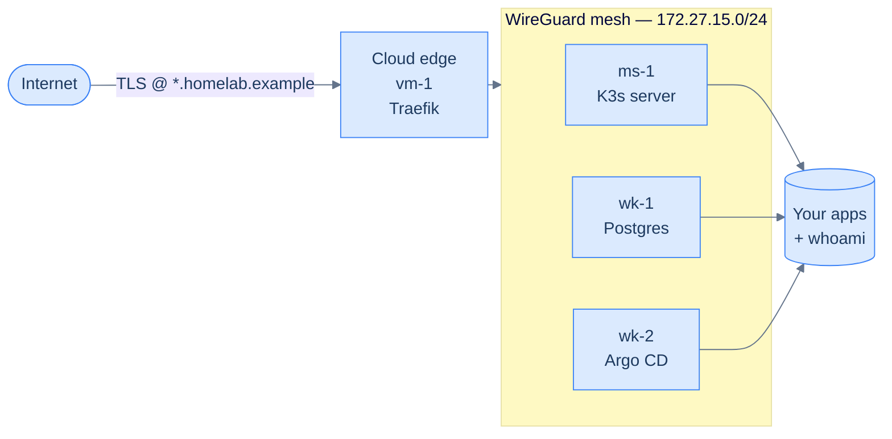

## The moment it earns its keep

There's a moment, somewhere around the third or fourth time you redeploy a real application onto your own metal, when something clicks.

It's usually small. A `kubectl logs` returning the exact line you wrote yesterday. A Let's Encrypt certificate quietly auto-renewing while you weren't looking. An Argo CD pane showing your `git push` becoming pods, untouched by you. Whatever it is — the cloud stops feeling like a place you rent. It starts feeling like a thing you understand.

That's what this book is for. Not because you *need* a homelab — you can ship perfectly real software on Vercel and Fly and never touch a sysctl. You're here because at some point you want to know what's *under* the platform: what a kubelet actually starts, why your TLS cert needs DNS-01 sometimes and HTTP-01 other times, what a CNI does when you remove it. The fastest way to learn that is to build the thing yourself, badly, twice, and then well.

By the last chapter of this book you'll have built it well.

## What you'll have at the end

Reading left to right:

- **Internet** can only see one machine: a small cloud VM that runs nothing but Traefik and a hostile little firewall.
- **Cloud edge** (`vm-1`) terminates TLS and forwards every legitimate request into the mesh.
- **WireGuard mesh** is a private encrypted network connecting the cloud edge to your three home boxes. From inside the mesh, every node looks like it's on the same LAN. From outside the mesh, they don't exist at all.
- **`ms-1`, `wk-1`, `wk-2`** are home computers running Ubuntu 24.04 — anything from a couple of old laptops and a desktop to three rack-mounted servers. `ms-1` runs the K3s control-plane; `wk-1` runs Postgres; `wk-2` runs Argo CD. You'll set the labels and taints that pin those placements in [Where things are allowed to run](/cortex/homelab-from-scratch/kubernetes-base/where-things-are-allowed-to-run).

The rule that makes this whole thing safe to run from your living room: **only the edge is on the public internet.** The home boxes never accept a single packet from outside the mesh. If your cloud VM gets compromised, an attacker reaches Traefik, then the mesh, then a heavily-NetworkPolicy'd cluster — three layers and a steep ramp away from anything that matters.

## The cast

Four nodes. Each does one job well.

| Node | Lives | Role | Special trick |
|---|---|---|---|
| **`ms-1`** | Home, wired | K3s control-plane | Schedules pods; doesn't run app workloads itself |
| **`wk-1`** | Home, wired | Worker (Postgres) | The only node with the `kakde.eu/postgresql=true` label |
| **`wk-2`** | Home, Wi-Fi is fine | Worker (Argo CD) | Pinned via `workload=argocd` |
| **`vm-1`** | Cloud (~€5/month) | Edge worker | Tainted `kakde.eu/edge=true:NoSchedule`; only Traefik tolerates it |

The names aren't sacred — `wk-1` is just `worker-1`. But the *role separation* is. Postgres on a wired box. Argo CD on a different worker. The control-plane unencumbered by either. The edge isolated from everything that holds state. When you want to upgrade the cluster, or one node falls over at 11 p.m., that separation is what saves you.

## What you'll actually learn

The chapter list is in [the book index](/cortex/homelab-from-scratch). Here's the underlying skill tree.

- **Linux fundamentals you'd otherwise skim past:** sysctl knobs, kernel modules, systemd units, nftables vs iptables, time sync, swap, the ten things every Kubernetes installer demands you do first.
- **WireGuard from first principles:** how `AllowedIPs` becomes a routing rule, why `rp_filter` matters, what an MTU mismatch does to TCP, how to read `wg show` and find the bug in thirty seconds.
- **Kubernetes networking the long way:** Calico VXLAN over WireGuard means three packet headers stacked — and a real reason MTU is `1370`, not `1500`. You'll see every layer.
- **The TLS pipeline most engineers never quite see end-to-end:** ACME, DNS-01 vs HTTP-01, why you'd want a wildcard, what `cert-manager` is doing in the background, what breaks first when it stops.
- **GitOps as a discipline, not a logo:** Argo CD watches Git; the cluster reconciles. Sealed Secrets means the Git repo can hold production credentials without keeping you up at night. A GitHub Actions workflow ties it all together.
- **The boring infrastructure muscles:** taking a backup, restoring it, writing the runbook for the day everything fails. Most engineers never practice these. By the last chapter you will have.

A real cluster — `kakde.eu`, the one this book is written from — runs all of this in production today. You're not building a toy. You're building the same architecture, with the same trade-offs, on cheaper hardware.

## What you'll need

A long weekend, or a couple of weeks of evenings. Three machines you can dedicate to this — old laptops are fine, mini PCs are great, NUCs are the goldilocks zone. One small cloud VM (Contabo, Hetzner, OCI free tier — anything with a public IPv4 address). A domain name. Roughly **€10–€20/month** in ongoing costs once you're done.

The full shopping list lives in [Prerequisites and shopping list](/cortex/homelab-from-scratch/foundations/prerequisites-and-shopping-list). The next chapter — [Architecture at a glance](/cortex/homelab-from-scratch/foundations/architecture-at-a-glance) — pins down the design before you type a single command.

→ Next: [Architecture at a glance](/cortex/homelab-from-scratch/foundations/architecture-at-a-glance)
