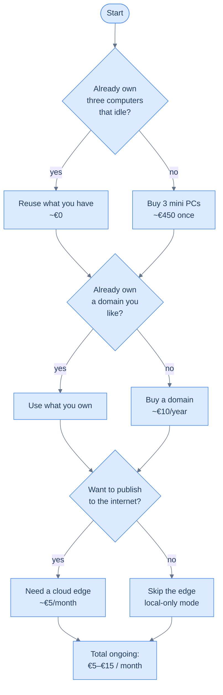

## What you'll need

Three lists. Tick them off in order.

### Hardware

| Thing | What it does | What's "enough" | What's overkill |
|---|---|---|---|
| **Three home boxes** | K3s server + two workers | 4 GB RAM, 2 cores, 64 GB SSD each | A 24-core server. Don't. |
| **One cloud VM** | Public edge — runs only Traefik | 2 GB RAM, 1 vCPU, 30 GB disk, IPv4 | Anything bigger than €5/month |
| **A managed switch (optional)** | If you want the home boxes wired to the same gigabit segment | Any 4-port gigabit switch, ~€20 | 10 GbE — the bottleneck is your ISP, not the switch |
| **An admin laptop** | The thing you SSH from. Mine's a MacBook. | Any | n/a |

The home boxes don't need to match. A retired ThinkPad, a Raspberry Pi 4 with a USB-SSD, and a mini PC will run this fine. The one constraint is **architecture parity**: pick all-`amd64` or all-`arm64` for simplicity, because some of the images you'll deploy later won't ship multi-arch tags. Mixed-arch is doable but you'll spend an evening per app figuring out which Helm charts assume amd64.

A specific recommendation if you're starting fresh: three small fanless mini PCs in the **€150–€250 each** range (Beelink S12, Intel NUC clones, GMKtec). Each gets 8 GB RAM, a 256 GB SSD, two ethernet ports, and uses about 7 W idle. Hard to beat for a homelab.

### Cloud edge

For the edge VM you want: a public IPv4 address, root SSH, low monthly cost. The cluster behind these docs runs on a **Contabo VPS S** (€4.50/mo, 4 vCPU, 8 GB RAM, 200 GB disk) — wildly overspecified for what it does, but Contabo doesn't sell anything smaller. Equally fine:

- **Hetzner Cloud CX22** — €4.50/mo, EU data centres, 2 vCPU, 4 GB RAM. Great network.
- **Oracle OCI Always-Free** — actually free if you can navigate the OCI console. ARM nodes only.
- **Netcup** — sometimes the cheapest in EU, sometimes the worst peering. Check before you commit.

Avoid AWS Lightsail / DigitalOcean for this role unless price doesn't matter. They're solid but you'll spend €5/mo more for the same shape.

### Software accounts

| Thing | Why | Free? |
|---|---|---|
| **GitHub account** | Repo for infra manifests; container registry (GHCR); GitHub Actions | Yes |
| **Cloudflare account** | DNS hosting + DNS-01 ACME validation | Yes |
| **GoDaddy account (or any registrar)** | Buying the domain itself | The domain costs ~€10/year |
| **Docker Hub account** | Optional; only if you want to publish images publicly | Free |
| **Let's Encrypt account** | Created automatically by cert-manager — nothing to do | Yes |

That's it. No credit card on the cluster side, no AWS, no commercial Kubernetes distro license.

### Money

Realistic ongoing cost: **€5/month** if you reuse hardware, **€15/month** if you also buy bandwidth and a slightly larger cloud edge. Power for three mini PCs idle is roughly **€5/month** in continental Europe at current prices, more in places with expensive electricity.

The two costs people overestimate: **bandwidth** (a homelab pulls hundreds of MB/day, not GB) and **storage** (a homelab uses tens of GB total, not TB). If your existing home internet plan is fine for video calls, it's fine for this.

## What you don't need

A short list of things people buy and regret.

- **A pi-hole, a UDM Pro, a Mikrotik router.** Cool, not required. Your existing home router does what the homelab needs (port-forwards UDP 51820/51821/51822 to the right LAN IPs) and that's all.
- **A NAS.** Workloads run on local-path storage. If you outgrow that you can add NFS or Longhorn later, but not before you have something that *needs* persistent multi-node storage.
- **A managed Kubernetes service.** The whole point of this book is to run K3s yourself. EKS/GKE/AKS will hide the layers we want to learn.
- **Multiple cloud edges with anycast or geo-DNS.** One €5/mo VM handles thousands of requests per second of TLS-terminated proxying. You don't need a CDN until you need a CDN.
- **A second control-plane node "for HA".** A second control-plane on a homelab adds operational burden without buying real availability — your two ISPs, one upstairs router, and one electricity provider are the actual SPOFs. Single control-plane is the right call until you've been running this for a year.

## What you should already know how to do

- SSH into a Linux box and edit a config file.
- Read a Kubernetes manifest (Deployment, Service, Ingress) and understand what it asks for, even if you can't write one from scratch.
- Use `git` for committing and pushing to a remote.

If any of that's wobbly, work through the [codefolio onboarding book](/cortex/codefolio-onboarding) for `git` + Vite/SBT mechanics, and then [Kubernetes basics on kubernetes.io](https://kubernetes.io/docs/tutorials/kubernetes-basics/) for the YAML side. Come back. The book will still be here.

→ Next: [Homelab vs cloud — the honest case](/cortex/homelab-from-scratch/foundations-homelab-vs-cloud)
