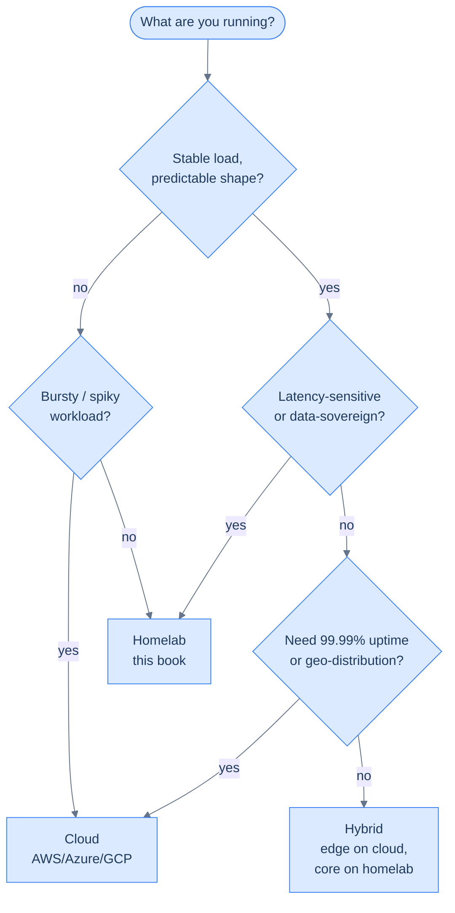

## The €15/month claim, made concrete

The previous chapter quoted €5–€15/month. That figure deserves to be put next to what you'd otherwise pay. Same architecture, same workloads (3 small worker nodes + 1 edge + small Postgres + identity), priced across providers as of mid-2026:

| Setup | What you're paying for | Monthly | Yearly |
|---|---|---|---|
| **This homelab** | Electricity (~7 W × 3 nodes), cloud edge VPS (Contabo VPS S), domain | **~€15** | ~€180 |
| **All-Contabo** (closest comparable, no homelab hardware) | 4× Contabo VPS S — already includes 200 GB disk per node | ~€18 | ~€216 |
| **Hetzner Cloud** (mid-tier comparable) | 4× CX22, 4× 80 GB volumes, network | ~€40 | ~€480 |
| **DigitalOcean Kubernetes** (DOKS) | 3× s-2vcpu-4gb workers, 1 small node, LB, managed Postgres dev | ~$95 | ~$1,140 |
| **AWS EKS** | EKS control-plane $73, 3× t3.medium ~$90, 1× t3.small ~$15, 320 GB EBS ~$40, ALB ~$20, RDS db.t3.small ~$30, ~$10 transfer | **~$280** | ~$3,360 |
| **Azure AKS** | AKS free tier control-plane, 3× B2s + 1× B1s ~$140, premium SSD ~$45, App Gateway ~$30, Postgres Flexible B1ms ~$25 | **~$245** | ~$2,940 |
| **GCP GKE Autopilot** | Pay-per-pod-vCPU on Autopilot for ~6 vCPU sustained, regional cluster, Cloud SQL Postgres f1-micro | **~$220** | ~$2,640 |

**Order-of-magnitude: this homelab is ~15–20× cheaper than EKS** for the same shape of cluster. The cheapest credible cloud (an all-Contabo equivalent) is roughly the same monthly cost as the homelab — but with three crucial differences: no upfront hardware capex, no electricity bill, and *all* of your data sits on a third party's disks. The real comparison isn't "homelab vs cheap cloud" — it's "homelab vs hyperscaler cloud," where the gap is dramatic.

The bigger numbers further down the table aren't unreasonable — they buy you things the homelab doesn't have (regional failover, managed Postgres backups, professional SLA). The point is to be honest about *what you're trading away* when you skip them.

## Uptime — the gap, and how big it actually is

This is the place homelab honesty matters most. The realistic numbers:

| Setup | SLA | Real-world | Annual downtime |
|---|---|---|---|
| **This homelab** | None | 99.0–99.5% (residential ISP + your own changes + power) | 44–88 hours |
| **AWS / Azure / GCP single AZ** | 99.9% per service | ~99.95% (region outages happen — `us-east-1`, `eu-west-1` have had multi-hour failures in 2024–2025) | 4–8 hours |
| **Cloud multi-AZ + multi-region** | 99.99%+ | ~99.99% in practice | < 1 hour |
| **Cloudflare-fronted edge** | 100% network SLA | Reality: ~99.95–99.99% (2022 was rough) | < 1 hour edge, depends on origin |

Two things to internalise:

- **The hyperscaler "five 9s" marketing is per-service, not per-application.** A typical app-on-EKS calls EKS, EC2, EBS, RDS, ELB, Route53, CloudFront, IAM, S3, KMS — at least ten services. Stack-up of independent 99.9%s gets you to ~99% application availability, which is exactly where a well-run homelab lands.
- **Cloud outages are big and rare; homelab outages are small and frequent.** A homelab loses ~30 minutes when your ISP reboots its edge router; a cloud loses ~6 hours when an AWS region falls over. The total downtime budget is similar; the failure shape isn't.

For a personal cluster running portfolio sites and side-projects, **99% is fine** — that's roughly "down 7 hours a month, almost always at 3 a.m." If you'd be losing money during those 7 hours, you don't want a homelab as the only thing in the path. If you wouldn't, you don't need anything more than this.

## Pros and cons, both directions

### Homelab — what you gain

- **Cost.** ~€15/mo all-in vs €200+/mo for the cloud-equivalent.
- **No surprise bills.** Egress is your home internet plan. There is no metered API. You can't accidentally `terraform apply` a $4,000 mistake at 2 a.m.
- **No vendor lock-in.** The same `kubectl apply` works on any future cluster. You don't depend on EKS-specific IRSA, GCP-specific Workload Identity, or AWS-specific service mesh.
- **Data sovereignty.** Your photos, your code, your model weights, your customers' PII — never leave a network you control.
- **Learning, end-to-end.** A managed service hides everything interesting. A homelab makes you [debug `rp_filter` once](/cortex/homelab-from-scratch/private-mesh-when-the-mesh-misbehaves) and you remember it forever — the kernel's "martian source" log line, the strict-vs-loose modes, the asymmetric path that the cloud's networking team has already solved for you.
- **Latency to your stuff.** Local DNS resolves in 0.5 ms; the round trip to your cloud region is 30–80 ms. Anything chatty (database queries, model inference) feels noticeably faster on metal you can touch.

### Homelab — what you give up

- **You are the on-call rotation.** PagerDuty is your phone, ringing.
- **Capex up front.** ~€450 for three mini PCs is real money to commit before you've shipped anything.
- **ISP and power dependence.** A storm that takes out your block takes out the cluster. Cloud regions have generators and fibre redundancy.
- **No managed services to lean on.** No managed Postgres failover, no managed Redis, no autoscaling group, no point-in-time recovery. You can build all of these — the rest of this book shows how — but it's labour you'd skip on cloud.
- **Geographic distribution is hard.** A homelab is in one room. Anycast, multi-region failover, edge POPs — those are cloud problems with cloud solutions.

### Cloud (AWS / Azure / GCP) — what you gain

- **Elastic capacity.** Need ten nodes for an hour? `terraform apply`. Done. The homelab can't do that.
- **Managed everything.** RDS handles backups, failover, point-in-time recovery for you. KMS rotates keys. SNS / SES handle email. You assemble the platform; you don't build it.
- **Real SLAs and 24/7 vendor support.** Pay enough and there's an engineer at the other end of the phone.
- **Compliance pre-baked.** SOC 2, ISO 27001, HIPAA, PCI — your provider has the audit reports; you only need to inherit them.
- **Geographic distribution.** Multi-region failover is a config change, not a hardware purchase.

### Cloud — what you give up

- **Cost.** Often 10–20× the homelab equivalent for small workloads. The economics flip the other way at large scale, but you have to *get* to large scale.
- **Surprise bills.** A misconfigured Lambda loop, a public S3 bucket scraped relentlessly, a stuck Kinesis stream — any of these can produce a five-figure invoice in a weekend.
- **Vendor lock-in.** Once you're on Cognito + DynamoDB + Lambda + Step Functions, leaving is a six-month rewrite, not a migration.
- **Egress fees.** AWS charges $0.09/GB outbound. A few hundred GB/month is a real line item; a viral moment with a few TB of egress is genuinely expensive.
- **Less learning.** When everything works through a managed abstraction, you never learn what's underneath.
- **Compliance theatre on top of compliance.** "Your account is in violation of [policy]" emails, mandatory training, periodic re-attestations — even when you're a one-person shop.

## Who runs hybrid, and why

The "everything in the cloud" narrative was the 2014–2020 story. The current numbers tell a different one:

- **Flexera's State of the Cloud Report** (consistently across the last several years) puts hybrid-cloud adoption at **~80% of enterprises**, multi-cloud at ~85%. Pure-cloud-native is the minority position.
- **37signals (Basecamp, HEY)** publicly migrated *off* AWS in 2023, expected to save ~$7M over five years on infrastructure. DHH's "Why we're leaving the cloud" post is the canonical write-up of the rational case.
- **GitLab** runs a hybrid infrastructure: SaaS on Google Cloud, but their own GitLab Dedicated (and a long history of self-hosted GitLab Runners customers run on bare metal).
- **Stack Overflow** famously runs/ran most of its serving load on **a single-digit number of physical servers** — something like 9 web servers handled the bulk of pageviews for years. Their architecture was a deliberate refutation of "you must be on the cloud at scale."
- **Dropbox** moved a substantial fraction of its storage off AWS to its own infrastructure in 2016 ("Magic Pocket"), reportedly saving $75M+ over two years.
- **Apple, Meta, Netflix** all run vast on-prem infrastructure alongside their cloud usage. The "everything is on AWS" mental model isn't true even for the largest cloud customers.

The pattern: **stable, predictable, latency-sensitive workloads on owned hardware; bursty / unpredictable / globally-distributed workloads on cloud.** Hybrid isn't a transition state; it's the steady state for most companies past a certain size.

## The maximum load this homelab can take

The four-node setup in this book is small in raw spec, but Kubernetes overhead is the dominant load. The actual capacity, with realistic margins:

| Workload type | Comfortable load on this cluster | Comparison point |
|---|---|---|
| **Static / low-CPU HTTP** (a portfolio site, a docs site) | 5,000–10,000 req/s | Stack Overflow served ~3,000 req/s peak on ~9 servers |
| **Mixed-CPU API** (Go service + Postgres) | 500–1,500 req/s | A typical SaaS startup at $1M ARR sees ~50 req/s sustained |
| **Postgres reads** (cached working set) | 5,000–10,000 QPS | Far above what most apps need before scaling concerns |
| **Postgres writes** | 500–2,000 TPS | Enough for any side-project; comparable to a small SaaS |
| **Pod count** | 80–120 pods steady-state across 3 workers | Most personal infrastructure runs in 20–40 |
| **Container image throughput** | Pulls bottlenecked by your home internet (~50–500 MB/s if you're lucky) | The only place you'll feel the home-network constraint |

The headline: **a four-node homelab is underutilised for the typical hobbyist or small-business workload by 1–2 orders of magnitude.** "Will I outgrow it?" is rarely the right question. The right question is "will I *outgrow my home internet egress* before I outgrow this hardware?" — and the answer is usually yes, which is why the cloud edge fronts the public side.

## Why hybrid wins in the AI era

The economics changed in 2023. AI workloads are the strongest case for hybrid since the cloud era began.

- **LLM inference is 100% utilisation, all the time.** A GPU instance on AWS is $1–3/hr; running it 24/7 is $730–$2,200/month *per GPU*. A used RTX 3090 is ~€700 once and runs Llama-class 70B models with 4-bit quantisation comfortably. Break-even vs cloud is **less than two months**.
- **Egress fees collapse the cloud LLM economics.** A RAG application sending 50 KB context per query and getting back 5 KB answers, at 100 req/min, generates ~250 GB/month of cloud egress. That alone is $20+/month per app — before the GPU bill.
- **Local-first AI tools are the new mainstream.** Ollama, vLLM, llama.cpp, LM Studio — every one of these targets self-hosting first. The fastest-moving open-weight model ecosystem assumes you have GPUs you control.
- **Vector databases co-locate well with models.** Qdrant or Weaviate runs in 2 GB RAM. Putting it on the same node as the embedding model removes a network hop and saves egress.
- **Privacy is a feature.** PII through OpenAI is a compliance event. PII through Ollama on your own kit is an architectural detail. For any application that touches personal data, on-prem inference is increasingly the path of least resistance.
- **Bursting still wins for training.** When you do need 8× A100 for six hours, cloud is exactly right. The hybrid pattern: own the steady-state inference, rent the spike training.

The one-liner: **inference moves on-prem; training stays in the cloud; the data stays where the regulator wants it.** The four-node cluster in this book is the natural foundation for the inference half.

## When to pick which

A reasonable decision rule:

**The architecture in this book is the hybrid path.** The cloud edge node is the "rent it from a hyperscaler" piece — public IP, geographic stability, professionally-managed network. The home cluster is the "own it" piece — cheap, latency-fast, sovereign. You get a slice of both worlds, neither extreme.

That's the rational case for what we're about to build. The next section turns the abstract into a domain name.

→ Next: [Buy a domain on GoDaddy](/cortex/homelab-from-scratch/domain-and-dns-buy-a-domain-on-godaddy)
