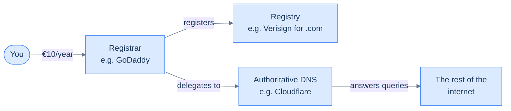

## Why a domain at all

You technically don't need one. Kubernetes will route to your services on `whoami.<random>.nip.io` or any other free DNS-as-a-host trick. But a real domain buys you three things you can't shim around:

1. **A wildcard cert.** A `*.homelab.example` Let's Encrypt certificate covers every subdomain you ever spin up. Without a real domain, you're issuing one cert per host, and you're going to make ~50 hosts before you stop counting.
2. **DNS-01 validation.** Some of your services will live behind networks that can't be reached from the public internet over HTTP — DNS-01 doesn't care, because it validates ownership through DNS records, not HTTP servers. You'll see the full flow in [The Cloudflare API token](/cortex/homelab-from-scratch/domain-and-dns-the-cloudflare-api-token).
3. **Memorability.** `kakde.eu` is shorter than the most generous nip.io subdomain you'll get. Six months in, "ssh argocd.homelab.example" is dramatically less typing than "ssh some-25-character-thing".

Total cost: **~€10/year** for a `.com`, `.eu`, `.dev`, or similar. Less than one Friday night dinner.

## What you're actually buying

Three roles. One company can do all three; we're going to split them.

- A **registrar** (GoDaddy, Namecheap, Porkbun, Cloudflare Registrar) takes your money and registers the name with the **registry** that owns the TLD. They handle renewals, WHOIS, and the legal side. They also offer DNS service, but you'll usually hand that off to a **DNS provider** with better tooling — in our case, Cloudflare. The registrar's only ongoing job after renewal is to point at the right nameservers.

The split is on purpose. Registrars compete on price and customer service; DNS providers compete on API quality, propagation speed, and ACME integration. Picking the cheapest registrar and pairing it with the best DNS provider is a strictly better strategy than picking one company that does both.

## Walk through GoDaddy

Specific clicks for `homelab.example`:

1. Go to [godaddy.com](https://www.godaddy.com), search for the name. If it's free, you'll see a price next to it. Pay attention to **two** prices: the first-year promotion (often €1 or €2 — irrelevant) and the **second-year renewal** (this is what you'll really pay every year). If renewal is more than €15, try a different TLD.
2. Add to cart. Now: **read every checkbox carefully and uncheck most of them.** GoDaddy's checkout adds upsells aggressively. Specifically:
   - **Domain privacy** — accept it if free, decline it if it costs extra. Your registration data leaks to WHOIS regardless of which paid plan you pick; what privacy upsells do is hide your home address, which Cloudflare and most modern registrars handle for free.
   - **Premium DNS** — decline. We're moving DNS to Cloudflare. GoDaddy's DNS will only briefly hold the zone before we cut over.
   - **Email hosting** — decline unless you actually want a `you@homelab.example` mailbox today. You can always add this later.
   - **SSL certificate** — decline, decline, decline. We are getting Let's Encrypt for free in [TLS on autopilot](/cortex/homelab-from-scratch/the-edge-tls-on-autopilot).
   - **Website builder** — decline.
3. Pay for the **shortest renewal period you'll commit to** (usually 1 year). Multi-year discounts at GoDaddy are real but small; they also lock in any price hike GoDaddy decides to apply later.
4. Confirm the domain shows up in your account dashboard. You're done at GoDaddy. Everything else happens at the DNS provider.

You will get marketing emails. You can mute the GoDaddy notification toggles, but a few will leak through to your registered email address. This is the price of cheap domain registration. Don't reuse this email for anything that takes calmer attention.

## The "any registrar works" sidebar

The mechanics are identical at every credible registrar. Pick the one whose pricing and UI you find tolerable:

- **Namecheap.** Slightly cheaper than GoDaddy on most TLDs. Free WhoisGuard. Decent UI. Occasional outages.
- **Porkbun.** Very cheap, very honest pricing (no first-year promo trickery). Smaller selection of TLDs. Loved by homelabbers.
- **Cloudflare Registrar.** Sells domains at registry-cost (so a `.com` is exactly $9.15/year). The catch: domains here *must* use Cloudflare's nameservers, which is fine since we're using them anyway. The big advantage is one less account to manage.

If you're starting from scratch in 2026, **Cloudflare Registrar** is probably the right call: registry-cost pricing, no upsells in checkout, and your DNS provider already manages the domain. The only reason to use a different registrar is if you want to keep DNS and registration administratively separated, which is a defensible position but not the one this book takes.

## What you should have now

- A domain you own (let's call yours `mydomain.tld` from here on; in commands I'll use `homelab.example`).
- A login at the registrar's website where you can edit nameservers.

That's all you need. Next we'll point those nameservers at Cloudflare and turn this domain from a piece of paper into something a `dig` query can answer.

→ Next: [Move DNS to Cloudflare](/cortex/homelab-from-scratch/domain-and-dns-move-dns-to-cloudflare)
