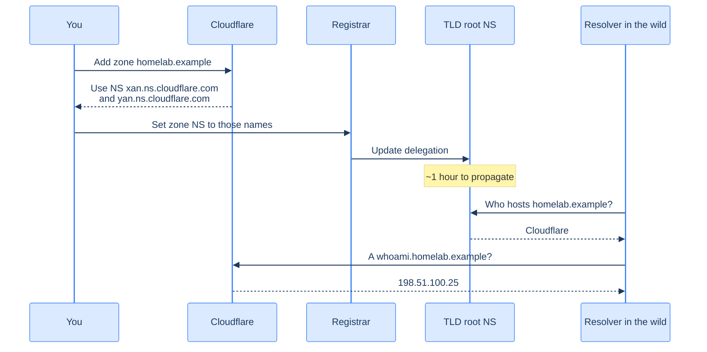

## Why Cloudflare specifically

Three reasons:

1. **Free DNS hosting** with a global anycast network. Your records resolve in milliseconds from anywhere.
2. **A real API.** Cloudflare lets you mint scoped tokens that can edit DNS records on a single zone — exactly what cert-manager needs for DNS-01 challenges, and nothing more.
3. **It's where everyone else is.** When something breaks, the answer on Stack Overflow probably mentions Cloudflare. There's a long tail of tooling that has battle-tested Cloudflare integration. (Route 53 is similar; CloudDNS less so. Pick one.)

The free tier covers everything in this book. Don't pay for anything yet.

## Add the zone



1. **Sign in to Cloudflare**, click *Add a site*, paste `mydomain.tld`. Select the **Free** plan.
2. Cloudflare scans your existing DNS records (whatever the registrar is currently serving). On a fresh domain there's basically nothing. Click *Continue*.
3. Cloudflare hands you **two nameserver hostnames** — something like `xan.ns.cloudflare.com` and `yan.ns.cloudflare.com`. Different for every account; copy them carefully.
4. **Go back to the registrar**, find *Manage DNS / Nameservers*, switch from the registrar's defaults to **Custom Nameservers**, paste the two Cloudflare names. Save.
5. Back in Cloudflare, click *Done, check nameservers*. Cloudflare polls until the registrar's update is visible in the public DNS, then activates the zone. This takes anywhere from ten minutes to a few hours depending on the registrar.

**Footgun:** several registrars (GoDaddy, Namecheap) have a habit of automatically re-enabling their own DNS service if you ever click around in the wrong section of their UI. If your zone goes silent in three months for no reason, the first thing to check is whether the registrar reverted the nameservers. Use the registrar for renewals; never log into the DNS section after the migration.

## The records you'll create

Just two A records, for now:

| Name | Type | Value | Proxy |
|---|---|---|---|
| `homelab.example` | A | `198.51.100.25` | OFF |
| `*.homelab.example` | A | `198.51.100.25` | OFF |

Replace `198.51.100.25` with your edge VM's actual public IPv4. The wildcard means every subdomain you ever invent (`whoami`, `argocd`, `keycloak`, `something-i-haven't-thought-of-yet`) will resolve to the edge — no DNS edits per app.

### Why proxy is OFF

Cloudflare's *Proxy* toggle (the orange cloud) routes traffic through Cloudflare's edge before it reaches your origin. Free CDN, free DDoS protection, free WAF. Why turn it off?

- **TLS terminates at our edge, not Cloudflare's.** We want Let's Encrypt certificates that *we* control. Proxy mode breaks the DNS-01 ACME flow for the domains it covers (technically there are workarounds, but they're fragile).
- **WebSockets and HTTP/2 are happier without an extra hop.** Argo CD's UI uses long-running connections; Keycloak issues sessions you don't want a third party tracing.
- **The homelab is for you.** A CDN buys you very little when one in ten visitors per day is your phone checking on something.

You can always flip the proxy on later for a specific record (e.g., a public-facing portfolio site that benefits from caching). The chapters in this book assume proxy off.

## Verify propagation

Three quick commands. From your laptop:

```bash
# What does your local resolver think?
dig homelab.example NS +short

# Bypass your local resolver — ask Google's directly
dig @8.8.8.8 homelab.example NS +short

# And one of the Cloudflare nameservers, for ground truth
dig @xan.ns.cloudflare.com homelab.example NS +short
```

When all three show the Cloudflare nameservers (`xan.ns.cloudflare.com`, `yan.ns.cloudflare.com`), you're done. If only the third one is right, the change is propagating — give it half an hour and try again.

```bash
# When the wildcard A record is also in place:
dig whoami.homelab.example +short
# → 198.51.100.25
```

That value is your edge VM's public IP. The rest of the book trusts it.

## What you should have now

- A domain whose authoritative DNS is Cloudflare
- An A record at the apex (`homelab.example` → edge IP)
- A wildcard A record (`*.homelab.example` → edge IP)
- Both with proxy mode **off** (DNS-only, grey cloud)

The next chapter mints the API token cert-manager needs to satisfy DNS-01 challenges against this zone. It's three minutes of clicks and a 64-character secret you'll save somewhere safe.

→ Next: [The Cloudflare API token](/cortex/homelab-from-scratch/domain-and-dns/the-cloudflare-api-token)
