## Why this token exists

```mermaid
---
config:
  theme: base
  themeVariables:
    primaryColor: "#dbeafe"
    primaryBorderColor: "#3b82f6"
    primaryTextColor: "#1e3a5f"
    lineColor: "#64748b"
    secondaryColor: "#ede9fe"
    tertiaryColor: "#fef9c3"
---
flowchart LR
  CM[cert-manager<br/>in cluster]
  Token[Cloudflare API token<br/>scoped to one zone]
  CF[Cloudflare DNS API]
  Zone[(homelab.example zone)]
  LE[Let's Encrypt<br/>ACME server]
  Cert[Signed cert<br/>in cluster Secret]

  CM -- "uses" --> Token
  Token -- "authorises" --> CF
  CF -- "writes _acme-challenge TXT" --> Zone
  Zone -- "Let's Encrypt resolves it" --> LE
  LE -- "issues" --> Cert
```

cert-manager talks to Cloudflare on your behalf to prove you own the domain. The proof is: *temporarily create a TXT record at `_acme-challenge.<host>` with a value Let's Encrypt tells you to use*. Let's Encrypt fetches the TXT record, sees the value, signs the cert. cert-manager deletes the TXT record. Done.



For this to work, the token must be able to:

- **read** DNS records in the zone (so cert-manager can verify the record it just created)
- **edit** DNS records in the zone (to create and delete the challenge TXT)

…and **nothing else**. Not your account billing. Not other zones. Not Workers. The token's blast radius matters because we're about to put it inside a Sealed Secret in a Git repository — even a public Git repository, eventually. A scoped token that can do exactly this and nothing more keeps the blast radius tiny if it ever leaks.

## Mint the token

In the Cloudflare dashboard:

1. Click your profile icon (top right) → **My Profile** → **API Tokens** (left nav).
2. Click **Create Token**.
3. Don't pick a template. Click **Create Custom Token**.
4. Configure it like this:

| Field | Value |
|---|---|
| **Token name** | `cert-manager-homelab` |
| **Permissions row 1** | Zone — **Zone** — **Read** |
| **Permissions row 2** | Zone — **DNS** — **Edit** |
| **Zone Resources** | Include — Specific zone — `mydomain.tld` |
| **TTL** | (optional) leave blank for "never expire", or set 1 year |
| **IP Address Filtering** | leave blank (cert-manager will call from the edge VM, but we don't pin) |

5. Click **Continue to summary** → review → **Create Token**.
6. **Copy the token immediately.** Cloudflare shows it once. There is no "reveal it later" button — if you lose it, you delete it and mint a new one.

The token is a 40-character base32-ish string. Save it in your password manager *now*, then save it again where the cluster will read it from in [Sealed Secrets](/cortex/homelab-from-scratch/secrets-and-gitops-sealed-secrets) — your password manager and the SealedSecret are the only two places this lives. Not in chat. Not in `.bash_history`. Not in a README.

## Test the token

You don't have a cluster yet. Test it with `curl` from your laptop, before anything else uses it:

```bash
TOKEN='<paste-the-40-char-token-here>'
ZONE_NAME='mydomain.tld'

# 1. Token verification — does Cloudflare consider this token valid at all?
curl -sS https://api.cloudflare.com/client/v4/user/tokens/verify \
  -H "Authorization: Bearer ${TOKEN}" | jq .success
# → true

# 2. Can it list zones it has access to?
curl -sS "https://api.cloudflare.com/client/v4/zones?name=${ZONE_NAME}" \
  -H "Authorization: Bearer ${TOKEN}" | jq -r '.result[].id'
# → some 32-char hex zone ID

# 3. Can it list DNS records on that zone?
ZONE_ID="$(curl -sS "https://api.cloudflare.com/client/v4/zones?name=${ZONE_NAME}" \
  -H "Authorization: Bearer ${TOKEN}" | jq -r '.result[0].id')"

curl -sS "https://api.cloudflare.com/client/v4/zones/${ZONE_ID}/dns_records" \
  -H "Authorization: Bearer ${TOKEN}" | jq -r '.result[] | "\(.type)\t\(.name)\t\(.content)"'
# → A   homelab.example   198.51.100.25
# → A   *.homelab.example  198.51.100.25
```

If all three commands work, the token is good. If step 1 fails, you copied it wrong — mint another. If step 2 succeeds but step 3 fails with `Authentication error`, you forgot the `DNS:Edit` permission — edit the token to add it.

## What you'll do with this token

Three places, in this order:

1. **As a Kubernetes Secret** in the `cert-manager` namespace, named `cloudflare-api-token`. cert-manager's `ClusterIssuer` resources reference this Secret by name.
2. **As a `SealedSecret`** committed to your infra repo. The Sealed Secrets controller decrypts it back into the real Secret when Argo CD applies the manifest. This means *the encrypted credential lives in Git, the plaintext only ever exists in cluster RAM*.
3. **In your password manager**, as the master copy. If the cluster is destroyed and the Sealed Secrets master key is lost, you regenerate the cluster, generate a new Sealed Secrets keypair, and reseal this token from the password manager copy.

The mechanics of each step are in [Sealed Secrets](/cortex/homelab-from-scratch/secrets-and-gitops-sealed-secrets) and [TLS on autopilot](/cortex/homelab-from-scratch/the-edge-tls-on-autopilot). For now, just know: **this token is the single most security-sensitive thing you've created so far.** Treat it like a SSH private key.

## What you should have now

- A 40-character Cloudflare API token, scoped to your zone, with Zone:Read and DNS:Edit
- The token saved in your password manager
- The three `curl` checks all passing

That's the end of the pre-cluster prep. Next we choose hardware and start putting Ubuntu on it.

→ Next: [Pick your hardware](/cortex/homelab-from-scratch/the-nodes-pick-your-hardware)
