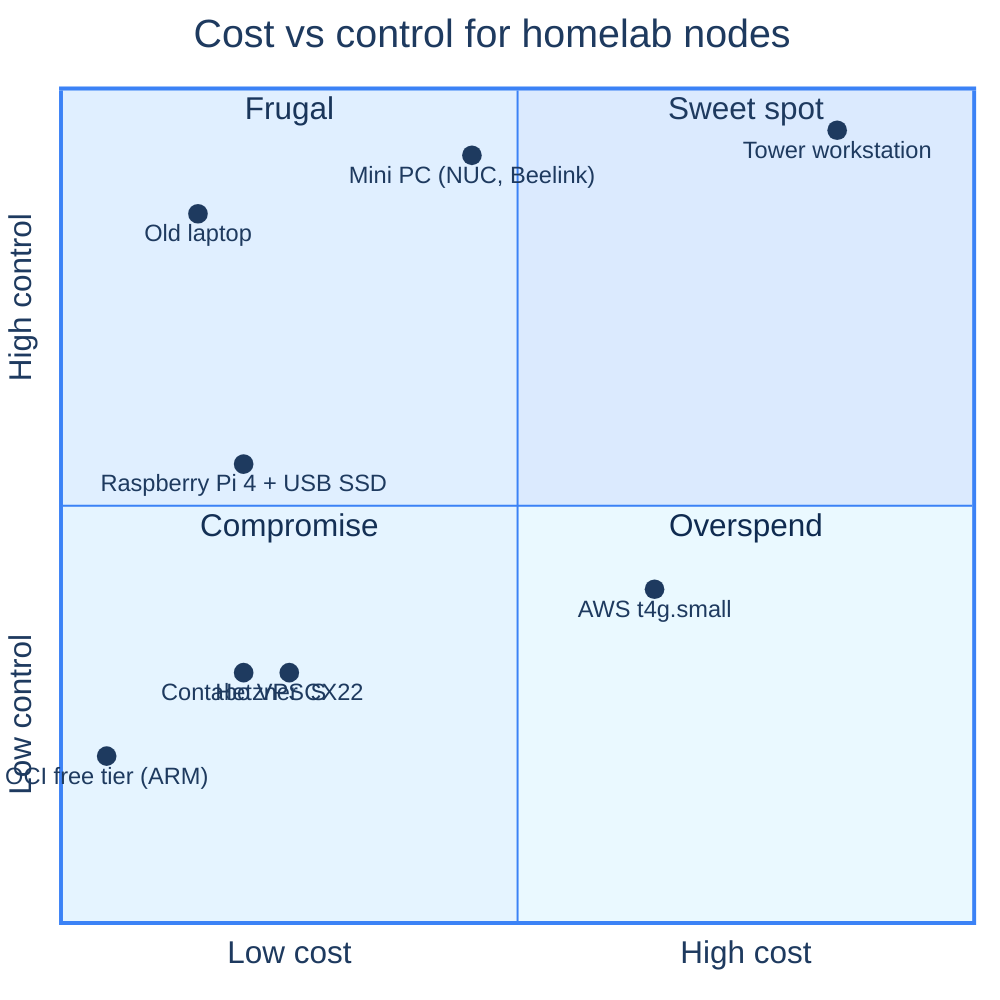

## The four-machine plan

You need four computers. Three live at home; one lives in a datacentre somewhere on the public internet.

Top-right is what you want for the home boxes (you control them physically) — top-left is what you want for the cloud edge (cheap, ephemeral, throwaway). Bottom anything is to be avoided.

## The home boxes (3×)

You need three boxes for `ms-1`, `wk-1`, `wk-2`. They need to:

- run **continuously** — these are 24/7 servers
- have **gigabit Ethernet** — Wi-Fi works, but a wired switch is one less thing that flakes
- run **64-bit Ubuntu 24.04** — that means amd64 or arm64; **stick with one architecture across all three**
- have at least **4 GB RAM** (8 GB is comfortable, 16 GB is generous) and **64 GB disk** (256 GB is comfortable)
- idle **quietly** — these will probably end up in a closet or near your desk

Three concrete shapes that work, sorted by cost:

### Cheap: old laptops (€0–€100 each)
Use what's lying around. A 2018-vintage ThinkPad with a dead battery still has a CPU, an SSD, and an ethernet port. Lid-closed plus the BIOS option *"don't sleep on lid close"* and you're done. Caveat: laptop CPUs throttle aggressively. If yours has 2 cores total, treat the result as a *small* cluster — don't try to run forty pods on each.

### Sweet spot: mini PCs (€150–€250 each)
The current homelab pick is something like a **Beelink S12 Pro / Beelink Mini S12 / GMKtec NucBox**, or any used **Intel NUC 8/9/10/11**. Specs that matter: at least Intel N100/N305 or Ryzen 5500U+, 8 GB RAM, 256 GB NVMe, dual gigabit ethernet (or one gigabit + USB-Ethernet for backup), idle TDP under 15 W. Three of these with a small managed switch is roughly the canonical homelab.

### Overkill but bulletproof: refurb 1U servers (€300+ each)
A Dell R230, HP DL20, or Supermicro 1U from eBay. Real ECC RAM, IPMI for out-of-band access, 80 W idle that you'll feel in your power bill. Worth it if you've outgrown mini PCs. Not worth it if this is your first homelab.

### What about Raspberry Pi 4/5?
Works, but a few caveats:

- **The SD card is the storage SPOF.** Boot from a USB SSD (Pi 4 with the right firmware does this fine; Pi 5 does it natively). Microsd cards die in homelab workloads — quietly, then suddenly.
- **Memory bandwidth is half what mini PCs offer.** Pods are happier on x86.
- **You commit to arm64 for everything.** A handful of homelab tools still ship amd64-only or have buggy arm64 builds.

That said: three Pi 5s with USB SSDs is a perfectly fine cluster, and the form factor is delightful. Just go in knowing the trade-off.

## The cloud edge (`vm-1`)

What you want: a small VPS with a real public IPv4, root SSH, and a kernel you can `modprobe` into. What you don't need: lots of RAM, lots of disk, lots of CPU.

The chapters in this book are tested against:

| Provider | Plan | Cost | What you get |
|---|---|---|---|
| **Contabo** | VPS S | ~€4.50/mo | 4 vCPU, 8 GB RAM, 200 GB disk. The canonical pick for this book. |
| **Hetzner Cloud** | CX22 | ~€4.50/mo | 2 vCPU, 4 GB RAM, 40 GB. Equally credible alternative. |
| **Hetzner Cloud** | CAX11 (ARM) | ~€3.79/mo | ARM equivalent of CX22. Pair with ARM home boxes. |
| **Oracle OCI** | Always-Free Ampere A1 | €0/mo | 4 ARM vCPU, 24 GB RAM, 200 GB. Free if you can navigate OCI signup. |
| **Netcup** | VPS 200 G11s | ~€3/mo | 1 vCPU, 2 GB RAM. Cheapest credible option. |

Pick **Contabo VPS S** if you have no preference. It's the same provider the cluster behind these docs runs on, the dashboard is straightforward, and the spec is generous — 8 GB of RAM and 200 GB of disk for €4.50/mo means the edge node has room for whatever you throw at it later. The location options (US-East, US-Central, US-West, EU, Asia, Australia) cover most home-network geographies.

Hetzner is the equally-defensible alternative if you specifically want a smaller, leaner edge or if Contabo's network reach to your home ISP is poor. The chapters that follow assume Contabo by name where it matters; substituting Hetzner is a one-line change in each command.

### What you need from the provider's UI

- A way to upload an SSH public key before first boot.
- A web console (sometimes called *VNC console* or *Recovery console*) for the inevitable "I locked myself out of SSH" moment.
- An out-of-band reset / power-cycle button.
- IPv4 — IPv6-only edges are technically possible but the rest of the world isn't ready for them.

Never use the provider's "managed Kubernetes" or "container hosting" products for `vm-1`. We want a plain Ubuntu VM and nothing else.

## What to skip

- **Specialised firewall hardware.** A pfSense box or Mikrotik router is a rabbit hole. Your existing home router is fine.
- **Hardware HSMs.** Sealed Secrets does what we need.
- **Multiple cloud edges.** One is plenty. Anycast-style "geographically distributed" edges add complexity that pays off above 100k requests/day, which a homelab will not see.
- **Enterprise switches.** A €30 TP-Link gigabit unmanaged switch is fine. VLAN segregation is tempting and unnecessary at this scale — every machine on the same flat segment is the right answer until proven otherwise.

## What you should have now

- Three home boxes (or a plan to acquire them) with **matching architecture**.
- A cloud-edge VPS account at Contabo (or Hetzner / OCI) — but **don't provision the VM yet**. We'll do that with cloud-init in the next chapter.
- A managed or unmanaged gigabit switch if your home boxes don't already share one.
- Ethernet cables for the home boxes. Wi-Fi works for `wk-2` if needed; `ms-1` and `wk-1` should be wired.

→ Next: [Install Ubuntu 24.04](/cortex/homelab-from-scratch/the-nodes-install-ubuntu-24-04)
