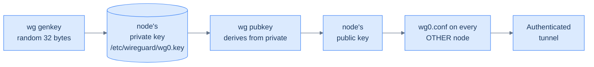

## The address plan

Decide this first. Once you generate keys and write configs, changing the address plan is a coordinated reboot.

| Node | LAN IP | WireGuard IP |
|---|---|---|
| `ms-1` | `192.168.15.2` | `172.27.15.12` |
| `wk-1` | `192.168.15.3` | `172.27.15.11` |
| `wk-2` | `192.168.15.4` | `172.27.15.13` |
| `vm-1` | (none — public) | `172.27.15.31` |
| Your laptop (admin) | (varies) | `172.27.15.50` |

Two CIDRs:

- **`172.27.15.0/24`** for the mesh. The address space is an arbitrary choice from RFC 1918 — pick something your home LAN, your VPN at work, and any cloud VPCs you talk to *don't already use*. `172.27.15.0/24` is unusual enough to almost never collide.
- **`192.168.15.0/24`** for the home LAN. This is whatever your home router hands out. The mesh CIDR must not overlap.

Why the gaps in the WireGuard `.x` addresses (`.11, .12, .13` for workers/server, `.31` for the edge, `.50` for admin)? Three reasons:

1. **Documentation legibility.** `.31` immediately reads as "this isn't a home node." Eyeballing `wg show` output or kubectl logs gets faster.
2. **Future expansion.** You can add a `.14, .15` worker without renumbering. You can add a `.32` second edge. The `.50+` range is for laptops and admin-only peers.
3. **Static IP-address-as-identifier.** Pod-network NetworkPolicies that key off node IPs are clearer when each node's mesh IP is unmistakable.

The naming convention is yours to keep — pick one and stay with it.

## How WireGuard keys work



One private key per node, never leaves that node. The corresponding public key is shared with every other node. The pattern is identical to SSH — the private key proves you are who you say you are, the public key is what others use to verify.

Three things to internalise:

1. **The private key file (`/etc/wireguard/wg0.key`) is the entire security model.** Anyone with this file can impersonate the node. `chmod 600`, never check it into Git.
2. **There's no key signing or chain of trust.** Two nodes either know each other's public keys (and can talk) or they don't (and their packets are silently discarded). This is fine for a four-node mesh; for a 100-node deployment you'd want something automatable like Tailscale.
3. **Rotating a node's keys means re-distributing the new public key.** Three text edits and one `wg-quick` restart. Plan to do this once a year for hygiene; it's effectively free.

## Generate the keys

On each node, as root:

```bash
mkdir -p /etc/wireguard
chmod 700 /etc/wireguard
cd /etc/wireguard

# Private key — 32 random bytes, base64 encoded
wg genkey > wg0.key
chmod 600 wg0.key

# Public key — derived deterministically from the private key
wg pubkey < wg0.key > wg0.pub

# Confirm
ls -la
# -rw------- 1 root root 45 wg0.key
# -rw-r--r-- 1 root root 45 wg0.pub
```

The result: a 44-character base64 private key (kept secret) and a 44-character base64 public key (broadcast freely).

## Distribute the public keys

You need every node's *public* key on every other node. The simplest workflow: collect all four public keys onto your laptop in a scratch file, then write each node's `wg0.conf` from there.

On your laptop, create a `keys.txt`:

```text
ms-1: <paste contents of ms-1:/etc/wireguard/wg0.pub>
wk-1: <paste contents of wk-1:/etc/wireguard/wg0.pub>
wk-2: <paste contents of wk-2:/etc/wireguard/wg0.pub>
vm-1: <paste contents of vm-1:/etc/wireguard/wg0.pub>
admin: <paste contents of ~/.ssh/wg0.pub on your laptop>
```

The admin key is your laptop's WireGuard public key. Generate one the same way:

```bash
mkdir -p ~/wireguard
cd ~/wireguard
wg genkey | tee wg0.key | wg pubkey > wg0.pub
chmod 600 wg0.key
```

(macOS: `brew install wireguard-tools`. The `wg-quick` script works fine too.)

## What `AllowedIPs` actually means

The most misunderstood field in WireGuard.

- On a Peer block in your `wg0.conf`, `AllowedIPs` is **two things at once**: a routing rule (incoming and outgoing traffic for these IPs goes through this peer) and an authorisation list (incoming packets *from* this peer are accepted only if their source IP is in this list).
- The right pattern for a star or mesh topology is **one `/32` per peer's mesh address** — exactly the addresses that peer "owns".
- The wrong pattern is `0.0.0.0/0` on a peer block, unless you specifically want to route *all* of your traffic through that peer (a "full-tunnel VPN" setup, which is not what we're building).

So `vm-1`'s `wg0.conf` will list each of `ms-1`, `wk-1`, `wk-2` as a peer with **exactly** `AllowedIPs = 172.27.15.12/32`, `172.27.15.11/32`, `172.27.15.13/32` respectively. No subnets, no wildcards. If something tries to talk to `vm-1` from `172.27.15.99`, WireGuard drops it before the kernel even decrypts.

This is the strict-peer-routes model. It's the safe default and what every chapter assumes.

## The MacBook admin peer

You'll want to `ssh` and `kubectl` from your laptop into the mesh. The simplest way: make your laptop a peer.

`ms-1` and `wk-1` (the home anchors) get a special peer block:

```ini
# MacBook admin peer
[Peer]
PublicKey = <ADMIN_PUBLIC_KEY>
AllowedIPs = 172.27.15.50/32
```

…and a `PostUp` rule that adds a route to `172.27.15.50` over `wg0` so packets back to the laptop know where to go. You'll see this in the next chapter's `ms-1.wg0.conf`.

On the laptop side, you'll create a peer config that lists `ms-1` (or `vm-1`, depending on where you connect from) as the peer. Mac/Linux: drop a `wg0.conf` into `/etc/wireguard/`; iPhone/Android: scan a QR code generated by `qrencode -t ansiutf8 < wg0.conf`. The mechanics are the same as the cluster nodes.

## What you should have now

- Four directories `/etc/wireguard/` on the four cluster nodes, each with `wg0.key` (mode 600) and `wg0.pub` (mode 644).
- A `keys.txt` on your laptop with all five public keys (four nodes + admin).
- Optionally: `~/wireguard/wg0.{key,pub}` on your laptop for the admin peer.
- A clear picture of what the mesh's address plan is.

The next chapter assembles the four `wg0.conf` files using these keys and brings the mesh up.

→ Next: [Bring up the mesh](/cortex/homelab-from-scratch/private-mesh/bring-up-the-mesh)
