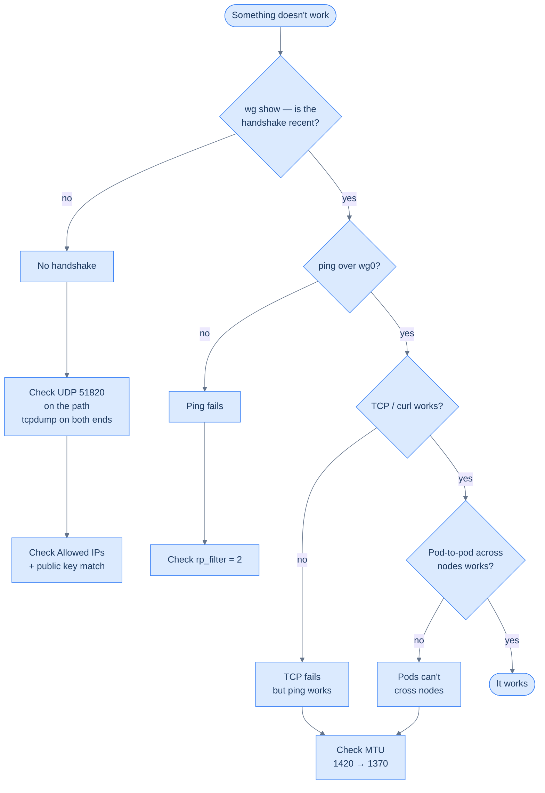

## The debug ladder



This is the order to walk every time: handshake → ping → TCP → pod-to-pod. Each step has one most likely bug behind it, and once you've internalised them, "the network is weird" debugging takes 90 seconds.

## Bug 1 — no handshake

Symptom: `wg show` reports `latest handshake: never` for one or more peers.

This is almost always a **UDP path problem**: a packet you send doesn't reach the other side, or its reply doesn't come back. WireGuard doesn't tell you why; it just sits there.

```bash
# On the receiving end (e.g. ms-1):
tcpdump -i any -n udp port 51820

# On the sending end (e.g. vm-1):
ping -c3 172.27.15.12    # triggers a handshake attempt
```

Three places UDP gets eaten:

1. **The sending host's firewall.** `iptables -L OUTPUT` and look for any DROPs.
2. **The home router's port-forward.** Most common: forwarded the wrong port, or forwarded TCP not UDP.
3. **The cloud provider's firewall.** Contabo's standard VPS panel doesn't have a separate firewall layer beyond the OS — but its bare-metal product line sometimes does, so double-check the management UI. Hetzner (and most other providers) *does* have an "external firewall" layer in the dashboard that runs before packets reach the VM; if you're on one of those, check it before blaming the OS.

If `tcpdump` on the receiving end shows packets arriving but `wg show` never reports a handshake, the bug is in the keys: `AllowedIPs` doesn't include the source address, or the public key doesn't match.

## Bug 2 — handshake works, ping fails

Symptom: `wg show` shows recent handshakes both ways. Bytes counter is increasing. But `ping 172.27.15.X` from across the mesh hangs or shows 100% packet loss.

This is **almost always `rp_filter`** — and it's worth doing the discovery the long way once, because the mental model you build will outlast this homelab.

### Walk the discovery, the first time

Imagine you've just brought the mesh up. From `wk-1`, ping to `vm-1` works. From `vm-1`, ping to `wk-1` doesn't. Same WireGuard, same keys, same routing table on both ends. What gives?

**Step 1 — confirm the handshake really is healthy.** It's tempting to assume WireGuard is broken; it almost never is. Check both ends:

```bash
# On vm-1
wg show wg0
# peer: <wk-1 pubkey>
#   endpoint: 203.0.113.10:51820
#   allowed ips: 172.27.15.11/32
#   latest handshake: 8 seconds ago
#   transfer: 1.2 KiB received, 4.8 KiB sent     ← we're sending more than receiving
```

The fact that we sent more than we received is the first real clue. If WireGuard were broken, neither counter would move. If the path were broken, both would stall. Asymmetric traffic — sent yes, received no — points at *something further up the stack* dropping packets after they decrypt.

**Step 2 — confirm packets actually arrive on the other side.** From `wk-1`, run a `tcpdump` on `wg0` while pinging from `vm-1`:

```bash
# On wk-1
tcpdump -i wg0 -n icmp
# 12:01:14.245 IP 172.27.15.31 > 172.27.15.11: ICMP echo request, id 9, seq 1
# 12:01:15.247 IP 172.27.15.31 > 172.27.15.11: ICMP echo request, id 9, seq 2
# (no replies)
```

Echo requests are arriving — that proves the tunnel is fine and the kernel is decrypting them. But no replies leave. **The packet is making it through WireGuard's encrypted layer and dying somewhere inside the kernel before `ping` ever sees it.**

That distinction is the key insight. The packet isn't lost on the wire; it's *administratively dropped* by the receiving host.

**Step 3 — ask the kernel why it's dropping things.** The kernel keeps counters of every reason it dropped a packet. Two places to look:

```bash
# Per-interface stats — RX dropped should be 0; if it isn't, something is rejecting valid packets
ip -s -s link show wg0 | grep -A1 RX
# RX:  bytes packets errors dropped missed mcast
#      4860     54      0      54     0      0
#                              ^^ — every received packet was dropped!
```

54 received, 54 dropped. Now check the kernel's recent log messages — Linux prints one when reverse-path-filter rejects a packet:

```bash
dmesg | tail -30 | grep -i 'martian\|rp_'
# [ 1234.567890] IPv4: martian source 172.27.15.31 from 172.27.15.31, on dev wg0
# [ 1234.890123] IPv4: martian source 172.27.15.31 from 172.27.15.31, on dev wg0
```

There it is. **"Martian source"** is the kernel's old-school name for "a packet whose source IP I can't account for." The kernel is logging why it's dropping every single one of those decrypted ICMP packets.

That word "martian" is the breadcrumb. Once you've seen it once, you'll grep for it forever.

### The kernel's logic, in slow motion

Reverse-path filtering ([RFC 3704](https://datatracker.ietf.org/doc/html/rfc3704)) is a small kernel feature with a big effect. When a packet arrives on interface `X` with source IP `S`, the kernel asks itself a question:

> *"If I had to send a packet back to `S`, would I send it via `X`?"*

- If **yes** — the inbound packet is consistent with what the routing table would do for an outbound reply. Accept it.
- If **no** — either the source has lied about who it is, or the routing is asymmetric in a way the kernel doesn't trust by default. Drop it as "martian."

The check has three modes, controlled by `net.ipv4.conf.<iface>.rp_filter`:

| Value | Mode | What it does |
|---|---|---|
| `0` | off | No reverse-path check. Trust the source IP. Slightly less safe. |
| `1` | strict | Drop unless the route to `S` goes out *the same interface* the packet arrived on. RFC 3704 §2.2. |
| `2` | loose | Drop only if there is *no* route to `S` at all. RFC 3704 §2.3. |

The kernel default on most distros — and on Ubuntu 24.04 — is **strict (`1`).** Strict is the right answer for a typical edge router with one upstream, where any packet claiming to be from a private network on the public interface really is suspicious. It's the wrong answer for a host that's both a WireGuard peer *and* a Kubernetes node with Calico, because **Calico installs routes that legitimately make the return path go via a different interface than the inbound packet arrived on.** Specifically:

- Inbound: a pod packet arrives on `wg0` from `172.27.15.31`.
- Routing table: replies to `172.27.15.31` go via `wg0`. ✓
- But: replies to a pod IP `10.42.X.Y` go via `cali...` veth or `vxlan.calico`, not `wg0`. ✗

For the encapsulated pod-to-pod case, strict rp_filter sees a packet whose ultimate source wouldn't be routed back via the receiving interface, and drops it. The error message says "martian source" but the actual source isn't malicious — it's an asymmetric path the kernel is being too paranoid about.

Loose mode (`2`) keeps the safety check that "we have *some* route back" — which still catches genuine spoofing — without enforcing the specific-interface constraint. That's exactly what an overlay network needs.

### Apply the fix

```bash
# Inspect every node first
for n in ms-1 wk-1 wk-2 vm-1; do
  echo "=== $n ==="
  ssh root@$n 'sysctl net.ipv4.conf.all.rp_filter \
                       net.ipv4.conf.default.rp_filter \
                       net.ipv4.conf.wg0.rp_filter'
done
```

The values you want, on every node:

| Knob | Value | Meaning |
|---|---|---|
| `all.rp_filter` | `2` | Loose mode |
| `default.rp_filter` | `2` | Loose mode (inherited by new interfaces) |
| `wg0.rp_filter` | `2` | Loose mode on the WireGuard interface specifically |

Persist by writing `/etc/sysctl.d/99-wireguard.conf`:

```ini
net.ipv4.conf.all.rp_filter=2
net.ipv4.conf.default.rp_filter=2
```

Then `sysctl --system`. The `wg0.rp_filter` value inherits from `default.rp_filter` at the moment `wg0` is created, so a fresh `wg-quick down wg0 && wg-quick up wg0` pulls in the new value.

Or, to fix it without restarting the interface:

```bash
sysctl -w net.ipv4.conf.all.rp_filter=2 \
         net.ipv4.conf.default.rp_filter=2 \
         net.ipv4.conf.wg0.rp_filter=2
```

Re-run the `ping` from `vm-1` to `wk-1`. Replies arrive. The "RX dropped" counter on `wg0` stops climbing. `dmesg` is silent.

### Why `2` and not `0`

`0` (off entirely) works just as well for our specific traffic, but it removes the kernel's check against genuinely source-spoofed packets — packets that arrive with a fake source IP that doesn't even exist in your routing table. Loose mode (`2`) keeps that protection at zero cost to legitimate asymmetric paths. There's no reason to be more permissive than the problem demands.

### Why this is the moment a homelab earns its name

By the end of this discovery, you'll have:

1. Confirmed a packet arrived but wasn't received by the application.
2. Used kernel-level interface counters and `dmesg` to find out *why*.
3. Encountered "martian source" — a term you'll never need to look up again.
4. Internalised the difference between strict and loose reverse-path filtering, with a concrete example of why the asymmetric overlay path forces loose mode.
5. Fixed it by editing one file and reloading sysctl.

Most engineers — even experienced ones — never debug `rp_filter`. On AWS or GKE, the cloud takes care of it; the failure surface is hidden behind a managed network. The first time you hit this on a homelab, it costs you an evening. Every subsequent time you see strange overlay-network bugs *anywhere* in your career, the first hypothesis you'll test is "is the kernel silently dropping these as martians?" — and it will almost always be the right hypothesis.

That's the whole pitch for owning the metal. The lessons stick because nobody hid them from you.

## Bug 3 — ping works, curl/HTTP/TCP doesn't

Symptom: `ping 172.27.15.X` works. `curl 172.27.15.X` hangs forever or completes only the very first response. SSH connects but freezes after the welcome banner.

This is almost always **MTU**.

WireGuard adds 60 bytes of overhead. Calico VXLAN over WireGuard adds another 50. If the underlying network drops a packet that's been fragmented or simply too big to fit, ICMP (which is small) passes; TCP (which sends large packets after the SYN/ACK) gets stuck.

```bash
# Test path MTU between two mesh peers
ping -M do -s 1392 172.27.15.31    # 1420 - 8 (icmp hdr) - 20 (ip hdr)
# expect: 1400 bytes from <peer>

ping -M do -s 1393 172.27.15.31
# expect: From <local> icmp_seq=1 Frag needed and DF set (mtu = 1420)
```

If the second ping returns "frag needed" with `mtu = 1420`, your MTU on `wg0` is correct. If it returns "no answer" or a smaller MTU, your underlying ISP path is fragmenting and you need to lower the WireGuard MTU.

The common fix: lower `MTU` in `[Interface]` to `1380` or `1360` and `wg-quick down/up` the interface. Lossy or 5G/4G paths sometimes need 1280.

For Calico over WireGuard, the inner pod MTU should always be ~50 bytes less than the WireGuard MTU. If WG MTU is 1420, set Calico VXLAN MTU to 1370. We'll cover this in [Swap Flannel for Calico](/cortex/homelab-from-scratch/kubernetes-base/swap-flannel-for-calico).

## Bug 4 — AllowedIPs typo

Symptom: from `vm-1`, ping to `ms-1` (172.27.15.12) works. Ping to `wk-1` (172.27.15.11) fails. Handshake to `wk-1` is recent and bytes flow.

This is **`AllowedIPs` mis-set**: somewhere on `vm-1`'s peer block for `wk-1`, the `AllowedIPs` says something other than `172.27.15.11/32`.

WireGuard uses `AllowedIPs` as both a routing rule and an authorisation list. If `vm-1` has `AllowedIPs = 172.27.15.12/32` for the `wk-1` peer (a copy-paste error from `ms-1`'s entry), then:

- Outgoing packets to `172.27.15.11` won't route through that peer's `wg0` — they'll go nowhere or take a different path.
- Incoming packets from `172.27.15.11` *will* still arrive (if `wk-1`'s side is correct), but be dropped because their source isn't in `AllowedIPs`.

Look for it with:

```bash
wg show wg0 allowed-ips
# Each peer should list exactly one /32, matching the right peer.
```

Compare to your address plan. Fix the typo, restart the interface.

## Bug 5 — the home router's NAT timeout

Symptom: works for an hour, then the home → cloud direction silently goes offline. `wg show` on the home node shows `latest handshake: 5 minutes ago` and rising.

Cause: home routers maintain a NAT table mapping outbound UDP source ports to internal hosts. Many routers age these entries out after ~3 minutes of silence. WireGuard sits there happily, since it only sends a packet when there's something to say.

Fix: `PersistentKeepalive = 25` on every peer block on the home side. We did this in the previous chapter. Make sure it's there.

`vm-1`'s side doesn't need keepalive — it's the public-IP node and packets reach it directly without NAT.

## When all else fails

```bash
# The full debug dump
wg show | head -50

# Live capture of WireGuard handshakes
tcpdump -i any -n -X 'udp port 51820 and udp[8] = 1'

# What does the kernel think about routing?
ip route get 172.27.15.31

# What does the kernel think about the interface?
ip -s link show wg0
ethtool -i wg0    # confirms it's the wireguard kernel module
```

`ip -s link show wg0` shows TX and RX byte counts. If TX is incrementing but RX isn't, packets are leaving but nothing is coming back — handshake or NAT problem. If RX is incrementing but TX isn't, packets are arriving but the kernel can't route replies — `rp_filter` or routing table problem.

That's the whole mesh, end-to-end, with the four classic bugs and how to find them.

→ Next: [Why K3s?](/cortex/homelab-from-scratch/kubernetes-base/why-k3s)
