## Four credible distributions

You can build a Kubernetes cluster on this hardware four sensible ways. Each is real, each is shipping in production somewhere.

| Distro | Install | Defaults | Memory floor | Best for |
|---|---|---|---|---|
| **kubeadm** | `apt install kubeadm` + 30 commands | Pure upstream Kubernetes — you wire everything | ~512 MB / node | Learning Kubernetes from first principles |
| **K3s** | `curl ... \| sh -` | Single binary; opinionated bundled add-ons | ~256 MB / node | Homelabs and edge deployments |
| **k0s** | `curl ... \| sh -` | Like K3s but with no bundled add-ons by default | ~256 MB / node | "I want K3s' simplicity but I'll choose every component" |
| **Talos** | Custom OS image + `talosctl` | An immutable Linux distro that exists *only* to run Kubernetes | ~512 MB / node | "I want declarative everything and don't mind a steeper ramp" |

The clusters running k3s.io's docs and most YouTube homelab tutorials are K3s. The cluster behind these docs is K3s. So is most of the IoT-edge Kubernetes you've never heard of. There's a reason.

## What K3s is, in one sentence

**K3s is upstream Kubernetes packaged as a single ~70 MB Go binary, with sensible defaults turned on by default and a single `--disable=` flag that turns each one off.**

Open the binary in `strace` and you'll see exactly the same containerd, kubelet, kube-proxy, kube-apiserver, and etcd you'd get from kubeadm. The difference is two facts:

1. **One process tree per node.** `systemctl status k3s` shows you the entire cluster on this machine. No `kubelet.service` plus `containerd.service` plus `etcd.service` plus a fan-out of helpers. One unit, one log file.
2. **A bundled bag of opinionated defaults**: Flannel CNI, Traefik ingress, ServiceLB load balancer, local-path-provisioner storage, klipper-helm chart controller. Each is one `--disable=foo` flag away from being absent.

Compare to kubeadm, where each of those is *not bundled*, and you decide-and-install before the cluster is functional. Compare to Talos, where the whole OS is replaced and there's no `apt install` at all. K3s sits in the middle: real upstream Kubernetes, real Linux underneath, sensible defaults you can opt out of one at a time.

## What we keep and what we strip

```mermaid
---
config:
  theme: base
  themeVariables:
    primaryColor: "#dbeafe"
    primaryBorderColor: "#3b82f6"
    primaryTextColor: "#1e3a5f"
    lineColor: "#64748b"
    secondaryColor: "#ede9fe"
    tertiaryColor: "#fef9c3"
---
flowchart LR
  subgraph k3s["K3s default install"]
    direction TB
    api[kube-apiserver]
    cm[controller-manager]
    sched[scheduler]
    kp[kube-proxy]
    kl[kubelet]
    cd[containerd]
    etcd[(SQLite or etcd)]
    flan[Flannel CNI]
    traefik[Traefik bundled]
    lb[ServiceLB klipper]
    np[Network Policy]
    lp[local-path<br/>provisioner]
  end

  subgraph kept["What we keep"]
    direction TB
    api2[kube-apiserver ✅]
    cd2[containerd ✅]
    kp2[kube-proxy ✅]
    kl2[kubelet ✅]
    lp2[local-path ✅]
    etcd2[(SQLite ✅)]
  end

  subgraph stripped["What we strip<br/>(--disable= and --flannel-backend=none)"]
    direction TB
    flan2[Flannel ❌<br/>→ Calico]
    traefik2[Traefik bundled ❌<br/>→ Traefik on edge]
    lb2[ServiceLB ❌<br/>→ direct edge ingress]
    np2[Network Policy ❌<br/>→ Calico's]
  end

  k3s --> kept
  k3s --> stripped
```



Concretely, the K3s server starts with these flags:

```bash
--flannel-backend=none      # we'll install Calico instead
--disable-network-policy    # Calico provides this
--disable=traefik           # we'll install Traefik ourselves, edge-pinned
--disable=servicelb         # we don't want random NodePorts
```

Why each removal:

- **Flannel** is fine for clusters that don't need NetworkPolicy and don't span unusual networks. We need both: NetworkPolicy to keep Postgres internal, and Calico's VXLAN to ride cleanly over WireGuard. So out it goes.
- **The bundled Traefik** runs on every node, listening on `:80` and `:443` via NodePort. We want exactly *one* Traefik, on the edge, with `hostNetwork: true`. The bundled chart gets in the way. (We will install Traefik manually in [Pin Traefik to the edge](/cortex/homelab-from-scratch/the-edge/pin-traefik-to-the-edge) — same software, very different deployment.)
- **ServiceLB** turns every Service of type `LoadBalancer` into a `hostPort` listener on each node — fine for some homelabs, terrible for the "only the edge is public" model. Our Services are mostly `ClusterIP`; the public path goes through Traefik on the edge.
- **Network Policy** is K3s' bundled implementation; Calico replaces it.

What stays:

- **kube-apiserver / controller-manager / scheduler / kube-proxy / kubelet / containerd** — vanilla Kubernetes plus runtime.
- **Embedded SQLite** as the data store. K3s defaults to SQLite for single-server installs and switches to embedded etcd for multi-server HA. We're single-server. SQLite is fine for thousands of objects; the moment you need a second control-plane node, K3s will migrate you to etcd automatically.
- **local-path-provisioner** — the thing that turns `PVC` into a directory on a host. We'll use it for Postgres in chapter 8.

## The version

```
v1.35.1+k3s1
```

This is what the cluster behind these docs runs, and what every script in this section will install. The `+k3s1` suffix is K3s' patch level on top of upstream Kubernetes 1.35.1.

K3s' [release cadence](https://github.com/k3s-io/k3s/releases) is roughly weekly for patches and monthly for minor versions, mirroring upstream. Pin a specific version on install so you can roll forward deliberately rather than getting whatever's latest the day you re-install.

## The single trickiest decision

The K3s server's `--node-ip` flag.

```bash
--node-ip=172.27.15.12        # ms-1's WireGuard IP
--advertise-address=172.27.15.12
--tls-san=172.27.15.12
```

This binds the kube-apiserver to the WireGuard interface, *not* the LAN interface. It's what makes the cluster reachable from the edge node (across the mesh) without exposing the API on the LAN.

If you forget these flags, K3s defaults to the host's first IPv4 address — usually the LAN address — and the edge node can't reach the API server at all. The cluster will still come up, agent installs will fail with TLS errors, and you'll spend an hour wondering why. Don't forget these flags.

→ Next: [Install the control-plane](/cortex/homelab-from-scratch/kubernetes-base/install-the-control-plane)
