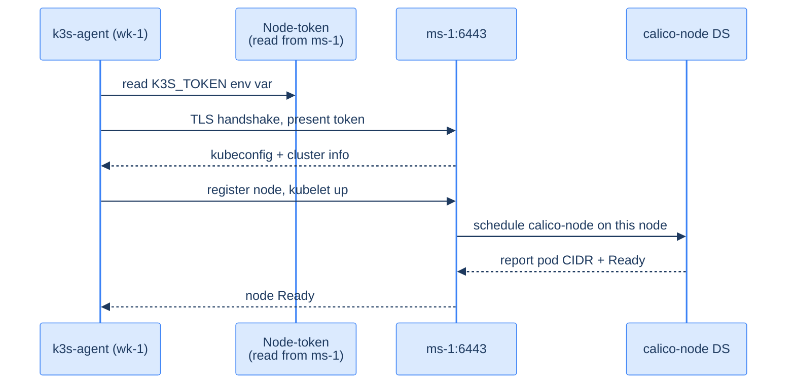

## What an "agent" is

A K3s agent is everything K3s installs minus the apiserver, scheduler, controller-manager, and etcd. So: kubelet, kube-proxy, containerd, Calico's calico-node, and the K3s supervisor. The supervisor connects to the server's `:6443` over the WireGuard mesh, fetches its kubeconfig, and starts the rest.



The token K3s generated when the server installed (`/var/lib/rancher/k3s/server/node-token` on `ms-1`) is the one credential. Anyone with that token can join. Treat it like a SSH private key.

## Get the token

On `ms-1`:

```bash
sudo cat /var/lib/rancher/k3s/server/node-token
# K10c8a...::server:5d40...
```

Copy. You'll paste it into each agent install command.

## Install the agent on `wk-1`

On `wk-1`, as root, with `K3S_TOKEN` from above:

```bash
export K3S_TOKEN='K10c8a...::server:5d40...'
export INSTALL_K3S_VERSION="v1.35.1+k3s1"

curl -sfL https://get.k3s.io | \
  K3S_URL="https://172.27.15.12:6443" \
  K3S_TOKEN="${K3S_TOKEN}" \
  INSTALL_K3S_EXEC="agent \
    --node-ip=172.27.15.11 \
    --resolv-conf=/etc/rancher/k3s/k3s-resolv.conf \
    --node-label homelab.kakde.eu/role=worker" \
  sh -
```

Two K3s-specific environment variables:

- **`K3S_URL`** — the apiserver to register with. Always the **WireGuard** IP, not LAN, because every node is supposed to reach the apiserver via the mesh.
- **`K3S_TOKEN`** — the node-token. Authentication.

And the same logic as the server install: `--node-ip` pins the kubelet's reported address to the WireGuard IP; `--resolv-conf` keeps it away from systemd-resolved's stub.

Don't forget the `create-k3s-resolv-conf.sh` step before this — same as on the server. The agent fails immediately if `/etc/rancher/k3s/k3s-resolv.conf` doesn't exist.

The install:

```bash
# On the agent node, before the install:
sudo mkdir -p /etc/rancher/k3s
sudo ln -sf /run/systemd/resolve/resolv.conf /etc/rancher/k3s/k3s-resolv.conf

# Then run the agent install command above.
```

## Install on `wk-2` and `vm-1`

Same as `wk-1`, but with the right `--node-ip` and label:

### `wk-2`

```bash
INSTALL_K3S_EXEC="agent \
  --node-ip=172.27.15.13 \
  --resolv-conf=/etc/rancher/k3s/k3s-resolv.conf \
  --node-label homelab.kakde.eu/role=worker"
```

### `vm-1` (the cloud edge)

```bash
INSTALL_K3S_EXEC="agent \
  --node-ip=172.27.15.31 \
  --resolv-conf=/etc/rancher/k3s/k3s-resolv.conf \
  --node-label homelab.kakde.eu/role=edge"
```

The edge node's role label `homelab.kakde.eu/role=edge` is descriptive — it doesn't gate scheduling on its own. The taint that actually keeps app pods off `vm-1` comes in the next chapter.

## Watch each node join

From your laptop with `KUBECONFIG=~/.kube/homelab.yaml`:

```bash
watch -n1 kubectl get nodes
```

You'll see them appear over a minute or two:

```
NAME         STATUS   ROLES                  AGE     VERSION
ms-1         Ready    control-plane,master   12m     v1.35.1+k3s1
wk-1         Ready    <none>                 90s     v1.35.1+k3s1
wk-2         Ready    <none>                 30s     v1.35.1+k3s1
ctb-edge-1   Ready    <none>                 10s     v1.35.1+k3s1
```

(K3s' agent reports its hostname; if you set the cloud edge's hostname to `ctb-edge-1` in the cloud-init step, it'll appear with that name. The `vm-1` alias is just the SSH alias on your laptop.)

If a node sits at `NotReady`, two likely causes:

1. **calico-node hasn't started on this node yet.** Check `kubectl -n calico-system get pods -o wide` — there should be exactly one calico-node per Ready node. If the pod is `ImagePullBackOff`, your node can't reach the registry; check egress.
2. **kubelet error.** SSH to the node and `journalctl -u k3s-agent -n 50`. The most common: clock skew (re-check `timedatectl`), or token mismatch (re-paste the token, don't trust your terminal copy buffer).

## Confirm pod-to-pod across nodes

The first cross-node packet is the moment of truth:

```bash
# Schedule a pod on wk-1
kubectl run pod-on-wk1 --image=alpine --overrides='{"spec":{"nodeSelector":{"kubernetes.io/hostname":"wk-1"}}}' --command -- sleep 1d

# Schedule a pod on wk-2
kubectl run pod-on-wk2 --image=alpine --overrides='{"spec":{"nodeSelector":{"kubernetes.io/hostname":"wk-2"}}}' --command -- sleep 1d

# Get their pod IPs
kubectl get pods -o wide
# pod-on-wk1   1/1   Running   0   30s   10.42.1.5   wk-1
# pod-on-wk2   1/1   Running   0   30s   10.42.2.5   wk-2

# Ping wk-2's pod from wk-1's pod
kubectl exec pod-on-wk1 -- ping -c 3 10.42.2.5
# 64 bytes from 10.42.2.5 ... time=4.2 ms

# Cleanup
kubectl delete pod pod-on-wk1 pod-on-wk2
```

If the ping works, your data plane is functional end-to-end: pod → veth → host route → Calico VXLAN → WireGuard → physical NIC → home router → ISP → Contabo → reverse, three times.

If it fails, the most common cause is the MTU. Re-run the MTU test from [When the mesh misbehaves](/cortex/homelab-from-scratch/private-mesh/when-the-mesh-misbehaves), but with the smaller Calico MTU value of 1370 minus the 28 ICMP+IP overhead = 1342 in the `-s` flag.

## What you should have now

- Four `Ready` nodes: `ms-1`, `wk-1`, `wk-2`, and the edge node (`ctb-edge-1`)
- `kubectl get pods -A` shows calico-node pods Running on each
- A test pod on one worker can ping a pod IP on another worker

Now we just have to *tell* the cluster which node should run what. That's the next chapter.

→ Next: [Where things are allowed to run](/cortex/homelab-from-scratch/kubernetes-base/where-things-are-allowed-to-run)
