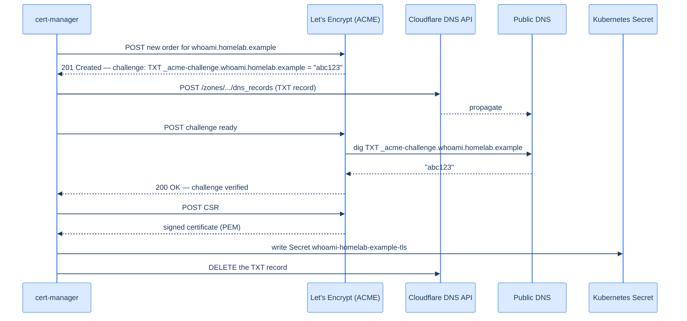

## The end state

When this chapter is done, every Kubernetes Ingress that has an annotation like:

```yaml
metadata:
  annotations:
    cert-manager.io/cluster-issuer: letsencrypt-prod-dns01
spec:
  tls:
    - hosts:
        - whoami.homelab.example
      secretName: whoami-homelab-example-tls
```

…will get a real Let's Encrypt certificate, automatically, within 60 seconds. Renewal: also automatic, ~30 days before expiry, with no human in the loop. Cert-manager does the work; you write four lines of YAML.

## How DNS-01 works



The protocol is: cert-manager and Let's Encrypt agree on a magic string; cert-manager creates a TXT DNS record with that string; Let's Encrypt looks up the record and verifies it. The TXT record proves you control the DNS zone, which proves you control the domain, which proves you should get a cert for `*.homelab.example`.

### DNS-01 vs HTTP-01 — when each makes sense

Let's Encrypt offers two challenges. The protocol is symmetric in spirit (prove you control *something* about the domain), and the choice between them is operational, not security:

| | **HTTP-01** | **DNS-01** |
|---|---|---|
| **What you prove** | "I control the web server at `host`" — by serving a magic string at `http://host/.well-known/acme-challenge/...` | "I control the DNS zone for `host`" — by creating a TXT record |
| **Reaches you over** | Public HTTP on `:80` | Public DNS |
| **Wildcards (`*.host`)** | ❌ — Let's Encrypt won't issue wildcards via HTTP-01 | ✅ — the only path to a wildcard cert |
| **Works for hosts with no public HTTP yet** | ❌ — needs a reachable web server first | ✅ — purely DNS-based |
| **Needs a credential** | None — cert-manager handles the file from inside the cluster | A scoped DNS-provider API token (Cloudflare in our case) |
| **Setup complexity** | Lower — one Ingress annotation, no token management | Higher — token, DNS provider integration, Sealed Secret |
| **Failure modes** | A 5-minute Traefik outage during renewal kills the cert | A flaky DNS provider API kills the cert |

You'd pick **HTTP-01** when:

- You have one or two hostnames, each already serving public HTTP, and you don't want to manage a DNS-provider token.
- Your DNS provider isn't on cert-manager's [supported list](https://cert-manager.io/docs/configuration/acme/dns01/) (rare in 2026 — most are).
- You want the simplest possible bootstrap: a single Ingress annotation, no Secrets, no extra ACLs.

You'd pick **DNS-01** when:

- You want a wildcard. Once you've issued `*.homelab.example` once, every new subdomain inherits the cert with no re-issue. This is the killer feature for a homelab where you'll spin up new hostnames weekly.
- The host has no public HTTP yet (chicken-and-egg: cert-manager wants a cert before Traefik can serve TLS, but `:80` isn't routable yet).
- The host has public HTTP that you'd rather not interrupt for renewal — DNS-01 doesn't touch the data plane at all.
- You ever want to issue a cert for a hostname that lives entirely inside the WireGuard mesh, with *no* public ingress. HTTP-01 can't validate it; DNS-01 can.

**This homelab uses DNS-01 for everything.** The wildcard convenience and the "works before there's any HTTP listener" property are worth the extra setup. We register the Cloudflare token once, every Ingress reuses the same ClusterIssuer, and we never think about TLS again.

The token from [The Cloudflare API token](/cortex/homelab-from-scratch/domain-and-dns/the-cloudflare-api-token) is the credential cert-manager uses to write those temporary TXT records.

## Why cert-manager (and why Let's Encrypt)

You could issue Let's Encrypt certs by hand with `certbot`, drop the resulting PEM into a `Secret`, and rotate it via cron. People do. **cert-manager** turns the same flow into a Kubernetes-native loop: create a `Certificate` resource, the controller reconciles it into a Secret, watches its expiry, renews 30 days before it's due, retries on failure. Every Ingress gets the same lifecycle handling for free.

The alternatives:

- **`certbot` + cron** — works, but you're hand-rolling a controller, every Ingress has bespoke renewal logic, and the cluster has no idea why a Secret is the way it is.
- **Caddy as the ingress controller** — Caddy speaks ACME natively. Replaces both Traefik *and* cert-manager with one binary. A defensible alternative for a one-app homelab; less flexible than Traefik + cert-manager once you have many backends.
- **Vault PKI** — issues internal CA certs; not Let's Encrypt-trusted, so browsers warn. Useful for *internal* TLS between cluster components, not for public hostnames.

For Let's Encrypt itself, the alternatives are **ZeroSSL** (free tier, ACME-compatible) and **Buypass** (free, longer cert lifetimes). Both work with cert-manager via the same `acme` block. Let's Encrypt's only real disadvantages are its rate limits and its 90-day cert lifetime — neither matters for a homelab.

We use cert-manager + Let's Encrypt because it's what every tutorial uses, what every alternative is benchmarked against, and what most production Kubernetes deployments run.

## Install cert-manager

cert-manager ships as a Helm chart. The cluster behind these docs uses `v1.19.1`:

```bash
export KUBECONFIG=~/.kube/homelab.yaml
CERT_MANAGER_VERSION="v1.19.1"

# 1. Add the chart repo
helm repo add jetstack https://charts.jetstack.io
helm repo update

# 2. Create the namespace
kubectl create namespace cert-manager --dry-run=client -o yaml | kubectl apply -f -

# 3. Install
helm install cert-manager jetstack/cert-manager \
  --namespace cert-manager \
  --version "${CERT_MANAGER_VERSION}" \
  --set installCRDs=true
```

`installCRDs=true` is what makes the `Certificate`, `ClusterIssuer`, etc. CRDs available. Without that flag, cert-manager installs but the CRDs that drive it don't.

Wait for the three pods (cert-manager, cainjector, webhook) to come up:

```bash
kubectl -n cert-manager get pods
# cert-manager-...               1/1   Running
# cert-manager-cainjector-...    1/1   Running
# cert-manager-webhook-...       1/1   Running
```

## Stash the Cloudflare token

The token from the earlier chapter goes in as a Kubernetes Secret in the `cert-manager` namespace:

```bash
kubectl -n cert-manager create secret generic cloudflare-api-token \
  --from-literal=api-token='<paste the 40-char token>'
```

(Soon you'll do this via Sealed Secrets and the credential will live in Git encrypted. For now, plain Secret is fine — we're not in GitOps yet.)

## Two ClusterIssuers — staging and prod

Two `ClusterIssuer` resources, one for testing, one for real. The pattern is the same:

```yaml
apiVersion: cert-manager.io/v1
kind: ClusterIssuer
metadata:
  name: letsencrypt-prod-dns01
spec:
  acme:
    email: you@example.com
    server: https://acme-v02.api.letsencrypt.org/directory
    privateKeySecretRef:
      name: letsencrypt-prod-dns01-private-key
    solvers:
      - dns01:
          cloudflare:
            apiTokenSecretRef:
              name: cloudflare-api-token
              key: api-token
```

And the staging variant — same fields, different `server`:

```yaml
apiVersion: cert-manager.io/v1
kind: ClusterIssuer
metadata:
  name: letsencrypt-staging-dns01
spec:
  acme:
    email: you@example.com
    server: https://acme-staging-v02.api.letsencrypt.org/directory
    privateKeySecretRef:
      name: letsencrypt-staging-dns01-private-key
    solvers:
      - dns01:
          cloudflare:
            apiTokenSecretRef:
              name: cloudflare-api-token
              key: api-token
```

Why two? **Let's Encrypt rate-limits the production directory aggressively.** Five duplicate certs per week per hostname; 50 certs per week per registered domain. While you're learning and breaking things, every retry burns into that limit. The staging directory issues *non-trusted* certs (your browser will warn) but is essentially unlimited.

Pattern: while debugging, point at `letsencrypt-staging-dns01`. When the cert flow works end-to-end and your `Certificate` resource is `Ready: True`, switch to `letsencrypt-prod-dns01`.

Apply both:

```bash
kubectl apply -f clusterissuer-staging.yaml
kubectl apply -f clusterissuer-prod.yaml

kubectl get clusterissuers
# NAME                          READY   AGE
# letsencrypt-staging-dns01     True    20s
# letsencrypt-prod-dns01        True    20s
```

`Ready: True` means cert-manager registered an ACME account at Let's Encrypt and got a private key. Doesn't mean any certs have been issued yet.

## A test certificate

Create one to confirm the pipeline works end-to-end. Pick any hostname under your domain — `test.homelab.example` is fine.

```yaml
apiVersion: cert-manager.io/v1
kind: Certificate
metadata:
  name: test-homelab-example
  namespace: default
spec:
  secretName: test-homelab-example-tls
  issuerRef:
    name: letsencrypt-staging-dns01
    kind: ClusterIssuer
  dnsNames:
    - test.homelab.example
```

```bash
kubectl apply -f /tmp/test-cert.yaml

# Watch
kubectl describe certificate test-homelab-example
```

Reading the events at the bottom of `describe`:

```
Created Order for whoami.homelab.example
Order created: { ... }
Created Challenge resource for whoami.homelab.example
Challenge resource is now in "valid" state
Issuing certificate
Reissued certificate ...
```

The whole thing should take 30–90 seconds. If it goes past 5 minutes, something's wrong — likely:

1. **Cloudflare token is missing or wrong.** `kubectl get secret cloudflare-api-token -n cert-manager` should exist; `kubectl describe order ...` will show the API error.
2. **DNS propagation delay.** Some recursive resolvers cache TXT records' negative-result for minutes. If the order is `pending` at the "Wait for DNS propagation" step, give it five minutes.
3. **cert-manager pod can't reach the internet.** Outgoing internet from `cert-manager` namespace is required.

When the test cert comes up Ready, delete it and switch all your real Ingresses to `letsencrypt-prod-dns01`.

## Issue a wildcard

Wildcards are why DNS-01 exists. One cert covers every subdomain, you stop worrying about new hostnames:

```yaml
apiVersion: cert-manager.io/v1
kind: Certificate
metadata:
  name: homelab-example-wildcard
  namespace: traefik
spec:
  secretName: homelab-example-wildcard-tls
  issuerRef:
    name: letsencrypt-prod-dns01
    kind: ClusterIssuer
  dnsNames:
    - homelab.example
    - "*.homelab.example"
```

Apply, wait, the wildcard cert lands in the `traefik` namespace. We won't use it yet — the per-Ingress certs are simpler and the rate limit is fine. But it's there if you want it.

## What you should have now

- cert-manager v1.19.1 running in the `cert-manager` namespace, three pods Ready
- The Cloudflare token stored as a Secret in that namespace
- Two ClusterIssuers (staging, prod), both Ready
- A successful test certificate that validated and issued

The pipeline is built. Next, we light it up by deploying whoami and watching the cert auto-issue.

→ Next: [Publish whoami](/cortex/homelab-from-scratch/the-edge/publish-whoami)
