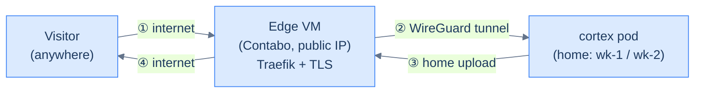
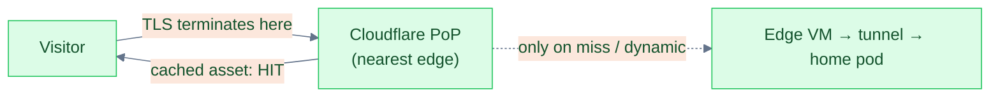

## The problem: a fast app on a slow pipe

[Publish whoami](/cortex/homelab-from-scratch/the-edge/publish-whoami) got a service onto the public internet. But "reachable" isn't "fast." The homelab has a structural handicap most cloud apps don't:

Your pods run **at home**; the only public door is a cheap cloud VM joined to home by a [WireGuard mesh](/cortex/homelab-from-scratch/private-mesh/the-wireguard-mesh). So every response is paid for **twice over the internet** (edge⇄home, then edge⇄visitor), and the return leg is gated by **residential upload bandwidth** — the slowest link in the chain.

The instinct is "scale it — more pods." That's the wrong lever: extra replicas all sit behind the *same* home uplink and tunnel. This is a **payload and delivery** problem, not a CPU one. Measured on `cortex.kakde.eu` before any fix, the landing page pulled **~10.8 MB of JavaScript on every visit** — uncompressed, uncached, and including a code editor (Monaco, 3.9 MB) + a diagram engine (Mermaid, 2.8 MB) + a math renderer the home page never even uses.

Three independent layers fix it. None requires touching the cluster topology.

## Layer 1 — compress at the origin

Text compresses ~3–8×. Turning on gzip/deflate is the single biggest transfer win. The subtlety for a homelab: **compress at the origin, not just at the edge.** If you only compress at the CDN, the full-size bytes still cross your slow tunnel; compressing in the app shrinks them *before* the bottleneck.

In our Scala server it's one line on the HTTP config — gzip/deflate every response over ~1 KiB. Measured result:

| Asset | Uncompressed | gzip | Ratio |
|---|---|---|---|
| entry JS bundle | 3.2 MB | 853 KB | **3.8×** |
| stylesheet | 609 KB | 77 KB | **7.9×** |
| `/api` JSON | 162 KB | 21 KB | **7.8×** |

The general rule: serve **gzip from the origin** (zero extra dependencies, works everywhere). Brotli is ~15% smaller again but needs an extra native lib — easier to let the CDN add it (Layer 3 does, for free).

## Layer 2 — cache forever, but never the wrong thing

Compression shrinks the *first* visit. **Caching makes repeat visits nearly free** — but only if you split your files into two categories with opposite policies:

| File | `Cache-Control` | Why |
|---|---|---|
| `index.html`, SPA routes | `no-cache` | The entry point must always revalidate, so a deploy's new asset hashes are picked up immediately. |
| `/assets/*.js`, `*.css` (content-hashed) | `public, max-age=31536000, immutable` | The hash *is* the version — the bytes behind a URL never change, so cache them for a year and never revalidate. |

This is the canonical single-page-app pattern. Your bundler already puts a content hash in each asset filename (`index-DRfTPRTG.js`); `immutable` just tells the browser to trust it. A returning visitor re-downloads **nothing** but the tiny `index.html`; when you deploy, the new HTML points at new hashes, which miss cache exactly once.

The measured effect on the landing page: **repeat-visit transfer ~10.8 MB → ~1.4 KB.**

> **Failure mode to avoid:** putting `immutable` on a *non-hashed* file (your `index.html`, an un-fingerprinted logo). Browsers will then serve a stale copy for up to a year with no way to bust it. Hash-in-filename is the licence to use `immutable`; nothing else gets it.

## Layer 3 (build-time) — stop shipping code the page doesn't use

Compression and caching still assume the page *needs* all those bytes. The home page didn't. It was eagerly downloading the code editor and diagram engine that only ever appear on interactive chapter pages.

Modern bundlers code-split a `import()` into its own chunk that loads on demand — *if* you let them. Two traps we hit, both worth knowing:

1. **A static import pins the chunk to the entry.** A top-level `import Editor from "monaco"` lands Monaco in the entry's import graph, so it loads on *every* page. The fix is a lazy boundary — `React.lazy(() => import("./monaco"))` — so the editor's chunk is fetched only when an editor actually mounts. (No app logic changed; only *when* the module loads.)
2. **Over-eager manual chunking back-fires.** We had a hand-tuned `manualChunks` map forcing each big library into a named vendor chunk. Counter-intuitively that made things *worse*: the bundler co-located shared runtime helpers (including the bundler's own preload helper) inside those vendor chunks, so the entry **statically imported them anyway** — dragging ~9 MB back onto the landing page. Deleting the manual map and letting the bundler split automatically fixed it. **Lesson: don't hand-chunk libraries that are already reached only via dynamic `import()`; the bundler does it better.**

Result: the landing page went from **4–5 heavy chunks to zero**. It now ships only its entry bundle; the editor/diagram/math chunks arrive on the pages that use them.

## Layer 4 — put a CDN in front (Cloudflare proxy)

Layers 1–3 made the payload small and cacheable, but a cache-miss or first-time visitor still pulls every byte from your single home-fronted origin, over the tunnel, from wherever they are in the world. A CDN fixes **distance**.

If your DNS is already on Cloudflare (it is, from [Move DNS to Cloudflare](/cortex/homelab-from-scratch/domain-and-dns/move-dns-to-cloudflare) — the same zone cert-manager uses for [DNS-01](/cortex/homelab-from-scratch/the-edge/tls-on-autopilot)), turning on the proxy is a **DNS toggle, not a deployment**: flip the record from "DNS only" (grey) to "Proxied" (orange).

What it buys, and how each part works:

- **Edge caching.** Cloudflare respects your `Cache-Control`, so the `immutable` assets are cached at the PoP nearest each visitor. After the first fetch they're served from that edge — they **stop crossing your home tunnel entirely**. (`cf-cache-status: HIT`.) Your `index.html` (`no-cache`) and `/api/*` stay `DYNAMIC` — never edge-cached, so dynamic and authenticated responses are always fresh.
- **TLS near the user.** The handshake terminates at the PoP, not at your single far-away origin — a big latency cut for distant visitors.
- **Brotli for free**, plus HTTP/3, DDoS protection, and your origin IP hidden.

Two configuration details that matter for a homelab already using cert-manager:

- **SSL/TLS mode must be `Full (strict)`** — Cloudflare↔origin stays HTTPS *and* validates the origin's certificate, which your cert-manager Let's Encrypt cert satisfies. Never `Flexible`: Traefik forces HTTPS, so a plaintext origin leg becomes a redirect loop.
- **Check your CAA records.** A CAA record whitelists which CAs may issue certs for your domain. cert-manager needs `letsencrypt.org` for the **origin** cert — but Cloudflare's edge cert is issued by **Google Trust Services**, so you also need `pki.goog`. If CAA stays Let's-Encrypt-only, the edge cert eventually fails to renew and the proxied site goes dark. Add both (and `digicert.com`/`ssl.com` for headroom).

> **Watch-item:** Cloudflare's Free plan has a ~100 s proxy timeout. Fine for normal requests and steadily-streaming SSE, but a long-idle server-sent-events stream can be cut — worth knowing before you put a live websocket/SSE feature behind it.

## The measured before/after

Everything above, measured on `cortex.kakde.eu` with `curl`:

| | Baseline | + Layers 1–3 (app) | + Layer 4 (Cloudflare) |
|---|---|---|---|
| First-visit transfer | ~10.8 MB | **929 KB** | 929 KB |
| Repeat-visit transfer | ~10.8 MB | **~1.4 KB** | ~1.3 KB |
| Compression | none | gzip 3.8–7.9× | + Brotli on HTML |
| Heavy chunks on home page | 4–5 | **0** | 0 |
| Entry chunk (853 KB) fetch | — | from origin via tunnel | **from edge (HIT)** |
| TLS terminates | far origin | far origin | **nearby PoP** |

On a representative 10 Mbps connection, first-load *transfer* drops from **~8.6 s → ~0.75 s**; a returning visitor pulls essentially nothing; and a far-away visitor now hits a local Cloudflare edge instead of round-tripping to your home tunnel.

## What you should have now

- gzip/deflate at the origin (compress before the slow tunnel, not only at the edge)
- `immutable` on content-hashed assets, `no-cache` on `index.html`
- a landing bundle free of heavy chunks (lazy-loaded on demand; no hand-tuned `manualChunks`)
- a Cloudflare proxy in `Full (strict)` mode, CAA permitting both Let's Encrypt and `pki.goog`, edge-caching the immutable assets and bypassing `/api/*`

The order of leverage is worth remembering: **shrink the payload first** (it helps every visitor on every network), **cache it second** (free repeat visits), and **add the CDN last** (distance) — because a CDN caching a 10 MB uncompressed bundle just serves the same bloat from more places. The operational checklist + the `curl` proofs + how to smoke-test a build on the cluster live in the [Serving performance & the Cloudflare edge](/cortex/cortex-onboarding/runbooks/production/serving-performance-and-edge) runbook.

→ Next: [Sealed Secrets](/cortex/homelab-from-scratch/secrets-and-gitops/sealed-secrets)
