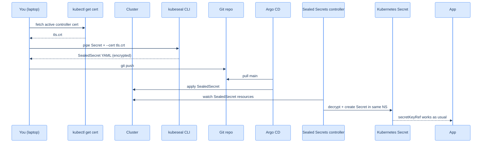

## The problem we're solving

Argo CD watches a Git repo and applies whatever's in it. Half the manifests an app needs are public-by-design (Deployment, Service, Ingress). The other half — passwords, OAuth client secrets, API tokens — should never be in Git as plain text.

The naïve workarounds are bad:

- **Don't commit secrets, apply them by hand.** Now your GitOps repo isn't actually the source of truth. New cluster = manual setup of every Secret. Secrets drift between clusters silently.
- **Commit secrets with read-only repo access.** Read-only is one accidental fork away from public. And anyone the project pulls in has the keys to everything.
- **Encrypt secrets with `git-crypt` or `gpg` at the file level.** Works, but doesn't integrate with Argo CD — Argo CD applies the encrypted blob, Kubernetes can't read it, the app crashes.

Sealed Secrets is the cleanest answer. **Encrypted in Git, decrypted in cluster, transparent to Argo CD.**

## How it works



Three keys to internalise:

1. **The controller's private key never leaves the cluster.** Encryption uses the matching public key, available to anyone with `kubectl`. Decryption only happens inside the Sealed Secrets controller.
2. **Encrypted blobs are scoped to namespace + name.** A `SealedSecret` for `dsa-tracker-db` in namespace `apps-prod` cannot be decrypted into `apps-dev` — even though the controller has the right private key. Resealing is required for namespace moves.
3. **App workloads still see a normal Kubernetes Secret.** The controller creates a real `Secret` resource alongside the `SealedSecret`. Pods reference the Secret by `secretKeyRef` exactly as if it were created by hand.

## Install the controller

One manifest from the Bitnami release page:

```bash
export KUBECONFIG=~/.kube/homelab.yaml

kubectl apply -f https://github.com/bitnami-labs/sealed-secrets/releases/download/v0.33.1/controller.yaml
```

This creates the controller Deployment in `kube-system`, the `SealedSecret` CRD, and a service account with the right RBAC. ~30 seconds to come up.

```bash
kubectl -n kube-system get pods -l app.kubernetes.io/name=sealed-secrets
# sealed-secrets-controller-...   1/1   Running
```

The controller generates a private key on first start. The key lives in a Secret in `kube-system` named `sealed-secrets-key<random>` with the label `sealedsecrets.bitnami.com/sealed-secrets-key=active`. **This Secret is the master key for every other Secret you'll ever encrypt.** Lose it and every committed `SealedSecret` becomes a 256-bit rectangle of noise.

## Install kubeseal locally

```bash
# macOS
brew install kubeseal

# Linux
KUBESEAL_VERSION='v0.33.1'
curl -sLo /tmp/kubeseal.tar.gz "https://github.com/bitnami-labs/sealed-secrets/releases/download/${KUBESEAL_VERSION}/kubeseal-${KUBESEAL_VERSION#v}-linux-amd64.tar.gz"
tar -xzf /tmp/kubeseal.tar.gz -C /tmp
sudo install /tmp/kubeseal /usr/local/bin

kubeseal --version
# kubeseal version: 0.33.1
```

## Fetch the public cert

```bash
# Pull the active controller's certificate
kubectl get secret -n kube-system \
  -l sealedsecrets.bitnami.com/sealed-secrets-key=active \
  -o jsonpath='{.items[0].data.tls\.crt}' | base64 -d \
  > /tmp/sealed-secrets-cert.pem

# Confirm it's a valid certificate
openssl x509 -in /tmp/sealed-secrets-cert.pem -noout -subject
# subject= CN = sealed-secret/sealed-secrets-controller
```

You can keep this file around — the cert doesn't change unless you rotate the controller's key.

## Seal your first secret

This is the one workflow you'll do dozens of times. Two pipes, one redirect.

```bash
# Pretend we want a Secret for whoami called whoami-greeting with one key.
kubectl create secret generic whoami-greeting \
  --namespace apps \
  --from-literal=greeting='hello, homelab' \
  --dry-run=client \
  -o yaml | \
kubeseal \
  --cert /tmp/sealed-secrets-cert.pem \
  --format yaml \
  > /tmp/whoami-greeting.sealed.yaml

cat /tmp/whoami-greeting.sealed.yaml
```

The output:

```yaml
apiVersion: bitnami.com/v1alpha1
kind: SealedSecret
metadata:
  name: whoami-greeting
  namespace: apps
spec:
  encryptedData:
    greeting: AgB...64-character-encrypted-blob...==
  template:
    metadata:
      name: whoami-greeting
      namespace: apps
```

That whole file is safe to commit. The `encryptedData.greeting` value can only be decrypted by the controller's private key, which lives only in `kube-system`. Even a fork of this Git repo with full read access can't recover the plain text.

Apply and verify:

```bash
kubectl apply -f /tmp/whoami-greeting.sealed.yaml

# The SealedSecret resource exists
kubectl get sealedsecret whoami-greeting -n apps

# A few seconds later, the controller has created the actual Secret
kubectl get secret whoami-greeting -n apps -o jsonpath='{.data.greeting}' | base64 -d
# hello, homelab
```

That's the round-trip. The `Secret` reads exactly like any hand-applied Secret.

## Back up the master key — now, before you forget

The single most important operation in this chapter. Do it now while the cluster is fresh.

```bash
# Export the key Secret to a YAML file
kubectl get secret -n kube-system \
  -l sealedsecrets.bitnami.com/sealed-secrets-key=active \
  -o yaml \
  > ~/sealed-secrets-master-key.$(date +%Y%m%d).yaml
```

That YAML contains the controller's private key. Treat it the way you treat your SSH private key:

- **Put it in your password manager.** 1Password, Bitwarden, KeePass, whatever you trust. Encrypted at rest, accessible from your laptop.
- **Make a second copy.** USB stick in a fireproof safe, encrypted offsite backup, the second password manager you trust slightly less. *Two* independent copies.
- **Don't email it to yourself.** Don't put it in cloud storage that your work account also accesses. Don't paste it into Slack, even in DMs.

To restore on a freshly reinstalled cluster:

```bash
# (after installing the controller fresh)
kubectl apply -f ~/sealed-secrets-master-key.<date>.yaml

# Restart the controller so it picks up the restored key as active
kubectl -n kube-system delete pod -l app.kubernetes.io/name=sealed-secrets-controller
```

After restore, every committed `SealedSecret` from the old cluster decrypts on the new cluster. Without this backup, every secret has to be regenerated by hand.

## What about updating a sealed secret?

Don't edit the YAML. Re-seal the new value:

```bash
kubectl create secret generic whoami-greeting \
  --namespace apps \
  --from-literal=greeting='hello, world' \
  --dry-run=client \
  -o yaml | \
kubeseal --cert /tmp/sealed-secrets-cert.pem --format yaml \
  > /tmp/whoami-greeting.sealed.yaml

# Overwrite the existing committed file
git add /tmp/whoami-greeting.sealed.yaml
git commit -m "rotate whoami greeting"
git push
```

Argo CD picks up the new `SealedSecret` on its next sync, the controller decrypts it, the existing `Secret` is updated in place, the workload picks up the new value on its next pod restart.

## What you should have now

- A Sealed Secrets controller running in `kube-system`
- `kubeseal` CLI on your laptop
- `/tmp/sealed-secrets-cert.pem` with the public cert
- One sealed secret applied as a smoke test
- A backup of the master key in your password manager and at least one other location

The next chapter installs Argo CD, which is what'll start *applying* sealed secrets from Git automatically.

→ Next: [Install Argo CD on wk-2](/cortex/homelab-from-scratch/secrets-and-gitops-install-argocd-on-wk-2)
