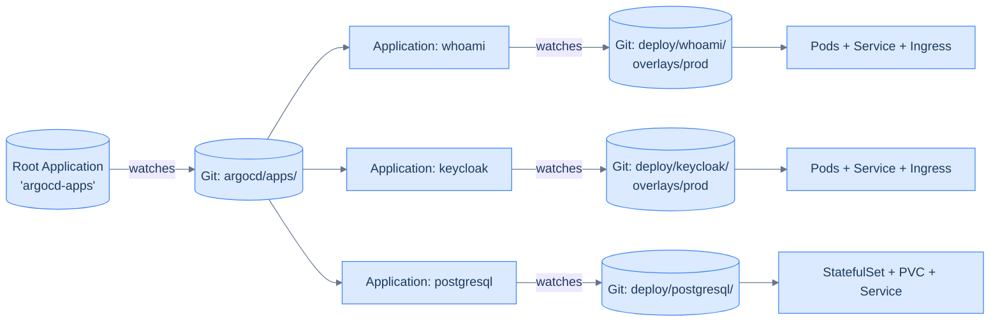

## The pattern in one diagram



Three layers:

1. **The root `Application`**, applied once by hand. It points at one Git directory: `argocd/apps/`.
2. **Child `Application` manifests** in that directory. Each one references a different infra/app overlay.
3. **The actual workload manifests** in those overlays. Argo CD applies them and watches for drift.

Adding `keycloak`: write `argocd/apps/keycloak.yaml` with one Application manifest, commit, push. Argo CD picks it up, applies it, the keycloak workload comes online. Removing keycloak: delete the file, commit, push. Argo CD removes the Application, prunes the resources.

## Set up the Git layout

In your infra repo, create two directories:

```
infra/
├── argocd/
│   └── apps/                      # ← child Application manifests
│       ├── whoami.yaml
│       ├── keycloak.yaml
│       └── postgresql.yaml
└── deploy/
    ├── whoami/
    │   └── overlays/
    │       └── prod/
    │           ├── kustomization.yaml
    │           ├── deployment.yaml
    │           ├── service.yaml
    │           └── ingress.yaml
    ├── keycloak/
    │   └── overlays/prod/...
    └── postgresql/...
```

`argocd/apps/` holds Application CRDs. `deploy/<name>/overlays/<env>/` holds the actual Kubernetes manifests. The split keeps the GitOps control plane (`argocd/apps/`) separate from the workload manifests (`deploy/`).

### A note on Helm vs Kustomize vs raw manifests

Across this book you've seen three different ways manifests reach the cluster:

| Pattern | Used for | Why |
|---|---|---|
| **`helm install`** | cert-manager, Argo CD itself, Sealed Secrets controller | Each ships an upstream chart with hundreds of lines of manifests, sensible defaults, and a values file as the customisation surface. Re-implementing them in raw YAML would mean tracking upstream changes by hand forever |
| **Raw `kubectl apply` of YAML** | Traefik, Postgres, Keycloak, Calico (via the operator) | Small, opinionated, version-pinned manifests where Helm's templating buys nothing. We control every line; upgrades are a `git diff` |
| **Kustomize overlays** (this chapter onwards) | Your own apps in `deploy/<name>/` | Lets `base/` define the shape and `overlays/prod/`, `overlays/dev/` differ by namespace, image tag, sealed secret. Argo CD runs `kustomize build` automatically |

The choice rule, in one sentence: **Helm if upstream owns it, raw YAML if we own it and it's small, Kustomize if we own it and it has multiple environments.**

There's no Helm-vs-Kustomize religious war here. They're complementary — Argo CD can apply both and even render Helm charts through Kustomize overlays when you need to override values. We don't, because the boundary above is clean enough.

## A child Application

```yaml
# argocd/apps/whoami.yaml
apiVersion: argoproj.io/v1alpha1
kind: Application
metadata:
  name: whoami
  namespace: argocd
spec:
  project: default
  source:
    repoURL: https://github.com/<you>/infra.git
    targetRevision: main
    path: deploy/whoami/overlays/prod
  destination:
    server: https://kubernetes.default.svc
    namespace: apps
  syncPolicy:
    automated:
      prune: true
      selfHeal: true
```

Field by field:

| Field | What it does |
|---|---|
| `metadata.namespace: argocd` | All Application CRDs live in `argocd`, regardless of where their workload runs. |
| `spec.project: default` | We're not using project-level RBAC yet. `default` is the catch-all. |
| `spec.source.repoURL` | The repo Argo CD pulls. Public is fine for the manifests because secrets are in SealedSecrets. |
| `spec.source.targetRevision: main` | The branch to track. `main` for production; you might use `staging` for a dev cluster. |
| `spec.source.path` | The directory inside the repo. Argo CD runs `kustomize build` here if there's a `kustomization.yaml`, or `kubectl apply -f` if not. |
| `spec.destination.namespace: apps` | The namespace these manifests apply to. Argo CD creates the namespace if missing. |
| `syncPolicy.automated.prune: true` | If a resource is deleted from Git, Argo CD deletes it from the cluster. **Without this, removed manifests leak.** |
| `syncPolicy.automated.selfHeal: true` | If someone `kubectl edit`s a resource Argo CD manages, Argo CD pulls it back to Git. |

The pruning and self-heal flags together are what makes "Git is the source of truth" *actually* true. Without them, GitOps is "Git is the source of *some* truth, plus whatever else is on the cluster."

## The root Application

The root Application points at the directory of child Applications:

```yaml
# argocd/apps/argocd-apps.yaml
apiVersion: argoproj.io/v1alpha1
kind: Application
metadata:
  name: argocd-apps
  namespace: argocd
spec:
  project: default
  source:
    repoURL: https://github.com/<you>/infra.git
    targetRevision: main
    path: argocd/apps
  destination:
    server: https://kubernetes.default.svc
    namespace: argocd
  syncPolicy:
    automated:
      prune: true
      selfHeal: true
```

Apply *this* one by hand:

```bash
kubectl apply -f argocd/apps/argocd-apps.yaml
```

After this single hand-apply, every other Application is deployed by GitOps — including future ones you add.

The recursion is: the `argocd-apps` Application points at the directory containing `argocd-apps.yaml`. Argo CD applies every YAML in that directory, including `argocd-apps.yaml` itself. So the root Application is now self-managing too. **One imperative command on a fresh cluster, then everything is declarative.**

## Watch the apps land

In the Argo CD UI:

1. The "Applications" list now shows `argocd-apps` (Synced, Healthy).
2. Within seconds, child Applications appear (Synced or OutOfSync depending on their starting state).
3. Click into each child to see the live tree of resources.

From the CLI:

```bash
argocd app list
# NAME                CLUSTER  NAMESPACE  PROJECT  STATUS  HEALTH    REVISION
# argocd-apps         in-cluster argocd     default  Synced  Healthy   <sha>
# whoami              in-cluster apps       default  Synced  Healthy   <sha>
# keycloak            in-cluster identity   default  Synced  Healthy   <sha>
# postgresql          in-cluster databases-prod default  Synced  Healthy   <sha>
```

When you push a change to any `deploy/<app>/...` file, Argo CD re-syncs that one app within ~3 minutes (the default poll interval). For faster feedback, click "Refresh" in the UI or `argocd app sync <name>` from the CLI.

## How a typical PR looks

Adding a new service called `dashboard`:

1. **Write the workload manifests:** `deploy/dashboard/overlays/prod/{deployment,service,ingress}.yaml` plus a `kustomization.yaml`.
2. **Write the Application CRD:** `argocd/apps/dashboard.yaml`. Three lines change vs `whoami.yaml` — the `metadata.name` and the `path`.
3. **Commit, push, open PR.** A reviewer can see exactly what'll be deployed.
4. **Merge.** Argo CD picks up `argocd/apps/dashboard.yaml`, creates a `dashboard` Application, which immediately syncs `deploy/dashboard/overlays/prod`. The dashboard is live.

Every operation — add, modify, delete, rotate a secret — follows this loop. There is no "let me ssh into the cluster and `kubectl apply` something quickly." That's the whole point.

## Disaster recovery, briefly

If the cluster is destroyed:

1. Reinstall Kubernetes on fresh hardware (chapters 1–6 of this book).
2. Restore the Sealed Secrets master key (chapter 7-1).
3. Apply the root Application: `kubectl apply -f argocd/apps/argocd-apps.yaml`.
4. Argo CD reads Git, applies every child Application, every workload comes back.

Total time, given a working backup of the master key and a documented runbook: ~6 hours.

## What you should have now

- A `deploy/` directory in your infra repo with at least one app's manifests
- An `argocd/apps/` directory with child Applications + the root `argocd-apps.yaml`
- The root Application applied to the cluster
- `argocd app list` showing whichever apps you defined
- A working "push to main → Argo CD syncs" loop

The next chapter completes the picture: GitHub Actions builds your app images, pushes them to GHCR, and updates the manifest in `deploy/` so Argo CD picks up the new image.

→ Next: [GitHub Actions builds the images](/cortex/homelab-from-scratch/secrets-and-gitops-github-actions-builds-the-images)
