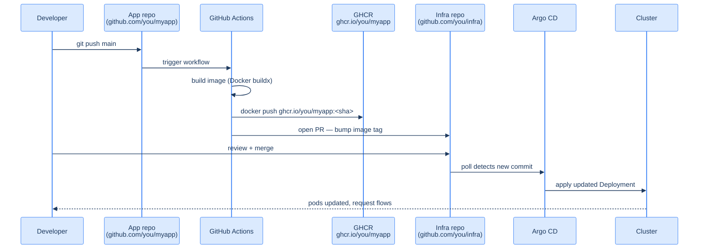

## The full deploy loop



Six minutes from `git push` to running pods in the homelab. The whole pipeline is auditable: the image build is a GitHub Actions log, the manifest change is a PR with a diff, the deploy is a sync in Argo CD's UI.

Why two repos? **Code lives in the app repo, configuration lives in the infra repo.** A PR against the app repo means "I changed the code." A PR against the infra repo means "I changed *what's running.*" Most days you only touch one of them.

## Two repos, two patterns

| Pattern | When | Trade-off |
|---|---|---|
| **Same repo, two paths** (`/src/`, `/deploy/`) | One developer, low ops cadence | Easy to start; harder to give ops-only access later |
| **Two repos** (`myapp`, `infra`) | Anything with reviewers | Clear ownership; PR titles tell you what kind of change it is |
| **Auto-update via Argo Image Updater** | You trust unattended `:latest` deploys | Faster; loses the "manifest PR" review step |

This book uses **two repos with manifest-bumping PRs.** It's the pattern the cluster behind these docs uses, and it pairs cleanly with the GitOps loop from the previous chapter.

### Why GitHub Actions over alternatives

The credible image-builder options for a homelab:

| | **GitHub Actions** | **GitLab CI** | **Drone / Woodpecker** | **Tekton / Argo Workflows** |
|---|---|---|---|---|
| **Where it runs** | GitHub-hosted runners (free for public, generous limits for private) | GitLab-hosted or self-hosted | Self-hosted on your cluster | In your cluster, as Kubernetes-native CRDs |
| **Setup cost** | Zero — `.github/workflows/*.yaml` and you're done | Requires a GitLab account or self-hosted instance | Requires an extra service to run | Requires CRDs + controllers + a UI you'd install separately |
| **Image registry integration** | First-class GHCR; one less account | Built-in registry per project | Anything you wire up | Anything you wire up |
| **Marketplace of actions** | Vast (`docker/build-push-action`, `peter-evans/create-pull-request`, etc.) | Smaller; templates live as YAML you copy | Plugin ecosystem; smaller | None — you write your own steps |
| **Cost** | Free for public repos; 2,000 min/mo free for private | Free tier is generous | Free, runs on your hardware | Free, runs on your cluster |
| **Best for** | A homelab with code in GitHub | A homelab with code in GitLab | "I want CI inside my own cluster" | A platform team building a CI product |

The deciding factor for this homelab: **the source of truth is already on GitHub.** The same account that hosts the infra repo and the app repo has free Actions minutes and a free image registry (GHCR). One platform, one set of credentials, one PR review surface.

If your code lives on GitLab, swap GitHub Actions for GitLab CI — the workflow YAML below is structurally identical, with `.gitlab-ci.yml` in place of `.github/workflows/...`. If you're philosophically opposed to building images outside your cluster, **Tekton + Argo Workflows** is the homelab-native answer; it's also the heaviest of the four options. Don't run it for a single-developer cluster unless you specifically want to learn it.

## The minimal workflow

Drop this into `.github/workflows/build-and-deploy.yaml` in your **app repo**:

```yaml
name: Build and deploy

on:
  push:
    branches: [main]
  workflow_dispatch:

env:
  REGISTRY: ghcr.io
  IMAGE_NAME: ${{ github.repository }}   # e.g. you/myapp

jobs:
  build-and-push:
    runs-on: ubuntu-latest
    permissions:
      contents: read
      packages: write          # GHCR push
    outputs:
      image-tag: ${{ steps.meta.outputs.tags }}
    steps:
      - uses: actions/checkout@v4

      - uses: docker/setup-buildx-action@v3

      - uses: docker/login-action@v3
        with:
          registry: ${{ env.REGISTRY }}
          username: ${{ github.actor }}
          password: ${{ secrets.GITHUB_TOKEN }}

      - id: meta
        uses: docker/metadata-action@v5
        with:
          images: ${{ env.REGISTRY }}/${{ env.IMAGE_NAME }}
          tags: |
            type=sha,prefix=,format=long

      - uses: docker/build-push-action@v5
        with:
          context: .
          push: true
          tags: ${{ steps.meta.outputs.tags }}
          labels: ${{ steps.meta.outputs.labels }}
          cache-from: type=gha
          cache-to: type=gha,mode=max

  bump-manifest:
    needs: build-and-push
    runs-on: ubuntu-latest
    steps:
      - name: Checkout infra repo
        uses: actions/checkout@v4
        with:
          repository: ${{ github.repository_owner }}/infra
          ref: main
          token: ${{ secrets.INFRA_REPO_PAT }}
          path: infra

      - name: Bump image tag
        working-directory: infra/deploy/myapp/overlays/prod
        run: |
          set -euo pipefail
          NEW_TAG="${{ github.sha }}"
          IMAGE="ghcr.io/${{ github.repository }}"

          # Update kustomization image
          (cd . && \
            command -v kustomize >/dev/null 2>&1 || \
              curl -sSL https://raw.githubusercontent.com/kubernetes-sigs/kustomize/master/hack/install_kustomize.sh | bash)
          ./kustomize edit set image "myapp=${IMAGE}:${NEW_TAG}"

      - name: Open PR
        uses: peter-evans/create-pull-request@v6
        with:
          path: infra
          token: ${{ secrets.INFRA_REPO_PAT }}
          branch: bump/myapp-${{ github.sha }}
          base: main
          title: "Bump myapp to ${{ github.sha }}"
          body: |
            Automated bump from app-repo commit ${{ github.sha }}.
            Workflow: ${{ github.server_url }}/${{ github.repository }}/actions/runs/${{ github.run_id }}
          commit-message: "Bump myapp to ${{ github.sha }}"
```

Two jobs:

- **`build-and-push`** — builds the OCI image with the commit SHA as the tag, pushes to GHCR. ~3 minutes for a typical app, faster after caches warm up.
- **`bump-manifest`** — checks out the infra repo, edits the image tag in the kustomization, opens a PR. The PR review is your "do I want this in production right now?" gate.

If you want fully automatic deploys, set the PR to auto-merge:

```yaml
      - name: Auto-merge
        if: success()
        run: |
          gh pr merge --auto --squash --delete-branch \
            --repo ${{ github.repository_owner }}/infra
        env:
          GH_TOKEN: ${{ secrets.INFRA_REPO_PAT }}
```

…but for a homelab the manual review is good practice.

## The PAT

`secrets.INFRA_REPO_PAT` is a Personal Access Token with **`contents: write`** and **`pull-requests: write`** on the infra repo only. Mint a fine-grained PAT in *GitHub → Settings → Developer settings → Fine-grained tokens*, scope it to the single infra repo, set a 90-day expiry. Add it as a repository secret in the *app repo* (not the infra repo).

`secrets.GITHUB_TOKEN` is the auto-generated workflow token; it's fine for pushing to GHCR within the same org/repo.

## What the manifests look like

In your infra repo, `deploy/myapp/overlays/prod/kustomization.yaml`:

```yaml
apiVersion: kustomize.config.k8s.io/v1beta1
kind: Kustomization
namespace: apps
resources:
  - ../../base
  - sealedsecret.yaml

images:
  - name: myapp                                 # ← matches the placeholder in base/deployment.yaml
    newName: ghcr.io/<you>/myapp
    newTag: 7f8b2c3d...                         # ← updated by the workflow
```

`kustomize edit set image myapp=ghcr.io/<you>/myapp:<sha>` is a single command that rewrites this file's `images` block. Diffs read cleanly: one line, one tag.

In `deploy/myapp/base/deployment.yaml`:

```yaml
spec:
  template:
    spec:
      containers:
        - name: myapp
          image: myapp                          # placeholder, replaced by kustomize
          ports:
            - containerPort: 8080
```

The `image: myapp` placeholder is rewritten to `image: ghcr.io/<you>/myapp:7f8b2c3d...` at apply time.

## How Argo CD picks up the change

Argo CD polls every Git repo it tracks every ~3 minutes by default. When the infra repo's `main` advances:

1. Argo CD pulls the new commit.
2. Re-runs `kustomize build` in `deploy/myapp/overlays/prod`.
3. Diffs against the live cluster state. Sees a new image tag in the Deployment.
4. Applies the change.
5. Kubernetes does a rolling update.

To accelerate the loop, configure a **GitHub webhook**:

```
Settings → Webhooks → Add webhook
Payload URL: https://argocd.homelab.example/api/webhook
Content type: application/json
Secret: <some random string>
Events: Just the push event.
```

Add the same secret to Argo CD:

```bash
kubectl -n argocd patch secret argocd-secret --type merge \
  -p '{"data":{"webhook.github.secret":"'"$(echo -n '<your-secret>' | base64)"'"}}'
kubectl -n argocd rollout restart deployment argocd-server
```

Now the deploy loop is "push → 6 seconds → applied" instead of "push → 3 minutes → applied."

## Verify the loop

- Make a one-line change to your app, push to `main`.
- Watch the GitHub Actions tab — `build-and-push` runs, then `bump-manifest`.
- A PR opens against your infra repo. Merge it.
- In Argo CD: the `myapp` Application goes `OutOfSync` for a few seconds, then `Synced`.
- Reload the live URL; your change is there.

## Footguns

- **Tag-based caching.** If you tag images `:latest` instead of `:<sha>`, Kubernetes won't roll because the image reference didn't change. Use the SHA tag.
- **Workflow runs on the wrong branch.** Make sure `on.push.branches: [main]` is set, otherwise feature-branch pushes also trigger deploys.
- **Token expiry.** When the PAT expires, the workflow fails silently (well, loudly in the Actions tab). Calendar reminder for the day it expires.
- **PR floods.** If you push 20 commits in a minute, you get 20 PRs. Squashing onto `main` solves it; or you can debounce with a `concurrency:` block in the workflow.

## What you should have now

- A `.github/workflows/build-and-deploy.yaml` in your app repo
- A successful run that built an image and pushed it to `ghcr.io/<you>/myapp:<sha>`
- A `bump/myapp-<sha>` PR open against your infra repo
- After merging that PR, Argo CD synced the change
- A green Argo CD UI for the `myapp` Application

That closes the loop. Code → image → manifest → cluster, all auditable in Git, all human-reviewable.

→ Next: [PostgreSQL on a pinned node](/cortex/homelab-from-scratch/stateful-services-postgresql-on-a-pinned-node)
