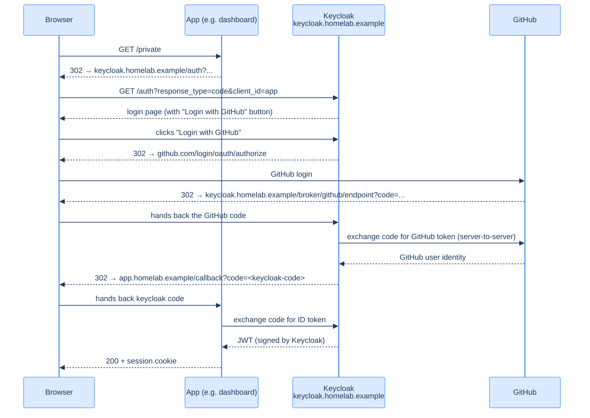

## What an identity plane buys you

When you have one app, hand-rolling auth is fine. When you have three, you start re-implementing the same auth logic three times — and forgetting to keep them in sync.

An identity plane (Keycloak, Authentik, Auth0, Ory, AWS Cognito) is the centralised auth service every app delegates to. Login happens *there*; every app gets a signed token saying "this user is foo, and they have these roles." Users only need one account; you only need to deploy SSO and password reset once.

For a homelab specifically, Keycloak buys:

- **Single sign-on across every app you build.** Whoami, dashboard, internal tooling — all log in the same way.
- **GitHub-as-IdP.** Wire up GitHub OAuth once and any homelab app inherits "log in with GitHub."
- **MFA, password policy, session management** — built in; you turn them on per-realm.
- **OIDC for everything.** Most modern auth proxies (oauth2-proxy, traefik-forward-auth) speak OIDC out of the box. Keycloak is your IdP.

If you don't think you need this yet, you don't. Skip this chapter, come back when your second app is a few weeks away.

## How a request flows through Keycloak



It looks complex; conceptually it's: app delegates to Keycloak, Keycloak delegates to GitHub, GitHub authenticates the user, tokens flow back. The user types their password to GitHub once, every app trusts Keycloak's resulting JWT.

## Sealed Secrets first

Generate two secrets via `kubeseal`: the Keycloak admin credential and the GitHub OAuth client.

```bash
# Admin credential — first-boot superuser, replace immediately after install
ADMIN_USER='admin'
ADMIN_PASS="$(openssl rand -base64 24)"
kubectl create secret generic keycloak-admin-secret \
  --namespace identity \
  --from-literal=username="${ADMIN_USER}" \
  --from-literal=password="${ADMIN_PASS}" \
  --dry-run=client -o yaml | \
kubeseal --cert /tmp/sealed-secrets-cert.pem --format yaml \
  > deploy/keycloak/sealedsecret-admin.yaml

# Database credential — must match the app-DB user from chapter 1 of this section
kubectl create secret generic keycloak-db-secret \
  --namespace identity \
  --from-literal=username='keycloak' \
  --from-literal=password="${APP_DB_PASS}" \
  --dry-run=client -o yaml | \
kubeseal --cert /tmp/sealed-secrets-cert.pem --format yaml \
  > deploy/keycloak/sealedsecret-db.yaml

# GitHub OAuth client (mint at github.com/settings/developers first — see below)
GITHUB_CLIENT_ID='Iv1.abcdef...'
GITHUB_CLIENT_SECRET='paste-here'
kubectl create secret generic keycloak-github-oauth \
  --namespace identity \
  --from-literal=client-id="${GITHUB_CLIENT_ID}" \
  --from-literal=client-secret="${GITHUB_CLIENT_SECRET}" \
  --dry-run=client -o yaml | \
kubeseal --cert /tmp/sealed-secrets-cert.pem --format yaml \
  > deploy/keycloak/sealedsecret-github-oauth.yaml
```

Save `${ADMIN_PASS}` and `${APP_DB_PASS}` and the GitHub client secret to your password manager. Commit only the SealedSecret YAMLs.

## Mint the GitHub OAuth app

Before applying Keycloak, register an OAuth app at GitHub:

1. *github.com → Settings → Developer settings → OAuth Apps → New OAuth App*
2. **Application name**: `Keycloak (homelab)`
3. **Homepage URL**: `https://keycloak.homelab.example`
4. **Authorization callback URL**: `https://keycloak.homelab.example/realms/homelab/broker/github/endpoint`
5. *Register*. Copy the **Client ID** (visible) and click *Generate a new client secret* (visible exactly once — copy it now).

You'll paste these into the SealedSecret. The `realms/homelab` part of the callback URL means the realm name in Keycloak must be `homelab` (or change the URL to match).

## The Keycloak Deployment

The cluster's actual manifest is ~120 lines; the highlights:

```yaml
apiVersion: apps/v1
kind: Deployment
metadata:
  name: keycloak
  namespace: identity
  labels:
    app: keycloak
spec:
  replicas: 1
  selector:
    matchLabels:
      app: keycloak
  template:
    metadata:
      labels:
        app: keycloak
    spec:
      affinity:
        nodeAffinity:                            # don't schedule on the edge
          requiredDuringSchedulingIgnoredDuringExecution:
            nodeSelectorTerms:
              - matchExpressions:
                  - key: kubernetes.io/hostname
                    operator: NotIn
                    values: [ctb-edge-1]
      containers:
        - name: keycloak
          image: quay.io/keycloak/keycloak:26.5.5
          args: [start]
          ports:
            - { name: http,       containerPort: 8080 }
            - { name: management, containerPort: 9000 }
          env:
            - { name: KC_DB,                value: postgres }
            - { name: KC_DB_URL_HOST,       value: postgresql.databases-prod.svc.cluster.local }
            - { name: KC_DB_URL_PORT,       value: "5432" }
            - { name: KC_DB_URL_DATABASE,   value: keycloak }
            - { name: KC_DB_USERNAME,       valueFrom: { secretKeyRef: { name: keycloak-db-secret,    key: username } } }
            - { name: KC_DB_PASSWORD,       valueFrom: { secretKeyRef: { name: keycloak-db-secret,    key: password } } }
            - { name: KC_BOOTSTRAP_ADMIN_USERNAME,
                                            valueFrom: { secretKeyRef: { name: keycloak-admin-secret, key: username } } }
            - { name: KC_BOOTSTRAP_ADMIN_PASSWORD,
                                            valueFrom: { secretKeyRef: { name: keycloak-admin-secret, key: password } } }
            - { name: KC_HOSTNAME,          value: https://keycloak.homelab.example }
            - { name: KC_HOSTNAME_STRICT,   value: "true" }
            - { name: KC_PROXY_HEADERS,     value: xforwarded }    # trust X-Forwarded-* from Traefik
            - { name: KC_HTTP_ENABLED,      value: "true" }        # Traefik does HTTPS, KC does HTTP
            - { name: KC_HEALTH_ENABLED,    value: "true" }
            - { name: GITHUB_CLIENT_ID,     valueFrom: { secretKeyRef: { name: keycloak-github-oauth, key: client-id } } }
            - { name: GITHUB_CLIENT_SECRET, valueFrom: { secretKeyRef: { name: keycloak-github-oauth, key: client-secret } } }
          startupProbe:
            httpGet: { path: /health/ready, port: management }
            periodSeconds: 10
            failureThreshold: 60
          livenessProbe:
            httpGet: { path: /health/live, port: management }
            periodSeconds: 15
```

Lines worth understanding:

- **`KC_PROXY_HEADERS: xforwarded`** — Traefik terminates TLS and forwards plain HTTP with `X-Forwarded-Proto: https`. Keycloak by default ignores those headers; this setting tells it to trust them. Without it, Keycloak issues redirects with `http://` URLs and the OAuth flow breaks.
- **`KC_HTTP_ENABLED: "true"`** — let Keycloak listen on HTTP (port 8080). HTTPS terminates at Traefik.
- **`KC_HOSTNAME_STRICT: "true"`** — Keycloak refuses requests whose Host header doesn't match `KC_HOSTNAME`. Defence against host-header injection.
- **`affinity` nodeAffinity NotIn ctb-edge-1`** — Keycloak doesn't go on the edge. (We don't use a `nodeSelector` because we want it to land on either `wk-1` or `wk-2`, scheduler's choice.)

Plus a Service:

```yaml
apiVersion: v1
kind: Service
metadata:
  name: keycloak
  namespace: identity
spec:
  selector: { app: keycloak }
  ports:
    - { name: http, port: 8080, targetPort: 8080 }
```

And an Ingress:

```yaml
apiVersion: networking.k8s.io/v1
kind: Ingress
metadata:
  name: keycloak
  namespace: identity
  annotations:
    cert-manager.io/cluster-issuer: letsencrypt-prod-dns01
    traefik.ingress.kubernetes.io/router.entrypoints: websecure
    traefik.ingress.kubernetes.io/router.tls: "true"
spec:
  ingressClassName: traefik
  rules:
    - host: keycloak.homelab.example
      http:
        paths:
          - path: /
            pathType: Prefix
            backend:
              service:
                name: keycloak
                port: { number: 8080 }
  tls:
    - hosts: [keycloak.homelab.example]
      secretName: keycloak-homelab-example-tls
```

## First-time setup

1. Apply everything: `kubectl apply -f deploy/keycloak/...`
2. Wait ~2 minutes for the startupProbe to pass — Keycloak's first start is *slow* because it bootstraps the DB schema.
3. Hit `https://keycloak.homelab.example`, log in with the admin credentials.
4. **Change the admin password** (Settings → Account → Password).
5. Create a realm named `homelab`. (The default `master` realm is for Keycloak admin only; never use it for app users.)
6. Inside `homelab` realm: *Identity Providers → Add provider → GitHub*. Paste the client ID and secret. Save.
7. *Realm settings → Login → User registration: Off*. We want the only path to be GitHub login.

You now have a homelab realm that lets users log in via GitHub.

## Adding an app

For each new app:

1. *Clients → Create client → OpenID Connect*. Client ID `myapp`. Save.
2. *Settings → Valid redirect URIs*: `https://myapp.homelab.example/*`
3. *Credentials → Client secret*: copy this; it's the OAuth secret your app uses.
4. In your app, point oauth2-proxy or your Go OIDC library at `https://keycloak.homelab.example/realms/homelab` with this client ID and secret.

Five minutes per app, max.

## Realm export — the backup that matters

Your realm config (clients, identity providers, user federation) is **the** thing to back up. The cluster behind these docs uses a script:

```bash
kubectl -n identity exec -it deployment/keycloak -- \
  /opt/keycloak/bin/kc.sh export \
    --dir /tmp/realm-export \
    --realm homelab

kubectl -n identity cp deployment/keycloak:/tmp/realm-export ~/keycloak-realm-export-$(date +%Y%m%d)
```

The export is a JSON file. Add it to your password manager and offsite backups. To restore:

```bash
kubectl -n identity exec -it deployment/keycloak -- \
  /opt/keycloak/bin/kc.sh import \
    --dir /tmp/realm-export
```

Plus the user-data table from Postgres (`pg_dump --table=user_entity --table=user_attribute --data-only homelab`), if you don't want to lose registered users.

## What you should have now

- An `identity` namespace with three SealedSecrets and a Keycloak Deployment
- `keycloak-0` pod Running, with `1/1 Ready`, on `wk-1` or `wk-2`
- `https://keycloak.homelab.example` serves the Keycloak admin login
- A `homelab` realm with GitHub IdP configured
- A realm export saved off-cluster

Section 8 done. The next section is what to do every day to keep this running, and how to recover when it doesn't.

→ Next: [Quick health check](/cortex/homelab-from-scratch/operate-and-recover/quick-health-check)
