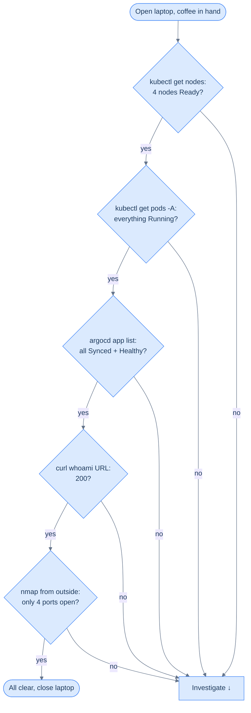

## The 60-second routine



Five checks, ~12 seconds each. If you do this every morning, the homelab stays predictable. If you skip it for a week, you'll have *something* drifting on the day you need to ship a change.

## The five commands

```bash
export KUBECONFIG=~/.kube/homelab.yaml

# 1. Nodes
kubectl get nodes
# All four should be STATUS=Ready

# 2. Pods, all namespaces, anything not Running
kubectl get pods -A | grep -vE 'Running|Completed' || echo "all clean"

# 3. Argo CD apps
argocd app list -o name | xargs -L1 argocd app get -o json | \
  jq -r '"\(.metadata.name)\t\(.status.sync.status)\t\(.status.health.status)"'
# All entries should read: <name>  Synced  Healthy

# 4. The public face
curl -sS -o /dev/null -w '%{http_code}\n' https://whoami.homelab.example
# 200

# 5. From outside (e.g. tether to phone)
nmap -Pn -p 22,53,80,443,4789,6443,10250,30000-32767 198.51.100.25 | grep open
# 22/tcp open
# 80/tcp open
# 443/tcp open
# (UDP 51820 is harder to scan; skip it day-to-day)
```

If any check fails, drop into the matching diagnostic.

## When something fails

### A node is NotReady

```bash
kubectl describe node <name> | head -50
ssh root@<name>
journalctl -u k3s-agent -n 100 --no-pager   # or k3s for ms-1
```

The most common causes:
- WireGuard down on that node — `wg show` shows no recent handshake. `systemctl restart wg-quick@wg0`.
- Disk full on `/var/lib/rancher/k3s` — `df -h`. The local-path-provisioner directory grows quietly.
- Time skew — `timedatectl status`. NTP not running.

### A pod is CrashLoopBackOff

```bash
kubectl describe pod -n <ns> <name>
kubectl logs -n <ns> <name> --previous
```

90% of the time it's "image not found" (typo or registry auth), "config missing" (Secret not applied), or "out of memory" (no resource limits, OOM-killed).

### An Argo CD app is OutOfSync

Click into the app in the UI to see *what's* out of sync — the diff is usually one resource. Possible reasons:
- Someone `kubectl edit`'d something. With `selfHeal=true` set, Argo CD pulls it back automatically; but the OutOfSync window is real.
- The repo's manifest references something that doesn't exist (a SealedSecret deleted in error, a missing ConfigMap).
- A new CRD field shipped in a Kubernetes upgrade and the manifest doesn't have it yet.

`argocd app diff <name>` shows the exact difference.

### `curl whoami.homelab.example` doesn't return 200

The same debug ladder from [Publish whoami](/cortex/homelab-from-scratch/the-edge/publish-whoami) — DNS, TLS, Ingress, Service, pod, in that order. Most often: a worker rebooted and Traefik's connection pool to the Service stalled. `kubectl rollout restart deployment/traefik -n traefik` is the heavy hammer.

### `nmap` shows extra ports open

This is the one that matters most. If port `10250` (kubelet) appears, your edge guardrail dropped. Re-apply it:

```bash
ssh root@vm-1 'systemctl restart homelab-fw-edge.service'
nft list table inet edge_guardrail | head -20    # confirm rules are back
```

If port `6443` (K3s API) appears, the home router is forwarding it — undo that immediately at the router admin page.

## Weekly extras

Once a week, add these to the morning ritual:

```bash
# Disk usage on each node
for n in ms-1 wk-1 wk-2 vm-1; do
  echo "=== $n ==="; ssh root@$n 'df -h / | tail -1'
done

# Cert expiry — should renew at 30 days, ring alarm bells at 7
kubectl get certificates -A -o jsonpath='{range .items[*]}{.metadata.namespace}/{.metadata.name}\t{.status.notAfter}{"\n"}{end}'

# Any pods that have restarted recently
kubectl get pods -A --sort-by=.status.containerStatuses[0].restartCount | tail -10
```

## Monthly extras

```bash
# When did each node last reboot?
for n in ms-1 wk-1 wk-2 vm-1; do
  echo "=== $n ==="; ssh root@$n 'uptime -s'
done

# Are unattended-upgrades actually applying?
ssh root@ms-1 'tail -20 /var/log/unattended-upgrades/unattended-upgrades.log'

# Latest k3s version vs what's installed
kubectl version --short
curl -s https://api.github.com/repos/k3s-io/k3s/releases/latest | jq -r .tag_name
```

If you're more than two K3s minor versions behind, plan an upgrade.

## What the "60 seconds" actually buys you

Everyone sets up a homelab and then doesn't look at it for a month. That's fine — the cluster will keep running. The risk isn't *failure*, it's *quiet failure*: a backup job that's silently failed for three weeks, a renewed cert that expired anyway because the wrong namespace was targeted, a pod that's been OOMing every five minutes since you forgot to set memory limits on Tuesday.

The morning routine catches all of those. It's not about being on top of every metric; it's about noticing that one number is suddenly different from yesterday.

→ Next: [Backups that actually work](/cortex/homelab-from-scratch/operate-and-recover/backups-that-actually-work)
