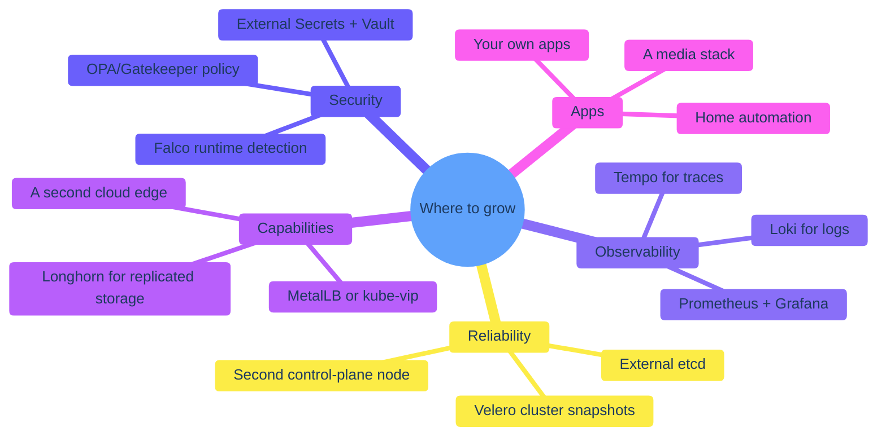

## You're at a baseline

Stop and notice: you have a real Kubernetes cluster, with TLS, GitOps, identity, an automated CI pipeline, sealed secrets, and a recovery runbook. That's already further than 99% of homelabbers get. From here, growth is a series of small additions, each one a chapter you're now equipped to write yourself.

The order to add them in is *not* this diagram. It's: observability first (because you need to see), then reliability (because you'll have outages once you're noticed), then capabilities (because the easy wins compound), then security (because the hardening pays off less per hour than the others, but you should still do it).

## Observability — first thing to add

You currently know "is the cluster up?" via `kubectl`. You don't know "what's slow", "which pods restart most", "did this morning's deploy regress p99 latency". A monitoring stack changes that.

The pragmatic homelab monitoring stack is:

- **Prometheus** — scrapes metrics from every pod that exposes them. Most things in this book do (Traefik, Argo CD, Keycloak, Postgres via the `postgres-exporter` sidecar).
- **Grafana** — pretty graphs of those metrics. Pre-built dashboards exist for everything you've installed.
- **Loki** — logs from every pod, queryable in the same Grafana UI.
- *Optionally:* **Tempo** for distributed traces, **Alertmanager** for actual notifications (PagerDuty, Slack, email).

The Helm chart `kube-prometheus-stack` installs Prometheus + Grafana + Alertmanager in one shot. `loki-stack` adds Loki and Promtail. Two `helm install` commands and a couple of Ingresses, and you've got `https://grafana.homelab.example` with a fully-populated metrics view of the cluster.

Cost: ~1 GB RAM and ~10 GB disk per worker. Worth every byte.

## Reliability — when you start trusting the cluster

After a few months, you'll notice you've started relying on the homelab. Something there will be a thing only it does. That's the moment to start hardening.

- **A second control-plane node.** K3s switches to embedded etcd automatically when you install a second server with `--server https://172.27.15.12:6443`. Now `ms-1` going down doesn't take the apiserver with it.
- **External etcd.** For a third control-plane node and beyond. Embedded etcd is fine up to three; beyond that, run etcd on dedicated nodes.
- **Velero.** Cluster-aware backups: PVCs, CRDs, namespace manifests, all in one go. Stronger than the per-component backups in chapter 9-2; not a replacement, an addition.

Honest take: most homelabs never need a second control-plane. The single-node K3s server has a multi-year MTTR-of-hours uptime story. Don't add this until you've had at least one outage that *would* have been prevented.

## Security — the boring expansion

You already have:
- One public surface (the edge node)
- Strict allowlist firewall on it
- TLS everywhere
- Sealed Secrets for credentials in Git
- Network policies on the database

Next:

- **External Secrets + Vault / Bitwarden / 1Password backend.** Sealed Secrets is fine for a homelab; External Secrets is fine for a multi-team deployment where rotating a credential should not require a Git PR.
- **Falco** — runtime intrusion detection. Logs interesting kernel-level events ("a shell ran inside a Postgres container"). Useful when the homelab is no longer just *yours*.
- **OPA / Gatekeeper or Kyverno** — admission webhooks that enforce policies (no `:latest` tags, no `privileged: true` containers, no `Service: LoadBalancer` outside namespaces you've allowlisted). Worth it when you have multiple deployers.

These are *defensive*. They don't add capability; they reduce the chance that a future change accidentally weakens the cluster.

## Capabilities — the fun additions

- **MetalLB or kube-vip.** Right now your only public ingress is Traefik on the edge. With MetalLB, you can expose a `LoadBalancer` Service inside the home LAN — handy for a Plex server you want family to reach without the cloud-edge round-trip.
- **Longhorn or Rook/Ceph.** Replicated block storage across all three home workers. Means a `PVC` can survive `wk-1` dying. Cost: 3× the storage requirements of any volume you make replicated. Worth it for one or two important PVCs (Postgres' might be the canonical case).
- **A second cloud edge.** With anycast or geo-DNS, you can have one edge in EU and one in US and route users to the closer one. Adds operational complexity; only useful if you have a non-trivial international audience.
- **Service mesh** (Linkerd, Istio). Mostly overkill for a homelab. Linkerd is the only one I'd consider; it's the smallest and least-invasive.

## Apps — the actual point

The reason you built all of this. Some homelab application categories worth installing:

| Category | Example |
|---|---|
| **Code & writing** | Forgejo (self-hosted git), HedgeDoc (collaborative markdown) |
| **Media** | Jellyfin, Immich (photo library), Audiobookshelf |
| **Home automation** | Home Assistant, Frigate (camera AI) |
| **Productivity** | Bitwarden Vaultwarden, NextCloud, n8n (workflow automation) |
| **Just because** | A weather dashboard, a personal blog, an LLM-backed search over your notes |

Each follows the same shape we built up across this book: Deployment + Service + Ingress, optionally a Sealed Secret for credentials, optionally a NetworkPolicy for isolation. Twenty minutes from "I want this" to "it's at `https://x.homelab.example`."

## What this book deliberately doesn't cover

- **Multi-tenancy / many users.** Single-operator homelab assumed throughout.
- **Cloud bursting.** Running spillover workloads in EKS / GKE when the homelab can't keep up.
- **Hybrid identity** with LDAP or SCIM provisioning into Keycloak.
- **Dedicated GPU passthrough** for ML workloads.
- **High-precision time** (PTP / IEEE 1588) for trading-style use cases.

Each of these is covered better elsewhere, and most aren't relevant to a homelab. If you ever need them, you have the foundation to add them on.

## A closing note

The cluster behind these docs (`kakde.eu`) was built incrementally over a year, in evening sessions, by one person. There's nothing in this book that requires more time than a determined weekend. The reason it works in production is not because the architecture is sophisticated — it isn't, deliberately — but because every decision has been made for *understandability* over flair.

If you finish this book and have a working homelab, the deeper goal is met: you know what every layer does, what it costs, what it buys, and how to fix it at 3 a.m. The homelab is the artefact. The understanding is the prize.

Go build something with it.

---

← Back to the [book index](/cortex/homelab-from-scratch).
