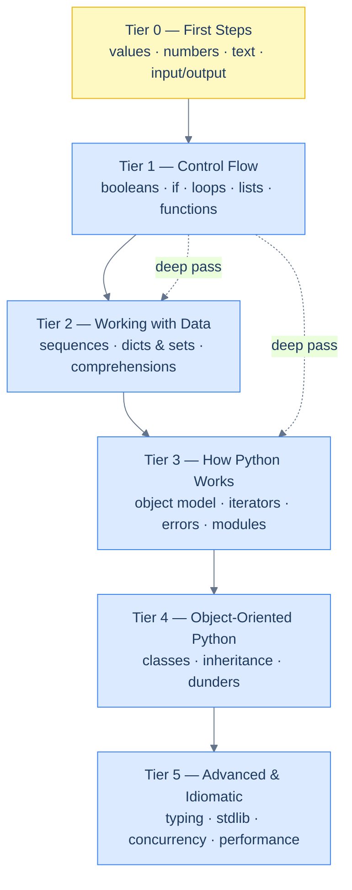

# Python

Most Python tutorials hand you a pile of features and ask you to remember them. This one does the opposite: it finds the **one generative idea** under each topic and shows every rule as a *consequence* of it. You should finish each chapter able to re-derive the rules, not just recite them — and able to predict what a snippet prints before you run it.

The book is a single text, read top to bottom. It starts assuming **you have never written a line of code in any language** and ends on typing, concurrency, and the data model. Early chapters introduce every term before using it; later chapters assume the earlier ones are done and move at a fluent reader's pace. What never changes is the standard of explanation: every claim is backed by code that was actually run, and every rule comes with its cost.

## Reading conventions

- **Every code block with a Run button is real.** Cortex executes it in a sandboxed **Python 3.13** runner — the same one that produced every `Output:` block in this book. Click ▶ Run, edit the code, run it again. The output you see is the output we verified.
- **Blocks without a Run button are deliberate** — short fragments, or snippets shown precisely because they *break*. Their output is still shown and still real.
- **Every chapter is built on a thesis** stated in its first paragraph, and a fixed rhythm: concept → code → verified output → analysis ("what happened") → an **Intuition** box ("why it must be so").

> **How to read the Intuition boxes.** Each one is built in three moves: (1) the **mechanism** — what the interpreter is *actually doing*; (2) a **concrete bite** — a specific, runnable way the naive assumption fails; (3) the **earned rule** — the decision heuristic, now justified rather than asserted, plus its cost.

This note repeats, word for word, at the top of every chapter, so a returning reader can skip it.

---

## The six tiers

The book climbs six tiers. Earlier tiers are prerequisites for later ones; topics that matter most return later at greater depth (the **spiral** — e.g. variables get a gentle pass in Tier 0 and a rigorous "object model" pass in Tier 3, which references back rather than re-teaching).

---

## Curriculum map

**Tier 0 — First Steps** *(zero programming background)* — you run your first program and work with values, numbers, text, and I/O.

1. [What Python Is & Running Code](/cortex/languages/python/first-steps/what-is-python)
2. [Variables & Basic Types](/cortex/languages/python/first-steps/variables-and-types)
3. [Numbers & Arithmetic](/cortex/languages/python/first-steps/numbers-and-arithmetic)
4. [Strings, the Basics](/cortex/languages/python/first-steps/strings-the-basics)
5. [Input & Output](/cortex/languages/python/first-steps/input-and-output)

**Tier 1 — Control Flow** *(beginner)* — make decisions and repeat work; first real programs. *(coming soon)*

6. Booleans, comparisons & logic · 7. Conditionals · 8. Loops · 9. Loop control & patterns · 10. Lists, the basics · 11. Functions, the basics

**Tier 2 — Working with Data** *(early intermediate)* — the core data structures and the comprehensions that operate on them. *(coming soon)*

12. Sequences & the sequence protocol · 13. Dictionaries & sets · 14. Comprehensions · 15. Strings in depth

**Tier 3 — How Python Works Underneath** *(intermediate)* — the mental model that turns "weird" behaviour into predictable behaviour. *(coming soon)*

16. The object model · 17. Iterators, iterables & generators · 18. Functions in depth · 19. Errors & exceptions · 20. Modules, packages & imports · 21. Files & context managers

**Tier 4 — Object-Oriented Python** *(intermediate → advanced)* — model with classes; understand the object system deeply. *(coming soon)*

22. Classes & objects · 23. Class vs instance; encapsulation · 24. Inheritance & `super` · 25. Dunder methods & operator overloading · 26. Properties & descriptors · 27. Advanced OOP

**Tier 5 — Advanced & Idiomatic** *(advanced)* — typing, the standard library, the data model as a whole, concurrency, performance, shipping. *(coming soon)*

28. Type hints & static typing · 29. Standard-library tour · 30. The data model, holistically · 31. Concurrency & the GIL · 32. Async Python · 33. Performance, profiling & memory · 34. Testing, debugging & packaging

---

## Three reading paths

**Path A — Your first programming language ever.** Start at Tutorial 1 and walk straight through. Do not skip; each chapter assumes the one before it. Type every example, then change it and predict the new output before running. Tiers 0–1 are the whole game at first — values, decisions, loops, and functions. Everything after is built on those.

**Path B — You program in another language, new to Python.** Skim Tier 0 for the syntax and the surprises (integer vs true division, `input()` returning a string, immutable strings), then slow down at **Tier 3 — How Python Works**. The object model (names vs objects), iterators, and the function model are where Python differs most from C-family and Java mental models, and where transferred assumptions cause the subtlest bugs.

**Path C — You know Python, filling gaps.** Use the tier map to find your boundary and read forward. The highest-leverage deep passes are the object model (16), iterators & generators (17), functions in depth (18), the data model as a whole (30), and concurrency (31–32).

---

## A note on the runner

Every runnable block executes in an isolated **Python 3.13** sandbox — no setup, no install, nothing to break. Each block runs on its own (state does not carry from one block to the next), so self-contained examples repeat any setup they need. Anonymous runs work; signing in lets you edit-and-run and raises your hourly quota. You do **not** need Python installed locally to read this book — though by Tier 5 you'll want it, and Tutorial 34 shows how to set it up properly.
