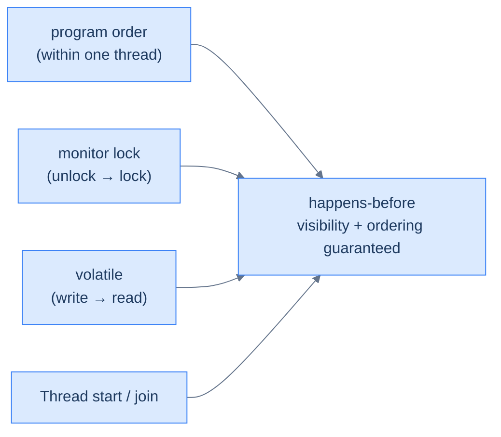

# The Java Memory Model & Performance — Visibility and Speed

Two advanced realities shape correct, fast Java. First, the **Java Memory Model** (JMM): because compilers and CPUs reorder and cache memory for speed, a write by one thread is *not* automatically visible to another. **`volatile`** guarantees visibility (but, crucially, *not* atomicity), and **happens-before** is the precise set of rules that decide when writes are seen — the foundation under [`synchronized`](/cortex/languages/java/advanced/concurrency-the-basics) and [atomics](/cortex/languages/java/advanced/concurrency-high-level-and-virtual-threads). Second, performance: the JVM doesn't run your bytecode the same way forever — it **interprets** it at first, then **JIT-compiles** hot methods to optimized native code, and a **garbage collector** reclaims unused objects in short pauses. You can watch both happen with diagnostic flags. Understanding visibility keeps concurrent code *correct*; understanding the JIT and GC keeps it *fast*.

This is the deep pass of [happens-before](/cortex/languages/java/advanced/concurrency-the-basics). Every output below was produced by running the code; JIT and GC logs are real captured excerpts, **labeled illustrative** because their exact lines and timings vary per run and machine.

> **How to read the Intuition boxes.** Each one is built in three moves: (1) the **mechanism** — what the compiler and the JVM are *actually doing*; (2) a **concrete bite** — a specific, runnable failure (often a real compiler error), shown so the trap is visible; (3) the **earned rule** — the decision heuristic, now justified rather than asserted, plus its cost.

---

## Table of contents

1. [`volatile`: visibility, not atomicity](#1-volatile-visibility-not-atomicity)
2. [happens-before, in depth](#2-happens-before-in-depth)
3. [JIT compilation](#3-jit-compilation)
4. [Garbage collection and tuning](#4-garbage-collection-and-tuning)
5. [Mental-model summary](#5-mental-model-summary)
6. [Gotcha checklist](#6-gotcha-checklist)

---

## 1. `volatile`: visibility, not atomicity

A `volatile` field is always read from and written to main memory, never a stale CPU cache — so one thread's write is *visible* to others. This fixes the "a thread never sees the flag change" bug: here a worker spins until `main` flips a `volatile` flag, and it stops.

```java run
public class Main {
    static volatile boolean running = true;
    public static void main(String[] args) throws InterruptedException {
        Thread worker = new Thread(() -> {
            long count = 0;
            while (running) count++;
            System.out.println("worker saw running=false and stopped");
        });
        worker.start();
        Thread.sleep(100);
        running = false;
        worker.join();
        System.out.println("done");
    }
}
```

**Output:**
```
worker saw running=false and stopped
done
```

**Analysis.** The worker loops on `running`; after 100 ms `main` sets `running = false`, the worker *sees* it (because `volatile` forces a fresh read), exits its loop, and the program ends. Without `volatile`, the worker could keep reading a cached `true` forever — the program would hang. `volatile` established the happens-before edge that made the write visible.

**Intuition.**
*Mechanism.* A `volatile` write flushes to main memory and a `volatile` read fetches from it, with a happens-before edge between them — so a reader after the write is guaranteed to see it (and everything written before it). It prevents the JVM/CPU from caching the field in a register or reordering around it.

*Concrete bite.* `volatile` gives visibility but **not** atomicity — a `volatile` counter's `++` still races:

```java run
public class Main {
    static volatile int counter = 0;
    public static void main(String[] args) throws InterruptedException {
        Thread[] threads = new Thread[4];
        for (int i = 0; i < 4; i++) {
            threads[i] = new Thread(() -> { for (int j = 0; j < 100000; j++) counter++; });
            threads[i].start();
        }
        for (Thread t : threads) t.join();
        System.out.println(counter);
    }
}
```

**Output** *(illustrative — wrong and varying; three real runs printed `154723`, `166782`, `153592`):*
```
154723
```

Even though `counter` is `volatile`, `counter++` is still read-modify-write — and `volatile` makes each *access* visible, not the *trio* atomic. So updates are still lost, just as without `volatile`. Visibility ≠ atomicity: for an atomic counter you need `AtomicInteger` or a lock.

*Earned rule.* Use `volatile` for a single flag or reference that one thread writes and others read (a stop signal, a published configuration); use atomics or locks when you need *atomic* updates. The cost of confusing the two is the bug above — a `volatile` counter that still races; the benefit, used correctly, is cheap, lock-free visibility for the common publish-a-value pattern.

---

## 2. happens-before, in depth

**Happens-before** is the JMM's guarantee: if action A happens-before action B, then A's effects (all its writes) are visible to B. Without such an edge, there's *no* guarantee — B may see stale data. A few rules establish these edges:



**Analysis.** The four common sources of happens-before edges: **program order** (statements in one thread happen-before later ones in that thread); a **monitor unlock** happens-before a later **lock** of the same monitor (why [`synchronized`](/cortex/languages/java/advanced/concurrency-the-basics) publishes writes); a **`volatile` write** happens-before a later **read** of it (§1); and **`Thread.start()`** happens-before the thread's run, while a thread's actions happen-before another's return from **`join()`**. Each is a bridge across which writes are guaranteed visible.

**Intuition.**
*Mechanism.* Happens-before is *transitive*: if A → B and B → C then A → C. So publishing one `volatile` flag after writing several plain fields makes *all* those fields visible to a reader that reads the flag — the flag's happens-before edge carries the earlier writes with it (the "safe publication" idiom).

*Concrete bite.* The relation is the *only* guarantee — two unrelated threads with no edge between them can see each other's writes in any order, or not at all. "It seemed to work" is meaningless; correctness requires an actual happens-before edge, which is why every shared-state access needs `synchronized`, `volatile`, or a `java.util.concurrent` tool.

*Earned rule.* Reason about concurrent correctness in terms of happens-before edges, not intuition about timing: for every shared read, identify the write it must see and the edge that guarantees it. The cost is a more formal mental model; the benefit is the only sound way to know concurrent code is correct — and it explains *why* the synchronization tools work, rather than treating them as magic.

---

## 3. JIT compilation

The JVM runs bytecode by **interpreting** it at first, then **Just-In-Time compiling** methods that run often ("hot") into optimized native code. You can watch it with `-XX:+PrintCompilation`. Here a hot `fib` method gets compiled, then recompiled at a higher optimization tier:

```
$ java -XX:+PrintCompilation Main
...
20    6       3       Main::fib (24 bytes)
20    7       4       Main::fib (24 bytes)
21    6       3       Main::fib (24 bytes)   made not entrant
...
```

**Output** *(illustrative excerpt — exact lines and timings vary every run):*
```
20    6       3       Main::fib (24 bytes)
20    7       4       Main::fib (24 bytes)
21    6       3       Main::fib (24 bytes)   made not entrant
```

**Analysis.** Each line is a compilation event: a timestamp (ms), a compile id, a **tier** (3 = the C1 compiler, quick; 4 = C2, fully optimized), and the method. `fib` was first compiled at tier 3, then — once it proved *very* hot — recompiled at tier 4, and the tier-3 version was "made not entrant" (retired in favor of the faster one). This is why Java *warms up*: the same code runs faster after the JIT has compiled and optimized its hot paths, which is why micro-benchmarks must warm up before measuring.

**Intuition.**
*Mechanism.* The JVM profiles execution counts and branch behavior while interpreting, then compiles hot methods — applying inlining, loop optimizations, and speculative optimizations based on the observed profile. If an assumption is later violated, it *deoptimizes* back to the interpreter and recompiles ("made not entrant").

*Concrete bite.* This makes naive timing lie: the first thousand calls to a method run interpreted and slow; later calls run optimized and fast. Timing a method "once" measures interpretation, not steady-state performance — which is why you warm up (run it many times) before measuring, and why a real benchmark uses a harness like JMH.

*Earned rule.* Trust the JIT to optimize hot code, and warm up before measuring performance; don't hand-optimize cold paths the JIT will never compile, or micro-optimize based on un-warmed timings. The cost is that performance is dynamic and hard to predict from source alone; the benefit is that idiomatic, readable code usually runs fast once hot — the JIT rewards clarity over premature cleverness.

---

## 4. Garbage collection and tuning

Java manages memory automatically: a **garbage collector** reclaims objects no longer reachable, so you never `free`. Modern collectors are **generational** — most objects die young, so the GC scans a small "young" region frequently and cheaply. Watch it with `-Xlog:gc` on a program that allocates a lot of short-lived arrays:

```
$ java -Xlog:gc Main
[0.022s][info][gc] GC(0) Pause Young (Normal) (G1 Evacuation Pause) 24M->1M(516M) 0.725ms
[0.056s][info][gc] GC(1) Pause Young (Normal) (G1 Evacuation Pause) 300M->1M(516M) 0.536ms
[0.068s][info][gc] GC(2) Pause Young (Normal) (G1 Evacuation Pause) 300M->1M(516M) 0.506ms
...
allocated 2000 MB of garbage
```

**Output** *(illustrative excerpt — counts, sizes, and pause times vary per run):*
```
[0.056s][info][gc] GC(1) Pause Young (Normal) (G1 Evacuation Pause) 300M->1M(516M) 0.536ms
```

**Analysis.** The program allocated ~2 GB of 1 MB arrays, but they're immediately garbage, so the GC reclaimed them in many tiny pauses. Read one line: **G1** (the default collector since JDK 9) ran a **Young** collection, reclaiming the young generation from `300M` down to `1M` (almost all of it was garbage), out of a `516M` heap, in **0.536 ms**. The heap never grew toward 2 GB because the collector kept recycling the same space. Sub-millisecond pauses for hundreds of MB is why automatic memory management is practical.

**Intuition.**
*Mechanism.* The heap is split into generations; new objects go in the young gen, which fills and is collected quickly (survivors are promoted). Because the [object lifetime](/cortex/languages/java/classes-and-objects/references-equality-and-the-object-model) hypothesis holds — most objects die young — young collections touch little live data and are fast. `-Xmx`/`-Xms` size the heap; `-XX:+UseZGC` (or others) selects a collector tuned for low pause times.

*Concrete bite.* Automatic GC doesn't mean "no memory bugs": a **memory leak** in Java is unintended *reachability* — objects you forgot to remove from a `static` collection or cache stay reachable, so the GC can't reclaim them, and the heap grows until `OutOfMemoryError`. The GC frees the *unreachable*; keeping a reference alive defeats it.

*Earned rule.* Let the GC manage memory and tune only when profiling shows a problem — size the heap (`-Xmx`), pick a collector for your latency/throughput goals, and use a profiler (JFR/`jcmd`, async-profiler) to find real allocation and pause hot spots. The cost of premature GC tuning is wasted effort on a system that's usually fine by default; the benefit of knowing the model is that when a leak or pause problem *does* appear, you can read the logs and fix the actual cause.

---

## 5. Mental-model summary

| Principle | Consequence |
|---|---|
| `volatile` guarantees visibility, not atomicity | A `volatile` flag is seen across threads; a `volatile` counter's `++` still races |
| happens-before edges (program order, lock, volatile, start/join) decide visibility | No edge → no guarantee; the relation is transitive (safe publication) |
| The JVM interprets, then JIT-compiles hot methods to native | Code warms up — measure steady state, not the first cold calls |
| A generational GC reclaims young garbage in short pauses | Most objects die young; sub-ms pauses make automatic memory practical |
| GC frees the unreachable; reachable objects leak | A forgotten reference in a `static` collection grows the heap to `OutOfMemoryError` |

## 6. Gotcha checklist

- **A thread never sees a flag change (spins forever) →** the field isn't `volatile` (or under a lock); make it `volatile` for visibility.
- **A `volatile` counter is still wrong →** `volatile` isn't atomic; use `AtomicInteger` or `synchronized` for `++`.
- **Concurrent code "works" but you can't say why →** there's no happens-before edge; add `synchronized`/`volatile`/`j.u.c` and reason about edges.
- **A micro-benchmark shows wildly different times →** un-warmed JIT; warm up (or use JMH) before measuring steady-state performance.
- **The heap grows until `OutOfMemoryError` →** a memory leak via reachability (a `static` cache/collection you never clear); drop the references or bound the cache.

---

*Predict, then check.* Predict whether making a shared `int counter` `volatile` is enough for four threads to increment it to exactly the right total — and why. Next, explain in terms of happens-before why writing several plain fields and then setting a `volatile` `ready = true` lets a reader that sees `ready == true` also see those fields. Finally, predict what `-XX:+PrintCompilation` shows about a method called 10 times versus 10 million times, and why a benchmark must warm up.

## Your Turn

Before you move on, check your understanding with the coach — explain the idea, apply it, weigh the trade-offs, then defend your reasoning.

<div class="concept-coach"></div>
