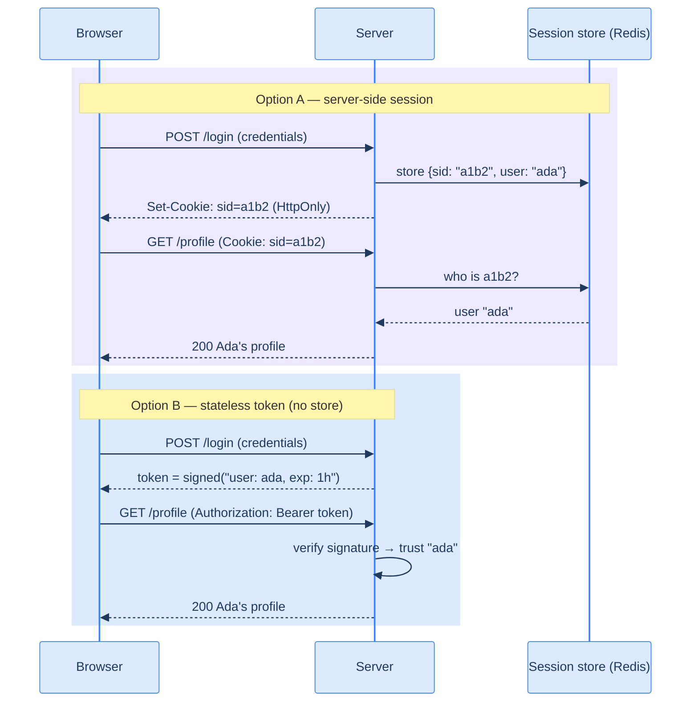

# 3. How a server remembers you: sessions, cookies, tokens

## TL;DR

> HTTP is **stateless**: each request arrives with no memory of the last. To stay "logged in," the client must attach a small piece of identity to *every* request. Two designs dominate. A **server-side session** stores your identity in the server's memory and gives your browser a meaningless **cookie** that points to it. A **stateless token** (like a JWT) carries your identity *inside itself*, signed so the server can trust it without looking anything up. The first is easy to revoke but hard to scale; the second scales effortlessly but is hard to revoke. Cortex uses the second — and the rest of this Part is, ultimately, about that token.

## 1. Motivation

Open your browser's dev tools, go to the Network tab, and click around any logged-in website. Every single request — every click, every image, every API call — carries a header that re-identifies you. Strip that header out and the server instantly forgets who you are; you're a stranger again.

Why? Because **HTTP has no memory.** The protocol was designed in 1991 to fetch documents: you ask for a page, the server sends it, the conversation ends. There is no built-in notion of "the same person came back." Each request is a blank slate.

This is a feature, not a bug — statelessness is *why* the web scales to billions of users. But it creates an obvious problem: if the server forgets you after every request, how do you stay logged in across a hundred clicks? You can't re-type your password every time. *Something* has to travel with each request to say "it's still me."

That something is the heart of session management, and getting it wrong is how sessions get hijacked.

## 2. Intuition (Analogy)

You arrive at a theme park and buy a day pass. Now you want to ride twenty rides without buying a ticket each time. The park has two ways to remember you:

**Option A — the coat check ticket.** They take your details, file them in a big ledger behind the counter, and hand you a numbered claim ticket: `#4471`. At every ride, you show `#4471`; the operator radios the front desk, who looks up `#4471` in the ledger and says "yep, valid day pass." The ticket itself means *nothing* — it's just a pointer into the park's records. To cancel your pass, the park crosses out `#4471` in the ledger and instantly every ride rejects it.

**Option B — the festival wristband.** They snap a tamper-proof wristband on you that says, right on it, "Day Pass · Adult · valid June 13" with a holographic seal that can't be forged. Now every ride just *looks at the wristband* — no radio call, no ledger lookup. The wristband *is* the proof. It's faster and the front desk can be asleep. But to cancel it before the day ends, they'd have to physically find you and cut it off — there's no ledger to cross out.

| | Option A: claim ticket | Option B: wristband |
|---|---|---|
| Web equivalent | **Server-side session** + session-id cookie | **Stateless token** (JWT) |
| What the client holds | A meaningless pointer (`#4471`) | A self-describing, signed credential |
| To verify | Look it up in shared server storage | Check the signature — no lookup |
| To revoke | Cross it out (instant) | Hard — wait for it to expire |
| Scales to many servers? | Only if they share the ledger | Yes, trivially — any server can verify |

Neither is "better." They trade **easy revocation** against **easy scaling**, and that trade-off is the entire engineering decision.

## 3. Formal Definition

Three terms, precisely:

- A **cookie** is a small key–value string a server asks the browser to store (via the `Set-Cookie` response header) and send back on every subsequent request to that site (via the `Cookie` request header). A cookie is just a *transport mechanism* — it can carry either a session id or a token. Important security flags: `HttpOnly` (JavaScript can't read it, blunting XSS theft), `Secure` (only sent over HTTPS), and `SameSite` (limits cross-site sending, blunting CSRF).

- A **server-side session** is identity state (who you are, when you logged in) stored *on the server*, keyed by an opaque **session id**. The browser holds only the session id (usually in a cookie). Verifying a request means **looking up** the session id in shared storage (a database, Redis, …).

- A **stateless token** carries the identity *inside the token itself*, protected by a cryptographic **signature**. The server verifies a request by **checking the signature** — no storage lookup required. The dominant format is the **JWT** (JSON Web Token), which we dissect in Group 3.

> The pivotal difference: a session id is a **reference** ("look me up"); a token is a **value** ("here is the answer, signed"). References are easy to invalidate and easy to keep small but require shared storage. Values scale beautifully but, once handed out, are believed until they expire.

## 4. Worked Example

Watch the same login produce two very different "memory" mechanisms.



In Option A, the profile request triggers a *database round-trip* to resolve the session id. In Option B, the server resolves your identity by doing local cryptographic math on the token — no other system is consulted. Multiply that by millions of requests per second and you can feel why large, multi-server systems lean toward tokens: any server, in any region, can verify a token *alone*.

**This is exactly what Cortex does.** When you run code on this site, your browser sends `Authorization: Bearer <token>`. The Cortex server verifies the token's signature against Keycloak's public key and trusts the identity inside — without calling Keycloak. (Group 5 reads the real code that does this.)

## 5. Build It

Run this. It implements both schemes so you can see the structural difference — and the revocation trade-off — in code.

```python run
import hmac, hashlib, base64, json, time

SECRET = b"server-signing-key"  # in real life this is a private key; see Group 3


# ---------- Option A: server-side session ----------
SESSION_STORE = {}  # the "ledger" — lives on the server

def login_session(user):
    sid = base64.urlsafe_b64encode(hashlib.sha256(f"{user}{time.time()}".encode()).digest())[:12].decode()
    SESSION_STORE[sid] = {"user": user, "login_at": time.time()}
    return sid  # this opaque string is all the browser gets

def verify_session(sid):
    rec = SESSION_STORE.get(sid)          # <-- a LOOKUP is required
    return rec["user"] if rec else None

def revoke_session(sid):
    SESSION_STORE.pop(sid, None)          # instant, total revocation


# ---------- Option B: stateless signed token ----------
def b64(b): return base64.urlsafe_b64encode(b).rstrip(b"=").decode()

def issue_token(user, ttl=3600):
    body = b64(json.dumps({"user": user, "exp": time.time() + ttl}).encode())
    sig  = b64(hmac.new(SECRET, body.encode(), hashlib.sha256).digest())
    return f"{body}.{sig}"                 # the token CARRIES the identity

def verify_token(token):
    body, sig = token.split(".")
    expected = b64(hmac.new(SECRET, body.encode(), hashlib.sha256).digest())
    if not hmac.compare_digest(sig, expected):
        return None                        # signature forged
    claims = json.loads(base64.urlsafe_b64decode(body + "=="))
    if time.time() > claims["exp"]:
        return None                        # expired
    return claims["user"]                  # NO lookup — verified locally


# ---- Session: revocable ----
sid = login_session("ada")
print("session verify:", verify_session(sid))   # ada
revoke_session(sid)
print("after revoke:  ", verify_session(sid))    # None — instantly killed

# ---- Token: self-contained, but not revocable ----
tok = issue_token("ada", ttl=3600)
print("token verify:  ", verify_token(tok))      # ada — and we never touched any store
print("forged token:  ", verify_token(tok[:-2] + "xx"))  # None — signature check fails
```

**Now break it.** There is no `revoke_token()` function — try to write one. You'll discover you *can't*, not without adding a store of revoked tokens… which re-introduces the very lookup that made tokens attractive. That tension (short-lived access tokens + refresh tokens) is solved in Group 2. Feel the problem now.

## 6. Trade-offs & Complexity

| Axis | Server-side session | Stateless token (JWT) |
|---|---|---|
| Verify cost | A storage lookup per request | Local signature check |
| Horizontal scaling | Needs shared/sticky session storage | Any node verifies alone |
| Revocation | Instant (delete the record) | Hard — must wait for expiry or keep a denylist |
| Token/cookie size | Tiny (just an id) | Larger (carries claims) |
| Leak blast radius | Bounded — revoke it | Lasts until expiry |
| Best when | You need instant logout / small trusted cluster | You have many services / regions |

The honest summary: **sessions optimize for control, tokens optimize for scale.** Most modern systems (Cortex included) choose tokens and *manage* the revocation weakness by keeping access tokens short-lived (minutes) and refreshing them — so a leaked token is a small, temporary problem.

## 7. Edge Cases & Failure Modes

- **XSS steals tokens in `localStorage`.** If JavaScript can read your token, a single injected script exfiltrates it. `HttpOnly` cookies defend against this; tokens in JS memory must be guarded by never having XSS in the first place.
- **CSRF rides your cookie.** Because browsers attach cookies automatically, a malicious site can trigger authenticated requests *as you*. `SameSite` cookies and anti-CSRF tokens defend against this. (Bearer-token-in-header schemes are naturally CSRF-resistant, since the attacker can't set your `Authorization` header.)
- **The un-revocable token.** Fire someone, and their JWT still works until it expires. Mitigation: short lifetimes + a refresh step that *can* be cut off.
- **Clock skew.** Token expiry is checked against the verifier's clock. If servers' clocks drift, valid tokens get rejected or expired ones accepted. (We'll see Cortex's verifier handle this.)

## 8. Practice

> **Exercise 1 — Pick a design.** For each system, choose session or token and justify in one sentence: (a) a banking app that must support instant "log out everywhere"; (b) a globally distributed API with 50 stateless servers; (c) a tiny internal tool with one server and ten users.

<details>
<summary><strong>Answer</strong></summary>

The §6 axis: **sessions optimize for control (instant revocation); tokens optimize for scale (no per-request lookup).** Match each system to the property it needs most.

- **(a) Banking app, instant "log out everywhere" — server-side session.** Revocation is the hard requirement: deleting the session record (or all of a user's records) kills access *immediately*, which a stateless token can't do without an expiry wait or a denylist. Control beats scale here.
- **(b) Globally distributed API, 50 stateless servers — stateless token (JWT).** Any node in any region must verify a request *alone*, with no shared session store to consult; a self-describing signed token gives exactly that. (You manage the weak revocation with short access-token lifetimes — §6.)
- **(c) Tiny internal tool, one server, ten users — server-side session.** With one server there's no shared-storage problem and the scaling advantage of tokens is irrelevant, so you take the simpler model that also gives you free instant logout. (Either works; sessions are the lower-complexity default at this size.)

The decision is never "which is better" — it's "which side of the revocation-vs-scale trade does *this* system land on."

</details>

> **Exercise 2 — Read your own cookies.** Open dev tools on a site you're logged into. Find the session/auth cookie. Is it `HttpOnly`? `Secure`? `SameSite`? Write down what each flag is protecting against.

<details>
<summary><strong>Answer</strong></summary>

Whatever the specific cookie you found, the three flags (§3) each close one attack:

- **`HttpOnly`** — makes the cookie unreadable to JavaScript (`document.cookie` can't see it). It protects against **XSS token/session theft**: even if an attacker injects a script, it can't exfiltrate the cookie. A session/auth cookie *should* have this set.
- **`Secure`** — the browser only sends the cookie over **HTTPS**, never plain HTTP. It protects against **network eavesdropping** — a man-in-the-middle on an unencrypted connection can't capture the cookie.
- **`SameSite`** (`Lax` or `Strict`) — limits whether the cookie is attached to *cross-site* requests. It protects against **CSRF**: because browsers normally send cookies automatically, a malicious third-party site could otherwise trigger authenticated requests *as you* (§7); `SameSite` stops the cookie riding along on those cross-site calls.

If your cookie is missing one — e.g. an auth cookie without `HttpOnly` — that's a real weakness: a single XSS bug would then hand the session straight to an attacker. (Note a bearer-token-in-`Authorization`-header scheme sidesteps CSRF entirely, since the attacker can't set your header — §7.)

</details>

> **Exercise 3 — The revocation gap.** A company uses 1-hour JWTs with no denylist. An employee is fired at 2:00 PM. Until when, worst case, can their token still access the API? What two changes would shrink that window, and what does each cost?

<details>
<summary><strong>Answer</strong></summary>

**Worst case: until ~3:00 PM.** If the employee was issued a fresh 1-hour token at 2:00 PM (the instant before being fired), it stays valid for its full hour — a stateless token is *believed until it expires* (§3), and with no denylist there's nothing to cut it off. This is the "un-revocable token" failure mode (§7): the JWT keeps working after the person is gone.

Two changes shrink the window, each with a cost:

- **Shorten the token lifetime** (e.g. 1 hour → 5 minutes). The exposure window drops from ~60 min to ~5 min. *Cost:* far more frequent refreshes — more load on the authorization server and a refresh round-trip every few minutes.
- **Add a revocation mechanism — a denylist** (or revoke the **refresh token** so no new access tokens can be minted). This can cut access *immediately* for a known-bad token. *Cost:* you reintroduce a **per-request lookup** (the denylist check) — the exact shared-storage dependency that made stateless tokens attractive in the first place (§3) — or, if you only revoke the refresh token, you still wait out the current access token's short life.

This is the Chapter's central trade-off in miniature: you buy faster revocation by giving back some of the scale/statelessness that tokens were chosen for. The standard production answer (Group 2) is short access tokens **plus** a revocable refresh token — small window, cheap verification.

</details>

```quiz
{
  "prompt": "Cortex sends `Authorization: Bearer <jwt>` on each API call and the server verifies it by checking a signature, with no per-request database lookup. Which property is Cortex therefore trading AWAY?",
  "input": "Choose one:",
  "options": [
    "Instant revocation of a single token",
    "The ability to scale across many servers",
    "Protection of the password",
    "Statelessness of HTTP"
  ],
  "answer": "Instant revocation of a single token"
}
```

## In the Wild

- **[MDN — Using HTTP cookies](https://developer.mozilla.org/en-US/docs/Web/HTTP/Cookies)** — the definitive, readable reference on cookies and their security flags (`HttpOnly`, `Secure`, `SameSite`).
- **[OWASP Session Management Cheat Sheet](https://cheatsheetseries.owasp.org/cheatsheets/Session_Management_Cheat_Sheet.html)** — how sessions get hijacked and how to defend them, from the people who catalogue web attacks.
- **[The Copenhagen Book — Sessions](https://thecopenhagenbook.com/sessions)** — a modern, opinionated, beautifully-written guide to session and token auth that pairs well with this chapter.

---

**Next:** we have the *why* (delegated authorization) and the *how-to-remember* (tokens). Now we build the protocol itself. Meet the four characters whose interaction *is* OAuth 2.0. → [4. The four actors and the valet key](/cortex/production-engineering/iam-keycloak-oauth/oauth2-from-first-principles/the-four-actors)
