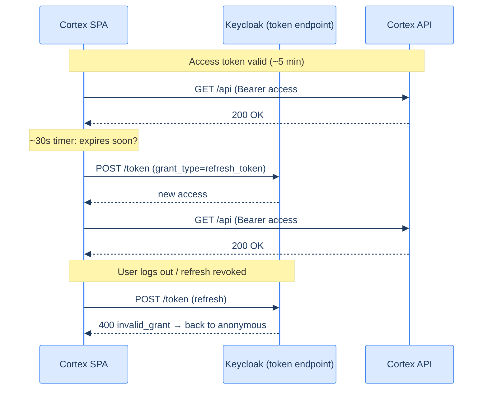

# 7. Access tokens, refresh tokens, scopes & consent

## TL;DR

> The token endpoint usually returns **two** tokens. The **access token** is the working credential you attach to API calls — deliberately **short-lived** (minutes) so a leak self-heals. The **refresh token** is **long-lived** and does only one thing: quietly obtain fresh access tokens without making you log in again. **Scopes** fence in what a token may do (least privilege), and your **consent** is what authorized those scopes in the first place. This two-token design is how Cortex resolves the revocation-vs-scale tension from Chapter 3 — and why your session silently refreshes every 30 seconds.

## 1. Motivation

Chapter 3 left us with a dilemma. Stateless tokens scale beautifully but can't be revoked instantly; the workaround was "keep them short-lived." But a token that expires in five minutes would log you out every five minutes — unusable.

The two-token design threads this needle. Give out an **access token** that expires fast (so a leak is a small, temporary problem) *and* a **refresh token** that can mint new access tokens silently (so the user never notices). The access token is the cash in your pocket — lose it, you lose a little. The refresh token is the bank card in your safe — used rarely, guarded carefully, and **cancellable**. Now you get the scale of stateless tokens *and* a revocation lever, by revoking the refresh token.

## 2. Intuition (Analogy)

A multi-day music festival:

- The **wristband** gets you through every gate today. It's checked constantly, by everyone, with no phone call to the box office — fast and stateless. But it's only good for **today**; tomorrow it's a worthless strip of fabric. That's the **access token**.
- The **box-office receipt** in your bag is checked by *nobody* at the gates. Its only power is that each morning you show it at one window and get *tomorrow's* wristband. That's the **refresh token** — long-lived, used rarely, at one trusted place.
- Your **ticket tier** (General / VIP / Backstage) is printed on the wristband and limits which areas you may enter. That's **scope**.
- When you bought the ticket, you **agreed** to those terms. That's **consent**.

If you lose today's wristband, you're mildly inconvenienced until it expires at midnight. If you lose the receipt, the festival can void *it* at the box office so nobody can mint new wristbands from it — without reissuing everyone else's. Two tokens, two risk profiles, one smooth experience.

## 3. Formal Definition

| Token / concept | What it is | Lifetime | Where it's used |
|---|---|---|---|
| **Access token** | A bearer credential proving an authorized identity + scopes. Often a JWT. | Short (seconds–minutes) | Sent to the **Resource Server** as `Authorization: Bearer …`. |
| **Refresh token** | An opaque credential whose only power is to obtain new access tokens. | Long (hours–days), revocable | Sent only to the AS **token endpoint**, never to APIs. |
| **ID token** (OIDC) | A token *about the user* (who they are). | Short | Read by the **client** to learn the user's identity. (Group 3.) |
| **Scope** | A space-delimited list of permissions the token grants. | — | Requested by the client, approved by the user, enforced by the RS. |
| **Consent** | The user's explicit approval of the requested scopes. | — | Shown by the AS before issuing tokens. |

Two rules worth memorizing:

> **A bearer token is "whoever holds it, is it."** There's no further proof of possession by default — so guard tokens like cash, prefer short lifetimes, and always use HTTPS.
>
> **Scopes are least privilege for tokens.** Request the narrowest set that does the job. A token scoped `contacts:read` can't send mail even if stolen.

## 4. Worked Example — the refresh loop

Here's the lifecycle, and it's *exactly* what Cortex's SPA does. `keycloak-js` arms a timer that calls `updateToken(60)` every 30 seconds: "if the access token expires within 60 seconds, use the refresh token to get a new one." You stay signed in for hours without a single extra login — until the refresh token itself lapses or is revoked.



This is the Chapter 3 trade-off, solved: the API only ever does cheap, stateless signature checks (scale), while logout works by killing the refresh token at Keycloak (revocation). The access token's short life bounds the damage in between.

## 5. Build It

Run this. It models access-token expiry and the refresh that hides it — then shows what revocation does.

```python run
import time

ACCESS_TTL = 2          # pretend "minutes" are 2 seconds so we can watch it expire
refresh_valid = True    # the AS can flip this to revoke

class Session:
    def __init__(self):
        self.access_exp = time.time() + ACCESS_TTL

    def call_api(self):
        if time.time() < self.access_exp:
            return "200 OK"
        return "401 — access token expired"

    def maybe_refresh(self):
        # The SPA's 30s timer: refresh if the access token is near/over expiry.
        if time.time() >= self.access_exp - 0.5:
            if not refresh_valid:
                return "LOGGED OUT — refresh token revoked"
            self.access_exp = time.time() + ACCESS_TTL
            return "refreshed → new access token"
        return "still valid, no refresh needed"

s = Session()
print("t0  call:", s.call_api())            # 200
time.sleep(ACCESS_TTL + 0.1)
print("t+ call:", s.call_api())             # 401 — expired
print("    refresh:", s.maybe_refresh())     # refreshed
print("t+ call:", s.call_api())             # 200 again — user noticed nothing

# ---- Now revoke the refresh token (user logs out) ----
refresh_valid = False
time.sleep(ACCESS_TTL + 0.1)
print("after revoke, refresh:", s.maybe_refresh())  # LOGGED OUT
```

**Now break it.** Set `ACCESS_TTL = 100` and re-run. The access token never expires during the demo, so `maybe_refresh()` always says "still valid." That's the tuning dial: long-lived access tokens mean fewer refreshes but a *bigger* window where a leaked token still works. Short-lived means more refreshes but a smaller blast radius. Cortex picks short.

## 6. Trade-offs & Complexity

| Choice | If too short | If too long |
|---|---|---|
| **Access token lifetime** | Constant refreshing, more load on the AS | A leaked token works for longer — bigger blast radius |
| **Refresh token lifetime** | Users re-login often (annoying) | A stolen refresh token grants near-permanent access |
| **Refresh token rotation** | More moving parts to implement | Without it, a leaked refresh token is reusable indefinitely |
| **Scope breadth** | App breaks when it needs a missing permission | Over-privileged token; bigger damage if stolen |

The sweet spot most systems land on: access tokens of a few minutes, refresh tokens of hours-to-days **with rotation** (each use issues a new refresh token and invalidates the old), and the narrowest scopes that work. Keycloak makes all of these realm settings.

## 7. Edge Cases & Failure Modes

- **Refresh token theft.** It's the crown jewel. Defenses: store it carefully, **rotate** it on each use, and detect reuse of an old (already-rotated) refresh token as a breach signal.
- **Sending the refresh token to an API.** Never. It goes only to the AS token endpoint. An API should only ever see *access* tokens.
- **Scope creep.** Apps tend to request more scopes "just in case." Each extra scope is extra damage if breached and extra reason for users to distrust the consent screen.
- **Consent fatigue.** Ask for too much and users rubber-stamp it (or bounce). Least privilege is also good UX.

## 8. Practice

> **Exercise 1 — Two tokens, two jobs.** In one sentence each, state what the access token is for, what the refresh token is for, and why they have different lifetimes.

<details>
<summary><strong>Answer</strong></summary>

- **Access token — the working credential you attach to every API call** (`Authorization: Bearer …`) to prove an authorized identity and scopes to the Resource Server.
- **Refresh token — a single-purpose credential, sent only to the AS token endpoint,** whose *only* power is to silently obtain fresh access tokens without making you log in again.
- **Why different lifetimes:** the access token is deliberately **short-lived** (minutes) so that a leak self-heals quickly — it's "cash in your pocket," low value, used constantly; the refresh token is **long-lived but revocable** ("the bank card in your safe"), used rarely at one trusted place, so killing it is how logout/revocation works. The two lifetimes together resolve the Chapter 3 tension: short access tokens give *scale* (cheap stateless verification, small blast radius) while the revocable refresh token gives *control*.

</details>

> **Exercise 2 — Tune the dial.** A bank and a blog both use OAuth. Recommend an access-token lifetime for each and justify the difference in terms of blast radius vs. user friction.

<details>
<summary><strong>Answer</strong></summary>

The §6 trade-off: a *shorter* access token means a smaller blast radius if it leaks, paid for with *more frequent refreshes* (load + complexity); a *longer* one is smoother but a stolen token works for longer.

- **Bank — very short, ~5 minutes (or less).** The blast radius of a stolen access token is catastrophic (it can move money), so you minimize the window in which a leaked token is usable, and accept the extra refresh traffic — that cost is trivial next to the consequence of a breach. (You'd also pair it with short refresh-token lifetimes and rotation, and step-up auth for sensitive actions.)
- **Blog — longer, e.g. 30–60 minutes.** The worst a stolen token can do is read or post comments; the damage is low, so you tilt toward **user friction** and reduce refresh chatter by letting tokens live longer. The leak window matters little when nothing valuable is behind it.

The principle: tune the access-token lifetime to the **value of what the token protects** — high stakes buy a short window with frequent refreshes; low stakes buy a long window with fewer refreshes.

</details>

> **Exercise 3 — Scope a real request.** Cortex's API meters code execution per user. What's the *minimum* a token needs to carry for the API to (a) identify the user and (b) allow running code? Which OIDC claim gives (a)? (Peek ahead to Group 3 if needed.)

<details>
<summary><strong>Answer</strong></summary>

The two jobs map to two distinct things a token must carry — and per *least privilege* (§3), nothing more:

- **(a) Identify the user — a stable, opaque subject identifier.** The OIDC claim is **`sub`** (subject): a durable, unique id for the principal, the right thing to key a per-user rate-limit budget on. (It's stable and opaque — unlike a username or email, which can change or be recycled, as Chapter 1 §7 warns.)
- **(b) Allow running code — the single scope that authorizes that action**, e.g. `code:run` (the scope the four-actor model used in Chapter 4). The Resource Server checks the token *carries* that scope before executing — the authZ decision, kept separate from the authN identity.

So the **minimum** is: a valid (signed, unexpired) access token whose claims include **`sub`** (to attribute the run to a user) and the **`code:run`** scope (to permit the action). Anything beyond that — extra scopes, profile fields the API doesn't use — is scope creep and just enlarges the blast radius if the token leaks (§7).

</details>

```quiz
{
  "prompt": "Why does the refresh token exist, given that the access token already proves identity?",
  "input": "Choose one:",
  "options": [
    "To silently obtain new short-lived access tokens, giving scale (stateless access tokens) AND revocation (kill the refresh token) at once",
    "To encrypt the access token",
    "To store the user's password for re-login",
    "To prove the access token to the API a second time"
  ],
  "answer": "To silently obtain new short-lived access tokens, giving scale (stateless access tokens) AND revocation (kill the refresh token) at once"
}
```

## Your Turn

Before you move on, check your understanding with the coach — explain the idea, apply it, weigh the trade-offs, then defend your reasoning.

<div class="concept-coach"></div>

## In the Wild

- **[RFC 6749 §1.4–1.5 — Access & Refresh Tokens](https://datatracker.ietf.org/doc/html/rfc6749#section-1.4)** — the definitions, straight from the source.
- **[RFC 6749 §3.3 — Access Token Scope](https://datatracker.ietf.org/doc/html/rfc6749#section-3.3)** — how scopes are requested and constrained.
- **[Keycloak — Token lifespans & refresh token rotation](https://www.keycloak.org/docs/latest/server_admin/#_timeouts)** — the actual knobs you'll turn in Cortex's realm.

---

**Next:** Authorization Code + PKCE is the right grant for a browser app — but it's not the only grant. When *isn't* there a user to redirect? And which two grants should you never reach for? → [8. The other grants — and the two you should never use](/cortex/production-engineering/iam-keycloak-oauth/oauth2-from-first-principles/the-other-grants)
