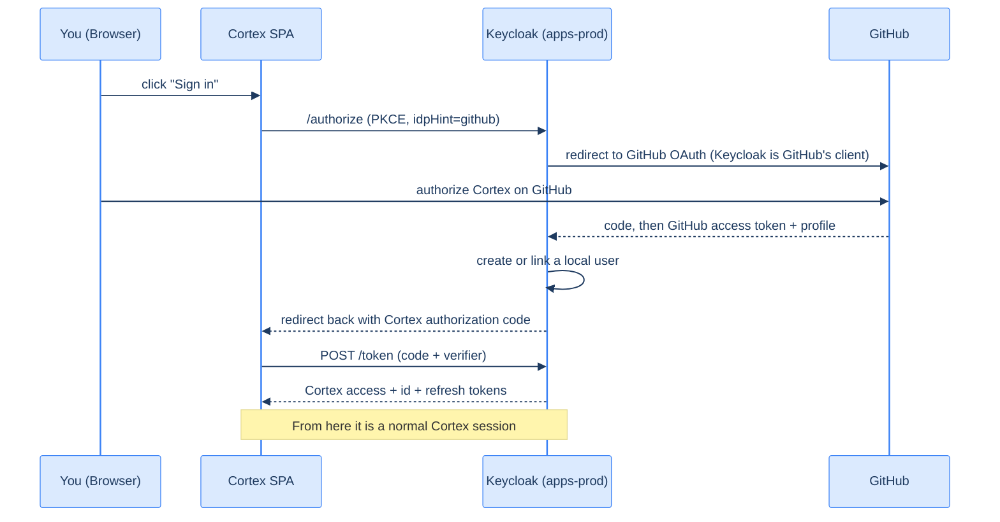

# 15. "Login with GitHub": identity brokering

## TL;DR

> Real Cortex users authenticate with **GitHub**, not a Cortex password. Keycloak makes this work by **identity brokering**: it acts as the **Authorization Server** to Cortex *and*, at the same moment, as an **OAuth client to GitHub**. When you click "Login with GitHub," Keycloak bounces you to GitHub, receives your GitHub identity, creates (or links) a local user, and then mints *Cortex's own* tokens. Cortex's SPA triggers this with one parameter: `idpHint=github`.

## 1. Motivation

Asking users to create yet another password is bad for everyone: users forget them, you have to store and protect them, and you inherit the entire burden of password resets, breaches, and MFA. The modern answer is **federation** — let users log in with an identity they already have (GitHub, Google, an employer's SSO).

But Cortex's API still needs to verify *Cortex* tokens against *Cortex's* realm (Chapter 11) — it can't be re-plumbed to understand GitHub's tokens directly, and you don't want every app coupled to GitHub's specifics. Keycloak resolves this elegantly by sitting in the middle as a **broker**: it speaks GitHub's protocol on one side and issues its own standard tokens on the other. Your app only ever deals with Keycloak; swap GitHub for Google tomorrow and the app doesn't change a line.

## 2. Intuition (Analogy)

Think of Keycloak as a **currency exchange at an airport**.

You arrive holding foreign currency (your GitHub identity). The shops inside (Cortex's API) only accept local currency (Cortex tokens). You don't hand the shops your foreign notes — you go to the **exchange desk** (Keycloak). It verifies your foreign notes are genuine (talks to GitHub), then hands you crisp *local* currency (mints Cortex tokens) the shops accept. The shops never need to know about every world currency — they trust the exchange desk. And if the airport later adds a second exchange (Google), the shops still just accept local currency.

| Airport | Cortex |
|---|---|
| Your foreign currency | Your GitHub identity |
| The exchange desk | Keycloak (the broker) |
| Verifying foreign notes | Keycloak doing OAuth *to GitHub* |
| Local currency | Cortex's own tokens |
| The shops | The Cortex API |

## 3. Formal Definition

**Identity brokering** is when an Authorization Server delegates *authentication* to an external **Identity Provider (IdP)** while remaining the token issuer for its own clients. Keycloak plays two roles simultaneously:

- **To Cortex:** the **Authorization Server** — it runs the Authorization Code + PKCE flow with the SPA and issues Cortex tokens (everything in Groups 2–3).
- **To GitHub:** an **OAuth client** — Keycloak itself is registered as a GitHub OAuth app (with a client id/secret), and performs an OAuth flow *to GitHub* to obtain your GitHub identity.

Key pieces:

- **IdP configuration:** in the `apps-prod` realm, an identity provider with `alias: github`, `providerId: github`, and GitHub OAuth app credentials.
- **`kc_idp_hint` (the SPA's `idpHint`):** a parameter on the authorization request that tells Keycloak "skip the chooser, go straight to *this* IdP." Cortex's SPA passes `idpHint: "github"` so users land on GitHub directly.
- **First-login flow / account linking:** on first GitHub login, Keycloak creates a local user linked to the GitHub identity (or links to an existing user by email). Subsequent logins reuse it. The stable `sub` in Cortex tokens is *Keycloak's* user id, not GitHub's — so Cortex's database keys stay stable even if GitHub details change.

## 4. Worked Example — the brokered login



Read the two halves. The **inner** flow (Keycloak ↔ GitHub) is Keycloak being an OAuth *client* to GitHub. The **outer** flow (SPA ↔ Keycloak) is the exact Authorization Code + PKCE flow from Chapter 6 — unchanged. The brokering is invisible to Cortex's API: it still just verifies a Cortex token signed by `apps-prod` (Chapter 11). The `idpHint=github` is what makes the chooser disappear and sends you straight to GitHub.

## 5. Build It

Run this. It models the broker's core job — translate an external identity into a stable *local* identity — and shows why the local `sub`, not GitHub's, is what Cortex stores.

```python run
# Keycloak's user store: maps an external identity to a STABLE local user.
local_users = {}          # local_sub -> {github_login, email}
link_index  = {}          # ("github", github_id) -> local_sub
_next = [1000]

def broker_login(github_id, github_login, email):
    key = ("github", github_id)
    if key not in link_index:
        # First login with this GitHub account: create a stable local user.
        local_sub = f"kc-user-{_next[0]}"; _next[0] += 1
        local_users[local_sub] = {"github_login": github_login, "email": email}
        link_index[key] = local_sub
        status = "created new local user"
    else:
        local_sub = link_index[key]
        status = "reused existing local user"
    # Cortex tokens carry the LOCAL sub + the GitHub login as a friendly claim.
    return {"sub": local_sub, "preferred_username": github_login}, status

tok1, s1 = broker_login("gh-42", "ani2fun", "a@example.com")
print(s1, "->", tok1)

# Same GitHub user logs in again later: SAME stable sub.
tok2, s2 = broker_login("gh-42", "ani2fun", "a@example.com")
print(s2, "->", tok2)

print("\nStable across logins?", tok1["sub"] == tok2["sub"])
print("Cortex keys its DB on `sub` (kc-user-1000), NOT the GitHub login — which a user could change.")
```

**Now break it.** Change the second `broker_login` to use a *new* `github_id` ("gh-99") but the same login. You'll get a *different* `sub` — correctly, because it's a different GitHub account. This is why you key on the stable `sub`, never on the mutable username or email: people rename, transfer, and re-use handles, but the linked subject id is forever.

## 6. Trade-offs & Complexity

| Brokered login (federation) | Local passwords |
|---|---|
| No passwords to store or breach | You own password storage, resets, MFA |
| Users reuse an identity they trust | Yet another account to forget |
| One place to add Google/SSO later | Re-implement per provider |
| Depends on the IdP being up | Self-contained |
| Account-linking edge cases (email collisions) | None |

The cost is a dependency on the external IdP and some account-linking subtlety (what if two GitHub accounts share an email?). For Cortex — a developer tool whose users *have* GitHub — federation is an obvious win: zero password burden, instant trust.

## 7. Edge Cases & Failure Modes

- **Keying on email or username.** Both are mutable and reusable. Always key your app's data on the stable `sub`. (Chapter 19 shows Cortex reading `sub`.)
- **Account-linking collisions.** If "link by email" is enabled and two IdP accounts share an email, you can merge identities unintentionally. Configure the first-login flow deliberately.
- **The IdP's own scopes.** Keycloak requests scopes *from GitHub* (e.g., `read:user`, `user:email`). Too few and it can't get the email; too many and you over-ask. Least privilege applies here too.
- **GitHub OAuth app secret.** Keycloak is a *confidential* client to GitHub — that secret lives in Keycloak's config (a Kubernetes secret in production), never in the browser.

## 8. Practice

> **Exercise 1 — Two hats.** In one sentence each, describe Keycloak's role *toward Cortex* and *toward GitHub* during a brokered login. Which flow is unchanged from Chapter 6?

<details>
<summary><strong>Answer</strong></summary>

- **Toward Cortex, Keycloak is the Authorization Server** — it runs the Authorization Code + PKCE flow with the SPA and issues *Cortex's own* tokens (signed by the `apps-prod` realm).
- **Toward GitHub, Keycloak is an OAuth client** — it's registered as a GitHub OAuth app (with its own client id/secret) and performs an OAuth flow *to GitHub* to obtain the user's GitHub identity.

**The unchanged flow is the outer one — SPA ↔ Keycloak — which is the exact Authorization Code + PKCE flow from Chapter 6.** The brokering happens *inside* that flow and is invisible to Cortex: the SPA still does PKCE against Keycloak, and Cortex's API still just verifies a Cortex token. (The airport analogy: Keycloak is the currency-exchange desk — local currency to the shops, a customer of GitHub's "bank" behind the counter.)

</details>

> **Exercise 2 — Why local `sub`?** Explain why Cortex stores the Keycloak `sub` rather than the GitHub username. Give a concrete scenario where storing the username would corrupt your data.

<details>
<summary><strong>Answer</strong></summary>

Cortex stores the Keycloak **`sub`** because it is the **stable, immutable subject id** Keycloak assigns to the *linked local user* — it never changes for that person, no matter what happens on GitHub. A GitHub **username** (`preferred_username`/`login`) is **mutable and reusable**: people rename their accounts, and old handles are later freed and *re-registered by someone else*. Keying on something that changes and gets recycled means your foreign key no longer reliably points at one human.

**A concrete corruption scenario:** Alice signs in as GitHub `alice`, and Cortex stores all her submissions under username `alice`. Months later she renames her GitHub account to `alice-codes`, and GitHub frees the handle `alice`, which **Bob** then registers. Bob logs into Cortex; Keycloak brokers him in. If Cortex keyed on the username, Bob now logs in as `alice` and **inherits Alice's entire history** — her submissions, her permissions — a silent identity takeover and data corruption. Had Cortex keyed on the stable `sub`, Alice keeps her `sub` after the rename (same linked account), and Bob gets a *brand-new* `sub` — the records never cross.

This is exactly the chapter's "Now break it": a *different* GitHub account id correctly yields a *different* `sub`, even if the login string is reused. Identity must hang on the durable subject id, never on a name a user can change.

</details>

> **Exercise 3 — Add a provider.** Cortex wants to also offer "Login with Google." What changes in Keycloak, and what changes in the Cortex API? (Hint: one of these answers is "nothing.")

<details>
<summary><strong>Answer</strong></summary>

- **In Keycloak:** add a *second identity provider* in the realm — a Google IdP (`providerId: google`) with a Google OAuth app's client id/secret, configure its scopes and first-login/account-linking behavior, and surface it on the login page (the SPA can target it with `idpHint=google`, mirroring `idpHint=github`). Keycloak now brokers to *two* upstreams.
- **In the Cortex API: nothing.** This is the payoff of brokering. The API only ever verifies *Cortex* tokens signed by the realm (Chapter 11) — it never sees GitHub's or Google's tokens. Whether a user authenticated via GitHub or Google, Keycloak still mints the same standard Cortex token with a stable `sub`, and the API's verification code is identical.

That asymmetry — *all* the change lives in the broker, *zero* in the app — is the airport-exchange-desk insight made concrete: the shops keep accepting local currency no matter how many foreign currencies the desk learns to exchange. (One caveat to be deliberate about: account-linking *across* providers — if a GitHub and a Google account share an email, "link by email" could merge them; configure the first-login flow intentionally.)

</details>

```quiz
{
  "prompt": "During a 'Login with GitHub', what does Keycloak ultimately hand back to the Cortex SPA?",
  "input": "Choose one:",
  "options": [
    "Cortex's own tokens (signed by the Cortex realm) — after verifying the user via GitHub",
    "GitHub's access token, which the Cortex API verifies directly",
    "The user's GitHub password",
    "Nothing — the SPA talks to GitHub directly"
  ],
  "answer": "Cortex's own tokens (signed by the Cortex realm) — after verifying the user via GitHub"
}
```

## In the Wild

- **[Keycloak — Identity Brokering](https://www.keycloak.org/docs/latest/server_admin/#_identity_broker)** — the full configuration surface, including first-login flows and account linking.
- **[GitHub — Authorizing OAuth apps](https://docs.github.com/en/apps/oauth-apps/building-oauth-apps/authorizing-oauth-apps)** — the GitHub side Keycloak speaks to as a client.
- **[Cortex `AuthStore.signIn` — `idpHint = "github"`](https://github.com/ani2fun/cortex/blob/main/client/src/main/scala/cortex/client/auth/AuthStore.scala)** — the real one-line call that sends users straight to GitHub (read in full in Chapter 18).

---

**Next:** the user is in — but *what may they do*? Roles answer that, and protocol mappers carry roles into the token where your API can read them. → [16. Roles, groups & protocol mappers](/cortex/production-engineering/iam-keycloak-oauth/keycloak/roles-groups-mappers)
