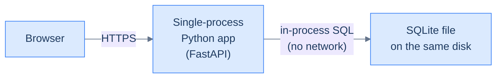

# 1. What "system design" actually means

## TL;DR
> System design is the craft of choosing how a software system fits together so it stays correct, fast, available, secure, and affordable as it grows. It is *not* picking the right framework, and it is *not* drawing boxes on a whiteboard. It is reasoning about trade-offs under constraints — and the constraints come from physics, money, people, and time.

## 1. Motivation

In **January 2017**, GitLab's database almost died. An engineer ran `rm -rf` on what they believed was a stale replica directory; it was actually the primary. They had backups. The backups had not been working for months. They had snapshots. The snapshots were six hours old. They had a replica. Replication had silently fallen behind under load that very night. Six hours of customer data was lost.

GitLab did the rare-and-admirable thing: they livestreamed the recovery on YouTube and published [a public postmortem](https://about.gitlab.com/blog/postmortem-of-database-outage-of-january-31/) that any engineer can still read in 15 minutes. Read it. Every paragraph is a lesson in system design that no Leetcode problem will ever teach you.

That postmortem is the thing this track exists to teach.

The senior engineers who designed GitLab did not lack programming skill. They lacked *systems thinking* — the discipline that asks, before any code is written:

- "What happens when this disk fills up?"
- "What happens when this script runs against the wrong host?"
- "What happens when the alert that's supposed to wake us up is itself broken?"

A system designer is the person paid to keep asking those questions until the answers stop being scary.

## 2. Intuition (Analogy)

Imagine the difference between **building a house** and **building a city**.

A house has walls, a roof, plumbing, wiring. You can read the blueprint in an afternoon. Three good carpenters can build it in a few months.

A city has houses too — but it also has roads, traffic lights, sewer systems, an emergency response, a power grid, a school district, garbage collection, zoning laws, building codes, an electrical inspector, a fire marshal, a city council, a mayor, and an angry resident who calls every Tuesday about the noise from the bus depot. The city does not "scale" by adding houses. It scales by adding *systems for managing houses*.

| House | City |
|---|---|
| Carpenter | Senior engineer |
| Blueprint | Architecture diagram |
| Walls and roof | Application code |
| Plumbing | The database |
| Wiring | The network |
| The fire alarm in the kitchen | The metric that pages oncall |
| One family lives here | Ten thousand customers depend on this |
| Built once, maybe renovated | Continuously changing while occupied |
| Failure means a leaky roof | Failure means *no clean water for 200,000 people* |

A junior engineer learns to build houses. A senior engineer learns to plan, run, and survive cities.

That is the entire job description, and the rest of this track is footnotes on it.

## 3. Formal Definition

**System design** is the discipline of making structural decisions about a software system — how it is split into parts, how those parts communicate, how they store data, and how they behave under stress — such that the resulting system meets its **functional requirements** (what it does) and its **non-functional requirements** (how well it does it) within explicit **constraints**.

Three terms to nail down:

| Term | Definition | Example |
|---|---|---|
| **Functional requirement** | A behaviour the system must produce. | "When a user clicks 'send', the message reaches the recipient within 1 second." |
| **Non-functional requirement** | A *quality attribute* the system must satisfy while producing the behaviour. | "Median end-to-end latency ≤ 100 ms; 99.9% availability; 11 nines durability for stored messages." |
| **Constraint** | A boundary the design must respect, usually outside the team's control. | "Annual infrastructure budget ≤ $2 M; team of 6 engineers; cannot use cloud regions in country X for legal reasons." |

A senior engineer's actual job is **reasoning about trade-offs** between these three categories — usually under uncertainty, often with incomplete data, sometimes for stakes measured in millions of dollars or millions of users.

A short, useful definition of "good" system design:

> A system is well-designed if it can absorb the realistic next surprise — a 10× traffic spike, a region failure, a buggy deploy, a regulator asking what data you store about whom — without a phone call at 3 a.m. waking somebody up.

That is the bar. Not "scales to infinity". Not "uses microservices". Not "uses Kubernetes". Absorbs the next realistic surprise.

**Two distinctions you will use in every chapter after this one.** Before we go further, internalise two pairs of words that the rest of this track leans on constantly. They come straight from *Designing Data-Intensive Applications*, the book that sits behind much of this track.

The first is **operational versus analytical** work. An *operational* system handles the live actions of users: it looks up a handful of records by key, then creates, updates, or deletes them — "add this book to my shelf", "charge this card", "post this message". These are small, fast, predefined queries, and there are a *lot* of them. An *analytical* system instead scans across a huge number of records to compute an aggregate — "what was total revenue per store in January?", "how many more bananas than usual did we sell during the promotion?" Few queries, each one enormous. The two have opposite shapes, so above a certain scale they are almost always run on *separate* systems: the operational database stays fast for users, and a read-only copy of its data is fed into a separate analytical store (a *data warehouse*) where analysts can run expensive queries without ever slowing down the checkout page. Most of this track is about operational systems — but knowing the split is what stops you from accidentally running a report that takes down production.

The second is **system of record versus derived data**. A *system of record* (also called a *source of truth*) holds the authoritative copy of a fact: when new data arrives, it is written *here first*, exactly once, and if any other system disagrees, the system of record wins by definition. *Derived data* is anything you computed *from* the source of truth and could rebuild if you lost it — a cache, a search index, a materialised view, a leaderboard, a thumbnail, an ML model's features. Here is the load-bearing insight DDIA draws from this: a database is just a tool; *nothing is inherently a source of truth or a derived store* — it depends entirely on how you use it. The skill is being explicit about which is which, because the moment you are fuzzy about it ("is the cache or the database the real answer?") is the moment a stale read corrupts something that matters. We will return to this every time we add a cache, an index, or a replica — each one is derived data that must be rebuildable from a source of truth.

## 4. Worked Example

A friend asks you to help them build **a personal book-tracking app**. They have read the entire 5-step wizard at [systemdesignschool.io](https://systemdesignschool.io) and have already started writing the diagram with Kafka in it.

Stop them. Walk them through what a senior engineer would actually ask.

**Step 1 — What is the goal?**
You: "Who uses this?"
Friend: "Just me. Maybe my book club — like ten people."

**Step 2 — What are the functional requirements?**
You: "Walk me through one full session."
Friend: "I open the page, search a title, click 'I read this', rate it 1–5, write a paragraph, save."

**Step 3 — Now write the *non-functional* requirements.**

| Attribute | Realistic value |
|---|---|
| Concurrent users | 1–3 |
| Reads per day | ~100 |
| Writes per day | ~10 |
| Tolerable read latency | "Whatever, Wi-Fi" — say < 1 s |
| Tolerable write latency | < 2 s |
| Tolerable downtime | Hours per month is fine |
| Budget | < $5 / month |
| Team | One person, evenings only |

**Step 4 — Sketch the simplest design that satisfies them.**



<p align="center"><strong>Book-tracking app — production architecture for ten readers.</strong></p>

That is the entire system. One server. One file. Nightly backup to a cloud bucket. Deployed to a $4/month VM. **It will work.**

The same view in C4 Container notation, rendered live from [`c4/book-tracker.c4`](https://github.com/ani2fun/codefolio/blob/main/content/cortex/system-design/01-foundations/c4/book-tracker.c4):

<iframe
  src="/c4/view/foundations_book_tracker_personal"
  width="100%"
  height="520"
  style="border: 1px solid var(--border, #2b2b2b); border-radius: 8px;"
  loading="lazy"
  title="Personal-scale book tracker — C4 Container view"
></iframe>

> Pan and zoom inside the frame. Three boxes is the entire production architecture for the personal-scale book tracker.

**Step 5 — Now what would break, and would you care?**

| Failure | Probability | Impact | Should we fix it now? |
|---|---|---|---|
| The VM reboots | High (cloud provider does this monthly) | App down for 60 s | **No** — we said hours of downtime are fine |
| The SQLite file corrupts | Low | Lose recent reviews | **Maybe** — restore from nightly backup loses ≤ 24 h |
| 10× traffic spike (book club goes viral) | Very low | Slow app | **No** — we'll notice and address it then |
| The disk fills | Medium over years | Writes start failing silently | **Yes** — set a disk-full alert |

**The senior insight:** the disk-full alert is the *only* thing your friend needs to add. Everything else is fine. They do not need Kafka. They do not need Kubernetes. They do not need three regions. They need an alert.

This is the actual job: **knowing what not to build**.

> **Friction prompt — before reading on:**
> Imagine the same friend, but the book club has 50,000 members and they want a real-time leaderboard of "who is reading the most this week". Take 60 seconds and write down — *without consulting anything* — three things that *must* change about the design above.
>
> *(Hint: at least one of them is not "use a bigger database".)*

Below is what that scaled architecture looks like in C4 Container notation. Notice how nearly every single new box is a *response* to a non-functional requirement (concurrent users, latency, durability, observability) rather than a new feature:

<iframe
  src="/c4/view/foundations_book_tracker_scaled"
  width="100%"
  height="640"
  style="border: 1px solid var(--border, #2b2b2b); border-radius: 8px;"
  loading="lazy"
  title="Scaled book tracker (50k readers) — C4 Container view"
></iframe>

> Same product, scaled to 50,000 readers with a real-time leaderboard. Compare to the three-box version above by panning between the two frames.

The architectural difference between the two views is the entire content of this track — how to know *which* box to add, *when*, and *why*.

**Why the numbers force the design.** The reason the second architecture *has* to look different is arithmetic, not fashion. Run the rough numbers the way a senior engineer would. Imagine a service with 300 million monthly users, half of them active on a given day, each writing twice a day. That is 150 million × 2 ÷ 86,400 seconds ≈ **3,500 writes per second on average, and roughly double that — ~7,000/s — at peak**. A single SQLite file doing in-process writes cannot survive that; it is not a deficiency of SQLite, it is that the workload no longer fits on one disk's write path. And if 10% of those actions store a 1 MB image, you are adding ~30 TB *per day* of media — which is why the scaled diagram suddenly grows an object store. (These figures are illustrative, not real platform numbers — but the *shape* of the reasoning is exactly the job.) The lesson the two diagrams teach together: **you do not choose an architecture and then check if it scales; you estimate the load and let the numbers tell you which architecture is even allowed.** We devote all of [Lesson 3 — Back-of-the-envelope estimation](/cortex/system-design/foundations/back-of-envelope-estimation) to doing this fluently.

## 5. Build It

The best way to start thinking like a system designer is to read **real postmortems** from real outages, then reverse-engineer the design that allowed them to happen and the design that recovered.

Pick one and read it now (15 minutes each):

- [GitLab — Database outage of January 31](https://about.gitlab.com/blog/postmortem-of-database-outage-of-january-31/) (2017)
- [Cloudflare — November 2 control-plane outage](https://blog.cloudflare.com/post-mortem-on-cloudflare-control-plane-and-analytics-outage/) (2023)
- [Heroku — Status incident archive](https://status.heroku.com/incidents) (ongoing — pick any "post-incident review")
- [Curated list: danluu/post-mortems](https://github.com/danluu/post-mortems) — a hand-picked collection of the best public postmortems by Dan Luu.

Then run this small Python script. It is not infrastructure code; it is a **diagnostic** that tells you whether you have the system designer's habit of mind. Edit the inputs, run, read the output.

```python run
# A senior engineer's first instinct on any system question is:
# "What are we optimising for, and what are we trading away?"
#
# Run this and try the questions in the prompt below.

CHOICES = [
    {
        "name": "Single-process app + SQLite",
        "max_qps": 50,
        "monthly_cost_usd": 4,
        "engineering_hours_to_build": 8,
        "engineering_hours_to_operate_per_month": 1,
        "max_downtime_per_month_hours": 24,
    },
    {
        "name": "App + managed Postgres",
        "max_qps": 2_000,
        "monthly_cost_usd": 80,
        "engineering_hours_to_build": 40,
        "engineering_hours_to_operate_per_month": 4,
        "max_downtime_per_month_hours": 1,
    },
    {
        "name": "App + Postgres + read replicas + cache + queue",
        "max_qps": 50_000,
        "monthly_cost_usd": 1_500,
        "engineering_hours_to_build": 400,
        "engineering_hours_to_operate_per_month": 40,
        "max_downtime_per_month_hours": 0.1,
    },
]

# Set these to your real situation, not your aspirational one.
TARGET_QPS = 5             # ← actual measured peak, not "what if it goes viral"
ACCEPTABLE_DOWNTIME_H = 8  # ← per month
MONTHLY_BUDGET_USD = 20

print(f"You said: {TARGET_QPS} qps, {ACCEPTABLE_DOWNTIME_H}h downtime/mo, ${MONTHLY_BUDGET_USD}/mo.\n")
for c in CHOICES:
    fits = (
        c["max_qps"] >= TARGET_QPS
        and c["max_downtime_per_month_hours"] <= ACCEPTABLE_DOWNTIME_H
        and c["monthly_cost_usd"] <= MONTHLY_BUDGET_USD
    )
    verdict = "FITS" if fits else "overkill or too small"
    print(f"  {c['name']:<55} -> {verdict}")
```

**Now break it.** Change `TARGET_QPS` to `40_000` and re-run. What changes? Now change `MONTHLY_BUDGET_USD` to `100`. Notice that nothing fits — you have an *impossible* requirements set, and a senior engineer's first job is to push back: *"You cannot have 40,000 QPS of dynamic, database-backed work for $100/month. Pick which one to relax."* That conversation is the job. Most engineers fail it because they did not run the numbers first.

## 6. Trade-offs & Complexity

There is no "complexity" in the algorithmic sense at this level — but there is a fundamental trade-off table that every system designer carries in their head, every day, forever.

| Axis | Cheap end | Expensive end | What you give up by going cheap |
|---|---|---|---|
| **Latency** | "Eventually arrives" — minutes to hours | "Within 50 ms" or better | Real-time UX; some interactive use cases impossible |
| **Throughput** | 1–10 req/sec | 1 M req/sec | Cannot serve large user bases |
| **Availability** | "Down some days" — 95% | 99.99%+ ("four nines") | Customer trust; revenue during outages |
| **Durability** | "Lose recent writes on crash" | "Lose nothing for 11 nines" | Cannot store anything that matters (money, contracts, medical) |
| **Consistency** | "Reads might be stale by seconds" | "Reads always reflect the latest write" | Can mislead users; corrupts state in some workflows |
| **Cost** | $4/mo | $4 M/mo | Bigger team, more infra, more vendors |
| **Operational burden** | One person, evenings | Always-on oncall rotation of 8 engineers | Sustainability; engineer burnout |
| **Time-to-market** | Ship in a week | Ship in a year | Competitors take your customers |
| **Flexibility** | Hard-coded for today | Configurable, multi-tenant, internationalised | Hard to pivot when the business changes |

**The rule of the table:** every column has a price you pay in another column. There is no "best" position. There is only "a position that matches what your business actually needs *right now*, with one engineer's worth of headroom for what it might need next year".

If a colleague tells you a single design "is the best", they are wrong. Politely ask: "best for which axis, and at what cost on the others?"

**Make one axis concrete: availability.** "Nines" sound abstract until you convert them to time. Each extra nine is roughly a 10× reduction in allowed downtime per year:

| Availability | Downtime per year | Downtime per day | What it costs to get there |
|---|---|---|---|
| 99% ("two nines") | ~3.65 days | ~14 min | One server, occasional reboots — basically free |
| 99.9% ("three nines") | ~8.8 hours | ~1.4 min | Redundancy + a real on-call process; this is where most cloud SLAs sit |
| 99.99% ("four nines") | ~52 min | ~8.6 s | Multi-AZ failover, automated recovery, tested runbooks |
| 99.999% ("five nines") | ~5 min | ~0.86 s | Multi-region, heavy investment, a large always-on team |

The jump from three nines to five nines is not "a bit more effort" — it is the difference between a small team and a department. The system designer's job is to ask *whether the business actually needs the extra nine*, because each one is paid for in the **cost**, **operational burden**, and **time-to-market** columns. A hobby project that targets five nines is as miscalibrated as a hospital pager system that targets two.

**A concrete trade across the table: build versus buy.** Suppose you need a message queue. You can self-host (run RabbitMQ or Kafka on your own machines) or buy a managed service (SQS, Confluent Cloud). DDIA frames the choice as a business question, not a technical one: keep things that are a *core competency or competitive advantage* in-house, and let a vendor handle what is *routine* — almost nobody fabricates their own CPUs because buying them is cheaper. Self-hosting wins on **cost and control** *if* your load is predictable and you already have the operational skill; you can tune it to your exact workload, and you keep your data on your own machines. Managed wins on **time-to-market and operational burden**: you trade money and a measure of control for not having to learn to run the thing — and you accept that if it has a bug or an outage, you can only file a ticket and wait. There is no universally correct answer; there is only "which columns of the table does *this* business need to spend in?"

## 7. Edge Cases & Failure Modes

The mistakes that distinguish junior from senior thinking — every one of these is a real outage somebody actually wrote a postmortem about:

- **Optimising for the imaginary case.** *"What if we get 10 M users?"* You probably will not. Design for 10× your current numbers, not 1000×. ([Stack Overflow ran on nine web servers and a single active SQL master](https://nickcraver.com/blog/2016/02/17/stack-overflow-the-architecture-2016-edition/) — 2016; the post notes it could limp along on just one.)
- **Confusing "we need it to be fast" with "we need it to be predictable".** A system that takes 80 ms in the median but 5,000 ms at the 99th percentile can be *worse* than one that takes 400 ms always — especially once a request fans out across many services, where the rare slow component dominates the user-perceived time. Tail latency is what your users actually feel. ([Jeff Dean and Luiz Barroso, 2013](https://research.google/pubs/the-tail-at-scale/) is the canonical paper.)
- **Treating "the cloud" as infinite and infallible.** It is not. Regions go down. Availability zones lose power. AWS's worst regional outages have run several hours to most of a day of degraded service in us-east-1, usually triggered by one subsystem (DNS, the control plane) failing and cascading. The cloud gives you someone else's operations team, not someone else's laws of physics — DDIA makes the same point: a cloud service's biggest downside is that *you have no control over it*. If it's down, "all you can do is wait for it to recover." Design for that wait.
- **Assuming the network is reliable.** It is not — partitions happen, packets vanish, DNS lies. (This is fallacy #1 of the [Eight Fallacies of Distributed Systems](https://en.wikipedia.org/wiki/Fallacies_of_distributed_computing). We will dedicate a lesson to it later.)
- **Building distributed systems before you have a single-machine system that works.** Distribution multiplies bugs by the number of nodes. If you cannot make one machine reliable, six of them will not save you. They will compound your suffering.
- **Caching as a reflex.** "Add a cache" is the duct tape of system design. It hides slowness, then explodes spectacularly the first time the cache layer fails and 100% of your traffic hits the cold backend. (Cache stampedes get their own treatment in [Lesson 8](/cortex/system-design/building-blocks/caching).)
- **Forgetting people.** A system that needs 10 engineers to operate but the team has 3 is *broken by design*, no matter how elegant the architecture.

How would you notice you are committing one of these mistakes? You stop being able to answer the question "*what does this system look like at 10× current load, and what fails first?*" without staring at the ceiling for 30 seconds.

If you cannot answer that on demand for the system you are designing, you have not designed it yet — you have *drawn* it.

## 8. Practice

> **Exercise 1 — Right-size a design.**
> Your school has 2,000 students. Design (one paragraph + one diagram) a system that lets every student see their grades online. Then design the same system for **a university with 200,000 students across 12 campuses, with international privacy regulations**. Spell out *exactly which non-functional requirements changed* between the two — not which technologies.

> **Exercise 2 — Read a postmortem and identify the design lesson.**
> Pick one postmortem from [the danluu/post-mortems repository](https://github.com/danluu/post-mortems) (a curated list of the best public postmortems). Read it. In one paragraph, identify the *single design decision* that, if it had been different, would have prevented or significantly mitigated the outage. Was that decision *wrong* at the time, or *correct given what they knew*?

> **Exercise 3 — The "no, you cannot have all of it" conversation.**
> A product manager hands you these three requirements:
> - "I need < 50 ms median response time globally."
> - "I need it to be a single source of truth — no stale reads, ever."
> - "I need it to stay up if any one region goes down."
>
> Pick *two* and write one paragraph explaining to the PM, in plain language, why you cannot give them the third without changing one of the other two. (We will formalise this in [Lesson 4 — CAP and PACELC](/cortex/system-design/foundations/cap-and-pacelc). The point of doing it now is to feel the *intuition* before the formalism.)

<details>
<summary><strong>Hint for Exercise 3</strong></summary>

Your two regions cannot agree on the latest write *and* keep responding *and* keep talking to each other when the network between them dies. They can guarantee at most two of the three. Choose which two are most important to your product, and explain to the PM what the third one *means* — usually some combination of "we briefly serve slightly old data" or "in a regional outage, one region temporarily refuses writes".

</details>

## Your Turn

Before you move on, check your understanding with the coach — explain the idea, apply it, weigh the trade-offs, then defend your reasoning.

<div class="concept-coach"></div>

## In the Wild

- **[Stack Overflow Architecture (2016)](https://nickcraver.com/blog/2016/02/17/stack-overflow-the-architecture-2016-edition/)** — Stack Overflow served roughly 66 M page loads *per day* (~2 billion/month) from *nine* web servers and a *single active SQL master*. It is the most widely-quoted refutation of "you must have microservices to scale" you will ever read.

- **[Discord — How Discord Stores Trillions of Messages](https://discord.com/blog/how-discord-stores-trillions-of-messages)** (2023) — A study in *deliberate* migration from Cassandra to ScyllaDB, including the months of measurement that justified the move. Notice how much of the post is about *measurement*, not implementation.

- **[Stripe — Designing Robust and Predictable APIs with Idempotency](https://stripe.com/blog/idempotency)** (2017) — Senior-grade thinking about making payments retryable without double-charging anyone. We will use this directly in [Lesson 19](/cortex/system-design/distributed-patterns/idempotency-retries-backoff) and [Capstone 49](/cortex/system-design/capstones/payment-system).

- **[Cloudflare — How we built Pingora, the proxy that connects Cloudflare to the Internet](https://blog.cloudflare.com/how-we-built-pingora-the-proxy-that-connects-cloudflare-to-the-internet/)** (2022) — A masterclass in *replacing* a load-bearing component (Nginx) with a custom one (Pingora) only after years of measurement justified the cost.

---

**Next:** the second-most-important habit a senior engineer cultivates — knowing how slow each kind of computer operation actually is. Without that, every design conversation devolves into vibes. With it, you can ballpark any design's feasibility in 30 seconds. → [Lesson 2 — Numbers every engineer should know](/cortex/system-design/foundations/numbers-every-engineer-should-know)
