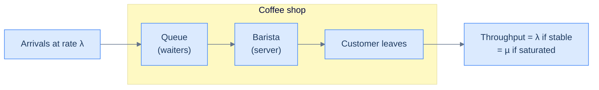
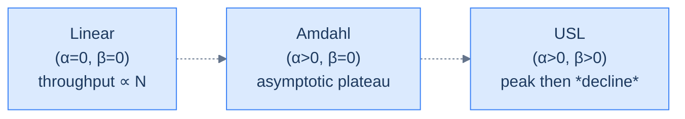

# 5. Latency, throughput, and the Universal Scalability Law

## TL;DR
> Latency is "how long one request takes". Throughput is "how many requests per second the system handles". They are related but **not the same** — and the relationship is non-linear in two specific places that cause every "we doubled the servers but throughput barely budged" outage. **Little's Law** (`L = λ × W`) is the universal accounting identity that ties them together. The **Universal Scalability Law** (USL) explains why throughput tops out, then *gets worse*, as you add servers. By the end of this lesson you will *see* the latency cliff in real numbers — and know exactly why production systems target ~70% utilisation, not 100%.

## 1. Motivation

In **2008**, Neil J. Gunther — a physicist-turned-performance-engineer who had worked on the original Pyramid mainframes — published a paper titled [*A General Theory of Computational Scalability Based on Rational Functions*](https://arxiv.org/abs/0808.1431). It was the formal version of an idea he had been teaching for a decade: scalability is *not* linear, *cannot be* linear past a certain point, and the point where it breaks is *predictable* from two parameters you can measure.

Earlier, Cary Millsap had used the same family of math to [diagnose Oracle databases](https://method-r.com/) — turning "the database is slow" into "your service time is X, your wait time is Y, here is exactly which queue is full". This is the genealogy of every modern *queueing-aware* performance tool: NewRelic, Datadog APM, Grafana, and your laptop's `iostat`.

The math is shockingly simple. The intuition is the part that takes a few minutes. By the end of this lesson, you will know more queueing theory than 90% of working software engineers.

## 2. Intuition (Analogy)

Imagine a **coffee shop** with one barista.

The barista takes 30 seconds to make a coffee. That is the **service time** — what one request costs in barista-time. The coffee shop's **maximum throughput** is therefore one coffee every 30 seconds, or **120 coffees per hour**. Period. No matter how long the queue gets, no matter how angry customers get, no matter how loud you yell — 120 coffees per hour, full stop. That is the *capacity ceiling*.

Now think about **latency** — the time *one customer* spends in the shop. If you arrive when the line is empty, your latency is 30 seconds (just the service). If you arrive when there are five people in front of you, your latency is `30 × 6 = 180 seconds`. Latency is service time *plus queue wait*.

Here is the part that surprises people. As the shop gets busier, the *queue* grows much faster than your intuition expects. At 50% utilisation (one customer arrives every minute), the average wait is short — you usually walk straight up. At 70% utilisation, the queue is noticeable. At 90% utilisation, the queue is *long*. At 95%, it is **disastrous** — and any small disturbance (the espresso machine glitches for 30 seconds) causes a cascading line that takes 20 minutes to drain.

The shape of that growth is **superlinear** — close to `1 / (1 - ρ)` where ρ is the utilisation. As ρ approaches 1, latency approaches infinity.

This is **the central fact about every queue you will ever interact with**: CPU queues, database connections, thread pools, network buffers, the line at the post office. It is the same math.

The corollary is that **running a system at 100% utilisation is not the goal**. The goal is *enough headroom that the queue does not explode under normal jitter*. Every senior engineer's bone-deep instinct is to size for ~60–70% peak utilisation, exactly because of this curve.



<p align="center"><strong>The single-server queue. λ is arrival rate; µ is service rate; ρ = λ/µ is utilisation.</strong></p>

## 3. Formal Definition

### Latency, throughput, and capacity

| Term | Symbol | Definition | Unit |
|---|---|---|---|
| **Latency** (or *response time*) | `W` | Time from request arrival to its response. | seconds |
| **Throughput** | `λ` | Rate at which the system completes requests in the steady state. | requests/sec |
| **Service rate** | `µ` | Rate at which one server *would* complete requests if it never sat idle. | requests/sec/server |
| **Number of servers** | `c` | Parallel servers behind a shared queue. | — |
| **Utilisation** | `ρ` | Fraction of time servers are busy. `ρ = λ / (c × µ)`. | unitless, 0 to 1 |

### Little's Law

The single most useful equation in performance engineering. Discovered by John D. C. Little in 1961, [proven](https://www.jstor.org/stable/167570) under almost no assumptions:

> **`L = λ × W`**

In English: *the average number of jobs in the system equals the arrival rate times the average response time*.

It applies to **any** stable queueing system, regardless of arrival distribution, service distribution, scheduling discipline, or network topology. It is an accounting identity, not a model.

What it lets you do:

- "Our service handles 1,000 req/sec at 50 ms median latency. How many requests are *in flight* on average?" → `L = 1000 × 0.050 = 50`.
- "We have a thread pool of 100 threads and average latency is 200 ms. What is our throughput ceiling?" → `λ ≤ L / W = 100 / 0.2 = 500 req/sec`.
- "We want 5,000 req/sec at 100 ms latency. How many concurrent connections must we support?" → `L = 5000 × 0.1 = 500`.

This is so useful you should commit it to memory and use it on every capacity question for the rest of your career.

### The M/M/1 response-time formula

For the simplest queue (Poisson arrivals, exponential service, one server), the mean response time is:

> **`W = 1 / (µ − λ)`**

Or equivalently, since `ρ = λ / µ`:

> **`W = (1 / µ) × 1 / (1 − ρ)`**

The first factor (`1/µ`) is the service time. The second factor (`1 / (1−ρ)`) is the *queueing inflation*. At ρ=0 it is 1 (no waiting). At ρ=0.5 it is 2 (latency doubles). At ρ=0.9 it is 10 (latency is 10× the service time). At ρ=0.99 it is 100. **At ρ→1 it is ∞.**

That is the latency cliff.

Drag the slider below. The bar chart shows the latency-multiplier at ten discrete utilisation points; the readout shows the absolute response time for a 50 ms service-time service and the matching mean queue length. Watch how the bars are flat-looking through ρ=0.7, then how the four right-most bars run off the top of the chart.

```d3 widget=queueing-simulator
{
  "title": "M/M/1 latency vs utilisation — drag ρ to feel the cliff",
  "serviceTimeMs": 50,
  "initialRho": 0.7
}
```

### The Universal Scalability Law (USL)

Gunther's USL is a simple, three-parameter model for *throughput as you add servers*:

> **`X(N) = (λ × N) / (1 + α(N − 1) + β × N × (N − 1))`**

where:

- `N` is the number of servers (or concurrent processes).
- `α` is the **contention** coefficient — the fraction of work that must be serialized (Amdahl's law).
- `β` is the **coherence** coefficient — the cost of replicas keeping each other in sync (which grows quadratically).

Three regimes:

- **`α = 0, β = 0`**: linear. Doubling servers doubles throughput. The dream.
- **`α > 0, β = 0`**: throughput approaches a *ceiling* (Amdahl's classical limit). More servers help less and less; you asymptotically approach `1/α`.
- **`α > 0, β > 0`**: throughput **rises, plateaus, then falls**. Past a peak, adding servers makes things *worse* because coherence cost dominates.



<p align="center"><strong>Three scalability regimes. Most real systems are USL.</strong></p>

This is why "just add more servers" stops working at some point — and worse, why **adding even more servers actively hurts**. Coherence costs (cache invalidations, replica synchronisation, lock contention) grow as `N²`.

## 4. Worked Example

Your service has a thread pool of **200** threads. Each request takes a median of **50 ms** to handle. You measure the throughput at peak: **3,500 req/sec**. You are about to add capacity.

**Question 1 — what is the *average* utilisation of the thread pool?**

By Little's Law: `L = λ × W = 3500 × 0.050 = 175`. So **on average 175 of 200 threads are busy**, ρ ≈ 87.5%. That is past the M/M/1 cliff. You are in the danger zone.

**Question 2 — what does the latency look like at that utilisation?**

Plug into the M/M/1 formula (a rough approximation; threads are not Poisson but the qualitative shape is right):

```
W = (1/µ) / (1 - ρ) = 50 ms / (1 - 0.875) = 50 / 0.125 = 400 ms
```

Your *average* latency is 400 ms — eight times the median service time. The p99 is much worse.

**Question 3 — you scale the thread pool to 400 threads. Throughput?**

If your service is *stateless* and the bottleneck was thread availability, you might expect throughput to double. **It will not.** Two things compete:

- The downstream database has fixed capacity. It was already at ρ ≈ 0.6 with 3,500 req/sec; doubling to 7,000 puts it at ρ ≈ 1.2 — *unstable*. The DB is the new bottleneck.
- Each thread now spends *more time waiting for the DB* and *less time computing*, so the per-thread throughput drops.

**Real-world numbers:** measured throughput goes from 3,500 → ~4,800. The 1.4× scaling factor (not 2×) is exactly USL with non-zero `α` — the shared database is the contention point (contention is α; coherence is β).

**Question 4 — what is the *right* fix?**

Not more app threads. Either:
- **Reduce service time `W`** — most senior thing to do. Every 1× drop in service time is a 1× drop in `L`, which is a 1× drop in load on the *next* tier.
- **Add capacity at the bottleneck** — typically the database. Cache reads, partition writes, add a read replica. You can read [Lesson 8](/cortex/system-design/building-blocks/caching) and [Lesson 11](/cortex/system-design/building-blocks/replication) for these patterns.
- **Decouple synchronously-blocked work** — push slow operations behind a queue (Lesson 15) so the response time (`W` for the user) can drop even if the *work* still takes the same time.

The *measurement* drove the diagnosis. Without Little's Law and the M/M/1 formula in your back pocket, the conversation is "why is it slow?". With them, the conversation is "the bottleneck is component X at ρ=0.95; add Y to the budget".

> **Friction prompt — before reading on:**
> A junior engineer says: "*we run our app at 95% CPU utilisation. We are super efficient!*" In one sentence, what would a senior engineer say? *(Hint: it has to do with the next 30 seconds, not the past 30 minutes.)*

<details>
<summary><strong>Solution</strong></summary>

A senior engineer would say: *"We are running on the latency cliff. Any small disturbance — a GC pause, a noisy neighbour, a brief spike — pushes us into a queue that takes minutes to drain. The 95% utilisation is hiding tail-latency disasters that have not happened yet but will."* 60–70% peak is the engineering target precisely because the queueing curve is brutal past 0.85.

</details>

## 5. Build It

The lesson ships a runnable **M/M/c queueing simulator** at [`examples/05-littles-law-queueing/`](https://github.com/ani2fun/codefolio/tree/main/content/cortex/system-design/01-foundations/examples/05-littles-law-queueing). It is event-driven, deterministic, and ~200 lines.

```bash
git clone https://github.com/ani2fun/codefolio.git
cd codefolio/content/cortex/system-design/01-foundations/examples/05-littles-law-queueing
just test       # 6 tests including a Little's-Law-residual check
just demo       # runs the headline utilisation sweep + pooling-vs-partitioning experiment
```

The `just demo` output:

```
M/M/1 utilisation sweep — c=1 server, µ=10.0 jobs/sec
ρ      λ      µ        L      W (s)    L − λW       percentiles
0.10   1.00   9.95    0.11   0.1116   +0.0000   p50=0.077  p95=0.334  p99=0.522
0.50   5.01   9.95    1.02   0.2037   +0.0000   p50=0.141  p95=0.620  p99=0.951
0.70   7.01   9.95    2.41   0.3430   +0.0000   p50=0.237  p95=1.030  p99=1.618
0.91   9.02   9.95    9.90   1.0981   −0.0000   p50=0.757  p95=3.247  p99=4.543
0.96   9.52   9.95   22.45   2.3589   −0.0000   p50=1.621  p95=6.893  p99=8.923
```

Two things to *see* in this table:

1. **`L − λW` is exactly zero** at every load. Little's Law holds *exactly* on synthetic data — it is an accounting identity, not an approximation.
2. **W explodes superlinearly** as ρ approaches 1. Going from ρ=0.5 to ρ=0.96 takes mean response from 200 ms to 2,360 ms — a **12× increase** for less than a 2× increase in load. This is the latency cliff in numbers.

The same simulator also runs a **pooling-vs-partitioning** experiment that shows a non-obvious truth:

```
1 fat M/M/1 (c=1, µ=10)             ρ=0.91   W=1.10 s   p99=4.54 s
pooled M/M/5 (each µ=2)             ρ=0.91   W=1.36 s   p99=5.10 s
5 independent M/M/1 (each µ=2)      ρ=0.91   W=5.49 s   p99=22.71 s
```

Same total capacity. Five independent queues are **4× worse than the pooled queue at the mean and 4.5× worse at the tail.** This is the math behind every connection pool, every thread pool, every "shared CDN edge" — *pool the work, don't shard it into N small queues*.

**Now break it.** In `src/queueing_lab/demo.py`, change the M/M/1 sweep to start at ρ=0.99 instead of 0.10. What happens? Why does the simulator refuse? *(Hint: ρ = 1 means the queue grows without bound — there is no stable steady-state to measure.)* The simulator's stability check is a real engineering skill: knowing what configurations *cannot* be measured because they do not exist.

## 6. Trade-offs & Complexity

| Property | Cost of higher ρ | Benefit of higher ρ |
|---|---|---|
| **Mean latency** | Grows like `1 / (1 − ρ)` | — |
| **p99 latency** | Grows even faster (cliff at ρ ≈ 0.85) | — |
| **Server cost** | — | Fewer machines for the same load → cheaper |
| **Reliability headroom** | Disappears — small disturbances cause queue explosions | — |
| **Operational simplicity** | Harder — you are on the edge | — |

**The standard production target: ρ ≈ 0.6–0.7** at peak load. That gives you 30–40% headroom for unexpected spikes, GC pauses, brief network slowness, and the 99.9th-percentile job. Going above that is asking for tail-latency pain.

The *exception* is throughput-only batch systems where latency does not matter (overnight jobs, log processing). Those can run at ρ ≈ 0.95+ because they have no SLA on individual job time. Even then, you want some slack for predictability.

## 7. Edge Cases & Failure Modes

- **Confusing throughput with latency.** They are *related*, not equal. A system can have low throughput *and* low latency (one slow user). It can have high throughput *and* high latency (a busy database). Optimising one in isolation hides the other.
- **Quoting CPU utilisation as system utilisation.** CPU is *one* of many resources. If your CPU is 50% busy but your DB connection pool is 95% busy, your effective ρ is 0.95. The cliff finds whichever resource is the bottleneck.
- **Forgetting that real workloads are *not* Poisson.** Real arrivals are bursty (a tweet trending; a marketing email blast). Bursty arrivals push you onto the cliff *transiently* even when the long-run average is moderate. Headroom matters more, not less.
- **Designing for the average load.** Provision for the *peak minute*. If your peak is 3× the average, your provisioned capacity must handle 3×, not 1×.
- **Believing that "we'll add more servers" fixes everything.** Past the USL peak, more servers *reduce* throughput. We have seen this in real systems: adding a sixth replica to a five-replica MongoDB cluster slowed it down because cross-replica chatter (`β`) dominated. The fix is *almost never* "more of the same"; it is "remove the contention point" or "remove the coherence cost".
- **Ignoring tail latency in capacity planning.** A system at 70% mean utilisation can have a 99th-percentile response time 10× the median. Page-load times are dominated by the *slowest* dependency, so even rare slow requests crater user experience. Read [The Tail at Scale](https://research.google/pubs/the-tail-at-scale/) (Dean & Barroso, 2013).
- **Sizing a queue for the average rather than the tail.** A buffer that holds 100 jobs at average load can fill in a 200-job burst, drop work, and trigger retries that double the rate. Sizing for the 99th-percentile burst, not the average, is the safer call.
- **Forgetting Little's Law.** Most "we don't know how to size this" arguments are dissolved by four numbers (λ, W, c, µ) and one identity. Use it.

## 8. Practice

> **Exercise 1 — apply Little's Law.**
> A web service has 50 worker threads. The peak measured throughput is 800 req/sec. (a) What is the average response time? (b) If you reduce response time to half (better SQL, fewer round-trips), what happens to throughput, *if the bottleneck stays the thread pool*?
>
> <details>
> <summary>Solution</summary>
>
> (a) `W = L / λ = 50 / 800 = 62.5 ms`.
> (b) If the bottleneck is the thread pool, `L = c = 50` is fixed. Halving `W` to 31.25 ms doubles throughput to ≈ 1,600 req/sec — *if the next bottleneck (DB, downstream service) does not bind first*. This is why "make the request faster" is so often the lever with the most leverage: you reduce load *everywhere downstream*, not just at the app tier.
>
> </details>

> **Exercise 2 — find the cliff.**
> Edit the simulator's `demo.py` to plot mean response time at ρ ∈ {0.50, 0.60, 0.70, 0.80, 0.85, 0.90, 0.95, 0.99}. By what factor does W increase from ρ=0.5 to ρ=0.7? From ρ=0.7 to ρ=0.9? From ρ=0.9 to ρ=0.99? Where would you set the production target?
>
> <details>
> <summary>Solution sketch</summary>
>
> 0.5 → 0.7: ratio of `(1−0.5)/(1−0.7) = 1.67×`.
> 0.7 → 0.9: ratio of `(1−0.7)/(1−0.9) = 3×`.
> 0.9 → 0.99: ratio of `(1−0.9)/(1−0.99) = 10×`.
>
> The biggest absolute jump is the last interval. Production target around ρ ≈ 0.6–0.7 sits before the steepening — every 5% past 0.7 costs disproportionately more latency. (Some engineers target ρ=0.5 in latency-sensitive systems for the same reason; it is the same cliff, just more cautious.)
>
> </details>

> **Exercise 3 — compare pooling and partitioning.**
> Take the simulator's pooling-vs-partitioning experiment. Modify it to compare 1 server at µ=10 vs 10 servers at µ=1 each (same total capacity). Then compare it to 10 *independent* M/M/1 queues each at µ=1, λ=1 (the same per-server load). The third configuration is the worst. Why?
>
> <details>
> <summary>Solution</summary>
>
> Each independent M/M/1 sees its own bursts and its own idle moments — they cannot help each other. A single pooled queue absorbs the bursts because some servers are always free even when the workload is uneven. This is why connection pools, thread pools, CDN edges, and "share-nothing" architectures with central work allocation all win over per-instance queues.
>
> </details>

> **Exercise 4 — the USL fitting exercise (advanced).**
> Read Gunther's [*Guerrilla Capacity Planning*](https://www.perfdynamics.com/Manifesto/USLscalability.html) page. Pick a system you operate (or pick a published benchmark) where throughput-vs-N data is available. Fit `α` and `β` by least squares. The peak `N*` is at `√((1−α)/β)`. Does it match where you would have provisioned by intuition? *(Almost always: the USL fit predicts a *lower* peak than the team had provisioned for.)*

## In the Wild

- **[Neil Gunther — Guerrilla Capacity Planning](https://www.perfdynamics.com/Manifesto/USLscalability.html)** — the home of the USL. The book of the same name has become a quiet classic on senior performance teams.

- **[Cary Millsap — Method R](https://method-r.com/)** — Oracle performance engineering reframed as queueing theory. Notable because it is the genealogical ancestor of every modern database APM tool.

- **[Jeff Dean & Luiz Barroso — The Tail at Scale](https://research.google/pubs/the-tail-at-scale/)** (CACM 2013) — *the* paper on why tail latency is what your users actually feel, and what to do about it. Required reading.

- **[Brendan Gregg — Systems Performance](http://www.brendangregg.com/sysperfbook.html)** (book + free chapters online) — comprehensive tooling and methodology for measuring everything in this lesson on real systems.

- **[Discord — How Discord Stores Trillions of Messages](https://discord.com/blog/how-discord-stores-trillions-of-messages)** (2023) — read the section on tail-latency under load; the migration was driven by exactly the M/M/c queueing dynamics this lesson formalises. Notice how often the post quotes *p99* and *cell-level utilisation*, not means.

---

**You finished Part 1.** You now have:

- A senior engineer's mental model of "what system design actually is" ([Lesson 1](/cortex/system-design/foundations/what-system-design-means)).
- The numbers — to within a factor of 10 — for every operation in a computer ([Lesson 2](/cortex/system-design/foundations/numbers-every-engineer-should-know)).
- The estimation skill that turns a back-of-envelope into an architectural decision ([Lesson 3](/cortex/system-design/foundations/back-of-envelope-estimation)).
- The CAP / PACELC trade-off, *felt* through the simulator ([Lesson 4](/cortex/system-design/foundations/cap-and-pacelc)).
- Little's Law, the M/M/1 cliff, and the USL — the queueing instinct that drives every capacity decision (this lesson).

Next up: the actual building blocks — networking, load balancers, caches, databases, replication, sharding, consistency, consensus. Each lesson follows the same 8-beat shape. → [Part 2 — Building blocks](/cortex/system-design)
