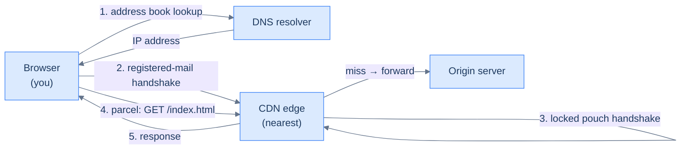

# 6. Networking primer for system designers

## TL;DR
> Every networking choice you make in a system design is, ultimately, a **count of round-trips**. A cold HTTPS visit costs 4–6 RTTs before the first useful byte; a warm pooled request costs ~1. The whole job of designing for the network is moving requests from the cold column to the warm column without breaking correctness. By the end of this lesson you will read a protocol-stack choice (TLS 1.2 vs 1.3, HTTP/2 vs 3, anycast vs GeoDNS) and *instantly* know what it costs in milliseconds at 50 ms RTT and at 150 ms RTT.

## 1. Motivation

In **September 2019**, during its Birthday Week, Cloudflare began rolling out HTTP/3 over QUIC across its network (opt-in at first, via a waiting list). In the [accompanying blog post](https://blog.cloudflare.com/http3-the-past-present-and-future/) they made the case that matters for system design: on lossy, high-latency links — exactly what mobile users live on — HTTP/3 removes TCP's head-of-line blocking and folds the connection handshake into one round-trip, so the *tail* latency that makes a feature feel sluggish shrinks. And that win comes not from writing better backend code, but from changing how the bytes travel across the network.

The work that made HTTP/3 possible was [Google's QUIC deployment paper at SIGCOMM 2017](https://research.google/pubs/the-quic-transport-protocol-design-and-internet-scale-deployment/) (Langley et al.). They had spent years shipping a UDP-based transport protocol inside Chrome, Android, and Google's own servers — at one point QUIC carried 35% of all Google egress traffic — and the paper reported a 15–18% reduction in YouTube rebuffering and 3.5–8% lower search latency, on top of QUIC's 0-RTT handshake for repeat connections.

You do not need to ship a transport protocol to benefit from what Cloudflare and Google learned. You need to understand **how many round-trips your request makes** at each step, because that is the lever every networking choice pulls. That's the lesson.

## 2. Intuition (Analogy)

Think of the internet as a **postal system with several layers of paperwork**.

- **TCP** is the postal worker's *registered mail*: every parcel gets a receipt, lost parcels are re-sent, and they arrive in order. Reliable, but you cannot send the first parcel until both sides have signed paperwork establishing the route (the *handshake*).
- **UDP** is a *postcard*. You drop it in the box and walk away. Some get lost. No-one tells you. No paperwork.
- **TLS** is a *locked diplomatic pouch*: the post office can see the address but not what's inside. The first time you use one, you and the recipient have to exchange a key (more paperwork).
- **HTTP** is the *form printed on the inside of the parcel*: it specifies what you're asking for and what the response should look like.
- **DNS** is the *address book* mounted on the wall of the post office. You ask "where does `example.com` live?" and you get back a street address. Address books at every level — your branch, your district, the national office — keep their own copy and refresh it on a schedule (the *TTL*).
- A **CDN** is a chain of *regional distribution centres*. Instead of every parcel going to the head office in California, popular items are pre-stocked at the centre nearest you. You only see the head office for things the local centre doesn't have.

Most of what follows is variations on a single question: **how many trips between buildings does this design require, and how big a tax do they each impose?**



<p align="center"><strong>The postal-system mental model. Each numbered step is one or more round-trips.</strong></p>

## 3. Formal definitions

The whole networking stack is a tower of small machines, each layered on the one below it. We need vocabulary for five layers: the transport (TCP/UDP), the encryption (TLS), the application protocol (HTTP/1.1/2/3), the naming system (DNS), and the deployment shape that decides where bytes physically come from (CDNs).

### 3.1 TCP vs UDP — the transport choice

**TCP** (Transmission Control Protocol) is the workhorse of the internet. It gives you a *stream* abstraction: you write bytes, they come out the other side in the same order, with the same content, or the connection breaks. Under the hood, it's doing four things: sequence numbers (so packets can be reordered), acknowledgements (so lost packets can be re-sent), checksums (so corrupted packets are noticed), and congestion control (so the sender slows down when the network is full).

**UDP** (User Datagram Protocol) gives you almost nothing. You hand the kernel a *datagram* up to ~65 KB; it gets delivered, or it doesn't, in whatever order. No retransmits, no ordering, no congestion control. If you want any of those, you write them yourself.

| Property | TCP | UDP |
|---|---|---|
| Connection state | yes (3-way handshake) | none |
| Ordering guarantee | in-order delivery | none |
| Reliability | retransmits + ACKs | best-effort |
| Header bytes per packet | 20 (without options) | 8 |
| Congestion control | yes (CUBIC, BBR, …) | application's problem |
| Setup cost | 1 RTT to first byte | 0 RTT |
| Used by | HTTP/1.1, HTTP/2, SSH, databases | DNS, video calls, gaming, QUIC (and therefore HTTP/3) |

**Cost summary.** TCP's tax is 1 RTT before any application data, paid every time you open a new connection. UDP's tax is whatever reliability machinery you have to write yourself if you need it.

### 3.2 HTTP/1.1 vs HTTP/2 vs HTTP/3 — the application protocol

HTTP is the *form printed inside the parcel*. All three versions have the same vocabulary (`GET /resource`, `200 OK`, headers, body) — what changes is how the conversation is multiplexed over the underlying transport.

- **HTTP/1.1** (1997, [RFC 2616](https://www.rfc-editor.org/rfc/rfc2616) → [RFC 7230](https://www.rfc-editor.org/rfc/rfc7230)) is text-based and serial. One request on one TCP connection at a time. Browsers worked around this by opening ~6 connections per domain in parallel — which is exactly the cold-start tax × 6.
- **HTTP/2** (2015, [RFC 7540](https://www.rfc-editor.org/rfc/rfc7540) → [RFC 9113](https://www.rfc-editor.org/rfc/rfc9113)) is binary and multiplexed. Many requests share one TCP connection. But TCP itself enforces in-order delivery, so a single lost packet stalls *every* multiplexed stream until it is re-sent. This is called **TCP head-of-line blocking** and it is the reason HTTP/3 exists.
- **HTTP/3** (2022, [RFC 9114](https://www.rfc-editor.org/rfc/rfc9114)) is HTTP/2 over **QUIC** ([RFC 9000](https://www.rfc-editor.org/rfc/rfc9000)). QUIC is built on UDP and implements its own per-stream reliability. A lost packet stalls only the stream it belonged to, not the others. QUIC also folds TLS 1.3 into its handshake, so the cold connection is 1 RTT instead of 2.

| Property | HTTP/1.1 | HTTP/2 | HTTP/3 |
|---|---|---|---|
| Wire format | text | binary | binary |
| Connections per origin | ~6 parallel | 1 | 1 |
| Multiplexing | no (pipelining is broken) | yes (over TCP) | yes (over QUIC/UDP) |
| Head-of-line blocking | per connection, app layer | per connection, TCP layer | none — streams independent |
| Cold handshake (with TLS 1.3) | 2 RTT (TCP + TLS) | 2 RTT (TCP + TLS) | **1 RTT** (QUIC + TLS) |
| Header compression | none | HPACK | QPACK |
| Browser support (2026) | universal | ~98% | ~95% and rising |

**Cost summary.** HTTP/2 buys you connection reuse (no handshake on the 2nd request) but pays for it in TCP head-of-line blocking on lossy links. HTTP/3 keeps the connection reuse, removes the head-of-line blocking, *and* shaves 1 RTT off the cold handshake. There is essentially no scenario where HTTP/3 is slower than HTTP/2 — its downsides are operational, not performance.

### 3.3 TLS 1.2 vs 1.3 — the encryption layer

**TLS** (Transport Layer Security) wraps a TCP or QUIC stream in encryption + authentication. It does two jobs: prove the server is who its certificate says it is, and agree on a symmetric key for the rest of the conversation.

[**TLS 1.2**](https://www.rfc-editor.org/rfc/rfc5246) (2008) takes 2 RTTs to do this. The client says hello, the server replies with its certificate, both sides exchange key material, and finally both sides confirm — that's 4 messages or 2 round-trips before the first byte of HTTP.

[**TLS 1.3**](https://www.rfc-editor.org/rfc/rfc8446) (2018) cuts this to 1 RTT. The client speculatively sends key share material in its first hello; the server replies with its own and finalises in one round-trip. Forward secrecy (every session gets a fresh key) is mandatory; the dangerous old ciphers are gone; the handshake is encrypted by message 2.

TLS 1.3 also introduces **0-RTT data** ("early data"). The very first packet from the client can carry application data, piggybacked on the session resumption ticket. This saves an RTT on the resumed visit — but the early data is *replayable*, so it can only be used safely for idempotent reads. (More on this in §6.)

| Property | TLS 1.2 | TLS 1.3 |
|---|---|---|
| Full-handshake RTTs | 2 | 1 |
| Resumed-handshake RTTs | 1 | 0 (with early-data, replayable) |
| Forward secrecy | optional (ECDHE) | mandatory |
| Insecure cipher options | many (RC4, CBC, …) | none — only AEADs |
| RTT cost vs TLS 1.2 | baseline | **−1 RTT** every cold visit |

**Cost summary.** Moving from TLS 1.2 to TLS 1.3 saves 1 RTT on every cold connection. At 50 ms regional RTT that's 50 ms; at 150 ms cross-region that's 150 ms. Free win, no application changes required.

### 3.4 DNS — the address book

When you type `https://example.com`, your browser has an IP address it can talk to nowhere on the planet. It has to *resolve* the name to an address. This is DNS, and it is one of the only systems in the stack that is older than your authors' careers (1983, [RFC 882](https://www.rfc-editor.org/rfc/rfc882)).

The resolution walks a hierarchy: your OS stub resolver → your local recursive resolver (often run by your ISP, or a public one like Cloudflare's 1.1.1.1 / Google's 8.8.8.8) → the root nameservers → the TLD nameservers (`.com`) → the authoritative nameservers for `example.com`. In practice almost every step except the last is cached — the TLD records change once a decade — so a *typical* cold lookup is ~1 round-trip from your machine to the recursive resolver. A *truly cold* lookup (resolver cache also cold) can take 2–4 RTTs while it walks the chain.

The **TTL** (time-to-live) on each DNS record decides how long the next layer up may cache it. A 60-second TTL means a DNS change propagates in about a minute, but every resolver re-queries 60 times per hour. A 1-hour TTL means the resolver chats once per hour, but a DNS-based failover is 1-hour-slow.

| Question | Answer |
|---|---|
| Where does the resolver live? | OS stub → ISP / public resolver (1.1.1.1, 8.8.8.8) → root / TLD / authoritative |
| Cold lookup cost | 1 RTT typical; 2–4 RTTs if the resolver's own cache is cold too |
| Warm lookup cost | ~0 RTT (in-process cache) |
| Typical TTL | 30–60 s (operational) to 1–24 h (static) |
| TTL trade-off | short = fast rollback, more resolver load; long = slow rollback, less resolver load |
| Failure modes | cache poisoning, slow propagation, NXDOMAIN floods |

**Cost summary.** Cold DNS is 1 RTT (typical) and contributes ~20–100 ms to a cold visit. Warm DNS is free. The biggest practical decision is the TTL on your records, and it is a *recovery-time* knob, not a latency knob.

### 3.5 CDNs — the regional distribution centre

A **Content Delivery Network** is a fleet of cache + TLS-termination servers ("edges" or "POPs") placed close to users, with the origin behind them. Two questions define a CDN:

1. **How do users reach the nearest edge?**
   - **Anycast** — every edge advertises the same IP via BGP, and the internet's routing fabric chooses the closest one. Used by Cloudflare, Fastly.
   - **GeoDNS** — the DNS resolver returns different IPs depending on where the client is. Used by AWS CloudFront, Akamai (historically), Netflix Open Connect.
2. **What lives at the edge?**
   - At minimum: TLS termination + a cache of static assets (HTML, JS, CSS, images, videos).
   - Increasingly: a runtime — Cloudflare Workers, Lambda@Edge — so dynamic responses can execute close to users too.

Between the edge and the origin, well-run CDNs add an **origin shield**: a single regional cache that absorbs duplicate misses. If 200 different edges all miss the same object simultaneously, the shield turns 200 origin requests into 1 — the rest see the shielded response.

<iframe
  src="/c4/view/buildingblocks_networking_overview"
  width="100%"
  height="520"
  style="border: 1px solid var(--border, #2b2b2b); border-radius: 8px;"
  loading="lazy"
  title="Browser → DNS → CDN → origin: the system context"
></iframe>

> Pan and zoom inside the frame. This is the topology every Part-2 lesson refers back to. [Lesson 8 (caching)](/cortex/system-design/building-blocks/caching) will zoom into the CDN edge; [Lesson 11 (replication)](/cortex/system-design/building-blocks/replication) will zoom into the database tier; [Capstone 42 (URL shortener)](/cortex/system-design/capstones/url-shortener) will lay a real read/write path through all of it.

The CDN container view makes the edge / shield split concrete:

<iframe
  src="/c4/view/buildingblocks_networking_cdn_internals"
  width="100%"
  height="380"
  style="border: 1px solid var(--border, #2b2b2b); border-radius: 8px;"
  loading="lazy"
  title="CDN — edge POPs and the origin shield"
></iframe>

| Question | Answer |
|---|---|
| Typical RTT to nearest edge | 5–30 ms |
| Typical RTT direct to origin | 50–200 ms cross-region |
| What can the edge cache without coordination? | Anything immutable + cache-control-public — most static assets and many API responses |
| What's between edge and origin? | An origin shield (optional but ubiquitous) coalesces duplicate misses |
| Failure modes | cache stampede on cold edge, anycast routing drift, stale-while-revalidate footguns |

**Cost summary.** A CDN does not make any single round-trip faster — it shortens the *physical distance* a round-trip has to cover, often from 150 ms (cross-region) down to 10–30 ms (nearest edge). That's a 5–10× cut on every RTT in the entire stack, applied to every visitor near a POP.

## 4. Worked example — what a cold HTTPS visit actually costs

Open a browser, type `https://www.example.com`, hit enter. The wall-clock time before the first byte of HTML reaches the browser is a stack of round-trips. Let's count them for six protocol-stack choices.

```d3 widget=handshake-timeline
{
  "title": "Cold-to-warm HTTPS visit — the handshake tax by protocol stack and connection state",
  "rttMs": 50,
  "rttRange": [5, 200],
  "scenarios": [
    {
      "name": "TLS 1.2 + HTTP/1.1, DNS uncached",
      "phases": [
        { "name": "DNS lookup (resolver cold)", "rttCount": 2, "kind": "dns" },
        { "name": "TCP handshake",              "rttCount": 1, "kind": "tcp" },
        { "name": "TLS 1.2 handshake",          "rttCount": 2, "kind": "tls" },
        { "name": "HTTP request + response",    "rttCount": 1, "kind": "request" }
      ]
    },
    {
      "name": "TLS 1.2 + HTTP/1.1, cold",
      "phases": [
        { "name": "DNS lookup",                 "rttCount": 1, "kind": "dns" },
        { "name": "TCP handshake",              "rttCount": 1, "kind": "tcp" },
        { "name": "TLS 1.2 handshake",          "rttCount": 2, "kind": "tls" },
        { "name": "HTTP request + response",    "rttCount": 1, "kind": "request" }
      ]
    },
    {
      "name": "TLS 1.3 + HTTP/2, cold",
      "phases": [
        { "name": "DNS lookup",                 "rttCount": 1, "kind": "dns" },
        { "name": "TCP handshake",              "rttCount": 1, "kind": "tcp" },
        { "name": "TLS 1.3 handshake",          "rttCount": 1, "kind": "tls" },
        { "name": "HTTP request + response",    "rttCount": 1, "kind": "request" }
      ]
    },
    {
      "name": "QUIC + TLS 1.3 + HTTP/3, cold",
      "phases": [
        { "name": "DNS lookup",                 "rttCount": 1, "kind": "dns" },
        { "name": "QUIC + TLS 1.3",             "rttCount": 1, "kind": "quic" },
        { "name": "HTTP request + response",    "rttCount": 1, "kind": "request" }
      ]
    },
    {
      "name": "TLS 1.3 + HTTP/2, DNS cached",
      "phases": [
        { "name": "TCP handshake",              "rttCount": 1, "kind": "tcp" },
        { "name": "TLS 1.3 handshake",          "rttCount": 1, "kind": "tls" },
        { "name": "HTTP request + response",    "rttCount": 1, "kind": "request" }
      ]
    },
    {
      "name": "Fully pooled connection (warm)",
      "phases": [
        { "name": "HTTP request + response",    "rttCount": 1, "kind": "request" }
      ]
    }
  ]
}
```

Drag the **RTT slider** and watch the gap. At **20 ms** (same-region datacentre traffic), the worst case is 120 ms and the best is 20 ms — a 6× gap, but in human terms the worst case is still "fast". At **150 ms** (mobile / cross-region), the same six scenarios run from **150 ms to 900 ms** — nearly a one-second tax on the cold-stack user before they see anything. That second is *not* recoverable by a faster backend; it is paid entirely in handshake.

This is why every part of the modern web is set up to *avoid being cold*. CDNs put an edge near the user so the RTT in every row is small (5–30 ms, not 150). Connection pooling lets the second request skip rows 2–4 entirely. HTTP/3 collapses rows 2–3 into one. TLS 1.3 cuts row 3 in half. None of these wins are individually huge — each saves 1 RTT — but they compound, and they compound *at every level of RTT*, which means the user on a slow cross-region link benefits the most.

## 5. Trade-offs

| Choice | What you give up | What you get |
|---|---|---|
| TCP → QUIC (UDP) | Some middleboxes drop or rate-limit UDP; you lose a few percent of users on weird networks. | No TCP head-of-line blocking; 1 RTT cold handshake; connection survives IP changes (mobile roaming). |
| HTTP/1.1 → HTTP/2 | Server-side bookkeeping and stream prioritisation get harder. | Multiplexing kills the ~6-connections-per-domain hack; header compression. |
| HTTP/2 → HTTP/3 | Operational maturity (debugging UDP at scale is newer); some load balancers don't speak it yet. | Removes the only remaining HoL-blocking layer; faster cold handshake. |
| TLS 1.2 → TLS 1.3 | A small number of legacy clients (some old IoT) lose support. | −1 RTT on every cold visit; modern ciphers only; forward secrecy by default. |
| Short DNS TTL (60s) → long (1h) | Slow failover when an origin dies. | Less resolver load, less DNS-related tail latency. |
| Direct-to-origin → CDN | Operational complexity (cache invalidation, surrogate keys), a per-byte cost, and you have to think about cacheable vs uncacheable responses. | Typical RTT drops from cross-region to nearest-edge — a 5–10× cut on *every* hop in the stack. |
| GeoDNS steering → Anycast steering | Slightly less control over which POP each user lands on; sensitive to BGP weirdness. | Routing reacts to live topology, not stale DNS TTLs; can survive a whole POP going down. |

The pattern in this table is the same pattern that runs through Part 1: **every gain is a trade**, and the senior-engineer move is to know which trades are worth making by default and which need a real reason. By default, in 2026: TLS 1.3, HTTP/2 minimum (HTTP/3 if you control the load balancer), some flavour of CDN, DNS TTLs in the 60–300 s band for things you might roll back and 1+ hour for stable records.

## 6. Edge cases and failure modes

### 6.1 TCP slow start

When a TCP connection opens, the sender does *not* know how much bandwidth is available. It starts conservatively (initial congestion window, "initcwnd") and doubles every successful RTT. For decades the default was 4 segments (~5.7 KB); in 2013 [RFC 6928](https://www.rfc-editor.org/rfc/rfc6928) bumped it to 10 (~14.6 KB), measurable as ~3× faster short transfers on production Google links. Anything you fetch in fewer than 10 segments fits in slow-start's first round; anything bigger pays the slow-start cost. The pragmatic consequence: many small files over many connections (HTTP/1.1) is much worse than many small files over one connection (HTTP/2 or 3), and a single big concatenated bundle is sometimes worse than a few medium ones because of slow-start interaction.

### 6.2 TCP head-of-line blocking under HTTP/2

HTTP/2 multiplexes multiple streams onto one TCP connection. But TCP guarantees in-order delivery, so if packet N is lost, *every* HTTP/2 stream sitting in packets N+1, N+2, …, M waits for the retransmit. On a network with 1% packet loss this is a measurable disaster — Cloudflare's own data showed HTTP/2 underperforming HTTP/1.1 once loss got bad enough. QUIC fixes it by demultiplexing at the application layer: each QUIC stream has its own reliability machinery, and a loss in stream A doesn't pause streams B, C, D.

### 6.3 TLS 1.3 0-RTT replay risk

0-RTT early-data lets the client send application data along with the first packet of a resumed connection. It saves 1 RTT — but the data is *replayable*, because the server cannot tell whether it was already processed. If your `POST /transfer-money` endpoint accepts 0-RTT data, an attacker who captures the packet can replay it and trigger a double transfer. The rule: only idempotent reads on 0-RTT, and **never** mutations. Most servers reject 0-RTT for any request with a body that mutates state.

### 6.4 DNS TTL vs failover speed

A DNS-based failover plan ("if region A dies, point the A record at region B") only works as fast as the TTL is short. Set TTL = 3600 s and your worst-case detection-to-traffic-shift is 1 hour. Set TTL = 60 s and you can shift in a minute, but every resolver queries you ~60× more often. The standard production split is **60–300 s TTL on records you might fail over, 1+ hour on records that don't change** — the recursive resolvers honour both, the load is on the records that matter, and the latency tail is bounded.

### 6.5 CDN cache stampede on cold edge

A new edge cache, or an expiring popular object, presents a window where every concurrent request misses. Without coordination, *every* request fires an origin fetch — your popular object gets a thundering herd that can knock the origin over. Mitigations: origin shielding (one regional cache absorbs duplicates); request coalescing at the edge (the first miss takes a lock, subsequent misses wait for it); stale-while-revalidate (serve the old object until the new one arrives). [Lesson 8 (caching)](/cortex/system-design/building-blocks/caching) builds a stampede simulator.

### 6.6 Anycast routing drift and BGP withdrawals

With anycast, the same IP is announced from many POPs and the internet's routing fabric picks the closest one. *Closest* is determined by BGP, which is not stable — a transit provider's outage can move a flow mid-session, dropping the connection. Anycast also means that you can't easily debug "which POP did this request hit?" without instrumenting it, because the routing happens above the application layer. Mitigations: connection-aware load balancing inside the POP (so a flow stays sticky once it arrives), and being explicit in logs about the POP that served each request.

## 7. Practice

### Exercise 1 — Where did the 160 ms go?

Your service's p99 latency is 180 ms when called cross-region (user in Europe, service in `us-east-1`), and 20 ms when called from the same region. The actual server work is ~10 ms in both cases. Where did the 160 ms come from? Be specific about how many round-trips and which ones.

<details>
<summary>Solution</summary>

The cross-region RTT is roughly 80 ms (Europe ↔ `us-east-1`). The same-region RTT is roughly 1–2 ms.

If the client is opening a fresh HTTPS connection per call (a common mistake when service-to-service calls don't pool):

- TCP handshake: 1 RTT = 80 ms
- TLS 1.3 handshake: 1 RTT = 80 ms (or 2 RTTs = 160 ms on TLS 1.2)
- HTTP request + response: 1 RTT + server processing = 80 ms + 10 ms = 90 ms

Total: **80 + 80 + 90 = 250 ms** — actually *more* than the observed 180 ms, which tells you connection pooling is already partially in play (the TCP and probably the TLS handshakes are being amortised across calls).

The most likely explanation for the 160 ms gap: connections are pooled but the pool isn't large enough, so some calls pay the full handshake while others get a warm slot. The fix is not a faster server — it's a bigger connection pool (or a regional replica). Confirm with `tcpdump` or by checking the pool's "new connection rate" metric.

</details>

### Exercise 2 — How much does the modern stack save?

A user in Tokyo opens your site, served from `us-west-1`. The round-trip is ~110 ms. Compute the cold-visit time-to-first-byte under two stacks:
1. TLS 1.2 + HTTP/1.1, DNS cached at the resolver.
2. QUIC + TLS 1.3 + HTTP/3, DNS cached at the resolver.

Then compute the same numbers with the same user behind a CDN edge in Tokyo (3 ms RTT to the edge, ~110 ms RTT from the edge to origin, **only on a cache miss**).

<details>
<summary>Solution</summary>

**Stack 1, no CDN:** DNS (1 RTT but cached so ~0) + TCP (1 RTT) + TLS 1.2 (2 RTTs) + HTTP (1 RTT) = **4 RTTs × 110 ms = 440 ms**.

**Stack 2, no CDN:** DNS (~0) + QUIC (1 RTT) + HTTP (1 RTT) = **2 RTTs × 110 ms = 220 ms**.

The modern stack saves 220 ms — half the cold visit, by transport choice alone.

**Stack 1, with edge cache (hit at the Tokyo edge):** DNS (~0) + TCP (1 RTT) + TLS 1.2 (2 RTTs) + HTTP (1 RTT) = **4 RTTs × 3 ms = 12 ms**. (The handshakes happen against the edge, not the origin.)

**Stack 2, with edge cache:** **2 RTTs × 3 ms = 6 ms**.

**Same stacks with a cache miss** (edge must fetch from origin): add 1 RTT × 110 ms = 110 ms to either. Stack 1 cache-miss: ~122 ms. Stack 2 cache-miss: ~116 ms.

Key insight: the *cache hit* path is dominated by handshake count; the *cache miss* path is dominated by the long origin RTT. CDNs win because most reads hit, and the hit path is short on every dimension.

</details>

### Exercise 3 — CDN hit-ratio math

Your blog is getting hit at 10,000 req/s sustained. Your origin can serve 100 req/s before it falls over. You put a CDN in front. **What cache-hit ratio do you need to keep origin under 100 req/s?** What would that ratio drop to if your TTL went from 60 s to 1 hour, assuming a Zipfian-skewed read distribution?

<details>
<summary>Solution</summary>

If origin handles only the misses, and incoming = 10,000 req/s, and origin must serve ≤ 100 req/s:

`100 ≥ 10,000 × (1 − hit_ratio)` → `hit_ratio ≥ 0.99` — a 99% hit ratio is the operational minimum, and 99.5% is the comfortable target. With 100,000 req/s, the bar is 99.9%; with 1M req/s, 99.99%.

This is why CDN economics are so brutal: a small dip in hit ratio (99% → 95%) turns into a 5× increase in origin traffic (100 → 500 req/s), which may already be past the falling-over threshold. Capacity-plan origin for the **worst-case hit ratio you can tolerate during a stampede**, not the steady-state ratio.

A longer TTL (60 s → 3600 s) generally helps the hit ratio because each cached object handles 60× more requests before expiring. For a stable read distribution, you'd see most of the benefit on the long-tail content — the top items are constantly being re-requested anyway. Cold-edge populations and content invalidation become a bigger consideration than steady-state hit ratio in practice. (We come back to this in [Lesson 8 (caching)](/cortex/system-design/building-blocks/caching).)

</details>

## Your Turn

Before you move on, check your understanding with the coach — explain the idea, apply it, weigh the trade-offs, then defend your reasoning.

<div class="concept-coach"></div>

## 8. In the Wild

- **[Cloudflare — "HTTP/3: the past, present, and future"](https://blog.cloudflare.com/http3-the-past-present-and-future/)** (2019). The deployment-day announcement with the measured tail-latency wins; the canonical "why HTTP/3" reference.
- **[Langley et al., "The QUIC Transport Protocol: Design and Internet-Scale Deployment"](https://research.google/pubs/the-quic-transport-protocol-design-and-internet-scale-deployment/)** (SIGCOMM 2017). The paper that turned QUIC from a Google experiment into an internet standard. Reports the 8× p99 connection-establishment latency reduction.
- **[Netflix Open Connect](https://openconnect.netflix.com/en/)**. Netflix's CDN built as appliances co-located with ISPs. The clearest real-world articulation of why moving the bytes physically closer to users is the only way to scale video.
- **[RFC 6928 — Increasing TCP's Initial Window](https://www.rfc-editor.org/rfc/rfc6928)** (2013). The unsexy little change (initcwnd 4 → 10) that gave the early-2010s web measurable speedups; representative of the kind of incremental wins networking design lives on.
- **[RFC 9114 — HTTP/3](https://www.rfc-editor.org/rfc/rfc9114)** (2022) and **[RFC 9000 — QUIC](https://www.rfc-editor.org/rfc/rfc9000)** (2021). The current standards. Worth scanning the first few pages of each at least once.

---

Networking is not a *layer* of a system design — it's the *medium* every other layer sits in. Every cache exists to skip a network round-trip. Every replica exists to put bytes closer to users. Every consensus protocol's cost is "how many RTTs to agree?" You will return to RTT counting in [Lesson 8 (caching)](/cortex/system-design/building-blocks/caching) for the cache stampede, [Lesson 11 (replication)](/cortex/system-design/building-blocks/replication) for cross-region async replication's 80–200 ms staleness window, [Lesson 14 (consensus)](/cortex/system-design/building-blocks/consensus-paxos-and-raft) for Raft's commit-latency floor (1 RTT to a follower + 1 fsync), and in every capstone from [42](/cortex/system-design/capstones/url-shortener) onwards.

> **Next:** [7. Load balancing](/cortex/system-design/building-blocks/load-balancing) — once you've got requests landing at the nearest edge, the next question is how to spread them across backend instances when one shows up versus a hundred show up.
