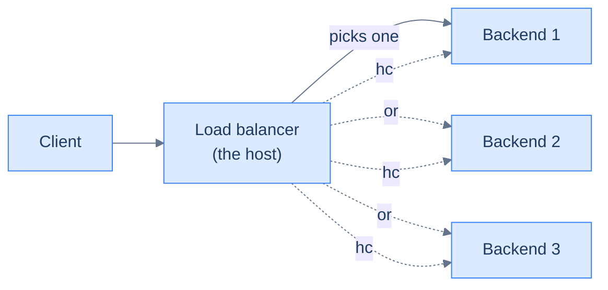

# 7. Load balancing

## TL;DR
> A load balancer is the thing that sits in front of `N` backends and decides which one each request talks to. Two things matter most: **what layer it operates at** (L4 = opaque TCP relay; L7 = HTTP-aware reverse proxy), and **how it picks the backend** (round-robin, least-connections, consistent hashing). The senior moment is consistent hashing: when you add or remove a node, ~`1/N` of the keys re-map instead of ~all of them. We're going to feel that one in a widget. There's a working stack of NGINX + 3 Python backends you can clone and break by the end of this lesson.

## 1. Motivation

In **September 2016**, GitHub published [*Introducing GLB*](https://github.blog/2016-09-22-introducing-glb/) — the design of their custom Layer-4 load balancer. The headline was not the technology; it was the *number*: every web request to github.com went through GLB, and GLB needed to handle the failover when one of its own nodes died **without dropping connections**. The traditional L4 design at the time was a single VIP IP advertised by one node, with a backup taking over via VRRP if it died. The TCP connections to the dead node? Gone.

GLB sidestepped this with two ideas: **ECMP/anycast at the network layer** (every GLB node advertises the same IP via BGP, so the internet's routing fabric does the load-spreading), and **two-tier rendezvous hashing** (any GLB node can figure out which backend a connection belongs to, even if that connection started on a different GLB node). Three years later, [GLB Director](https://github.blog/2019-04-19-glb-director-eight-years-and-some-changes/) moved the data plane into the kernel with eBPF/XDP, pushing the per-packet cost from microseconds to hundreds of nanoseconds — necessary at the scale of "every byte of every git push at GitHub".

You probably don't operate at GitHub's scale. You probably also don't need a custom L4 LB. But you will, *every single design conversation*, encounter someone saying "we'll put a load balancer in front of it" — and what they actually mean varies wildly. **L4 or L7? Which algorithm? What happens when one backend dies? When the LB itself dies? When you change the config?** Those questions separate someone who has shipped a service from someone who hasn't.

That's the lesson.

## 2. Intuition (Analogy)

A load balancer is the **restaurant host**.

- **L4 = a host who looks at parties as they arrive** and points each one to a table. They don't ask what you want; they just spread the load. Fast, simple, doesn't need to read menus. This is enough for many restaurants — and for many services.
- **L7 = a host who asks** "are you here for the bar, the dinner room, or takeout?" before they seat you. They route by what you want. Slower per party (they have to listen), but they can do things like "send party-of-six to the big room and party-of-two to the bar".
- **Round-robin** = "next available table".
- **Least-connections** = "give the big party to the smallest current table; don't pile onto a busy server".
- **Consistent hashing** = "regulars always sit at the same table, so the server already knows their drink order".
- **Health checks** = the host quietly walks around every minute asking each server "still upright?" and stops sending parties to whoever doesn't answer.
- **Sticky sessions** = "table 3 is *yours* for the night; come back here even if the host is at the door". Useful sometimes; awkward when the host needs to rebalance.

Every behaviour the next sections formalise is some variation of these.



<p align="center"><strong>The shape of every load-balancing design. The "or" decision is the algorithm; the "hc" probe is the health check.</strong></p>

## 3. Formal definitions

### 3.1 Layer 4 vs Layer 7

The **L4 / L7** distinction is the single most important load-balancer vocabulary item. It refers to the [OSI layer](/cortex/system-design/building-blocks-networking-primer) at which the LB makes its routing decision.

- **L4** operates on the TCP/IP 5-tuple: source IP, source port, destination IP, destination port, protocol. It does not look inside the TCP payload. Once a connection is established, every packet on that connection goes to the same backend. The LB is essentially a smart NAT.
- **L7** terminates the TCP connection itself, **decrypts TLS**, parses the application protocol (typically HTTP), and *then* decides which backend gets the request. It can route by path, header, cookie, method, request body, anything visible.

This is the L4 topology:

<iframe
  src="/c4/view/buildingblocks_load_balancing_l4"
  width="100%"
  height="420"
  style="border: 1px solid var(--border, #2b2b2b); border-radius: 8px;"
  loading="lazy"
  title="L4 load balancing — opaque TCP relay"
></iframe>

And this is the L7 topology — same client, same backend pool, but the LB in the middle reads the request:

<iframe
  src="/c4/view/buildingblocks_load_balancing_l7"
  width="100%"
  height="420"
  style="border: 1px solid var(--border, #2b2b2b); border-radius: 8px;"
  loading="lazy"
  title="L7 load balancing — HTTP-aware reverse proxy"
></iframe>

| Property | L4 | L7 |
|---|---|---|
| Decision input | 5-tuple (IP + port + protocol) | HTTP request (URL, headers, cookies, body) |
| TLS termination | no — pass-through to backend | yes — LB holds the cert |
| Per-packet cost | low (sometimes kernel-only) | high (parse + re-emit HTTP) |
| Routing rules | "send port 443 to pool A" | "send `/api/*` to pool A, `/static/*` to pool B" |
| Sticky-session support | by 5-tuple hash (good enough often) | by cookie / header (precise) |
| Examples | AWS NLB, GitHub GLB, IPVS, F5 LTM | NGINX, HAProxy, Envoy, AWS ALB, Istio |
| Used by | front of L7 LBs; database / TCP proxies | front of every HTTP service |

The single most useful rule of thumb: **L4 in front of L7**. Production stacks at scale (GitHub, Cloudflare, Netflix) use L4 anycast to terminate the wide-area connection, then forward to an L7 fleet that handles the per-request smarts. The L4 layer gives you geographic fan-out and cheap failover; the L7 layer gives you routing precision.

### 3.2 Algorithms

There are five algorithms you'll see in practice. The first three are about *fairness*; the fourth is about *load awareness*; the fifth is about *stickiness*.

| Algorithm | How it picks | Best for | Footgun |
|---|---|---|---|
| **Round-robin** | strict rotation: backend 1, 2, 3, 1, 2, 3, … | uniform request cost | uneven request cost causes wide tails |
| **Weighted RR** | round-robin with per-backend weight (e.g. 5/2/2) | mixed instance sizes | weights become stale; re-tuning is manual |
| **Random** | uniform random pick | one-off load tests | provably worse tail than round-robin |
| **Least-connections** | backend with fewest in-flight requests | uneven request cost (long-poll, slow API) | tracks connections, not *cost* — long-running idle connections look "busy" |
| **Consistent hashing** | key (e.g. URL or cookie) → ring → backend | cache locality, sharded affinity | hot keys; needs *virtual nodes* to balance load |

The first four you can describe in a paragraph each and the right answer is usually round-robin or least-connections.

The fifth — consistent hashing — is the senior moment of this lesson. It deserves the next subsection.

### 3.3 Consistent hashing — the senior moment

If you use **plain modulo hashing** to assign keys to backends (`backend = hash(key) % N`), then any change in `N` re-maps almost every key. Add one backend, and roughly `(N − 1) / N` of your keys move. For a cache, that means the cache is suddenly *all misses* — the **thundering herd on the origin** that bringing up the cache was supposed to prevent.

Consistent hashing fixes this. Each backend is placed at a position on a circular ring of hash values (`[0, 2³²)` or `[0, 2π)`). Each key is also placed on the ring. A key is owned by the **next backend clockwise** from its position. When you add a backend, only the keys that fall in the arc between the new backend and its clockwise predecessor re-map — approximately `1/N` of all keys. Same when you remove a backend.

Drag the sliders below. With one virtual node per physical, the load distribution is uneven at low node counts — that's the *first* problem with the basic scheme. Crank "virtual nodes per physical" up to 20 or 50 and watch the distribution smooth out. The compare-to-modulo readout below the ring is the punchline of the lesson:

```d3 widget=consistent-hash-ring
{
  "title": "Consistent hashing — drag the sliders, watch which keys remap",
  "nodeCount": 4,
  "nodeRange": [1, 8],
  "virtualNodes": 1,
  "virtualNodeRange": [1, 50],
  "keyCount": 24
}
```

At any setting, the "gap" readout shows how many fewer keys re-map when you add one more node under consistent hashing versus plain modulo hashing. With 4 nodes and 24 keys, modulo will re-map ~18 of 24 keys when you go to 5; consistent hashing re-maps ~5. That's the entire argument for the algorithm.

Consistent hashing is everywhere once you know to look for it. [Memcached client libraries](https://github.com/memcached/memcached/wiki/ConfiguringClient) (libketama since 2007), [Cassandra's partition map](https://cassandra.apache.org/doc/latest/cassandra/architecture/dynamo.html#consistent-hashing), [Amazon Dynamo's partition assignment](https://www.allthingsdistributed.com/files/amazon-dynamo-sosp2007.pdf), [Akamai's edge cache placement](https://www.akamai.com/blog/web-performance/akamai-and-the-evolution-of-caching). [Lesson 8 (caching)](/cortex/system-design/building-blocks-caching), [Lesson 12 (sharding)](/cortex/system-design/building-blocks-sharding-and-partitioning), and [Capstone 37 (URL shortener)](/cortex/system-design/capstones-url-shortener) all reach for this same ring.

### 3.4 Health checks

The LB has to know which backends are alive. Two flavours:

- **Passive** — the LB notices when a backend stops answering its real requests (connection refused, 5xx, timeout), counts the failures within a window, and removes the backend after a threshold. Cheap; no extra traffic; reactive.
- **Active** — the LB periodically pings a `/healthz` endpoint on each backend (every few seconds). Detects failures faster; uses extra bandwidth; pings can mask deeper problems if the health endpoint is shallow.

In open-source NGINX you only get passive (`max_fails` + `fail_timeout`); NGINX Plus and most cloud LBs add active probes. The companion example in `./examples/07-load-balancing-nginx/` ships with passive checks, and the README walks you through inducing a failure to see them fire.

| Question | Passive | Active |
|---|---|---|
| Detection latency | until the next real request | configurable (typically every 2–10 s) |
| Bandwidth cost | zero extra | low but non-zero |
| What it catches | what real users would see | shallower problems (process up but DB connection broken) — depends on what `/healthz` does |
| Where it loses | slow detection under low traffic | a deep dependency outage looks like "every backend is dying" to the LB |

The single most common health-check footgun: **`/healthz` returns 200 without checking dependencies**. Process is up; database is unreachable; LB sees the backend as healthy and keeps sending it doomed requests. The fix is a **deep health check** (`/healthz?deep=1`) that returns 503 if the backend cannot serve a real request — but you want a separate, *shallow* `/healthz` for the LB itself so a deep-dependency hiccup doesn't take everyone out at once. (Lesson 33 on deployments revisits this.)

## 4. Worked example — three backends, induce a failure

In `./examples/07-load-balancing-nginx/` there is a `docker-compose.yml` that brings up one NGINX reverse proxy and three identical Python backends:

```sh
cd content/cortex/system-design/02-building-blocks/examples/07-load-balancing-nginx
docker compose up --build
```

The LB exposes port 8087 on your host. The three backends are only reachable through it — that's how production looks. Now hit it:

```sh
for i in $(seq 1 30); do curl -s localhost:8087/ | jq -r .server; done | sort | uniq -c
#  10 py-1
#  10 py-2
#  10 py-3
```

Round-robin works. Now in another terminal, kill one backend:

```sh
docker compose stop py-2
```

Repeat the curl loop. The first one or two requests to `py-2` will hit the `proxy_next_upstream` retry policy — the user gets a successful response anyway because NGINX silently retries on the next backend. After two failures within 10 seconds, NGINX marks `py-2` down (`max_fails=2 fail_timeout=10s`), removes it from rotation, and the loop returns `py-1` and `py-3` only. Bring `py-2` back:

```sh
docker compose start py-2
```

After 10 seconds, NGINX retries `py-2` and traffic resumes. **No connections were dropped from the user's perspective.** That, plus a handful of config knobs, is most of what production load balancing is.

The README in the examples folder walks through two more drills: switching the upstream policy from round-robin to `least_conn` (and seeing the difference under a `/slow` workload), and switching to consistent hashing on `$request_uri` (and seeing every unique URL stick to the same backend even as the request count grows).

## 5. Trade-offs

| Choice | What you give up | What you get |
|---|---|---|
| L4 only | path-based routing, cookie affinity, TLS termination at the edge | extreme throughput; the LB never decrypts anything; can survive a CPU squeeze |
| L7 only | the ability to scale horizontally beyond what one LB process can decrypt | rich routing, observability per request, retries on 5xx |
| L4 → L7 (both) | one more hop, one more thing to operate | survivable wide-area failover *and* request-level routing |
| Round-robin | uniformity assumption breaks with mixed request cost | trivial to reason about, zero state |
| Least-connections | needs the LB to track in-flight per backend | better tail latency under uneven cost |
| Consistent hashing | a hot key can crush one backend | cache warmth survives node add/remove; cheap to scale up |
| Passive health checks | slow detection under low traffic | zero extra bandwidth; what users see is what the LB sees |
| Active health checks | extra bandwidth; risk of shallow probes | fast detection independent of traffic |
| Sticky sessions | the LB can't redistribute load | session state can live in-memory on a backend (no Redis needed) |

The default modern stack is **L4 anycast → L7 (NGINX/HAProxy/Envoy) round-robin or least-connections → backends with both passive health checks and a `/healthz` that returns 503 when the backend cannot serve real requests**. Reach for consistent hashing when (and only when) you need cache locality or sharded affinity.

## 6. Edge cases and failure modes

### 6.1 Cold backend slow-start

A freshly-added backend has cold caches, empty JIT profiles, and untouched connection pools. Sending it 1/Nth of traffic from the first second hammers it. The fix is **gradual ramp-in**: NGINX's `slow_start` directive (Plus only), or — in plain NGINX — bring the backend up with a small weight and increase it over a few minutes. Envoy has a built-in `slow_start_config`. The principle: never send a fresh backend its full share.

### 6.2 Health-check stampede on backend restart

If many backends restart simultaneously (a rolling deploy, say), the LB's active checks all fire against `/healthz` together — and if `/healthz` does any real work, you can crash a freshly-started backend by health-checking it too eagerly. Solution: **stagger health checks** (jitter the interval), and make `/healthz` an *order-of-magnitude cheaper* endpoint than any real request.

### 6.3 Asymmetric load with the wrong algorithm

`/api/checkout` takes 500 ms. `/api/health` takes 5 ms. Round-robin distributes them evenly across backends. The result: every backend has roughly equal request *count* but wildly different latency. Switch to `least_conn` and the LB preferentially routes new requests away from busy backends — measurable improvement at p99. (The example folder demonstrates this with `/slow`.)

### 6.4 Hot keys under consistent hashing

Consistent hashing distributes *keys* evenly, but **not request rate**. If 80% of your traffic is for one key (the "viral video" problem), that one key's backend is 80% loaded while the rest are idle. The remedy is to **add virtual nodes** (which spreads load more uniformly), or to **replicate** the hot key across multiple backends with explicit fan-out. The widget above shows the virtual-node effect; [Lesson 12 (sharding)](/cortex/system-design/building-blocks-sharding-and-partitioning) revisits hot-key remediation in depth.

### 6.5 Session affinity defeats rebalancing

`ip_hash` and cookie-based affinity tell the LB "this client always goes to backend 3". When backend 3 dies, all those sessions die with it (or fall over to a fresh backend, where they don't have their session state). Affinity is useful for *cache warmth*, dangerous for *correctness*. The senior fix: keep session state in a shared store (Redis, the database) and let the LB redistribute freely.

### 6.6 The LB itself is a SPOF

A single LB instance in front of N backends just moved the failure point one hop. The fixes: an L4 LB in front of the L7 LBs (so multiple L7s share the public IP via anycast); a hot standby with VRRP/keepalived (one LB takes over the floating IP if the primary dies); or a managed cloud LB whose underlying redundancy is the cloud provider's problem. **Never run a single LB in production unless your service can be down for whatever reason you choose.**

## 7. Practice

### Exercise 1 — Algorithm choice from symptoms

You operate an HTTP API behind NGINX with `round_robin`. p50 latency is 80 ms; p99 is 2.5 s. You add CPU monitoring and observe that all three backends have roughly equal request counts, but their CPU usage is wildly uneven (one is at 95%, two are at 30%). What's the most likely problem and which algorithm change would help?

<details>
<summary>Solution</summary>

This is the classic **uneven request cost** failure mode. Round-robin assumes all requests cost the same in CPU. The symptom — equal request *count* but unequal CPU — tells you some requests cost much more than others, and round-robin is routing the next expensive one to whichever backend happens to be next in line.

Switch to `least_conn`. It will preferentially route new requests to the backend with the *fewest in-flight* connections, which under uneven cost is the backend whose current work is mostly fast requests. p99 should drop significantly.

Deeper fix if `least_conn` doesn't fully solve it: separate the expensive endpoints onto a dedicated backend pool with its own LB rule (an L7 routing decision based on path), so the expensive work doesn't share a queue with the cheap work.

</details>

### Exercise 2 — Consistent hashing math

You operate a Memcached fleet of 8 nodes. You're scaling to 9 nodes. Compare the cache-miss spike under modulo hashing vs consistent hashing with 100 virtual nodes per physical, given a steady-state 95% hit rate before the scale-out.

<details>
<summary>Solution</summary>

**Modulo hashing.** Going from `N = 8` to `N = 9` re-maps essentially every key whose `hash(k) % 8 ≠ hash(k) % 9`. The fraction that remap is roughly `(N − 1) / N = 8/9 ≈ 89%`. So 89% of your keys are now in the "wrong" cache slot — the next read for any of them is a miss.

If steady-state hit rate was 95% (5% miss = 5% of read traffic hitting the origin), the spike pushes effective miss rate to roughly `89% × 100% + 11% × 5% ≈ 89.5%` immediately after the scale-out. Origin traffic *18× normal*. This is a major incident.

**Consistent hashing with 100 vnodes/physical.** Approximately `1/9 ≈ 11%` of keys re-map (the ones whose owning vnode position is now between the new node's vnode positions and the next clockwise vnode of an old node). So 11% of keys are remapped, miss-rate spike is `11% × 100% + 89% × 5% ≈ 15.5%`. Origin traffic ~3× normal — manageable.

The 6× difference in origin load *during the scale-out* is exactly why every production cache in 2026 uses consistent hashing (or rendezvous hashing, which has similar properties).

</details>

### Exercise 3 — Health-check design

Your service depends on Postgres. You define `/healthz` to (a) check the process is up *and* (b) run a `SELECT 1` against Postgres. Postgres has a 30-second hiccup. What does the LB see, and what do users see?

<details>
<summary>Solution</summary>

The LB hits `/healthz` on every backend at, say, a 5-second interval. During the 30-second Postgres hiccup, *every backend's* `/healthz` returns 503 (Postgres unreachable). After `max_fails` triggers (say, 2 failures), the LB evicts every backend. The LB now has *zero* healthy backends.

What users see depends on the LB's behaviour with no healthy upstreams: most LBs return 502 to the client. Every request fails. The hiccup is a 30-second window; the LB recovers approximately 5–10 seconds after Postgres recovers (one `fail_timeout` cycle).

The actual cause is the deep health check. **If the health check is tied to a shared dependency, every backend looks unhealthy when that dependency hiccups — and the LB doesn't even try the request that might have succeeded.**

The fix: **two health endpoints**.
- `/healthz` (shallow) — process is up and the LB should keep me in rotation. Returns 200 unless the *process itself* is dying.
- `/ready` (deep) — am I able to serve real requests? Used by orchestrators (Kubernetes readiness probes) for traffic gating during deploys, not by the LB for routing.

The LB hits `/healthz`. During the Postgres hiccup, all backends look healthy; some requests fail with 503 (the *real* response when Postgres is down); users see degradation but not a total outage. Far better than evicting every backend.

</details>

## 8. In the Wild

- **[GitHub — Introducing GLB](https://github.blog/2016-09-22-introducing-glb/)** (2016) and **[GLB Director: Eight years and some changes](https://github.blog/2019-04-19-glb-director-eight-years-and-some-changes/)** (2019). The clearest write-up of an L4 LB built from first principles, including the rendezvous-hashing trick that lets any GLB node figure out which backend a connection belongs to.
- **[Karger et al., *Consistent Hashing and Random Trees*](https://www.akamai.com/site/en/documents/research-paper/consistent-hashing-and-random-trees-distributed-caching-protocols-for-relieving-hot-spots-on-the-world-wide-web-technical-publication.pdf)** (STOC 1997). The paper that started it all. Short, readable, and the algorithm is exactly what the widget above visualises.
- **[Cassandra — Consistent hashing & vnodes](https://cassandra.apache.org/doc/latest/cassandra/architecture/dynamo.html#consistent-hashing)**. Production write-up of why virtual nodes are not optional at scale.
- **[NGINX upstream module reference](https://nginx.org/en/docs/http/ngx_http_upstream_module.html)**. The actual config knobs (`weight`, `max_fails`, `fail_timeout`, `slow_start`, `hash $key consistent`). Worth bookmarking.
- **[AWS — choosing between NLB and ALB](https://docs.aws.amazon.com/elasticloadbalancing/latest/userguide/introduction.html)**. NLB is L4; ALB is L7. The doc is dry but the decision matrix is real.

---

> **Next:** [8. Caching](/cortex/system-design/building-blocks-caching) — once you have multiple backends fronted by a load balancer, the next question is what they're allowed to cache, where the cache lives, and what happens when the cache is wrong. Consistent hashing makes another appearance there: distributed caches use the same ring math to decide *which* cache node owns each key.
