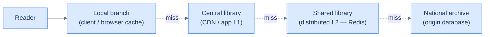

# 8. Caching

## TL;DR
> A cache is a copy of expensive state placed somewhere cheap. Caches exist at four tiers (client, CDN, application, distributed) and use four strategies (cache-aside, write-through, write-back, write-around). Eviction is policy (LRU / LFU / ARC). The two hard problems — Phil Karlton called them out decades ago — are **invalidation** and **naming**, but every production engineer knows the *real* second hard problem is the **cache stampede**: a popular key expires and a hundred concurrent reads all miss together and hammer the origin. We're going to feel the stampede in a widget and fix it in a working `docker compose` stack.

## 1. Motivation

In **April 2013**, Rajesh Nishtala and colleagues at Facebook published [*Scaling Memcache at Facebook*](https://www.usenix.org/system/files/conference/nsdi13/nsdi13-final170_update.pdf) at NSDI — what is still the canonical write-up of caching at hyperscale. By that point, Memcache served more than a *billion* requests per second across Facebook's infrastructure. The paper is concrete and unflinching about the failure modes, but the one that stuck in the industry's vocabulary is the section on **lease-based stampede prevention**. The setup: a heavily-read key expires; in the milliseconds before it's repopulated, every request misses and every request goes to the origin database. The same database that exists *because* the cache reduces its load. Without intervention, the origin trips, the cache stays cold, the load shifts to the origin permanently — and the site is down.

Facebook's fix was a 64-bit token (a "lease") that the cache gives to the *first* client to miss. That client must fill the cache; everyone else gets a hold token and retries. One origin fetch per cold key, no matter how many concurrent readers. Six years later, [Stack Overflow published its own caching architecture](https://nickcraver.com/blog/2019/08/06/stack-overflow-how-we-do-app-caching/) — Redis-backed, with two layers (in-process L1 + shared L2), pre-warming, and explicit handling of the same coalescing problem. Different scale, different stack, same shape.

You may not be operating at Facebook scale. You will, almost certainly, hit a cache stampede at some point in your career. The patterns that prevent it are simple. The lesson is recognising the shape early enough to apply them before you're in an incident channel.

## 2. Intuition (Analogy)

A cache is a **library system**.

- Your local branch keeps a small popular shelf. You walk over, pull the book, done. Microseconds.
- If the book isn't on the popular shelf, the librarian goes to the **central city library** down the road. A few minutes.
- If the book isn't in the central library either, a runner takes a van to the **national archive**. Half a day.

Three things follow immediately. First, **the popular shelf has limited space** — older books get returned to central (eviction). Second, **the popular shelf doesn't know when the book changes** at the archive — if someone amends the book, your local branch is still serving the old copy (invalidation). Third, **if a hundred people all want the same book at the same time** and the branch doesn't have it, the librarian has to either ask them to wait while one runner fetches it, or send a hundred runners to the archive at once (stampede). The librarian who picks "send a hundred runners" creates an outage at the archive.

Every part of the next sections is a variation on these.



<p align="center"><strong>Cache tiers as a library hierarchy. Hits at each level shorten the trip.</strong></p>

## 3. Formal definitions

### 3.1 Four tiers

A cache can live at four places in the request path. Each tier shortens the trip for a different population of reads.

<iframe
  src="/c4/view/buildingblocks_caching_overview"
  width="100%"
  height="460"
  style="border: 1px solid var(--border, #2b2b2b); border-radius: 8px;"
  loading="lazy"
  title="Caching — four tiers (client → CDN → app caches → origin)"
></iframe>

| Tier | Lives where | Typical hit cost | What it cheaply serves | The hard bit |
|---|---|---|---|---|
| **Client** | Browser HTTP cache, service worker, mobile-app local store | ~0 ms | static assets, idempotent GETs, user-specific data | invalidation across devices |
| **CDN edge** | Edge POP near the user | 5–30 ms | static + cacheable API responses | regional consistency, cold-edge stampedes |
| **Application** | In-process LRU on the app server | 1–10 µs | hot per-instance data | per-instance staleness — invalidation across the fleet is *hard* |
| **Distributed** | Redis / Memcached cluster, separate from app | 0.3–2 ms intra-DC | anything the fleet should agree on; rate limiters; sessions | hot keys, sharding by [consistent hash](/cortex/system-design/building-blocks/load-balancing) |

The four tiers are not mutually exclusive — production systems run **all of them**. The combination is sometimes called an "L1/L2 cache" by analogy with CPU caches: L1 is the in-process LRU, L2 is the distributed Redis. Stack Overflow runs exactly this shape; so does Facebook (Nishtala et al. §3.2).

### 3.2 Four strategies

A "cache strategy" answers two questions: *who writes the cache* and *what happens when the data changes*. There are four common combinations.

| Strategy | Read path | Write path | Best for | Footgun |
|---|---|---|---|---|
| **Cache-aside** | app reads cache; on miss, app reads origin, writes cache | app writes origin, **invalidates** the cache key | the default — works with any cache and any database | stampedes, race between writer's invalidate and reader's read-then-write |
| **Read-through** | app reads cache; cache library reads origin on miss | app writes origin (cache library handles invalidation) | cleaner code, when the cache library is mature (e.g. CDNs) | tighter coupling to one cache library |
| **Write-through** | reads from cache | app writes cache **and** origin synchronously | strong consistency needs | writes are slower by the origin's write latency |
| **Write-back / write-behind** | reads from cache | app writes cache; cache asynchronously flushes to origin | extreme write throughput | **data loss** if the cache dies before the flush; ordering bugs |

A separate axis is **what to do with writes on cache miss**: a *write-around* policy says "don't populate the cache on a write; let the next read miss handle it". This is usually the right default for writes you don't expect to be read soon (analytics events, log lines).

### 3.3 Eviction policy

Caches have finite memory. When full, they must throw something out. Three policies cover ~99% of practice:

- **LRU (least recently used)** — evict the item not touched in longest. Simple, good for *working-set* workloads (a stable hot set).
- **LFU (least frequently used)** — evict the item read the fewest times. Better when popularity is stable and skewed; LRU loses to one-off scans.
- **ARC (adaptive replacement)** — dynamically blends LRU and LFU, tracking both recency and frequency. Used in ZFS and a few other systems where workload mix shifts.

In practice the most-used cache library you've heard of (Memcached, Redis, NGINX, browser HTTP cache) defaults to LRU. The most-used database I/O cache (PostgreSQL's `shared_buffers`) uses a clock-sweep approximation of LRU. ARC was patented for years (the patent has since expired) and is seeing renewed interest.

### 3.4 The two hard problems

> *"There are only two hard things in Computer Science: cache invalidation and naming things."* — Phil Karlton

Karlton got the first half right. The second half should arguably be **cache stampedes** — the same problem from a different angle.

**Invalidation** — telling the cache that a value is stale. The cache-aside pattern's `app writes origin, then deletes the cache key` is racy: between the write and the delete, a concurrent reader can read the *old* origin value (if the write hasn't propagated through replication yet), then write it *back* to the cache. You just re-cached the old value after the write. Fixes: write-through, delete-after-write with versioning, or accept the race and bound staleness via short TTLs.

**Stampedes** — many concurrent readers all missing on the same cold key. The next section makes this visceral.

## 4. Worked example — the cache stampede, with and without coalescing

Imagine a popular page on your site whose backing query takes 100 ms at the origin. You cache the result with a 60-second TTL — fine in steady state. At minute 1, the TTL expires; in the next 100 ms, your service is hit by 100 concurrent requests for that page. With no coalescing, all 100 of them miss the cache, all 100 of them fire the same expensive origin query at the same time, the origin sees 100 inflight queries instead of 1, and — if the origin's connection pool was 50 — half the queries time out and the cache stays cold.

The widget below makes the difference visceral. Drag the **concurrency** slider; watch the left rectangle (naive read-through) grow tall while the right rectangle (with coalescing) stays one unit tall. The area of each rectangle is the origin's total work for one cold-key event.

```d3 widget=cache-stampede
{
  "title": "Cache stampede — N concurrent reads of a cold key, with and without coalescing",
  "concurrency": 100,
  "concurrencyRange": [10, 500],
  "originLatencyMs": 100,
  "originLatencyRange": [10, 500],
  "originCapacity": 50
}
```

The **most-misunderstood readout** is the third row — user-visible p99 latency. Coalescing **does not** lower the latency that any individual caller observes. Every caller still waits ~`originLatencyMs` for the in-flight fetch to complete. What coalescing wins is the *origin's* load — 1 fetch instead of N. If you also want to lower the user-visible latency on cache misses, you reach for **stale-while-revalidate** instead: serve the *old* value while you asynchronously refresh in the background, so users only see the freshness lag, not the origin's latency.

The runnable in [`./examples/08-caching-redis-stampede/`](./examples/08-caching-redis-stampede/) brings up one Python service in front of one Redis, with two endpoints — `/no-coalesce` and `/coalesced`. The README walks the reader through firing 50 concurrent requests at each on a cold cache and reading off the origin's hit counter. The naive endpoint shows `{"origin_hits": 50}`; the coalesced one shows `{"origin_hits": 1}`.

The coalescing implementation is small — a Redis `SETNX` with TTL, a bounded poll loop, and an explicit lock release:

```python
got_lock = r.set(LOCK_KEY, "1", nx=True, ex=LOCK_TTL_SEC)
if got_lock:
    try:
        value = fetch_from_origin()
        r.setex(CACHE_KEY, CACHE_TTL_SEC, value)
        return value
    finally:
        r.delete(LOCK_KEY)
else:
    # someone else is fetching; wait for the cache
    deadline = time.time() + LOCK_TTL_SEC
    while time.time() < deadline:
        v = r.get(CACHE_KEY)
        if v is not None:
            return v
        time.sleep(0.020)
    raise Timeout("lock holder did not fill cache in time")
```

In Go this pattern is one library import (`golang.org/x/sync/singleflight`). In Scala it's a `Concurrent[F].memoize`. In Java the canonical version is `CompletableFuture` cached by key. In Python with asyncio you can do it with a per-key `asyncio.Lock`. Every grown-up language has a shape for this.

## 5. Trade-offs

| Choice | What you give up | What you get |
|---|---|---|
| No cache | the read-side speed boost | guaranteed freshness; one less thing to operate |
| In-process cache only | cross-instance staleness; cold start on each restart | µs latency on hits; no extra service |
| Distributed cache (Redis) | another service to operate; an extra hop on every read | shared invalidation, sub-ms hits across the fleet |
| Cache-aside | races between write + invalidate | works with any cache; cleanest mental model |
| Write-through | per-write latency = max(cache, origin) | strong consistency on cache vs origin |
| Write-back | data loss on cache crash | extreme write throughput |
| LRU | poor under one-off scans | trivially correct on working-set workloads |
| LFU | poor under shifting popularity | great when popularity is stable + skewed |
| Coalescing on miss | one more Redis primitive per cold key | N× origin load reduction at the moment that matters |
| Stale-while-revalidate | a controlled freshness lag | bounded user-visible latency on misses |
| Short TTL | more origin pressure | quicker invalidation propagation |
| Long TTL | longer staleness lag | less origin pressure |

The default 2026 stack at a startup is: **CDN edge for static + cacheable APIs; in-process LRU L1 + Redis L2 with cache-aside; coalescing on the hot keys you can identify; TTL in the 30–300 s band with jitter; stale-while-revalidate for anything user-facing**.

## 6. Edge cases and failure modes

### 6.1 Thundering herd on TTL expiry

The single most common cache failure in production. A hot key's TTL fires while traffic is at peak; in the 100–500 ms window before some lucky caller refills it, every other concurrent reader misses. Without coalescing, your origin gets a spike proportional to *traffic × miss-window-duration*. The mitigations stack:

- **Coalescing / leases**, as demonstrated above.
- **TTL jitter** — instead of a flat 60-second TTL, use `60 + rand(-10, +10)`. Spreads expiries; reduces synchronised cliff.
- **Stale-while-revalidate** — serve the expired value while asynchronously refreshing.
- **Cache warming** — proactively refresh popular keys before they expire, e.g. a background job that re-queries the top-1% of keys.

### 6.2 Cold-start stampede

A new app process or a new CDN POP has an empty cache. The first request for *every* hot key misses. If you bring up the new instance during peak traffic, the origin sees a synchronised flood. Mitigations: **gradual ramp-in** (NGINX `slow_start` in [Lesson 7](/cortex/system-design/building-blocks/load-balancing)), explicit **pre-warm** scripts that hit the new instance with synthetic traffic before adding it to rotation, or **shared L2** so the new L1 misses fall through to a warm shared cache rather than the origin.

### 6.3 Negative caching footgun

If your code only caches successful lookups, every miss for a key-that-doesn't-exist re-queries the origin forever. Bot traffic probing random IDs becomes a DoS amplifier on your database. The fix is **negative caching** — cache the "not found" answer with a short TTL (typically 5–30 s). DNS resolvers do this; you should too.

### 6.4 Cache invalidation under multi-writer

Two writers race: Writer A updates the row, then deletes the cache key; Writer B did the same a millisecond later for the same row but their delete fires before A's update has propagated to the replica that Reader R is about to query from. R reads the old value, writes it back to the cache. Now the cache has the OLD value indefinitely (until TTL).

Fixes: write-through with serial updates, version-stamped cache values (`{"v": 17, "data": ...}` — readers refuse to overwrite a higher version), or just accept the race and bound staleness with short TTLs. [Lesson 11 (replication)](/cortex/system-design/building-blocks/replication) revisits the underlying replication-lag mechanism.

### 6.5 Hot key on a distributed cache

Even with consistent hashing across Redis shards, **one** key can still be 80% of traffic — the celebrity user's profile, the viral video's metadata. That key's shard saturates while the rest of the cluster is idle. Mitigations:

- **Replicate the hot key** across multiple shards explicitly; the client picks one at random.
- **L1-in-front**: cache the hottest 100 keys in process on every app server so they never reach Redis.
- **Sharding by composite key**: if the access pattern is `(user_id, item_id)`, hash on `item_id` AND on `user_id % K` to spread the load.

[Lesson 12 (sharding)](/cortex/system-design/building-blocks/sharding-and-partitioning) explores hot-shard remediation in depth.

### 6.6 Write-back data loss

`cache.set(key, value)` returns; app moves on; before the async flush to origin, the cache process crashes. The value is gone. Write-back trades durability for throughput; if your data is ledger-shaped, you cannot use it. If it's *session* or *analytics-event*-shaped, the trade is often worth it. The senior move is to be **explicit** about which datasets accept the trade — never accidentally.

## 7. Practice

### Exercise 1 — Compute the stampede pressure

Your service handles 10,000 requests per second. A particular page's read backed by a 50 ms origin query is cached with a 60-second TTL. The page accounts for 5% of traffic. **At each TTL expiry**, how many requests will miss the cache before the first caller refills it? How does that compare to the origin's capacity if the origin can handle 200 concurrent queries?

<details>
<summary>Solution</summary>

The page is read at 5% × 10,000 = **500 requests per second** in steady state. When the TTL expires, the *next* read takes 50 ms to refill the cache. During those 50 ms, 500 × 0.050 = **25 requests** arrive and all miss.

Without coalescing, the origin briefly sees 25 inflight queries for one page — well within the 200-concurrent budget, so this particular page doesn't crash the origin. The stampede is *uncomfortable* but not fatal.

Now suppose the page goes viral and read-rate climbs to 50,000 req/s (1% of a 5M-req/s service). The stampede on TTL expiry becomes 50,000 × 0.050 = **2,500 concurrent origin queries**. That's 12.5× the origin's capacity. Without coalescing, the origin's connection pool gets exhausted, every request times out, *the cache is never refilled*, and the stampede recurs every TTL window.

The takeaway: stampede pressure scales linearly with traffic × miss-window-duration. Coalescing turns it into a constant 1, independent of traffic.

</details>

### Exercise 2 — Why doesn't coalescing lower user-visible latency?

Your team adds coalescing to every cached endpoint. The origin load drops dramatically. A skeptical engineer points out: "But the p99 latency reported by our load tests is the same — actually slightly *higher*. Coalescing didn't help users at all." Are they right? Explain when the user-visible latency might in fact be lower under coalescing.

<details>
<summary>Solution</summary>

The skeptical engineer is *partly* right. For a cold-key fan-out:

- **Without coalescing**, the origin receives N concurrent queries. If N ≤ origin capacity, each query completes in ~50 ms; users see ~50 ms p99. **If N > origin capacity**, some queries queue, some time out, and the slowest user sees minutes (or a 5xx).
- **With coalescing**, the origin receives 1 query that takes 50 ms; all N callers wait ~50 ms for it; users see ~50 ms p99, plus a few ms of polling overhead.

So in the *capacity-respecting* regime, coalescing slightly *increases* per-user latency (the polling overhead) without changing the steady-state floor. But in the *capacity-exceeding* regime, coalescing keeps the system on the safe side of the cliff — that's when it dramatically improves user-visible p99 (by keeping it bounded instead of catastrophic).

The deeper answer: **coalescing protects the origin from cliff-edge load**. The user-visible benefit appears only when you compare the *capacity-respecting* coalesced path vs. the *capacity-exceeding* naive path. To also lower latency on misses, reach for [stale-while-revalidate](https://datatracker.ietf.org/doc/html/rfc5861): serve the expired value immediately, refresh in the background. Users see no miss latency at all (only the small staleness lag of the expired data).

</details>

### Exercise 3 — Design a deep health check that survives a stampede

In [Lesson 7](/cortex/system-design/building-blocks/load-balancing) we said "`/healthz` should be cheap; `/ready` can be deep". Your `/ready` endpoint runs a representative query against the database. Suppose the load balancer hits `/ready` on every backend every 5 seconds. The cache fronting the database has a 60-second TTL on the readiness query result. Walk through what happens when the cached readiness result expires, and design a `/ready` that doesn't itself contribute to a stampede.

<details>
<summary>Solution</summary>

What happens naively: the 60-second TTL on the cached `/ready` result expires; the LB pings `/ready` on every backend in the next 5 seconds; each ping misses; each miss fires a fresh DB query. If there are 10 backends with stagger ~0.5 s, you get ~10 DB queries from `/ready` alone in the next 5 seconds — for a single readiness check.

Worse: if the DB is itself under load and `/ready` is meant to detect that, the readiness queries become part of the load they're trying to measure. Classic observability paradox.

Two designs that fix this:

1. **`/ready` returns its cached signal directly.** A *separate* background worker (one per backend, jittered) refreshes the readiness cache once every 30 s by hitting the database with one query. `/ready` itself only reads from the cache — sub-millisecond, no origin pressure, no stampede risk. The LB and the readiness query are decoupled.

2. **`/ready` uses coalescing.** Treat the readiness query like any cached endpoint — first miss takes a lock, the next 9 readiness pings within the 50 ms readiness window wait on it. Cleaner code, but the DB still sees one query per cold-cache event per backend, which is more frequent than option 1's centralised refresh.

Option 1 is the production-grade answer. The general principle: **health checks must be cheap by design, not by accident**. If the answer to "is the system healthy" requires querying the system, then the query itself becomes a contributor to unhealth.

</details>

## 8. In the Wild

- **[Nishtala et al., *Scaling Memcache at Facebook*, NSDI 2013](https://www.usenix.org/system/files/conference/nsdi13/nsdi13-final170_update.pdf)** — the canonical write-up. Read §3 (regional caching), §4 (cross-region) and §5 (single-server optimisations). The lease pattern is in §3.2 (Reducing Load).
- **[Nick Craver, *How we do app caching at Stack Overflow*](https://nickcraver.com/blog/2019/08/06/stack-overflow-how-we-do-app-caching/)** (2019). Real architecture write-up with the L1/L2 split, Redis primitives, and the cache-key naming conventions they evolved.
- **[Cloudflare — *Cache stampede prevention with the Workers Cache API*](https://blog.cloudflare.com/scalably-serving-resources-from-a-cache/)**. Edge-side coalescing at CDN scale; introduces the same primitives in a different shape.
- **[RFC 5861 — HTTP `stale-while-revalidate` and `stale-if-error`](https://datatracker.ietf.org/doc/html/rfc5861)**. The HTTP-level standard for serving stale content while asynchronously refreshing. Every CDN supports it.
- **[golang.org/x/sync/singleflight](https://pkg.go.dev/golang.org/x/sync/singleflight)** — the canonical request-coalescing primitive in Go's stdlib-adjacent libraries. ~100 LOC; worth reading the source.

---

> **Next:** [9. Relational databases](/cortex/system-design/building-blocks/relational-databases) — now that you've got an in-memory cache absorbing most of the read load, the next question is what the *origin* looks like under the remaining load. Schema, indexes, transactions, isolation levels, query plans. We'll get our hands on PostgreSQL `EXPLAIN ANALYZE` and watch a B-tree walk.
