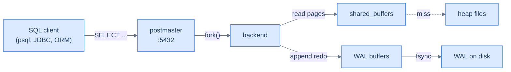

# 9. Relational databases

## TL;DR
> A relational database is a **bookkeeper** with a very particular set of rules. Schema is the ledger's column layout; primary keys are entry numbers; foreign keys are "see also #..."; indexes are the alphabetised lookup books at the front. Transactions are sessions where multiple entries commit as one — and isolation levels decide what other bookkeepers may see of your half-done work. The senior moves: **read the EXPLAIN plan, understand which index the planner picked and why, and pick the right isolation level for the read pattern**. Well-tuned Postgres on a single server happily serves billions of queries a day — Stack Overflow does the world's traffic on two SQL Servers — so reach for "let's distribute it" only after exhausting the single-machine envelope.

## 1. Motivation

In **February 2016**, Nick Craver published [*Stack Overflow: The Architecture — 2016 Edition*](https://nickcraver.com/blog/2016/02/17/stack-overflow-the-architecture-2016-edition/). The site served roughly **2 billion page views per month**, and the number that stuck with the industry was buried in the hardware list: **2 SQL Servers**, primary + replica, holding the whole canonical state of the network. Two database servers ran the entirety of Stack Overflow, Server Fault, Super User, and the other ~170 Stack Exchange sites combined — 384 GB of RAM and ~4 TB of PCIe SSD, peak ~11,000 queries per second. That's it.

What lets one Postgres or one SQL Server go that far is not magic. It's the same toolkit the rest of the industry has and routinely doesn't use well: well-indexed schemas, queries shaped to the planner's strengths, sane isolation levels, the disciplined operational hygiene of `ANALYZE` / `VACUUM` / monitoring. Three years later, [Kyle Kingsbury's Jepsen analysis of Postgres 12.3](https://jepsen.io/analyses/postgresql-12.3) showed that even the *isolation levels* are subtler than the documentation lets on — the SQL standard, Postgres's documentation, and the actual implementation each tell a slightly different story.

The lesson is two things. First, before reaching for an exotic distributed datastore, **find out where the cliff actually is** on a properly-tuned single relational database — usually further than the team's gut estimate. Second, **read the EXPLAIN plan** for slow queries; the diagnostic is built in, and it tells you everything.

One framing before we start: everything here optimises the **OLTP** pattern — many small transactions, each touching a handful of rows by key, reading and writing the latest state. The opposite workload — **OLAP**, scanning billions of rows to compute one aggregate — wants a different engine entirely (column stores, covered in the analytics material). Don't reach for the techniques here to make a reporting query fast.

## 2. Intuition (Analogy)

A relational database is a **bookkeeper's office**.

- The **ledger** is the table: rows are entries, columns are pre-agreed fields. Every entry has an **entry number** (the primary key). When one entry refers to another, it writes "see also #42" — that's a foreign key.
- The bookkeeper keeps **lookup books** at the front of the office: alphabetised name → entry-number, date → entry-number, category → entry-number. These are the indexes. Without them, finding "the entry with `email = needle@example.com`" means flipping through every page of the ledger.
- When a customer wants to make several changes that must succeed or fail together, the bookkeeper opens a **transaction** — pens entries on a draft page, balances them, and only when satisfied stamps them into the ledger. Other bookkeepers, depending on the **isolation level** in force, either can or cannot see the draft mid-write.
- Before any entry hits the ledger's permanent page, the bookkeeper writes it on a **carbon copy** (the WAL — write-ahead log) so that if the building burns down mid-entry, the next morning's bookkeeper can replay the carbons and reconstruct the state.
- Periodically the bookkeeper goes through and crosses out the dead entries (entries marked deleted by old transactions that have since committed). This is the **autovacuum**. If they don't keep up, the ledger fills with strikethroughs and queries get slower (this is *bloat*).
- When the customer asks "how would you find this entry?", the bookkeeper draws a small flowchart: "first check the email index, get the entry number, flip to that page". That's the **EXPLAIN plan**.



<p align="center"><strong>What's running on the server side. The container view below has the full process model.</strong></p>

## 3. Formal definitions

### 3.1 The Postgres process model

A Postgres "server" is not one process — it's a small fleet of cooperating processes that share a chunk of memory (`shared_buffers`) and a set of on-disk files. Understanding which process does what is the foundation of every later operational decision.

<iframe
  src="/c4/view/buildingblocks_relational_databases_internals"
  width="100%"
  height="600"
  style="border: 1px solid var(--border, #2b2b2b); border-radius: 8px;"
  loading="lazy"
  title="PostgreSQL — what is actually running"
></iframe>

| Process | What it does | Why you care |
|---|---|---|
| `postmaster` | accepts connections, forks backends, supervises crashes | the entry point; if it dies, the cluster dies |
| `backend` | one per connection — parses, plans, executes SQL | ~10 MB resident each; production needs pgbouncer to multiplex |
| `WAL writer` | flushes the WAL buffer to disk on commit | the `fsync` here is the durability bottleneck |
| `bgwriter` | trickles dirty pages from `shared_buffers` to disk | smooths I/O so backends rarely block on a flush |
| `checkpointer` | periodic full sync — flushes everything, advances WAL trim | a slow checkpoint = a latency spike for everyone |
| `autovacuum` | reclaims dead tuples from MVCC | if blocked, the table bloats and queries slow down |

The whole shape is the same in MySQL, SQL Server, Oracle — different names, same responsibilities. Once you know what's running, you know what each operational knob is trying to manage.

### 3.2 Schema design and normalisation

A *good* schema is one where each fact lives in exactly one place. The discipline that gets you there is **normalisation** — a stepwise process for eliminating redundancy:

- **1NF** — every column holds a single atomic value (no comma-separated lists in a column).
- **2NF** — every non-key column depends on the *whole* primary key (no partial dependencies in composite-key tables).
- **3NF** — every non-key column depends on the key, *only* on the key, and *nothing but* the key.

In practice, "3NF or better" is the right default. **Denormalisation** — deliberately duplicating data — is a tactical move for specific read-heavy workloads (a materialised view, a precomputed counter), not the architectural default.

### 3.3 Indexes

An index is a separate data structure that maps **a key (column value) → row location on disk**. The default index in every relational database in 2026 is the **B-tree** — Postgres calls it `btree`, MySQL/InnoDB makes it the *primary* organisation of the table itself.

A B-tree on `N` rows has depth `⌈log_fanout(N)⌉`. A B-tree's branching factor is typically several hundred (DDIA's worked figure: a 4-level tree at branching factor 500 holds ~250 TB); on Postgres's 8 KiB page with wide keys, plan for ≈ 100–300 entries per page. At ≈ 100, a million-row table has a B-tree of depth 3, and depth stays at 3–4 levels for anything short of petabyte scale. A *cold* point lookup touches one page per level (~3 random reads at a million rows); in practice the top levels live in cache, so a *warm* lookup is often a single read or fewer — which is exactly what the `Buffers: shared hit=4` line in the worked example below shows (all cache hits, zero disk reads). Drag the slider below from 100 rows to 100 million and the depth barely moves — it grows by just one level per ~100× more rows (≈1 to ≈4 across the whole range). The sequential-scan alternative, by contrast, grows linearly with table size (≈ `N / rowsPerPage` pages) — by 1 M rows the index is ~1000× faster, by 100 M rows ~100 000×.

```d3 widget=btree-walker
{
  "title": "B-tree lookup vs sequential scan — page reads per query, by table size",
  "rowCount": 1000000,
  "rowCountRange": [100, 100000000],
  "fanout": 100,
  "rowsPerPage": 100,
  "randomReadMs": 0.1,
  "sequentialReadMs": 0.01
}
```

Two storage shapes are worth knowing. A **clustered index** stores the whole row *inside* the index (InnoDB's primary key is always clustered — that's the "primary organisation of the table" above), whereas Postgres keeps rows in a separate **heap** file and the index merely points at heap locations. A **covering index** (`CREATE INDEX ... INCLUDE (cols)`) is the middle ground: it copies extra columns into the index so a query can be answered from the index alone, never touching the heap. That's what makes an **Index Only Scan** (§4) possible. The cost is the usual one — more disk, slower writes.

Beyond B-trees, Postgres also offers:

| Index type | Best for | Footgun |
|---|---|---|
| **B-tree** (default) | equality + range on ordered columns | bloat under heavy updates |
| **Hash** | equality only, very narrow keys | no range or ordering at all, and little real advantage over B-tree (which already does equality well) — rarely the right choice; also not crash-safe before PG 10 |
| **GIN** (generalised inverted) | full-text, JSON containment, array membership | large + slow to build; rebuild after bulk loads |
| **GiST** (generalised search) | geospatial, range types | very flexible, but read-side performance varies by operator class |
| **BRIN** (block-range) | huge tables ordered on the indexed column (time-series) | useless without natural ordering |

The choice of index is a *read-pattern* decision. There's no universal best.

### 3.4 Transactions and isolation levels

The transaction model you're about to use is older than you'd guess: IBM's System R fixed it in 1975, and it has barely changed across MySQL, Postgres, Oracle, and SQL Server in the 50 years since. The ACID acronym came later (Härder & Reuter, 1983). Keep one warning in mind throughout — because every engine implements isolation slightly differently, "ACID compliant" on a marketing page tells you almost nothing; the Jepsen analysis is what tells you what Postgres actually does.

A transaction is a sequence of SQL statements that the database treats as a single atomic unit — **all or nothing**. The four ACID properties:

- **Atomicity** — all the statements commit, or none do.
- **Consistency** — each commit moves the database from one *valid* state to another, where "valid" means *your* invariants hold. The catch worth internalising: the database only enforces the invariants you *declare* (FK, UNIQUE, CHECK constraints); the rest of "consistency" is your application's job. C is the letter that's really about your code, not the engine.
- **Isolation** — concurrent transactions cannot see each other's half-done work, *to a degree* you choose.
- **Durability** — once a commit returns, the changes survive a crash (this is what the WAL `fsync` buys).

**MVCC — the mechanism behind all of this.** Postgres never overwrites a row in place. An `UPDATE` writes a *new* version of the row and tags the old one as deleted by your transaction; each version records the transaction IDs that created and removed it. A reader sees only the versions committed as of its snapshot. This one idea explains three things the rest of the chapter leans on: why long-running reads never block writers, why your REPEATABLE READ transaction sees a frozen view, and why "dead" tuples pile up until `autovacuum` reclaims them. Bloat (§6.1), snapshot isolation (below), and the vacuum knobs (§3.1) are the same mechanism seen from three angles.

The interesting axis is *isolation*. The SQL standard names four levels; each disallows more anomalies than the previous:

| Level | Allows dirty reads? | Allows non-repeatable reads? | Allows phantom reads? | Allows write skew? |
|---|---|---|---|---|
| READ UNCOMMITTED | yes¹ | yes | yes | yes |
| READ COMMITTED (Postgres default) | no | yes | yes | yes |
| REPEATABLE READ (snapshot in Postgres) | no | no | read-only: no; read-then-write: yes² | yes |
| SERIALIZABLE | no | no | no | no — full serializability |

¹ Postgres has no true READ UNCOMMITTED — ask for it and you silently get READ COMMITTED. The only thing READ UNCOMMITTED ever relaxes over READ COMMITTED is dirty reads, which Postgres's MVCC (below) makes essentially free to avoid, so there's nothing to gain by allowing them.
² Snapshot isolation freezes your read view, so a phantom can't *appear* to a read-only query. But in a `SELECT`-check-then-`INSERT` transaction, another session can commit a row matching your `WHERE` *after* your snapshot was taken — the classic phantom that drives write skew (double-booked meeting room, duplicate username). Only SERIALIZABLE closes it.

The footguns:

- **Lost update** under READ COMMITTED — `SELECT ... ; UPDATE ... SET col = col + 1` interleaved with another transaction does the wrong thing. Fix: `SELECT ... FOR UPDATE`, or just `UPDATE ... SET col = col + 1` directly (no read).
- **Write skew** under REPEATABLE READ — two transactions read overlapping data, decide independently, write disjoint rows. Each *individually* is fine; together they violate an invariant the read encoded. Example: "at least one doctor must be on call". Two doctors each read "we have two doctors on call" and each go off duty. Fix: SERIALIZABLE, or an explicit lock on the shared invariant.
- **Phantom read** — a query reading "all rows matching X" sees a different set across two statements in the same transaction because another transaction inserted a row matching X. Postgres's REPEATABLE READ (snapshot) prevents this *for a read-only query* — your snapshot freezes the visible set. It does **not** protect a read-then-write: if you `SELECT` to check a condition and then `INSERT`/`UPDATE` based on it, a concurrent insert past your snapshot is exactly the phantom that produces write skew. Only SERIALIZABLE closes that gap.

Here's the trap that makes REPEATABLE READ the worst middle ground: Postgres *does* auto-abort a **lost update** at this level — two transactions hitting the *same* row, like the counter — so the obvious anomaly is safe under snapshot isolation. But it does *not* detect **write skew** — two transactions hitting *different* rows that together break an invariant. REPEATABLE READ rescues you from the conspicuous footgun and silently leaves the subtle one, which is why, when correctness rides on a read-then-write, you go straight to SERIALIZABLE.

The senior move: **default to SERIALIZABLE** for workloads where correctness depends on the read-then-write pattern; default to READ COMMITTED otherwise. Postgres implements SERIALIZABLE as *serializable snapshot isolation* (SSI) — optimistic: transactions run unblocked on a snapshot, and at commit the database checks whether any read they relied on was invalidated by a concurrent write; if so, it aborts with `serialization_failure` and the client retries. The bill scales with contention: low-contention, short transactions retry rarely; hot rows under heavy write traffic abort often. The win over old-style locking is that readers never block writers, so tail latency stays flat — keep serializable transactions short. The middle ground (REPEATABLE READ) is the one with the worst footguns.

## 4. Worked example — `EXPLAIN ANALYZE` on the same query, two plans

In `./examples/09-relational-explain-analyze/` there is a Postgres + tiny-Python-script bring-up that seeds 100,000 rows into a `users` table, then runs `SELECT id, email FROM users WHERE email = 'needle@codefolio.dev'` twice — first without an index, then with one. The output is exactly the diagnostic every working DBA reads daily:

```sh
cd content/cortex/system-design/02-building-blocks/examples/09-relational-explain-analyze
docker compose up --build seed
```

First run, no index:

```
Seq Scan on users  (cost=0.00..2334.00 rows=1 width=29) (actual time=8.4..32.1 rows=1 loops=1)
  Filter: (email = 'needle@codefolio.dev'::text)
  Rows Removed by Filter: 99999
  Buffers: shared hit=834
Execution Time: 32.183 ms
```

Then with an index:

```
Index Scan using users_email_idx on users  (cost=0.42..8.44 rows=1 width=29) (actual time=0.041..0.046 rows=1 loops=1)
  Index Cond: (email = 'needle@codefolio.dev'::text)
  Buffers: shared hit=4
Execution Time: 0.087 ms
```

Two numbers worth memorising. **32 ms → 0.09 ms** — a ~350× speedup. **834 page reads → 4** — a 200× reduction in I/O. At 100k rows it's already meaningful; at 100M rows the seq scan would take ~30 seconds and the index scan stays at ~0.1 ms. That's the difference between a query you can run in a request-response cycle and one you can't.

The plan nodes you'll see most often:

| Node | What it does |
|---|---|
| **Seq Scan** | read every page of the table, apply the filter |
| **Index Scan** | walk a B-tree, hit the heap for each match |
| **Index Only Scan** | walk a B-tree, return without touching the heap (column is in the index *and* the heap page is known all-visible) |
| **Bitmap Heap Scan** | gather index hits into a bitmap, then read the heap in disk order (best when many matches) |
| **Hash Join** | hash the smaller side, probe the larger |
| **Merge Join** | both inputs are sorted on the join key; walk in order |
| **Nested Loop** | for each outer row, scan the inner (cheap only if inner is indexed) |

The pattern: **read the plan from the inside out** (leaves first; results bubble up). Compare `actual time` to `cost` to spot stale stats. `ANALYZE table_name` re-collects stats; if you're never running `ANALYZE` manually, autovacuum is doing it for you on a schedule you should know about.

## 5. Trade-offs

| Choice | What you give up | What you get |
|---|---|---|
| Single relational DB | horizontal write scaling | full SQL, ACID, mature tooling, decades of operator knowledge |
| Adding a read replica ([Lesson 11](/cortex/system-design/building-blocks/replication)) | a tiny bit of replication lag | linear read scaling; a hot standby for failover |
| Adding an index | a few % write overhead per index | constant 3–4 page reads for the indexed lookup |
| 3NF schema | join cost on reads | every fact lives in one place; updates are simple |
| Denormalising | manual update propagation | flat reads for one specific query |
| READ COMMITTED | the lost-update + write-skew anomalies | minimum locking; high throughput |
| SERIALIZABLE | occasional serialization-failure retries | provable correctness for read-then-write workloads |
| pgbouncer in front | one more thing to operate | 10× more connections without the 10 MB-per-backend cost |
| WAL fsync on every commit | per-commit fsync latency (~ms on SSD) | durability — commit means committed even if the box dies |
| Tuning autovacuum | the operational attention | a database that doesn't bloat |

The default modern stack in 2026: **Postgres + pgbouncer + 1–2 read replicas + a CDN edge cache + an L1+L2 application cache** (the four-tier setup from [Lesson 8](/cortex/system-design/building-blocks/caching)). 80% of services that think they need [sharding](/cortex/system-design/building-blocks/sharding-and-partitioning) or [NoSQL](/cortex/system-design/building-blocks/nosql-families) actually need this stack done correctly.

## 6. Edge cases and failure modes

### 6.1 Bloat from a long-running transaction

Autovacuum reclaims dead tuples — rows left behind by `UPDATE` or `DELETE` under MVCC. But it cannot reclaim tuples that any *open* transaction can still see. A long-running analytics query (or worse, a forgotten `psql` session holding an open transaction) blocks autovacuum on every row written during its lifetime. Days of writes pile up; the table grows; queries slow down; eventually you need a `VACUUM FULL` (which takes an exclusive lock and rewrites the whole table). Production fix: alert on `pg_stat_activity` for transactions older than, say, 5 minutes.

### 6.2 WAL pressure under bulk writes

A `bulk INSERT` of millions of rows generates an equivalent amount of WAL. The WAL writer falls behind; backends block waiting for WAL buffer space; the checkpointer fires under pressure and pegs the disk. The right tools: `COPY` (not `INSERT`) for bulk loads, which writes the WAL in larger chunks; turn off triggers temporarily; consider partitioning the target so the index updates are partitioned too. Lesson 10 revisits this around NoSQL's append-only write paths.

### 6.3 Connection-pool exhaustion

Each Postgres backend is ~10 MB resident. A naive app server with 200 web workers each opening a Postgres connection wants 2 GB of Postgres memory before anyone has run a query. The standard fix is **pgbouncer** in transaction-pooling mode: 1000 client connections multiplex onto, say, 20 Postgres backends. The client never knows; the database sees only the 20. The cost: you cannot rely on session-level state (PREPARE, SET, advisory locks) across statements.

### 6.4 Lock contention and deadlocks

Explicit `SELECT FOR UPDATE` takes a row lock that other transactions wait for. Two transactions locking rows in opposite orders can **deadlock** — Postgres detects the cycle, kills one, returns `deadlock_detected` to the caller. Production fix: **always lock rows in the same global order** (e.g. ascending PK), and bound how long any transaction holds a lock (set `statement_timeout`). The Jepsen analysis cited above includes worked examples of all the standard deadlock patterns.

### 6.5 Isolation-level surprises

Already covered above, but worth restating: **the SQL standard's READ COMMITTED allows lost updates**, and Postgres's default *is* READ COMMITTED. If your read-then-write logic depends on the read still being valid at write time — incrementing a counter, allocating a unique number, checking an invariant — you need `FOR UPDATE` on the read OR SERIALIZABLE isolation. There is no "READ COMMITTED but safe" middle ground; the database *will* let two concurrent transactions both increment the same counter and both succeed.

### 6.6 Index bloat + stale planner stats

Heavy-updated indexes accumulate dead entries; autovacuum reclaims them but with bandwidth limits. Meanwhile, the planner uses **statistics** collected by `ANALYZE` — distribution histograms per column. If the data shape shifts (a new feature lands and 80% of users now have a new column value), the stats become stale and the planner can suddenly switch to a bad plan on a query that ran for years. The diagnostic: `EXPLAIN ANALYZE` shows `(actual rows=10000)` where the plan estimated `(cost=... rows=1)` — orders of magnitude off. The fix: `ANALYZE table_name` (or set `autovacuum_analyze_scale_factor` more aggressively).

## 7. Practice

### Exercise 1 — Read the plan

Given this `EXPLAIN ANALYZE` output, identify the query's two performance bottlenecks (one specific, one structural). Suggest a fix for each.

```
Nested Loop  (cost=0.42..8500.42 rows=100 width=58) (actual time=2.1..1234.5 rows=89 loops=1)
  ->  Seq Scan on orders  (cost=0.00..2500.00 rows=100 width=29) (actual time=0.5..98.1 rows=89 loops=1)
        Filter: (status = 'shipped'::text)
        Rows Removed by Filter: 99911
  ->  Index Scan using customers_pkey on customers  (cost=0.42..60.00 rows=1 width=29) (actual time=0.005..0.01 rows=1 loops=89)
        Index Cond: (id = orders.customer_id)
Planning Time: 0.18 ms
Execution Time: 1234.7 ms
```

<details>
<summary>Solution</summary>

**Bottleneck 1 (specific): the `Seq Scan on orders` with a `Filter: (status = 'shipped')`.** The seq scan reads 100,000 rows to keep 89 — a 0.089% selectivity. That's the entire outer loop's cost: 98 ms of CPU and disk. **Fix: `CREATE INDEX orders_status_idx ON orders(status)`** (or, if status has very low cardinality, a partial index: `CREATE INDEX orders_shipped_idx ON orders(id) WHERE status = 'shipped'`).

**Bottleneck 2 (structural): the Nested Loop is fine for 89 outer rows; it would be a disaster for 89 000.** Right now `loops=89` on the inner scan is cheap (0.01 ms each, ~1 ms total). If the outer selectivity goes up — say, you change the predicate to a broader status — Postgres might switch plans, but until it does, a Nested Loop with `loops=89000` would be 890 ms of pure index-scan overhead. The structural fix is either ensuring the planner has accurate stats (so it can pick a Hash Join when the outer side grows) or being explicit about the join expectation.

The note about `Execution Time: 1234.7 ms` mostly being in the outer scan (98 ms) plus the *result row materialisation cost* not visible in the plan summary — many real production slow queries have a large gap between the inner cost numbers and the total because of the work done after the Nested Loop returns.

</details>

### Exercise 2 — Isolation-level race

Two transactions T1 and T2 both run the equivalent of:

```sql
BEGIN;
SELECT balance FROM accounts WHERE id = 1;
-- < client-side: balance + 100 >
UPDATE accounts SET balance = <new value> WHERE id = 1;
COMMIT;
```

Initially `balance = 1000`. T1 reads 1000, computes 1100. T2 reads 1000, computes 1100. T1 writes 1100. T2 writes 1100. Final balance: 1100 (should be 1200). **At which isolation levels does this anomaly occur, and what is the smallest change that prevents it?**

<details>
<summary>Solution</summary>

This is the **lost update** anomaly, and it occurs at **READ UNCOMMITTED (which Postgres treats as READ COMMITTED) and READ COMMITTED** — *both* transactions see the original balance, compute their new value off it, and the second write silently overwrites the first.

At **REPEATABLE READ in Postgres** (snapshot isolation), the second transaction *attempting to update* the row sees that another transaction has modified it since the snapshot, and Postgres aborts it with `serialization_failure`. The client must retry, and on retry sees `balance = 1100` and computes `1200`.

At **SERIALIZABLE**, same outcome — one of the two transactions aborts with `serialization_failure`.

The smallest change at the application level (without changing isolation): replace the read-then-write with a *single* `UPDATE`:

```sql
UPDATE accounts SET balance = balance + 100 WHERE id = 1;
```

This eliminates the read step entirely. Postgres locks the row during the UPDATE, sees the *current* balance (post any concurrent update), and increments correctly.

If you need the new value for something else (logging, response):

```sql
UPDATE accounts SET balance = balance + 100 WHERE id = 1 RETURNING balance;
```

The senior move: every time you write `SELECT ... ; UPDATE ...`, ask "can I express this as a single UPDATE?" Usually yes. If not, use `SELECT ... FOR UPDATE`.

</details>

### Exercise 3 — Normalise this schema

You're handed an `orders` table that looks like this:

| order_id | customer_name | customer_email | customer_address | item_name | item_price | item_qty |
|---|---|---|---|---|---|---|
| 1 | Aniket K | a@b.com | … | Espresso machine | 850 | 1 |
| 2 | Aniket K | a@b.com | … | USB cable | 5 | 3 |
| 3 | Riya G | r@s.com | … | USB cable | 5 | 2 |

Restructure to **3NF**. Note what you gain and what you give up.

<details>
<summary>Solution</summary>

Two distinct entities are embedded in the row — `customer` and `item`. Each needs its own table. The orders table becomes a join.

```sql
CREATE TABLE customers (
    id      BIGSERIAL PRIMARY KEY,
    name    TEXT NOT NULL,
    email   TEXT NOT NULL UNIQUE,
    address TEXT
);

CREATE TABLE items (
    id    BIGSERIAL PRIMARY KEY,
    name  TEXT NOT NULL,
    price NUMERIC(10, 2) NOT NULL
);

CREATE TABLE orders (
    id          BIGSERIAL PRIMARY KEY,
    customer_id BIGINT REFERENCES customers(id),
    item_id     BIGINT REFERENCES items(id),
    qty         INTEGER NOT NULL,
    created_at  TIMESTAMPTZ DEFAULT now()
);
```

**What you gain.** Each fact lives in one place. When the customer changes their address, you update one row in `customers`, not every order they've ever placed. When an item's price changes, you update one row in `items` (but consider whether `orders` should snapshot the price at order time — see below). The schema is *consistent* by construction.

**What you give up.** Reads that want "customer + items + orders" now involve a join. For a 3-table join with appropriate indexes (`customer_id`, `item_id`), the cost is small — Postgres will use a Nested Loop or Hash Join depending on cardinality. The join cost is *almost always* cheaper than the duplication-maintenance cost over time.

**Senior caveat.** For `items.price`, you almost certainly want to *snapshot* the price into `orders` at the time of order:

```sql
CREATE TABLE orders (
    ...
    item_id     BIGINT REFERENCES items(id),
    price_at_order NUMERIC(10, 2) NOT NULL,  -- snapshotted
    qty         INTEGER NOT NULL,
    ...
);
```

Otherwise an order's historical total changes whenever you re-price the item — almost never what you want. This is a case where **deliberate denormalisation** captures a business-meaningful invariant ("the price at the time of order is part of the order"). 3NF says "don't repeat the *current* price"; the business says "snapshot the price". Both are right.

</details>

## Your Turn

Before you move on, check your understanding with the coach — explain the idea, apply it, weigh the trade-offs, then defend your reasoning.

<div class="concept-coach"></div>

## 8. In the Wild

- **[Nick Craver, *Stack Overflow: The Architecture — 2016 Edition*](https://nickcraver.com/blog/2016/02/17/stack-overflow-the-architecture-2016-edition/)** — the canonical "what one relational database actually does at scale" write-up. Includes the hardware list, the connection / cache topology, and the engineering decisions that let two SQL Servers handle the world's traffic.
- **[Kyle Kingsbury (Jepsen), *PostgreSQL 12.3*](https://jepsen.io/analyses/postgresql-12.3)** — careful empirical analysis of Postgres's isolation levels, including the surprising ways the documentation, the SQL standard, and the implementation diverge.
- **[Bruce Momjian, *Inside PostgreSQL Buffers*](https://momjian.us/main/writings/pgsql/inside_shared_memory.pdf)** — the canonical deck on what the postmaster / backend / WAL writer / bgwriter / checkpointer are actually doing. Worth re-reading once a year.
- **[PostgreSQL `EXPLAIN` documentation](https://www.postgresql.org/docs/current/sql-explain.html)** — the manual page for the canonical diagnostic tool. The `(ANALYZE, BUFFERS, FORMAT TEXT)` options are the ones you'll use daily.
- **[Martin Kleppmann & Chris Riccomini, *Designing Data-Intensive Applications*, 2nd ed., ch. 8 (Transactions)](https://dataintensive.net/)** — the standard book reference for ACID, isolation levels, and the precise definition of every anomaly the previous sections touched on. (Ch. 3 covers normalisation and joins; Ch. 4 covers B-trees and secondary indexes.)

---

> **Next:** [10. NoSQL families](/cortex/system-design/building-blocks/nosql-families) — once you know what a well-tuned relational database can do, the question becomes: when does the workload genuinely *not fit* this shape, and what alternatives have been built around the gaps? KV stores, document stores, wide-column stores, graph databases — and the surprisingly narrow set of cases where they win against a properly-indexed Postgres.
