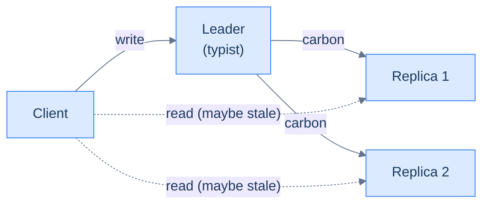

# 11. Replication

## TL;DR
> **Replication is making N copies of your data so you can survive losing one and serve reads from many.** It comes in three shapes: single-leader (writes go to one node, the primary; replicas trail it), multi-leader (multiple primaries accept writes, sync to each other), and leaderless (every node accepts writes, reads use quorum). The shape you pick decides which failure modes you sign up for. The single most important number you'll fight with is **replication lag** — how stale a replica is compared to the leader — and the canonical hazard is **read-your-writes**: a user writes a row, immediately reads it back from a replica, and sees it missing because the replica hasn't caught up yet. The widget below makes this visceral; the example folder shows it happening in real Postgres.

## 1. Motivation

On **Sunday, October 21, 2018**, GitHub experienced a 24-hour-and-11-minute incident that the [post-incident analysis](https://github.blog/news-insights/company-news/oct21-post-incident-analysis/) describes in unflinching detail. The trigger was a 43-second network partition between the East-Coast and Pacific data centres — short enough that nothing should have failed irrevocably. What happened instead was that the **MySQL primary-replica topology**, configured with Orchestrator for automatic failover, decided during the partition that the East-Coast primary was dead. It promoted a Pacific replica to primary. When the partition healed 43 seconds later, both data centres had a *primary*. Both had taken writes. Neither's writes were a superset of the other's. **Split brain.** The two states had diverged.

Resolving the split took 24 hours of careful work — comparing the two primaries' write logs, deciding which writes to keep, manually reconciling. Issues were marked as failed; webhook deliveries were delayed; the timeline of every repo was rebuilt. The root cause was *not* the network partition. It was the operational assumption that a 43-second partition merited an automatic failover. Failover during a transient partition is exactly how you create split-brain.

That story compresses the whole lesson. Replication is what gives you the option to fail over. It is also what gives you the option to fail over *too eagerly*. Understanding the three deployment shapes and the trade-offs each one bakes in is the difference between operating a replicated system and being operated *by* one at the worst possible moment.

## 2. Intuition (Analogy)

A replicated database is a **typewriter pool with carbon copies**.

The **typist** (the leader) holds the master ledger. On every entry, they hammer through a stack of carbon paper, producing fresh carbons that runners ferry to the **filing clerks** (the replicas). The clerks file the carbons; they can answer "what's the latest entry?" by reading their own copy. Reading from a clerk is much cheaper than interrupting the typist — that's the read-scaling story.

Three things to watch:

- **The runners take time.** A clerk's most recent carbon is older than the typist's master, by however long the runner took. That's replication lag.
- **If the typist's hand cramps and they can't type**, you promote one of the clerks to be the new typist. They become the source of truth; the master ledger is now whichever carbon they were last working from. This is **failover**.
- **If the route between the typist's office and one of the clerk's offices is blocked** (a network partition), the clerk stops receiving carbons. If you incorrectly promote them anyway, you now have *two* typists, each filling their own master ledger from their own viewpoint. When the route reopens, you have two different "current truths". This is **split brain**.

The three replication topologies in this lesson are three different ways of organising the pool:

- **Single-leader** — one typist, many clerks. Writes flow one direction.
- **Multi-leader** — multiple typists in different offices, all sending each other carbons. Each office has a local typist; conflicts get resolved when carbons arrive.
- **Leaderless** — no typist. Each customer brings their own draft to several clerks; the clerks file it; readers ask multiple clerks and take the most recent.



<p align="center"><strong>Single-leader. The dashed reads can be served by replicas; they trail the leader by the runner's delay.</strong></p>

## 3. Formal definitions

### 3.1 Single-leader

The most common shape in 2026. One node accepts all writes; the rest follow.

<iframe
  src="/c4/view/buildingblocks_replication_single_leader"
  width="100%"
  height="380"
  style="border: 1px solid var(--border, #2b2b2b); border-radius: 8px;"
  loading="lazy"
  title="Single-leader replication"
></iframe>

The replicas apply the leader's **write-ahead log** ([Lesson 9](/cortex/system-design/building-blocks/relational-databases)) in order. Postgres calls this *streaming replication*; MySQL calls it *binlog replication*; same shape. Within single-leader there are two flavours:

- **Synchronous** — the leader waits for ≥ 1 replica to acknowledge the write before returning success. Strong durability; one slow replica blocks all writes.
- **Asynchronous** — the leader returns success after writing its own WAL. The replicas catch up eventually. Fast; if the leader dies before a replica replays the latest writes, *those writes are lost*.

Most production systems are **semi-synchronous**: the leader waits for at least one replica to acknowledge (configurable), with the rest async. Postgres `synchronous_commit = remote_apply` is one such mode.

| Property | Single-leader |
|---|---|
| Where do writes go? | only to the leader |
| Where do reads go? | leader (strong) or replica (eventually consistent) |
| Failover | promote a replica; the most up-to-date one wins |
| Conflict resolution | trivial — only one writer |
| Replication lag | seconds at worst, milliseconds typical |
| Failure mode | **split brain** if you promote during a partition (GitHub October 2018) |

### 3.2 Multi-leader

Two or more nodes accept writes; each one replicates its writes to the others. Used for **active-active across regions** — every region's users write to the local leader; cross-region replication is asynchronous.

<iframe
  src="/c4/view/buildingblocks_replication_multi_leader"
  width="100%"
  height="320"
  style="border: 1px solid var(--border, #2b2b2b); border-radius: 8px;"
  loading="lazy"
  title="Multi-leader replication"
></iframe>

Because multiple leaders can accept writes concurrently, **conflicts are inevitable**: two users in different regions update the same row at the same millisecond; the cross-region replicas can't agree on which wins. Resolution strategies:

- **Last-Write-Wins (LWW)** — pick the write with the higher timestamp. Easy, lossy (one write is silently discarded). Cassandra defaults to this.
- **Per-field merge** — for some data shapes (sets, counters), each field has a commutative merge rule. The basis for CRDTs.
- **Application-level resolution** — the database surfaces the conflict and the application decides. Git's merge UI is the canonical example.

| Property | Multi-leader |
|---|---|
| Where do writes go? | the nearest leader (region-local) |
| Where do reads go? | the nearest leader |
| Failover | the surviving leaders just keep going |
| Conflict resolution | LWW, CRDT, or app-level — none is universally right |
| Replication lag | cross-region — tens to hundreds of milliseconds |
| Failure mode | conflicts swallowed by LWW; data loss on collision |

### 3.3 Leaderless

Every node accepts writes. Reads and writes are issued to multiple nodes in parallel; *quorum* decides the outcome. The 2007 Dynamo paper and Cassandra are the canonical examples.

<iframe
  src="/c4/view/buildingblocks_replication_leaderless"
  width="100%"
  height="380"
  style="border: 1px solid var(--border, #2b2b2b); border-radius: 8px;"
  loading="lazy"
  title="Leaderless replication"
></iframe>

The math: for **N** replicas, **W** write acknowledgements, and **R** read acknowledgements, **W + R > N** guarantees that any read sees the latest write (because the read's quorum and the write's quorum must overlap on at least one node).

| Configuration | Reads | Writes | Behaviour |
|---|---|---|---|
| W = R = 1, N = 3 | sloppy | sloppy | fast, eventually consistent, prone to stale reads |
| W = 2, R = 2, N = 3 | quorum | quorum | strong reads of own writes, tolerates 1 node failure |
| W = 3, R = 1, N = 3 | fast | slow | reads are fast but every write blocks until all 3 nodes |
| W = 1, R = 3, N = 3 | slow | fast | symmetric of the above |

The trade-off: **strong consistency is paid for in latency** at every read or every write. Cassandra exposes this as a per-query knob (`CONSISTENCY QUORUM`). Mind the naming, though: the leaderless ancestor is the *2007 Dynamo paper*, but Amazon's **DynamoDB** product has a different architecture — single-leader on Multi-Paxos — so its `eventually consistent` vs `strongly consistent` read toggle is a read-routing choice, not a quorum.

| Property | Leaderless |
|---|---|
| Where do writes go? | any node; coordinator forwards to quorum |
| Where do reads go? | any node; coordinator gathers quorum responses |
| Failover | not really — every node is a peer |
| Conflict resolution | LWW (Cassandra/ScyllaDB), version vectors + CRDTs (Riak) |
| Replication lag | exists between nodes; read-repair (on reads) + anti-entropy (background sweep) smooth it over time |
| Failure mode | sloppy quorums + hinted handoff can violate the W+R>N math |

### 3.4 Replication lag — the hazard

In all three shapes, **a read directly after a write may not see that write**. The widget below makes this visceral. Drag the two sliders:

- **Replication lag** — how many milliseconds the replica is behind the leader.
- **Reader queries N ms after the last write** — how soon after writing the reader reads.

When the reader queries the replica within the lag window, the replica returns the *previous* write or "no data". That's the **read-your-writes hazard** in its purest form.

```d3 widget=replication-lag
{
  "title": "Replication lag — leader vs replica, with the reader's read time as a draggable cursor",
  "lagMs": 80,
  "lagRange": [0, 500],
  "readDelayMs": 30,
  "readDelayRange": [0, 500],
  "writeCount": 5,
  "writeIntervalMs": 100
}
```

The standard mitigations:

- **Read-your-writes consistency**: after a user writes, route their reads for that key (or session) to the leader for a TTL longer than typical lag.
- **Monotonic reads**: pin a session to a single replica so reads can't go backwards.
- **Consistent-prefix reads**: when reads fan out across shards that each lag independently, a reader can see a later write *before* the earlier one it causally depends on — the reply arriving before the question. The guarantee is that causally-ordered writes are observed in that same order; the usual fix is to route causally-related writes through one shard so a single ordered log governs them.
- **Causal consistency**: tag every read with the LSN (log sequence number) of the most recent write the session knows about; the replica blocks the read until it has replayed up to that LSN.
- **Accept the staleness**: many UIs tolerate "your post will appear shortly" semantics.

## 4. Worked example — Postgres streaming replication, with measured lag

In `./examples/11-replication-postgres-streaming/` there is a `docker-compose.yml` that brings up a Postgres primary + a streaming replica wired via `pg_basebackup`, and a small Python script that writes a row to the primary and immediately reads it back from the replica.

```sh
cd content/cortex/system-design/02-building-blocks/examples/11-replication-postgres-streaming
docker compose up --build demo
```

You'll see output like:

```
--- writing to primary, immediately reading from replica ---
  W01: fresh — replica saw the write after 2453 µs
  W02: fresh — replica saw the write after 1908 µs
  W03: stale — replica had not yet caught up (read after 312 µs)
  W04: fresh — replica saw the write after 4102 µs
  ...
--- summary over 20 rounds ---
    stale reads:        2 / 20
    primary→replica:    p50 2104 µs, max 8392 µs
```

Two takeaways. **First**, even on localhost — both Postgres servers on the same machine, no real network — async streaming replication takes ~2 ms typical. **Second**, ~10% of the writes get a stale read at this aggressive write-then-read pattern; in production, you'd never structure a read directly after a write this way, but the buried instances (a user posts a comment, the page refreshes, the new comment isn't there) absolutely happen. The mitigations above are how production systems hide this.

Cross-region — say `us-east-1 → eu-west-1` — adds the ~80 ms network RTT. Async replication lag is ~80–150 ms at the p50. **Every read of a freshly-written row, from a different region, will be stale.** That's why the read-your-writes pattern usually pins to the primary's region for a window after a write.

## 5. Trade-offs

| Topology | What you give up | What you get |
|---|---|---|
| **Single-leader (async)** | data loss on leader failure (last few ms of writes) | low write latency; simple operational model |
| **Single-leader (sync)** | one slow replica blocks all writes | strong durability |
| **Single-leader (semi-sync)** | the operational tuning effort | best of both — typical mode for production Postgres / MySQL |
| **Multi-leader** | conflict resolution complexity; LWW data loss | regional write locality |
| **Leaderless** | weaker default consistency; complex client-side quorum logic | survives any single node failure trivially; smooth horizontal scaling |
| Async replication anywhere | freshness on the replicas | low write latency |
| Sync replication everywhere | write availability | strong freshness |
| Auto failover | risk of split brain on a transient partition | reduces operator response time during real failures |
| Manual failover | needs an alert + a human at 3 AM | safer in ambiguous partition cases |

The default 2026 stack for a startup: **single-leader Postgres with one or two async replicas + a hot standby in another AZ + manual failover with a documented runbook**. Move to multi-leader only when you have regulatory requirements for regional write locality. Move to leaderless when the workload (time-series, IoT, append-heavy) genuinely fits Dynamo's access pattern.

## 6. Edge cases and failure modes

### 6.1 Split brain on transient partition

The GitHub October 2018 story is the canonical version. **A network partition between the primary and the failover orchestrator is misinterpreted as primary failure**; the orchestrator promotes a replica; the original primary recovers and now both are accepting writes. Mitigations: longer failover hysteresis (don't promote until partition has persisted for, say, 60 s); fence the old primary by changing the storage attachment; require a quorum of orchestrator nodes to agree before promoting; *manual* failover for ambiguous cases. The fundamental fix is recognising that automatic failover trades a small reduction in MTTR for occasional split brain — and that **the right primitive for "quorum agreement on who is leader" is consensus** ([Lesson 14](/cortex/system-design/building-blocks/consensus-paxos-and-raft)). Etcd-backed leader leases are how managed Postgres products (CrunchyData, RDS Multi-AZ) avoid the split-brain failure mode at the cost of an extra dependency.

### 6.2 Asymmetric replication lag

Replication is not uniform across replicas. One replica might be on a slower disk; one might be running an expensive analytical query that's pinning the WAL apply process; one might be on a busy network link. The result: **reads load-balanced across replicas see inconsistent lag**. A user's session bouncing between replicas can observe writes appearing and disappearing in an order that doesn't match any single replica's view. The mitigation is **session pinning** (sticky read affinity) and **monotonic-read tokens** (the LSN at the last read; the next read blocks until at least that LSN is replayed).

### 6.3 Read-your-writes is not session-only

A user writes from their phone; the same user reads from their browser five seconds later. Same *user* logically, different *session*. The standard read-your-writes routing keyed on session won't help. The senior fix: route by **stable user identity** for a TTL after writes (a Redis entry `last_write_us:<user_id> → timestamp`), and route any read within the TTL to the primary regardless of which session.

### 6.4 Multi-leader conflict resolution silently loses data

LWW is the most common default; the loss is silent and irreversible. Two regions update the same field *concurrently* — and concurrent here means causally, not on the clock: two writes collide whenever neither had seen the other, so offline edits made hours apart still conflict (a database detects this with **version vectors**). LWW keeps the higher-timestamp value; the other silently vanishes. The mitigations require *application awareness*: model the data so concurrent updates don't collide (counters as deltas, not absolutes); use CRDTs where appropriate (G-Counters, OR-Sets); surface conflicts explicitly for human resolution (the Git model). The trap is reaching for multi-leader because "we want active-active" without designing the data model for it.

### 6.5 Cascading replica failure

A replica falls behind. The primary keeps writing. The primary's WAL grows because it's keeping enough on disk to resync the laggy replica. Eventually the WAL fills the disk. The primary stops accepting writes. **The slow replica took down the primary.** Mitigations: cap the WAL size; alert on replication lag; for replicas that have fallen "too far" behind, drop them and re-init from a base backup rather than waiting for catch-up.

### 6.6 Async-replication failure mode that looks like nothing

The replica's network is fine; it's accepting WAL; it's *applying* it slowly because of a long-running query holding locks. From the outside everything looks healthy — until the lag is in minutes and someone notices that the read-replica is serving data from yesterday. **Monitor `replay_lag`, not just `flush_lag`**. The first is what users see; the second is what the network metric shows.

## 7. Practice

### Exercise 1 — Compute the lag window

Your service has a single Postgres primary in `us-east-1` with an async replica in `eu-west-1`. The cross-region RTT is 80 ms. A user in EU writes through the EU app servers (which route writes to the primary), then immediately reads from the EU replica. **In the worst case, how stale can the replica's value be at the moment of the read?**

<details>
<summary>Solution</summary>

Three latencies compound:

1. **Write travel time**: app server in EU writes to primary in US-East. The write request takes ~40 ms (one-way half of an 80 ms RTT). The primary commits, returns ack.
2. **Reply travel time**: the ack travels back to the EU app server — another ~40 ms.
3. **Replication catch-up**: the primary streams the WAL to the EU replica. *In parallel with step 2*, this also takes ~40 ms one-way, plus apply time at the replica (a few ms).
4. **Read travel time**: the EU app server reads from the EU replica — 1–2 ms locally.

The dominant question is whether the **read** at step 4 happens before the **replication catch-up** at step 3 completes. If the read happens, say, 5 ms after the app server received the write ack, the replica is still in the middle of receiving the WAL — it's 35–40 ms behind. The reader sees the *previous* value.

The worst-case staleness window is roughly **the cross-region RTT (~80 ms)** plus replica apply time (~few ms). After 100 ms, the replica has almost certainly caught up. Within 100 ms, you should route to the primary for read-your-writes safety.

Production fix: after each write, the app sets a Redis key `last_write:<user_id>:<resource_id>` with a TTL of 200 ms. Reads check this key; if present, route to the primary in `us-east-1` (extra 80 ms RTT but guaranteed fresh); if absent, route to the local replica (1–2 ms, accepts the small staleness window for *other* users' writes).

</details>

### Exercise 2 — Split brain prevention

Your team is configuring auto-failover for a Postgres primary. The proposal is: "if the orchestrator hasn't received a heartbeat from the primary in 5 seconds, promote the most up-to-date replica". You're asked to review. What's the failure mode this introduces, and what would you change?

<details>
<summary>Solution</summary>

**Failure mode: split brain on transient network partition.** A 5-second network glitch between the orchestrator and the primary — which is *normal* on cloud networks, especially during AZ failovers — is misread as primary failure. The orchestrator promotes a replica. When the network heals, the original primary is still alive, still has its connections, and may be accepting writes. Both are now "primary".

What to change:

1. **Lengthen the hysteresis.** 5 seconds is way too aggressive. 60–120 seconds is a more honest gap between "the primary is degraded" and "the primary is dead". Most real failures persist; transient partitions don't.

2. **Require a quorum of observers.** Don't let one orchestrator node make the call. Have ≥ 2 (preferably 3) nodes vote: only promote if a majority agree the primary is unreachable. This rules out the case where one observer's network is broken.

3. **Fence the old primary at the storage level.** Before promotion, take a hard step like detaching the EBS volume / revoking the cloud IAM permission / power-cycling the host. This guarantees the old primary cannot accept writes once promotion begins, even if it later wakes up thinking it's still primary.

4. **Default to manual failover for ambiguous cases.** A clear primary crash (process gone, port closed) can be automatic. A "primary is reachable but slow / heartbeats are intermittent" case should page a human. Real on-call rotations should expect this; the cost of waking someone is much lower than the cost of split brain.

The general principle: **automatic failover is right when the failure is unambiguous**. If you can't write a heuristic that distinguishes "dead primary" from "slow primary" with high confidence, the answer is a human, not a more clever heuristic. GitHub's October 2018 postmortem walks through exactly this.

</details>

### Exercise 3 — Quorum math

Your team picks Cassandra with `N = 5` replicas. You need *strong consistency* (any read reflects every prior write) AND tolerance for 1 node failure on each side. **What W and R values do you pick, and what's the steady-state read and write latency cost compared to `W = R = 1`?**

<details>
<summary>Solution</summary>

For strong consistency: `W + R > N` ⇒ the read's quorum and the write's quorum overlap on at least one node, so any read sees the latest write.

For tolerance of 1 node failure: the chosen quorum can't be the *whole* cluster — you need to be able to complete a quorum with one node down.

- `W = 3, R = 3` (over `N = 5`) satisfies `W + R = 6 > 5`. With 1 node down, you still have 4 nodes available — enough for both 3-quorums. With 2 nodes down (across writes and reads happening concurrently), only 3 are available — still just enough.

Compared to `W = R = 1`:

- **Write latency**: instead of waiting for 1 ack, you wait for 3. In a 3-node setup of any latency, that's roughly the p66 of the per-node write latency (vs the min). In practice this is a 1.5–2× write latency increase under steady load.
- **Read latency**: same shape. Instead of one node's response, you wait for 3, and merge them. Maybe 1.5–2× read latency.

So **strong quorum reads + writes cost roughly 2× the latency of the eventually-consistent path**. In Cassandra terms, you've picked `QUORUM` for both reads and writes. For workloads that can tolerate the staleness (counter increments, log writes, time-series), `LOCAL_ONE` or `ONE` is the right choice. For workloads that genuinely need strong reads (account balances, inventory), `QUORUM` is.

The senior move: **`QUORUM` is a per-query choice, not a cluster-wide setting**. Mix and match. Don't pay strong-consistency latency for queries that don't need it.

</details>

## Your Turn

Before you move on, check your understanding with the coach — explain the idea, apply it, weigh the trade-offs, then defend your reasoning.

<div class="concept-coach"></div>

## 8. In the Wild

- **[GitHub Engineering, *October 21 post-incident analysis*](https://github.blog/news-insights/company-news/oct21-post-incident-analysis/)** (2018) — the canonical split-brain story. The 43-second partition, the eager failover, the 24-hour reconciliation. Required reading.
- **[Postgres streaming replication docs](https://www.postgresql.org/docs/current/warm-standby.html#STREAMING-REPLICATION)** — the operational reference. The `synchronous_commit` levels (`off` / `local` / `remote_write` / `on` / `remote_apply`) are the precise lever.
- **[Werner Vogels, *Eventually Consistent*, CACM 2009](https://queue.acm.org/detail.cfm?id=1466448)** — Amazon CTO's classic on what eventually consistent actually buys you. Pairs naturally with leaderless replication.
- **[Kingsbury, *Jepsen — MongoDB 4.2.6*](https://jepsen.io/analyses/mongodb-4.2.6)** — empirical exploration of single-leader replication's edge cases. Worth reading any Jepsen report.
- **[Patroni](https://patroni.readthedocs.io/)** — the production-grade Postgres failover tooling that does the GitHub-style automatic promotion *correctly* (with quorum + fencing + hysteresis). The README is short and worth a skim.

---

> **Next:** [12. Sharding and partitioning](/cortex/system-design/building-blocks/sharding-and-partitioning) — replication makes copies of the *whole* dataset across nodes. Sharding splits the dataset *across* nodes, with each node owning a slice. The two are orthogonal — production systems usually do both — but the failure modes are very different. The widget there is `HotShardSimulator`, and it's a worthy successor to the `ConsistentHashRing` from Lesson 7.
