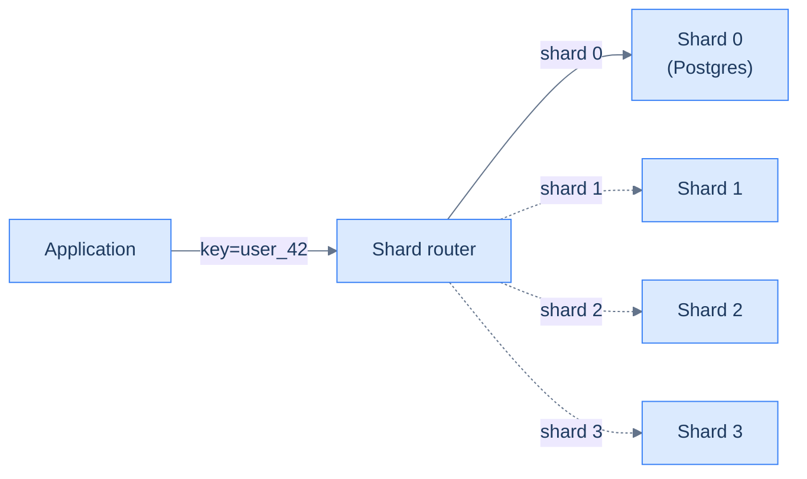

# 12. Sharding and partitioning

## TL;DR
> **Sharding splits a dataset across N independent machines, with each one owning a slice of the keyspace.** Orthogonal to replication ([Lesson 11](/cortex/system-design/building-blocks/replication)) — production systems usually do both. There are three partitioning strategies: **range** (each shard owns a contiguous key range — like dictionary volumes A–F, G–M, …), **hash** (each shard owns keys whose hash falls in its slice — random-looking but uniform), and **directory** (an explicit map maintained by the router). The senior moment of this lesson is the **hot shard**: even with hash partitioning, a Zipfian-skewed workload can put one shard at 5× the load of the others. The widget below lets you crank the skew and switch strategies to see it. The fix — **virtual shards** — is the same trick the consistent-hash ring uses in [Lesson 7](/cortex/system-design/building-blocks/load-balancing).

## 1. Motivation

In **late 2021**, Notion published [*Herding Elephants — Sharding Postgres at Notion*](https://www.notion.so/blog/sharding-postgres-at-notion). The headline: their primary Postgres held 20 TB of `blocks` (every paragraph, heading, image, and embedded child block of every Notion page on the planet) on one machine, and `INSERT` latency was climbing past 250 ms. They sharded that one table across **480 logical shards** evenly distributed over **32 physical Postgres instances** (15 logical shards each), partitioned by **workspace ID**. Two years of planning compressed into one weekend cutover. After: average write latency back under 30 ms, room to grow another order of magnitude.

The story is instructive less for the migration itself and more for what *didn't* happen. They did not move to NoSQL. They did not adopt a sharding proxy like Vitess or Citus mid-project. They sharded plain Postgres at the application layer — a `shard_id` column on every row, a deterministic hash from `block_id` to `shard_id`, and a service that knows which physical Postgres holds which `shard_id`. The architectural complexity stayed inside the application; each underlying Postgres remained a normal, well-understood Postgres.

That's the canonical shape of sharding in 2026: **the application or a thin router decides which shard owns each key; each shard is its own complete database**. The hard parts are picking the partition key (irreversible), avoiding hot shards (compounding), and reshuffling when you need more shards (the topic of the consistent-hash widget from Lesson 7). The rest is operationally straightforward — but the partition-key choice is *the* design decision.

## 2. Intuition (Analogy)

A sharded datastore is a **library catalog partitioned across multiple branches**.

The town has too many books for one building. So you build several branches, and you split the catalog across them. There are three ways to decide which book goes where:

- **Range partition** — branch 1 holds A–F, branch 2 holds G–M, branch 3 holds N–S, branch 4 holds T–Z. Easy to explain. Range queries ("all books between K and L") are one branch. *But*: when the new Harry Potter comes out, branch 2 (G–M) is full and the others are empty.
- **Hash partition** — every book's title gets hashed; the hash mod 4 picks the branch. Books are spread evenly regardless of how popular different letters are. *But*: range queries ("all books whose author starts with K") now hit every branch.
- **Directory partition** — there's an explicit catalog at the central office: `"Harry Potter and the Philosopher's Stone" → branch 3; "War and Peace" → branch 1; …`. You can put any book at any branch and change your mind later. *But*: the central catalog is now an extra hop and a single point of failure if you don't replicate it.

Each strategy has the same trade: **how locally do related items cluster?** Range partitioning maximises locality (everything K-prefixed is on one branch); hash partitioning destroys it (uniform spread). Directory partitioning gives you both knobs at the cost of central-catalog complexity.



<p align="center"><strong>The shape of sharding. The router can be a thin Go service, a library inside the app, or a managed proxy like Vitess.</strong></p>

## 3. Formal definitions

### 3.1 The sharded deployment shape

<iframe
  src="/c4/view/buildingblocks_sharding_overview"
  width="100%"
  height="440"
  style="border: 1px solid var(--border, #2b2b2b); border-radius: 8px;"
  loading="lazy"
  title="Sharded datastore overview"
></iframe>

A *shard* is a complete instance of the underlying datastore (a Postgres server, a Cassandra ring, a Mongo replica set) holding a slice of the keyspace. The *router* is whatever decides which shard owns a given query — sometimes a managed proxy (Vitess for MySQL, Citus for Postgres, ProxySQL); sometimes a library compiled into the application; sometimes a single hash function applied by every caller. The choice between "thick router" and "thin router" mostly affects operational complexity, not architectural correctness.

Two facts to internalise before going further:

1. **Sharding is independent of replication.** A 32-shard cluster can have 0, 1, or N replicas per shard. Each shard handles replication internally; the router is unaware. In Notion's setup, each of the 32 physical Postgres instances is itself a single-leader replica set ([Lesson 11](/cortex/system-design/building-blocks/replication)).
2. **Cross-shard queries are expensive.** A `JOIN` across two tables on different shards is a scatter-gather across the router; ordering and pagination are application-side. Most production sharded systems avoid cross-shard queries by *choosing the partition key to keep related rows on the same shard*.

### 3.2 Three partitioning strategies

| Strategy | Owner is decided by | Best for | Footgun |
|---|---|---|---|
| **Range** | `key` falls in shard's range `[lo, hi)` | range scans on the partition key (time-series, alphabetical) | hot shards under skewed workload; manual rebalancing |
| **Hash** | `hash(key) % N` | uniform workloads; minimal operational tuning | no efficient range scans on the partition key; `N` change reshuffles ~everything (mitigated by consistent hashing) |
| **Directory** | explicit map `key → shard_id` | hot-spot remediation (move just the hot key); custom routing | central directory is another component to operate + scale |

The first two strategies cover ~95% of production sharded systems. Directory partitioning shows up as a *secondary* technique on top of hash or range — when you discover a hot shard, you "carve out" the hot key with a directory entry, leaving everything else on the original hashed map.

### 3.3 The hot-shard problem

Here is where most sharding goes wrong. Even with hash partitioning — which is *uniform across the universe of keys* — a Zipfian-skewed *request distribution* (the top 1% of keys account for ~50% of traffic, the top 10% for ~80%) lands disproportionately on whichever shards happen to own the hottest keys.

Try it. The widget below distributes a Zipfian-skewed workload across 8 shards under three strategies. Drag the **skew** slider up; watch the bars get uneven. Switch the **partitioning strategy** and watch which strategy controls the spread.

```d3 widget=hot-shard
{
  "title": "Hot shards under Zipfian workload — which strategy keeps the bars even?",
  "shardCount": 8,
  "shardCountRange": [2, 16],
  "skew": 0.6,
  "skewRange": [0.0, 2.0],
  "keyCount": 500,
  "virtualPerShard": 50
}
```

Two observations the widget makes obvious:

- **Range partitioning is the worst under Zipfian skew.** Because Zipf weights are concentrated in the lowest ranks, and range partitioning maps the lowest ranks to one shard, that shard gets disproportionately hammered.
- **Hash partitioning is uniform, even under skew** — provided the shard count is small relative to the key universe. The hash function is *blind* to popularity, so popular and unpopular keys land on the same distribution.

Then the third trick: **virtual shards**. The "hash + virtual" strategy treats each physical shard as owning many *virtual* shards on the hash ring, then distributes keys across virtual shards via the same hash. With 50 virtuals per physical, the law of large numbers smooths the worst-case skew below the residual sampling noise. This is exactly the same trick consistent hashing uses to balance the ring at low node counts (Lesson 7's `ConsistentHashRing` widget).

### 3.4 Resharding — the dreaded migration

Eventually you outgrow the current shard count. With **hash partitioning**, naïvely changing `N` from 8 to 16 reshuffles every key: `hash(k) % 8` is unrelated to `hash(k) % 16`. That's a full data migration. **With consistent hashing**, only roughly `1/N` of keys move when you add a shard — the same property the widget in [Lesson 7](/cortex/system-design/building-blocks/load-balancing) made visceral. Production sharded systems use consistent hashing (or a close cousin like rendezvous hashing) precisely so resharding is cheap.

The Notion migration moved billions of rows from one monolithic Postgres into 480 logical shards across 32 databases in a single weekend with minimal downtime, because they had pre-designed the logical-shard scheme. **Plan for resharding before you need it**; retrofitting consistent hashing onto an existing modulo-hashed system is the expensive migration story you don't want to live through.

## 4. Worked example — partition keys for a chat application

Suppose you're building a chat application like Discord. The dominant data is the `messages` table; expected scale is ≥ 10 billion rows. What's the partition key?

**Option 1 — `user_id`.** Every user's messages on one shard. Pros: a user's history is local; "show all my messages" is one shard. Cons: extreme hot keys (one bot or one heavy user has millions of messages); a single user's data is bounded only by their own activity (not by design).

**Option 2 — `channel_id`.** Every channel's messages on one shard. Pros: "show recent messages in #general" is one shard (the dominant access pattern). Cons: a single popular channel (`#general` for a 1M-member server) hosts ALL its messages on one shard — that's a hot shard waiting to happen. Discord's 2017 design was specifically about avoiding this.

**Option 3 — `(channel_id, bucket)`** where `bucket` is a coarse time slice (e.g. 10 days). Discord's actual choice. Pros: a 1M-member server's `#general` is split into ~36 buckets per year; each bucket is its own partition; reads of "the last 50 messages" hit the current bucket only. Cons: the partition key is now two fields; cross-bucket queries (pagination across the boundary) need application-level orchestration.

**Option 4 — `message_id` (random).** Pure hash partitioning. Pros: perfectly uniform load. Cons: every read of "channel X's recent messages" is a scatter-gather across every shard — the worst case.

The right answer is option 3 — and *why* it's right is the lesson. The partition key has to:

1. **Match the dominant read pattern.** Recent-messages-in-channel is the most-common chat query; that's what we partition by.
2. **Stay bounded.** Single partitions cannot grow unboundedly. The `bucket` field caps each partition at a fixed time window.
3. **Avoid intrinsic skew.** `user_id` would have failed this; `(channel_id, bucket)` succeeds because each bucket's size is bounded.

The runnable in `./examples/12-sharding-strategies/` is a 100-line Python script that demonstrates all four partitioning strategies — range, hash, directory, hash + virtual — against a Zipfian workload, and prints per-shard load + hot-shard factor. The point is to develop the *numerical intuition* for what each strategy does to a non-uniform workload.

## 5. Trade-offs

| Choice | What you give up | What you get |
|---|---|---|
| **Don't shard** | the horizontal-scale option | the operational simplicity of one machine — best place to be while it fits |
| **Range partitioning** | uniform load under skewed access | range scans + alphabetical scan affinity |
| **Hash partitioning** | range scans on the partition key | near-uniform load on average |
| **Hash + virtual** | a few microseconds per request to compute the virtual mapping | resilient to per-shard skew at any reasonable shard count |
| **Directory partitioning** | a central component to operate + replicate | per-key flexibility (e.g. carve out a hot key) |
| **Consistent hashing** | implementation complexity | cheap resharding (only ~1/N keys move per added shard) |
| **Thin router (client library)** | dependency / version sprawl across services | no central proxy in the request path |
| **Thick router (Vitess / Citus / proxy)** | one more service to operate | central place to evolve sharding policy |
| **Single partition key for the whole DB** | flexibility for queries that don't fit it | cross-shard queries become rare |
| **Per-table partition key** | application-side join complexity | each table has the right partition for its dominant access pattern |

The default 2026 stack for a startup: **don't shard yet**. The single-Postgres envelope is much larger than teams' intuition. Pick the partition key on day one if you know you'll shard eventually (the cost of choosing it later is rewriting the application). Use **hash partitioning with consistent hashing** when you do shard. Carve out hot keys with directory entries as needed.

## 6. Edge cases and failure modes

### 6.1 The partition key cannot be retrofitted

Once you commit to a partition key, you cannot change it without rewriting every row. The migration tools that change partition keys exist (`pg_partman`, manual `INSERT INTO new_table SELECT FROM old`) but the operational risk is high. Pick the partition key by simulating real production access patterns before you commit. **The cost of getting it wrong is months of engineering time you didn't budget.**

### 6.2 Hot key on a hash-partitioned cluster

Even with uniform hash partitioning, a single popular key (the celebrity user, the viral video) can saturate the shard that owns it. Mitigations: **replicate the hot key** across multiple shards explicitly (every shard has a copy; reads load-balance across them); **client-side caching of the hot keys** (most reads never touch the database); **carve out via directory entry** (move the hot key to a dedicated shard with extra capacity).

### 6.3 Cross-shard transaction

A single transaction touching rows on multiple shards is hard. You can't use a regular database transaction (each shard is its own database). The substitutes: **two-phase commit** (works, slow, not survivable to coordinator failure); **sagas** (a sequence of compensating actions on failure — see [Lesson 19](/cortex/system-design/distributed-patterns/sagas-and-distributed-transactions)); **just don't do it** (model the data so transactions stay within one shard). The third is by far the most common production answer.

### 6.4 The router becomes the bottleneck

If you funnel every query through a single central router, the router itself becomes a SPOF and a throughput ceiling. Mitigations: **library router** (compile the routing logic into every client; the function is stateless); **N-way load-balance the central router** behind an [L4 load balancer](/cortex/system-design/building-blocks/load-balancing); **share the shard map via gossip** (every node knows the topology). The router complexity is real but tractable.

### 6.5 Reshuffling under load

You decide to add 4 more shards to your 8-shard cluster (8 → 12, +50% capacity). With plain modulo hashing, every key moves with probability `8/12` — i.e. 67% of all data must move. While the migration is in flight, *every read of a moved key is wrong*. Production migrations using consistent hashing avoid this by moving only ~33% of keys (1/3 of them move from old shards to new ones). The remaining 67% stay put; their reads continue to work uninterrupted.

### 6.6 Secondary indexes don't shard cleanly

If your `messages` table is partitioned by `(channel_id, bucket)` but you want a secondary lookup by `author_id`, the secondary index must either: (a) be **global** (a separate index table that maps `author_id → shard list`, queried separately), or (b) be **local** (each shard has its own `author_id` index, requiring a scatter-gather for "all messages by author X"). Both are correct; both are slow compared to the partition-key path. The trap is thinking sharding makes *every* query cheap; it makes only the partition-key-aligned queries cheap.

## 7. Practice

### Exercise 1 — Choose a partition key

You're sharding a `orders` table for an e-commerce platform. The two dominant read patterns are (a) "show this user's order history, paginated" and (b) "show all orders for warehouse #17 from last week, for fulfillment". What partition key do you pick, and what's the trade-off?

<details>
<summary>Solution</summary>

The two access patterns want different partition keys.

- For (a) "user's order history" — partition by `user_id`. Every user's orders on one shard, cheap pagination.
- For (b) "warehouse's recent orders" — partition by `(warehouse_id, day)`. Every warehouse's day-of-orders on one shard, cheap range scan.

**You cannot have both.** A row has one position on disk. Pick one:

**Choice A — partition by `user_id`.** Pattern (a) is cheap, pattern (b) is a scatter-gather across all shards. Acceptable if pattern (b) is rare or off-peak (most warehouses fulfill in batches, so the scatter-gather is fine).

**Choice B — partition by `(warehouse_id, day)`.** Pattern (b) is cheap. Pattern (a) becomes a scatter-gather. Bad if it's the dominant access pattern.

**Choice C — denormalise.** Two separate sharded tables (`orders_by_user`, `orders_by_warehouse`), each partitioned for its pattern. Writes go to both — the application maintains the duality. Same trick Cassandra teaches in [Lesson 10](/cortex/system-design/building-blocks/nosql-families) (denormalise at write time, optimise reads per pattern). 2× the write cost; both reads are local.

The senior answer is **C**, with the caveat that you only adopt the second table once pattern (b) actually becomes a measurable problem at production scale. Don't preemptively double your write cost for a query that runs once a day.

</details>

### Exercise 2 — Spot the hot shard

A team shards their `events` table by `hash(user_id) % 16`. Six months in, p99 write latency on shard 7 is 250 ms; the other 15 shards are at 30 ms. They check `pg_stat_user_tables` on shard 7 and see one `user_id` with 4 billion rows, the next-highest user has 200 million. What's happening, and what would you do?

<details>
<summary>Solution</summary>

**What's happening.** One user — probably a bot, a service account, or an internal "system" user used to attribute machine events — accounts for 95% of the rows on shard 7. Because all of that user's data is on one shard (hash partitioning guarantees this), shard 7's storage and write load is 20× the others. **A hot key on a hash-partitioned cluster.**

Three mitigations to consider:

1. **Stop attributing machine events to a user_id.** If it's a "system" user being misused, separate the system events into their own table that doesn't share the user_id-keyed partitioning scheme. This is the structural fix.

2. **Carve out the hot key via directory partitioning.** Add a directory entry: `if user_id == BOT_ID then shard_id = ???`. Pre-create a dedicated shard with extra capacity for just that user's writes. The rest of the cluster keeps using hash. Hybrid range/directory + hash routing is common.

3. **Sub-partition the hot user's data.** Change the partition key for that user only: `(user_id, day)` instead of `user_id`. Each day's worth of bot events lands on a different shard via the hash. The bot's queries (which probably scan by day anyway) still find their data; the load spreads.

The general principle: **a hot key on a hash-partitioned cluster is not a bug in the partitioning scheme; it's evidence that the data model didn't anticipate the workload's skew**. Hash partitioning is uniform on the key universe, *not* on the access distribution. When one key carries disproportionate volume, you need an extra layer.

</details>

### Exercise 3 — Resharding cost math

You operate a 16-shard cluster with modulo hashing (`hash(k) % 16`). You're scaling to 32 shards. Estimate the fraction of keys that need to move, and contrast with the consistent-hashing version of the same migration.

<details>
<summary>Solution</summary>

**Modulo hashing.** Going from 16 → 32 shards changes the modulus. For each key `k`, the new shard is `hash(k) % 32`; the old was `hash(k) % 16`. A key stays put iff `hash(k) % 32 == hash(k) % 16`, which happens when `hash(k) % 32 ∈ [0, 16)` AND `hash(k) % 32 == hash(k) % 16`. With uniformly distributed hashes, roughly **half the keys** move (those whose new shard is in `[16, 32)` — they were on a shard in `[0, 16)` before).

So: **~50% of all data must migrate** for a 16 → 32 expansion.

**Consistent hashing.** Each new shard claims a slice of the ring proportional to its capacity. With 16 → 32 shards (doubling), each new shard takes ~`1/32` of the ring from each old shard's neighbour. Total movement ≈ `16 × (1/32) = 1/2` of the ring... but wait, that's per-old-shard.

Let me redo: total ring → 32 equal slices after expansion. Old slices: 16, each `1/16`. New slices: 32, each `1/32`. Half of each old slice "donates" to a new shard. So total data moved is **half the data** — same as modulo?

That's the catch — naïve consistent hashing without virtual nodes only beats modulo when you add *one* node at a time (~`1/N` moves). Doubling is the worst case. **The right approach for a doubling event is to plan it as 16 successive +1 expansions, or to use a rendezvous hash with stable identity** — moving only the keys whose preferred node changes.

In practice, Notion chose **480 logical shards** (a number divisible by many factors) precisely so the logical-to-physical mapping can change — re-placing logical shards across 32 → 40 → 48 physical databases — without re-hashing keys. The logical shard count stays fixed; only the physical data placement moves.

The lesson: **the migration's cost depends on the partitioning math AND the migration strategy**. Consistent hashing is necessary but not sufficient; doubling is hard either way; one-shard-at-a-time is the cheap path.

</details>

## 8. In the Wild

- **[Notion, *Herding Elephants — Sharding Postgres at Notion*](https://www.notion.so/blog/sharding-postgres-at-notion)** (2021) — the case study every team contemplating sharding should read. Concrete numbers, the weekend cutover, the `shard_id` column design.
- **[Discord, *How Discord Stores Trillions of Messages*](https://discord.com/blog/how-discord-stores-trillions-of-messages)** (2023). The follow-up to the 2017 post; same data model, swapped engine. Partition-key choice (`(channel_id, bucket)`) was load-bearing.
- **[Vitess](https://vitess.io/)** — the production-grade sharding proxy for MySQL. Originally YouTube's. The architecture docs are worth a skim for the "thick router" model.
- **[Citus](https://www.citusdata.com/)** — the Postgres equivalent. Now owned by Microsoft, used inside Azure Cosmos DB for Postgres.
- **[Karger et al., *Consistent Hashing and Random Trees*](https://www.akamai.com/site/en/documents/research-paper/consistent-hashing-and-random-trees-distributed-caching-protocols-for-relieving-hot-spots-on-the-world-wide-web-technical-publication.pdf)** (STOC 1997). The paper that introduced consistent hashing; the math is exactly what the `ConsistentHashRing` widget from Lesson 7 visualises, and what makes the Notion-style migration cost manageable.

---

> **Next:** [13. Consistency models](/cortex/system-design/building-blocks/consistency-models) — once you have data sharded across N machines and replicated R ways, the question becomes "what consistency does the user actually see?" The answer is a small but important taxonomy — strong, eventual, monotonic, causal — and the senior moment is reaching for the right one per query, not per cluster.
