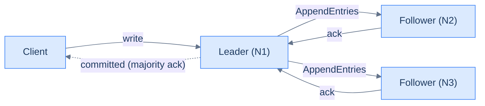

# 14. Consensus — Paxos and Raft, from scratch

## TL;DR
> **Consensus** is the algorithm that lets N nodes agree on a single ordered sequence of values, even when some of them die or the network briefly partitions. **Paxos** (Lamport, 1989) proved it could be done, and was famously hard to understand. **Raft** (Ongaro + Ousterhout, 2014) is the same algorithm rebuilt for teachability — three subproblems (leader election, log replication, safety), one cluster role at a time. Once you have Raft, you have a linearisable distributed log; once you have a linearisable log, you have a state machine; once you have a state machine, you can build a strongly-consistent database, lock service, configuration store, or scheduler. The widget below walks the three Raft scenarios step by step. **You will not implement Raft in production** — use etcd. But understanding what Raft *guarantees* and *costs* is the difference between treating distributed agreement as a black box and treating it as a tool you can reach for at the right time.

## 1. Motivation

In **2014**, Diego Ongaro and John Ousterhout published [*In Search of an Understandable Consensus Algorithm*](https://raft.github.io/raft.pdf) at USENIX ATC. The abstract is unusually candid: their goal was *not* a faster or more efficient consensus protocol than Paxos. It was a *teachable* one. They had run user studies. Students who tried to implement Paxos from Lamport's papers got stuck; students who tried Raft finished and moved on. The paper opens with the sentence "Consensus algorithms allow a collection of machines to work as a coherent group that can survive the failures of some of its members" — and then spends 18 pages making sure you understand exactly how.

The **etcd** project at CoreOS was built on Raft from its 2013 inception — one of the earliest production Raft implementations — and refined that core in its 2015 v2.0 rewrite. Today etcd is what Kubernetes uses to store *all of its cluster state* — every Pod, Service, Deployment, Secret, every node's heartbeat — in a Raft-backed key-value store. **Every Kubernetes cluster on the planet is a Raft cluster underneath.** Consul (HashiCorp's service mesh / config store), CockroachDB (geo-distributed SQL), ScyllaDB's metadata plane, TiKV (the storage layer of TiDB), all use Raft. The decisions you make about how *those* systems behave at the architectural level — when leader election can stall, how big the log gets, where to put the dedicated voters — are decisions about Raft.

You will never write a production Raft implementation. But you will absolutely operate one, design *around* one, debug *because of* one. Knowing what Raft guarantees, what it costs, and what its failure modes look like is the lesson.

## 2. Intuition (Analogy)

A consensus algorithm is **a group of friends agreeing on a restaurant over a flaky group chat**.

The friends are far apart. The group chat sometimes drops messages, sometimes reorders them, sometimes delays one for a minute. Some friends drop out entirely (their phones die). The group must nevertheless **agree on one restaurant**, and once agreed, the choice must not be unilaterally changed by any single friend.

Raft solves this with three rules:

- **One person at a time leads the proposal.** At any moment, exactly one friend is the "leader" (the proposer). Everyone else is a "follower" who agrees with what the leader says. This is **leader election**.
- **Proposals require a majority.** The leader proposes a restaurant; the followers vote; if a majority of the *whole group* (not just the responsive friends) acknowledges the proposal, it's "committed" — no future leader can change it. This is **log replication + safety**.
- **If the leader goes silent, someone else starts an election.** Anyone who doesn't hear from the leader for a while becomes a *candidate* and asks for votes. A new leader is whoever wins a majority. This is **leader failover**.

Three subtleties matter:

- A *majority* (quorum) means strictly more than half — for 3 nodes, that's 2; for 5 nodes, 3. With 3 nodes you can lose 1; with 5 you can lose 2.
- During an election window the cluster is *temporarily unavailable* — no one is leading. Once a new leader is elected (typically <500 ms), service resumes. This is the latency cost of consensus.
- Two friends can both *think* they're the leader during a brief network glitch. Raft's "term" mechanism makes this impossible to act on — a write only commits when a majority acks, and a majority cannot simultaneously ack two leaders from different terms.

The widget below walks all three of these — election, replication, and failover — step by step on a 3-node cluster.



<p align="center"><strong>Raft's hot path: the client writes to the leader; the leader fans out to the followers; commit happens when a majority acks.</strong></p>

## 3. Formal definitions

### 3.1 The Raft cluster shape

<iframe
  src="/c4/view/buildingblocks_raft_cluster"
  width="100%"
  height="380"
  style="border: 1px solid var(--border, #2b2b2b); border-radius: 8px;"
  loading="lazy"
  title="Raft cluster — leader + 2 followers"
></iframe>

A Raft cluster has **N nodes** (typically 3 or 5), each running the same state machine. At any moment, one node is the **leader**; the others are **followers**. The leader's job: accept client writes, replicate them as **log entries** to the followers via `AppendEntries` RPCs, and tell followers when a log entry is **committed** (acknowledged by a majority). The followers' job: persist the leader's entries, ack them, and become a **candidate** if the leader stops sending heartbeats.

Every cluster fact has two coordinates:

- **Term** — a monotonically-increasing integer. Each leader election starts a new term. Within a term, at most one node is leader. If two nodes claim leadership in the same term, something has gone catastrophically wrong with the protocol (Raft proves this can't happen if its rules are followed).
- **Log index** — the position of an entry in the log. Each node has a log; the leader's log is the canonical version; followers' logs converge toward the leader's via `AppendEntries`.

### 3.2 The three Raft scenarios

The widget below has three scripted scenarios — leader election, log replication, leader failover — each as a sequence of 6–8 steps. Step through with Back / Next; watch term numbers tick, roles transition, log entries replicate.

```d3 widget=raft-animator
{
  "title": "Raft — leader election, log replication, and failover",
  "scenarios": [
    {
      "name": "Leader election",
      "steps": [
        {
          "caption": "All three nodes start as followers in term 1. No leader yet.",
          "nodes": [
            { "id": "N1", "role": "follower", "term": 1, "log": [] },
            { "id": "N2", "role": "follower", "term": 1, "log": [] },
            { "id": "N3", "role": "follower", "term": 1, "log": [] }
          ]
        },
        {
          "caption": "N1's election timeout fires first. It becomes a candidate, increments its term to 2, and votes for itself.",
          "nodes": [
            { "id": "N1", "role": "candidate", "term": 2, "log": [], "votedFor": "N1" },
            { "id": "N2", "role": "follower", "term": 1, "log": [] },
            { "id": "N3", "role": "follower", "term": 1, "log": [] }
          ]
        },
        {
          "caption": "N1 sends RequestVote(term=2) to N2.",
          "nodes": [
            { "id": "N1", "role": "candidate", "term": 2, "log": [], "votedFor": "N1" },
            { "id": "N2", "role": "follower", "term": 1, "log": [] },
            { "id": "N3", "role": "follower", "term": 1, "log": [] }
          ],
          "message": { "from": "N1", "to": "N2", "label": "RequestVote(term=2)" }
        },
        {
          "caption": "N2 sees a higher term than its own. It advances to term 2 and votes for N1 (its first vote of the term).",
          "nodes": [
            { "id": "N1", "role": "candidate", "term": 2, "log": [], "votedFor": "N1" },
            { "id": "N2", "role": "follower", "term": 2, "log": [], "votedFor": "N1" },
            { "id": "N3", "role": "follower", "term": 1, "log": [] }
          ]
        },
        {
          "caption": "N1 has 2 votes out of 3 — a majority. It becomes leader for term 2 and starts sending heartbeats.",
          "nodes": [
            { "id": "N1", "role": "leader", "term": 2, "log": [], "votedFor": "N1" },
            { "id": "N2", "role": "follower", "term": 2, "log": [], "votedFor": "N1" },
            { "id": "N3", "role": "follower", "term": 1, "log": [] }
          ]
        },
        {
          "caption": "Heartbeat AppendEntries reach N3 too; N3 also advances to term 2 and follows N1.",
          "nodes": [
            { "id": "N1", "role": "leader", "term": 2, "log": [], "votedFor": "N1" },
            { "id": "N2", "role": "follower", "term": 2, "log": [], "votedFor": "N1" },
            { "id": "N3", "role": "follower", "term": 2, "log": [] }
          ],
          "message": { "from": "N1", "to": "N3", "label": "AppendEntries(term=2, empty)" }
        }
      ]
    },
    {
      "name": "Log replication",
      "steps": [
        {
          "caption": "Cluster steady state: N1 is leader for term 2, followers are caught up with one entry x=1.",
          "nodes": [
            { "id": "N1", "role": "leader", "term": 2, "log": ["x=1"], "votedFor": "N1" },
            { "id": "N2", "role": "follower", "term": 2, "log": ["x=1"], "votedFor": "N1" },
            { "id": "N3", "role": "follower", "term": 2, "log": ["x=1"], "votedFor": "N1" }
          ]
        },
        {
          "caption": "Client sends `SET y=2`. N1 appends the entry to its own log; not yet replicated.",
          "nodes": [
            { "id": "N1", "role": "leader", "term": 2, "log": ["x=1", "y=2*"], "votedFor": "N1" },
            { "id": "N2", "role": "follower", "term": 2, "log": ["x=1"], "votedFor": "N1" },
            { "id": "N3", "role": "follower", "term": 2, "log": ["x=1"], "votedFor": "N1" }
          ]
        },
        {
          "caption": "N1 sends AppendEntries to N2 with the new entry.",
          "nodes": [
            { "id": "N1", "role": "leader", "term": 2, "log": ["x=1", "y=2*"], "votedFor": "N1" },
            { "id": "N2", "role": "follower", "term": 2, "log": ["x=1"], "votedFor": "N1" },
            { "id": "N3", "role": "follower", "term": 2, "log": ["x=1"], "votedFor": "N1" }
          ],
          "message": { "from": "N1", "to": "N2", "label": "AppendEntries(y=2)" }
        },
        {
          "caption": "N2 appends y=2 and acks. N1 now has acks from itself + N2 = majority. The entry is committed.",
          "nodes": [
            { "id": "N1", "role": "leader", "term": 2, "log": ["x=1", "y=2"], "votedFor": "N1" },
            { "id": "N2", "role": "follower", "term": 2, "log": ["x=1", "y=2"], "votedFor": "N1" },
            { "id": "N3", "role": "follower", "term": 2, "log": ["x=1"], "votedFor": "N1" }
          ]
        },
        {
          "caption": "N1 returns SUCCESS to the client (the write is durable). N3 will catch up on the next heartbeat.",
          "nodes": [
            { "id": "N1", "role": "leader", "term": 2, "log": ["x=1", "y=2"], "votedFor": "N1" },
            { "id": "N2", "role": "follower", "term": 2, "log": ["x=1", "y=2"], "votedFor": "N1" },
            { "id": "N3", "role": "follower", "term": 2, "log": ["x=1"], "votedFor": "N1" }
          ]
        },
        {
          "caption": "Next heartbeat carries the y=2 entry to N3. Cluster is fully consistent.",
          "nodes": [
            { "id": "N1", "role": "leader", "term": 2, "log": ["x=1", "y=2"], "votedFor": "N1" },
            { "id": "N2", "role": "follower", "term": 2, "log": ["x=1", "y=2"], "votedFor": "N1" },
            { "id": "N3", "role": "follower", "term": 2, "log": ["x=1", "y=2"], "votedFor": "N1" }
          ],
          "message": { "from": "N1", "to": "N3", "label": "AppendEntries(y=2)" }
        }
      ]
    },
    {
      "name": "Leader failover",
      "steps": [
        {
          "caption": "Cluster steady state: N1 leader, term 2, two entries committed.",
          "nodes": [
            { "id": "N1", "role": "leader", "term": 2, "log": ["x=1", "y=2"], "votedFor": "N1" },
            { "id": "N2", "role": "follower", "term": 2, "log": ["x=1", "y=2"], "votedFor": "N1" },
            { "id": "N3", "role": "follower", "term": 2, "log": ["x=1", "y=2"], "votedFor": "N1" }
          ]
        },
        {
          "caption": "N1 crashes. Its heartbeats stop arriving at N2 and N3.",
          "nodes": [
            { "id": "N1", "role": "down", "term": 2, "log": ["x=1", "y=2"] },
            { "id": "N2", "role": "follower", "term": 2, "log": ["x=1", "y=2"], "votedFor": "N1" },
            { "id": "N3", "role": "follower", "term": 2, "log": ["x=1", "y=2"], "votedFor": "N1" }
          ]
        },
        {
          "caption": "After ~150 ms with no heartbeat, N3's election timeout fires. N3 becomes a candidate, bumps to term 3, votes for itself.",
          "nodes": [
            { "id": "N1", "role": "down", "term": 2, "log": ["x=1", "y=2"] },
            { "id": "N2", "role": "follower", "term": 2, "log": ["x=1", "y=2"], "votedFor": "N1" },
            { "id": "N3", "role": "candidate", "term": 3, "log": ["x=1", "y=2"], "votedFor": "N3" }
          ]
        },
        {
          "caption": "N3 sends RequestVote(term=3) to N2.",
          "nodes": [
            { "id": "N1", "role": "down", "term": 2, "log": ["x=1", "y=2"] },
            { "id": "N2", "role": "follower", "term": 2, "log": ["x=1", "y=2"], "votedFor": "N1" },
            { "id": "N3", "role": "candidate", "term": 3, "log": ["x=1", "y=2"], "votedFor": "N3" }
          ],
          "message": { "from": "N3", "to": "N2", "label": "RequestVote(term=3, lastLog=y=2)" }
        },
        {
          "caption": "N2 advances to term 3, sees N3's log is up-to-date, and votes for N3.",
          "nodes": [
            { "id": "N1", "role": "down", "term": 2, "log": ["x=1", "y=2"] },
            { "id": "N2", "role": "follower", "term": 3, "log": ["x=1", "y=2"], "votedFor": "N3" },
            { "id": "N3", "role": "candidate", "term": 3, "log": ["x=1", "y=2"], "votedFor": "N3" }
          ]
        },
        {
          "caption": "N3 has 2 of 3 votes (itself + N2). N3 becomes leader for term 3 and starts heartbeating.",
          "nodes": [
            { "id": "N1", "role": "down", "term": 2, "log": ["x=1", "y=2"] },
            { "id": "N2", "role": "follower", "term": 3, "log": ["x=1", "y=2"], "votedFor": "N3" },
            { "id": "N3", "role": "leader", "term": 3, "log": ["x=1", "y=2"], "votedFor": "N3" }
          ]
        },
        {
          "caption": "Cluster has recovered. Client writes now go to N3. When N1 comes back up, it'll become a follower in term 3.",
          "nodes": [
            { "id": "N1", "role": "down", "term": 2, "log": ["x=1", "y=2"] },
            { "id": "N2", "role": "follower", "term": 3, "log": ["x=1", "y=2"], "votedFor": "N3" },
            { "id": "N3", "role": "leader", "term": 3, "log": ["x=1", "y=2"], "votedFor": "N3" }
          ]
        }
      ]
    }
  ]
}
```

### 3.3 The safety property

Raft's central guarantee — what makes it "consensus" and not just "replication" — is the **Leader Completeness Property**: if a log entry is committed in some term, it is present in the leader's log for every higher term. *No committed entry can ever be lost*, even across leadership changes, even across crashes, even across partitions, as long as a majority is alive.

The mechanism that buys this: a candidate's `RequestVote` includes its own log's last index + term; followers refuse to vote for a candidate whose log is *behind* theirs. So a new leader is always *at least as up-to-date* as a majority — and any committed entry is, by definition, on a majority — so a new leader has every committed entry.

The proof is in §5 of the [Raft paper](https://raft.github.io/raft.pdf). The intuition: **committing requires a majority; electing requires a majority; any two majorities overlap.** That overlap is what carries committed state across term boundaries.

### 3.4 Why not Paxos?

Single-decree Paxos (Lamport's original 1989 paper, formally published 1998) solves the same problem with different mechanics. Multi-Paxos extends it to a sequence of decisions. The algorithms are *equivalent in capability* — every Raft cluster could be replaced by a Multi-Paxos cluster — but Raft splits the problem into three subproblems (election, replication, safety) that you can reason about independently. Paxos packs them together; the resulting algorithm has fewer moving parts but is much harder to teach, test, or implement.

In production, **Raft has effectively won**. The few well-known Paxos systems (Google's Chubby, Spanner's replication layer) predate Raft; new systems pick Raft. Aspects of Paxos — `Fast Paxos`, `Egalitarian Paxos`, `Mencius` — are still active research for specific performance tweaks.

## 4. Worked example — what makes a Raft cluster slow

Suppose you operate a 3-node Raft cluster (an etcd backing a Kubernetes control plane). Three things mostly determine its write throughput and latency.

**Network RTT between nodes.** Every write requires the leader to fan out an `AppendEntries`, wait for a majority of ACKs, then commit. With 3 nodes (leader + 2 followers), commit requires the leader's own write + 1 follower ACK = 1 RTT. Across a single AZ this is ~1 ms; across regions it's 50–200 ms. **Raft write latency floor = 1 RTT to a follower.**

**Disk fsync latency.** A Raft entry isn't safely committed until the leader has *fsynced* it to local WAL. On NVMe SSD this is ~100 µs–1 ms; on spinning disks ~5–10 ms. The fsync is in series with the network RTT, so it adds to the floor.

**Heartbeat / election timing.** Followers expect heartbeats every ~50 ms (configurable). If the leader pauses (GC, slow disk, network glitch), followers will start an election after ~150–300 ms. **Every election is a brief unavailability window**, typically <500 ms. Production clusters tune timeouts to balance "quick failover when leader truly fails" against "spurious elections under load spikes".

The throughput ceiling on a 3-node Raft cluster on commodity hardware is **roughly 10 000 writes per second**. That seems low — Postgres on the same hardware does 100 000+. But Raft is paying for *distributed agreement*: every write is replicated + fsynced on the leader + sent to followers + ACKed. The right way to scale beyond 10k Raft writes/sec is *sharding* ([Lesson 12](/cortex/system-design/building-blocks/sharding-and-partitioning)): multiple Raft clusters, each owning a slice. etcd's own clusters cap out at 5–8k writes/sec sustained, which is why Kubernetes has performance ceilings on the number of objects in the cluster.

## 5. Trade-offs

| Choice | What you give up | What you get |
|---|---|---|
| **Use Raft (via etcd / Consul)** | the ability to take writes during a leader-election window | strong consistency, linearisable reads from the leader, durability across F failures with 2F+1 nodes |
| **3-node cluster** | tolerates only 1 failure | low quorum cost (2 acks per write) |
| **5-node cluster** | every write needs 3 acks (higher latency) | tolerates 2 simultaneous failures |
| **Place all nodes in one AZ** | survives node failures, not AZ failures | low write latency (intra-AZ <1 ms) |
| **Spread across AZs** | every write pays inter-AZ latency (~1–2 ms) | survives AZ failure |
| **Spread across regions** | every write pays inter-region latency (50–200 ms) | survives region failure |
| **Use Raft yourself (etcd-raft library)** | the maintenance burden | direct control over consensus loop |
| **Use a managed datastore (CockroachDB, Spanner)** | the API the datastore offers | someone else operates the Raft cluster |
| **Single-shard Raft** | horizontal write scaling | trivial reasoning model |
| **Sharded Raft** (CockroachDB, TiKV) | complexity in routing and rebalancing | linear write scaling |

The default 2026 stack for *operating a Raft cluster yourself*: **etcd, 3 nodes across 3 AZs, 16 GB RAM, NVMe SSD, election timeout 1000 ms, heartbeat 100 ms**. For most teams, *not* operating a Raft cluster — using a managed Postgres or DynamoDB or Spanner that runs its own Raft underneath — is the right answer. Reach for "we'll run our own Raft" only when the system genuinely needs a configuration store (Kubernetes, service discovery) and managed alternatives don't fit.

## 6. Edge cases and failure modes

### 6.1 The split vote

Two candidates can start an election simultaneously, each votes for itself, and neither gets a majority. The cluster sits leaderless until one of them times out and tries again. Raft prevents *infinite* split-vote loops by **randomising the election timeout** per node — typically uniformly between 150 ms and 300 ms. Mathematically, the probability of repeated splits halves with each round; in practice clusters converge within 1–2 election attempts. The widget's election scenario shows this implicitly: N1's timeout fires first because the randomisation picked a slightly lower value.

### 6.2 The leader that doesn't know it's deposed

Network partitions the leader from the majority. Followers elect a new leader. **The old leader keeps trying to replicate to its disconnected followers**, none of whom respond. From its own perspective, it's still leader. *But its writes never get a majority ack*, so they never commit. When the partition heals, the old leader receives a higher-term `AppendEntries` from the new leader, steps down to follower, and discards any uncommitted entries. Raft's term mechanism makes this safe by construction.

### 6.3 Disk full / fsync stalls

A Raft leader cannot ack a write to the client until it has fsynced the entry to its own log. If the disk stalls (full disk, GC pause in the underlying filesystem, runaway log compaction), the leader's writes pause. From the cluster's perspective, the leader is alive (it's still receiving heartbeat RPCs) but unresponsive to client writes. Followers don't trigger an election because they still hear the leader's heartbeats. **The system is in a half-failure state.** Detection: monitor `etcd_disk_wal_fsync_duration_seconds` (or the equivalent metric); page when it exceeds, say, the 90th-percentile baseline by 10×.

### 6.4 Network bandwidth exhaustion

A leader replicating to N followers sends every write N times. If the writes are large (file attachments stored in etcd — please don't) or the cluster is geographically spread (every write crosses regions), the cross-node bandwidth becomes the bottleneck. The mitigation: **don't store large blobs in Raft**. Store the metadata + pointer in Raft; store the blob in object storage. etcd has a 1.5 MB per-request limit precisely to discourage this.

### 6.5 Log compaction / snapshot lag

Raft logs grow forever unless compacted. The standard pattern: periodically snapshot the state machine, then truncate the log up to the snapshot index. Followers that fall behind by more than the snapshot can no longer catch up via `AppendEntries` — they must download the snapshot first. This is bandwidth-heavy and slow. **If a follower has been down longer than your retention window, the recovery is a full snapshot + log replay.** Plan operational windows for this.

### 6.6 Even-numbered cluster sizes are dangerous

A 4-node cluster tolerates only 1 failure (you need 3 to commit; lose 1, you have 3; lose 2, you have 2 = no quorum). So *4 nodes give you the same fault tolerance as 3* but with 33% more network + disk for every write. **Always size your cluster as 2F+1 where F is the failures you want to tolerate.** 3 nodes = tolerate 1; 5 nodes = tolerate 2; 7 nodes = tolerate 3. Even sizes are pure waste.

## 7. Practice

### Exercise 1 — Compute the latency floor

You operate a 5-node Raft cluster spread across 3 AZs in `us-east-1` (RTT ~1 ms within an AZ, ~2 ms across AZs). The leader's local fsync takes 0.3 ms. **What's the floor on commit latency for a single client write?**

<details>
<summary>Solution</summary>

A commit requires:
- The leader to fsync the entry (0.3 ms — local).
- A majority of 5 (= 3 nodes including the leader) to have fsynced.
- The leader to receive ACKs from at least 2 followers.

The fastest 2 followers reachable by the leader determine the floor. If 2 of the 4 followers are in the leader's AZ (intra-AZ RTT ~1 ms), the leader fans out and gets 2 ACKs after ~1 ms. The cross-AZ followers don't affect the floor — they catch up asynchronously.

But typically in a 3-AZ deployment, the leader is in one AZ, the other 4 followers split 2 + 2 across the other two AZs. The fastest 2 followers cost ~2 ms (cross-AZ RTT) + their local fsync. So **commit latency floor ≈ 0.3 ms (leader fsync) + 2 ms (cross-AZ RTT to faster follower's fsync ack) ≈ 2.3–3 ms**.

If the cluster is *single-AZ* (3 + 1 + 0), commit drops to ~0.3 ms + 1 ms = ~1.3 ms — but you lose AZ-failure tolerance.

If the cluster is *cross-region* (RTT ~80 ms), commit latency floor is ~80 ms. **Cross-region Raft has a 80–200 ms commit floor inherent to the geography**; there's no tuning around it.

</details>

### Exercise 2 — Why isn't N=2 enough?

A team proposes a 2-node Raft cluster — one leader, one follower. They argue that with 2 nodes, a majority is 2, so every write is acked by *both* nodes, giving stronger durability than a 3-node cluster (where only 2 of 3 need to ack). **Where's the flaw?**

<details>
<summary>Solution</summary>

The flaw is in **what happens during a single failure**. With 2 nodes, a majority is 2 (strictly more than half of 2). If either node goes down, you cannot form a quorum — the cluster cannot accept any writes. **A 2-node cluster tolerates zero failures**: it has higher per-write durability than 3 nodes, but it has *zero* availability under any failure.

A 3-node cluster tolerates 1 failure: with 1 node down, the remaining 2 can still form a quorum. The trade-off the team made is "stronger durability per write" for "system is fragile under any failure" — and operationally the second one is much worse.

**The rule: never run an even-numbered Raft cluster.** 1 node is fine (degenerate "single-node Raft" — really just a local WAL). 3, 5, 7, 9 are the practical sizes. 2 nodes is the worst of all worlds.

Side note: this is why so many production deployments are 3 nodes. The next step up is 5 (more failure tolerance, slower writes); 7+ is rare except for very-critical-state stores like the etcd backing a large Kubernetes cluster.

</details>

### Exercise 3 — Diagnose this incident

Your 5-node etcd cluster suddenly starts logging frequent leader elections — one every 30 seconds, then back to normal for a few minutes, repeating. Kubernetes API performance is degraded but not down. What's most likely happening, and how would you investigate?

<details>
<summary>Solution</summary>

The pattern (periodic election storms followed by recovery) suggests **a leader that is intermittently failing to send heartbeats on time**, *not* a network partition or a fully-dead leader. Three likely causes, in order of probability:

1. **Slow disk fsync** — the leader is pausing on WAL writes. Look at `etcd_disk_wal_fsync_duration_seconds`. p99 > 100 ms is bad; p99 > 500 ms triggers election timeouts. Cause: disk under load (snapshot in progress, GC of a backend file), or the underlying storage is degraded.

2. **CPU saturation / scheduling pressure** — the leader process can't run when its heartbeat timer fires. Look at CPU usage on the etcd nodes; check whether other Kubernetes control-plane pods are co-located and noisy.

3. **GC pauses** — etcd is written in Go and can stall briefly during GC. Look at GC pause histograms (`go_gc_pauses_seconds`); pauses >100 ms are concerning.

**Investigation order**:
1. Identify which node was leader at each election. Was it always the same one?
2. Pull the metrics above from that node's monitoring.
3. Correlate the election times with backup / snapshot / compaction activity (etcd has scheduled compactions; they can stall the disk).
4. Check whether `--heartbeat-interval` and `--election-timeout` are appropriately tuned for the disk + network. Defaults are 100 ms / 1000 ms; on slow disks, increase both proportionally.

**The fix**: depending on root cause, faster disks, a dedicated host for etcd nodes (not co-located with other workloads), and bumping the election timeout to give the disk more headroom. The pathology — "leader elections that go away once you address the underlying slowness" — is the most common etcd ops incident.

</details>

## 8. In the Wild

- **[Diego Ongaro and John Ousterhout, *In Search of an Understandable Consensus Algorithm*](https://raft.github.io/raft.pdf)** (USENIX ATC 2014). The Raft paper. 18 pages. Required reading; the lesson body is built directly on it.
- **[raft.github.io](https://raft.github.io/)** — the canonical interactive visualisation. Pairs with the widget above; the website's animation goes faster and randomises events. Try the "simulate network partition" controls.
- **[etcd architecture overview](https://etcd.io/docs/v3.5/learning/data_model/)** — how the Raft layer maps onto a key-value API + a Watch primitive + the leader's gRPC endpoint. The production reference implementation.
- **[Heidi Howard's Raft pedagogy work](https://decentralizedthoughts.github.io/2020-11-30-raft-vs-paxos/)** — clean compare-and-contrast between Raft and Paxos, well written.
- **[Eli Bendersky, *Implementing Raft, parts 0–4*](https://eli.thegreenplace.net/2020/implementing-raft-part-0-introduction/)** — the best teaching implementation in Go. Read parts 1–3 over a weekend; the consensus mental model that comes out the other side is permanent.

---

> **Next:** with this, **Part 2 Building Blocks is complete.** Raft is what gives you the [linearisable consistency](/cortex/system-design/building-blocks/consistency-models) the strongest queries need; it is what the [replication](/cortex/system-design/building-blocks/replication) story routes around when it picks async over sync; it is what [sharded](/cortex/system-design/building-blocks/sharding-and-partitioning) systems use to elect a per-shard leader. The next stretch of the curriculum is Part 3 Distributed Patterns — messaging, idempotency, sagas, rate limiting, circuit breakers — and the capstones that compose everything you've learned into full system designs. The first capstone, [37 — URL shortener](/cortex/system-design/capstones/url-shortener), is the dry run of the capstone format: it reuses every widget in this part to walk one end-to-end design.
