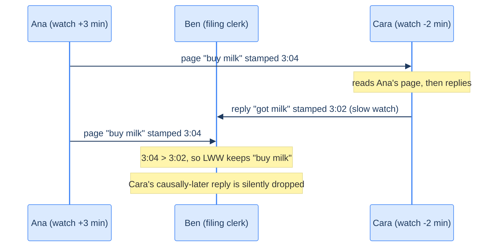

# 15. Clocks and time in distributed systems

## TL;DR
> **There is no global "now."** Every node reads its own quartz crystal, which drifts; NTP nudges those clocks toward agreement but can only ever get them *close* — never exact, and never with a bound you can trust by default. The practical consequences: (1) **never order events across machines by wall-clock timestamp.** Last-Write-Wins resolution, the default in Cassandra and friends, will silently discard a *causally later* write whenever the writer's clock happens to read lower — and report no error. (2) **Use the right clock for the right job:** a *time-of-day* clock (`CLOCK_REALTIME`) for "what calendar instant is this," a *monotonic* clock (`CLOCK_MONOTONIC`) for "how long did this take" — never the reverse, because the time-of-day clock can jump backward. (3) For ordering, reach for **logical clocks** (Lamport timestamps, version vectors) that count events rather than seconds. (4) When you genuinely need physical time across machines — global snapshots, externally-consistent transactions — treat a clock reading as an *interval* `[earliest, latest]`, not a point, and **wait out the uncertainty** (Spanner's TrueTime commit-wait). And remember (5): a thread can be **paused** — GC, VM suspend, a stray `SIGSTOP` — for seconds in the middle of a line of code, so even a lease you "just" checked may have expired by the next statement.

## 1. Motivation

**June 30, 2012, 23:59:60 UTC.** For one second, the world's clocks ran a minute that was 61 seconds long. The International Earth Rotation Service had scheduled a *leap second* — an extra tick inserted to keep atomic time aligned with the Earth's slightly-irregular rotation. Most engineers had never heard of it. Their systems certainly hadn't.

When the extra second arrived, a latent bug in the Linux kernel's high-resolution timer subsystem fired. The kernel updated the wall clock but failed to reprogram a related timer, and threads that were sleeping woke up in a tight loop. The effect, from userspace, was that the CPU pinned at 100%. The Java Virtual Machine — and anything with many threads parked on timed waits — was hit hardest. Reddit went down. Mozilla, Yelp, LinkedIn, Foursquare, and a swath of the internet ran by JVMs all stumbled within the same minute, *worldwide and simultaneously*, because they all ran the same kernel with the same bug and all met the same one-second anomaly at the same instant. The fix that night, for many ops teams, was darkly funny: set the date back and forward by a second (`date -s "$(date)"`) to kick the kernel out of its loop.

Two lessons compress out of that minute, and they frame this whole chapter.

First: **a clock is not a quietly-correct utility you can lean on.** A day does not always have 86,400 seconds. A timestamp is not a fact; it is a *reading*, from imperfect hardware, subject to jumps, drift, and the occasional second that the planet's rotation forces into existence. Treating it as ground truth is how "incorrect assumptions about clocks sneak into a system" — and clock bugs are the worst kind, because the symptom is usually not a clean crash but **silent, subtle data loss** that nobody notices until it's irreversible.

Second: **simultaneity is a liability.** The very thing we want from synchronized clocks — every machine agreeing on the time — is what guaranteed every machine hit the bug at once. The leap second is the dramatic version. The quiet, everyday version is clock *skew* dropping a database write, which is the rest of this chapter.

This lesson sits next to [11 Replication](/cortex/system-design/building-blocks/replication) (which introduced Last-Write-Wins), [13 Consistency models](/cortex/system-design/building-blocks/consistency-models) (which named the ordering anomalies), and [14 Consensus](/cortex/system-design/building-blocks/consensus-paxos-and-raft) (which is what you actually use when you need agreement on order). Clocks are the substrate all three quietly stand on.

## 2. Intuition (Analogy)

Imagine three friends — Ana, Ben, and Cara — trying to **co-author a shared diary by mailing each other pages**, with no phone, no internet, only the postal service. Each writes a page, dates it from the wristwatch on their own arm, and mails copies to the other two. When a page arrives, you file it; if two pages touch the same entry, you keep the one with the later time on it and throw the other away.

Here is the problem, and it is the whole chapter in one image: **their three wristwatches disagree.** Ana's runs three minutes fast; Cara's runs two minutes slow. None of them is "the" clock; there is no clock on the wall they can all glance at. So when Cara reads Ana's page ("buy milk, 3:04"), then writes her *reply* ("got the milk, done") and dates it from her slow watch as 3:02 — Cara's page is *causally later* (it's literally a response to Ana's) but carries an *earlier* timestamp. Ben, filing both, sees 3:04 beats 3:02 and **throws Cara's reply away.** The milk is bought, but the diary forever says it isn't. No one made a mistake. No alarm rings. The information is just gone.

Notice what went wrong: they used a **wristwatch** — a thing for telling the time of day — to decide the **order of events**. Those are different jobs, and the wristwatch is bad at the second one whenever the watches disagree by more than the postal delay.

There are two honest ways out, and they map exactly onto the two halves of this chapter:

- **Stop using watches to order things; number the pages instead.** Each friend keeps a running counter; every page they write gets the next number, *and* a page bumps your counter past any number you've seen. Now Cara's reply, written after seeing Ana's page, is guaranteed a higher number. This is a **logical clock** — it counts events, not seconds, and it gets the *order* right even though it can never tell you what time it is.
- **Keep the watches, but be honest about how wrong they are — and wait.** Suppose each friend's watch came with a little label: "this reads somewhere between 3:01 and 3:05." Before mailing a page, you *wait* until your earliest-possible time is past the latest-possible time anyone could have stamped on a page you depend on. Slower, but now timestamps never lie about order. This is the **confidence-interval** approach, and it is, almost exactly, what Google's Spanner does with TrueTime.



<p align="center"><strong>Last-Write-Wins by wall-clock timestamp drops a causally-later write whenever the writer's clock reads lower. No error is reported.</strong></p>

## 3. Formal definitions

### 3.1 Two clocks, two jobs

Every modern machine carries at least two clocks, and conflating them is one of the most common time bugs in production.

| | **Time-of-day clock** | **Monotonic clock** |
|---|---|---|
| Answers | "What calendar instant is it?" (wall-clock time) | "How much time elapsed between A and B?" |
| Linux call | `clock_gettime(CLOCK_REALTIME)` | `clock_gettime(CLOCK_MONOTONIC)` |
| Java call | `System.currentTimeMillis()` | `System.nanoTime()` |
| Reference point | seconds/ms since the Unix epoch (1970-01-01 UTC) | arbitrary (e.g. since boot) — meaningless in absolute terms |
| Can it go **backward**? | **Yes** — NTP can step it back; leap seconds; DST if you (wrongly) use local time | **No** — guaranteed non-decreasing on a single machine |
| Synchronized across machines? | Yes, via NTP (so timestamps are *roughly* comparable) | No — never compare two machines' monotonic values |
| Use it for | timestamps on events, "published at," cache expiry, reminders | timeouts, latency measurement, "is this lease still valid?" |
| Misuse trap | ordering events; measuring durations (it can jump!) | persisting it; comparing across nodes or reboots |

The rule of thumb: **measure durations with the monotonic clock, name instants with the time-of-day clock.** If you compute `t_end - t_start` from two `currentTimeMillis()` readings and an NTP step lands between them, your "duration" can come out *negative*. The monotonic clock exists precisely so that stopwatch math is safe.

A subtlety on monotonic clocks: NTP can't *jump* them, but it can **slew** them — speed them up or slow them down by up to ~0.05% by default — to coax a drifting quartz back toward truth. So a monotonic second isn't exactly an SI second, but it never runs backward, which is all a stopwatch needs.

### 3.2 Skew, drift, and NTP

Each machine's clock is driven by a **quartz crystal oscillator**, a cheap component that is *not* perfectly accurate. Two quantities describe how wrong it is:

- **Drift** — the *rate* at which a clock gains or loses time, usually quoted in parts per million (ppm). Drift varies with temperature. Google budgets up to **200 ppm** for its servers. 200 ppm is 200 microseconds per second, which works out to roughly **6 ms of error if you resync every 30 seconds**, or about **17 seconds of error if you only resync once a day**. Drift is the floor on accuracy even when nothing is broken.
- **Skew** — the *offset* between two clocks at a given instant. If node A reads 10.000 and node B reads 10.012 at the same true moment, the skew is 12 ms. Skew is what makes LWW lose writes.

**NTP (Network Time Protocol)** is the standard remedy: a machine periodically asks a hierarchy of time servers (which ultimately derive time from GPS or atomic clocks) and adjusts its own clock toward theirs. NTP is good but fundamentally limited — its accuracy can never beat the network round-trip time, because it can't tell how much of the delay was outbound versus inbound. Over the public internet, the *best* achievable error is in the tens of milliseconds (one experiment measured a ~35 ms floor), and congestion can spike that to a second or more. Over a quiet LAN with good servers you can do single-digit milliseconds; with GPS receivers, atomic clocks, and the **Precision Time Protocol (PTP)** you can reach microseconds — which is what the EU's MiFID II regulation demands of high-frequency traders (clocks within **100 µs of UTC**, so that "flash crashes" can be reconstructed in order).

The ways NTP fails are worth memorizing, because each is a real outage waiting to happen:

| Failure | What happens |
|---|---|
| Quartz drift | Clock silently wanders; the longer since last sync, the larger the error. |
| Forced step | If the local clock is *too far* from the server, NTP may **reset it abruptly** — observers see time jump forward or backward. |
| Firewalled-off NTP | A node accidentally blocked from its servers drifts unnoticed for days; everything "works" while it slowly diverges. |
| Wrong/misconfigured server | Some NTP servers report time off by *hours*; clients mitigate by polling several and dropping outliers, but you are still trusting strangers. |
| Network congestion | Variable delay inflates NTP's error; severe delay can make the client give up. |
| Leap second | A 61- or 59-second minute breaks timing assumptions (see §1). |
| VM pause | A virtualized clock can jump when the VM is descheduled (see §6). |

### 3.3 Physical clocks vs. logical clocks

The deepest distinction in the chapter:

- **Physical clocks** — time-of-day and monotonic clocks both measure *actual elapsed time* against an oscillator. They answer "how many seconds."
- **Logical clocks** — counters that increment on events. They answer only *"did A happen before B?"* They have no idea what time it is, and that's the point: they sidestep every quartz-and-NTP problem above by never reading a physical clock at all.

The simplest logical clock is the **Lamport timestamp** (Leslie Lamport, 1978). Each node keeps an integer counter `C`:

1. Increment `C` before each local event (including sending a message).
2. Attach `C` to every message you send.
3. On receiving a message with counter `C_msg`, set `C = max(C, C_msg) + 1`.

This guarantees the **happens-before** property: if event `a` causally precedes event `b` (`a → b`), then `Lamport(a) < Lamport(b)`. Ties (equal counters) are broken by a node ID to give a *total* order. The catch — and it matters — is the converse is **not** true: `Lamport(a) < Lamport(b)` does **not** mean `a` happened before `b`; they may have been *concurrent*. Lamport timestamps give you a consistent total order but cannot *detect* concurrency. To actually detect concurrent writes (so you can flag a conflict instead of silently picking one), you need **version vectors** — one counter per node — which is exactly the machinery [11 Replication](/cortex/system-design/building-blocks/replication) and Riak use to surface sibling values.

Here is the crisp way to remember the divide:

| Property | Physical clock (time-of-day) | Logical clock (Lamport) |
|---|---|---|
| Measures | seconds since epoch | count of events |
| Tells you the time? | yes (roughly) | no |
| Orders causal events correctly? | **no** (skew can invert them) | **yes** (`a → b ⇒ C(a) < C(b)`) |
| Needs clock sync? | yes (NTP) | no |
| Detects concurrency? | no | only with version vectors, not plain Lamport |
| Good for | timestamps, expiry, "published at" | ordering, tie-breaking, MVCC transaction IDs |

### 3.4 A clock reading is an interval, not a point

You can read a clock to nanosecond *resolution* and still have millisecond *error*. Resolution is how many digits the API gives you; accuracy is how many of them are true. After NTP sync over a LAN, the true error is easily several milliseconds — so the microsecond digits are decoration.

The honest mental model: a clock reading is **not a point in time but a range** — a confidence interval. A well-instrumented clock could tell you "I am 95% confident the time is between 10.347 and 10.353." Most clocks refuse to: `clock_gettime` hands you a single number and never says whether its uncertainty is 5 milliseconds or 5 years. The exceptions are the systems built to take time seriously — Google Spanner's **TrueTime** and Amazon's **ClockBound** — which return an explicit `[earliest, latest]` pair. The width of that interval is roughly: *expected drift since last sync + the time server's own uncertainty + network round-trip to the server.* This interval is the foundation of the only correct way to use physical time for ordering, which is §4.

## 4. Worked example — TrueTime, commit-wait, and the cost of certainty

The problem: a globally-distributed database (Spanner) wants every transaction to get a timestamp such that **if transaction T2 starts after T1 commits, then T2's timestamp is strictly greater than T1's** — even though T1 and T2 commit on different machines in different datacenters whose clocks only agree to within a few milliseconds. Get this right and you can take a *consistent global snapshot* and run **externally-consistent** transactions; get it wrong and your snapshot sees half of a transaction.

You cannot do this with point-in-time timestamps, because the intervals overlap. TrueTime's insight is to embrace the interval. `TT.now()` returns `[earliest, latest]`, and Spanner knows the true time lies somewhere inside. The ordering rule falls out of one observation:

> If interval A = `[A.earliest, A.latest]` and interval B = `[B.earliest, B.latest]` do **not overlap** — that is, `A.latest < B.earliest` — then A definitely happened before B. Only if they overlap is the order uncertain.

So Spanner deliberately makes adjacent transactions' intervals not overlap, by **waiting**. The protocol — *commit-wait* — is:

1. When a read/write transaction is ready to commit, pick its commit timestamp `s = TT.now().latest` (the latest possible time *now*).
2. **Wait** until `TT.now().earliest > s`. In other words, wait until the clock is *certain* that real time has passed `s`. This takes about one interval-width, call it `2ε` (epsilon = half the interval).
3. Only then release the transaction's locks and report success.

Let's put numbers on it. Suppose Spanner's clock uncertainty in a datacenter is `ε = 3.5 ms`, so the interval is ~`2ε = 7 ms` wide (Google reaches this with a GPS receiver or atomic clock in every datacenter).

- A transaction T1 commits. It chooses `s₁ = now.latest`. It then **commit-waits ~7 ms** until `now.earliest > s₁`, then releases locks.
- Any transaction T2 that observes T1's effects can only have done so *after* T1 released its locks — i.e. after T1's commit-wait finished. By construction, when T2 picks its own timestamp `s₂ = now.latest`, we already have `now.earliest > s₁`, so `s₂ > s₁`. **The timestamps reflect causality, guaranteed.**

The trade is explicit and quantifiable: **every read/write transaction pays ~`2ε` of added commit latency** — about 7 ms here — and holds its locks for that whole window, which caps write throughput on contended rows. This is why Google spends real money on GPS and atomic clocks: *the hardware isn't there to make the clock "right," it's there to make `ε` small.* TrueTime would still be correct with `ε = 100 ms` — it would just impose a 200 ms commit-wait, which would be unusable. The accurate clocks buy a *narrower interval*, which buys a *shorter wait*. Other systems have since adopted the pattern: **YugabyteDB** can use ClockBound on AWS to get the same interval-based guarantee.

Contrast this with the LWW disaster from §2: LWW takes a point timestamp and *trusts* it; TrueTime takes an interval and *waits out* the doubt. Same goal — order events by physical time — opposite relationship to clock error. One pretends the error is zero; the other measures it and pays for it.

## 5. Trade-offs

| Approach | What you give up | What you get |
|---|---|---|
| **Wall-clock LWW** (Cassandra default) | Correctness: silent, irreversible data loss under skew; can't detect concurrency | Zero coordination; one number per write; fastest possible writes |
| **Logical clocks (Lamport)** | Can't tell the time; can't *detect* concurrency (only order) | Correct causal ordering with no clock sync at all |
| **Version vectors** | Storage + complexity (one counter per node); reads may return siblings | Correct ordering **and** concurrency detection (surface conflicts) |
| **Hybrid Logical Clocks (HLC)** | Slightly more bookkeeping than Lamport | Logical-clock correctness *plus* timestamps close to wall time (debuggable, sortable) — used by CockroachDB, YugabyteDB |
| **TrueTime / ClockBound + commit-wait** | Latency: ~`2ε` per transaction; needs accurate clocks to keep `ε` small (GPS/atomic = $$$) | Externally-consistent global ordering using *physical* time |
| **Consensus for ordering** ([14](/cortex/system-design/building-blocks/consensus-paxos-and-raft)) | Throughput + a leader/round-trip per decision | A single agreed order, no reliance on clocks at all |
| **Monotonic clock for durations** | Can't name calendar instants | Stopwatch math that never goes negative |
| **Time-of-day clock for instants** | Can't safely order or measure durations | Human-meaningful, NTP-comparable timestamps |

The decision tree most teams actually need:

- **Do you need to *order* events across machines?** Don't use wall-clock time. Use a logical clock; if you also need to *detect* conflicts, use version vectors; if you need a single agreed sequence with strong guarantees, use consensus.
- **Do you need a *global snapshot* or externally-consistent transactions using real time?** Use a confidence-interval clock and commit-wait (Spanner/Yugabyte). Pay the `2ε` latency.
- **Do you just need a human-readable timestamp** ("posted at," "expires at") where occasional skew is cosmetic? Wall-clock time is fine — just never let that timestamp *decide* anything.
- **Are you measuring a duration or a timeout?** Monotonic clock, always.

## 6. Edge cases and failure modes

### 6.1 Leap seconds

A leap second makes a UTC minute 61 (or, in principle, 59) seconds long. Code that assumes a day is exactly 86,400 seconds, or that time strictly increases by one second per second, can break — spectacularly, as the June 2012 Linux/JVM hang showed (§1). The pragmatic defense is **smearing**: have your NTP servers "lie" by spreading the extra second across many hours (Google and Amazon smear over a 24-hour window), so no single instant has a discontinuity and application code never sees a 61-second minute. Beware mixing smeared and non-smeared sources in one cluster — the two disagree by up to a full second during the smear window. (Reassuringly, the international community has voted to **abolish leap seconds from 2035**, so this hazard has an expiry date.)

### 6.2 VM pauses and steal time

When several VMs share a CPU core, the hypervisor pauses each one for tens of milliseconds while another runs; with **live migration**, a VM can be suspended (memory snapshotted to disk) and resumed on another host an arbitrary time later. From inside the guest, this manifests as the **clock suddenly jumping forward** when execution resumes — the wall passed but the process wasn't running to see it. An NTP client *inside* the VM doesn't know a pause happened, so it may report clock accuracy that's quietly wrong. The CPU time stolen by other VMs even has a name: **steal time**. The lesson: code in a VM cannot assume that two consecutive instructions are close together in real time.

### 6.3 NTP step (clock jumps backward)

If a node's clock drifts far enough, NTP may **step** it — yank it to the correct value rather than gently slewing — and that step can go *backward*. Any code that read the time-of-day clock just before the step and again just after can see time travel into the past: a "duration" goes negative, a "monotonically increasing" ID generator emits a duplicate, a cache entry that was fresh is suddenly expired (or vice versa). This is the single strongest argument for the §3.1 rule: **timeouts and durations must use the monotonic clock**, which NTP can slew but never step.

### 6.4 The firewalled clock that drifts silently

The nastiest clock failures are the ones that *don't* crash. If a node's CPU dies, it stops serving and you page someone in minutes. If a node's NTP is firewalled off or its quartz is defective, *everything keeps working* — while its clock drifts further and further from reality, quietly corrupting any timestamp-ordered data it touches. The defense is operational, not algorithmic: **monitor the clock offset of every node against the others, and declare any node whose clock drifts too far to be dead and evict it** — the same way you'd evict a node with a failing disk. A clock you don't monitor is a time bomb with a silent fuse.

### 6.5 Process pauses break "I just checked it" reasoning

Consider a leader that holds a **lease** (a lock with a timeout) and runs:

```
while (true) {
  request = getIncomingRequest();
  if (lease.expiryTime - now() < 10_000) lease = lease.renew();
  if (lease.isValid())          // checked here...
    process(request);           // ...but executed here
}
```

This looks safe — there's a 10-second buffer. But what if the thread **pauses for 15 seconds between `isValid()` and `process()`**? Then the lease expired mid-pause, another node already took over as leader, and this thread wakes up and processes the request anyway — **two leaders, split-brain writes**, exactly the hazard [11 Replication](/cortex/system-design/building-blocks/replication) warned about. And a 15-second pause is not far-fetched: a **stop-the-world GC** (historically minutes; still tens of ms even with modern collectors), a **VM suspend** (§6.2), heavy **swapping/thrashing**, **disk I/O** stalls (even a lazy Java classloader load), or a stray **`SIGSTOP`** (someone hit Ctrl-Z) can each freeze a thread for an unbounded interval, anywhere, including the middle of a function. The world keeps moving during your pause and may declare you dead; you find out only when you next check the clock. Defenses: use the *monotonic* clock for the lease check (rules out clock skew but **not** the pause), check validity again right before the unsafe action, and — the real fix — **fence** the resource with a monotonically increasing token that the storage layer rejects if it's stale, so a zombie leader's writes bounce even if it never noticed it lost the lease. This is why "the right primitive for agreement is [consensus](/cortex/system-design/building-blocks/consensus-paxos-and-raft)," not a clever sleep.

### 6.6 Two nodes, identical timestamp

With only millisecond resolution, two nodes can independently stamp two different writes with the *exact same* timestamp. LWW now has a tie and must break it — usually with a random tiebreaker or a node ID. But a tiebreaker chosen without regard to causality can itself *invert* a causal order (pick the "loser" of two writes where one actually depended on the other), reintroducing the §2 data-loss bug through the back door. Higher-resolution clocks reduce the *frequency* of ties; they don't make the underlying ordering trustworthy.

## 7. Practice

### Exercise 1 — Which clock?

For each, say whether you'd read the **time-of-day** clock or the **monotonic** clock, and why:
(a) Stamping `created_at` on a new row. (b) Deciding whether an HTTP request has exceeded its 30-second timeout. (c) Computing the p99 latency of an RPC. (d) Setting a cache entry to expire "in 5 minutes." (e) Scheduling a reminder email for "next Tuesday 9 AM."

<details>
<summary>Solution</summary>

(a) **Time-of-day.** You want a human-meaningful calendar instant, comparable (roughly) across machines. Just don't let `created_at` *decide ordering* of concurrent writes.

(b) **Monotonic.** This is a duration. If you used the time-of-day clock and an NTP step landed mid-request, your elapsed time could go negative or jump, firing (or suppressing) the timeout wrongly. `elapsed = monotonic_now() - monotonic_start`.

(c) **Monotonic.** A latency *is* a duration; same reasoning as (b). Measuring p99 with `currentTimeMillis()` is a classic source of impossible negative samples in dashboards.

(d) **Monotonic for the *deadline math*, conceptually** — "expire 5 minutes from the moment of insertion" is a duration, and an NTP step shouldn't change when it expires. In practice many caches store a wall-clock expiry, which is acceptable *if* you accept that a backward clock step can expire entries early. The senior answer: compute the TTL as a monotonic duration where it matters, and never let a backward step shorten a security-sensitive lease.

(e) **Time-of-day.** "Next Tuesday 9 AM" is a calendar instant, inherently a wall-clock concept (and you'll want the right time zone and to handle DST by storing UTC). A monotonic clock literally cannot express "Tuesday."

The pattern: **points in calendar time → time-of-day; spans of elapsed time → monotonic.**
</details>

### Exercise 2 — How much does LWW lose?

Two datacenters, US and EU, each accept writes to the same key under multi-leader replication with wall-clock LWW. The EU node's clock runs **40 ms behind** the US node's. A user in the US writes `x = "a"`; 25 ms later (in real time) a user in the EU, having seen `x = "a"`, writes the causally-later `x = "b"`. Whose write survives, and what's the general rule for how long the EU node is "blinded"?

<details>
<summary>Solution</summary>

**The US write `x = "a"` survives; the causally-later `x = "b"` is silently dropped.**

Timeline in *true* time: US writes at true T=0, stamping it with the US clock ≈ `T0`. EU writes at true T=25 ms, but the EU clock reads ~40 ms *behind*, so it stamps the write ≈ `T0 + 25 − 40 = T0 − 15 ms`. LWW keeps the larger timestamp: `T0 > T0 − 15`, so `"a"` wins and `"b"` — the actual most-recent, causally-dependent value — vanishes with no error.

General rule: **a node whose clock lags by `δ` cannot overwrite a value written by a faster node until `δ` of real time has elapsed.** For the full skew window (here 40 ms), the lagging node's writes to keys recently touched by the faster node are liable to be silently discarded. With larger skews (a firewalled NTP node drifting for hours, §6.4) this becomes *arbitrary amounts of silently dropped data*.

The fixes, in order of seriousness: (1) ensure an overwrite always gets a timestamp strictly greater than what it overwrites — but that costs an extra read to find the current max (Cassandra/ScyllaDB skip this read by design, which is *why* they're exposed). (2) Use **version vectors** to detect that `"b"` causally follows `"a"` and keep `"b"`. (3) Don't model the data so concurrent updates collide at all — counters as deltas, sets as CRDTs. This is exactly the §6.4 lesson of [11 Replication](/cortex/system-design/building-blocks/replication): LWW's loss is silent and irreversible, so design the data model so collisions don't happen.
</details>

### Exercise 3 — Tighten the commit-wait

Your Spanner-style database currently runs with clock uncertainty `ε = 5 ms` (interval width `2ε = 10 ms`), so every read/write transaction commit-waits ~10 ms. A product team complains that write latency is too high on a hot row. Your colleague proposes "just skip the commit-wait — the clocks are synced by NTP anyway, it'll *probably* be fine." What's wrong with that, and what would you actually do?

<details>
<summary>Solution</summary>

**Skipping commit-wait breaks the one guarantee the whole design exists to provide.** Commit-wait is *not* a conservative safety margin you can shave; it is the mechanism that makes non-overlapping intervals imply real ordering. Remove it and two transactions whose intervals overlap can be assigned timestamps in the *wrong* causal order — a later transaction gets an earlier timestamp — so a global snapshot can see a transaction's effects without its cause, or miss a committed write. "Probably fine" means "silently corrupts the snapshot whenever the skew bites," which is the §2 LWW bug wearing a nicer suit. The latency isn't the price of caution; it's the price of correctness.

What you actually do is attack `ε`, because **commit-wait latency is `2ε`** — halve the uncertainty and you halve the wait:

1. **Tighten clock sync.** This is precisely why Google puts GPS receivers and atomic clocks in every datacenter — to shrink `ε` to a few milliseconds. Better time sources (PTP, ClockBound, a local stratum-1 server) directly shorten the wait. Going from `ε = 5 ms` to `ε = 1 ms` turns a 10 ms wait into 2 ms.
2. **Reduce contention on the hot row** so the lock-hold during commit-wait stops serializing throughput — shard the counter, batch, or move it to a CRDT-style structure that doesn't need a single serialized timestamp.
3. **Question whether this transaction needs external consistency at all.** If the operation tolerates a weaker guarantee, route it to a path that doesn't commit-wait (e.g. a bounded-staleness read). Match the consistency to the query, per [13 Consistency models](/cortex/system-design/building-blocks/consistency-models) — don't pay external-consistency latency for a query that doesn't need it.

The meta-lesson: when physical-time ordering is too slow, the lever is **clock accuracy and contention**, never *trusting the clock more than it deserves*.
</details>

## Your Turn
Before you move on, check your understanding with the coach — explain the idea, apply it, weigh the trade-offs, then defend your reasoning.

<div class="concept-coach"></div>

## 8. In the Wild

- **[DDIA 2e, Chapter 9 — *The Trouble with Distributed Systems*](https://www.oreilly.com/library/view/designing-data-intensive-applications/9781098119058/)** (Kleppmann) — the source this chapter paraphrases. The "Unreliable Clocks" section (monotonic vs. time-of-day, confidence intervals, process pauses) is the canonical treatment; read it for the full citation trail.
- **[Corbett et al., *Spanner: Google's Globally-Distributed Database*](https://research.google/pubs/pub39966/)** (OSDI 2012) — the TrueTime + commit-wait paper. Section 3 (TrueTime) and Section 4.1.2 (commit-wait) are the core; everything in §4 above is a simplification of these pages.
- **[Lamport, *Time, Clocks, and the Ordering of Events in a Distributed System*](https://lamport.azurewebsites.net/pubs/time-clocks.pdf)** (CACM 1978) — the founding paper on logical clocks and the happens-before relation. Short, profound, and still the clearest statement of why physical time is the wrong tool for ordering.
- **[Minar, *Leap Second Crashes Half the Internet*](https://somebits.com/weblog/tech/bad/leap-second-2012.html)** (2012) — the contemporaneous write-up of the June 2012 leap-second/JVM outage from §1. The comments are a tour of which services fell over and the `date -s` workaround.
- **[Amazon ClockBound](https://github.com/aws/clock-bound)** — open-source daemon that exposes a TrueTime-style `[earliest, latest]` confidence interval on EC2, the building block YugabyteDB and others use for interval-based ordering off Google's hardware.
- **[ntp.org — How NTP Works](http://www.ntp.org/documentation/4.2.8-series/warp/)** — the operational reference for stratum hierarchy, slewing vs. stepping, and the configuration knobs (`tinker`, `maxpoll`) behind §3.2.

---

> **Next:** [16. Distributed-systems faults](/cortex/system-design/building-blocks/distributed-systems-faults) — clocks were one of the three things that betray you across a network; the other two are *messages* (dropped, delayed, reordered, duplicated) and *nodes* (crashed, or worse, half-dead and lying). The next chapter assembles the full taxonomy of partial failure — fail-stop vs. Byzantine, the two-generals and split-brain traps, fencing tokens, and why "the network is reliable" tops every list of distributed-systems fallacies.
