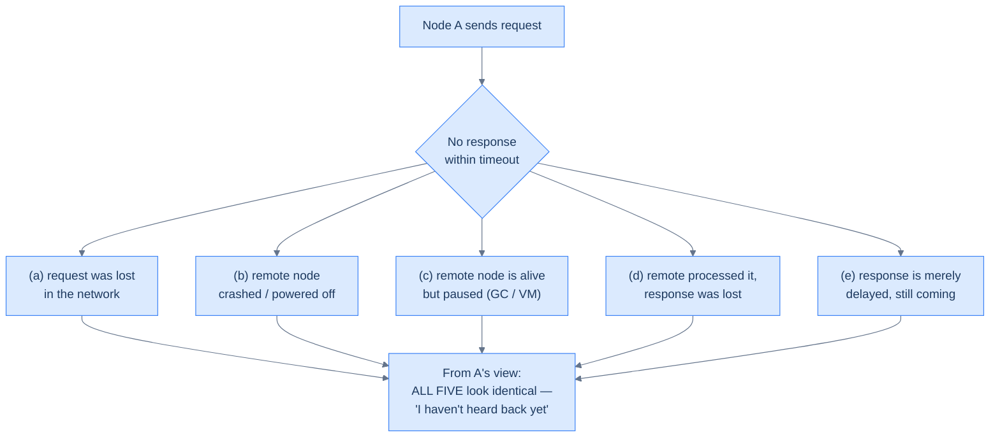
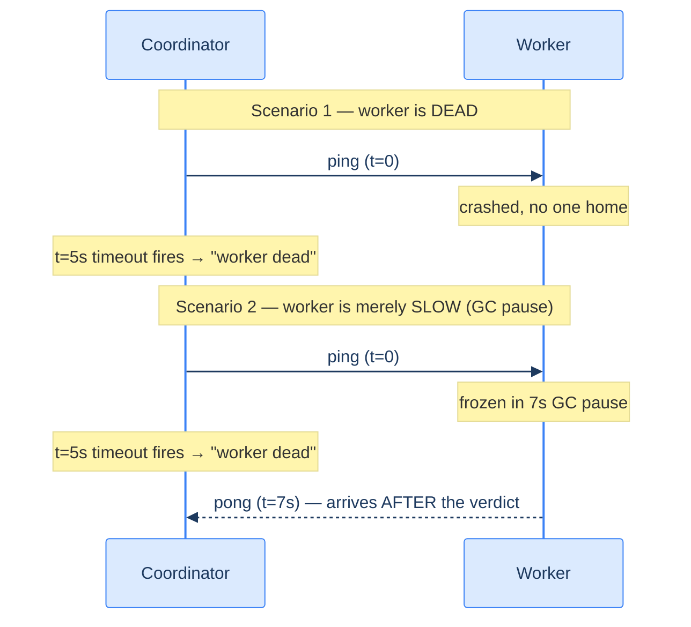
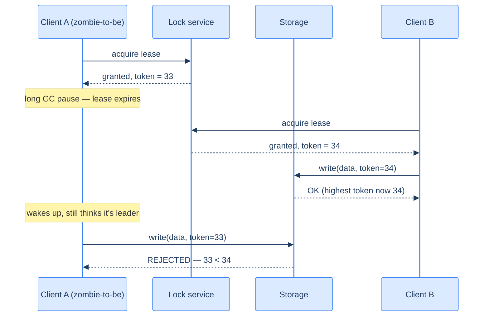

# 16. Distributed-systems faults

## TL;DR
> **In a single program, a fault is total: it works or it crashes. In a distributed system, faults are *partial* — some nodes work, some don't, and from any one node you cannot reliably tell which.** The root of nearly every hard distributed-systems bug is this: *a node that doesn't answer is indistinguishable from a node that is merely slow, an answer that got lost, or a network that dropped the question.* The only tool you have is a **timeout**, and a timeout is a guess. Set it short and you declare healthy nodes dead (false failover, split-brain); set it long and you wait forever on corpses. Because no single node can be trusted to know the truth — it may be paused, partitioned, or lying — distributed systems define truth by **quorum** (the majority decides, including deciding who is dead). And because a node declared dead may not *know* it (a "zombie" that wakes from a GC pause still thinks it holds the lease), correctness comes from **fencing tokens**: monotonic numbers that let storage reject a stale writer's late request. Engineering distributed systems is engineering *around irreducible uncertainty*, not eliminating it.

## 1. Motivation

In the small hours, a payments service ran a perfectly ordinary three-node cluster behind a lock service. One node — call it **A** — held the lease that made it the single writer to a shared ledger file. The lease worked exactly as designed: A renewed it every few seconds, and if A ever went quiet, the lease would expire and another node could take over. Belt and braces.

Then A's JVM hit a **stop-the-world garbage-collection pause**. Not a crash — a pause. For roughly fifteen seconds, every thread in A froze mid-execution. A was not dead. It had simply stopped existing, from the rest of the world's point of view, without knowing it. During those fifteen seconds, A's lease expired. The lock service handed the lease to node **B**, which dutifully became the writer and began appending to the ledger.

Then A woke up. From A's perspective, *no time had passed* — it was in the middle of processing a write request when the pause hit, and now it simply continued. It still believed it held the lease (its last check said so), so it finished the write and sent it to storage. Now **two nodes had each written to the "single-writer" ledger.** The two write streams interleaved and corrupted the file. The "single writer" invariant — the one thing the entire design rested on — had been quietly violated by a node that was never down and never wrong by its own lights.

This is the shape of distributed failure, and it is genuinely disorienting the first time you meet it. Nothing crashed. No network cable was unplugged. No code threw an exception. A lease timed out *correctly*, a failover happened *correctly*, and the system still corrupted data — because **a paused node cannot tell that it was paused**, and the rest of the cluster cannot tell a paused node from a dead one. The same anatomy underlies the GitHub October 2018 split-brain ([Lesson 11](/cortex/system-design/building-blocks/replication)): a 43-second partition that *looked* like a dead primary, an eager failover, two primaries, a 24-hour reconciliation.

The fix to our payments incident is not "tune the GC" or "make the timeout longer." Those reduce the odds; they don't change the physics. The fix is a **fencing token** (§4) — and understanding *why* you need one requires understanding the whole fault model this lesson lays out.

## 2. Intuition (Analogy)

Picture a **submarine crew during a deep dive, communicating with the surface only by sonar pings.**

On the surface, command sends a ping: *"Report status."* They wait. No reply comes back within the expected window. Now — what do they *know*? Almost nothing useful. Maybe the sub is destroyed. Maybe the sub is fine but their outgoing ping never reached it. Maybe the sub heard them and answered, but the reply ping was swallowed by a thermocline. Maybe the sub is fine and answering but is simply *deeper than expected*, so the ping is still travelling. From the surface, **a silent sub is indistinguishable from a dead sub, a lost question, and a lost answer.** The only knob command has is *how long to wait before assuming the worst* — and that knob is a pure guess. Wait too little and they'll mourn a healthy crew and maybe send a rescue sub that collides with the real one (two subs, one mission — a *split-brain*). Wait too long and a genuine emergency goes unanswered.

Now add the cruel twist that makes distributed systems special. The submarine itself can be **"paused"** — imagine the crew briefly knocked unconscious by a jolt, then coming to. From *their* point of view, no time passed; they pick up exactly where they left off and keep transmitting orders as if still in command. But topside, minutes elapsed, they were declared lost, and a replacement was dispatched. The revived crew is now a **zombie**: acting with full authority it no longer legitimately holds, completely unaware anything happened. You cannot prevent the jolt. You can only make sure that when the zombie's orders finally surface, **everyone downstream can recognise them as stale and ignore them** — which is exactly what a fencing token does.

And the whole reason any of this is survivable: **no single observer's word is trusted.** Surface command doesn't decide the sub is dead — *a majority of the listening posts* must agree they've lost contact. One listening post with a broken hydrophone can't condemn the crew, and there can never be *two* conflicting majorities. That is the quorum principle, and it is the bedrock under failover, leader election, and consensus.



<p align="center"><strong>The central impossibility. A timeout collapses five very different realities — three where the node is fine — into one indistinguishable signal.</strong></p>

## 3. Formal definitions

### 3.1 Fault vs failure, and the meaning of *partial*

The two words are not synonyms, and the distinction is load-bearing.

- A **fault** is when one *component* deviates from its spec — a node crashes, a packet drops, a disk returns a wrong byte, a clock drifts.
- A **failure** is when the *system as a whole* stops providing the service its users need.

The entire discipline of fault tolerance is the art of **keeping faults from becoming failures.** A replicated database *tolerates* the fault of one node crashing; the system keeps serving, so the fault never becomes a failure. The reason we can build a reliable whole from unreliable parts is precisely that faults are *partial*.

On a single computer, faults are essentially *total* and *deterministic*. The hardware works and every operation is repeatable, or the hardware fails and you get a kernel panic — a clean, total stop. This is a deliberate design choice: we prefer a machine to crash outright rather than return a wrong answer, because wrong answers are far harder to reason about. A single machine hides its messy physical reality behind an idealised model of "perfect, or dead."

A distributed system **cannot offer that idealisation.** Connect machines with a network and you get **partial failure**: some parts broken, others fine, *at the same time*. Worse, partial failures are **nondeterministic** — attempt anything spanning multiple nodes and the network, and it may work, or fail, or (the nasty case) *appear to fail while having actually succeeded*. You frequently **cannot even know whether your operation took effect.** This nondeterminism, not any single failure, is what makes distributed systems hard.

### 3.2 The unreliable network and the timeout trap

Datacenter and internet links are **asynchronous packet networks**: a node may send a packet, but there is *no guarantee* of when — or whether — it arrives. (Network *mechanics* — TCP, congestion control, RTT — are [Lesson 06](/cortex/system-design/building-blocks/networking-primer)'s subject; here we care only about the *fault* this creates.) When you send a request and no response comes back, the cause is genuinely ambiguous across all five branches in the diagram above. TCP's retransmission doesn't rescue you: even an ACK only proves the *kernel* received the bytes, not that the application processed them, and a closed connection tells you nothing about how much work the far side actually did.

So the only general-purpose fault detector you have is the **timeout** — wait some duration, then *assume* the worst. This makes failure detection **fundamentally a heuristic, never a fact**, and forces an unavoidable trade-off:

| Timeout length | False positives (declare a live node dead) | False negatives (slow to notice a real death) | Failure mode it invites |
|---|---|---|---|
| **Too short** | frequent — a transient latency spike condemns a healthy node | rare | premature failover, duplicated work, split-brain, **cascading failure** |
| **Too long** | rare | frequent — users wait on a corpse | slow recovery, prolonged unavailability |

There is **no universally correct timeout**, because the underlying delays are *unbounded*: asynchronous networks place no ceiling on delivery time, and servers can't promise a maximum processing time. You're tuning against a distribution with no upper bound — which is why this is a trade-off you *manage*, never one you *solve*. ([Lesson 23](/cortex/system-design/distributed-patterns/circuit-breakers-and-bulkheads)'s circuit breakers and [Lesson 07](/cortex/system-design/building-blocks/load-balancing)'s health checks are pragmatic responses to exactly this.)

A particularly vicious false-positive cascade: a node is slow *because it's overloaded*; the timeout declares it dead; its load is shifted onto its peers; they too tip over the latency edge; they get declared dead; in the limit **every node declares every other node dead and the whole system stops** — a cascading failure born entirely of impatient failure detection.

### 3.3 Process pauses — the in-node version of the same problem

The network is not the only source of unbounded delay. **A node can pause itself**, for an arbitrary length of time, *in the middle of a function*, without noticing:

- **Stop-the-world garbage collection.** A runtime (the JVM, classically) halts *every* thread to collect. Modern collectors have shrunk this, but multi-hundred-millisecond — historically multi-*minute* — pauses still happen.
- **VM live-migration and suspend/resume.** A hypervisor can freeze an entire guest OS to move it to another host or to time-slice it; the guest resumes later with no awareness of the gap. CPU stolen by other VMs is *steal time*.
- **Synchronous I/O and paging.** A page fault, a slow disk, a lazily-loaded class file, swapping under memory pressure — any can stall a thread unexpectedly. With paging enabled, even a plain memory access can block on disk.
- **`SIGSTOP`.** A stray `Ctrl-Z` or an ops script can freeze a process cold until `SIGCONT`.

The consequence is the punchline of §1: **a node must assume it can be paused at any instant, and during that pause the rest of the world moves on — possibly declaring it dead and electing its replacement.** When it resumes, it has no built-in way to know time was lost. The single-machine toolbox (mutexes, atomics, blocking queues) does not save you, because there is *no shared memory* — only messages over an unreliable network.

### 3.4 The system model — naming your assumptions

You cannot prove anything about a system without first stating what faults you assume. That statement is a **system model**, and it has two independent axes.

**Timing assumptions:**

| Model | Assumes | Realistic? |
|---|---|---|
| **Synchronous** | bounded network delay, bounded pauses, bounded clock error — known fixed upper limits | No — real delays and pauses are unbounded |
| **Partially synchronous** | behaves synchronously *most* of the time, but bounds are *occasionally* blown arbitrarily | **Yes — the realistic model for most systems** |
| **Asynchronous** | *no* timing assumptions at all; no clocks, no timeouts allowed | Very restrictive; few problems are solvable here |

**Node-failure assumptions:**

| Model | A node may… | Notes |
|---|---|---|
| **Crash-stop** (fail-stop) | crash once, then be gone *forever* | Simplest; often unrealistic — nodes reboot |
| **Crash-recovery** | crash and *come back* later, losing in-memory state but keeping stable disk | **The realistic model** |
| **Byzantine (arbitrary)** | do *anything*, including lie and actively deceive | Needed only in adversarial / safety-critical settings (§3.6) |

> **The default working model for real-world distributed systems is *partially synchronous* + *crash-recovery*.** It admits unbounded delays, pauses, and slow nodes, while assuming nodes are honest and disk survives a crash. Almost every consensus and replication algorithm you'll meet is proven correct under exactly this model. (A model also distinguishes **safety** — "nothing bad ever happens," e.g. two fencing tokens are never equal — from **liveness** — "something good eventually happens," e.g. a request eventually gets a response. We usually demand safety *always* and liveness *only when* the network behaves.)

### 3.5 Knowledge, truth, and lies — why the majority is the truth

The deepest idea in this lesson: **a node cannot trust its own judgement about the system.** A node knows only what messages it has received. It may be partitioned, paused, or the victim of an asymmetric fault (it can hear others but its own outbound messages are silently dropped — so it's wrongly buried while screaming "I'm not dead!"). Because *any* single node may be wrong or unreachable at any moment, you cannot let one node be the arbiter of anything important.

The resolution is the **quorum**: decisions require votes from a *minimum number* of nodes, usually an **absolute majority (more than half)**. This includes the decision *"is node X dead?"* — **if a majority say X is dead, X is dead, and X must abide by that even if it feels perfectly alive.** Majority quorums work because (a) they tolerate a minority of faulty nodes (3 nodes tolerate 1, 5 tolerate 2), and (b) **there can only ever be one majority** — two conflicting majorities cannot coexist, which is exactly what prevents two leaders. This is the seed of [Lesson 14](/cortex/system-design/building-blocks/consensus-paxos-and-raft)'s consensus and the principled cure for [Lesson 11](/cortex/system-design/building-blocks/replication)'s split-brain. **Truth in a distributed system is not what any node believes — it is what the majority agrees on.**

### 3.6 Byzantine faults — when nodes lie

Everything above assumes nodes are **unreliable but honest**: a node may be slow, silent, or stale, but if it answers, it answers truthfully to the best of its knowledge. Drop that assumption — allow a node to send *arbitrary, contradictory, malicious* responses (e.g. cast two conflicting votes in one election) — and you have a **Byzantine fault**, named for the Byzantine Generals Problem (loyal generals must agree on a plan while traitors among them send fake messages, and nobody knows who the traitors are).

A system is **Byzantine fault-tolerant (BFT)** if it stays correct even when some nodes actively misbehave. BFT is *expensive* — algorithms typically need a **supermajority (> two-thirds) honest** — and for most server-side systems it's overkill, because **you control all the nodes in your own datacenter and can trust them.** When it genuinely matters:

- **Safety-critical aerospace/embedded** — radiation can flip bits in memory or registers, making a node respond arbitrarily; flight controllers must tolerate it.
- **Mutually-distrusting parties with no central authority** — cryptocurrencies (Bitcoin et al.) use BFT-style consensus so untrusting participants agree a transaction happened without a trusted referee.

Two myths worth puncturing. **(1)** BFT does *not* protect against bugs if you run the same code everywhere — the same Byzantine fault appears on every node at once, defeating the supermajority. **(2)** BFT is *not* your defence against attackers — if an adversary cracks one node they can usually crack all of them (same software). The real defences against both lying clients and attackers are the boring, essential ones: **input validation, sanitisation, output escaping, authentication, access control, encryption, firewalls** — and making the server the authority on what clients may do. Even inside a trusted datacenter, cheap **weak-lie** guards pay off: application-level checksums catch the occasional corrupted packet TCP misses; NTP clients poll several servers and discard the outlier liar.

## 4. Worked example

**Part A — why a timeout can't distinguish slow from dead.** A coordinator pings a worker and waits 5 seconds.



In both scenarios the coordinator sees the *exact same thing*: silence for 5 seconds. It cannot tell them apart — the information simply isn't available. In Scenario 2 the worker was alive the whole time; the late `pong` arrives *after* the coordinator already gave its job to someone else. **This is not a bug to fix; it is the irreducible limit of failure detection.** Every "is it dead?" decision in every distributed system is a bet made on incomplete information.

**Part B — fencing tokens make the wrong bet harmless.** We can't stop the false positive, so we make it *safe*. The lock service stamps every lease grant with a **monotonically increasing fencing token**, and the storage service **refuses any write carrying a token lower than the highest it has already accepted.**



Client A is a textbook **zombie**: it genuinely believes it still holds the lease, and we *cannot* convince it otherwise in time. But its write carries token `33`, storage has already accepted `34`, so the stale write is rejected. **The zombie is fenced off without ever knowing it was one.** Note the elegance: this defends not only against pauses but against *arbitrarily delayed network packets* — A's write could have been sent before the pause and merely held up in the network for a minute; the token check rejects it just the same.

The token must satisfy three properties: **uniqueness** (no two grants return the same token), **monotonicity** (a later grant always gets a higher number), and **availability** (a non-crashed requester eventually gets one). In practice the token is the consensus layer's own sequence number — ZooKeeper's `zxid`, etcd's revision, a Raft **term** or Paxos **ballot** — and storage enforces it with a conditional/compare-and-set write (S3 conditional writes, Azure conditional headers, GCS preconditions). For a *leaderless* store ([Lesson 11](/cortex/system-design/building-blocks/replication)), pack the token into the high bits of the write timestamp so the newer leaseholder's writes always sort above the zombie's under last-write-wins. **A lease without a fencing token is not safe** — it only narrows the window in which two writers collide; the token is what closes it.

## 5. Trade-offs

| Decision | What you give up | What you get |
|---|---|---|
| **Short failure-detection timeout** | stability — transient slowness triggers false failovers, risking split-brain & cascades | fast reaction to genuine deaths (low MTTR) |
| **Long failure-detection timeout** | responsiveness — users wait on dead nodes | far fewer false positives; safer in ambiguous partitions |
| **Lease only (no fencing)** | safety — zombies & delayed packets can double-write | simple; no storage-side token check needed |
| **Lease + fencing token** | a storage layer that supports conditional/CAS writes; a monotonic token source | provably safe single-writer even under pauses & delays |
| **Crash-stop modelling** | realism — real nodes reboot and come back | simpler algorithms and proofs |
| **Crash-recovery modelling** | simplicity — must handle returning zombies, stable storage | matches reality; the sane default |
| **Honest-node (non-BFT) assumption** | protection against lying/compromised nodes | dramatically cheaper; fine inside a trusted datacenter |
| **Byzantine fault tolerance** | throughput & cost (supermajority, heavy protocol) | survival of malicious/arbitrary nodes (aerospace, blockchains) |
| **Synchronous system model** | correctness in the real world (assumptions get violated) | clean reasoning — useful only as a teaching device |
| **Partially-synchronous model** | the comfort of guaranteed timing | algorithms that are *actually correct* on real networks |

The pragmatic defaults for an ordinary backend in 2026: **assume partially-synchronous + crash-recovery; assume honest nodes (no BFT); never auto-failover on a single observer or a sub-10-second timeout; require a quorum to declare death; and put a fencing token behind every "only one writer" invariant.** Reach for BFT only with genuinely untrusting parties or radiation-grade safety requirements.

## 6. Edge cases and failure modes

1. **GC pause longer than the lease (the §1 incident).** A stop-the-world collection outlasts the lease TTL; the holder becomes a zombie and double-writes. *Tuning the GC lowers the probability but never the possibility.* The only real fix is a **fencing token** so the late write is rejected. Secondary mitigations: low-pause collectors, generous lease TTLs relative to worst-observed pause, and treating any "only one X" invariant as requiring a token, not just a lock.

2. **Clock-based leases with skewed clocks.** A lease whose expiry is set on one machine's wall clock and checked against *another* machine's wall clock breaks the moment the clocks disagree by more than a few seconds — one node thinks the lease is live while another has already reassigned it. Lease logic must use **monotonic clocks** for elapsed-time checks, never wall-clock comparisons across machines, and *still* needs fencing, because even a correct monotonic check can be overtaken by a pause *after* the check ([Lesson 15](/cortex/system-design/building-blocks/clocks-and-time) covers why clocks lie).

3. **Asymmetric / one-way network faults.** A NIC drops all *inbound* packets but sends *outbound* fine — or A→B works while B→A doesn't. A node can then be perfectly healthy yet unable to prove it, get voted dead, and have its work reassigned while it's still doing it. This is *why* failure decisions must be a quorum vote and why a "dead" node must step down rather than trust its own sense of being alive.

4. **Byzantine faults in the wild — and the temptation to over-engineer.** Real Byzantine behaviour is rare in a single-tenant datacenter, so reaching for full BFT there is usually wasted cost and complexity. But *weak* lying is common — bit-flips slipping past TCP checksums, a misconfigured NTP server reporting a wrong time, a buggy node returning garbage. Guard against these with cheap, targeted measures (application-level checksums, multi-server NTP with outlier rejection, strict protocol parsers), **not** a heavyweight BFT protocol you don't need.

5. **Gray failure / the limping node (fail-slow).** The hardest case of all: a node that is *neither up nor down*. It passes health checks but does no real work — a NIC silently degraded to kilobits, an SSD with erratic latency, a process spending all its time in GC, or a deadlocked background thread while the foreground still answers pings. Crude liveness checks call it healthy; users see timeouts. Detection needs **end-to-end, work-representative probes** (does a real request complete in time?) rather than shallow "is the port open?" checks, plus latency-percentile alerting and load-shedding that can route around a node that's *technically* up.

6. **Cascading failure from impatient detection.** Covered in §3.2 and worth restating as a failure mode: a too-aggressive timeout under load turns one slow node into a stampede of false deaths and reassignments that topples the cluster. The combination of **backpressure, circuit breakers, and timeouts tuned to real latency distributions** ([Lesson 23](/cortex/system-design/distributed-patterns/circuit-breakers-and-bulkheads)) is the defence.

## 7. Practice

### Exercise 1 — Where's the bug in this lease loop?

A node guards a single-writer resource with a lease and this request loop:

```text
while (true) {
    request = getIncomingRequest();
    if (lease.expiryTimeMillis - System.currentTimeMillis() < 10000) {
        lease = lease.renew();         // refresh if < 10s remaining
    }
    if (lease.isValid()) {
        process(request);              // do the write
    }
}
```

Name **two independent flaws**, and state the one mechanism that makes the resource safe regardless of either.

<details>
<summary>Solution</summary>

**Flaw 1 — cross-machine wall-clock comparison.** `expiryTimeMillis` was computed on the *lock service's* clock (e.g. "now + 30s") but is compared against *this* machine's `System.currentTimeMillis()`. If the two wall clocks are skewed by more than a few seconds, the node will mis-judge whether the lease is live — believing it valid when it has actually expired elsewhere. Elapsed-time checks must use a **monotonic clock**, not wall-clock arithmetic across machines ([Lesson 15](/cortex/system-design/building-blocks/clocks-and-time)).

**Flaw 2 — an unbounded pause between the check and the use.** The code assumes almost no time passes between `lease.isValid()` and `process(request)`. But a **stop-the-world GC pause, VM suspension, or page-fault stall** can freeze the thread *right there* for 15+ seconds. The lease expires mid-pause, another node takes over, and when this thread resumes it happily runs `process(request)` on a lease it no longer holds — a zombie write. Crucially, *no check you add to this loop can close the gap*, because the pause can always strike *after* your last check.

**The mechanism that actually saves you: a fencing token.** Since you cannot prevent the pause and cannot detect it in time, make the stale write *harmless*. Have the lock service issue a monotonically increasing token with each grant, include it on every write, and have storage reject any write whose token is below the highest it has seen. The zombie's late write carries an old token and is refused. The lease *coordinates*; the token *enforces safety*.

</details>

### Exercise 2 — Choosing (or rejecting) Byzantine fault tolerance

For each system, decide whether you'd invest in full Byzantine fault tolerance, and justify it in one or two sentences.

(a) An internal order-processing service across three nodes in your company's own datacenter.
(b) A public cryptocurrency settlement network run by mutually-distrusting strangers.
(c) A flight-control computer on a spacecraft.
(d) A public-facing web API receiving requests from end-user browsers.

<details>
<summary>Solution</summary>

**(a) No.** All three nodes are under your control and can be trusted to run the protocol honestly; the realistic model is partially-synchronous + crash-recovery with *honest* nodes. BFT's supermajority overhead buys you nothing here. Guard against *weak* lying (checksums, sane NTP) and move on.

**(b) Yes.** This is the textbook BFT case: many participants, no central authority, real financial incentive to cheat (double-spend, forged votes). BFT-style consensus is exactly what lets mutually-distrusting parties agree a transaction happened without a trusted referee.

**(c) Yes.** Radiation can corrupt memory or registers and make a node emit arbitrary, contradictory outputs — genuine Byzantine behaviour — and a single wrong answer can be catastrophic. Safety-critical aerospace systems use BFT (and hardware-level support) precisely for this.

**(d) No — but not because faults can't be malicious; they absolutely are.** Browsers are user-controlled and will send hostile input. The defence, however, is *not* a BFT protocol — it's making the **server the authority** and applying input validation, sanitisation, output escaping, authentication, and access control. BFT addresses lying *peers in a consensus group*, not lying *clients*; the two need different tools.

</details>

### Exercise 3 — Designing a failure detector you can defend

Your team proposes auto-promoting a standby if a single monitoring node misses **3 seconds** of heartbeats from the primary. You're asked to harden it. List the changes and the principle behind each.

<details>
<summary>Solution</summary>

**1. Lengthen the timeout to tens of seconds.** Three seconds is well inside the range of an ordinary transient latency spike or a GC pause on a perfectly healthy primary. Because network and pause delays are *unbounded*, an aggressive timeout maximises false positives. *Principle: failure detection is a heuristic; bias it toward not condemning the living.*

**2. Require a quorum of observers, not one.** A single monitor with a degraded NIC (an asymmetric fault) could declare a healthy primary dead all by itself. Demand that a **majority** of independent monitors agree the primary is unreachable before promoting. *Principle: no single node's judgement is trustworthy; truth is decided by majority — and there can be only one majority, so you can't get two promotions.*

**3. Fence the old primary with a token.** Even after a *correct* promotion, the old primary may be a zombie (paused, or partitioned and unaware it was replaced) and may still send writes. The new primary must obtain a higher fencing token and storage must reject the old one's writes. *Principle: you cannot prevent zombies; you make their actions harmless.*

**4. Prefer manual failover for ambiguous cases.** A clean signal (process gone, port refusing connections via RST/FIN) can be safe to automate. A murky "primary is reachable but slow / heartbeats intermittent" — i.e. a possible **gray failure** — should page a human, because no heuristic reliably separates "dead" from "slow." *Principle: automate only the unambiguous; when slow and dead are indistinguishable, a human is the better arbiter.*

The through-line: you cannot eliminate the uncertainty, so you (a) tune detection to fail safe, (b) decide by quorum, (c) fence to contain the inevitable wrong calls, and (d) escalate the genuinely ambiguous to a person.

</details>

## Your Turn
Before you move on, check your understanding with the coach — explain the idea, apply it, weigh the trade-offs, then defend your reasoning.

<div class="concept-coach"></div>

## 8. In the Wild

- **[Kleppmann, *Designing Data-Intensive Applications* (2e), Ch. 9 — "The Trouble with Distributed Systems"](https://www.oreilly.com/library/view/designing-data-intensive-applications-2nd/9781098119058/)** — the definitive treatment of partial failure, the timeout impossibility, process pauses, system models, fencing tokens, and Byzantine faults. The source this lesson is built on; read it in full.
- **[Burrows, *The Chubby lock service for loosely-coupled distributed systems* (Google, OSDI 2006)](https://research.google/pubs/pub27897/)** — the lock service that popularised *sequencers* (fencing tokens) and the operational reality of leases at scale. The "§2.4 sequencers" discussion is the canonical fencing-token reference.
- **[Castro & Liskov, *Practical Byzantine Fault Tolerance* (PBFT, OSDI 1999)](https://pmg.csail.mit.edu/papers/osdi99.pdf)** — the paper that made BFT practical, and the lineage behind most modern BFT/blockchain consensus. Reach for it when you actually face untrusting peers.
- **[GitHub Engineering, *October 21 post-incident analysis* (2018)](https://github.blog/news-insights/company-news/oct21-post-incident-analysis/)** — a real partial-failure-to-split-brain cascade: a 43-second partition misread as a dead primary, an eager failover, two primaries, 24 hours of reconciliation. The fault model of this lesson, in production.
- **[Huang et al., *Gray Failure: The Achilles' Heel of Cloud-Scale Systems* (Microsoft, HotOS 2017)](https://www.microsoft.com/en-us/research/publication/gray-failure-the-achilles-heel-of-cloud-scale-systems/)** — why "neither up nor down" limping nodes evade health checks, and why detection must be end-to-end. The best short read on §6's hardest failure mode.

---
> **Next:** [17. Message queues and streams](/cortex/system-design/distributed-patterns/message-queues-and-streams) — once you accept that nodes pause, partition, and lie, synchronous request/response starts to look fragile; queues and logs turn "did my call reach a live node?" into a durable, replayable record that survives the very faults this lesson catalogued.
