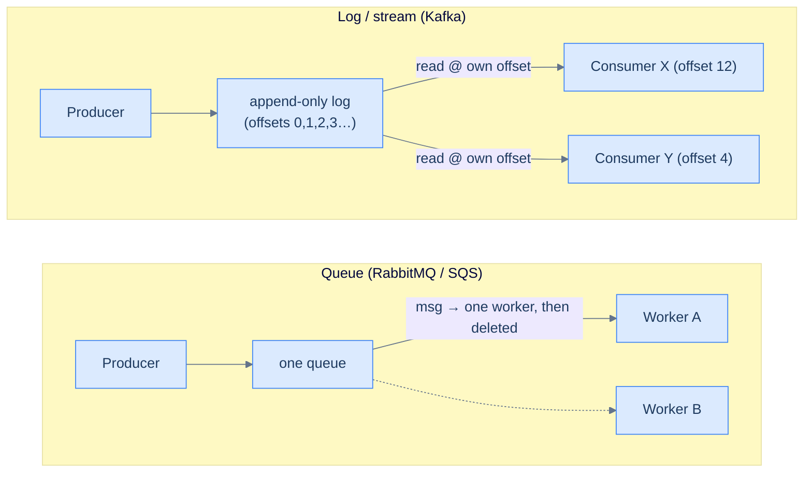

# 15. Message queues and event streams

## TL;DR
> A message broker sits between a producer and a consumer so that a slow, busy, or crashed consumer never drags the producer down with it. There are two shapes. A **queue** hands each message to *one* worker, who processes it and then it's gone — great for spreading work across a fleet (RabbitMQ, Amazon SQS). A **log** (or *event stream*) is an append-only, ordered record that *many* consumers read independently, each tracking its own position, with the data left in place for replay — great for fanning the same events out to many systems (Apache Kafka). Delivery comes in three flavours: **at-most-once** (fast, can lose messages), **at-least-once** (safe, can duplicate), and **exactly-once** (genuinely real *inside* one system, mostly wishful thinking *across* systems). The senior move: pick the weakest semantic your use case tolerates — then make your consumers idempotent anyway.

## 1. Motivation

By around 2010, LinkedIn had a plumbing problem that looked nothing like a plumbing problem. Every new system — the search index, the social graph, the data warehouse, the monitoring stack, the recommendation engine — needed a feed of "what just happened": every profile edit, every connection, every page view. The naïve solution is a pipe from each source to each destination. With *N* sources and *M* destinations that is *N × M* bespoke integrations, each with its own format, its own retry logic, its own 3 a.m. failure mode. The diagram on the wall was a plate of spaghetti, and adding one system meant wiring it to a dozen others.

In early **2011**, a team at LinkedIn led by **Jay Kreps, Neha Narkhede, and Jun Rao** open-sourced **Apache Kafka** to collapse that mess. Kafka graduated to a top-level Apache project in **October 2012**. The idea was almost embarrassingly simple: instead of *N × M* point-to-point pipes, have every source append its events to one durable, ordered **log**, and let every destination read from that log at its own pace. *N + M* integrations instead of *N × M*. The log becomes the company's central nervous system — the single source of truth for "what happened, in what order."

That reframing — *a queue is plumbing; a log is a source of truth you can replay* — is the whole lesson. Most of the confusion engineers have about "should we use RabbitMQ or Kafka?" dissolves once you see they are answers to two different questions.

## 2. Intuition (Analogy)

Picture two very different counters at the post office.

The first is the **parcel-collection desk with a ticket dispenser**. You take a numbered ticket, wait, and when a clerk is free they call your number, hand you your parcel, and *tear up your ticket*. Three clerks means three customers served at once — the work spreads out. But once your ticket is torn, it's gone; no one can serve it again. That's a **queue**: each message goes to exactly one worker, gets processed, and disappears.

The second is the **rack of the day's newspapers**, stacked in the order they were printed. Anyone can walk up and read. Each reader keeps their own bookmark — the sports desk is three pages behind, the front office is caught up to the latest edition — and reading a paper *doesn't consume it*. A brand-new subscriber can start from this morning's edition, or go back and read the whole week. That's a **log** (event stream): an append-only record, read independently by many consumers, each at their own **offset**, retained for replay.

A queue optimises for *getting work done and forgotten*. A log optimises for *remembering, in order, so anyone can catch up*. Neither is "better." A payment processor wants a queue (do this charge once, then forget it). A data platform wants a log (let analytics, search, and ML each read every event in order, forever).



<p align="center"><strong>Two shapes. The queue distributes-then-deletes; the log retains and lets each consumer replay at its own offset.</strong></p>

## 3. Formal definitions

The shared vocabulary, then the one table that actually matters.

| Term | Meaning |
|---|---|
| **Producer** | writes messages to the broker |
| **Consumer** | reads messages from the broker |
| **Broker** | the server (cluster) that stores and hands out messages |
| **Topic / queue** | a named stream of messages |
| **Partition** (logs) | a topic is split into ordered partitions; **order is guaranteed only *within* a partition** |
| **Offset** (logs) | a consumer's position in a partition — the bookmark |
| **Consumer group** | a set of consumers that share the work of a topic; each partition goes to one member |
| **Ack / commit** | the consumer telling the broker "I'm done with this" — the moment that decides your delivery semantics |
| **Retention** | how long messages stay: a queue deletes on ack; a log keeps by time or size (e.g. 7 days) |

### Delivery semantics — the three you must be able to name

| Semantic | Mechanism | Failure it allows |
|---|---|---|
| **At-most-once** | ack *before* processing | a crash after ack but before work = **message lost** |
| **At-least-once** | ack *after* processing | a crash after work but before ack = **redelivered → duplicate** |
| **Exactly-once** | dedup/transactions on top of at-least-once | none *if* the boundary is controlled — see §4 and §7 |

There is no free lunch here. At-most-once and at-least-once are just *which side of the ack you put the work on*. Exactly-once is the two of them plus extra machinery (idempotency keys, or transactional read-process-write) that makes a duplicate *harmless* rather than *impossible*.

### Push vs pull

RabbitMQ **pushes** messages to consumers (the broker decides when you get work; needs flow-control so it doesn't overwhelm a slow consumer). Kafka consumers **pull** (they ask for the next batch at their own pace; back-pressure is automatic — a slow consumer just falls behind in offset, it doesn't get flooded). Pull is why a Kafka consumer that's been offline for an hour can calmly catch up.

## 4. Worked Example — charging a customer, three ways

A producer drops one message onto a queue: `{"order": 7782, "charge_cents": 5000}`. A billing worker consumes it and calls the payment API. Walk the same message through each semantic, *including the crash*.

**At-most-once.** The worker acks the message the instant it receives it, then calls the payment API.
- Happy path: charged once. 
- The worker crashes *after* the ack but *before* the API call returns. The broker already deleted the message. **The customer is never charged, and the order ships anyway.** You've lost money silently — the worst kind of bug, because nothing errors.

**At-least-once.** The worker calls the payment API first, and only acks after it succeeds.
- Happy path: charged once.
- The API call succeeds, but the worker crashes *before* it can ack. The broker sees no ack, assumes the work didn't happen, and **redelivers the message to another worker, which charges the customer a second time.** Now you have an angry customer and a chargeback.

Neither is acceptable for money. So we reach for the third option — and here is the honest part:

**"Exactly-once" = at-least-once + idempotency.** Keep at-least-once delivery (never lose a message), but make the *processing* idempotent so a redelivery is a no-op. The standard trick is an **idempotency key**: the producer stamps each charge with a unique id, and the worker records "I have processed charge `7782`" in the same transaction as the charge itself.

```
on message(order_id, charge_cents, idempotency_key):
    begin transaction
        if already_processed(idempotency_key):   # we've seen this exact charge
            commit; ack; return                   # no-op — the redelivery is harmless
        charge_payment_api(order_id, charge_cents, idempotency_key)
        record_processed(idempotency_key)
    commit
    ack
```

Now the crash-after-charge-before-ack case is safe: the redelivery hits `already_processed`, does nothing, and acks. The customer is charged **exactly once** — not because the broker performed magic, but because *you made the duplicate a no-op*. (Real payment APIs like Stripe expose exactly this idempotency-key mechanism for the same reason; we use it directly in [Capstone 44 — payments](/cortex/system-design/capstones/payment-system).)

## 5. Build It

An illustrative at-least-once Kafka consumer in Python, with the dedup that upgrades it to effective exactly-once. (Snippet, not a full deployment — manual offset commit is the load-bearing line.)

```python
from kafka import KafkaConsumer  # pip install kafka-python
import json

consumer = KafkaConsumer(
    "charges",
    bootstrap_servers="localhost:9092",
    group_id="billing",
    enable_auto_commit=False,        # ← we commit the offset OURSELVES, after the work
    auto_offset_reset="earliest",
)

seen = set()  # in real life: a row in the DB, written in the same txn as the charge

for msg in consumer:
    charge = json.loads(msg.value)
    key = charge["idempotency_key"]

    if key not in seen:              # dedup makes redelivery harmless
        charge_payment_api(charge)   # do the work FIRST
        seen.add(key)

    consumer.commit()               # commit the offset LAST  → at-least-once
```

Move `consumer.commit()` *above* `charge_payment_api(...)` and you've switched to at-most-once — one line is the entire difference. The `enable_auto_commit=False` is the senior detail: with auto-commit on a timer (Kafka's default behaviour), the offset can advance *before* you've finished processing, silently giving you at-most-once when you thought you had at-least-once.

## 6. Trade-offs

The "RabbitMQ or Kafka?" question, answered by shape rather than by hype:

| | **RabbitMQ** (queue) | **Apache Kafka** (log) |
|---|---|---|
| Mental model | smart broker, dumb consumer; route + distribute work | dumb broker, smart consumer; durable ordered log |
| Delivery | push; per-message ack | pull; offset commit |
| Ordering | per-queue (lost once you add competing consumers) | strict **within a partition** |
| Retention | deleted on ack | kept by time/size (replayable) |
| Multiple readers of the same message | no (work is divided) | yes (each consumer group reads everything) |
| Throughput (rough, single cluster) | ~tens of thousands of msgs/sec (classic queues) | ~hundreds of thousands to ~1M msgs/sec |
| Routing | rich (exchanges, topic/header routing) | minimal (topic + partition key) |
| Best for | task distribution, RPC-like work, complex routing | event sourcing, stream processing, fan-out to many systems |

Kafka's throughput edge — on the order of **10–100×** RabbitMQ's classic-queue numbers — comes from doing less per message: it's an append to a sequential file plus letting consumers pull batches, rather than tracking per-message state and pushing. You pay for that with a coarser model (no per-message routing, order only within a partition). RabbitMQ pays for its richer routing and per-message acks with lower ceiling.

A third common choice is **Amazon SQS** — a managed queue. Standard SQS gives **at-least-once** delivery; SQS **FIFO** queues give ordering and "exactly-once *processing*" — which, per AWS's own docs, is *not* exactly-once *delivery*: it deduplicates publishes within a 5-minute window and assumes consumers actually delete what they process. Same lesson as §4: the guarantee lives at the processing boundary, not in the wire.

## 7. Edge cases and failure modes

- **Consumer lag.** If producers append faster than a consumer reads, its offset falls further behind real-time. A little lag is normal; *growing* lag is an alarm — your consumer is under-provisioned or stuck. Monitor lag (current offset vs log end offset), not just throughput.
- **Rebalancing is a stop-the-world pause.** When a consumer joins or leaves a group, Kafka reassigns partitions; during the rebalance, consumption briefly halts. A flapping consumer (OOM-restart loop) can keep a group rebalancing and effectively stall it. Mitigation: stable consumers, tuned session timeouts, cooperative rebalancing.
- **Poison messages.** One malformed message that throws on every parse will, under at-least-once, be redelivered *forever* — blocking the partition behind it. The fix is a **dead-letter queue**: after N failures, move the message aside and move on. Always cap the retry count.
- **Order is only per-partition.** "Kafka preserves order" is true *within a partition* and false across them. If order matters for a key (all events for `user 7` in order), you must route by that key so they land on the same partition — and accept that one hot key can't be parallelised.
- **Offset-commit timing IS the semantic.** As §5 showed, *when* you commit the offset relative to the work is the entire difference between at-most-once and at-least-once. Auto-commit-on-a-timer is the classic footgun: it can commit past records you haven't finished.
- **Unbounded retention.** A log keeps data for its retention window — set it too long (or to "forever") on a high-volume topic and you fill the disk. Tune retention by time *and* size; use log compaction for "latest value per key" topics.
- **"Exactly-once" has a scope.** Kafka's exactly-once semantics (since **0.11**, 2017) are real for *Kafka-to-Kafka* read-process-write inside one transaction. The moment your side effect leaves Kafka — charging a card, sending an email, writing to a different database — you are back to needing idempotency on *that* boundary. Exactly-once is a property of a closed loop, not a magic wire.

## 8. Practice

> **Exercise 1 — Pick the semantic.**
> For each, name the weakest acceptable delivery semantic and justify in one line: (a) incrementing a "page views" counter for analytics; (b) sending a password-reset email; (c) debiting a bank account; (d) updating a user's "last seen" timestamp.
>
> <details>
> <summary>Solution</summary>
>
> (a) **At-most-once** is fine — losing a view in a billion barely moves the metric, and you never want to *over*-count. (b) **At-least-once** — better to risk a rare duplicate email than to never send the reset; make the token idempotent so a duplicate is harmless. (c) **Exactly-once via idempotency** — a lost debit loses money, a duplicate debit is a regulatory problem; use an idempotency key. (d) **At-most-once / best-effort** — "last seen" is the definition of disposable; never pay for guarantees here.
>
> </details>

> **Exercise 2 — Find the duplicate-charge bug.**
> A teammate's billing consumer does: `charge(); commit_offset(); record_in_db()`. Under at-least-once redelivery, describe the exact crash window that double-charges a customer, and reorder the three lines to fix it.
>
> <details>
> <summary>Solution</summary>
>
> Crash *after* `commit_offset()` but *before* `record_in_db()`: the offset says "done," but the dedup record was never written. Except the real bug is worse — committing the offset *before* recording means a redelivery can't even be detected. Correct order: do the work and write the dedup record **in one transaction**, then commit the offset last: `begin; if seen(key): return; charge(); record(key); commit; commit_offset()`. The offset commit must be the *last* thing, and the dedup write must be *atomic with the charge*.
>
> </details>

> **Exercise 3 — Choose the partition key.**
> You're putting chat messages on a Kafka topic. The product requires that messages *within a single conversation* always arrive in order, but different conversations are independent. With 12 partitions, what do you use as the partition key, and what's the one scaling risk you've signed up for?
>
> <details>
> <summary>Solution</summary>
>
> Partition by **`conversation_id`** — all messages for one conversation hash to the same partition, so they're strictly ordered; different conversations spread across the 12 partitions for parallelism. The risk: a single mega-conversation (a 100k-member channel) is a **hot partition** — it can't be split without breaking its ordering, so that one partition caps your throughput for that conversation. Same hot-key problem as [Lesson 12 — sharding](/cortex/system-design/building-blocks/sharding-and-partitioning); the remedy (sub-keying by time bucket) costs you cross-bucket ordering.
>
> </details>

## In the Wild

- **[Jay Kreps — "The Log: What every software engineer should know about real-time data's unifying abstraction"](https://engineering.linkedin.com/distributed-systems/log-what-every-software-engineer-should-know-about-real-time-datas-unifying-abstraction)** (LinkedIn Engineering, 2013) — the essay that explains *why* the log is the right central abstraction, by one of Kafka's creators. The single best thing to read on this topic.
- **[Apache Kafka — Design documentation](https://kafka.apache.org/documentation/#design)** — how the log, partitions, consumer groups, and (since 0.11) exactly-once semantics actually work. Skim the "Message Delivery Semantics" section directly.
- **[RabbitMQ documentation](https://www.rabbitmq.com/docs)** — the queue/exchange/routing model in full. Released 2007, written in Erlang, implementing AMQP; the canonical "smart broker" design.
- **[Amazon SQS — at-least-once delivery & FIFO logic](https://docs.aws.amazon.com/AWSSimpleQueueService/latest/SQSDeveloperGuide/standard-queues-at-least-once-delivery.html)** — AWS's own statement that standard queues are at-least-once and FIFO is exactly-once *processing*, not delivery. Read the FIFO caveats; they're the real-world version of §7's last bullet.
- **[Apache Pulsar](https://pulsar.apache.org/docs/concepts-overview/)** — a newer log+queue hybrid (separates serving from storage). Worth reading to see which Kafka design choices were essential vs incidental.

---

> **Next:** [16. Pub/sub and fan-out](/cortex/system-design/distributed-patterns/pubsub-and-fanout) — a log lets many consumers read the same events, which is the foundation of *publish/subscribe*. We'll look at fan-out patterns, when to fan out on write vs on read, and how a "simple" notification feature turns into a thundering herd.
