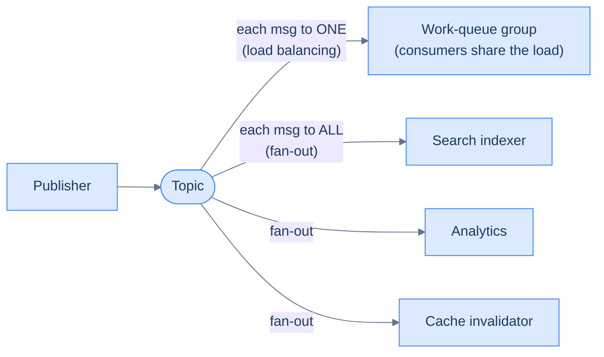
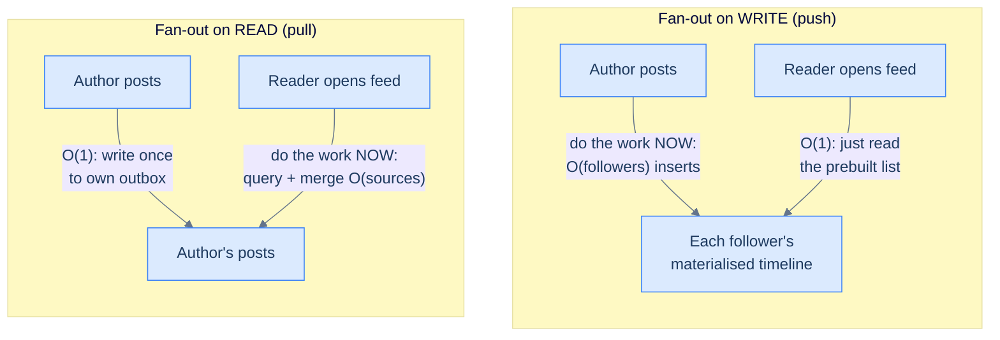
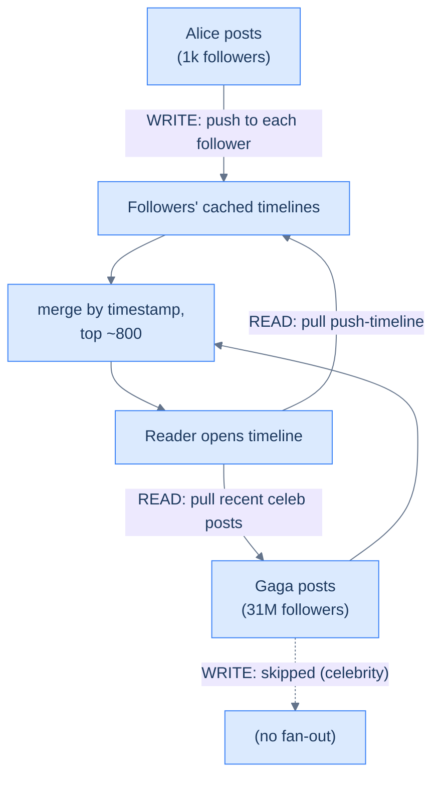

# 18. Pub/sub and fan-out

## TL;DR
> **Publish/subscribe** turns "send this message to one worker" (point-to-point, [Lesson 17](/cortex/system-design/distributed-patterns/message-queues-and-streams)) into "broadcast this event to everyone who cares." A publisher writes to a **topic**; every **subscriber** of that topic gets its own copy. The hard part is **fan-out**: when one event must reach a million recipients, *when* do you do the copying? **Fan-out on write** (push a copy into every recipient's inbox the moment the event happens) makes reads instant but buries you when one publisher has millions of followers. **Fan-out on read** (assemble each recipient's view on demand) makes writes cheap but reads expensive. The senior answer is almost always a **hybrid** — push for the common case, pull for the few accounts that would blow it up. And mind the delivery guarantee of your bus: some "pub/sub" (Redis Pub/Sub) is fire-and-forget and silently drops anything a subscriber misses.

## 1. Motivation

In 2013, Raffi Krikorian, then a VP of Engineering at Twitter, gave a talk called **"Timelines at Scale."** The numbers are a good shock to the system: ~150 million active users, **300,000 queries per second** just to *build* people's home timelines, and **400 million tweets a day** flowing through. When you open Twitter, the list you see is not computed by scanning everyone you follow right then — that would be hopeless at 300K QPS. Instead, each user's home timeline is **pre-computed and cached** (in a giant Redis cluster), so reading it is a fast lookup.

The catch is *writing* it. When you tweet, Twitter's fan-out service looks up all your followers and inserts your tweet's id into each of their cached timelines. Tweet to 20,000 followers, and that one tweet causes **20,000 inserts**. That's fine for you. It is not fine for Lady Gaga. Per the same talk, a tweet from an account with ~31 million followers could take **up to ~5 minutes** to finish propagating to every follower's timeline — because it's tens of millions of inserts for a single tweet, and if she tweets during a live event while millions of others do too, the fan-out machinery falls behind.

That tension — *reads want the work done ahead of time; writes can't afford to do it for the biggest publishers* — is the entire subject of this lesson. It shows up anywhere one event has many interested parties: feeds, notifications, chat, presence, live dashboards.

## 2. Intuition (Analogy)

Point-to-point messaging is a **phone call**: you dial one person, they pick up, the conversation is between the two of you.

Publish/subscribe is a **magazine**. The publisher prints an issue; everyone with a subscription gets a copy in their mailbox. The publisher doesn't know or care who the individual subscribers are — it just publishes to "the subscriber list" (the *topic*), and the distribution system handles the copies.

Now, *how* does the magazine reach a million mailboxes? Two strategies, and they're a genuine fork:

- **Fan-out on write** = the print shop runs off a million copies the instant the issue is ready and mails one to every subscriber. When a subscriber checks their mailbox (a read), the magazine is already there — instant. But "publishing" now means a million print-and-mail operations. For a niche newsletter with 500 subscribers, trivial. For a magazine with 31 million subscribers, the print shop is on fire.
- **Fan-out on read** = the print shop keeps the master copy; when a subscriber wants this month's issue, you assemble their bundle on demand at the newsstand. Publishing is now free (one master copy). But every *visit* does real work, and popular issues mean long queues at the newsstand.

Real systems mix the two: mail copies to the ordinary subscribers (cheap fan-out), but for the handful of *mega-publishers* whose every issue would mean tens of millions of copies, don't pre-mail — let readers pull those at the newsstand and merge.

## 3. Formal definitions

| Term | Meaning |
|---|---|
| **Point-to-point** | one message → exactly one consumer (a work queue, Lesson 17) |
| **Publish/subscribe** | one message → a *copy to every subscriber* of the topic |
| **Topic** | the named channel a publisher writes to |
| **Subscriber / subscription** | a consumer registered to receive a topic's messages |
| **Durable subscription** | the bus stores messages so an offline subscriber gets them on reconnect |
| **Ephemeral subscription** | fire-and-forget — miss it while offline and it's gone forever |
| **Fan-out** | the act of delivering one published event to its N recipients |

### Two ways many consumers can read one topic

There's a subtlety worth nailing before we go further, because the word "consumer" hides two completely different intentions. *Designing Data-Intensive Applications* (Ch. 12) draws the line cleanly: when several consumers read the same topic, you mean one of two things.

- **Load balancing** — each message goes to *exactly one* of the consumers, so they *share* the work. This is the point-to-point work queue of [Lesson 17](/cortex/system-design/distributed-patterns/message-queues-and-streams) — you add consumers to go faster, and each message is processed once. It is *not* pub/sub.
- **Fan-out** — each message is delivered to *all* the consumers. Each one "tunes in" to the same broadcast independently, without affecting the others; DDIA likens it to several batch jobs reading the same input file. *This* is publish/subscribe.

The two compose. Kafka's **consumer groups** are the canonical example: messages are load-balanced *within* a group (the group as a whole processes each message once), but *across* groups it's fan-out (every group sees every message). So a single Kafka topic can feed your search-indexer group, your analytics group, and your cache-invalidator group — each group an independent subscriber, each scaling its own consumers internally. One topic, both patterns at once.



<p align="center"><strong>One topic, two patterns: load balancing shares work among a group; fan-out broadcasts to every independent subscriber. Kafka consumer groups do both at once.</strong></p>

### The fan-out strategies

| Strategy | When the work happens | Write cost | Read cost | Best when |
|---|---|---|---|---|
| **Fan-out on write** (push) | at publish time, into each recipient's materialised view | O(recipients) per event | O(1) — view is pre-built | reads ≫ writes; bounded follower counts |
| **Fan-out on read** (pull) | at read time, by querying sources and merging | O(1) per event | O(sources) per read | writes ≫ reads; or huge/unbounded fan-out |
| **Hybrid** | push for most, pull for the few mega-publishers | O(normal followers) | O(1 + few celebrities) | the real world (skewed follower distributions) |

The key realisation: fan-out-on-write and fan-out-on-read are the *same total work*, just paid at different times and amortised differently. Push pays once per follower per post; pull pays once per follower per *read*. Which is cheaper depends entirely on the read:write ratio — exactly the back-of-envelope reflex from [Lesson 3](/cortex/system-design/foundations/back-of-envelope-estimation).



<p align="center"><strong>Same total work, paid at different moments: push front-loads it onto every write; pull defers it onto every read. The read:write ratio decides which hurts less.</strong></p>

## 4. Worked Example — a timeline that survives a celebrity

Model a feed. Each user has a **home timeline** (a cached list of recent post-ids from people they follow). DDIA gives this cache its proper name: it is a **materialized view** — the precomputed result of the query *"give me recent posts by everyone I follow,"* kept up to date so a read is a cache lookup instead of a 200-way join. The push fan-out is the process that keeps that materialized view current; DDIA calls the multiplier the **fan-out factor**. At ~5,800 posts/sec with an average fan-out factor of 200, that's ~1 million timeline writes/sec — heavy, but a huge saving over the ~400 million per-author lookups/sec you'd pay if every reader pulled instead (2M timeline loads/sec × 200 followed accounts). That ratio is the whole argument for push, and it's the [Lesson 3](/cortex/system-design/foundations/back-of-envelope-estimation) reflex in action.

Two users make the tension concrete:

- **Alice** — 1,000 followers. She posts. Fan-out on write: look up her 1,000 followers, insert the post-id into each of their cached timelines. 1,000 small writes, done in well under a second. Anyone who opens their timeline sees it instantly. 
- **Gaga** — 31,000,000 followers. She posts. Fan-out on write means **31 million inserts for one post.** During a quiet hour that's slow; during a live awards show, when she *and* millions of others are all posting, the fan-out queue backs up and her post takes minutes to reach everyone. **This is the failure case** — the fan-out service is melting under a single high-follower publisher, and *everyone's* timeline freshness suffers because the queue is shared.

**The hybrid fix (Twitter's documented approach).** Don't fan out the mega-accounts on write at all. Pick a follower threshold (publicly discussed around the tens of thousands), and:

- For a normal author (under the threshold): push as before — fan out on write into followers' timelines.
- For a celebrity (over the threshold): **skip the write fan-out.** Their posts are *not* pushed.
- At **read** time, when a user opens their home timeline, do two things in parallel and merge: (1) read their pre-materialised push timeline, and (2) pull the recent posts of the *few* celebrities they follow directly. Merge by timestamp, return the top N (Twitter capped the home timeline at ~800 entries).

A user follows maybe 2–3 celebrities, so the read-time pull is cheap (a handful of extra fetches), while the write side is spared tens of millions of inserts per celebrity post. The expensive operation moved from "31M writes per Gaga post" to "2–3 extra reads per timeline load" — and there are far fewer celebrity *posts* than timeline *reads-of-celebrity-followers*... which is exactly why you have to run the back-of-envelope numbers rather than trusting a rule.



<p align="center"><strong>Hybrid fan-out: push for the many ordinary authors, pull-at-read for the few celebrities, merge on read.</strong></p>

## 5. Build It

The hybrid, as an illustrative pair of functions (Python; the threshold branch is the whole idea):

```python
CELEB_THRESHOLD = 50_000

def on_post(author, post_id):
    followers = social_graph.followers(author)
    if len(followers) < CELEB_THRESHOLD:
        # push fan-out: write into each follower's cached timeline
        for f in followers:
            timeline_cache.prepend(f, post_id)        # O(followers) writes
    # else: celebrity → do NOTHING on write; readers will pull at read time

def home_timeline(user):
    pushed = timeline_cache.get(user)                  # pre-materialised (push authors)
    celebs = [a for a in following(user) if is_celebrity(a)]
    pulled = [p for a in celebs for p in recent_posts(a)]  # pull the few celebs live
    return merge_by_time(pushed, pulled)[:800]         # merge + cap
```

Flip `CELEB_THRESHOLD` to infinity and you have pure fan-out-on-write (and Gaga melts the writer). Flip it to zero and you have pure fan-out-on-read (every read scans everyone you follow — fine until someone follows 5,000 accounts). The threshold is the dial between the two regimes.

## 6. Trade-offs

Beyond write-vs-read, the second decision is *which bus* carries the pub/sub, and they differ sharply in durability:

| Bus | Delivery | Persistence | Fan-out style | Use when |
|---|---|---|---|---|
| **Kafka topic** ([L17](/cortex/system-design/distributed-patterns/message-queues-and-streams)) | at-least-once | retained (replayable) | each consumer group reads all | durable event fan-out, replay, many systems |
| **Redis Pub/Sub** | **at-most-once (fire-and-forget)** | **none** | live subscribers only | low-latency ephemeral signals where loss is OK |
| **Redis Streams** | at-least-once | retained | consumer groups | durable, lightweight, in one Redis you already run |
| **AWS SNS (+SQS)** | at-least-once | via subscribed queues | push to many SQS/HTTP/Lambda | managed fan-out to multiple downstreams |
| **Google Cloud Pub/Sub** | at-least-once | retained (configurable) | many subscriptions | managed, durable, cross-service |

The trap worth burning into memory: **Redis Pub/Sub is at-most-once and stores nothing.** If a subscriber is disconnected when you `PUBLISH`, the message is gone for that subscriber *forever* — there is no replay. It's wonderful for "live cursor position" or "someone is typing…" signals where a dropped message doesn't matter, and a footgun for anything you can't afford to lose. When you need durability in Redis, reach for **Streams**, not Pub/Sub (a distinction we already met as queue-vs-log in Lesson 17).

**When ephemeral is exactly right (a worked counter-example).** Fire-and-forget is not a defect when staleness is self-healing. *System Design Interview Vol. 2* designs a "nearby friends" feature on Redis Pub/Sub precisely *because* of its weaknesses: every user gets a channel, friends subscribe to it, and location updates are published continuously. If you're offline, you miss updates — but the *next* update overwrites the position a second later anyway, so a dropped message costs nothing. Better still, publishing to a channel with no subscribers is a no-op that the server drops for almost zero cost, so an idle channel burns no CPU. The very property that makes Pub/Sub wrong for notifications (lose it and it's gone) makes it ideal for a stream of continuously-refreshed values. The lesson generalises: ephemeral pub/sub fits *latest-value-wins* signals (presence, telemetry, cursors, live location); durable buses fit *every-event-matters* streams (notifications, orders, audit logs).

## 7. Edge cases and failure modes

- **The celebrity hot fan-out.** The headline case above. A single high-follower publisher turns one write into tens of millions. Hybrid push/pull is the standard remedy; the threshold is a tuning knob, not a constant.
- **Ephemeral pub/sub silently drops messages.** With Redis Pub/Sub (or any fire-and-forget bus), an offline or slow subscriber misses messages with no error and no replay. If "the subscriber must eventually get every event" is a requirement, you need a *durable* bus — using ephemeral pub/sub here is a data-loss bug that looks like nothing in testing.
- **Fan-out amplification overwhelms downstreams.** One published event can trigger millions of downstream writes (timelines, push notifications, emails). When producers outrun consumers, DDIA says you have exactly three moves: **drop** messages, **buffer** them in a queue, or apply **back-pressure** (block the producer until consumers catch up). Pick deliberately — silently buffering an unbounded queue just moves the failure from "now" to "when the disk fills." Without one of the three, a viral post is a self-inflicted DDoS on your own infrastructure. DDIA also notes a feed-specific escape hatch: for a user who follows tens of thousands of accounts, you can simply *drop some of their timeline writes* and show a sample — they were never going to read all of it. (That trick is only safe for ordinary high-follow readers; you may **not** drop a celebrity's writes, because those land in millions of *different* timelines.)
- **Thundering herd on a hot pull.** Fan-out-on-read for a viral item means every reader pulls the same source at once — a cache stampede on that source. Cache the hot pulls; coalesce them (the exact pattern from [Lesson 8 — caching](/cortex/system-design/building-blocks/caching)).
- **Ordering across the merge.** A merged timeline must sort push and pull results into one coherent order. Wall-clock timestamps drift between machines; production systems use a monotonic id (e.g. a Snowflake id that embeds time) so the merge is stable and gap-free.
- **Read-your-own-writes.** If you post and fan-out lags, you might not see your own post in your timeline — which feels broken. Special-case the author's own view to include their just-posted item immediately, independent of fan-out progress.
- **Nobody owns the event schema.** Pub/sub *decouples* publisher from subscribers — which means no one is forced to agree on the message format. A publisher adds, renames, or retypes a field; subscribers parsing the old shape break silently, often days later. This quietly kills long-lived pub/sub systems. The fix is to treat the event as a **versioned public contract** and enforce it with a **schema registry** (e.g. Confluent Schema Registry with Avro/Protobuf) that rejects incompatible changes — backward-compatible (old consumers still read new events) and forward-compatible (new consumers read old events).
- **Subscription leaks.** Subscribers that crash without unsubscribing leave dangling subscriptions; over time the topic fans out to ghosts. Expire idle subscriptions and reconcile the subscriber set.
- **One slow downstream poisons the rest.** When a fan-out delivers to several heterogeneous channels (iOS push, Android push, SMS, email), a single flaky provider can back up a shared queue and starve every other channel. *System Design Interview Vol. 1*'s notification design isolates them: a **separate queue per channel**, so an APNS outage backs up only the iOS queue while SMS and email keep flowing — the same bulkhead instinct as per-tenant queues. Pair it with a **retry path** (failed sends go back on the queue, or to a dead-letter queue after N attempts) so a transient provider blip doesn't drop the message; just be ready for the duplicates retries create — which is precisely the handoff to [Lesson 19](/cortex/system-design/distributed-patterns/idempotency-retries-backoff).

## 8. Practice

> **Exercise 1 — Pick the fan-out strategy.**
> For each, choose push, pull, or hybrid, and justify with the read:write ratio: (a) a group chat of 8 people; (b) a notification system where any user can have up to 100M followers; (c) an internal "deploy finished" event consumed by 5 dashboards.
>
> <details>
> <summary>Solution</summary>
>
> (a) **Push.** 8 recipients per message is trivial fan-out-on-write; reads should be instant. (b) **Hybrid.** The 100M-follower tail forces pull-at-read for the mega-accounts; push the rest. Pure push melts on the celebrity; pure pull punishes everyone's reads. (c) **Push (or plain pub/sub).** 5 subscribers is nothing; broadcast to all 5. The whole "fan-out problem" only exists when the recipient count is large *and* skewed — for small bounded fan-out, just push and move on.
>
> </details>

> **Exercise 2 — The wrong bus.**
> A team builds "in-app notifications" on Redis Pub/Sub: when something happens, they `PUBLISH` to `notify:<user_id>`, and the user's open browser tab is subscribed. It works in the demo. In production, users complain that notifications "randomly go missing." What's happening, and what do you change?
>
> <details>
> <summary>Solution</summary>
>
> Redis Pub/Sub is **at-most-once, fire-and-forget**. Any user whose tab is closed, asleep, or momentarily disconnected when the `PUBLISH` fires **never receives that notification** — it isn't stored or retried. "Randomly missing" = exactly the offline/disconnected subscribers. Fix: use a **durable** mechanism — write the notification to a store (or a Redis **Stream** / Kafka topic with a per-user durable subscription) so a reconnecting client can fetch what it missed. Pub/Sub can still carry the *live ping* ("you have a new notification"), but the source of truth must be durable.
>
> </details>

> **Exercise 3 — Fan-out write amplification.**
> A social app has 10M daily posters, each averaging 200 followers, posting 2× per day. Estimate the daily fan-out-on-write inserts. Then a feature ships that lets users follow "topics," and the average following jumps to 5,000. What happens, and which design lever do you pull?
>
> <details>
> <summary>Solution</summary>
>
> Baseline: 10M posters × 2 posts × 200 followers = **4 billion timeline inserts/day** (~46K inserts/sec average, far higher at peak) — heavy but survivable with push. After the jump to 5,000 average followers: 10M × 2 × 5,000 = **100 billion inserts/day** (~1.16M/sec average) — a 25× increase that will overwhelm the writers and the cache. Lever: shift toward **fan-out on read / hybrid** as average fan-out grows — the economics that favoured push (small follower counts) just inverted. This is the same numbers-drive-the-architecture lesson as [Lesson 3](/cortex/system-design/foundations/back-of-envelope-estimation); the design that's right at 200 followers is wrong at 5,000.
>
> </details>

## Your Turn

Before you move on, check your understanding with the coach — explain the idea, apply it, weigh the trade-offs, then defend your reasoning.

<div class="concept-coach"></div>

## In the Wild

- **[Raffi Krikorian — "Timelines at Scale"](https://www.infoq.com/presentations/Twitter-Timeline-Scalability/)** (Twitter, InfoQ, 2013) — the canonical fan-out talk: 300K QPS to build timelines, Redis-backed home timelines (capped ~800), and the push-most/pull-celebrities hybrid. Everything in this lesson traces back to it.
- **[Redis — Pub/Sub documentation](https://redis.io/docs/latest/develop/pubsub/)** — read the line about delivery: Pub/Sub is fire-and-forget with no persistence. The clearest statement of "this bus loses messages by design."
- **[Redis — Streams](https://redis.io/docs/latest/develop/data-types/streams/)** — the durable counterpart, with consumer groups and at-least-once delivery. The right tool when Pub/Sub's at-most-once isn't acceptable.
- **[AWS — SNS fan-out to SQS](https://docs.aws.amazon.com/sns/latest/dg/sns-common-scenarios.html)** — the managed "one publish, many durable subscribers" pattern (SNS topic → multiple SQS queues), and the standard way to fan out durably on AWS.
- **[Google Cloud Pub/Sub — architecture](https://cloud.google.com/pubsub/docs/overview)** — a managed, durable pub/sub with per-subscription retention; a good contrast to Redis Pub/Sub's ephemerality.
- **Kleppmann, *Designing Data-Intensive Applications* (2nd ed.), Ch. 2 & 12** — the ground truth here: Ch. 2's social-network case study (materialized timelines, the fan-out factor, the celebrity exception) and Ch. 12's pub/sub taxonomy (load balancing vs. fan-out, consumer groups, the drop/buffer/back-pressure choice).
- **Alex Xu, *System Design Interview* Vol. 1 (Ch. 11 News Feed, Ch. 10 Notification System) & Vol. 2 (nearby-friends, Redis Pub/Sub)** — the supplementary source for the concrete numbers and patterns: push/pull/hybrid fan-out, the hotkey (celebrity) problem, per-channel notification queues with retries, and ephemeral Pub/Sub used correctly for live location.

---

> **Next:** [19. Idempotency, retries, and backoff](/cortex/system-design/distributed-patterns/idempotency-retries-backoff) — fan-out, retries, and at-least-once delivery all create the same hazard: the same operation happening twice. Next we make "twice is harmless" a first-class design goal, and see why a naïve retry storm is how a small blip becomes a full outage.
